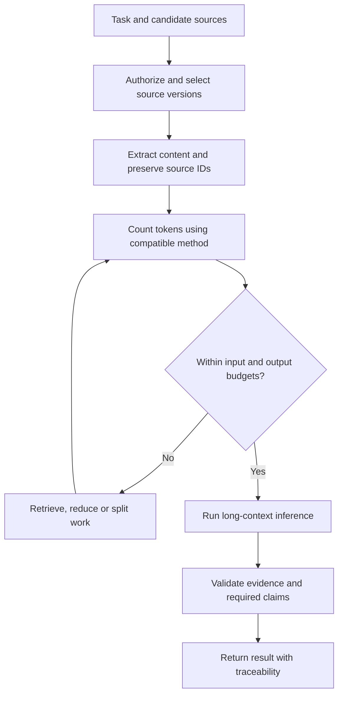
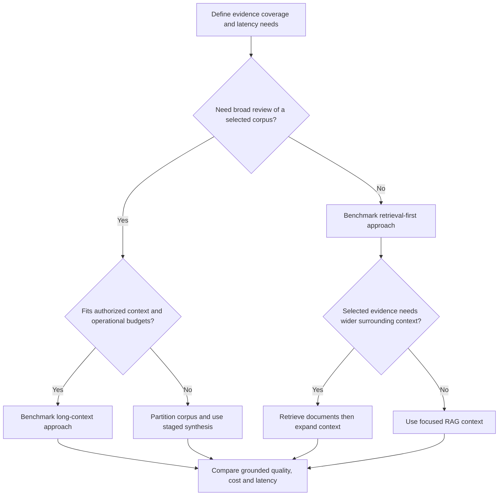
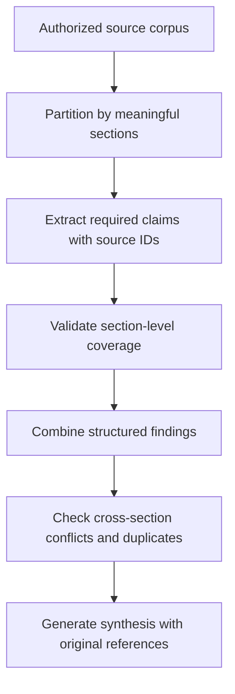
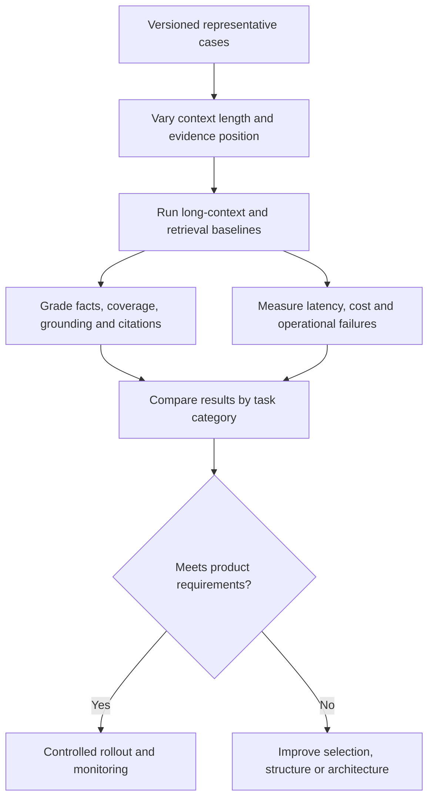

# One-Million-Token Context Windows in LLMs — Interview Guide

**Audience:** Developers preparing for AI application, RAG, and agent engineering interviews.

**Core answer:** A 1M context window means a model supports roughly one million tokens of context under its documented limits. It does not mean one million words, unlimited output, permanent memory, or perfect comprehension of every supplied fact.

This guide explains architecture-independent concepts. Model support, exact capacities, pricing, output limits, and multimodal accounting depend on the selected model and API. References were checked on October 6, 2026. All numerical cost and memory examples are hypothetical.

## 1. What does a 1M context window mean?

It describes the capacity of the sequence a model can process. That sequence may include instructions, documents, conversation history, tool results, and generated output, depending on the API's limit definitions.

Providers may advertise an input limit rather than a combined input/output limit. Some capacities marketed as “1M” are not exactly 1,000,000 tokens. Read the model's documented limits.

**Interview answer:**

> A one-million-token context window lets a model accept very large context, but I verify whether the advertised limit is input-only or combined, reserve output capacity, and evaluate effective task performance rather than assuming perfect recall.

## 2. Is one million tokens equal to one million words?

No. A tokenizer splits text into units that can be words, fragments, punctuation, or other representations.

For rough English planning only, if a corpus averages 1.33 tokens per word:

```text
1,000,000 / 1.33 ≈ 752,000 words
```

That assumption can be wrong for code, numbers, other languages, and document formatting. There is no universal page conversion. A page with tables differs from a prose page.

Count the actual extracted content using a compatible tokenizer or provider token-counting method.

## 3. What consumes the context budget?

| Item | Example |
|---|---|
| Instructions | Role and task constraints |
| Tools and schemas | Function definitions and JSON output requirements |
| Documents | Manuals, source code, reports |
| Conversation | User and assistant turns |
| Tool observations | Search results and API responses |
| Multimodal inputs | Images, audio, video, where supported |
| Generation | Response and possibly reasoning allocation, per API rules |

Uploaded files are not automatically free context. A file reference may trigger content processing that counts toward the request limits.

## 4. How should you budget a large request?

For a hypothetical combined limit of exactly 1,000,000 tokens:

| Allocation | Tokens |
|---|---:|
| Instructions, tools, schema | 10,000 |
| Source material | 850,000 |
| History and task state | 30,000 |
| Current question | 2,000 |
| Reserved output | 20,000 |
| Headroom | 88,000 |
| **Total** | **1,000,000** |

This is an illustration, not a recommended universal allocation. A separate output cap may be much smaller than the context window.

```text
For a combined-limit API:
Input + reserved output + margin <= supported total

Also enforce:
Input <= separate input limit, if any
Output <= separate output limit
```

Do not fill every available token without a task-specific reason.

## 5. What is the request-processing flow?



Extraction quality matters: passing a million tokens of corrupted OCR does not create a reliable system.

## 6. How does a transformer process long context?

In a typical decoder-only transformer, input tokens become representations, positional information supplies ordering, attention layers combine available information, and the model predicts output tokens sequentially.

Two broad inference phases:

| Phase | Purpose |
|---|---|
| Prefill | Process input and construct inference state |
| Decode | Generate output tokens using available context/state |

Large inputs increase prefill work and serving resources. Attention implementation and model architecture strongly affect actual performance.

**Interview answer:**

> I distinguish input processing from output generation. A short output can still have high latency when its input is enormous.

## 7. What is the computational challenge?

For dense full self-attention, attention-score work scales approximately with the square of sequence length during prefill, holding other dimensions fixed.

```text
Dense full-attention work: approximately O(n²)
```

Moving from 100K to 1M tokens is a 10× sequence increase and a 100× increase in the quadratic term. This does not imply every deployed model becomes exactly 100× slower.

Efficient kernels, sparse or local attention, architecture choices, hardware parallelism, and serving strategies change real costs. Memory-efficient attention can avoid materializing the full attention matrix without eliminating all quadratic computation.

Do not infer a proprietary model's internal architecture from its advertised window.

## 8. Why does the KV cache matter?

A transformer KV cache stores keys and values from attention layers so generation can reuse previous computation. Long sequences can make this cache a major memory bottleneck. See [Hugging Face KV cache strategies](https://huggingface.co/docs/transformers/kv_cache).

For a simplified architecture retaining full KV state:

```text
KV bytes ≈ 2 × layers × sequence length × KV heads
           × head dimension × bytes per element × batch size
```

The factor 2 accounts for keys and values.

Hypothetical values: 32 layers, 1M tokens, 8 KV heads, head dimension 128, 2-byte values, batch size 1:

```text
2 × 32 × 1,000,000 × 8 × 128 × 2
= 131,072,000,000 bytes
≈ 131 GB decimal, or 122 GiB
```

This excludes model weights, activations, buffers, and other overhead. Real architectures can use different storage, attention patterns, quantization, or distribution.

## 9. Does 1M context mean perfect recall?

No. Supported capacity is not a guarantee of reliable retrieval, synthesis, counting, or reasoning.

A model may locate one explicit fact successfully yet miss a contradiction across many documents.

**Interview answer:**

> I evaluate effective context use on the actual task. Finding a single hidden fact is different from exhaustive extraction or reasoning across dispersed evidence.

Long-context research has shown sensitivity to evidence position in some models and tasks, including the “lost in the middle” effect. See [Lost in the Middle](https://arxiv.org/abs/2307.03172). Do not assume the same failure rate for every newer model.

## 10. What is a needle-in-a-haystack test?

It inserts a known fact into a large body of material and asks the model to retrieve it.

Useful variables include context length, fact position, distractors, repeated similar facts, and wording differences.

It tests a narrow capability. It does not establish that the model can:

- Find every qualifying item.
- Combine several distant facts.
- Apply changing authority rules.
- Produce a faithful global summary.
- Detect all inconsistencies.

Include multi-evidence and exhaustive tasks in application evals.

## 11. Why do contradictory documents create problems?

More context may include obsolete versions, draft policies, and unrelated tenants' data.

Example:

```text
Policy v1: Refund window is 30 days.
Policy v2: Refund window is 14 days.
```

The application should identify the authoritative version through trusted metadata and rules. Asking the model to infer authority from text alone is fragile.

Preserve version, effective date, document status, and source ID. Exclude irrelevant or unauthorized sources before inference.

## 12. Does long context replace RAG?

Not universally.

| Requirement | Long context may fit | RAG may fit |
|---|---|---|
| Whole-document review | Selected corpus fits and broad coverage matters | Retrieval may miss global relationships |
| Narrow question over huge corpus | Can work, but may be inefficient | Select relevant evidence |
| Frequently updated sources | Reload approved content | Update index and retrieve current versions |
| Many users and requests | Evaluate repeated-input economics | Often smaller request context |
| Access control | Authorize every included source | Enforce filters during retrieval |
| Precise source references | Preserve source structure | Preserve chunk/document metadata |

Both require grounding evaluation. Long context can reduce retrieval selection errors, but can introduce more distractors and higher processing costs.

## 13. How do you choose long context, RAG, or a hybrid?



A hybrid can retrieve relevant documents first and then provide larger sections or full selected documents. This preserves a manageable corpus while supporting wider interpretation.

## 14. How should you structure a very long prompt?

Use clear source boundaries and stable identifiers:

```text
Document ID: DOC-42
Version: 3
Section: 5.2
Content: ...

Document ID: DOC-57
Version: 1
Section: 2.1
Content: ...
```

State the task precisely, define required outputs, and distinguish evidence from instructions. Prompt placement should be tested; no arrangement guarantees reliable long-context use.

A source manifest helps traceability, but is not an access-control mechanism. Preserve originals so reviewers can verify cited passages.

Google's [long-context guidance](https://ai.google.dev/gemini-api/docs/long-context) discusses applications and considerations for very large inputs. Check its model-specific guidance before implementation.

## 15. Can the model summarize a million tokens accurately?

It can attempt the task, but a concise summary necessarily discards detail. Evaluate what must be retained.

For comprehensive review, use structured extraction or staged synthesis:



Intermediate summaries can lose facts or introduce errors. Retain original evidence and explicit coverage requirements. A hierarchical pipeline is not automatically more accurate; compare it experimentally.

## 16. What are the cost implications?

A simplified cost estimate:

```text
Cost = uncached input × input rate
       + cached input × cached-read rate
       + output × output rate
       + applicable cache writes/storage/tool charges
```

**Hypothetical pricing, not a provider quote:**

- Input: $2 per million tokens.
- Output: $8 per million tokens.
- One request: 900,000 input tokens and 5,000 output tokens.

```text
Input cost = 0.9 × $2 = $1.80
Output cost = 0.005 × $8 = $0.04
Total = $1.84

1,000 such requests = $1,840
```

Some providers have long-input price tiers. Check the actual model, deployment, region, and pricing schedule. Compare cost per successful task, not cost per request alone.

## 17. Can prompt caching help?

Yes, if a large eligible input portion is reused. It can reduce repeated input computation and cost under provider-specific rules.

It does not:

- Remove cached tokens from logical context capacity.
- Store a final answer automatically.
- Make output deterministic.
- Guarantee a hit.
- Eliminate decoding or external tool work.

Measure cached-token usage, writes/storage where applicable, and cold versus warm latency. Keep authorization and source freshness current even when aiming for reuse.

## 18. What are the latency and throughput implications?

A long request can have high time to first token because of prefill. Streaming improves delivery after generation starts but does not remove prefill work.

Measure p50/p95 total latency, first-token latency, token throughput, queueing, and concurrency.

**Illustrative quota arithmetic:** If a deployment had a usable 2M input-token-per-minute allowance, two 900K-token requests would consume most of that allowance. Actual enforcement may account for other token reservations and burst limits.

Do not size capacity only by requests per minute. A few very large requests can stress token quotas and serving resources.

## 19. Does 1M context give permanent memory?

No. It increases available working context, not durable application memory.

| Concept | Meaning |
|---|---|
| Context window | Capacity for the active sequence |
| Conversation storage | Persisted messages managed by a service/application |
| Task database | Authoritative goals, state, and operations |
| Model parameters | Trained representations |
| Prompt cache | Temporary inference reuse |

An API may retain conversation state, but active model context still has limits and may be selected or compacted. Critical state should be stored independently.

## 20. How does it affect agents?

A larger window permits more observations and history, but does not justify unbounded agent loops.

Keep step, time, cost, and tool-result limits. Avoid repeatedly sending huge irrelevant logs. Preserve verified state in durable storage and selectively load observations.

**Interview answer:**

> A large context gives an agent more working material, but action reliability still depends on tools, permissions, state management, and evaluation. I compact or retrieve history when it improves relevance, even before reaching the hard limit.

## 21. How do you evaluate a 1M-context application?



Include single-fact retrieval, multiple distant facts, exhaustive lists, numerical comparisons, contradictions, missing evidence, prompt injection, and unauthorized sources.

Repeat important cases and report uncertainty. A perfect score on a small synthetic benchmark is not a production guarantee.

## 22. What are the security risks?

A larger input can expose more sensitive data and more malicious instructions.

Controls include:

- Authorize sources before inclusion.
- Minimize unnecessary data.
- Treat document instructions as untrusted content.
- Restrict logs and retained payloads.
- Check data residency and provider retention policies.
- Enforce tool permissions outside the model.
- Keep tenants and source versions separated.

A long context window is not permission to upload the entire enterprise corpus.

## 23. How would you implement this in .NET and Azure?

Proposed components:

| Component | Responsibility |
|---|---|
| ASP.NET Core API | Authentication, task submission, status |
| Source-selection service | Authorized documents and versions |
| Extraction worker | Text/OCR processing and source locations |
| Token-budget service | Compatible counting and request checks |
| Context builder | Source boundaries, instructions, evidence |
| Model adapter | Model-specific request and limits |
| Validation service | Required claims, schema, source support |
| Telemetry | Tokens, latency, cost, failures |

Long-running work may use a background job with cancellation and status reporting. Async processing improves application responsiveness; it does not reduce inference cost by itself.

Illustrative C# contract:

```csharp
public sealed record ContextBudget(
    long MaxInputTokens,
    long? MaxCombinedTokens,
    long ReservedOutputTokens,
    long SafetyMarginTokens);

public interface IContextBudgetValidator
{
    Task<BudgetCheck> ValidateAsync(
        PreparedModelRequest request,
        ContextBudget budget,
        CancellationToken cancellationToken);
}
```

Types are application-defined. Confirm whether the chosen Azure deployment actually supports the required capacity; a product-level claim does not establish deployment support.

## 24. How would this apply to Protocol Pro?

A proposed use is reviewing a selected set of authorized study documents for wider consistency, such as participant counts or endpoint terminology across sections.

For a narrow drafting task, focused retrieval may still be the better starting point.

Compare:

1. Section-focused RAG.
2. Larger selected-document context.
3. Structured extraction followed by cross-section checks.

Require original source references and expert review. Do not claim exhaustive consistency or regulatory compliance from window size alone. Present measured capabilities separately from proposed improvements.

## 25. What are common interview traps?

| Incorrect claim | Better explanation |
|---|---|
| 1M tokens means 1M words | Tokenization varies |
| 1M input means 1M output | Output limits are separate |
| The model remembers forever | Context is working input, not permanent memory |
| Every included fact is understood | Effective performance needs evaluation |
| Long context makes RAG obsolete | Choose based on task and economics |
| Cached context is outside the window | It still uses logical context capacity |
| All attention implementations scale identically | Architecture and kernels matter |
| Streaming eliminates long-input latency | Prefill still happens |
| More documents always improve accuracy | Distractors and conflicts can hurt |
| Large-context support guarantees deployment capacity | Check model, API, quotas, and region |

## 26. Give a 60-second interview answer

> A one-million-token context window lets a model work with very large input, but I verify input, output, and combined limits for the actual API. Tokens are not words, and capacity is not perfect comprehension or permanent memory. Large inputs increase prefill work, serving memory, cost, and quota pressure. I compare long context with focused RAG and hybrid retrieval on representative tasks, including dispersed evidence, contradictions, and exhaustive extraction. I preserve source IDs, enforce permissions before inclusion, and measure grounding, coverage, latency, and cost. Prompt caching can help repeated context, but it does not remove context limits or replace evaluation.

## Practical interview demo

Use a non-confidential corpus and compare several context sizes against a RAG baseline. Show one-fact retrieval, multi-document reasoning, missing evidence, and source citations. Record actual token usage, cold/warm latency, and cost. Report the model configuration and limitations.

## References

- [Google AI: Long context](https://ai.google.dev/gemini-api/docs/long-context)
- [Hugging Face: KV cache strategies](https://huggingface.co/docs/transformers/kv_cache)
- [Research: Lost in the Middle](https://arxiv.org/abs/2307.03172)

## Markdown rendering

Four Mermaid flowcharts are included. GitHub supports Mermaid; other static-site generators may require it to be enabled.
