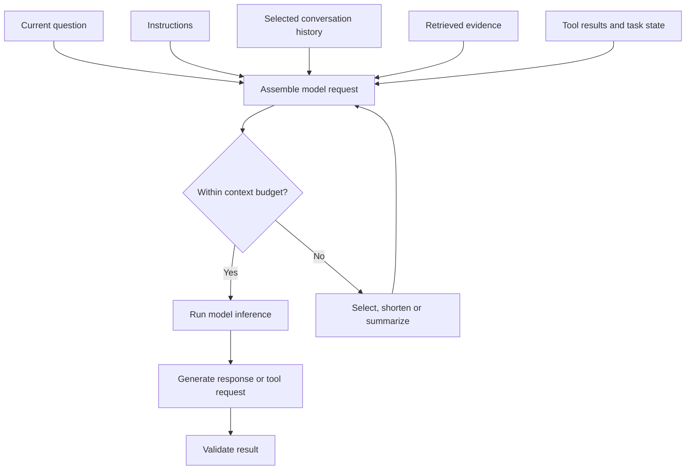
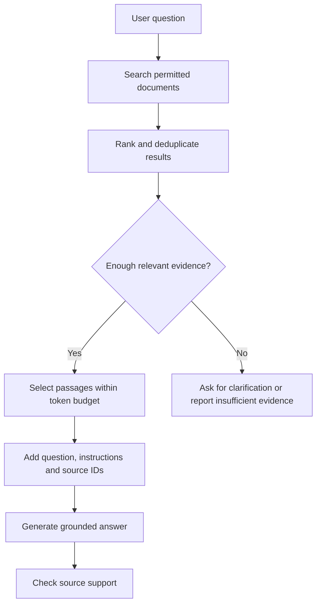
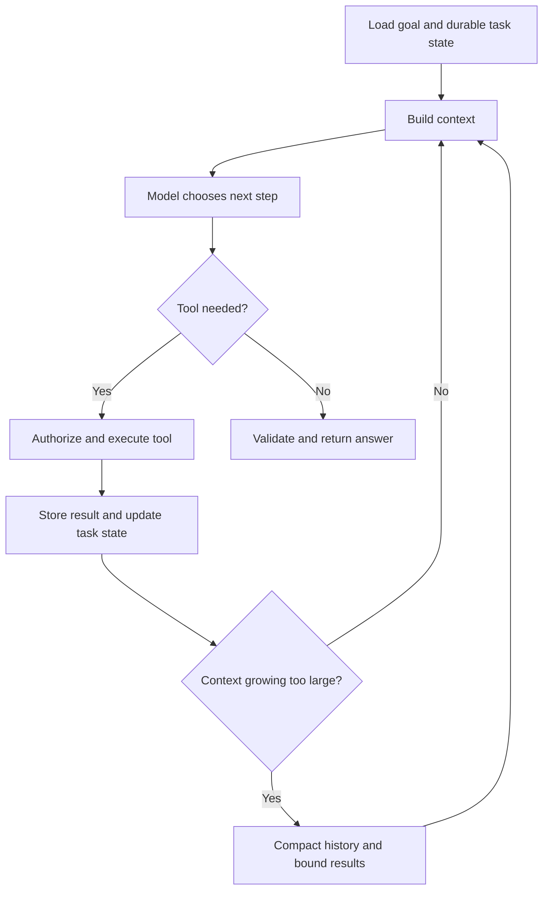

# Context in LLMs — AI Engineering Interview Guide

Context is the information available to an LLM when it generates a response. It can include instructions, the current question, conversation history, retrieved documents, and tool results.

For an AI engineering interview, explain what context contains, how the model uses it, and how you manage it reliably in a production application.

## 1. What is context in an LLM?

Consider this question:

```text
Can I cancel it?
```

Without additional information, “it” is ambiguous. Now provide context:

```text
Order: ORD-1001
Status: Not shipped
Policy: Orders can be cancelled before shipment.
Question: Can I cancel it?
```

The model now has information needed to answer.

**Interview answer:**

> Context is the information supplied to the model for the current inference. It guides how the model interprets the request and generates a response. Application code assembles that context from instructions, conversation history, retrieved evidence, and tool results.

Context is temporary input. Supplying information in a prompt does not normally update the model’s trained parameters.

## 2. What can be included in context?

| Component | Purpose | Example |
|---|---|---|
| System or developer instructions | Define behavior and constraints | Answer using provided evidence |
| Current user message | Defines the immediate request | Explain this error |
| Conversation history | Supports continuity | Earlier code and follow-up questions |
| Retrieved evidence | Supplies external knowledge | Relevant company policy passages |
| Tool definitions | Describe available operations | `GetOrderStatus(orderId)` |
| Tool results | Supply observations | Current order status |
| Task state | Tracks progress | Completed steps and pending actions |
| Examples | Demonstrate expected behavior | Sample input/output pairs |
| Output schema | Defines response structure | Required JSON fields |

For multimodal models, context may also contain images, audio, or other supported inputs. Their accounting depends on the model and API.

## 3. How does context reach the LLM?

The application constructs a request containing selected information.



**Engineering responsibility:** Decide what is relevant, authorized, current, and worth including.

The model cannot use a document merely because it exists in Blob Storage. The application must retrieve its content or make it accessible through an appropriate tool.

## 4. What is a context window?

The context window is the capacity supported by the model for processing a sequence of information.

For a typical autoregressive text model, input and generated output must fit within the supported total sequence capacity, with additional API-specific limits.

An illustrative budget:

| Item | Tokens |
|---|---:|
| Instructions and tool definitions | 2,000 |
| Conversation history | 4,000 |
| Retrieved evidence | 12,000 |
| Current question | 500 |
| Reserved output | 4,000 |
| Safety margin | 1,500 |
| **Total planned budget** | **24,000** |

These are example values, not specifications for a particular model.

```text
Input tokens + reserved output tokens + safety margin
    <= supported context capacity
```

Check the selected API’s rules, including whether reasoning tokens consume the output allocation.

**Interview answer:**

> I budget for the complete request and expected response. I also check separate input and output limits rather than assuming the advertised context window is entirely available for documents.

## 5. Are tokens the same as words?

No. A token can represent a word, part of a word, punctuation, or another unit.

```text
Text → Tokenizer → Token IDs → Model
```

Token counts vary with language, code and identifiers, numbers and punctuation, and the model’s tokenizer.

**Practical implication:** Count tokens using a compatible tokenizer or provider-supported method. Character counts are only an estimate.

## 6. How does the model use context internally?

In a typical decoder-only transformer:

1. Input is tokenized.
2. Tokens are converted into internal representations.
3. Positional information represents sequence order.
4. Attention layers combine information from permitted token positions.
5. The model predicts the next token.
6. Generated tokens become part of the sequence for subsequent generation.

Attention helps the model use relationships within the context. It is not an external search engine and does not guarantee correct interpretation.

**Interview answer:**

> The model conditions its output on the supplied sequence. Attention lets token representations incorporate information from other available positions, while generation continues one token at a time.

## 7. What is the difference between context, knowledge, and memory?

| Concept | Meaning | Persistence |
|---|---|---|
| Context | Information available for the current inference | Limited to what the request/runtime supplies |
| Trained knowledge | Patterns encoded in model parameters | Persists until the model changes |
| Application memory | Information stored outside the model | Depends on application storage |
| Conversation history | Record of previous exchanges | Must be selected or made available for inference |

Example: a database stores “Customer prefers email communication.” The model can use this preference only when the application includes it in context or provides a tool to retrieve it.

**Interview answer:**

> Memory stores information across interactions. Context contains the selected information available now. Persistent memory is useful only when the application retrieves the right information for the current task.

## 8. Does an LLM remember previous API calls?

Not automatically. A basic request without history does not provide the earlier conversation. Some APIs offer managed conversation state, but that is a service capability rather than unlimited inherent model memory.

Your application can manage continuity using:

- Recent messages.
- Summaries of older messages.
- Structured task state.
- Retrieval of relevant historical records.

**Interview trap:** A conversation ID does not mean every historical message remains fully available within the model’s active context.

## 9. What is context engineering?

Context engineering is the design of the information supplied to the model at each step. It includes selecting evidence, managing conversation history, choosing tool definitions, controlling tool-result size, preserving task state, and removing irrelevant or duplicate material.

Prompt engineering focuses mainly on instructions; context engineering addresses the wider information environment. See [Anthropic’s context engineering article](https://www.anthropic.com/engineering/effective-context-engineering-for-ai-agents).

**Interview answer:**

> I treat context assembly as an application component. It selects useful information under token, permission, freshness, and relevance constraints.

## 10. Why is a larger context window not always better?

A larger window allows more input, but more input can introduce irrelevant material, conflicting facts, repeated content, higher inference cost, longer processing time, and more opportunities for untrusted instructions.

Long-context research has demonstrated tasks where models perform worse when relevant information appears in the middle of a long input. This is called “lost in the middle.” Its severity depends on the model and task. See [Lost in the Middle](https://arxiv.org/abs/2307.03172).

**Interview answer:**

> Capacity and effective use are different. I evaluate whether the model can reliably find and combine evidence at realistic context lengths.

## 11. How does RAG help manage context?

Retrieval-Augmented Generation retrieves relevant evidence rather than sending an entire document collection.



Important distinction:

- The retrieval system finds candidate information.
- The context builder selects what the model receives.
- The model generates an answer.
- Validation checks whether the answer is supported.

Retrieval quality and answer quality should be evaluated separately.

## 12. How would you choose document chunks for context?

A practical approach:

1. Apply tenant, user, and document permissions.
2. Retrieve candidates using appropriate search.
3. Rank results for the question.
4. Remove duplicates.
5. Select passages that cover the necessary evidence.
6. Add neighboring content when a passage depends on it.
7. Preserve source metadata.
8. Stop at the evidence token budget.

A sentence such as “This exception applies only to the conditions above” is not useful without the preceding conditions.

**Interview answer:**

> I choose chunk sizes based on document structure and retrieval evaluation. I preserve headings and source identifiers, and expand neighboring passages when meaning depends on surrounding content.

There is no universally correct chunk size or `top-k`.

## 13. What happens when context becomes too large?

Depending on the API or application, the request may be rejected, truncated, or compacted. Do not rely on unspecified automatic behavior.

| Strategy | Benefit | Trade-off |
|---|---|---|
| Keep recent turns | Simple conversational continuity | Older information may be lost |
| Summarize older turns | Reduces history size | Summary may omit important details |
| Retrieve historical records | Selects relevant older information | Retrieval can miss evidence |
| Store structured task state | Preserves explicit progress | Requires schema and update logic |
| Split work into stages | Reduces individual request size | Requires coordination |

**Recommended design:** Combine recent conversation, structured state, and selective retrieval.

## 14. What is context compaction?

Compaction replaces accumulated context with a smaller representation.

```text
Before:
Many messages, repeated searches, large tool results.

After:
Goal, constraints, decisions, completed steps,
pending steps, source references, unresolved questions.
```

A useful compacted task record:

```json
{
  "goal": "Investigate delayed order",
  "orderId": "ORD-1001",
  "verifiedStatus": "Shipment delayed",
  "completedSteps": [
    "Verified customer ownership",
    "Checked shipment status"
  ],
  "pendingSteps": [
    "Check applicable delivery policy"
  ],
  "sourceIds": [
    "shipment-record-42"
  ]
}
```

Store transaction IDs, approvals, and other critical facts in authoritative structured storage. A generated summary can be inaccurate.

## 15. How does context change during an agent loop?

Each tool call creates new information. The application selects which information remains relevant for the next step.



This diagram focuses on context management. A production agent also needs step, time, cost, and cancellation limits.

**Interview answer:**

> I persist task state independently of the model context. Between turns, I include only relevant observations and bound tool output so the execution history does not grow indefinitely.

## 16. What is the difference between a KV cache and memory?

A KV cache stores previously computed attention keys and values during transformer inference. This avoids recomputing those values for earlier tokens during generation. It improves efficiency but can consume substantial memory for long sequences.

| Concept | Purpose |
|---|---|
| KV cache | Reuse inference computations |
| Application memory | Store information across tasks or sessions |
| Prompt/prefix caching | Reuse processing of matching input prefixes where supported |
| Answer caching | Return a previously computed application result |

See [Hugging Face: How caching works](https://huggingface.co/docs/transformers/main/cache_explanation) and [KV cache strategies](https://huggingface.co/docs/transformers/kv_cache).

**Interview answer:**

> KV caching is an inference optimization. It does not provide durable user memory or increase the model’s supported context window.

## 17. What are the security risks of context?

| Risk | Proposed control |
|---|---|
| Data leakage | Apply access controls before retrieval |
| Prompt injection | Treat retrieved content as untrusted data |
| Cross-tenant contamination | Scope retrieval and caches appropriately |
| Stale permissions | Recheck access when documents are retrieved |
| Sensitive logging | Redact or restrict stored prompts and results |
| Unauthorized actions | Enforce permissions inside tools |

**Interview answer:**

> Context selection is part of the security boundary. The model should receive only information the user can access, and tool authorization must remain in application code.

A prompt such as “do not reveal confidential data” does not replace access control.

## 18. How do you evaluate context quality?

Measure the application with different context configurations.

| Evaluation | What it reveals |
|---|---|
| Relevant evidence recall | Whether needed information was retrieved |
| Grounded answer correctness | Whether answers are correct and supported |
| Citation support | Whether cited passages justify claims |
| Distractor tests | Whether irrelevant documents confuse the model |
| Long-history tests | Whether important constraints survive |
| Position tests | Whether evidence location affects results |
| Conflicting-source tests | Whether conflicts are handled explicitly |
| Permission tests | Whether unauthorized material is excluded |
| Token cost and latency | Whether the context strategy is efficient |

Useful experiments include changing chunk size, retrieval count, ranking, history length, and summary strategy.

**Interview answer:**

> I optimize context against task success and grounding, while measuring latency and cost. Token reduction alone is not a sufficient quality metric.

## 19. How would you implement context management in .NET?

Use a dedicated context-building service rather than assembling prompts throughout your controllers.

A proposed interface (the request and result types are application-defined):

```csharp
public interface IContextBuilder
{
    Task<ModelContext> BuildAsync(
        ContextRequest request,
        CancellationToken cancellationToken);
}
```

Its responsibilities could be:

1. Load authenticated user and tenant scope.
2. Load task state and recent conversation.
3. Retrieve authorized evidence.
4. Rank and deduplicate passages.
5. Allocate token budgets.
6. Preserve source IDs.
7. Build the provider-specific request.

Keep retrieval, authorization, token counting, model invocation, and validation as separate responsibilities.

**Example for a document-authoring application:** Include the target section, relevant source passages, selected prior decisions, and output requirements. Retrieve other sections only when needed for consistency checks.

## 20. What is a strong interview answer to “How do you manage LLM context?”

> I treat context as a limited working set for each model call. I include instructions, the current request, relevant conversation, authorized evidence, and task state. I reserve output capacity and control input size with retrieval, deduplication, bounded tool results, and summarization. Critical state stays in a database. I evaluate grounding, long-history behavior, security, latency, and cost.

For AI engineering preparation, demonstrate three cases:

1. A grounded answer with relevant evidence.
2. An insufficient-evidence response.
3. A long conversation where important constraints survive context reduction.

## References

- [Anthropic: Effective context engineering for AI agents](https://www.anthropic.com/engineering/effective-context-engineering-for-ai-agents)
- [Lost in the Middle: How Language Models Use Long Contexts](https://arxiv.org/abs/2307.03172)
- [Hugging Face: How caching works](https://huggingface.co/docs/transformers/main/cache_explanation)
- [Hugging Face: KV cache strategies](https://huggingface.co/docs/transformers/kv_cache)

## Markdown rendering note

The three flowcharts use fenced `mermaid` blocks. They render on GitHub and other Mermaid-enabled Markdown platforms. A static-site generator may require Mermaid support to be enabled.
