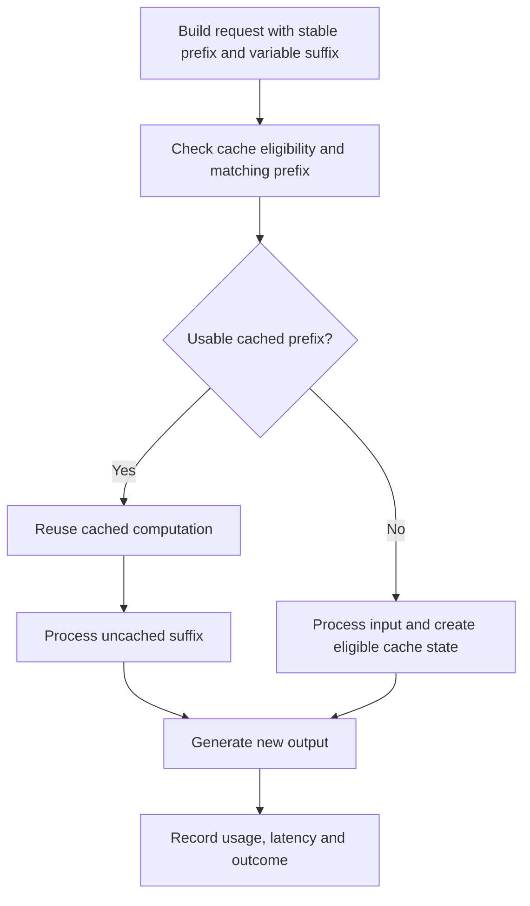
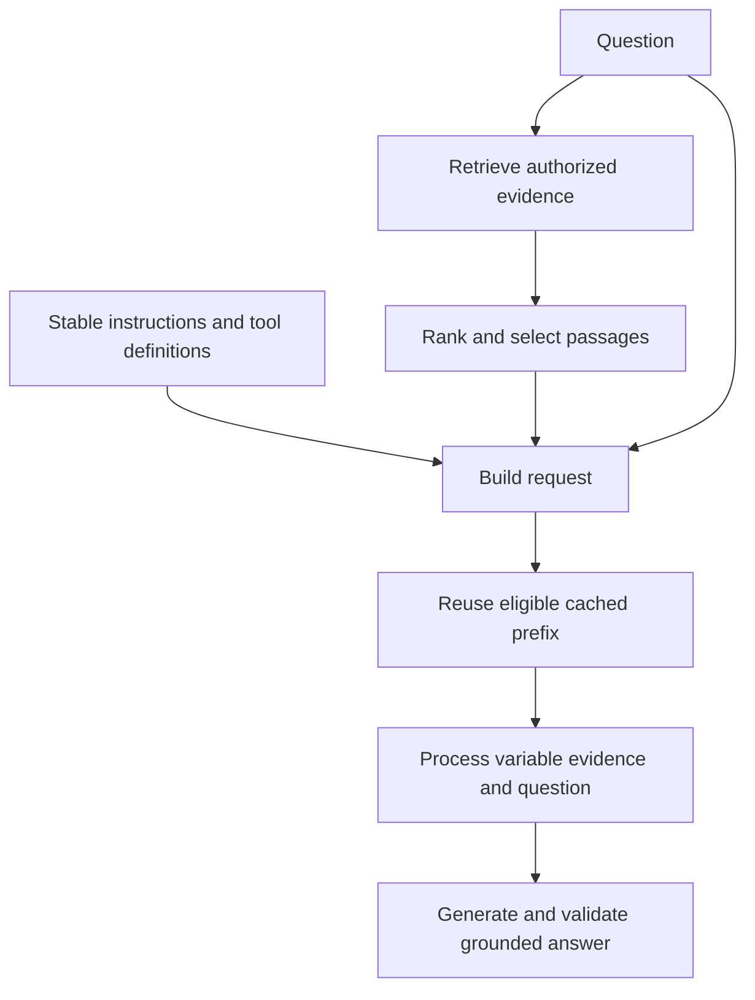
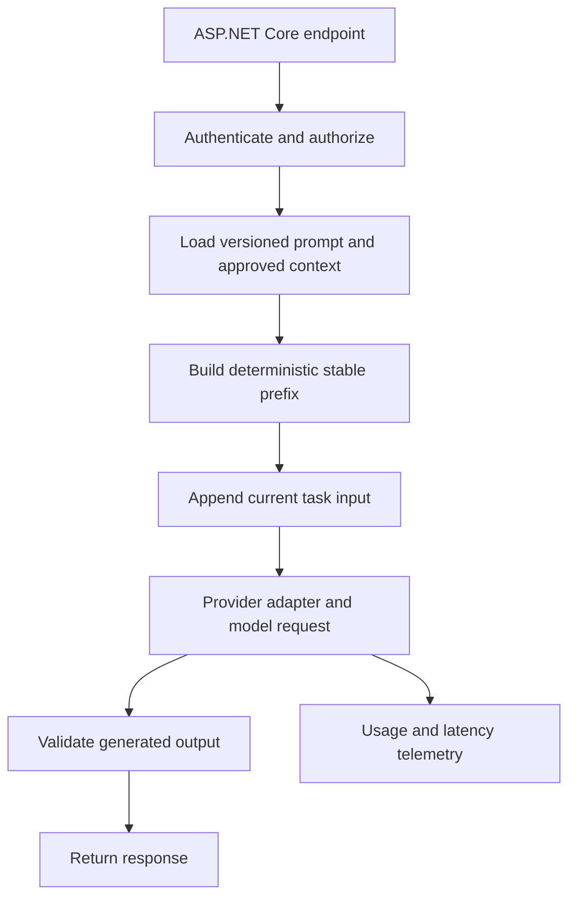
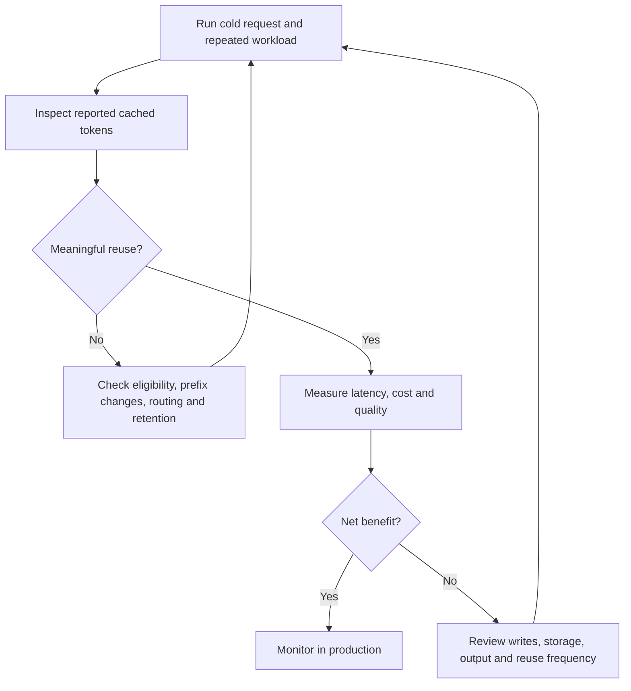

# Prompt Caching with LLMs — AI Engineering Interview Guide

**Audience:** Experienced developers preparing for AI application and agent engineering interviews.

**Core idea:** Prompt caching reuses previously computed processing of reusable input context. The model still generates a response for the current request. It is different from returning a stored answer.

Provider-specific documentation was checked on October 6, 2026. Minimum lengths, retention, pricing, model support, and API fields vary. Confirm them for your deployed model before implementation.

## 1. What is prompt caching?

Prompt caching is an inference optimization that avoids processing an eligible repeated input segment from scratch. In transformer serving, this commonly involves reusing attention-related state for a matching prompt prefix.

Example: a support assistant repeatedly receives the same instructions and product manual, followed by a different customer question. The reusable material can benefit from caching, while the new question still requires processing and a new answer still requires generation.

**Interview answer:**

> Prompt caching reuses computation for repeated input context. It can reduce input processing cost and latency, but does not cache the final answer or eliminate response generation.

## 2. How does it work?

This flow describes a conceptual prefix-cache implementation, not a universal provider API contract.



The first eligible request may be cold. Later requests may reuse all or part of its prefix. Cache availability is not guaranteed: expiry, eviction, routing, and configuration can affect it.

## 3. Prompt caching versus response caching: what is the difference?

| Aspect | Prompt caching | Response caching |
|---|---|---|
| Reused item | Input-processing computation | Previously generated output |
| New model generation | Still needed | Usually skipped on a hit |
| Different question | Can reuse shared context | Usually needs another cache entry |
| Common location | Model-serving infrastructure | Application cache such as Redis |
| Main matching rule | Eligible matching context or explicit cache reference | Application-defined request key |
| Main benefit | Lower repeated input processing | Avoid repeated inference entirely |

**Example:** Asking two different questions about the same manual may benefit from prompt caching. Repeating the same question can potentially benefit from response caching if the answer is safe and current.

## 4. Prompt caching versus semantic caching?

Semantic caching retrieves an earlier answer for a sufficiently similar question, often using embeddings. Prompt caching generally requires matching input rather than merely similar meaning.

| Feature | Prompt caching | Semantic answer caching |
|---|---|---|
| Similar wording enough? | Generally no for prefix matching | Possibly, under an application threshold |
| Reuses an answer? | No | Yes |
| Main correctness concern | Correct request construction | Wrong answer reused for a similar question |
| Example | Same policy text, new question | Similar FAQ question, stored answer |

**Interview answer:**

> Semantic similarity is not evidence that two requests have the same answer. I include authorization, freshness, and task-specific checks before reusing a semantic answer.

## 5. What is a prompt prefix?

A prefix is the beginning of the effective model input sequence. For prefix reuse, earlier context matters because later token representations depend on preceding content.

```text
Request A:
[Stable instructions][Stable tools][Stable reference][Question A]

Request B:
[Stable instructions][Stable tools][Stable reference][Question B]
```

The shared beginning is a reuse candidate. A repeated passage placed after a different preceding question is not automatically an independently reusable prefix.

Providers may internally arrange messages, schemas, and tools differently. Inspect the provider's documented request semantics.

## 6. How should you arrange prompts for caching?

Prefer stable material before changing material, when this also preserves the intended task behavior.

```text
Stable portion:
- Versioned instructions
- Stable tool definitions and output schema
- Repeated examples or reference material

Variable portion:
- Current task state
- Query-specific retrieval results
- Current question
```

Avoid placing a changing timestamp, random request ID, or changing user profile before a large shared prefix unless the model needs it there.

**Interview answer:**

> I make request construction deterministic and place reusable material early. I keep variable information later while verifying that the prompt still produces the required behavior.

Do not add irrelevant padding just to reach a cache threshold. Compare actual end-to-end cost and quality.

## 7. What causes cache misses?

| Cause | Diagnostic action |
|---|---|
| Prefix text changes | Compare rendered prefix versions or hashes |
| Tool/schema changes | Version and stabilize definitions |
| Unstable ordering | Use deterministic ordering where semantically appropriate |
| Prompt below eligibility threshold | Check model-specific requirements |
| Cache expires or is evicted | Compare request timing and retention settings |
| Different model or serving configuration | Group metrics by deployment and model |
| Incompatible cache scope or identifier | Check provider and application configuration |
| No warm entry yet | Measure cold and repeated requests separately |

A cache hit can be partial. Changing a later portion may leave an earlier eligible prefix reusable. Exact details depend on the implementation.

## 8. Does caching change the answer?

Prompt caching is intended to preserve the request's meaning while reusing computation. It does not make output deterministic or factually correct.

An unchanged prompt can still produce different answers because generation and execution behavior may vary.

**Interview answer:**

> I treat caching as a performance optimization and test quality independently. Cache hits do not prove grounding, correctness, or reproducibility.

## 9. Does it reduce output generation cost?

Usually, the main saving applies to eligible input processing. Output tokens still need to be generated and billed according to the provider's pricing rules.

Break latency into:

```text
Total latency = network + queueing + input processing
                + output generation + application/tool time
```

Caching can improve input processing, particularly time to first token. If the output is long or tools are slow, total latency may improve much less.

**Interview answer:**

> I measure both time to first token and complete response time. Prompt caching does not remove decoding, retrieval, or tool latency.

## 10. How do you calculate whether caching saves money?

Use a workload model rather than a headline discount.

Let:

- `N`: requests.
- `P`: reusable prefix tokens per request.
- `S`: variable suffix tokens per request.
- `O`: output tokens per request.
- `H`: prefix cache-hit fraction.
- `U`: ordinary input price per token.
- `R`: cached-read price per token.
- `V`: output price per token.
- `W`: extra cache-write charges over the workload.
- `K`: cache storage/retention charges over the workload.

A simplified equal-prefix model:

```text
Without caching = N × ((P + S) × U + O × V)

With caching = N × (P × ((1 − H) × U + H × R)
                    + S × U + O × V) + W + K
```

Here `W` means charges additional to ordinary miss input processing. Adapt the formula if a provider reports writes as a separate billing category instead.

**Hypothetical example, not provider pricing:**

- 100 requests; prefix 10,000 tokens; suffix 1,000 tokens.
- Ordinary input: $2 per million tokens.
- Cached input: $0.20 per million tokens.
- First request cold; next 99 fully reuse the prefix.
- No additional write or storage charges in this illustration.

```text
Without caching:
1,100,000 input tokens × $2 / 1,000,000 = $2.20

With caching:
110,000 ordinary input tokens × $2 / 1,000,000 = $0.22
990,000 cached input tokens × $0.20 / 1,000,000 = $0.198
Total input cost = $0.418
Input saving = $1.782, approximately 81%
```

Output costs are unchanged in this example, so overall request savings would be lower.

## 11. When is prompt caching useful?

| Workload | Why reuse may be high |
|---|---|
| Questions about the same long document | Repeated reference context |
| Coding assistant working in one repository | Stable conventions and selected code |
| Agent with stable tools and instructions | Repeated setup across turns |
| Repeated classification/extraction | Shared instructions and examples |
| Document section authoring | Reused template and style guidance |

It is less attractive for short prompts, one-off tasks, constantly changing prefixes, and requests spaced beyond usable retention.

The application must work correctly on every cache miss.

## 12. Automatic versus explicit caching?

| Approach | Application responsibility | Trade-off |
|---|---|---|
| Automatic/implicit | Send suitable requests; observe reuse | Less control; hits may be unpredictable |
| Explicit breakpoints | Mark reusable boundaries where supported | Requires supported fields and careful placement |
| Explicit cache objects | Create reusable context and reference it | Requires lifecycle and access management |

These mechanisms are not interchangeable. Do not copy one provider's fields into another provider's API.

## 13. How do providers differ?

The following is a concise orientation. Read the linked documentation for exact model support and current billing.

| Platform | Documented approach | Implementation caution |
|---|---|---|
| Azure OpenAI | Automatic caching for supported models; newer documented families also support explicit breakpoint controls | Features differ by model family and deployment type |
| Claude | Reusable boundaries through `cache_control`; documentation also covers automatic caching | Minimum size and retention depend on configuration/model |
| Gemini | Implicit caching; explicit cached-content objects for supported APIs | Explicit support differs between API surfaces |

Sources: [Azure prompt caching](https://learn.microsoft.com/en-us/azure/foundry/openai/how-to/prompt-caching), [Claude prompt caching](https://platform.claude.com/docs/en/build-with-claude/prompt-caching), [Gemini context caching](https://ai.google.dev/gemini-api/docs/caching).

**Interview answer:**

> I separate the general caching design from the provider adapter. The adapter owns supported fields, usage parsing, eligibility, and retention behavior.

## 14. How do you confirm cache hits?

Use reported usage rather than assuming a fast response was a hit.

Azure's Chat Completions documentation reports reads through `usage.prompt_tokens_details.cached_tokens`. Some newer documented configurations also report cache writes. Claude documents `cache_read_input_tokens` and `cache_creation_input_tokens`. Other APIs use different fields.

An illustrative usage excerpt:

```json
{
  "usage": {
    "prompt_tokens": 12000,
    "completion_tokens": 400,
    "prompt_tokens_details": {
      "cached_tokens": 10000
    }
  }
}
```

This is an illustrative shape, not a promise that every endpoint returns it.

Record model, deployment, prefix version, cached tokens, ordinary input, writes where available, output, latency, and billed cost. Normalize usage carefully: providers do not all include cached tokens in the same totals.

## 15. What is the relationship to the KV cache?

A transformer KV cache stores attention keys and values for previously processed tokens during inference. Cross-request prefix caching can reuse compatible state for a shared prefix.

| Concept | Scope and purpose |
|---|---|
| KV cache during decoding | Avoid repeated computation for earlier tokens in a generation |
| Prompt/prefix caching | Reuse eligible input processing across requests |
| Conversation memory | Persist user/task information |
| Redis answer cache | Store completed application responses |

Prompt caching does not increase the context window. Cached content still occupies logical context capacity.

## 16. Can you combine caching with RAG?

Yes. RAG selects relevant evidence; prompt caching optimizes repeated context processing.



Query-specific passages often change, so the instructions may be reusable while retrieval content is not. Repeated questions about the same authorized document set may offer additional reuse.

Do not freeze retrieval to outdated evidence just to improve hit rate.

## 17. How does caching help agents?

Agents may repeat instructions, tool definitions, and accumulated conversation across model calls. Stable prefixes can reduce repeated input work.

Append-only history can preserve earlier prefixes, but compaction, edited messages, and changing tool sets may reduce reuse. Do not avoid necessary compaction merely to preserve caching: an overflowing or distracting context is worse than a miss.

**Interview answer:**

> I optimize stable agent setup and observe cached-token usage across turns. Task correctness, context quality, and execution limits remain independent requirements.

## 18. How would you implement this in .NET and Azure?

A proposed architecture:



Keep these responsibilities separate:

- Prompt template store: versioned instructions and examples.
- Context builder: authorized evidence and task state.
- Provider adapter: supported caching options and request format.
- Usage normalizer: consistent metrics from provider fields.
- Validator: output schema and business checks.

Provider-neutral illustrative C# types:

```csharp
public sealed record CacheMetrics(
    long CachedReadTokens,
    long? CacheWriteTokens,
    long UncachedInputTokens,
    long OutputTokens);

public interface IPromptBuilder
{
    Task<PreparedPrompt> BuildAsync(
        AuthorizedRequest request,
        CancellationToken cancellationToken);
}
```

`PreparedPrompt` and `AuthorizedRequest` are application-defined types. This is architecture guidance, not a complete SDK example.

Maintain a stable template version and a safe fingerprint for debugging. A local fingerprint is not a provider cache key or an authorization control. Avoid logging confidential prompt contents.

## 19. What about security, tenancy, and freshness?

Provider cache isolation and application authorization solve different problems.

- Authorize document access before supplying or referencing content.
- Follow provider-specific isolation and retention rules.
- Scope explicit cache-object mappings to the authorized tenant/context.
- Never use an easily guessed cache object ID as proof of access.
- Use revised content and versions when a document changes.
- Handle deleted documents and revoked permissions in application logic.
- Partition response caches by authorization and relevant data versions.
- Restrict prompt logging and sensitive identifiers.

For automatic prefix caching, updated input should cease matching the old full prefix; that is not necessarily an immediate deletion of old provider cache state. Retention/deletion behavior must be checked separately.

**Interview answer:**

> I never rely on a cache hit or cache identifier for permission checks. Authorization applies on each request, and the application supplies current approved content.

## 20. How would you benchmark and troubleshoot caching?

Run controlled tests with identical eligible prefixes and different suffixes. Keep model, tools, schema, and configuration stable.



Measure:

| Metric | Why it matters |
|---|---|
| Request hit rate | Fraction of requests with any reuse |
| Token reuse ratio | Cached-read tokens divided by total input tokens, after normalization |
| Cache-write volume | Whether writes outweigh useful reads |
| Time to first token | Input-stage responsiveness |
| End-to-end p50/p95 | Typical and tail user experience |
| Actual cost per successful task | Business value of the optimization |
| Quality and grounding | Whether task behavior remains acceptable |

Do not call a small partial hit a full hit. A high request hit rate can hide a low token reuse ratio.

## 21. How would you use it in a document-authoring application?

A proposed design relevant to a .NET/Azure document-authoring project:

```text
Stable context:
Template version + approved style rules + reusable examples

Task-specific context:
Target section + permitted source passages + current author request
```

Repeated drafting requests may reuse setup context. Keep source selection, document versions, citations, and review state current.

**Interview answer:**

> I would measure reuse of the template and instruction prefix across drafting requests. I would not assume the full source context is stable or describe caching as an accuracy improvement.

Present this as a proposal unless you have implemented and measured it.

## 22. What are common interview traps?

| Incorrect statement | Better explanation |
|---|---|
| Prompt caching returns an old answer | It reuses input computation; output is generated |
| Similar prompts always hit | Prefix matching generally needs exact eligible input |
| Cache hits make the model deterministic | Generation can still vary |
| Cached tokens do not consume context | They still contribute to logical context capacity |
| Caching replaces RAG | Retrieval and inference reuse solve different problems |
| Caching always saves money | Reuse, reads, writes, storage, and output determine savings |
| All providers have the same TTL | Retention is provider/model/API-specific |
| Redis implements hosted-model prompt caching | Redis typically caches application data or responses |
| A cache key authorizes access | Authorization must be enforced independently |
| Old tools are safe because they are cached | The current request must use valid definitions and permissions |

## 23. Give a 60-second interview answer

> Prompt caching reuses computation for repeated input context, typically a stable prompt prefix. The model still processes new input and generates a new response. I structure prompts deterministically, keep reusable instructions and tool definitions stable, and place changing task data later where appropriate. I verify hits using provider usage fields and measure token reuse, time to first token, total latency, and actual cost. I account for expiry, misses, write or storage charges, and provider differences. Authorization, freshness, grounding, and task correctness remain separate responsibilities.

## Practical interview exercise

Build a small document Q&A application and demonstrate:

1. A cold request.
2. Several different questions sharing a long approved reference context.
3. A changed prefix and its effect on reported reuse.
4. A refreshed document version.
5. A comparison of input cost, output cost, latency, and answer quality.

Use hypothetical values in explanations unless you have measured the actual deployment. Never report expected savings as achieved results.

## Sources

- [Microsoft Learn: Azure OpenAI prompt caching](https://learn.microsoft.com/en-us/azure/foundry/openai/how-to/prompt-caching)
- [Claude Platform: Prompt caching](https://platform.claude.com/docs/en/build-with-claude/prompt-caching)
- [Claude Platform: Tool use with prompt caching](https://platform.claude.com/docs/en/agents-and-tools/tool-use/tool-use-with-prompt-caching)
- [Google AI: Gemini context caching](https://ai.google.dev/gemini-api/docs/caching)
- [Hugging Face: How caching works](https://huggingface.co/docs/transformers/main/cache_explanation)

## Markdown rendering

This file contains four fenced Mermaid flowcharts. GitHub supports Mermaid rendering; another static-site generator may require Mermaid support to be enabled.
