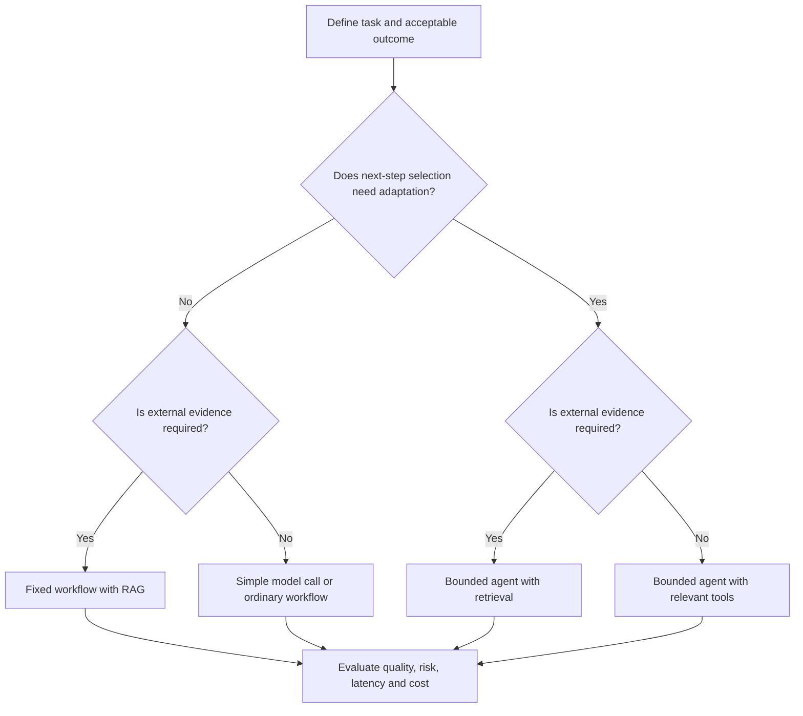
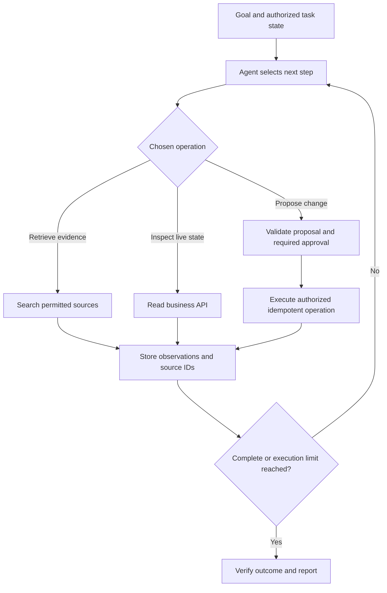
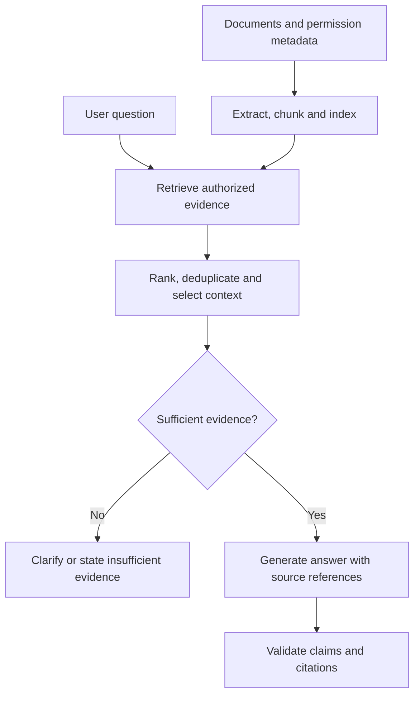
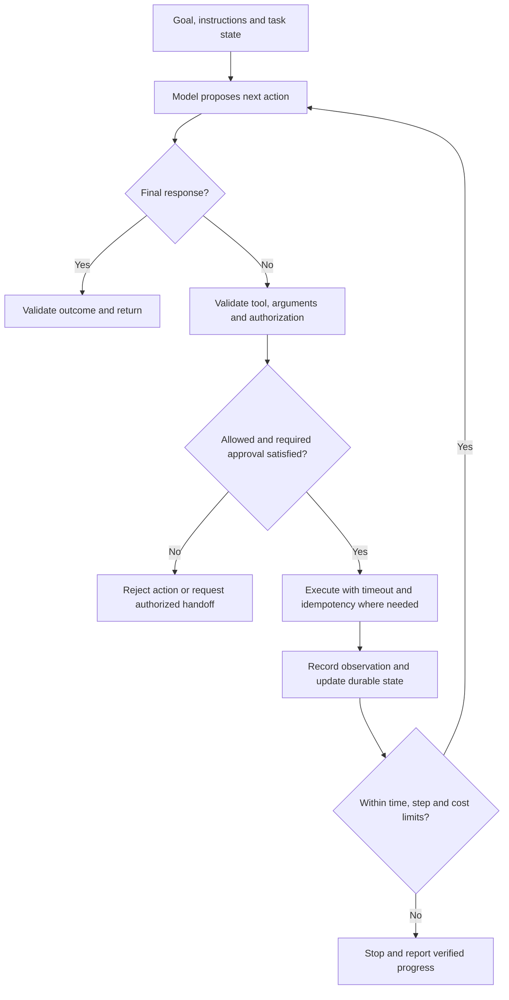
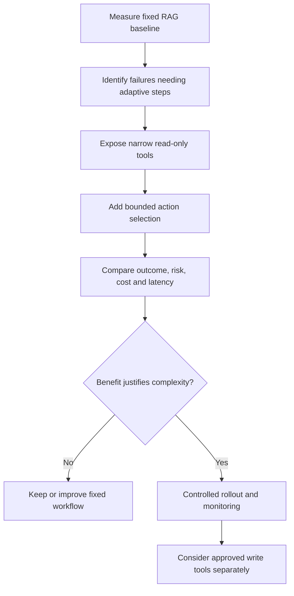

# Choose RAG or Agents? — AI Engineering Interview Guide

**Audience:** Experienced developers preparing for AI application and agent engineering roles.

**Main answer:** RAG and agents are not mutually exclusive. RAG supplies external evidence to generation. An agent controls a sequence of actions toward a goal. Choose retrieval based on information needs and autonomy based on control-flow needs.

A useful starting rule:

- Need external evidence to answer? Consider RAG.
- Need predictable steps? Use a fixed workflow, with retrieval or tools as needed.
- Need adaptive investigation or action selection? Consider a bounded agent.
- Need both adaptive execution and external evidence? Let an agent use retrieval.
- Need neither? A simple model call or ordinary software may be sufficient.

The examples are proposed architectures, not claims of implemented project capabilities. References were checked on October 6, 2026.

## 1. What is RAG?

Retrieval-Augmented Generation retrieves relevant external information and supplies it to a model for answering or drafting.

Typical stages:

1. Prepare documents and searchable metadata.
2. Retrieve relevant authorized passages.
3. Assemble evidence with the question and instructions.
4. Generate an answer.
5. Validate claims and source references.

RAG does not normally change model parameters. It can use keyword, vector, hybrid, database, or other retrieval methods; a vector database is not mandatory.

**Interview answer:**

> RAG grounds generation in selected external evidence. I use it when responses depend on private, changing, or source-specific information, and evaluate retrieval quality separately from answer quality.

See [Microsoft's RAG overview](https://learn.microsoft.com/en-us/azure/search/retrieval-augmented-generation-overview).

## 2. What is an LLM-based agent?

An agent is a system where a model helps decide the next action based on the goal and observations. Application code provides tools, state, authorization, execution limits, and validation.

Example: investigate an order delay by checking order status, shipment data, and applicable policy; request clarification when information is missing.

**Interview answer:**

> The model proposes next steps, while the runtime validates and executes them. I introduce an agent when the task needs adaptive control flow, not simply because it uses an LLM or calls an API.

Terminology varies. This guide uses model-directed action selection as the practical distinction.

## 3. Are RAG and agents alternatives?

They address different architectural dimensions.

| Dimension | RAG | Agent |
|---|---|---|
| Main question | What evidence should generation use? | What action should happen next? |
| Primary mechanism | Retrieve and supply context | Select, execute, observe, and continue |
| External documents | Typical source | Optional tool input |
| Business API calls | Can be part of a fixed application pipeline | Can be selected dynamically |
| Writes | Not inherent to RAG | Optional, controlled capability |
| Autonomy | Not required | Bounded adaptive behavior |
| Combination | Can be an agent tool | Can use RAG |

**Interview answer:**

> I do not frame the choice as RAG versus agents alone. I separately decide how to obtain evidence and how to orchestrate the task.

## 4. What is the difference between a workflow and an agent?

A workflow follows application-defined steps and branches. An agent selects some steps dynamically.

| Workflow | Agent |
|---|---|
| Known process encoded in code | Runtime chooses actions within constraints |
| Predictable orchestration | Flexible investigation |
| Easier to bound and inspect | More possible trajectories |
| Example: extract → validate → save | Example: investigate → select sources → resolve uncertainty |

A workflow can include multiple model calls, tools, and retrieval without requiring autonomous control. A useful hybrid puts adaptive investigation inside deterministic boundaries.

Anthropic distinguishes workflows from agents by how execution is controlled and recommends starting with simple approaches. See [Building effective agents](https://www.anthropic.com/engineering/building-effective-agents).

## 5. How do you decide which architecture to choose?



This is a starting heuristic. Benchmark alternatives on representative tasks before making the final decision. External actions alone do not imply a need for agents: a fixed workflow can execute APIs.

## 6. When should you choose classic RAG?

Choose a fixed retrieval-and-generation pipeline when:

- The goal is answering or drafting from known sources.
- Relevant evidence can be found with a predictable retrieval strategy.
- Source attribution is important.
- Latency and execution predictability matter.
- The application does not need open-ended investigation.

**Example:** “What does the leave policy say about carrying forward unused leave?”

Retrieve the current permitted policy sections, answer, and cite them. An autonomous planner may add little value.

**Caution:** Poor extraction, stale indexing, permission mistakes, and conflicting documents can still cause failures. RAG is not an accuracy guarantee.

## 7. When should you choose a fixed workflow?

Choose a workflow when the procedure is known, even if it involves several systems.

Example: invoice processing:

```text
Extract fields → Validate supplier → Check duplicates
→ Apply approval rules → Save approved invoice
```

An LLM can extract fields, but code should enforce totals, duplicate rules, and approval transitions.

**Interview answer:**

> Multi-step does not automatically mean agentic. If the process is known, I encode the sequence and use models only where their capabilities are needed.

## 8. When should you choose an agent?

Consider an agent when:

- The useful next step depends on observations.
- Multiple tools or sources may be needed in different combinations.
- The task requires iterative search, diagnosis, or investigation.
- A fixed procedure cannot cover the useful paths economically.
- The organization accepts the additional runtime variability and controls it.

**Example:** “Investigate why this customer was charged twice.”

The system may inspect transactions, retries, webhook events, and reconciliation records. Different evidence can lead to different follow-up checks.

Adaptive investigation does not require unrestricted writes. A read-only agent may be sufficient.

## 9. When should you combine an agent and RAG?

Use both when an adaptive task needs documentary evidence and other observations.

Example: a support investigation retrieves policy, checks account state, asks for missing information, and prepares an eligible resolution.



If approval is denied or authorization fails, do not execute the change; record the failure and stop or select a permitted alternative. Every tool enforces its own permissions.

## 10. What is agentic RAG?

Agentic RAG broadly describes retrieval workflows using model-driven decisions, such as:

- Decomposing a question into subquestions.
- Choosing sources.
- Reformulating queries.
- Deciding whether more evidence is needed.
- Combining evidence from several retrieval steps.

It need not perform business writes or use multiple agents.

Microsoft describes Azure AI Search agentic retrieval as a multi-query pipeline for complex questions. Product-specific capabilities and availability must be checked for the chosen API. See [Agentic retrieval overview](https://learn.microsoft.com/en-us/azure/search/agentic-retrieval-overview).

## 11. Does RAG always mean one search and one model call?

No. RAG can use query rewriting, reranking, multiple searches, and staged generation under fixed orchestration.

The distinction is not the number of calls. It is whether the control flow is predetermined or dynamically selected.

**Example:** A workflow always searches two indexes in parallel, reranks results, and generates an answer. This remains a fixed workflow even though it has multiple steps.

## 12. What is the classic RAG flow?



At ingestion, preserve document version and source location. At query time, enforce current access and choose authoritative versions. A real citation does not automatically support the associated claim.

## 13. What is a safe agent execution flow?



The model selects actions; the runtime controls execution. Keep critical state in authoritative storage, not only conversational summaries.

## 14. How do cost and latency compare?

| Aspect | Fixed RAG pipeline | Adaptive agent |
|---|---|---|
| Number of calls | Usually easier to estimate | Depends on trajectory |
| Input context | Retrieved evidence plus instructions | Can grow with observations |
| Tool cost | Defined retrieval operations | Potentially several APIs/searches |
| Latency variability | Often lower variability | Often higher variability |
| Optimization | Retrieval quality, context selection, caching | Those plus action count and loop management |

These are tendencies, not guarantees. A heavy RAG workload can cost more than a short successful agent task.

Measure cost per successful task, p50/p95 latency, tool calls, and input/output tokens. Prompt caching can reuse stable input processing but does not remove tool execution or output generation.

## 15. How do failure modes differ?

| Failure | RAG | Agent with retrieval |
|---|---|---|
| Relevant evidence missed | Yes | Yes |
| Unsupported claims | Yes | Yes |
| Stale or conflicting evidence | Yes | Yes |
| Wrong next action | Limited by fixed flow | Additional risk |
| Incorrect tool arguments | Possible in tool-enabled pipelines | Important evaluation target |
| Repeated loops | Less common in simple flow | Must be bounded |
| Duplicate writes | Possible in workflows with writes | Must be prevented by business services |

Agents do not repair poor data automatically. Fix extraction, indexing, source quality, and permissions before adding autonomy.

## 16. How do you secure both approaches?

Shared controls:

- Authenticate users and establish tenant scope.
- Filter retrieval by permissions.
- Treat retrieved text as untrusted input.
- Preserve source provenance.
- Restrict sensitive logging and retention.

Additional action controls:

- Allowlist tools and validate arguments.
- Enforce authorization inside every tool.
- Separate read operations from writes.
- Require approval for defined sensitive changes.
- Apply idempotency and transaction rules.
- Restrict external destinations and execution resources.

**Interview answer:**

> Prompt instructions help guide behavior, but code enforces access and business invariants. Retrieved text cannot authorize an action.

## 17. How do you evaluate the architecture choice?

Run representative tasks against a baseline and proposed alternatives.

| Dimension | Measurement |
|---|---|
| Retrieval | Required evidence coverage and ranking |
| Answer quality | Correctness, grounding, completeness |
| Source support | Citations justify claims |
| Agent outcome | Verified final state |
| Action quality | Appropriate tools and arguments |
| Reliability | Repeated-trial success and recovery |
| Security | Access boundaries and prohibited actions |
| Efficiency | Latency and cost per successful task |

Use deterministic checks for permissions and business invariants, calibrated semantic grading for open-ended answers, and expert review where required.

Upgrade to an agent when measured gains justify its extra operational complexity. Do not compare a tuned agent against a deliberately weak RAG baseline.

## 18. What should happen if retrieval fails?

First classify the failure:

| Situation | Response |
|---|---|
| Question ambiguous | Ask a targeted clarification |
| Evidence missing | State insufficient information |
| Search service temporarily unavailable | Bounded retry or report temporary limitation |
| Wrong terminology | Reformulate query if permitted |
| Conflicting source versions | Apply authority/version rules or disclose conflict |
| User lacks permission | Deny access without exposing protected content |

A fixed workflow can include bounded retry or query reformulation. You do not need an autonomous agent for every recovery branch.

## 19. How do you handle agent writes and retries?

Assume a timeout does not prove the operation failed.

**Example:** A refund API returns a timeout after the backend processed the refund. Blind retry can create duplicate payments.

Use:

- Backend-enforced idempotency keys.
- Operation status lookup.
- Durable transaction IDs.
- Bounded retries for transient failures.
- Approval records linked to the exact proposed action.
- Audit records and reconciliation.

**Interview answer:**

> The agent decides what to request, but the business service guarantees that the operation is authorized and cannot violate financial invariants.

## 20. Which architecture fits common scenarios?

| Scenario | Starting design | Why |
|---|---|---|
| Employee policy Q&A | RAG | Answer depends on documents |
| Single supplied document summary | Simple model call | Evidence is already supplied |
| Invoice extraction and approval | Fixed workflow | Known process and validation rules |
| Order status lookup | Ordinary API or tool-enabled workflow | A known authoritative operation |
| Diagnose an order exception | Bounded agent, optionally with RAG | Evidence determines follow-up steps |
| Draft a section from approved sources | RAG workflow | Grounded drafting and review |
| Investigate inconsistencies across sources | Workflow first; agent if needed | Compare predictable versus adaptive paths |
| Research an open-ended topic | Agent with retrieval | Iterative evidence collection |
| Process a payment | Deterministic service/workflow | Strong transaction invariants |

An agent may assist payment investigation, but the payment service should own actual transaction rules.

## 21. How would you implement the options in .NET and Azure?

A proposed shared platform:

| Responsibility | Possible implementation |
|---|---|
| API and authentication | ASP.NET Core |
| Source document storage | Azure Blob Storage |
| Metadata and task state | PostgreSQL or Azure SQL |
| Retrieval | Azure AI Search |
| Model inference | Approved model endpoint |
| Ingestion processing | Background worker |
| Tool execution | Typed C# services and business APIs |
| Telemetry | OpenTelemetry and Application Insights |
| Evaluation | Versioned datasets and CI harness |

For RAG, the application executes a fixed pipeline. For an agent, add bounded action selection and observation handling; reuse the same authorized retrieval service.

Illustrative interfaces:

```csharp
public interface IEvidenceRetriever
{
    Task<EvidenceResult> SearchAsync(
        AuthorizedSearchRequest request,
        CancellationToken cancellationToken);
}

public interface IAuthorizedToolExecutor
{
    Task<ToolResult> ExecuteAsync(
        ProposedToolCall call,
        ExecutionContext context,
        CancellationToken cancellationToken);
}
```

These are design sketches. Request/result types are application-defined. Avoid accepting tenant identity supplied solely by the model; derive identity from trusted application context.

## 22. What would you choose for Protocol Pro?

A proposed starting architecture is a fixed RAG authoring workflow with human review:

1. Select study and section.
2. Retrieve permitted source passages.
3. Assemble section requirements and evidence.
4. Generate a draft with source identifiers.
5. Run defined consistency and citation checks.
6. Save a version and route through the review workflow.

Approval transitions should remain explicit application behavior. A model does not independently approve its own draft.

A later bounded agent could investigate missing evidence or inconsistencies if evaluation shows useful improvement. Give it read tools first and clearly constrained draft operations.

**Interview answer:**

> For source-grounded section drafting, I would start with RAG and a deterministic review workflow. I would add agent behavior only for tasks that benefit from adaptive investigation, and validate that benefit using representative cases.

Describe this as a recommendation unless the capabilities have been implemented and measured. Automated checks do not establish regulatory compliance.

## 23. Do you need multiple agents?

Not necessarily. Multiple agents can provide parallel investigation or separate responsibilities, but also add cost, coordination, and inconsistent intermediate results.

Start with one workflow or bounded agent. Add specialized agents only when decomposition improves measured outcomes or provides useful operational boundaries.

**Interview trap:** Agreement between agents is not proof of correctness; they can share the same error.

## 24. How do you migrate from RAG to an agent safely?



Preserve a simpler fallback and clear incomplete-task responses. Keep data preparation, authorization, and critical business logic independent of the agent.

## 25. What are common interview mistakes?

| Incorrect statement | Better explanation |
|---|---|
| RAG and agents cannot be combined | Retrieval can be an agent tool |
| Every tool call is an agent | Fixed workflows can call tools |
| Every multi-step task needs autonomy | Known procedures can remain deterministic |
| Agents guarantee better answers | Improvement must be measured |
| RAG eliminates hallucinations | Grounding still needs evaluation |
| RAG requires a vector database | Retrieval can use several methods |
| Agents must perform writes | Read-only agents can be useful |
| More agents means better accuracy | Coordination can add failures |
| A fluent success message proves completion | Verify actual environment state |
| A prompt enforces authorization | Application services enforce permissions |

## 26. Give a 60-second interview answer

> I choose architecture based on information needs and control-flow needs. RAG is useful when generation requires private or current external evidence. A fixed workflow is suitable when the steps are known, including workflows that retrieve documents or call APIs. I consider an agent when the next useful action depends on observations and adaptive investigation provides measurable benefit. An agent can use RAG as a tool. I start with the simplest baseline, compare representative tasks, and evaluate grounding, outcomes, permissions, latency, and cost. Any writes remain protected by backend authorization, approvals, and idempotency.

## Portfolio exercise

Build an order-support demo with three configurations:

1. RAG policy Q&A.
2. A fixed workflow that combines policy retrieval and order lookup.
3. A bounded read-only agent that investigates exceptions.

Use the same task dataset, record failures and tool calls, and compare verified outcomes, latency, and cost. Add write operations only in an isolated test environment with approval and idempotency checks.

Report measured results and limitations rather than claiming that one architecture is universally best.

## References

- [Anthropic: Building effective agents](https://www.anthropic.com/engineering/building-effective-agents)
- [Microsoft Learn: RAG overview](https://learn.microsoft.com/en-us/azure/search/retrieval-augmented-generation-overview)
- [Microsoft Learn: Agentic retrieval overview](https://learn.microsoft.com/en-us/azure/search/agentic-retrieval-overview)

## Markdown rendering

This guide contains five fenced Mermaid flowcharts. GitHub supports Mermaid; other static-site generators may require Mermaid support to be enabled.
