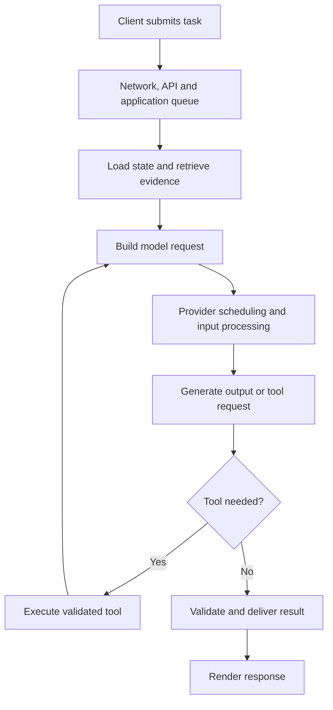
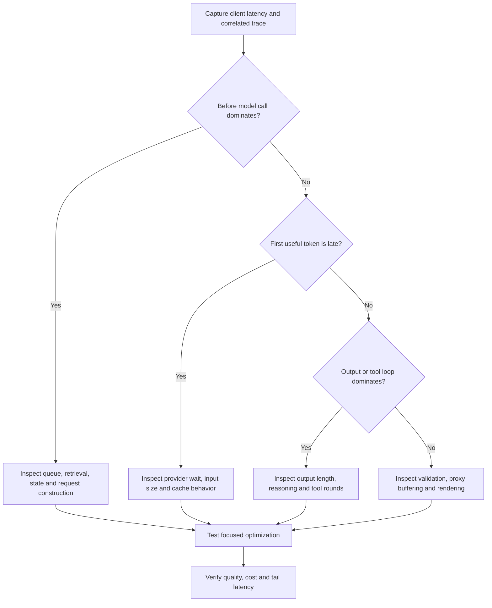
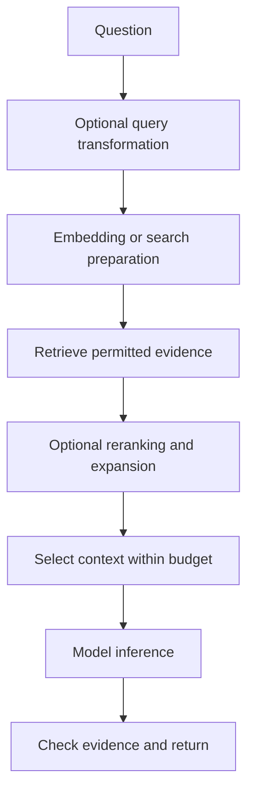
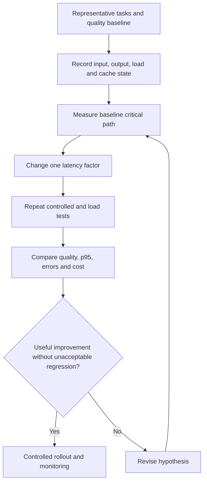

# Why Is the AI So Slow? — AI Engineering Interview Guide

**Audience:** Experienced developers preparing for AI application, RAG, and agent engineering interviews.

**Scope:** A latency diagnosis scenario. No actual application trace was supplied, so this guide presents a method rather than asserting a root cause.

**Core answer:** AI response time includes network transfer, application work, queueing, retrieval, model input processing, output generation, tools, and rendering. Measure the critical path before optimizing.

Examples and numeric values are hypothetical. Primary references were checked on October 7, 2026 in the user's timezone. Provider behavior and supported settings depend on model, API, and deployment.

## 1. How would you answer “Why is the AI so slow?”

**Interview answer:**

> I first distinguish a slow first response from slow completion and collect an end-to-end trace. I break down network, queueing, retrieval, context construction, model inference, tools, and UI rendering. I compare similar requests by model, input size, output size, cache state, and concurrency. Then I optimize the dominant stage and verify latency, quality, cost, and reliability under representative load.

Do not assume every slow AI request needs a faster model.

## 2. What latency metrics should you define?

| Metric | Meaning |
|---|---|
| Client end-to-end latency | Submission to completed result visible to the user |
| Time to first token (TTFT) | Request start to first generated content token |
| Time to first byte (TTFB) | Request start to first response byte, which may not be content |
| Time between tokens | Interval between generated tokens |
| Completion latency | Time until output generation completes |
| Tool latency | Duration of an external operation |
| Queue wait | Time waiting for resources |
| p50/p95/p99 | Typical and tail behavior across requests |

Define measurement boundaries explicitly. An SSE metadata event is not the first useful answer token. Browser rendering can lag behind provider delivery.

## 3. What makes up end-to-end latency?

```text
Approximate serial path:
Network + application queue + authentication/state
+ retrieval + context preparation + provider wait/prefill
+ generation + tools + validation + rendering
```

This is a conceptual breakdown. Concurrent spans overlap, so adding every span duration can overstate elapsed time. Analyze the critical path.



## 4. What is the diagnostic flowchart?



Provider wait and prefill may not be separately observable through a hosted API. Treat them as hypotheses unless the available telemetry distinguishes them.

## 5. Why does output generation take time?

Typical autoregressive LLMs generate output sequentially. A long answer requires many decode steps, even if the input question is short.

Simplified estimate after first token:

```text
Remaining decode time ≈ (output tokens − 1) / decode tokens per second
```

Hypothetical example: 800 output tokens at 40 tokens/second take roughly 20 seconds of decoding, plus first-token and application overhead.

Actual token speed varies with model, serving load, sequence length, and scheduling. Do not use one observed value as a universal benchmark.

## 6. What is prefill, and why do large prompts matter?

Prefill processes input and creates inference state. Decode generates the answer using that state.

| Phase | Important factors |
|---|---|
| Prefill | Input length, architecture, cache reuse, hardware |
| Decode | Output length, model, context state, scheduling |

A 900K-token request asking for a one-sentence answer can still be slow before output begins. More context also consumes serving resources.

**Interview answer:**

> I separate input processing from generation. I reduce irrelevant context and output length independently, then measure their effects.

## 7. Why are reasoning models sometimes slower?

A model may perform additional internal reasoning before producing visible text. Some APIs expose a supported reasoning-effort or budget setting.

For simple extraction or routing, a lighter model or lower supported reasoning allocation may meet the same quality target with less latency. For difficult analysis, reducing effort may worsen results.

Do not infer reasoning time from visible output length alone. Use available usage and latency data, and compare task success.

## 8. Does a smaller model always respond faster?

No. It is a candidate optimization, not a guarantee. Deployment capacity, request shape, queueing, and serving implementation matter.

Route tasks by measured suitability:

| Task | Possible starting approach |
|---|---|
| Fixed lookup | Ordinary API, no model needed |
| Simple classification | Smaller model or deterministic rules |
| Structured extraction | Model meeting accuracy requirements |
| Complex synthesis | Stronger model if evals justify it |

A fast weak model that causes retries or escalations can increase total task time.

## 9. Why is RAG slow?

RAG may include query rewriting, embeddings, search, reranking, neighbor expansion, and generation. These can form a long serial path.



Instrument each stage. Remove optional work only if evaluation shows acceptable quality. Do not replace authorized search with a faster unrestricted query.

## 10. How do you optimize retrieval latency?

Potential changes:

- Apply appropriate filters and return only needed fields.
- Avoid fetching full documents when selected passages suffice.
- Measure index/query configuration and service capacity.
- Reuse connections and avoid repeated embedding calls for identical inputs where safe.
- Bound candidate counts and reranking work.
- Run independent searches concurrently under a concurrency limit.
- Cache eligible retrieval results with authorization and freshness controls.

Measure evidence coverage after every change. Faster retrieval that omits required sources is a regression.

## 11. Why are agents slower than simple chat?

An agent can execute multiple model/tool rounds, each with its own latency. Tool observations may also grow the next model request.

```text
Agent duration ≈ sum of sequential model rounds
                 + sequential tools
                 + critical-path parallel work
                 + orchestration overhead
```

Inspect unnecessary searches, repeated failed calls, verbose tool output, and poor stopping behavior.

**Interview answer:**

> I evaluate task success and unnecessary actions. Known steps should often be a workflow rather than repeatedly asking a model what to do next.

## 12. How do you optimize agent latency?

Use narrow, clear tools that return task-relevant data. Avoid splitting one coherent read operation into many round trips without benefit.

Set step, time, and cost limits. Detect repeated calls without progress. Execute independent reads concurrently when dependencies permit.

Keep authoritative state structured so the model does not need to reconstruct it from enormous histories.

Preserve approvals and transaction invariants. Parallel execution is inappropriate when operations depend on each other or create conflicting writes.

## 13. Does streaming make the AI faster?

Streaming delivers generated content incrementally. It can reduce perceived waiting but does not necessarily reduce completion time.

Check the entire path:

- Provider sends incremental content.
- Backend reads it incrementally.
- Proxy does not buffer it excessively.
- Client processes events.
- UI renders efficiently.

Do not stream unvalidated critical statements as final results. For structured output or consequential actions, distinguish progress from a verified outcome.

## 14. Why does streaming still feel slow?

The first useful token may be delayed by prefill or reasoning. Middleware, reverse proxies, or frontend code may buffer output.

Check timestamps at provider receipt, backend forwarding, browser receipt, and render. Reduce heavy rerendering and handle partial chunks safely.

A “working” status improves clarity but must not imply an action completed. Consider accurate stage-level progress for long tasks.

## 15. Which caching strategies improve latency?

| Cache | Reuses | Main limitation |
|---|---|---|
| Response cache | Completed answer | Staleness and authorization scope |
| Semantic answer cache | Similar question's answer | Similarity does not guarantee correctness |
| Retrieval cache | Search results | Source freshness and permission changes |
| Embedding cache | Vector for identical content | Model/version compatibility |
| Prompt computation cache | Eligible repeated input processing | Provider-specific matching and retention |

Prompt caching still requires new output generation. Cached answers should be used only when identity, freshness, and task semantics allow it.

Track actual hits and compare cold/warm behavior rather than assuming caching helps every request.

## 16. Why does the AI slow down under load?

Incoming work can exceed processing capacity, increasing queueing or triggering rejection/throttling. Retries can multiply load.

Token volume matters: 100 short requests and 100 huge requests are different workloads.

Use bounded concurrency, admission control, deadlines, and backpressure. Observe downstream capacity as well as API capacity.

Little's Law gives a steady-state relationship:

```text
Average in-flight work = throughput × average time in system
```

Hypothetical: 5 completed requests/second × 8 seconds average elapsed time implies about 40 in-flight requests, including waiting, in a stable system. This is not a recommendation to set concurrency to 40.

## 17. Latency versus throughput: what is the difference?

| Metric | Meaning |
|---|---|
| Latency | Time for an individual request |
| Throughput | Work completed per unit time |
| Concurrency | Work in progress simultaneously |

Higher batching or concurrency can improve throughput but may increase waiting or per-request latency. Beyond capacity, more concurrency can worsen both.

Benchmark at realistic input/output lengths and arrival rates. A single-user test does not characterize production capacity.

## 18. What is continuous batching?

Self-hosted serving can dynamically combine active requests and replace completed ones with new work. This improves hardware utilization.

Chunked prefill can process long inputs in pieces to coordinate input work with ongoing generation. Scheduling policies affect latency and fairness.

These are serving-level choices, not usually application controls for a hosted API. See [Hugging Face continuous batching architecture](https://huggingface.co/docs/transformers/continuous_batching_architecture).

Other self-hosted considerations include KV cache memory, efficient attention, quantization, and speculative decoding. Benchmark quality and real workload performance; none guarantees universal speedup.

## 19. Why can network placement matter?

Network distance, DNS/TLS setup, proxy hops, and large payload transfer add latency. Repeated serial tool calls amplify round-trip overhead.

Where permitted, consider proximity between application, search, database, and model services. Check actual deployment routing and data residency rather than assuming region labels imply identical network paths.

Reuse connections and avoid uploading unchanged large content unnecessarily. Do not trade data policy compliance for latency.

## 20. How do you handle retries and timeouts?

Classify failures. Use bounded retry with backoff and jitter for suitable transient errors, honor applicable retry guidance, and keep retries within the end-to-end deadline.

Retries should not amplify an overloaded service indefinitely.

For writes, a timeout may follow successful execution. Use idempotency and status lookup before retrying. Propagate cancellation, but do not assume local cancellation proves remote work stopped.

Separate timeout, cancelled, partial, failed, and unknown-outcome states in telemetry and user responses.

## 21. What .NET mistakes cause latency?

| Problem | Investigation or correction |
|---|---|
| `.Result` or `.Wait()` on I/O | Use async/await; inspect thread-pool starvation |
| New HTTP clients per operation | Use suitable managed client lifetime such as IHttpClientFactory |
| Repeated database queries | Inspect query count and N+1 patterns |
| Large synchronous serialization | Measure payload and CPU cost |
| Unbounded parallel work | Apply concurrency controls |
| Missing cancellation | Pass deadlines/tokens through dependencies |
| Logging huge payloads synchronously | Use approved, bounded telemetry |
| Proxy buffering | Inspect incremental delivery |

Do not use `Task.Run` around asynchronous HTTP calls as a substitute for proper async I/O.

Illustrative tracing sketch:

```csharp
using System.Diagnostics;

public static class AiTelemetry
{
    public static readonly ActivitySource Source = new("Example.AI");
}

using var activity = AiTelemetry.Source.StartActivity("model.generate");
activity?.SetTag("prompt.version", "v4");
activity?.SetTag("request.input_tokens", 2400);
// Await the configured model client and record safe usage metadata.
```

Exporting requires telemetry configuration. Do not log secrets or unrestricted prompts.

## 22. What should you monitor in Azure?

Use application traces and relevant deployment metrics to correlate token volume, request errors, utilization, and latency. Azure documentation describes model/deployment and output-token influences and provides latency monitoring metrics.

Sources: [Performance and latency](https://learn.microsoft.com/en-us/azure/foundry/openai/how-to/latency), [Monitoring reference](https://learn.microsoft.com/en-us/azure/foundry/openai/monitor-openai-reference).

Segment results by model/deployment, request category, input/output length, cache state, concurrency, and retries. Available metrics and their boundaries vary; verify the current reference.

Application Insights/OpenTelemetry can trace retrieval and tools, which model-service metrics alone do not explain.

## 23. How would you run a latency experiment?



Examples: reduce output verbosity, remove unused context, eliminate an unnecessary model round, or parallelize independent reads.

Avoid simultaneous changes that prevent attribution. Repeat trials and report sample sizes. Cache state and load variation can distort conclusions.

## 24. Why is average latency misleading?

Averages hide long waits and mix different request types. Report distributions and slices.

| Slice | Reason |
|---|---|
| Short versus long outputs | Different decode workload |
| Cold versus warm cache | Different input processing |
| Single-call versus agent task | Different orchestration |
| Low versus peak load | Different queueing |
| Successful versus timed out | Avoid excluding worst outcomes |

Track timeouts and incomplete tasks separately. Reporting only successful latency can make an unhealthy system look fast.

## 25. What is an example of a supported root cause?

**Hypothetical trace:**

| Stage | Time |
|---|---:|
| API/state work | 0.2 s |
| Retrieval | 0.5 s |
| Model call until first content | 1.3 s |
| Remaining generation | 18.0 s |
| Validation/rendering | 0.3 s |
| **Serial total** | **20.3 s** |

The largest observed component is output generation. A reasonable first experiment is a concise answer format and appropriate output limit, followed by quality evaluation.

If remaining generation falls to 6 seconds with required content preserved, the illustrative new total is 8.3 seconds. Do not claim these savings without measurement.

Changing retrieval from 0.5 to 0.2 seconds alone would have limited impact in this case.

## 26. What should you optimize first?

Rank candidates by measured contribution, expected benefit, quality risk, and effort.

Potential order for a specific workload might be:

1. Eliminate unnecessary model/tool rounds.
2. Reduce unnecessary generated text.
3. Select an adequate faster configuration.
4. Reduce irrelevant input and exploit eligible reuse.
5. Optimize retrieval and independent reads.
6. Fix queueing and application bottlenecks.

This is not universal. If a database query takes 20 seconds, start there. Preserve required validation and security checks.

## 27. How would this apply to Protocol Pro?

Instrument upload/extraction, retrieval, context building, draft generation, citation validation, persistence, and review separately.

For a long section draft, output generation may dominate. For whole-study analysis, input processing or several model rounds may dominate. Measure before deciding.

A background job with status and cancellation can improve the workflow for long tasks; it does not inherently make inference faster. Draft previews should be clearly marked until validation completes.

Explain proposed optimizations separately from implemented and measured results.

## 28. What are common interview traps?

| Incorrect statement | Better explanation |
|---|---|
| Streaming reduces all latency | It improves incremental delivery; prefill remains |
| Bigger context is free | It adds input work and serving demand |
| More concurrency always helps | It can cause queueing and overload |
| Lower temperature always speeds generation | It is not a general latency lever |
| Smaller model always wins | Compare task quality and deployment behavior |
| Cache hits eliminate generation | Prompt caching reuses input computation |
| Async makes the provider faster | It improves application scalability/responsiveness |
| Retry until success | Bound retries and preserve deadlines |
| Average latency is enough | Examine tail latency and failures |
| A good single request proves capacity | Load-test realistic workload shapes |

## 29. Give a 60-second interview answer

> AI latency is an end-to-end pipeline issue. I measure first useful token and completion time, then trace queueing, retrieval, context assembly, model calls, tools, and rendering. I compare similar workloads because input length, output length, reasoning, cache state, and concurrency all matter. I optimize the measured bottleneck, such as unnecessary agent rounds, excessive output, large irrelevant context, or slow dependencies. I use streaming for incremental UX, caching where freshness and permissions allow, and bounded concurrency and retries. Every change is checked against quality, p95 latency, errors, and cost per successful task.

## Portfolio exercise

Build a traced document assistant. Compare short/long outputs, focused/large context, cold/warm reuse, and low/peak load. Show one measured bottleneck, a focused fix, quality regression checks, and p95/error results.

## References

- [Microsoft Learn: Azure OpenAI performance and latency](https://learn.microsoft.com/en-us/azure/foundry/openai/how-to/latency)
- [Microsoft Learn: Monitoring reference](https://learn.microsoft.com/en-us/azure/foundry/openai/monitor-openai-reference)
- [Hugging Face: Continuous batching architecture](https://huggingface.co/docs/transformers/continuous_batching_architecture)

## Markdown rendering

Four Mermaid flowcharts are included. GitHub supports Mermaid; other static-site generators may require it to be enabled.
