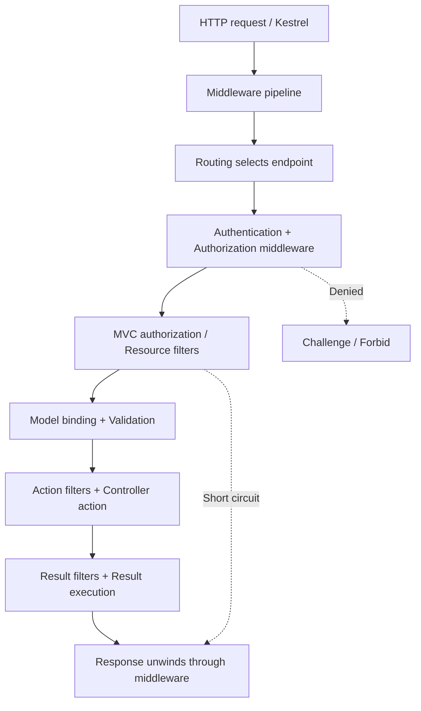
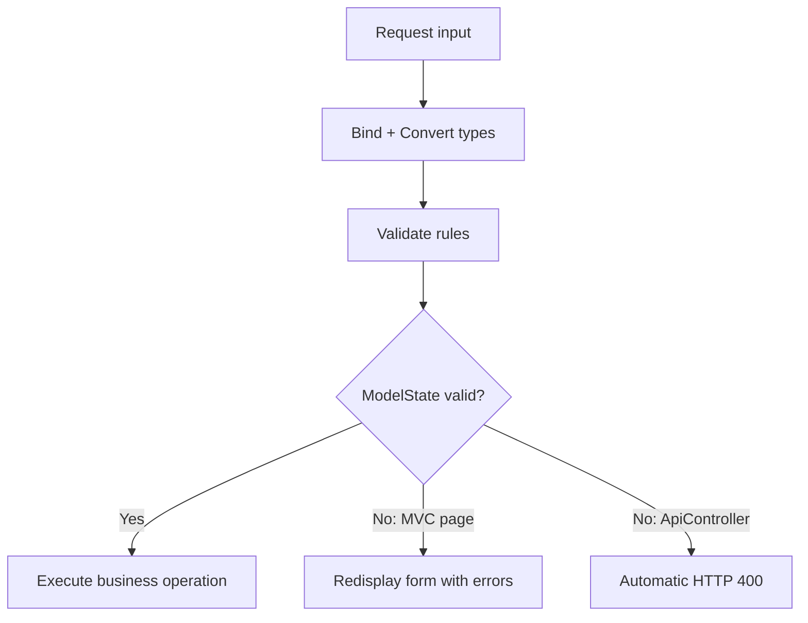
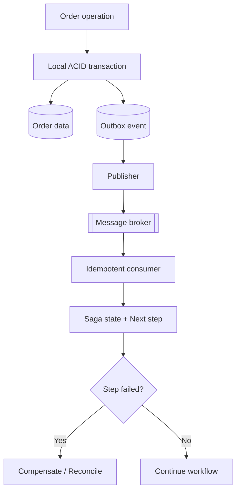
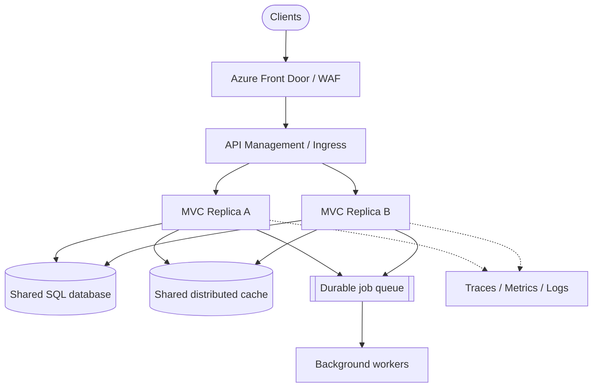
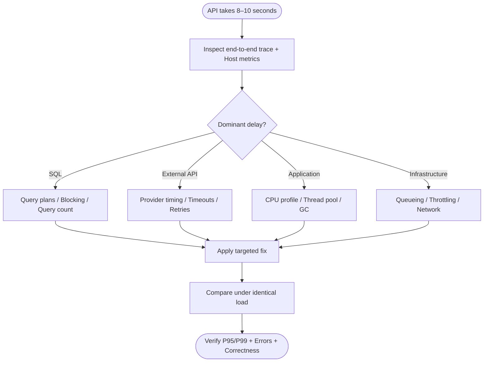

# ASP.NET MVC and ASP.NET Core MVC — Experienced Interview Guide

A practical guide for Senior .NET Developer, Technical Lead, and Project Lead interviews.

**Scope:** Classic MVC means ASP.NET MVC 5 on .NET Framework. Core MVC means ASP.NET Core MVC. Code uses the modern `Program.cs` hosting style and targets .NET 8/9-compatible APIs unless stated otherwise. Examples are focused snippets, not a complete application; domain types, services, configuration, packages, and imports must be supplied as described. Select documentation for your target framework because newer releases can change behavior.

**How to answer:** Start with the main principle, explain the mechanism, give a production example, and discuss one trade-off. The Hexaware labels below follow the interview history provided by the user, rather than an independently verified company question bank.

## Contents

1. [Complete request lifecycle](#1-complete-aspnet-mvc-request-lifecycle)
2. [MVC versus Core MVC](#2-aspnet-mvc-versus-aspnet-core-mvc)
3. [Model, View, Controller responsibilities](#3-mvc-architecture-and-responsibilities)
4. [Routing](#4-conventional-routing-versus-attribute-routing)
5. [Filters](#5-authorization-action-result-and-exception-filters)
6. [Dependency injection](#6-dependency-injection-in-aspnet-core-mvc-hexaware)
7. [Service lifetimes](#7-transient-scoped-and-singleton-lifetimes-hexaware)
8. [Scoped dependency inside singleton](#8-why-a-singleton-must-not-capture-dbcontext-hexaware)
9. [Middleware versus filters](#9-middleware-versus-mvc-filters)
10. [Authentication versus authorization](#10-authentication-versus-authorization)
11. [JWT and roles](#11-jwt-authentication-and-role-based-authorization-hexaware)
12. [Security vulnerabilities](#12-preventing-csrf-xss-sql-injection-and-open-redirects)
13. [ViewData, ViewBag, TempData](#13-viewdata-versus-viewbag-versus-tempdata)
14. [Strongly typed views](#14-strongly-typed-views)
15. [Partial views and view components](#15-partial-view-versus-view-component)
16. [Model binding](#16-model-binding-internals)
17. [Validation](#17-model-validation-and-custom-validation)
18. [Global exceptions](#18-global-exception-handling)
19. [Performance](#19-improving-a-slow-mvc-application)
20. [Caching](#20-memory-cache-versus-distributed-cache)
21. [Async scalability](#21-asyncawait-and-asynchronous-controller-actions)
22. [Repository trade-offs](#22-repository-pattern-versus-direct-dbcontext)
23. [Transactions](#23-transactions-across-services-and-repositories)
24. [High traffic architecture](#24-high-traffic-and-horizontal-scaling)
25. [8–10 second API diagnosis](#25-scenario-an-api-takes-810-seconds)

---

## 1. Complete ASP.NET MVC request lifecycle
### High-level flow

1. Browser sends a request.
2. IIS receives the request.
3. ASP.NET routing system selects a route.
4. MVC creates the controller.
5. Model binding maps request data to action parameters.
6. Action filters run.
7. Controller action executes.
8. Result filters run.
9. Action result executes, such as rendering a view or returning JSON.
10. Response is sent back.

### Detailed lifecycle in classic ASP.NET MVC

- **Routing**
  - The route table matches the URL to a controller and action.
- **Controller creation**
  - MVC uses a controller factory to instantiate the controller.
- **Model binding**
  - Parameters are populated from route values, query strings, form data, headers, and files.
- **Validation**
  - Data annotations and custom validation run during binding.
- **Action filters**
  - `OnActionExecuting` runs before the action.
  - `OnActionExecuted` runs after the action.
- **Action execution**
  - The controller method executes and returns an `ActionResult`.
- **Result filters**
  - `OnResultExecuting` runs before the result executes.
  - `OnResultExecuted` runs after execution.
- **View rendering or response writing**
  - A Razor view may be rendered, or JSON/file/redirect result may be returned.
- **Exception filters**
  - Handle unhandled exceptions thrown during controller/action/result execution.

### Important interview point

The MVC lifecycle is not only “controller action then view.”  
It includes routing, controller creation, model binding, validation, filters, action execution, result execution, and exception handling.

### ASP.NET Core MVC

The main successful path is:



Controller activation and parameter binding occur inside action invocation; constructor injection resolves services from the request scope. A resource filter can short-circuit before binding. An action filter can return a result without executing the action. Exception handling is conditional, rather than another mandatory step in the happy path.

A typical explicit middleware arrangement is:

```csharp
var app = builder.Build();

if (!app.Environment.IsDevelopment())
{
    app.UseExceptionHandler("/Home/Error");
    app.UseHsts();
}

app.UseHttpsRedirection();
app.UseStaticFiles();
app.UseRouting();
app.UseAuthentication();
app.UseAuthorization();

app.MapControllerRoute(
    name: "default",
    pattern: "{controller=Home}/{action=Index}/{id?}");
app.MapControllers();
app.Run();
```

This assumes MVC and authentication services have been registered. Static files placed before authorization are public unless separately protected. API errors generally need JSON Problem Details, while browser pages can use an error view.

**Follow-up:** `return View(model)` creates a result; Razor rendering happens later. An action timer alone can miss slow view rendering or response serialization.

References: [MVC 5 lifecycle](https://learn.microsoft.com/en-us/aspnet/mvc/overview/getting-started/lifecycle-of-an-aspnet-mvc-5-application), [Core MVC filters](https://learn.microsoft.com/en-us/aspnet/core/mvc/controllers/filters?view=aspnetcore-9.0).

## 2. ASP.NET MVC versus ASP.NET Core MVC

### ASP.NET MVC
- Runs on the .NET Framework.
- Typically hosted on IIS.
- Uses `System.Web`.
- Older pipeline and heavier runtime.
- Less modular.
- Cross-platform support is not available.

### ASP.NET Core MVC
- Runs on .NET Core / modern .NET.
- Cross-platform: Windows, Linux, macOS.
- Built on a modular, lightweight pipeline.
- No `System.Web`.
- Built-in dependency injection.
- Better performance.
- Unified hosting model.
- Supports side-by-side versioning.
- Easier cloud-native deployment.

| Area | Classic ASP.NET MVC 5 | ASP.NET Core MVC |
| --- | --- | --- |
| Runtime | .NET Framework | Modern .NET |
| Platform | Windows-oriented ASP.NET hosting | Cross-platform |
| HTTP infrastructure | `System.Web`, modules and handlers | Composable middleware |
| Hosting | Typically IIS | Kestrel, optionally behind IIS or another proxy |
| Controller APIs | MVC and Web API use different frameworks | Shared MVC infrastructure for views and APIs |
| DI | Configure an external resolver/container | Built-in service container |
| Configuration | `Web.config`, configuration APIs | Providers: JSON, environment, secrets, others |
| Startup | `Global.asax`, App_Start conventions | `Program.cs`; older Core projects use Startup |
| Controller namespaces | `System.Web.Mvc` | `Microsoft.AspNetCore.Mvc` |
| Logging | Choose/configure logging integrations | `ILogger<T>` abstraction integrated with host |
| UI reuse | Partial views, child actions | Partial views and view components |
| Deployment | Often machine-level framework dependency | Framework-dependent or self-contained |

**Production implication:** Migration requires replacing `System.Web` usage, authentication setup, filters, configuration, and hosting assumptions. Renaming namespaces does not migrate the application architecture.

**Interview answer:** “Core MVC keeps the MVC design pattern but changes the runtime and web infrastructure. I would inventory framework dependencies and migrate incrementally, validating routing, authentication, serialization, and session behavior.”

ASP.NET Core MVC is a complete redesign focused on performance, modularity, dependency injection, and cross-platform support, while ASP.NET MVC is the older framework tied to the .NET Framework and System.Web.


Reference: [ASP.NET Core MVC overview](https://learn.microsoft.com/en-us/aspnet/core/mvc/overview).

## 3. MVC architecture and responsibilities

| Component | Responsibility | Order example |
| --- | --- | --- |
| Model | Represents state and relevant rules; includes domain, input, and presentation models | Order entity, CreateOrderRequest, OrderDetailsViewModel |
| View | Presents data using Razor and presentation logic | Display order details and validation messages |
| Controller | Handles HTTP input, invokes application operations, selects a response | Bind request, call order service, return view/JSON |

MVC stands for **Model–View–Controller**.

### Model
Responsibilities:
- Represents application data and business rules.
- Encapsulates domain entities and business logic.
- Handles data access or coordinates with services/repositories.
- Should not contain UI logic.

Examples:
- `Customer`, `Order`, `Product`
- DTOs
- View models
- Domain models

### View
Responsibilities:
- Displays data to the user.
- Contains presentation/UI logic.
- Renders HTML using Razor in ASP.NET MVC/Core MVC.
- Should be as thin as possible.

### Controller
Responsibilities:
- Handles incoming requests.
- Orchestrates model and view.
- Validates request flow.
- Calls services/business layer.
- Returns views, JSON, redirects, or files.

### MVC data flow

```mermaid
flowchart LR
    Browser --> Controller
    Controller --> Model
    Model --> Controller
    Controller --> View
    View --> Browser

## 4. Conventional routing versus attribute routing

Routing matches paths and HTTP constraints to endpoints and also helps generate URLs.

| Approach | Mechanism | Suitable use |
| --- | --- | --- |
| Conventional | Central template maps controller/action route values | Browser MVC pages with consistent URL conventions |
| Attribute | Templates declared on controller/action | Resource-oriented APIs, versioned URLs |

```csharp
// Program.cs: conventional routing
app.MapControllerRoute(
    "default", "{controller=Home}/{action=Index}/{id?}");

// Attribute routing
[ApiController]
[Route("api/orders")]
public sealed class OrdersApiController : ControllerBase
{
    [HttpGet("{id:int}")]
    public IActionResult Get(int id) => Ok(new { id });
}
```

`GET /api/orders/42` matches; `/api/orders/abc` does not match the `int` constraint. Constraints disambiguate routes; business validation should produce meaningful validation responses rather than relying on routing failures.

Attribute templates combine unless an action template starts with `/` or `~/`. Multiple endpoints matching equally can produce an ambiguity exception. Conventional route registration order matters; attribute endpoint matching primarily uses template specificity and endpoint selection rules, not source-file order.

Use `Url.Action`, tag helpers, or `LinkGenerator` rather than hard-coded application URLs. Areas group larger MVC applications, but are not independent service boundaries.

Reference: [Controller routing](https://learn.microsoft.com/en-us/aspnet/core/mvc/controllers/routing).

## 5. Authorization, Action, Result, and Exception filters

“Action filters” is sometimes used loosely for all MVC filters. Technically action filters are one category.

| Filter | Timing / purpose | Example |
| --- | --- | --- |
| Authorization | Early MVC access checks; prefer authorization policies | Reject unauthorized requests |
| Resource (Core) | Surrounds most MVC processing, before binding | Avoid expensive binding on a short-circuit path |
| Action | Before/after action execution, after binding | Inspect arguments, apply action-specific auditing |
| Result | Around result execution | Add headers before rendering |
| Exception | Handles eligible unhandled MVC invocation exceptions | MVC-specific exception translation |

In .NET 8/9, exception filters do not catch exceptions from resource filters, result filters, or result execution; global middleware is the broader boundary. Verify exact filter behavior for the target version.

At equal order, global filters normally wrap controller filters, which wrap action filters; “after” processing reverses nesting. `Order` can change ordering. Register DI-dependent filters through the container.

```csharp
using System.Diagnostics;
using Microsoft.AspNetCore.Mvc.Filters;

public sealed class ActionTimingFilter(ILogger<ActionTimingFilter> logger)
    : IAsyncActionFilter
{
    public async Task OnActionExecutionAsync(
        ActionExecutingContext context, ActionExecutionDelegate next)
    {
        var timer = Stopwatch.StartNew();
        try { await next(); }
        finally
        {
            logger.LogInformation("Action {Action} took {ElapsedMs} ms",
                context.ActionDescriptor.DisplayName,
                timer.Elapsed.TotalMilliseconds);
        }
    }
}

// Registration
builder.Services.AddScoped<ActionTimingFilter>();
builder.Services.AddControllersWithViews(options =>
    options.Filters.AddService<ActionTimingFilter>());
```

This measures the action-filter segment, not the entire HTTP request or Razor rendering. Avoid logging sensitive argument values.

Reference: [Filters, select .NET 9](https://learn.microsoft.com/en-us/aspnet/core/mvc/controllers/filters?view=aspnetcore-9.0).

## 6. Dependency injection in ASP.NET Core MVC (Hexaware)

**Interview answer:** Register abstractions and implementations in the service collection, then declare dependencies through constructors. The container constructs the object graph and manages scopes/disposal.

```csharp
using Microsoft.EntityFrameworkCore;

builder.Services.AddControllersWithViews();
builder.Services.AddDbContext<AppDbContext>(options =>
    options.UseSqlServer(builder.Configuration.GetConnectionString("MainDb")));
builder.Services.AddScoped<IOrderService, OrderService>();
builder.Services.AddTransient<IEmailFormatter, EmailFormatter>();
builder.Services.AddSingleton<TimeProvider>(TimeProvider.System);
```

A controller receives `IOrderService`, which may receive `AppDbContext`. This makes dependencies visible and permits controlled substitutes in unit tests. `[FromServices]` can resolve an action-specific dependency, but constructor injection is usually clearer for a controller's core collaborators.

Use options classes for typed settings. Avoid service locator calls throughout business code and avoid calling `BuildServiceProvider()` during registration; this can create a second container and duplicate singleton instances.

**Production example:** An order service and its repositories use one request-scoped context. A stateless formatter is transient. A process-wide thread-safe lookup service can be singleton.

Reference: [Dependency injection](https://learn.microsoft.com/en-us/aspnet/core/fundamentals/dependency-injection).

## 7. Transient, Scoped, and Singleton lifetimes (Hexaware)

| Lifetime | Instance boundary | Good example | Main caution |
| --- | --- | --- | --- |
| Transient | New instance per resolution | Lightweight formatter | A long-lived consumer can retain the instance |
| Scoped | One instance per DI scope, normally one HTTP request | DbContext, application unit of work | Never assume scope means user session |
| Singleton | One instance per service provider | Thread-safe shared metadata | No request/user state; synchronization required |

A transient is not automatically disposed immediately after one method call; disposal depends on its resolving scope. Scoped services resolved repeatedly within the same scope share an instance. Two HTTP requests normally get different instances.

A singleton is per process/container, not globally shared across all replicas. Mutable singleton state must be thread-safe. A singleton can depend on a transient, but that captured transient effectively lives with the singleton and must tolerate that usage.

**Follow-up:** “Is `DbContext` thread-safe?” No. Scoped lifetime limits sharing across requests but does not make concurrent calls within one request safe.

**Answer in 30 seconds:** “Transient is per resolution, scoped is per scope, and singleton is per container. I choose the lifetime from state ownership, resource lifetime, and concurrency requirements.”

## 8. Why a Singleton must not capture DbContext (Hexaware)

A singleton constructor taking a scoped context creates a **captive dependency**. Request-scoped state can outlive its intended boundary, tracked entities accumulate, and overlapping operations can use a non-thread-safe context. Scope validation can reject this configuration.

```csharp
// Incorrect when registered as Singleton
public sealed class BadOrderCache(AppDbContext db)
{
    // The singleton retains this scoped context.
}
```

For a hosted worker, create a scope for each bounded unit of work:

```csharp
public sealed class OrderWorker(IServiceScopeFactory scopes) : BackgroundService
{
    protected override async Task ExecuteAsync(CancellationToken stoppingToken)
    {
        using var timer = new PeriodicTimer(TimeSpan.FromSeconds(30));
        while (await timer.WaitForNextTickAsync(stoppingToken))
        {
            await using var scope = scopes.CreateAsyncScope();
            var processor = scope.ServiceProvider
                .GetRequiredService<IOrderProcessor>();
            await processor.ProcessBatchAsync(stoppingToken);
        }
    }
}
```

Register the processor scoped and the worker with `AddHostedService<OrderWorker>()`. Production workers also need per-iteration failure handling and durable job semantics. Alternatively use `IDbContextFactory<T>` and dispose each created context. Never keep the scoped service after disposing its scope.

Reference: [DbContext lifetime and thread safety](https://learn.microsoft.com/en-us/ef/core/dbcontext-configuration/).

## 9. Middleware versus MVC filters

Middleware is a delegate/component in the HTTP pipeline. It can run code before and after calling the next component, or stop processing by returning a response.

| Aspect | Middleware | MVC filters |
| --- | --- | --- |
| Reach | Requests passing its pipeline position | MVC invocation |
| Context | HttpContext, endpoint metadata when available | Action arguments, ModelState, result context |
| Appropriate concern | Global exceptions, HTTP logging, CORS | Action auditing, MVC-specific response behavior |
| Ordering | Registration/pipeline arrangement | Filter stage, order, scope |
| Short circuit | Do not call next | Set a result / skip the invocation delegate |

```csharp
app.Use(async (context, next) =>
{
    var started = Stopwatch.GetTimestamp();
    try { await next(context); }
    finally
    {
        var elapsed = Stopwatch.GetElapsedTime(started);
        app.Logger.LogInformation("{Method} {Path} completed in {Ms} ms",
            context.Request.Method, context.Request.Path,
            elapsed.TotalMilliseconds);
    }
});
```

Register this before the endpoints it must observe. Conventional middleware is constructed for long-lived use; inject scoped dependencies into `InvokeAsync`, or use factory-activated `IMiddleware` with appropriate registration.

**Follow-up:** A filter cannot replace global exception middleware because routing, static-file handling, and other middleware failures are outside its reach.

## 10. Authentication versus authorization

| Concept | Question | Example |
| --- | --- | --- |
| Authentication | Who is the caller? | Validate a session cookie or bearer token |
| Authorization | May the caller perform this operation? | Admin policy plus order ownership check |

Authentication creates a `ClaimsPrincipal`; authorization evaluates permissions. `[Authorize]` normally requires an authenticated principal. Roles, claims, policies, and resource-based rules provide finer decisions.

For bearer APIs, missing/invalid credentials generally cause **401 Challenge**; valid credentials without permission generally cause **403 Forbid**. Cookie browser applications may redirect to sign-in/access-denied pages; API behavior varies with framework version and configuration.

A role does not prove tenant membership or record ownership. After locating an order, authorize access to that specific resource to prevent insecure direct object references.

```csharp
[Authorize(Policy = "CanReadOrders")]
public async Task<IActionResult> Details(int id, CancellationToken ct)
{
    var order = await orders.FindAsync(id, ct);
    if (order is null) return NotFound();

    var result = await authorization.AuthorizeAsync(User, order, "OrderOwner");
    if (!result.Succeeded) return Forbid();
    return View(order);
}
```

Reference: [Authentication overview](https://learn.microsoft.com/en-us/aspnet/core/security/authentication/).

## 11. JWT authentication and role-based authorization (Hexaware)

**Approach:** An identity provider issues an access token. The API validates signature, trusted issuer, audience, and expiry before trusting claims. JWT payloads are normally readable; signing is not encryption. Use access tokens for APIs, not OIDC ID tokens.

```csharp
using Microsoft.AspNetCore.Authentication.JwtBearer;

builder.Services.AddAuthentication(JwtBearerDefaults.AuthenticationScheme)
    .AddJwtBearer(options =>
    {
        options.Authority = builder.Configuration["Jwt:Authority"];
        options.Audience = builder.Configuration["Jwt:Audience"];
        options.RequireHttpsMetadata = true;
        options.MapInboundClaims = false;
        options.TokenValidationParameters.RoleClaimType = "roles";
        options.TokenValidationParameters.NameClaimType = "name";
    });

builder.Services.AddAuthorization(options =>
{
    options.AddPolicy("OrderManagers", policy =>
        policy.RequireAuthenticatedUser().RequireRole("Admin", "Manager"));
});

// Pipeline: routing, authentication, then authorization
app.UseAuthentication();
app.UseAuthorization();
```

```csharp
[ApiController]
[Route("api/orders")]
[Authorize]
public sealed class OrdersApiController : ControllerBase
{
    [HttpPost]
    [Authorize(Policy = "OrderManagers")]
    public IActionResult Create(CreateOrderRequest request) => Accepted();
}
```

`RequireRole("Admin", "Manager")` accepts either role. The claim name must match the provider. Microsoft Entra application roles and delegated scopes are different; configure and enforce whichever permission model the endpoint needs. Install a framework-compatible `Microsoft.AspNetCore.Authentication.JwtBearer` package.

For server-rendered MVC, cookie sessions established through OIDC are usually suitable. A browser app can use a server-side backend-for-frontend so tokens remain server-side. Token refresh, logout, revocation needs, key rotation, and short token lifetimes belong in the security design; do not create a home-grown token issuer for convenience.

Reference: [JWT bearer authentication](https://learn.microsoft.com/en-us/aspnet/core/security/authentication/configure-jwt-bearer-authentication).

## 12. Preventing CSRF, XSS, SQL injection, and open redirects

| Threat | Mechanism | Prevention |
| --- | --- | --- |
| CSRF | Browser automatically sends victim credentials to a forged request | Antiforgery token for cookie-authenticated mutations; safe HTTP semantics |
| XSS | Untrusted content executes in browser | Context-specific encoding, safe DOM APIs, sanitization for permitted rich HTML |
| SQL injection | Input becomes SQL syntax | Parameterized queries; allowlist dynamic identifiers |
| Open redirect | Untrusted return URL sends users to attacker site | LocalRedirect / validate local URLs |

### CSRF

```csharp
[HttpPost]
[ValidateAntiForgeryToken]
public async Task<IActionResult> Create(CreateOrderViewModel model)
{
    if (!ModelState.IsValid) return View(model);
    await orders.CreateAsync(model);
    return RedirectToAction(nameof(Index));
}
```

Razor POST forms using the form tag helper can include the token automatically; otherwise use `@Html.AntiForgeryToken()`. Global `AutoValidateAntiforgeryTokenAttribute` is useful for browser MVC actions, but apply API security deliberately instead of indiscriminately enforcing a browser form token on bearer-only APIs.

SameSite cookies help, but are not the whole defense. An explicitly attached bearer header reduces classic CSRF exposure; a token stored in an automatically sent cookie brings that risk back. CORS is not a replacement for CSRF protection.

### XSS

Razor encodes ordinary `@Model.Text`. Avoid `Html.Raw(untrustedText)`. HTML encoding does not automatically make input safe inside JavaScript, URLs, or every DOM context. Prefer `textContent`; sanitize explicitly permitted rich text with a maintained sanitizer. A Content Security Policy adds another layer.

### SQL injection

```csharp
// LINQ values become parameters.
var matches = await db.Customers
    .Where(x => x.Email == email).ToListAsync(ct);

// Interpolated API parameterizes the value.
var rows = await db.Customers
    .FromSqlInterpolated($"SELECT * FROM Customers WHERE Email = {email}")
    .ToListAsync(ct);
```

Do not concatenate values into `FromSqlRaw`. Column names and sort expressions cannot be treated like ordinary value parameters; select them from an allowlist.

### Open redirects

```csharp
if (!string.IsNullOrEmpty(returnUrl) && Url.IsLocalUrl(returnUrl))
    return LocalRedirect(returnUrl);
return RedirectToAction("Index", "Home");
```

References: [CSRF](https://learn.microsoft.com/en-us/aspnet/core/security/anti-request-forgery), [XSS](https://learn.microsoft.com/en-us/aspnet/core/security/cross-site-scripting), [Open redirects](https://learn.microsoft.com/en-us/aspnet/core/security/preventing-open-redirects).

## 13. ViewData versus ViewBag versus TempData

| Property | ViewData | ViewBag | TempData |
| --- | --- | --- | --- |
| Shape | String-keyed dictionary | Dynamic wrapper over ViewData | String-keyed temporary storage |
| Lifetime | Current request/view rendering | Same as ViewData | Survives redirect until consumed |
| Type checking | Casts for complex values | Runtime dynamic access | Serialization/provider constraints |
| Typical purpose | Small supplementary view values | Convenience for the same values | Flash message after successful POST |

`ViewData["Title"]` and `ViewBag.Title` access the same underlying data. Neither is ideal for the main page model.

```csharp
TempData["Success"] = "Order created.";
return RedirectToAction(nameof(Index));
```

Reading TempData normally marks the key for removal at request completion. `Peek` reads without consuming; `Keep` retains values. Core uses a cookie TempData provider by default, with a session provider available. Keep payloads small; do not put entities or authoritative workflow state into TempData.

For session-backed TempData/session in multiple replicas, configure shared state. Cookie-backed TempData requires consistent Data Protection keys across replicas.

Reference: [Application state](https://learn.microsoft.com/en-us/aspnet/core/fundamentals/app-state).

## 14. Strongly typed views

A strongly typed view declares its model type with `@model`, enabling type checking, navigation, and editor support. Use presentation-specific models rather than exposing persistence entities by default.

```csharp
public sealed record OrderDetailsViewModel(
    int Id, string CustomerName, decimal Total, string Status);
```

```cshtml
@model OrderDetailsViewModel
<h1>Order @Model.Id</h1>
<p>Customer: @Model.CustomerName</p>
<p>Total: @Model.Total.ToString("C")</p>
<p>Status: @Model.Status</p>
```

A view model helps control exposed fields and format combined data. Separate input models also reduce overposting: a CreateOrder input should not accept server-owned fields such as approval status or calculated total.

**Trade-off:** Mapping costs some code, but it keeps persistence changes from unnecessarily breaking page contracts.

Reference: [Views](https://learn.microsoft.com/en-us/aspnet/core/mvc/views/overview).

## 15. Partial View versus View Component

| Area | Partial view | View component |
| --- | --- | --- |
| Purpose | Reuse markup supplied with data | Reusable UI with its own retrieval/orchestration |
| DI/business access | Prefer prepare data before rendering | Constructor DI supported |
| Entry method | Render a `.cshtml` fragment | `Invoke` / `InvokeAsync` |
| HTTP endpoint | Not independently an endpoint | Not a controller action endpoint |
| Example | Address block, order row | Cart summary, role-based navigation |

```cshtml
<partial name="_Address" model="Model.Address" />
@await Component.InvokeAsync("CartSummary", new { userId = Model.UserId })
```

```csharp
public sealed class CartSummaryViewComponent(ICartQuery cart) : ViewComponent
{
    public async Task<IViewComponentResult> InvokeAsync(string userId)
    {
        var model = await cart.GetSummaryAsync(userId);
        return View(model);
    }
}
```

A component commonly renders `Views/Shared/Components/CartSummary/Default.cshtml`. Partial views do not run `_ViewStart`. Components do not use the controller model-binding/filter lifecycle; their arguments come from invocation. Establish trusted user identity server-side rather than trusting a caller-selected user ID for a private cart.

Classic MVC 5 has child actions; Core uses view components for many corresponding UI composition cases.

Reference: [View components](https://learn.microsoft.com/en-us/aspnet/core/mvc/views/view-components).

## 16. Model binding internals

**Mechanism:** MVC obtains parameter metadata, selects binding sources/binders, looks up values, converts types, constructs complex objects, and records conversion errors in `ModelState`. JSON body input uses an input formatter rather than ordinary key/value conversion.

```csharp
[HttpPut("{id:int}")]
public IActionResult Update(
    [FromRoute] int id,
    [FromQuery] bool notify,
    [FromBody] UpdateOrderRequest request,
    [FromHeader(Name = "X-Correlation-ID")] string? correlationId)
{
    return NoContent();
}
```

Binding sources include route, query, form, headers, body, and DI. `[ApiController]` enables binding-source inference and other API conventions. A body stream normally supplies one body-bound object; put multiple JSON fields into one request DTO.

`?quantity=abc` for an integer creates a binding error. `[BindRequired]` for form binding is not a general JSON-required-property solution. Missing values and conversion errors have different handling, so use nullable input properties where missing values must be distinguished from zero.

Custom `IModelBinder` implementations suit unusual representations, such as a legacy encoded identifier. Keep expensive domain lookup and authorization in application logic when possible. Dedicated input DTOs are a stronger overposting boundary than assuming every entity property is safe to bind.

Reference: [Model binding](https://learn.microsoft.com/en-us/aspnet/core/mvc/models/model-binding).

## 17. Model validation and custom validation

Binding answers “Can input become the requested type?” Validation answers “Does the resulting value satisfy rules?” `ModelState` contains errors from both.



Use attributes for simple field constraints, `IValidatableObject` for synchronous cross-field checks, and application services for database-dependent rules. Client validation improves usability; the server must still enforce rules.

```csharp
using System.ComponentModel.DataAnnotations;

public sealed class BookingRequest : IValidatableObject
{
    [Required, StringLength(100)]
    public string CustomerName { get; set; } = "";
    public DateTime Start { get; set; }
    public DateTime End { get; set; }

    public IEnumerable<ValidationResult> Validate(ValidationContext context)
    {
        if (End <= Start)
            yield return new ValidationResult(
                "End must be after Start.", new[] { nameof(End) });
    }
}
```

A custom property attribute derives from `ValidationAttribute` and overrides `IsValid`; client support requires an adapter or client validator. Avoid synchronous database calls inside attributes.

Ordinary MVC controllers inspect `ModelState.IsValid` and return the same view with its model if invalid. `[ApiController]` normally returns automatic 400 validation responses before the action executes.

A uniqueness precheck improves feedback but cannot prevent concurrent duplicates. A database unique constraint remains necessary; translate the resulting conflict appropriately. Authorization and inventory availability are also application rules, not merely DataAnnotations.

Reference: [Model validation](https://learn.microsoft.com/en-us/aspnet/core/mvc/models/validation).

## 18. Global exception handling

Use a broad HTTP exception boundary with safe responses, structured logging, and trace correlation. Distinguish expected outcomes such as validation or missing resources from unexpected defects.

For a .NET 8/9 API:

```csharp
using System.Diagnostics;
using Microsoft.AspNetCore.Diagnostics;
using Microsoft.AspNetCore.Mvc;

builder.Services.AddProblemDetails();
builder.Services.AddExceptionHandler<ApiExceptionHandler>();

// Register early enough to wrap downstream processing.
app.UseExceptionHandler();

public sealed class ApiExceptionHandler(ILogger<ApiExceptionHandler> logger)
    : IExceptionHandler
{
    public async ValueTask<bool> TryHandleAsync(
        HttpContext context, Exception exception, CancellationToken ct)
    {
        var traceId = Activity.Current?.Id ?? context.TraceIdentifier;
        logger.LogError(exception, "Unhandled request failure {TraceId}", traceId);

        context.Response.StatusCode = StatusCodes.Status500InternalServerError;
        await context.Response.WriteAsJsonAsync(new ProblemDetails
        {
            Status = 500,
            Title = "An unexpected error occurred.",
            Extensions = { ["traceId"] = traceId }
        }, cancellationToken: ct);
        return true;
    }
}
```

The sample returns a generic JSON error. Browser MVC applications can use `UseExceptionHandler("/Home/Error")`; mixed applications should select a response appropriate to the endpoint. Do not expose SQL text, secrets, or stack traces to users. Development exception pages are development-only.

Once response headers/body have started, replacing the response may be impossible. Background jobs need their own failure handling. A 404 with no exception requires status-code handling, not exception handling.

Classic MVC uses mechanisms such as `HandleErrorAttribute`, `Application_Error`, and IIS/custom-error configuration, with different scope and configuration requirements.

Reference: [Error handling](https://learn.microsoft.com/en-us/aspnet/core/fundamentals/error-handling).

## 19. Improving a slow MVC application

**Interview answer:** “I establish a latency budget, measure the critical path, fix the dominant bottleneck, and compare under the same workload.”

| Layer | Typical issue | Evidence | Targeted change |
| --- | --- | --- | --- |
| SQL | Scan, blocking, N+1, excessive rows | Plans, query count, waits | Index/query redesign, projection, pagination |
| Application | Blocking async, expensive loops | Profiler, thread-pool/CPU counters | Async I/O, algorithm changes |
| External dependency | Slow provider, connection churn | Dependency traces | Pool clients, timeouts, bounded resilience |
| View / JSON | Oversized object graph | Result execution timing, payload size | Smaller view models/DTOs |
| Infrastructure | CPU throttling, memory pressure | Host/container metrics | Right-size after measuring |
| Browser | Large assets / render work | Browser network and performance tools | Asset optimization, fewer round trips |

**Order-list example:** Project directly to a DTO; use `AsNoTracking()` for read-only entity queries; avoid per-row queries; limit results. Confirm generated SQL before assuming an ORM call is efficient.

```csharp
var page = await db.Orders.AsNoTracking()
    .OrderByDescending(x => x.Id)
    .Where(x => x.Id < beforeId)
    .Take(50)
    .Select(x => new OrderListDto(x.Id, x.Customer.Name, x.Total))
    .ToListAsync(ct);
```

The sample uses keyset pagination; supply a sensible first-page boundary. If projecting only scalar DTO values, entity tracking often is already unnecessary.

Measure P50/P95/P99, throughput, errors, allocation/GC, and resource saturation. Caching cannot repair incorrect authorization, and adding replicas cannot remove a single database bottleneck.

Reference: [ASP.NET Core performance](https://learn.microsoft.com/en-us/aspnet/core/fundamentals/best-practices).

## 20. Memory cache versus distributed cache

| Aspect | IMemoryCache | IDistributedCache |
| --- | --- | --- |
| Location | Application process | Shared external backend |
| Speed | Very low access overhead | Network/serialization overhead |
| Replica behavior | Each replica has its own values | Shared values across instances |
| Survival | Lost on restart | Depends on backend persistence/availability |
| Data | Objects | Serialized strings/bytes |
| Best use | Local reference data | Shared cache/session data |

```csharp
builder.Services.AddMemoryCache();
builder.Services.AddStackExchangeRedisCache(options =>
    options.Configuration = builder.Configuration.GetConnectionString("Redis"));
```

Cache-aside example:

```csharp
public async Task<ProductDto?> GetAsync(int id, CancellationToken ct)
{
    var key = $"product:v1:{id}";
    var cached = await cache.GetStringAsync(key, ct);
    if (cached is not null)
        return JsonSerializer.Deserialize<ProductDto>(cached);

    var product = await catalog.LoadAsync(id, ct);
    if (product is not null)
        await cache.SetStringAsync(key, JsonSerializer.Serialize(product),
            new DistributedCacheEntryOptions
            {
                AbsoluteExpirationRelativeToNow = TimeSpan.FromMinutes(5)
            }, ct);
    return product;
}
```

This basic snippet does not solve cache stampedes or races between database writes and cache fills. Add bounded refresh coordination, TTL jitter, and versioned invalidation where required. Cache keys must include tenant/user dimensions when data is private. Set memory limits and avoid unbounded attacker-controlled keys.

`[ResponseCache]` primarily sets HTTP caching metadata; it does not independently store responses. Output caching is a server-controlled response cache and needs `AddOutputCache`, `UseOutputCache`, and policies/attributes. Do not casually cache authenticated HTML containing private information or antiforgery tokens. Hybrid caching can combine layers, but deployment-wide coordination must be understood separately from per-process coordination.

References: [Caching overview](https://learn.microsoft.com/en-us/aspnet/core/performance/caching/overview), [Output caching](https://learn.microsoft.com/en-us/aspnet/core/performance/caching/output).

## 21. Async/await and asynchronous controller actions

Async I/O releases a request thread while waiting for SQL, HTTP, or other I/O. That improves concurrency and helps avoid thread-pool starvation. It does not inherently make SQL execute faster or make CPU-heavy work cheaper.

```csharp
[HttpGet("{id:int}")]
public async Task<ActionResult<OrderDto>> Get(int id, CancellationToken ct)
{
    var order = await db.Orders.AsNoTracking()
        .Where(x => x.Id == id)
        .Select(x => new OrderDto(x.Id, x.Total))
        .SingleOrDefaultAsync(ct);
    if (order is null) return NotFound();
    return Ok(order);
}
```

Avoid `.Result`, `.Wait()`, and synchronous database calls on request paths. `Task.Run` around blocking I/O still consumes a thread and generally does not improve server scalability. Classic ASP.NET's synchronization context can cause sync-over-async deadlocks; Core lacks that same default context but blocking still causes starvation.

Use `Task.WhenAll` only for independent operations with separate safe dependencies and bounded concurrency. Never issue concurrent queries on the same `DbContext`. Propagate request cancellation; a timeout can leave an external side effect's outcome uncertain, so payments need idempotency and reconciliation.

Durable long-running work should be queued and tracked, often returning 202 with an operation URL. Fire-and-forget tasks can lose work and outlive request-scoped dependencies.

## 22. Repository Pattern versus direct DbContext

| Choice | Benefit | Cost |
| --- | --- | --- |
| Direct context in application/query layer | Full EF query expressiveness, fewer wrappers | Application code knows EF |
| Domain-oriented repository | Aggregate operations and domain policy boundary | More interfaces/mapping |
| Generic CRUD repository | Uniform basic operations | Often duplicates DbSet and hides useful EF features |

DbContext already supplies unit-of-work behavior; DbSet resembles repository functionality. A custom repository is justified when it expresses meaningful domain operations such as `LoadOrderForApproval`, rather than merely wrapping every EF method.

For a payroll module, a repository might enforce loading the payroll aggregate with required state. A reporting query can directly project a read DTO using EF without forcing all reports through a generic aggregate repository.

Mocking repositories can verify orchestration, but it cannot verify SQL translation, indexes, transaction isolation, or constraints. Use integration tests against the actual database provider for these concerns. EF's InMemory provider is not a relational substitute; SQLite also differs from SQL Server/PostgreSQL.

**Interview answer:** “I choose the abstraction from domain complexity and testing needs. I avoid adding a generic repository just because it is a pattern.”

## 23. Transactions across services and repositories

Within one relational database, operations sharing a context can participate in one local transaction. A single `SaveChangesAsync` is normally transactional for its changes when the provider supports transactions.

```csharp
await using var tx = await db.Database.BeginTransactionAsync(ct);
try
{
    await orderRepository.AddAsync(order, ct);
    await inventoryRepository.ReserveAsync(order.Items, ct);
    // Both repositories use this same scoped DbContext.
    await db.SaveChangesAsync(ct);
    await tx.CommitAsync(ct);
}
catch
{
    await tx.RollbackAsync(CancellationToken.None);
    throw;
}
```

This assumes repository methods stage changes and do not independently commit. If only one SaveChanges is needed, an explicit transaction may be unnecessary. Explicit transactions matter when multiple saves or other database operations must share a boundary. Keep transactions short; do not hold locks while waiting for a payment provider.

If SQL Server retry execution strategies are enabled, run the explicit transaction as a unit through the execution strategy; retrying only part of a transaction is unsafe. Cross-context transaction sharing requires compatible relational connections/transactions; separate contexts do not automatically share a transaction.

Across services/databases, use durable workflows rather than assuming local ACID covers the network:



The outbox solves database-to-broker dual-write reliability, not exactly-once delivery. Consumers need durable deduplication and atomic local effects. Compensation is a business reversal, not rollback of every database to its original snapshot. Isolation and optimistic concurrency must also prevent business races such as overselling.

Reference: [EF transactions](https://learn.microsoft.com/en-us/ef/core/saving/transactions).

## 24. High traffic and horizontal scaling

**Design principle:** Keep web replicas replaceable; place authoritative state in shared durable systems; scale each bottleneck independently.



| Concern | Implementation decision |
| --- | --- |
| Host | Azure App Service for managed web hosting; AKS when orchestration needs justify it |
| State | No authoritative process-local session/files; use shared backing stores |
| Cookies / antiforgery | Share Data Protection keys and application identity across replicas |
| Files | Store uploads in Blob Storage, not one replica's disk |
| Database | Indexing, query budgets, connection-pool limits, concurrency control |
| Cache | Shared Redis-compatible backend, bounded cache policy and invalidation |
| Work | Durable queue, idempotent workers, DLQ and replay strategy |
| Scaling | App Service autoscale or AKS HPA; queue workers can use KEDA |
| Protection | Rate limiting, timeouts, bounded retries, circuit breaking |
| Deployment | Readiness checks, graceful shutdown, compatible rolling releases |
| Recovery | Backups, tested restore, explicit recovery objectives |

Avoid requiring sticky sessions to make correctness work. Local caching can still accelerate replicas, but invalidation must account for multiple copies. Coordinate recurring jobs through durable scheduling/leases so every replica does not execute the same job.

Scale tests must include the database and external quotas. More replicas create more database connections and can worsen contention. Track latency and saturation before changing replica counts. Use backward-compatible schema migrations (expand/contract) to allow old and new versions to coexist.

**Lead-level follow-up:** Define peak RPS, P95 target, availability, acceptable staleness, recovery time, and budget before selecting infrastructure.

## 25. Scenario: An API takes 8–10 seconds

**Strong opening:** “I first capture an end-to-end trace for a slow request and compare it with a fast request. I separate queueing, SQL, external calls, application work, and response generation before changing code.”

### Step 1 — Establish the symptom

Determine endpoint, input size, tenants affected, cold/warm behavior, concurrency, recent releases, and whether the delay happens at the browser, gateway, or origin. Check P95/P99 and errors, not just one stopwatch reading.

### Step 2 — Trace the critical path

Instrument inbound ASP.NET Core requests, SQL dependencies, outbound HttpClient calls, and custom application spans using OpenTelemetry/Application Insights. Propagate W3C trace context across services and message boundaries. Ensure sampling retains useful slow/error evidence without exposing private input.



### Step 3 — Interpret evidence

| Suspected bottleneck | What to inspect | Example conclusion |
| --- | --- | --- |
| SQL | Dependency spans, Query Store, execution plans, lock waits, returned rows | 150 small SQL calls reveal N+1 |
| SQL connection acquisition | Pool usage, timeouts, context disposal | Slow acquisition despite fast statements |
| Application CPU | CPU profile, hot methods, allocation/GC | Repeated transformation of a large object graph |
| Application blocking | Thread-pool queue, blocked stacks, `.Result` | Low CPU but rising queue time under load |
| External API | DNS/connect/TLS timing, response wait, retries | One provider call and retries consume most budget |
| Infrastructure | Container CPU throttling, memory, gateway/backend timing | CPU limits throttle during peak load |
| Serialization/rendering | Gap after action completion, payload size | Large JSON response adds several seconds |

Low CPU does not prove the application is healthy: it may be blocked on I/O or starved of available threads. A fast database execution plan does not rule out network/pool waits.

### Step 4 — Example latency budget

Hypothetical measured sequential request:

| Segment | Time |
| --- | ---: |
| Gateway / initial processing | 100 ms |
| SQL calls | 2,800 ms |
| External delivery-price API | 5,200 ms |
| Application and serialization | 900 ms |
| **Total** | **9,000 ms** |

These numbers are illustrative, not a benchmark. If spans overlap, do not add all child durations; analyze the critical path. First address the external provider's budget, then SQL, rather than micro-optimizing the 100 ms segment.

Possible fixes depend on evidence: cache valid delivery quotes, set a bounded provider timeout, move nonessential work into a tracked job, eliminate N+1 SQL, or reduce payload. Parallelize only independent operations and never concurrent EF calls on one context. Do not retry non-idempotent operations blindly.

### Step 5 — Verify improvement

Run the same representative workload against the change. Compare tail latency, throughput, errors, CPU, memory, connection pools, and dependency load. Check correctness, stale-cache behavior, cancellation, and failure modes. Revert if improved latency comes from dropping work or hiding errors.

**Two-minute interview answer:**

> I would reproduce the slow endpoint with representative data and inspect an end-to-end trace. SQL spans and Query Store would show query cost, blocking, and N+1 calls. Outbound dependency spans would reveal slow providers or repeated retries. CPU profiles, GC counters, and thread-pool queues would distinguish computation from blocking. I would also check gateway timing, container throttling, and response serialization. Then I would fix the dominant critical-path delay and validate P95/P99 and correctness under the same load, rather than adding replicas without evidence.

---

## Rapid revision table

| Topic | Key interview point |
| --- | --- |
| Request lifecycle | Routing → Security → MVC invocation → Result execution |
| MVC architecture | Thin HTTP controller; application rules outside views |
| Routing | Conventions for pages; attributes for explicit endpoint contracts |
| Filters | Stage-specific MVC hooks; global middleware has wider scope |
| Scoped | One scope, normally one request; not one user |
| Singleton | Per container, thread-safe, no captured scoped dependencies |
| Authentication | Establish trusted caller identity |
| Authorization | Enforce operation and resource permissions |
| JWT | Validate access token signature, issuer, audience, lifetime |
| CSRF | Protect cookie-authenticated mutations with antiforgery |
| Input models | Prevent overposting and separate transport from persistence |
| Async | Frees threads during I/O; does not speed CPU work |
| EF context | Short unit of work; never concurrent operations on one instance |
| Transactions | One local boundary; outbox/saga across services |
| Cache | Explicit key, TTL, invalidation, privacy, and stampede strategy |
| Scale | Externalize state; share Data Protection keys; find bottleneck |
| Slow API | Trace critical path and compare under representative load |

## Static site integration

Save this file in your site's Markdown content directory, for example `public/content/aspnet-mvc-interview-guide.md`. The exact path depends on your site's content loader.

Your Markdown renderer must support GitHub-style tables and Mermaid fences. GitHub renders Mermaid in Markdown, but a custom static website needs its own Mermaid integration. Treat diagram labels as text and use your renderer's security settings when displaying uploaded content.

## Microsoft documentation index

- [Classic MVC 5 lifecycle](https://learn.microsoft.com/en-us/aspnet/mvc/overview/getting-started/lifecycle-of-an-aspnet-mvc-5-application)
- [Core MVC overview](https://learn.microsoft.com/en-us/aspnet/core/mvc/overview)
- [Routing](https://learn.microsoft.com/en-us/aspnet/core/mvc/controllers/routing)
- [Filters — .NET 9](https://learn.microsoft.com/en-us/aspnet/core/mvc/controllers/filters?view=aspnetcore-9.0)
- [Dependency injection](https://learn.microsoft.com/en-us/aspnet/core/fundamentals/dependency-injection)
- [DbContext configuration](https://learn.microsoft.com/en-us/ef/core/dbcontext-configuration/)
- [JWT authentication](https://learn.microsoft.com/en-us/aspnet/core/security/authentication/configure-jwt-bearer-authentication)
- [CSRF protection](https://learn.microsoft.com/en-us/aspnet/core/security/anti-request-forgery)
- [Model binding](https://learn.microsoft.com/en-us/aspnet/core/mvc/models/model-binding)
- [Model validation](https://learn.microsoft.com/en-us/aspnet/core/mvc/models/validation)
- [Error handling](https://learn.microsoft.com/en-us/aspnet/core/fundamentals/error-handling)
- [Performance guidance](https://learn.microsoft.com/en-us/aspnet/core/fundamentals/best-practices)
- [Caching](https://learn.microsoft.com/en-us/aspnet/core/performance/caching/overview)
- [EF transactions](https://learn.microsoft.com/en-us/ef/core/saving/transactions)

Documentation checked October 2026. Code snippets are educational and have not been compiled as a complete application.
