# AKS vs Azure App Service

## Detailed Interview Preparation Guide with Flow Charts

---

## 1. Direct Interview Answer

**Azure App Service** and **Azure Kubernetes Service (AKS)** are both Azure compute platforms, but they solve different problems.

- **Azure App Service** is a fully managed Platform as a Service (PaaS) for hosting web applications, REST APIs, and supported containerized applications.
- **AKS** is a managed Kubernetes platform for deploying, scaling, and operating containerized applications with Kubernetes orchestration.

> **One-line interview answer:**  
> Choose **App Service** for standard web applications and APIs where simplicity and low operational overhead are priorities. Choose **AKS** when you need Kubernetes-level control, complex microservice orchestration, custom networking, advanced scheduling, or a container platform for multiple teams.

---

## 2. Quick Decision Flow Chart

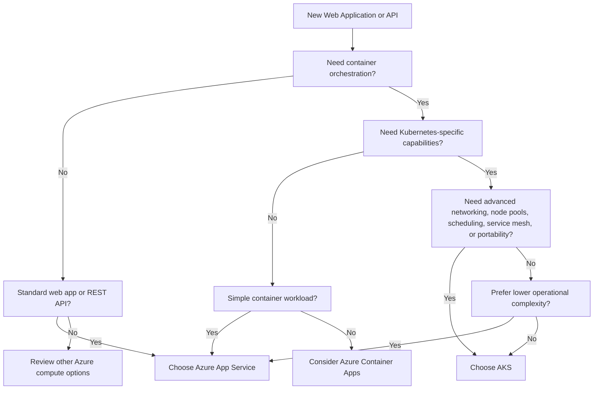

---

## 3. High-Level Comparison

| Area | Azure App Service | Azure Kubernetes Service |
|---|---|---|
| Service model | Managed PaaS | Managed Kubernetes platform |
| Main purpose | Host web apps and APIs | Orchestrate containerized workloads |
| Operational complexity | Low | Medium to high |
| Control level | Moderate | High |
| Container support | Single application container or supported runtimes | Multi-container orchestration using Kubernetes |
| Scaling | App Service plan scaling and autoscale | Pod autoscaling and node autoscaling |
| Deployment | Deployment slots, CI/CD, package or container deployment | Kubernetes manifests, Helm, GitOps, CI/CD |
| Networking | Managed networking and VNet integration | Kubernetes networking, ingress, network policies, VNets |
| Service discovery | Usually application-level or external | Kubernetes Services and DNS |
| Node management | Abstracted from application team | Node pools and workload operations remain important |
| Best for | Standard web apps and APIs | Complex microservices and platform workloads |
| Team requirement | Application development skills | Kubernetes, DevOps, and platform engineering skills |
| Default recommendation | Simpler choice for typical web/API workloads | Use when Kubernetes requirements justify complexity |

Azure describes App Service as a fully managed PaaS for web applications and APIs, while AKS is a managed Kubernetes service for deploying and operating containerized applications at scale. ([learn.microsoft.com](https://learn.microsoft.com/en-us/azure/app-service/overview?enkwrd=barracuda&utm_source=openai))

---

## 4. What Is Azure App Service?

Azure App Service is a managed hosting platform for applications written in common runtimes such as:

- .NET
- Java
- Node.js
- Python
- PHP

It can also run custom containers.

Azure manages much of the underlying infrastructure, including:

- Operating system platform
- Web hosting infrastructure
- Runtime integration
- Platform patching
- Application deployment features
- Autoscaling capabilities
- TLS and custom-domain integration
- Diagnostics and monitoring integrations

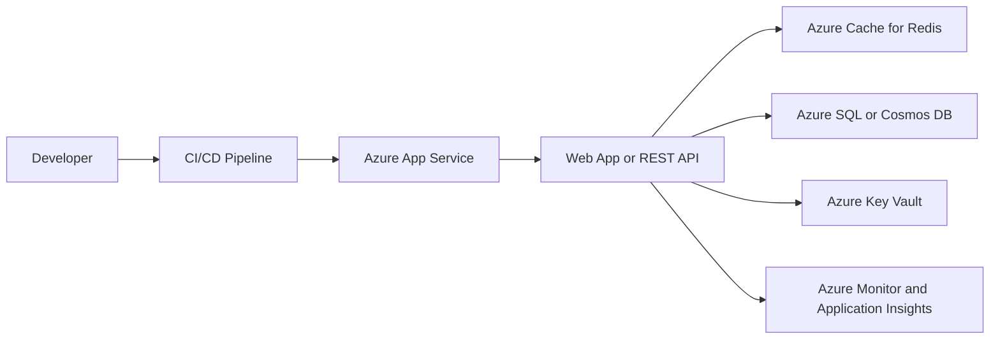

App Service is generally the preferred starting point when the workload is a conventional HTTP application or API and the team does not need Kubernetes-specific platform capabilities.

---

## 5. What Is AKS?

Azure Kubernetes Service is Azure's managed Kubernetes service.

An AKS solution consists conceptually of:

1. A managed Kubernetes control plane
2. Worker nodes
3. Kubernetes workloads running in pods
4. Services and ingress for networking
5. Node pools for workload organization
6. Kubernetes policies and controllers

The control plane manages Kubernetes orchestration, while worker nodes run application pods.

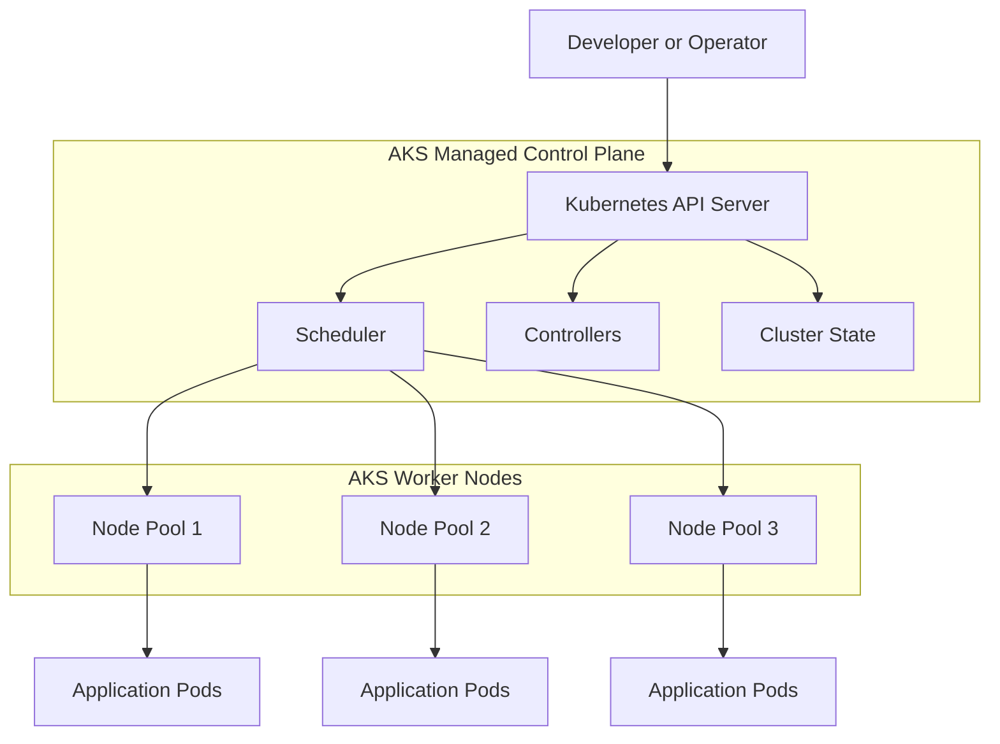

AKS is appropriate when Kubernetes itself is part of the platform requirement rather than merely a way to package an application.

---

## 6. Architecture Difference

### App Service Architecture

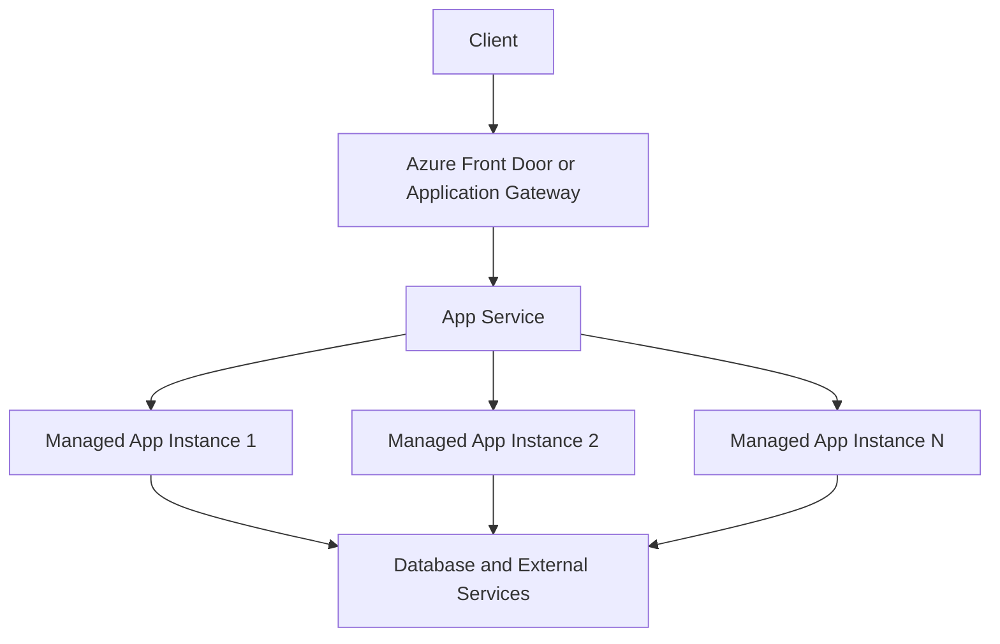

The application runs within an App Service plan. Scaling is generally applied at the plan or app level.

### AKS Architecture

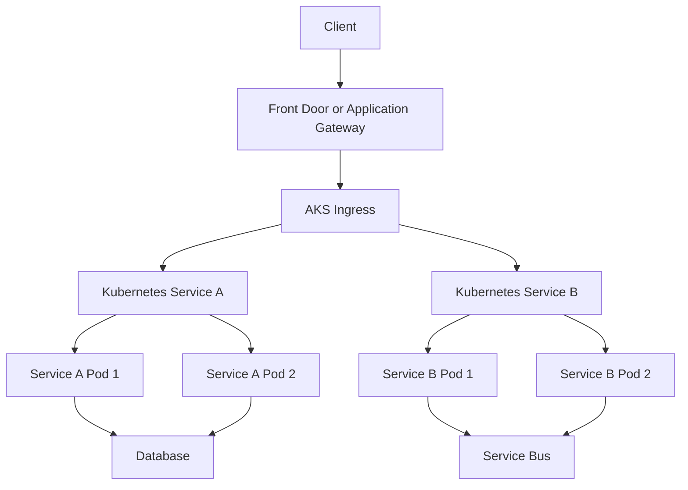

AKS provides Kubernetes-native capabilities such as pods, deployments, services, ingress, namespaces, node pools, and autoscalers.

---

## 7. When Would You Choose Azure App Service?

Choose App Service when:

- You are hosting a standard web application
- You are hosting a REST API
- You need fast delivery
- You want minimal infrastructure management
- You need built-in deployment slots
- You need straightforward autoscaling
- The workload is mostly HTTP-based
- Kubernetes features are not required
- The team has limited Kubernetes experience
- You prefer a managed PaaS model

### Typical Use Cases

- Internal enterprise portals
- Customer-facing web applications
- Mobile backend APIs
- B2B REST APIs
- Admin portals
- Monolithic applications being modernized
- Simple or moderate microservices exposed through HTTP
- Applications using Azure SQL, Cosmos DB, Redis, or Storage

### Example

A company has a .NET web application with:

- 20 API endpoints
- Azure SQL database
- Redis cache
- Standard CI/CD pipeline
- No service mesh
- No custom scheduling
- No need for multiple container sidecars

**App Service would usually be the better choice** because it meets the requirements with less operational complexity.

---

## 8. When Would You Choose AKS?

Choose AKS when you need:

- Kubernetes-native orchestration
- Many independently deployable microservices
- Kubernetes Services and internal DNS
- Custom ingress behavior
- Service mesh
- Advanced traffic management
- Custom scheduling rules
- Multiple specialized node pools
- GPU workloads
- Windows and Linux container pools
- Network policies between services
- Sidecar containers
- Kubernetes operators or custom resources
- Portability across Kubernetes environments
- Platform standardization across multiple teams

### Typical Use Cases

- Large microservices platforms
- Multi-team container platforms
- Complex distributed systems
- Machine learning workloads requiring GPUs
- Workloads requiring custom pod scheduling
- Systems requiring service mesh capabilities
- Platforms with Kubernetes-based tooling and GitOps
- Applications that need deep control over container networking

Microsoft's architecture guidance recommends AKS when teams need direct Kubernetes API access, custom service mesh configuration, node-pool control, network policies, or scheduling constraints. ([learn.microsoft.com](https://learn.microsoft.com/en-us/azure/architecture/microservices/design/compute-options?utm_source=openai))

---

## 9. The Most Important Difference: Simplicity vs Control

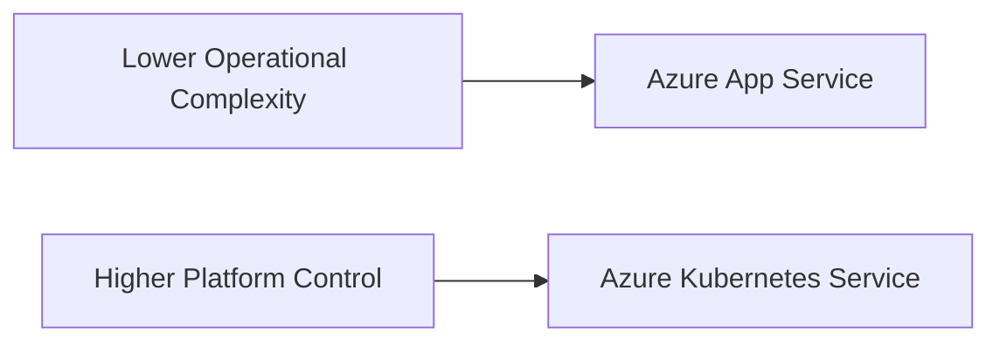

### App Service

You focus primarily on:

- Application code
- Configuration
- Deployment
- Application scaling
- Application monitoring

### AKS

You must also consider:

- Cluster design
- Node pools
- Pod scheduling
- Ingress
- Network policies
- Cluster upgrades
- Kubernetes security
- Container image lifecycle
- Pod disruption
- Resource requests and limits
- Cluster autoscaling
- Service-to-service communication

> Interview phrase:  
> **App Service optimizes for developer productivity. AKS optimizes for platform flexibility and control.**

---

## 10. Scaling Comparison

### App Service Scaling

App Service scales by increasing or decreasing application instances within an App Service plan.

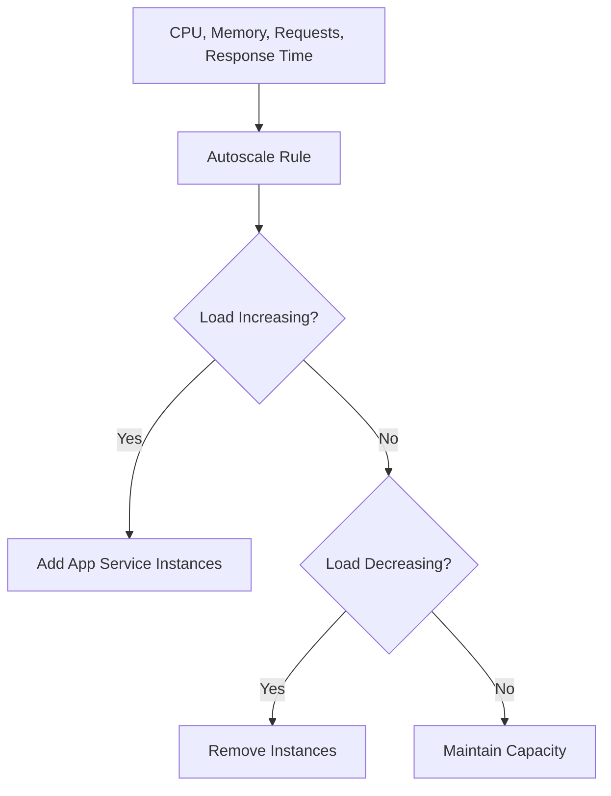

### AKS Scaling

AKS can scale at two levels:

1. **Pod scaling** using HPA, KEDA, or similar mechanisms
2. **Node scaling** using the cluster autoscaler

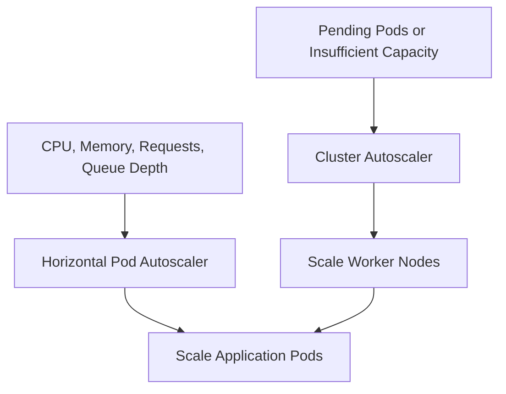

### Scaling Difference

| Scaling Question | App Service | AKS |
|---|---|---|
| Scale application instances? | Yes | Yes |
| Scale individual microservices independently? | Limited by app/plan design | Yes, per Deployment |
| Scale nodes? | Abstracted | Yes |
| Scale pods based on queue depth? | Not natively in the same Kubernetes model | Yes, using event-driven autoscaling tools |
| Scale to complex scheduling constraints? | Limited | Strong support |

---

## 11. Deployment Comparison

### App Service Deployment

App Service supports straightforward deployment methods such as:

- GitHub Actions
- Azure Pipelines
- ZIP deployment
- Package deployment
- Container deployment
- Deployment slots

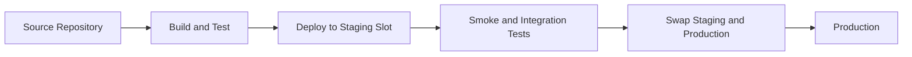

Deployment slots can support safer releases and traffic switching.

### AKS Deployment

AKS deployments commonly use:

- Kubernetes manifests
- Helm charts
- GitOps
- Azure DevOps
- GitHub Actions
- Argo CD
- Flux
- Canary deployments
- Blue-green deployments

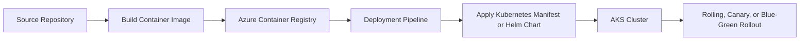

### Deployment Decision

Choose App Service when deployment slots and standard CI/CD are sufficient.

Choose AKS when you need Kubernetes-native rollout strategies or independent release control for many services.

---

## 12. Networking Comparison

### App Service Networking

App Service provides managed networking features such as:

- Virtual Network integration
- Private endpoints
- Access restrictions
- TLS support
- App Service Environment for stronger isolation
- Outbound integration with private Azure resources

### AKS Networking

AKS provides more extensive platform-level networking control:

- Virtual networks
- Pod networking
- Kubernetes Services
- Ingress controllers
- Network policies
- Egress control
- Private clusters
- Service mesh integration
- Custom routing and traffic policies

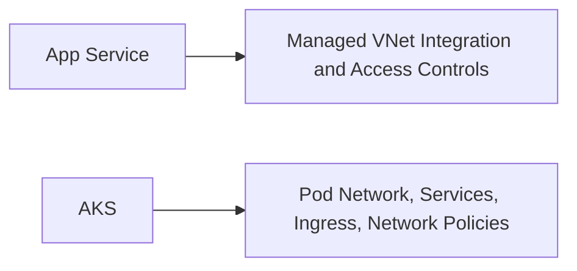

> Interview answer:  
> **App Service is easier to network securely for conventional applications. AKS provides deeper control but requires more network design and operations expertise.**

---

## 13. Service-to-Service Communication

### App Service

App Service does not provide Kubernetes-style built-in service discovery.

Microservices commonly communicate using:

- API Management
- Private DNS
- Service Bus
- Event Grid
- Event Hubs
- Explicit service URLs
- External discovery services

### AKS

AKS provides Kubernetes-native service discovery through:

- Kubernetes Services
- Internal DNS
- Ingress
- Service mesh
- Network policies

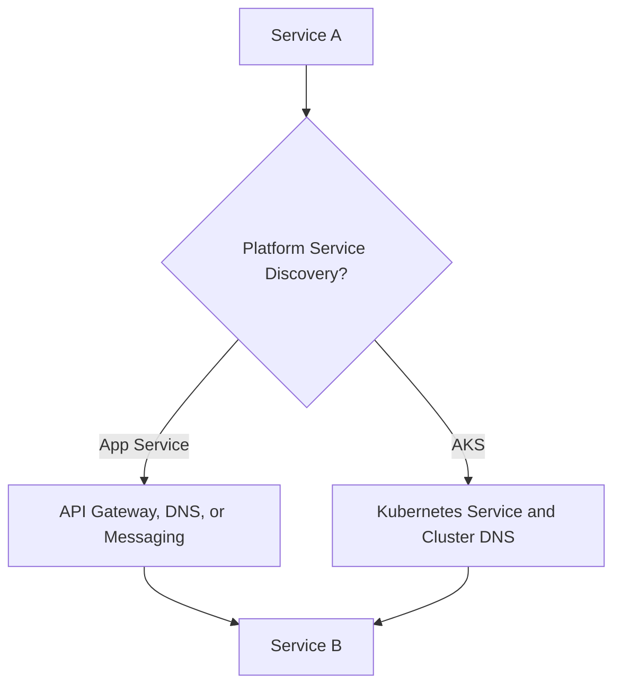

Microsoft's microservices guidance identifies Kubernetes DNS and service mesh capabilities in AKS, while App Service generally relies on external or application-level communication patterns. ([learn.microsoft.com](https://learn.microsoft.com/en-us/azure/architecture/microservices/design/compute-options?utm_source=openai))

---

## 14. Security Comparison

### App Service Security

Typical controls include:

- Microsoft Entra ID authentication
- Managed identity
- Key Vault integration
- TLS certificates
- Access restrictions
- Private endpoints
- VNet integration
- WAF through an edge service
- Application Insights and diagnostics

### AKS Security

Typical controls include:

- Microsoft Entra ID
- Kubernetes RBAC
- Azure RBAC
- Workload identity
- Network policies
- Private clusters
- Pod security controls
- Image scanning
- Admission policies
- Key Vault CSI integration
- WAF and ingress security
- Service mesh mTLS

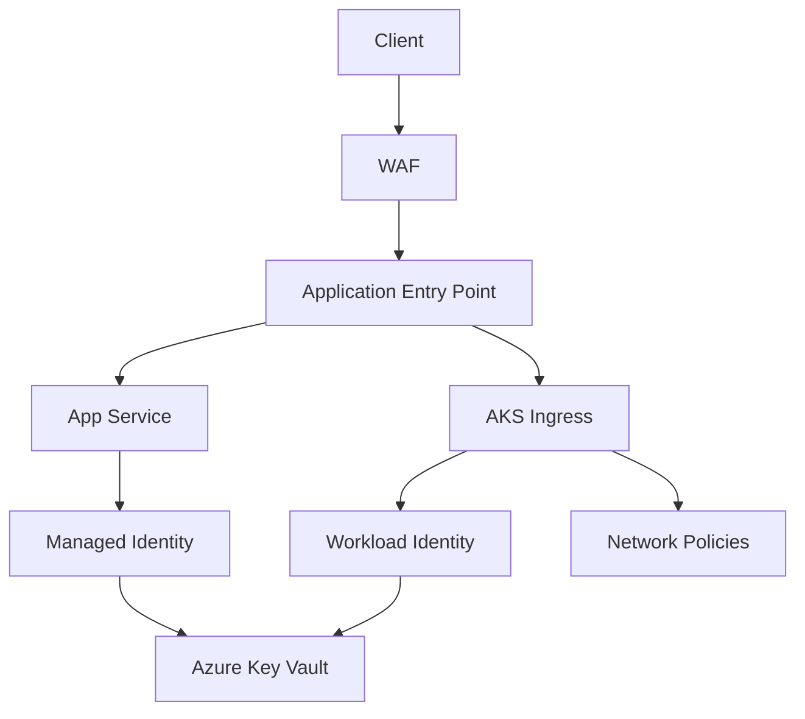

AKS provides more security control, but also more responsibility. App Service provides a simpler managed security boundary for conventional applications.

---

## 15. Availability and Resilience

### App Service High Availability

Use:

- Multiple App Service instances
- Autoscaling
- Deployment slots
- Zone redundancy where supported
- Front Door or Traffic Manager
- Application Insights
- Regional deployment strategies
- Externalized session state
- Resilient database and cache services

### AKS High Availability

Use:

- Multiple pod replicas
- Availability zones
- Pod anti-affinity
- Topology spread constraints
- Pod Disruption Budgets
- Multiple node pools
- Cluster autoscaler
- Readiness and liveness probes
- Multi-region AKS clusters when required

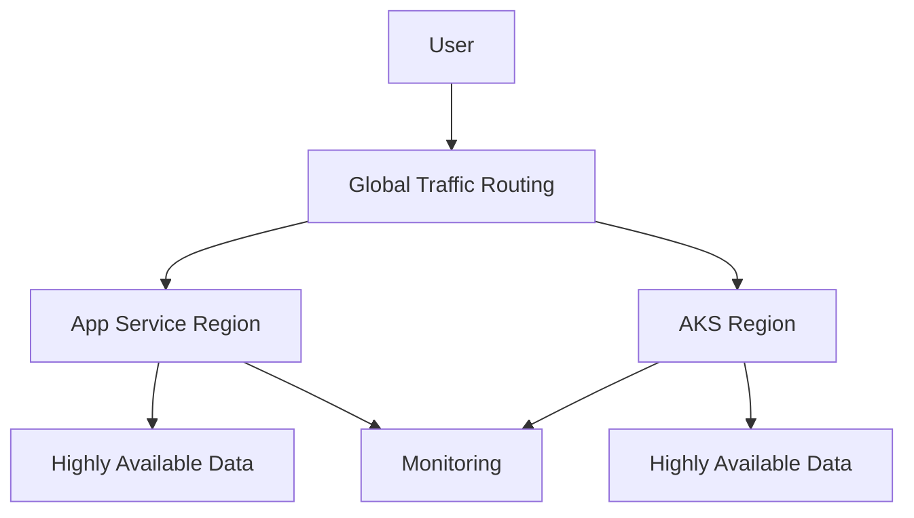

Neither App Service nor AKS automatically makes every dependency highly available. Database, cache, queue, storage, and external dependencies must also be designed for resilience.

---

## 16. Cost Comparison

### App Service Cost Characteristics

App Service cost is commonly influenced by:

- App Service plan tier
- Number of instances
- Operating system
- Region
- Deployment slots
- Networking and supporting services
- Database and cache usage

App Service can be cost-effective for steady web/API workloads because the operational model is simple and resources are managed through the App Service plan.

### AKS Cost Characteristics

AKS cost may include:

- Worker-node virtual machines
- Node pools
- Storage
- Load balancers
- Public IPs
- Networking
- Container registry
- Monitoring and logging
- Security tools
- Platform engineering effort

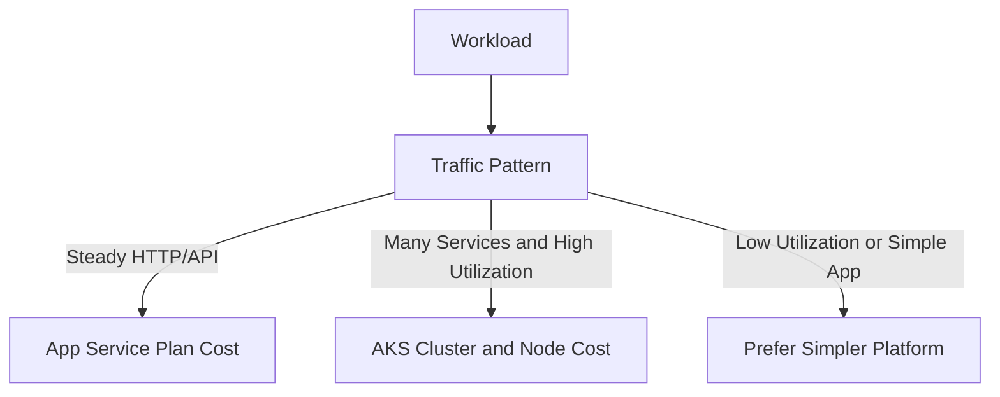

> Interview phrase:  
> **AKS may reduce infrastructure cost at high utilization, but the total cost includes cluster operations, platform engineering, monitoring, upgrades, and incident response.**

---

## 17. Operational Responsibility

| Responsibility | App Service | AKS |
|---|---|---|
| Application code | Customer | Customer |
| App configuration | Customer | Customer |
| Runtime configuration | Shared/managed | Customer has more control |
| OS platform | Mostly managed | Node lifecycle is a customer concern |
| Kubernetes control plane | Not applicable | Azure-managed |
| Worker nodes | Abstracted | Customer-managed or configured |
| Container orchestration | Managed by platform | Customer uses Kubernetes |
| Network policy | Simpler | Customer designs and operates it |
| Cluster upgrades | Not applicable | Must be planned and monitored |
| Pod scheduling | Not applicable | Customer configures and tunes it |
| Monitoring | Customer configures application telemetry | Customer monitors cluster and workloads |

---

## 18. AKS Automatic vs App Service

AKS also has different operational modes.

- **AKS Automatic** provides a more managed Kubernetes experience with production-oriented defaults.
- **AKS Standard** provides deeper control over platform configuration and lifecycle operations.

Even with AKS Automatic, the workload remains Kubernetes-based and the team must understand Kubernetes objects, deployment behavior, networking, and application operations.

Microsoft currently presents AKS Automatic as the recommended production-ready default for many AKS workloads, while AKS Standard is intended for deeper customization. ([learn.microsoft.com](https://learn.microsoft.com/en-us/azure/aks/get-started-aks?utm_source=openai))

---

## 19. Scenario-Based Decision Table

| Scenario | Recommended Choice | Reason |
|---|---|---|
| Simple .NET web application | App Service | Fast delivery and low operations |
| Standard REST API | App Service | Managed HTTP hosting is sufficient |
| Monolith modernization | App Service | Easy migration path |
| API with deployment slots | App Service | Built-in staging and slot swap |
| 30 independent microservices | AKS | Kubernetes orchestration and independent scaling |
| Need service mesh and mTLS | AKS | Platform-level service communication controls |
| Need GPU node pools | AKS | Specialized node-pool support |
| Need custom pod scheduling | AKS | Kubernetes scheduling capabilities |
| Need custom network policies | AKS | Fine-grained pod/network control |
| Team has no Kubernetes experience | App Service | Lower operational risk |
| Need portable Kubernetes platform | AKS | Kubernetes ecosystem and portability |
| Single containerized API | App Service may be sufficient | Avoid unnecessary cluster complexity |
| Event-driven short tasks | Consider Functions | Neither App Service nor AKS may be ideal |
| Simple container microservices | Consider Container Apps | Managed microservice platform may fit better |

---

## 20. Example 1: Choose App Service

### Requirements

- Customer portal
- ASP.NET Core application
- Azure SQL database
- Redis cache
- 500 requests per second
- Deployment slots
- Microsoft Entra ID authentication
- Small platform team

### Decision

Choose **Azure App Service**.

### Reasoning

- The workload is HTTP-based
- No Kubernetes-specific features are required
- Deployment slots support safe releases
- Autoscaling can handle demand
- The team avoids unnecessary cluster operations
- Azure integrations are available without Kubernetes complexity

---

## 21. Example 2: Choose AKS

### Requirements

- 40 microservices
- Independent scaling per service
- Internal service discovery
- Service mesh
- mTLS between services
- GPU workloads
- Custom node pools
- Advanced network policies
- Platform team with Kubernetes expertise

### Decision

Choose **AKS**.

### Reasoning

- Kubernetes is a direct platform requirement
- Services need independent deployment and scaling
- Service mesh and internal DNS are useful
- Specialized node pools are required
- Network policy and scheduling control are important
- The team has the operational maturity to manage AKS

---

## 22. Example 3: Hybrid Architecture

Many organizations should use both services rather than choosing only one.

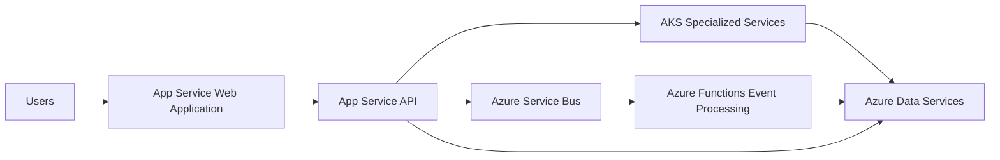

### Example Hybrid Design

- App Service for the customer-facing web application
- App Service for standard HTTP APIs
- Functions for event-driven background processing
- AKS for specialized, complex microservices
- Service Bus for asynchronous communication
- Azure SQL, Cosmos DB, Redis, and Blob Storage for data services

> Interview point:  
> **Choose the best compute model per workload instead of forcing the entire organization onto one platform.**

---

## 23. Common Interview Mistakes

1. Saying AKS is always better because it is more powerful
2. Saying App Service cannot run containers
3. Ignoring App Service deployment slots
4. Ignoring AKS node pools and cluster operations
5. Treating AKS as fully serverless
6. Comparing only infrastructure price
7. Ignoring team Kubernetes expertise
8. Choosing AKS for a simple web API
9. Assuming App Service provides Kubernetes service discovery
10. Forgetting database, cache, and messaging availability
11. Ignoring network and security responsibilities
12. Not considering Container Apps or Functions for other workload shapes

---

## 24. Strong Interview Answers

### Q1: What is the main difference between AKS and App Service?

**Answer:** App Service is a managed PaaS for hosting web applications and APIs with low operational overhead. AKS is a managed Kubernetes platform that provides deeper control for orchestrating containerized workloads.

### Q2: When would you choose App Service over AKS?

**Answer:** I would choose App Service for a standard web application or REST API when Kubernetes-specific capabilities are not required. It provides faster delivery, simpler operations, autoscaling, and deployment slots.

### Q3: When would you choose AKS over App Service?

**Answer:** I would choose AKS when I need Kubernetes features such as service discovery, service mesh, custom scheduling, specialized node pools, network policies, or independent management of many containerized microservices.

### Q4: Which is more scalable?

**Answer:** Both can scale, but they scale differently. App Service scales application instances through the App Service plan. AKS scales pods and worker nodes independently, providing more granular control. The better option depends on workload requirements and operational maturity.

### Q5: Which is cheaper?

**Answer:** There is no universal answer. App Service is often more economical for simple or steady web/API workloads because it has lower operational overhead. AKS can be efficient for large, highly utilized platforms, but the total cost includes nodes, monitoring, networking, upgrades, and platform engineering.

### Q6: Does App Service support containers?

**Answer:** Yes. App Service supports custom container deployment, but it does not provide the full Kubernetes orchestration model.

### Q7: Does AKS remove all infrastructure management?

**Answer:** No. Azure manages the Kubernetes control plane, but teams still manage or configure worker nodes, workloads, networking, security policies, deployments, monitoring, and upgrades depending on the AKS mode.

### Q8: Can App Service support microservices?

**Answer:** Yes, especially for straightforward HTTP-based services. However, it does not provide Kubernetes-native service discovery or orchestration, so communication often uses API gateways, messaging, DNS, or application-level configuration.

### Q9: What would you use for a small team?

**Answer:** I would normally start with App Service unless there is a clear Kubernetes requirement. Reducing platform complexity allows the team to focus on delivering business functionality.

### Q10: Is AKS the default choice for all microservices?

**Answer:** No. The number of services alone is not sufficient justification. I would evaluate service discovery, scaling independence, networking, platform control, team expertise, compliance, and total cost before selecting AKS.

---

## 25. 60-Second Interview Pitch

> I compare AKS and App Service based on workload complexity, control requirements, and team maturity. App Service is my default choice for standard web applications and REST APIs because it is a fully managed PaaS with simple deployment, autoscaling, and deployment slots. I choose AKS when Kubernetes is a real platform requirement—for example, when I need many independently deployable microservices, Kubernetes service discovery, custom scheduling, specialized node pools, network policies, or a service mesh. AKS provides more flexibility but also introduces more operational responsibility around nodes, networking, security, upgrades, and monitoring. In many real systems, I use a hybrid approach and select the simplest platform that satisfies each workload's requirements.

---

## 26. Final Decision Checklist

Choose **App Service** when:

- [ ] The workload is a standard web app or REST API
- [ ] Low operational overhead is important
- [ ] Deployment slots are sufficient
- [ ] Kubernetes features are not required
- [ ] The team prefers a managed PaaS
- [ ] Simple autoscaling meets requirements
- [ ] The application is primarily HTTP-based

Choose **AKS** when:

- [ ] Kubernetes orchestration is required
- [ ] Many services need independent scaling
- [ ] Kubernetes service discovery is needed
- [ ] A service mesh is required
- [ ] Custom node pools are required
- [ ] Advanced scheduling is needed
- [ ] Network policies must be enforced at pod level
- [ ] The team has Kubernetes operational expertise
- [ ] Platform portability is important

---

## One-Line Conclusion

> Choose **Azure App Service** for simple, managed web/API hosting and choose **AKS** when advanced Kubernetes orchestration, networking, scheduling, and microservice platform control justify the additional operational complexity.

---

## Official Microsoft Learn Sources

- Azure App Service overview:  
  https://learn.microsoft.com/en-us/azure/app-service/overview

- Azure App Service documentation:  
  https://learn.microsoft.com/en-us/azure/app-service/

- AKS core concepts:  
  https://learn.microsoft.com/en-us/azure/aks/core-aks-concepts

- AKS getting started and cluster modes:  
  https://learn.microsoft.com/en-us/azure/aks/get-started-aks

- Azure compute options for microservices:  
  https://learn.microsoft.com/en-us/azure/architecture/microservices/design/compute-options

- AKS planning and operations:  
  https://learn.microsoft.com/en-us/azure/architecture/reference-architectures/containers/aks-start-here