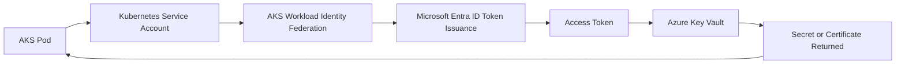
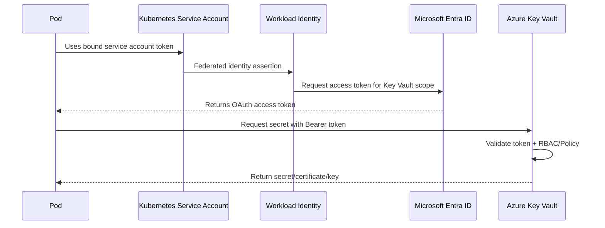
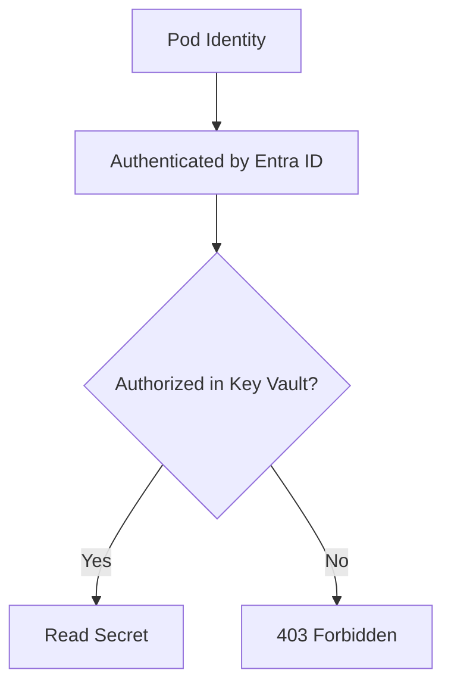
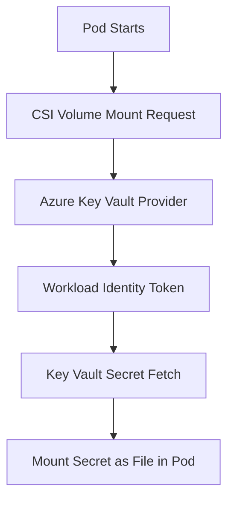
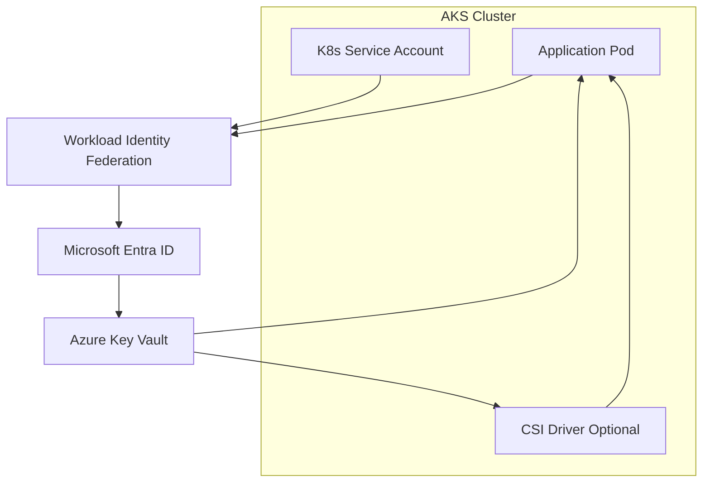
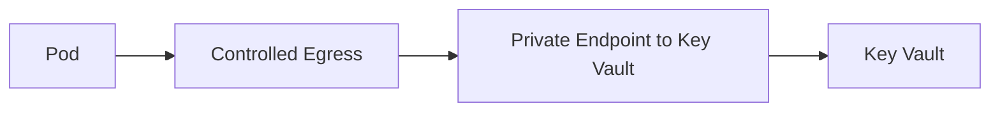
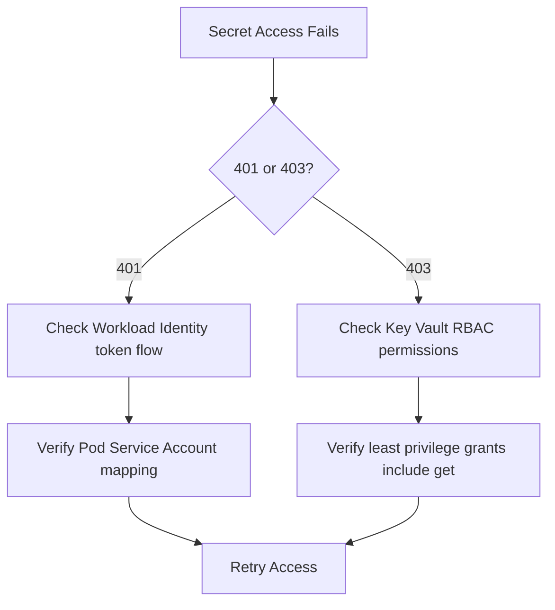

# How Do Pods Access Azure Key Vault?
## Detailed AKS Interview Preparation Guide with Flow Charts

---

## 1) Direct Interview Answer

Pods in AKS should access Azure Key Vault using **identity-based access**, not hardcoded secrets.

Most common production pattern:

1. Pod gets Azure identity (prefer **Workload Identity**)
2. Pod requests token from Azure AD (Microsoft Entra ID)
3. Pod accesses Key Vault using that token
4. Key Vault authorizes via RBAC/access policy
5. Pod reads secret/certificate/key securely

You can integrate this via:

- Application SDK direct calls to Key Vault
- Secrets Store CSI Driver (mounting secrets into pod volume)
- (Optional) Kubernetes Secret sync pattern when needed

> One-liner: *Use Workload Identity + Key Vault RBAC + least privilege, then fetch secrets at runtime (SDK or CSI mount).*

---

## 2) Why This Matters (Interview Framing)

Without Key Vault integration, teams often:

- Store secrets in source code
- Store secrets in plain Kubernetes manifests
- Rotate credentials manually
- Re-deploy apps for every secret change
- Increase breach risk

Using Key Vault reduces secret sprawl and improves security posture.

---

## 3) Core Access Patterns

## Pattern A: SDK-Based Runtime Retrieval (Preferred for dynamic apps)
App code fetches secrets directly from Key Vault at runtime.

## Pattern B: CSI Driver Mount
Secrets are mounted as files in the pod filesystem through Secrets Store CSI Driver.

## Pattern C: CSI + Sync to Kubernetes Secret (Use carefully)
Secrets mounted and optionally synced into Kubernetes Secret for compatibility with legacy apps.

---

## 4) End-to-End Architecture (Workload Identity + Key Vault)

---

## 5) Authentication Flow (Detailed)

---

## 6) Identity Options (What to Say in Interviews)

## 6.1 Workload Identity (Recommended)
- Modern AKS approach
- Federates Kubernetes service account with Entra application/managed identity
- No secret injection of credentials
- Fine-grained per-service identity mapping

## 6.2 Older Pod Identity Approaches
- Legacy approaches existed
- For interviews, emphasize current best practice: **Workload Identity**

---

## 7) Authorization Model in Key Vault

Authentication proves identity.  
Authorization controls what it can do.

Grant only minimum required permissions, e.g.:

- `get` secret
- not `set/delete/purge` unless truly needed

---

## 8) Pattern A: App Reads Secret via SDK

App startup/runtime flow:

1. Obtain token via default credential chain (workload identity-aware)
2. Call Key Vault secret endpoint
3. Cache in-memory if needed
4. Refresh periodically/when expired

Advantages:
- Dynamic retrieval
- Better for frequent rotation use cases
- Full programmatic control

Trade-off:
- App must include Key Vault client logic

---

## 9) Pattern B: CSI Driver Mount Flow

With Secrets Store CSI Driver:
- Pod requests secret volume
- CSI provider fetches from Key Vault using pod identity
- Secret appears as mounted file

Advantages:
- No app code changes for secret fetch
- Works well for file-based secret consumption

Trade-off:
- Secret is file-mounted (app must read file path)
- Operational understanding of CSI lifecycle needed

---

## 10) Pattern C: Sync to Kubernetes Secret (Compatibility Mode)

Some apps require env vars/Kubernetes Secret references.

Flow:
1. Fetch secret from Key Vault via CSI
2. Sync into Kubernetes Secret (optional feature)
3. Pod consumes as env var/secret ref

Use cautiously because:
- Duplicates secret presence inside cluster
- Increases secret surface area

---

## 11) Recommended Production Architecture

---

## 12) Step-by-Step Implementation (Interview-Ready)

1. Enable Workload Identity on AKS
2. Create/identify Entra application or managed identity
3. Create federated credential mapping for service account issuer/subject
4. Create Kubernetes service account and annotate/bind identity
5. Grant Key Vault RBAC permissions to that identity
6. Deploy pod using that service account
7. Access Key Vault via SDK or CSI
8. Validate and monitor access logs

---

## 13) Security Best Practices

- Use least privilege RBAC (read-only where possible)
- Separate identities per microservice
- Avoid sharing one broad identity across many apps
- Rotate secrets regularly
- Avoid writing secrets to logs
- Restrict network path to Key Vault (private access when required)
- Enable Key Vault audit logging
- Alert on unusual secret access patterns

---

## 14) Network Security Considerations

Protect traffic path:
- Use TLS always
- Prefer private endpoints/private DNS for Key Vault in locked-down environments
- Restrict AKS egress routes
- Control outbound internet access in regulated environments

---

## 15) Secret Rotation Strategy

Design for rotation without downtime:

- App re-reads secret periodically or on failure
- CSI mounted content refresh strategy where applicable
- Avoid long-lived in-memory caching without refresh
- Test rotation runbooks

---

## 16) Observability and Audit

Monitor:
- Secret access success/failure rates
- 401/403 errors from Key Vault
- Token acquisition failures
- Latency of secret retrieval
- Unusual access patterns (time/IP/workload anomalies)

Use:
- Key Vault diagnostic logs
- AKS workload logs
- Security analytics/SIEM integrations

---

## 17) Failure Modes and Troubleshooting

Common issues:

1. **401 Unauthorized**
   - Token acquisition failed
   - Wrong audience/scope

2. **403 Forbidden**
   - Identity lacks Key Vault permissions

3. **DNS/Network timeout**
   - Egress/firewall/private endpoint misconfiguration

4. **Wrong secret name/version**
   - Config mismatch

5. **Service account mismatch**
   - Pod not using intended service account

Troubleshooting flow:

---

## 18) Anti-Patterns to Avoid

- Embedding secrets in container images
- Storing production secrets in Git
- Using one identity for every microservice
- Over-privileged Key Vault roles
- Exporting secrets to broad environment variables unnecessarily
- Ignoring Key Vault audit logs
- No rotation policy

---

## 19) Interview Q&A (Strong Answers)

### Q1: What is the recommended way for AKS pods to access Key Vault?
**Answer:** Use AKS Workload Identity with Entra-issued tokens and Key Vault RBAC; fetch secrets via SDK or CSI driver.

### Q2: SDK vs CSI—when would you choose each?
**Answer:** SDK for dynamic/runtime control and custom refresh logic; CSI for file-mount consumption without major code changes.

### Q3: Why avoid hardcoded secrets in Kubernetes manifests?
**Answer:** They increase exposure risk, complicate rotation, and can leak through source control/history.

### Q4: What causes 403 when accessing Key Vault?
**Answer:** Identity is valid but lacks required Key Vault permissions.

### Q5: How do you support secret rotation with minimal downtime?
**Answer:** Use runtime refresh patterns (SDK/CSI refresh), short cache lifetimes, and tested rotation runbooks.

### Q6: How do you secure Key Vault traffic?
**Answer:** TLS, private endpoints, restricted egress, least privilege IAM, and continuous logging/auditing.

---

## 20) 60-Second Interview Pitch

> I secure pod access to Azure Key Vault using AKS Workload Identity, which maps a Kubernetes service account to an Entra identity without storing credentials in the cluster. The pod obtains a short-lived token and uses it to access Key Vault, where RBAC enforces least-privilege permissions such as secret get. Depending on application design, secrets are fetched directly through SDK calls or mounted via Secrets Store CSI Driver. I avoid hardcoded secrets and broad shared identities, enable Key Vault audit logs, restrict network paths with private endpoints where needed, and design secret rotation with runtime refresh so updates can happen without downtime.

---

## 21) Final Checklist

- [ ] Workload Identity enabled on AKS
- [ ] Service account mapped to Entra identity
- [ ] Key Vault RBAC configured least privilege
- [ ] Pod uses correct service account
- [ ] Secret retrieval method chosen (SDK or CSI)
- [ ] Network path secured (TLS/private access where needed)
- [ ] Logs and alerts configured
- [ ] Rotation tested end-to-end

---

## One-Line Conclusion

> Pods should access Key Vault through Workload Identity-based token auth and least-privilege RBAC, using SDK or CSI integration for secure runtime secret retrieval.