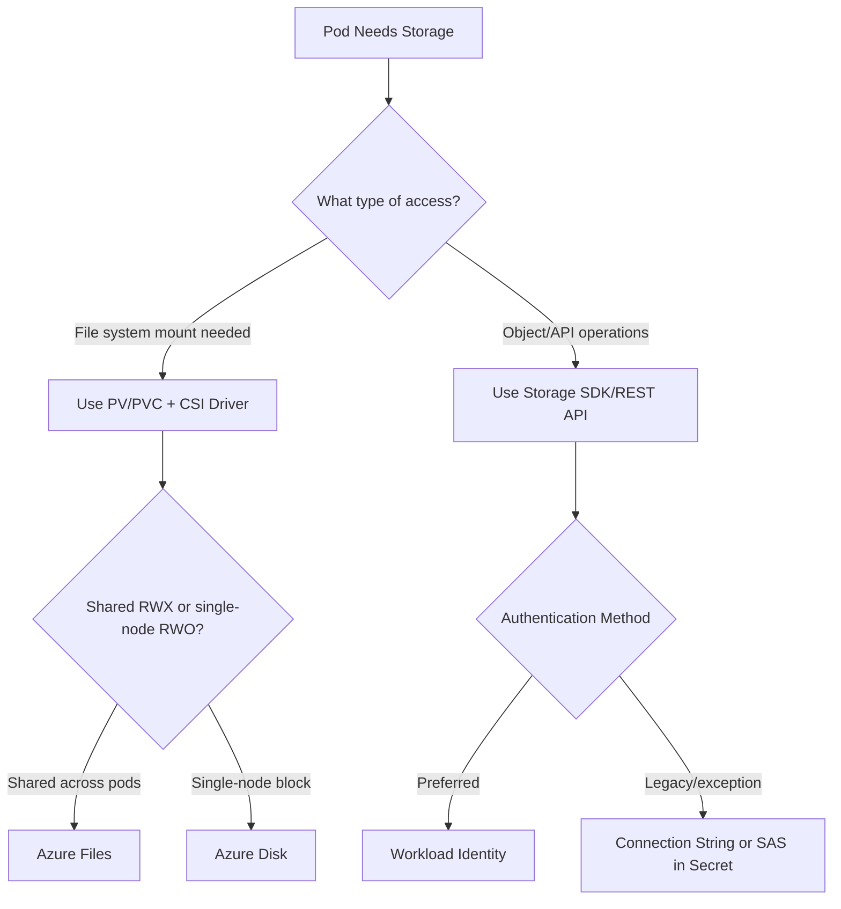
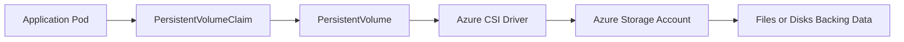
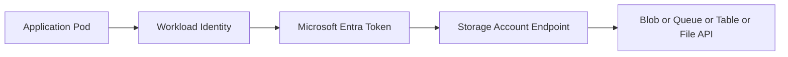
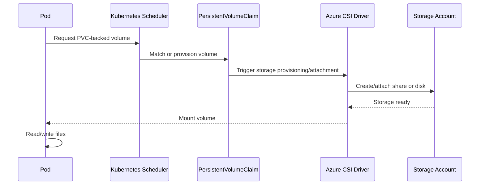
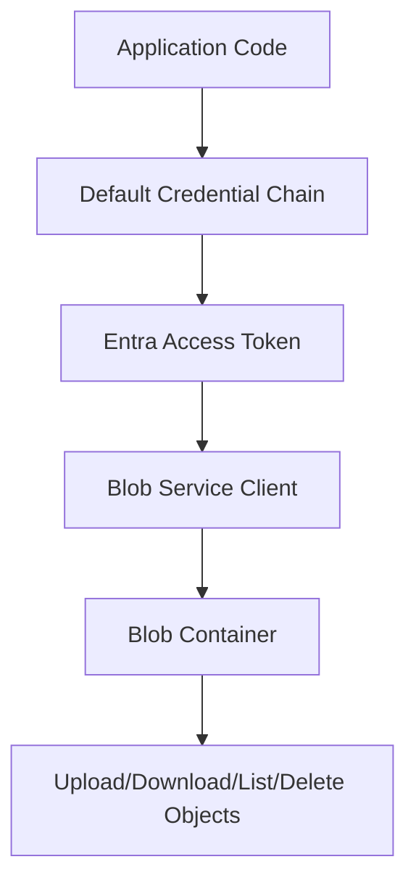
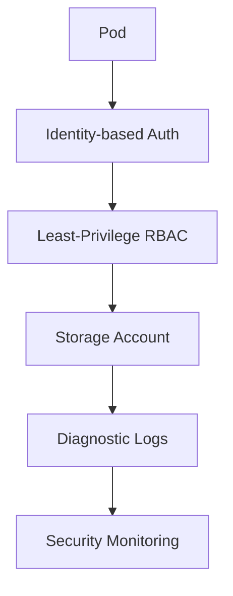
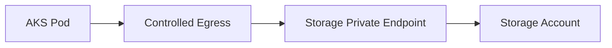
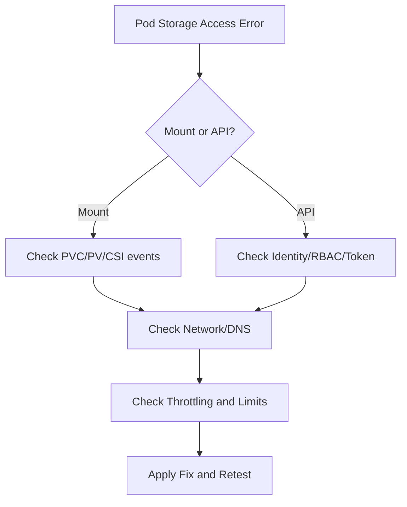

# How Do Pods Access Azure Storage Accounts?
## Detailed AKS Interview Preparation Guide with Flow Charts

---

## 1) Direct Interview Answer

Pods in AKS access Azure Storage Accounts using two main models:

1. **Kubernetes volume mount model** (persistent storage for files)
   - Use PersistentVolume (PV) / PersistentVolumeClaim (PVC)
   - Backed by Azure Files or Azure Disks (and in some cases Blob via supported drivers/patterns)

2. **Application SDK/API model** (object operations)
   - App code connects to Blob/Queue/Table/File endpoints
   - Authenticate using **Workload Identity** (preferred) or controlled secrets

> One-liner: *Use PVC/CSI for mounted filesystem needs, and SDK + Workload Identity for direct Blob/Queue/Table access.*

---

## 2) Storage Access Decision Flow

---

## 3) Common Storage Patterns in AKS

## Pattern A: Azure Files via PVC (shared file access)
- Multiple pods can mount same share (RWX scenarios)
- Good for shared content/config/artifacts

## Pattern B: Azure Disk via PVC (block storage)
- Typically mounted by one node/pod at a time (RWO)
- Good for stateful workloads needing low-latency disk semantics

## Pattern C: Blob Storage via SDK
- Best for object storage (images, backups, documents, logs, data lake patterns)
- Access through API, not traditional POSIX filesystem semantics (unless specialized drivers/patterns used)

---

## 4) End-to-End Architecture (Volume Mount Model)

---

## 5) End-to-End Architecture (SDK/API Model)

---

## 6) Authentication Models (Interview Critical)

## Preferred: Workload Identity + RBAC
- Pod uses federated identity
- Gets OAuth token
- Calls Storage securely without account keys in code

## Alternative: SAS Token
- Scoped/time-bound delegated access
- Better than raw account key when app constraints exist

## Legacy/Fallback: Account Key/Connection String
- Store only in secret manager if unavoidable
- Higher risk and operational overhead

> Interview phrase: **Prefer identity-based access over shared keys.**

---

## 7) PVC-Based Access Flow (Detailed)

---

## 8) Sample: Azure Files PVC Concept

Use when many pods need shared files.

- Access mode often RWX
- Backed by Azure File share
- Mounted path exposed inside container

Conceptual YAML pieces:
- StorageClass
- PersistentVolumeClaim
- Pod volumeMount

---

## 9) Sample: Azure Disk PVC Concept

Use for stateful workloads requiring block storage.

- Access mode often RWO
- Usually one pod attachment per disk
- Common with StatefulSets

Good for:
- Databases (with proper architecture)
- Stateful services needing durable block device

---

## 10) SDK-Based Access for Blob (Conceptual Flow)

Advantages:
- Fine-grained API operations
- Better for object workflows
- Strong IAM model with RBAC

---

## 11) When to Use Which

| Requirement | Best Approach |
|---|---|
| Shared file mount across pods | Azure Files + PVC |
| Single-writer durable disk | Azure Disk + PVC |
| Object storage operations (images/docs/backups) | Blob SDK/API |
| Event-driven message persistence | Queue/Table APIs (SDK) |
| Legacy app expecting filesystem path | File share mount |

---

## 12) Security Best Practices

- Prefer Workload Identity and RBAC
- Avoid embedding storage keys in images/manifests
- Use least privilege roles (container-level where possible)
- Rotate SAS/keys if used
- Restrict network access (private endpoints/firewalls)
- Enable encryption at rest and in transit
- Log and monitor access patterns

---

## 13) Network Security for Storage Access

For production:
- Private endpoint for storage account
- Private DNS resolution
- Restricted public network access
- Egress controls from AKS subnet
- NSG/firewall policy alignment

---

## 14) Performance and Scalability Considerations

- Choose correct storage tier/performance class
- Understand IOPS/throughput limits
- Avoid hot partitions (Blob/Table patterns)
- Use parallelism and retry tuning in SDK clients
- Cache when appropriate
- Separate hot and cold data strategies

For mounted volumes:
- Validate latency expectations
- Benchmark under realistic concurrency

---

## 15) Reliability Design

- Use zone-redundant/geo-redundant options where needed
- Plan backup/snapshot strategy
- Design for transient retry handling
- Test failover and restore procedures
- Avoid single shared dependency bottlenecks

---

## 16) Common Failure Modes and Troubleshooting

1. **Mount failures**
   - CSI driver not installed/misconfigured
   - PVC/PV mismatch
   - permissions/network issues

2. **Auth failures (403/401)**
   - missing RBAC role assignment
   - wrong identity binding
   - token scope mismatch

3. **DNS/connectivity issues**
   - private endpoint DNS not resolved
   - blocked egress/firewall

4. **Performance bottlenecks**
   - throttling due to account limits
   - unsuitable storage tier

Troubleshooting flow:

---

## 17) Interview Q&A (Strong Answers)

### Q1: How do pods mount persistent storage in AKS?
**Answer:** Through PVCs bound to PVs provisioned by Azure CSI drivers (e.g., Azure Files or Azure Disk).

### Q2: How should pods authenticate to Blob storage APIs?
**Answer:** Prefer Workload Identity with Entra tokens and RBAC instead of account keys.

### Q3: Azure Files vs Azure Disk—when to choose?
**Answer:** Azure Files for shared RWX access across pods; Azure Disk for single-writer low-latency block storage.

### Q4: Is Blob storage usually mounted like a regular disk?
**Answer:** Typically Blob is consumed via SDK/API object semantics; filesystem-style patterns require specific drivers and trade-offs.

### Q5: How do you secure storage account access from AKS?
**Answer:** Workload Identity, least-privilege RBAC, private endpoints, restricted public access, and monitoring logs.

### Q6: What causes storage mount failures most often?
**Answer:** CSI misconfiguration, PVC/PV issues, identity/permission gaps, or network/DNS restrictions.

---

## 18) 60-Second Interview Pitch

> In AKS, pods access Storage Accounts either as mounted persistent volumes or through storage APIs. For mounted filesystems, I use PVC/PV with Azure CSI drivers—typically Azure Files for shared RWX scenarios and Azure Disk for single-writer block storage. For object workloads like documents, backups, or media, I use Blob SDK access from the application. Authentication should be identity-based using Workload Identity and Entra tokens, with least-privilege RBAC on the storage account. I avoid hardcoded keys, secure network paths via private endpoints, and monitor storage access, latency, and throttling to maintain reliability and security.

---

## 19) Final Checklist

- [ ] Chosen correct storage pattern (mount vs SDK)
- [ ] Workload Identity configured (preferred)
- [ ] Least-privilege RBAC assigned
- [ ] PVC/PV/StorageClass validated (if mount path)
- [ ] Network path secured (private endpoint/DNS/egress)
- [ ] Encryption + logging enabled
- [ ] Performance limits tested
- [ ] Backup/restore/failover tested

---

## One-Line Conclusion

> Pods access Azure Storage Accounts through CSI-mounted persistent volumes or SDK/API calls, with Workload Identity + RBAC as the recommended secure authentication model.