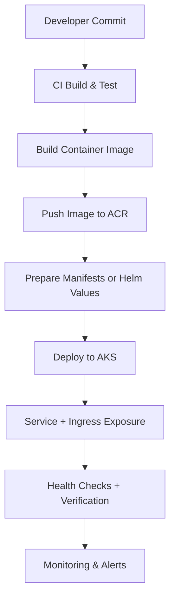
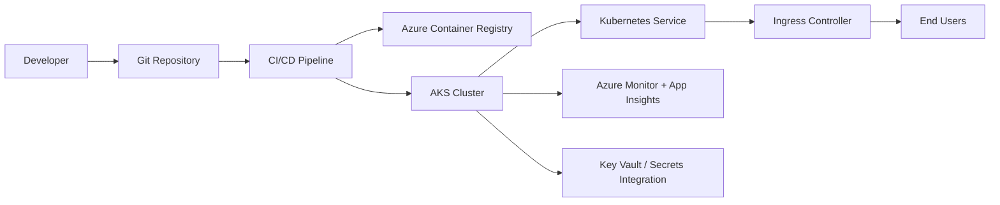
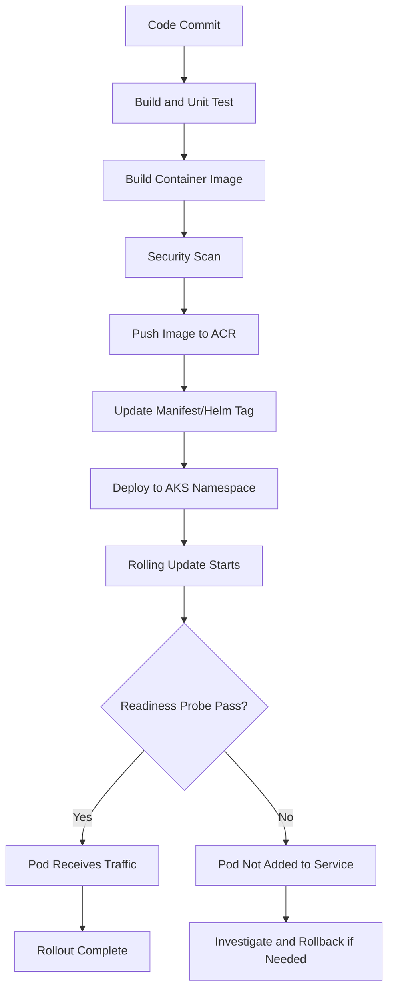
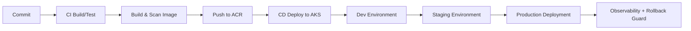
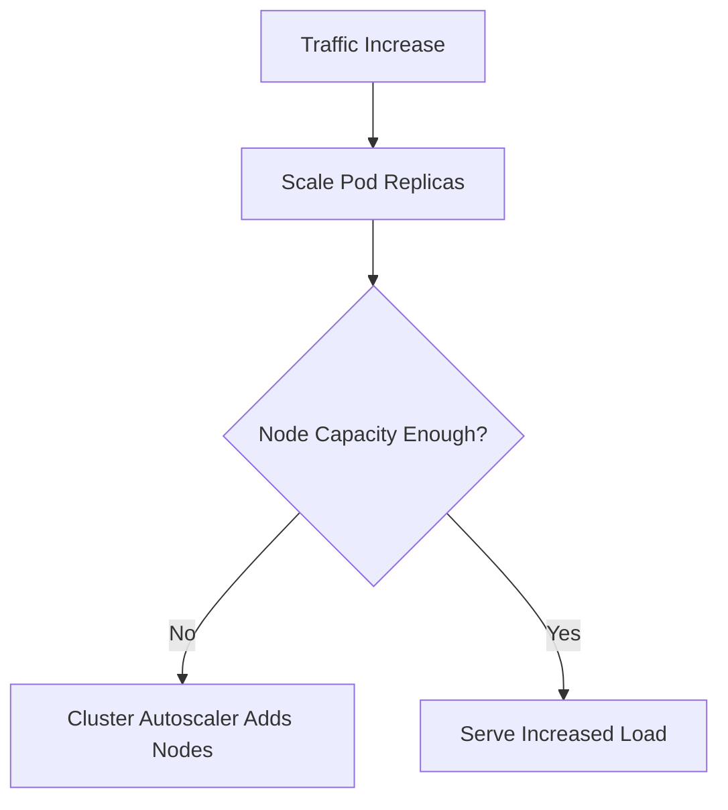

# How Do You Deploy Applications to AKS?
## Detailed Interview Preparation Guide with Flow Charts

---

## 1) Direct Interview Answer

To deploy applications to AKS, follow a structured flow:

1. Containerize the application
2. Push image to a registry (usually Azure Container Registry)
3. Define Kubernetes manifests or Helm charts
4. Configure namespace, secrets, config, and identity
5. Deploy to AKS using `kubectl` or Helm
6. Expose via Service and Ingress
7. Validate health, scaling, and observability
8. Automate with CI/CD for repeatable releases

> One-liner: *Build image -> push to ACR -> deploy manifests/Helm to AKS -> expose and validate -> automate with CI/CD.*

---

## 2) High-Level Deployment Flow



---

## 3) End-to-End Architecture (Typical)



---

## 4) Prerequisites

Before deploying to AKS, ensure:

- Azure subscription and permissions
- AKS cluster available
- Container registry available (ACR)
- `az` CLI and `kubectl` installed
- Cluster credentials configured
- Namespace strategy decided
- Ingress strategy selected
- Secrets/config management approach finalized

---

## 5) Step-by-Step Deployment Process

## Step 1: Containerize the Application

Create a Dockerfile and package the app as an image.

Example:

```dockerfile
FROM node:20-alpine
WORKDIR /app
COPY package*.json ./
RUN npm ci --only=production
COPY . .
EXPOSE 3000
CMD ["npm","start"]
```

Build locally (conceptually):

```bash
docker build -t myapp:1.0.0 .
```

---

## Step 2: Push Image to Azure Container Registry (ACR)

Tag and push image:

```bash
docker tag myapp:1.0.0 <acr-name>.azurecr.io/myapp:1.0.0
docker push <acr-name>.azurecr.io/myapp:1.0.0
```

In production pipelines, image build/push is handled by CI.

---

## Step 3: Connect AKS to ACR

Grant AKS pull access to ACR (done once per cluster/registry relationship).

Conceptually:
- Attach ACR to AKS
- Or configure imagePullSecrets/service principal/workload identity approach

Goal:
- AKS nodes can pull private images securely

---

## Step 4: Define Kubernetes Deployment

Create `deployment.yaml`:

```yaml
apiVersion: apps/v1
kind: Deployment
metadata:
  name: myapp
  namespace: production
spec:
  replicas: 3
  selector:
    matchLabels:
      app: myapp
  strategy:
    type: RollingUpdate
    rollingUpdate:
      maxUnavailable: 0
      maxSurge: 1
  template:
    metadata:
      labels:
        app: myapp
    spec:
      containers:
        - name: myapp
          image: <acr-name>.azurecr.io/myapp:1.0.0
          ports:
            - containerPort: 3000
          readinessProbe:
            httpGet:
              path: /health
              port: 3000
            initialDelaySeconds: 10
            periodSeconds: 10
          livenessProbe:
            httpGet:
              path: /health
              port: 3000
            initialDelaySeconds: 20
            periodSeconds: 20
          resources:
            requests:
              cpu: "250m"
              memory: "256Mi"
            limits:
              cpu: "500m"
              memory: "512Mi"
```

---

## Step 5: Define Service for Internal Stable Access

Create `service.yaml`:

```yaml
apiVersion: v1
kind: Service
metadata:
  name: myapp-service
  namespace: production
spec:
  selector:
    app: myapp
  ports:
    - port: 80
      targetPort: 3000
  type: ClusterIP
```

---

## Step 6: Define Ingress for External Access

Create `ingress.yaml`:

```yaml
apiVersion: networking.k8s.io/v1
kind: Ingress
metadata:
  name: myapp-ingress
  namespace: production
spec:
  ingressClassName: nginx
  rules:
    - host: myapp.example.com
      http:
        paths:
          - path: /
            pathType: Prefix
            backend:
              service:
                name: myapp-service
                port:
                  number: 80
```

Add TLS section in production.

---

## Step 7: Apply Manifests

```bash
kubectl apply -f deployment.yaml
kubectl apply -f service.yaml
kubectl apply -f ingress.yaml
```

Or apply a folder:

```bash
kubectl apply -f k8s/
```

---

## Step 8: Validate Rollout

```bash
kubectl get pods -n production
kubectl get svc -n production
kubectl get ingress -n production
kubectl rollout status deployment/myapp -n production
```

Troubleshooting:

```bash
kubectl describe pod <pod-name> -n production
kubectl logs <pod-name> -n production
kubectl get events -n production --sort-by=.lastTimestamp
```

---

## 6) Deployment Flow Chart (Detailed)



---

## 7) Kubernetes Objects Commonly Used in AKS Deployments

- Namespace
- Deployment
- Service
- Ingress
- ConfigMap
- Secret
- ServiceAccount
- HorizontalPodAutoscaler
- PodDisruptionBudget
- NetworkPolicy

---

## 8) Deploying with Helm (Common in Real Teams)

Instead of raw YAML, many teams use Helm.

Install/upgrade pattern:

```bash
helm upgrade --install myapp ./chart \
  --namespace production \
  --create-namespace \
  -f values-production.yaml
```

Benefits:
- Reusable templates
- Environment-specific values
- Versioned releases
- Easier rollback handling

---

## 9) CI/CD to AKS (Production Pattern)

Typical pipeline stages:

1. Lint + unit tests
2. Build image
3. Scan image
4. Push to ACR
5. Render manifests/Helm
6. Deploy to dev
7. Integration tests
8. Promote to staging
9. Canary/blue-green or rolling production deploy
10. Monitor SLOs
11. Auto-rollback on failure thresholds



---

## 10) Zero-Downtime Deployment in AKS

Use:
- Multiple replicas
- Readiness probes
- Rolling update strategy
- Pod disruption budgets
- Graceful shutdown
- Backward-compatible DB changes
- Optional canary strategy via ingress/service mesh

---

## 11) Configuration and Secret Management

Use:
- ConfigMaps for non-sensitive config
- Secrets for sensitive data
- Prefer external secret stores (e.g., Key Vault integration)
- Avoid plain-text secrets in Git
- Use managed identity/workload identity patterns where applicable

---

## 12) Scaling After Deployment

Configure:

- Horizontal Pod Autoscaler (pod-level scaling)
- Cluster autoscaler (node-level scaling)
- Resource requests/limits properly



---

## 13) Security Controls During Deployment

- Signed/trusted image sources
- Vulnerability scanning gates
- Least-privilege RBAC
- Namespace isolation
- Network policies
- Pod security settings
- TLS for ingress endpoints
- Secret rotation strategy

---

## 14) Observability Post-Deployment

Monitor:

- Pod restarts
- CPU/memory saturation
- Request latency (p95/p99)
- Error rates (4xx/5xx)
- Readiness/liveness failures
- Ingress metrics
- Dependency health (DB/cache/queue)

---

## 15) Common Deployment Failures and Fixes

1. **ImagePullBackOff**  
   Cause: ACR auth/tag issue  
   Fix: verify tag, AKS-ACR permissions, image path

2. **CrashLoopBackOff**  
   Cause: app startup/config issue  
   Fix: inspect logs, env vars, probes, command

3. **Pods Ready=0/1**  
   Cause: readiness probe/path/port mismatch  
   Fix: correct health endpoint and timing

4. **503 from Ingress**  
   Cause: service has no healthy endpoints  
   Fix: validate selector, ports, readiness

5. **Pending Pods**  
   Cause: insufficient node resources  
   Fix: scale node pool/adjust requests

---

## 16) Interview Q&A (Strong Answers)

### Q1: What are the core steps to deploy to AKS?
**Answer:** Build container, push to ACR, deploy manifests/Helm, expose via service/ingress, validate rollout, monitor health.

### Q2: Why do we use ACR with AKS?
**Answer:** Secure private image storage and efficient integration for image pulls by AKS workloads.

### Q3: Why are readiness probes critical?
**Answer:** They ensure traffic only reaches pods that are actually ready, preventing failed requests during rollout.

### Q4: YAML or Helm—which is better?
**Answer:** Raw YAML is fine for simple setups; Helm is better for reusable templated deployments across environments.

### Q5: How do you avoid downtime during AKS deployment?
**Answer:** Use rolling updates, multiple replicas, readiness probes, graceful shutdown, and rollback controls.

### Q6: How do you roll back quickly?
**Answer:** Use `kubectl rollout undo` for deployments or Helm rollback to previous release revision.

---

## 17) 60-Second Interview Pitch

> I deploy applications to AKS by containerizing the app, pushing versioned images to Azure Container Registry, and deploying Kubernetes manifests or Helm charts into environment-specific namespaces. I define Deployments with resource limits and readiness/liveness probes, expose services internally via ClusterIP, and route external traffic through an Ingress controller with TLS. In CI/CD, I automate build, scan, push, deploy, and validation stages with progressive rollout and rollback guards. After deployment, I monitor pod health, latency, error rates, and autoscaling behavior to ensure reliability and performance in production.

---

## 18) Final Checklist

- [ ] Image built and tagged properly
- [ ] Image pushed to ACR
- [ ] AKS has image pull access
- [ ] Namespace exists and is correct
- [ ] Deployment/Service/Ingress manifests valid
- [ ] Probes configured correctly
- [ ] Resource requests/limits defined
- [ ] Rollout status verified
- [ ] Logs/events checked if issues
- [ ] Observability dashboards and alerts active

---

## One-Line Conclusion

> Deploying to AKS means delivering container images from CI/CD into Kubernetes-managed workloads with safe rollout, secure configuration, and production-grade observability.