# How Do You Scale AKS?
## Detailed Interview Preparation Guide with Flow Charts

---

## 1. Direct Interview Answer

I scale AKS at multiple levels:

1. **Scale Pods horizontally** using Horizontal Pod Autoscaler (HPA)
2. **Scale Pod resources vertically** using Vertical Pod Autoscaler (VPA)
3. **Scale event-driven workloads** using KEDA
4. **Scale worker Nodes** using Cluster Autoscaler
5. **Provision suitable Node sizes automatically** using Node Autoprovisioning
6. **Use multiple Node Pools** for different workload types
7. **Use manual scaling** for planned capacity changes
8. **Use burst capacity** when workloads need temporary additional compute

The key relationship is:

> **HPA or KEDA increases Pod replicas. If the existing Nodes do not have enough capacity, Cluster Autoscaler or Node Autoprovisioning adds Nodes.**

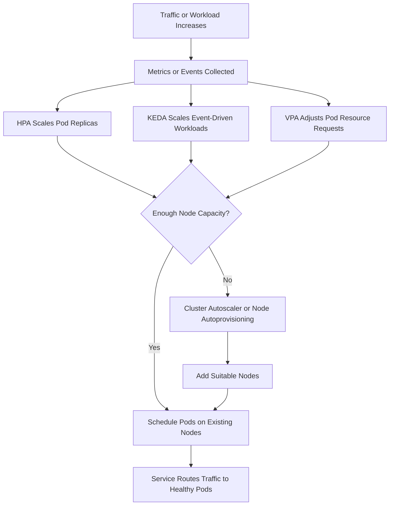

---

## 2. AKS Scaling Dimensions

AKS scaling is not a single feature. It occurs across several dimensions.

| Scaling Area | What It Changes | Typical Tool |
|---|---|---|
| Pod horizontal scaling | Number of Pod replicas | HPA |
| Event-driven scaling | Pod replicas based on queue/event backlog | KEDA |
| Pod vertical scaling | CPU and memory requests/limits | VPA |
| Node scaling | Number of worker Nodes | Cluster Autoscaler |
| Node selection | VM type and Node capacity | Node Autoprovisioning |
| Node pool scaling | Capacity within a specific pool | Azure CLI or autoscaler |
| Planned capacity | Fixed capacity before a known event | Manual scaling |
| Burst capacity | Temporary external compute | Azure Container Instances |

For most production systems, start with the simplest autoscaling model that meets the workload requirements. Use HPA for horizontally scalable services, KEDA for event-driven workloads, VPA for right-sizing, and Cluster Autoscaler or Node Autoprovisioning for infrastructure capacity.

---

## 3. High-Level AKS Scaling Architecture

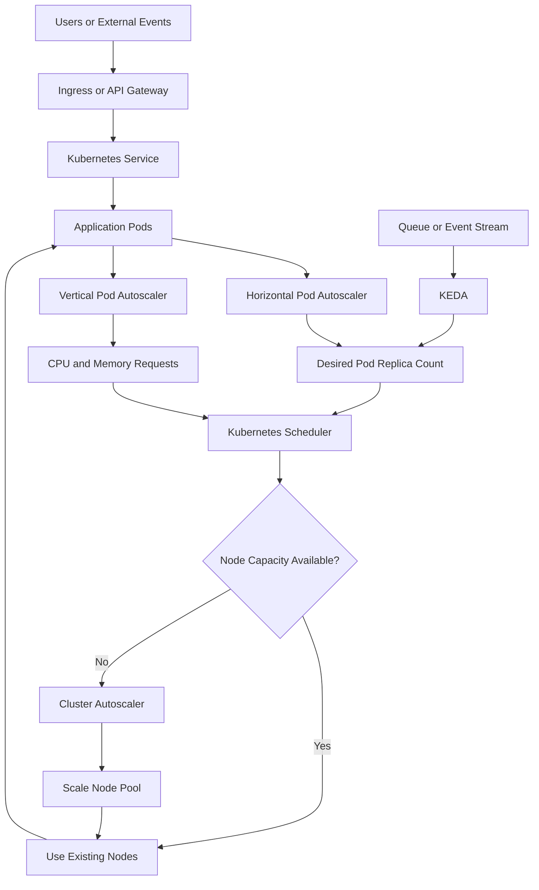

---

## 4. HPA: Horizontal Pod Autoscaler

The **Horizontal Pod Autoscaler** increases or decreases the number of Pod replicas based on observed metrics.

Common metrics include:

- CPU utilization
- Memory utilization
- Requests per second
- Custom application metrics
- External metrics

HPA is suitable for workloads that can run multiple equivalent replicas, such as:

- Stateless APIs
- Web applications
- Background workers
- Horizontally partitionable services

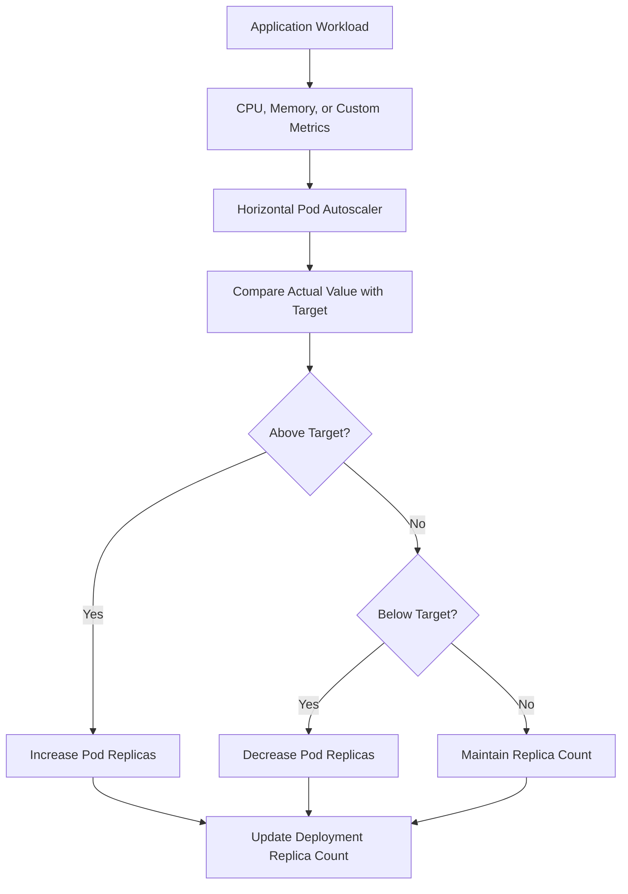

### Example HPA

```yaml
apiVersion: autoscaling/v2
kind: HorizontalPodAutoscaler
metadata:
  name: api-hpa
spec:
  scaleTargetRef:
    apiVersion: apps/v1
    kind: Deployment
    name: api
  minReplicas: 3
  maxReplicas: 20
  behavior:
    scaleUp:
      stabilizationWindowSeconds: 30
    scaleDown:
      stabilizationWindowSeconds: 300
  metrics:
    - type: Resource
      resource:
        name: cpu
        target:
          type: Utilization
          averageUtilization: 65
```

### HPA Interview Points

- Define accurate CPU and memory requests.
- Set sensible minimum and maximum replicas.
- Avoid scaling only on CPU when request rate or queue depth is the real bottleneck.
- Use stabilization windows to prevent rapid scale-in and scale-out oscillation.
- Ensure the application is stateless or safely partitionable.

---

## 5. HPA Scaling Flow

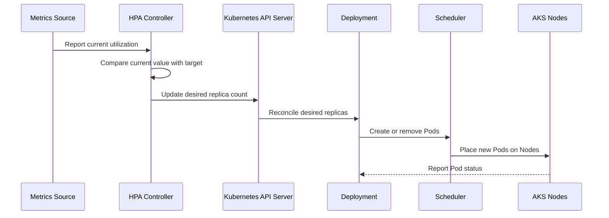

---

## 6. KEDA: Event-Driven Autoscaling

**KEDA**, or Kubernetes Event-driven Autoscaling, scales workloads using external event sources.

Examples include:

- Azure Service Bus message count
- Azure Storage Queue length
- Event Hub backlog
- Kafka lag
- RabbitMQ queue depth
- Scheduled triggers
- Custom external metrics

KEDA is useful when CPU and memory do not represent demand accurately.

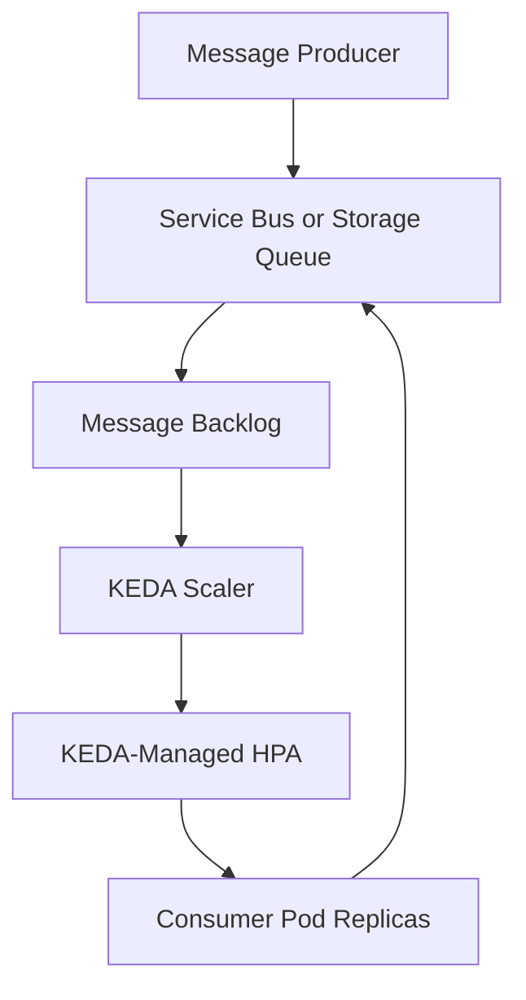

### Example KEDA ScaledObject

```yaml
apiVersion: keda.sh/v1alpha1
kind: ScaledObject
metadata:
  name: order-worker-scaler
spec:
  scaleTargetRef:
    name: order-worker
  minReplicaCount: 0
  maxReplicaCount: 30
  triggers:
    - type: azure-servicebus
      metadata:
        queueName: orders
        messageCount: "100"
        namespace: servicebus-namespace
```

### KEDA Use Case

Suppose an order-processing service consumes messages from Azure Service Bus:

- Queue depth is zero -> scale workers down
- Queue depth increases -> add consumer Pods
- Queue depth becomes very high -> add more Pods and possibly Nodes
- Queue is empty again -> scale toward zero if appropriate

> **Important:** Do not configure separate HPA and KEDA autoscalers for the same workload without a deliberate design. KEDA creates and manages HPA behavior for its `ScaledObject`.

---

## 7. VPA: Vertical Pod Autoscaler

The **Vertical Pod Autoscaler** adjusts the CPU and memory requests and limits of containers based on usage patterns.

VPA is useful when:

- A workload cannot scale horizontally
- Pod resource requests are difficult to estimate
- You want to right-size workloads
- Pods need more or fewer resources over time

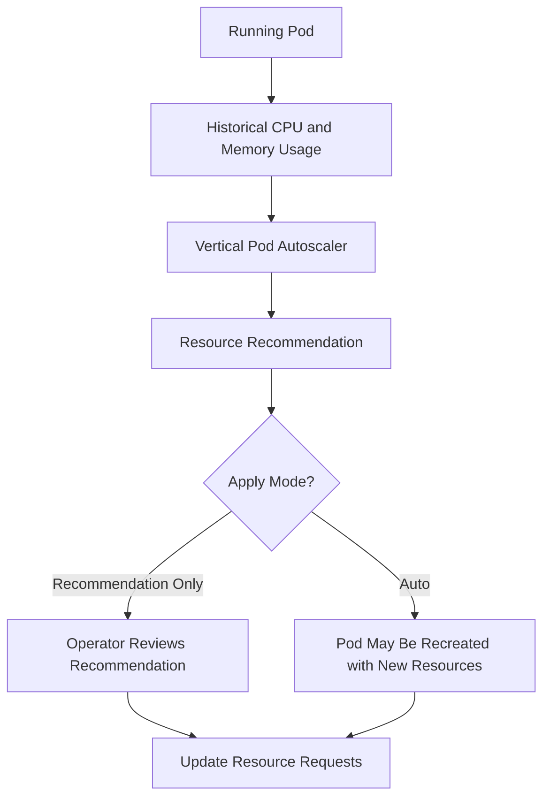

### VPA Caution

Changing Pod resource requests can cause Pod recreation. Use VPA carefully for latency-sensitive workloads and test the selected update mode before production use.

---

## 8. Cluster Autoscaler

The **Cluster Autoscaler** scales the number of Nodes in a Node Pool.

It watches for:

- Pods that cannot be scheduled because of insufficient resources
- Underutilized Nodes whose workloads can be safely moved

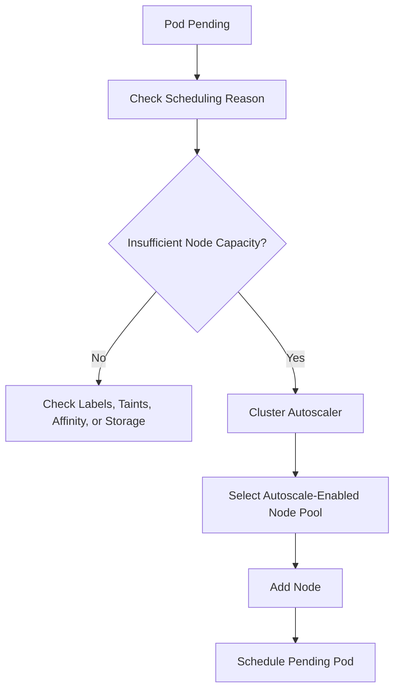

### Scale-Down Flow

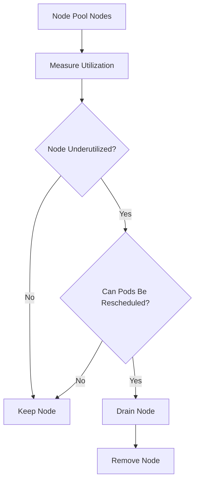

### Example Azure CLI

```bash
az aks nodepool update \
  --resource-group myResourceGroup \
  --cluster-name myAKSCluster \
  --name apppool \
  --enable-cluster-autoscaler \
  --min-count 2 \
  --max-count 10
```

---

## 9. Node Autoprovisioning

Node Autoprovisioning, or NAP, automatically provisions suitable Node capacity based on pending Pod requirements.

It can help select:

- VM size
- Node type
- Number of Nodes
- Capacity appropriate for Pod requests

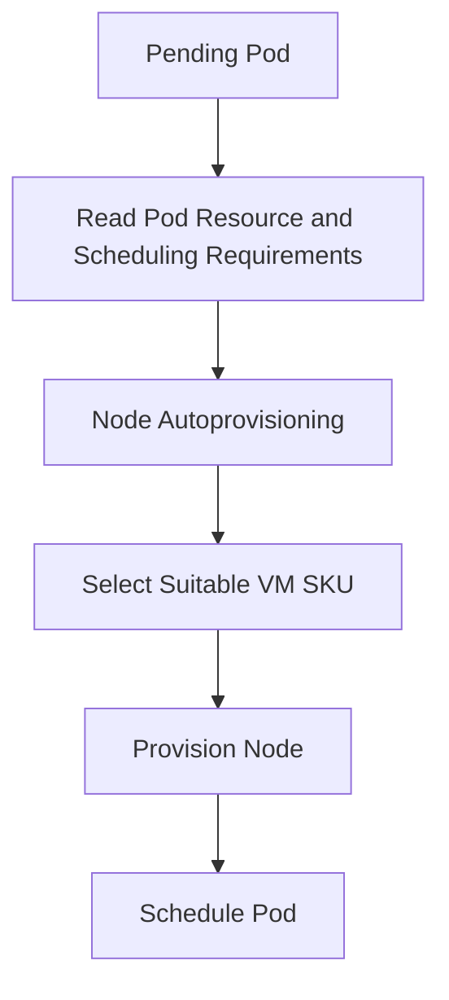

Use Node Autoprovisioning when:

- Workloads have varied resource requirements
- Manually maintaining many Node Pools is difficult
- The platform needs more dynamic VM selection
- The team wants to reduce unused capacity

Use Cluster Autoscaler with predefined Node Pools when:

- Infrastructure choices are intentionally fixed
- Workload isolation is important
- The organization requires predictable Node Pool design

---

## 10. HPA and Cluster Autoscaler Together

HPA and Cluster Autoscaler solve different problems and commonly work together.

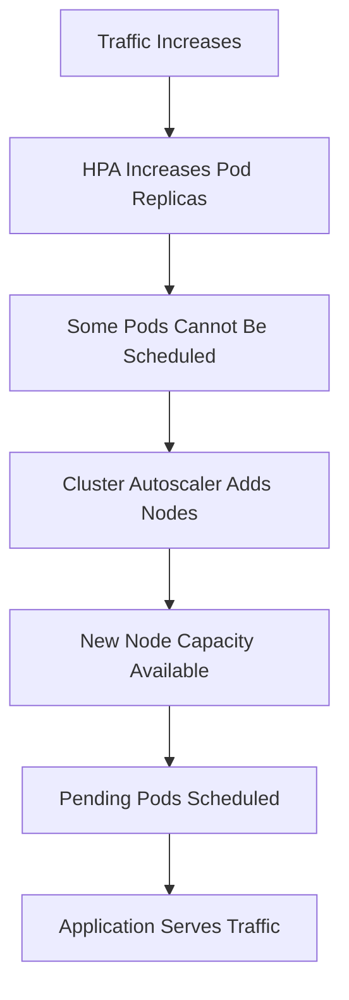

### Example

Initial state:

```text
3 Pods on 2 Nodes
```

Traffic increases:

```text
HPA scales from 3 Pods to 8 Pods
```

Existing Nodes can host only six Pods:

```text
2 Pods remain Pending
```

Cluster Autoscaler responds:

```text
Adds a Node
```

The remaining Pods are scheduled.

> **Interview phrase:**  
> **HPA scales the application; Cluster Autoscaler scales the infrastructure required to run the application.**

---

## 11. KEDA and Cluster Autoscaler Together

This pattern is common for queue consumers.

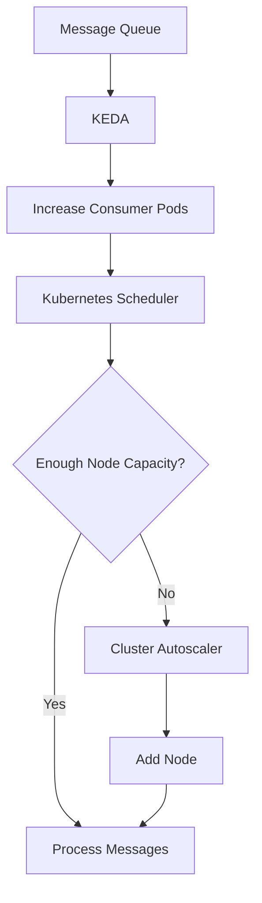

Example:

```text
Queue backlog = 10,000 messages
KEDA increases workers from 2 to 20
Existing Nodes cannot fit 20 workers
Cluster Autoscaler adds capacity
New workers start processing messages
Queue backlog falls
KEDA scales workers down
Cluster Autoscaler removes idle Nodes
```

---

## 12. Manual Scaling

Manual scaling is useful for:

- Planned traffic events
- Load testing
- Emergency capacity
- Predictable business peaks
- Temporary operational mitigation

### Scale a Deployment

```bash
kubectl scale deployment api \
  --replicas=10 \
  --namespace=production
```

### Scale an AKS Node Pool

```bash
az aks nodepool scale \
  --resource-group myResourceGroup \
  --cluster-name myAKSCluster \
  --name apppool \
  --node-count 5
```

Manual scaling should not replace autoscaling for workloads with unpredictable demand. It is useful as a planned or emergency control.

---

## 13. Scaling Node Pools

Use separate Node Pools for different workload types.

Example:

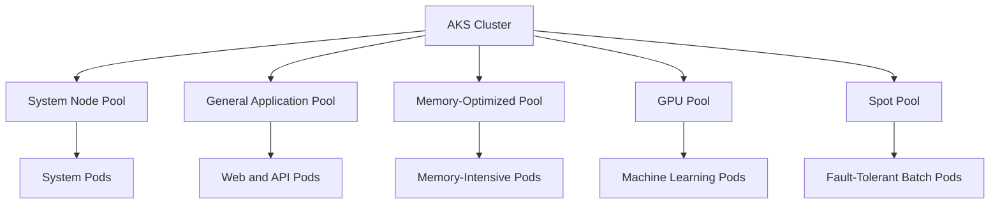

Benefits:

- Independent scaling
- Workload isolation
- Better cost control
- Specialized hardware
- Operating-system separation
- Better scheduling predictability

Use:

- Labels
- Node selectors
- Node affinity
- Taints
- Tolerations
- Topology constraints

to control placement.

---

## 14. Scaling by Workload Type

| Workload | Recommended Scaling Strategy |
|---|---|
| Stateless REST API | HPA plus Cluster Autoscaler |
| Web frontend | HPA plus Cluster Autoscaler |
| Queue consumer | KEDA plus Cluster Autoscaler |
| Non-parallelizable workload | VPA or vertical right-sizing |
| Batch workload | KEDA, Jobs, or manual scaling |
| GPU workload | Specialized GPU Node Pool plus autoscaling |
| Windows workload | Windows Node Pool plus HPA |
| Highly predictable workload | Manual baseline plus autoscaling |
| Short burst workload | KEDA, autoscaling, or burst capacity |
| Stateful workload | Carefully designed replicas, storage, and scaling strategy |

---

## 15. Scaling Flow for a Web API

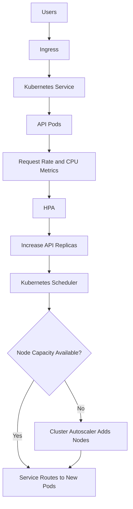

---

## 16. Scaling Flow for a Queue Worker

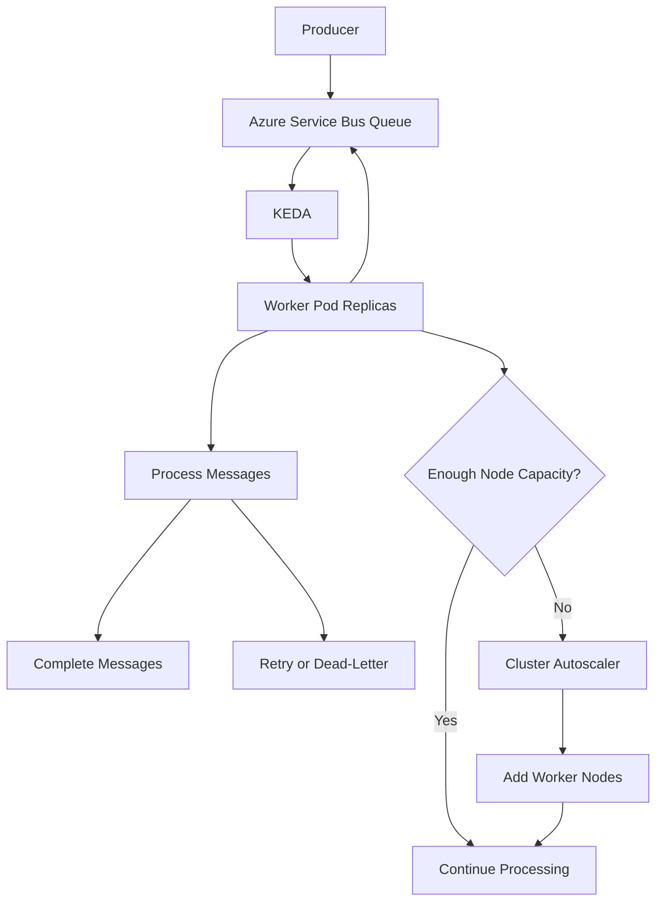

---

## 17. Scaling Flow for a Memory-Intensive Service

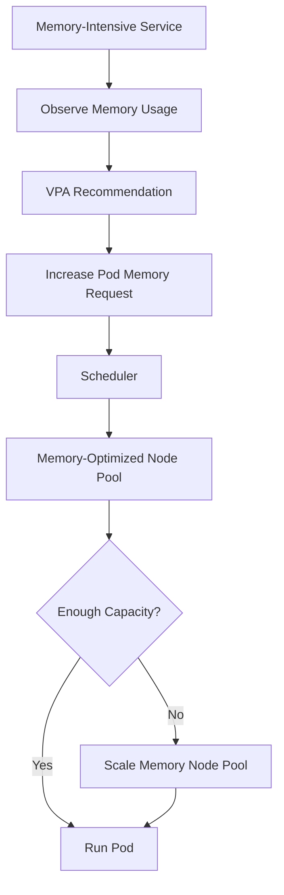

---

## 18. Resource Requests and Limits

Autoscaling depends on accurate resource configuration.

Example:

```yaml
resources:
  requests:
    cpu: "250m"
    memory: "256Mi"
  limits:
    cpu: "1000m"
    memory: "1Gi"
```

### Requests

Used by the scheduler to determine where a Pod can run.

### Limits

Restrict the maximum resources available to a container.

### Why They Matter for Scaling

Incorrect requests can cause:

- Pods to remain Pending
- Nodes to be overprovisioned
- Autoscaler decisions to be inaccurate
- CPU throttling
- Memory eviction
- Poor cost efficiency

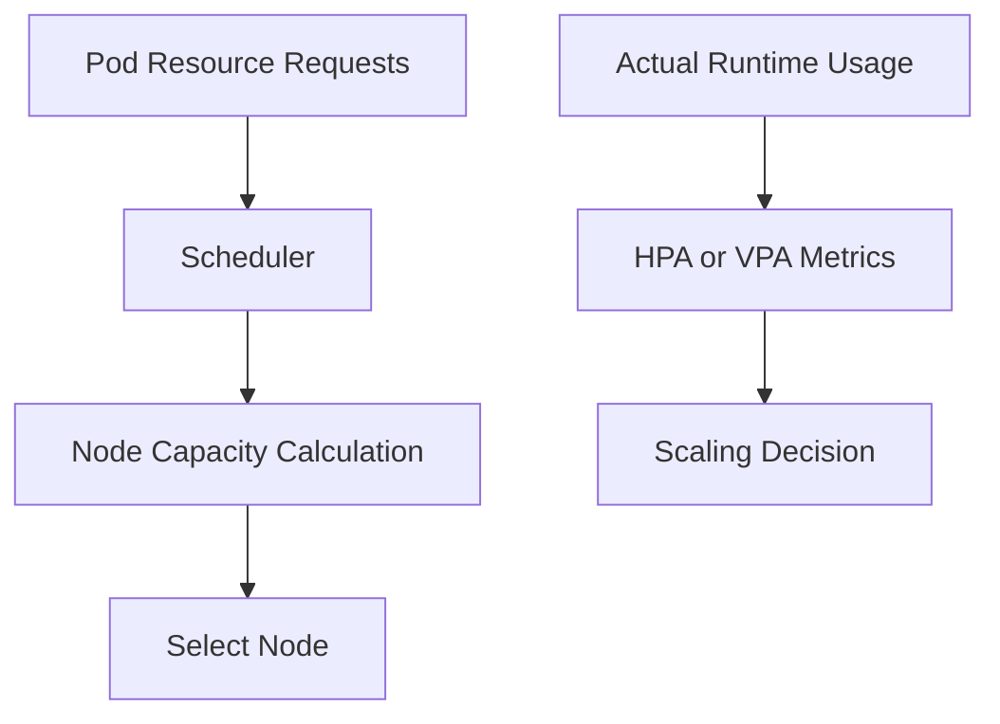

> **Interview point:**  
> Scaling configuration is only reliable when resource requests and limits reflect actual application behavior.

---

## 19. Readiness and Liveness During Scaling

Scaling creates and removes Pods. Health probes determine whether traffic should be sent to them.

### Readiness Probe

Prevents a new Pod from receiving traffic before it is ready.

### Liveness Probe

Restarts a container that is no longer functioning.

### Startup Probe

Protects slow-starting applications from premature liveness failures.

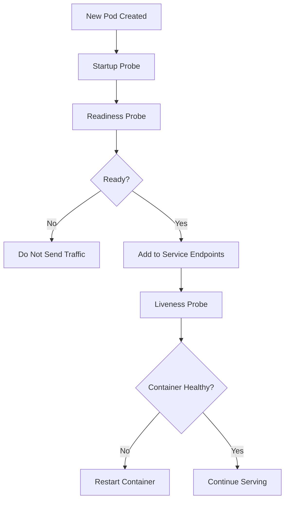

---

## 20. Scaling and High Availability

Scaling should preserve availability.

Use:

- At least two replicas for critical applications
- Multiple Nodes
- Multiple availability zones
- Pod anti-affinity
- Topology spread constraints
- Pod Disruption Budgets
- Readiness probes
- Graceful shutdown
- Adequate minimum Node capacity

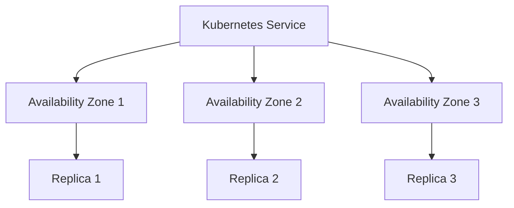

Scaling should not place every replica on one Node or in one zone.

---

## 21. Scaling and Cost Optimization

Cost optimization techniques include:

- Set realistic minimum and maximum replicas
- Use Cluster Autoscaler or Node Autoprovisioning
- Use smaller VM sizes where appropriate
- Use separate Node Pools for specialized workloads
- Use Spot Nodes for fault-tolerant jobs
- Avoid excessive resource requests
- Scale non-production environments down
- Monitor idle capacity
- Use KEDA for scale-to-zero workloads when appropriate
- Avoid duplicate autoscalers fighting over one workload

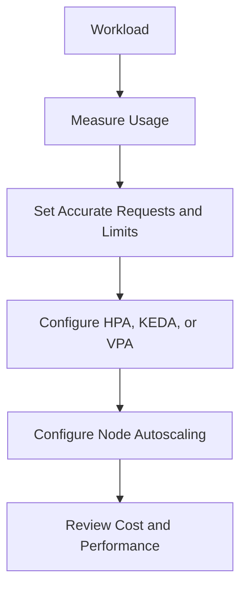

---

## 22. Scaling and Availability Zones

For zonal AKS designs:

- Use multiple availability zones
- Distribute replicas across zones
- Use topology spread constraints
- Consider separate Node Pools per zone when required
- Balance similar Node Pools during autoscaling
- Ensure storage supports zone placement

Example:

```yaml
topologySpreadConstraints:
  - maxSkew: 1
    topologyKey: topology.kubernetes.io/zone
    whenUnsatisfiable: DoNotSchedule
    labelSelector:
      matchLabels:
        app: api
```

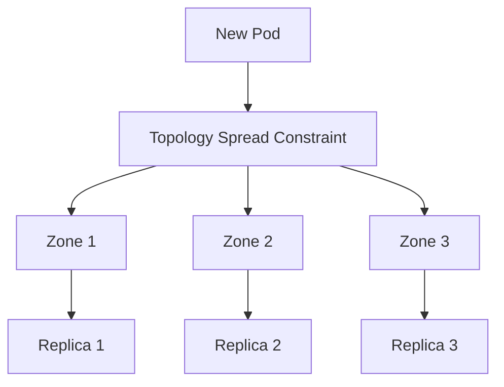

---

## 23. Scaling and Performance

Monitor:

- Request rate
- CPU utilization
- Memory utilization
- p95 and p99 latency
- Queue depth
- Message age
- Pod startup time
- Pending Pod count
- Node utilization
- Scaling delay
- Error rate
- Database saturation

```mermaid
flowchart LR
    Metrics["Application and Cluster Metrics"] --> Dashboard["Scaling Dashboard"]
    Dashboard --> Decision["Capacity and Performance Decision"]

    Decision --> HPA["Tune HPA"]
    Decision --> KEDA["Tune KEDA"]
    Decision --> Nodes["Tune Node Pools"]
    Decision --> Resources["Tune Requests and Limits"]
```

---

## 24. Scale-Up and Scale-Down Safety

### Scale-Up Considerations

- Is the application capable of serving traffic immediately?
- Do new Pods pass readiness checks?
- Is the database able to handle additional connections?
- Are downstream APIs protected?
- Is the image startup time acceptable?
- Are Nodes available quickly enough?

### Scale-Down Considerations

- Are in-flight requests drained?
- Are workers allowed to finish messages?
- Is data safely committed?
- Are Pods protected by a disruption budget?
- Can the workload be rescheduled?
- Are there minimum replica requirements?

```mermaid
flowchart TD
    ScaleDown["Scale-Down Request"] --> Drain["Graceful Draining"]
    Drain --> Requests{"In-Flight Requests Complete?"}
    Requests -- "No" --> Wait["Wait"]
    Requests -- "Yes" --> Terminate["Terminate Pod"]
    Terminate --> Capacity["Release Capacity"]
```

---

## 25. Common Scaling Problems

### Pods Remain Pending

Possible causes:

- Insufficient Node capacity
- Incorrect resource requests
- Node selector mismatch
- Taint without toleration
- Affinity constraints
- Storage topology restrictions
- Maximum Node limit reached

### HPA Does Not Scale

Possible causes:

- Metrics server unavailable
- Incorrect target reference
- Missing resource requests
- Wrong metric configuration
- Application does not expose the required metric

### Cluster Autoscaler Does Not Add Nodes

Possible causes:

- Node Pool reached maximum size
- Pod cannot fit any available VM type
- Scheduling constraints are impossible
- Node Pool is not autoscaler-enabled
- Quota or regional capacity is unavailable

### Scale-In Causes Errors

Possible causes:

- No graceful shutdown
- Incorrect Pod Disruption Budget
- Long-running jobs
- Stateful storage constraints
- Insufficient remaining capacity

```mermaid
flowchart TD
    ScalingIssue["Scaling Issue"] --> Type{"Observed Symptom?"}

    Type -- "Pods Pending" --> Scheduling["Check Resources, Taints, Labels, and Affinity"]
    Type -- "HPA Not Scaling" --> Metrics["Check Metrics and Resource Requests"]
    Type -- "Nodes Not Added" --> Pool["Check Autoscaler Limits and VM Capacity"]
    Type -- "Errors During Scale-In" --> Shutdown["Check Draining, PDB, and Graceful Shutdown"]
```

---

## 26. Troubleshooting Commands

### Inspect Pods

```bash
kubectl get pods -n production
kubectl describe pod <pod-name> -n production
kubectl get events -n production --sort-by=.lastTimestamp
```

### Inspect HPA

```bash
kubectl get hpa -n production
kubectl describe hpa <hpa-name> -n production
```

### Inspect Nodes

```bash
kubectl get nodes
kubectl top nodes
kubectl describe node <node-name>
```

### Inspect Pod Usage

```bash
kubectl top pods -n production
```

### Inspect AKS Node Pools

```bash
az aks nodepool list \
  --resource-group <resource-group> \
  --cluster-name <cluster-name>
```

### Inspect Autoscaler Configuration

```bash
az aks nodepool show \
  --resource-group <resource-group> \
  --cluster-name <cluster-name> \
  --name <node-pool-name>
```

---

## 27. AKS Automatic vs AKS Standard

### AKS Automatic

AKS Automatic provides more preconfigured production defaults for:

- Node provisioning
- HPA
- KEDA
- VPA
- Security
- Networking
- Monitoring
- Upgrades

### AKS Standard

AKS Standard provides more explicit control, but platform teams usually configure and operate scaling features themselves.

```mermaid
flowchart TD
    Choice["Choose AKS Mode"] --> Automatic["AKS Automatic"]
    Choice --> Standard["AKS Standard"]

    Automatic --> Managed["More Preconfigured Scaling Defaults"]
    Standard --> Explicit["Operator Enables and Tunes Scaling"]
```

> **Interview answer:**  
> I choose AKS Automatic when I want a production-ready managed baseline. I choose AKS Standard when I need deeper control over Node Pools, networking, autoscaler behavior, and upgrade orchestration.

---

## 28. Scaling Strategy for a Production API

### Requirements

- Stateless REST API
- Variable traffic
- Three availability zones
- Azure SQL backend
- p95 latency target
- No downtime during scaling

### Design

1. Deploy at least three replicas
2. Configure resource requests and limits
3. Configure readiness, liveness, and startup probes
4. Use HPA based on CPU and request metrics
5. Configure minimum replicas to maintain availability
6. Configure Cluster Autoscaler or Node Autoprovisioning
7. Spread Pods across zones
8. Protect database connections with pooling and limits
9. Monitor scaling delay and p95 latency
10. Test scale-up and scale-down behavior

```mermaid
flowchart TD
    Traffic["Traffic Changes"] --> Metrics["Request and Latency Metrics"]
    Metrics --> HPA["HPA"]
    HPA --> Pods["Scale API Pods"]

    Pods --> Spread["Spread Replicas Across Zones"]
    Spread --> Capacity{"Node Capacity Available?"}

    Capacity -- "Yes" --> Serve["Serve Traffic"]
    Capacity -- "No" --> CA["Scale Node Capacity"]
    CA --> Serve

    Serve --> Database["Protect Database with Connection Pooling"]
```

---

## 29. Scaling Strategy for a Production Queue Worker

### Requirements

- Azure Service Bus queue
- Bursty workload
- Delayed processing is acceptable
- Worker is stateless
- Cost should fall during idle periods

### Design

1. Use KEDA based on queue depth
2. Set minimum replicas to zero or a small baseline
3. Set a safe maximum replica count
4. Make message processing idempotent
5. Use retries and dead-letter handling
6. Configure Cluster Autoscaler or Node Autoprovisioning
7. Monitor oldest message age
8. Protect downstream systems from excessive concurrency

```mermaid
flowchart TD
    Queue["Service Bus Queue"] --> Backlog["Message Backlog"]
    Backlog --> KEDA["KEDA"]
    KEDA --> Workers["Worker Pods"]
    Workers --> Process["Process Messages"]

    Process --> Downstream["Database or External API"]
    Downstream --> Limit["Concurrency and Rate Limits"]

    Workers --> Capacity{"Enough Node Capacity?"}
    Capacity -- "Yes" --> Continue["Continue Processing"]
    Capacity -- "No" --> CA["Add Nodes"]
    CA --> Continue
```

---

## 30. Interview Questions and Strong Answers

### Q1: How do you scale AKS?

**Answer:** I scale Pods horizontally with HPA or KEDA, adjust Pod resources with VPA when appropriate, and scale worker Nodes with Cluster Autoscaler or Node Autoprovisioning. I also use separate Node Pools for different workloads and ensure that resource requests, health probes, and availability rules are configured correctly.

### Q2: What is the difference between HPA and Cluster Autoscaler?

**Answer:** HPA changes the number of Pod replicas. Cluster Autoscaler changes the number of Nodes available to run those Pods.

### Q3: When would you use KEDA instead of HPA?

**Answer:** I use KEDA when workload demand is driven by external events such as queue depth, message backlog, or Event Hub lag. HPA is more appropriate when CPU, memory, request rate, or standard metrics represent demand.

### Q4: Can HPA scale Nodes?

**Answer:** No. HPA scales Pod replicas. If new Pods cannot fit on existing Nodes, Cluster Autoscaler or Node Autoprovisioning must add Node capacity.

### Q5: What happens when HPA creates more Pods than the cluster can host?

**Answer:** The extra Pods remain Pending. Cluster Autoscaler or Node Autoprovisioning detects the unschedulable Pods and adds suitable Node capacity.

### Q6: When would you use VPA?

**Answer:** I use VPA to right-size CPU and memory requests, especially for workloads that cannot scale horizontally or when resource requirements are difficult to estimate. I test its update behavior because changing resources can recreate Pods.

### Q7: How do you scale a queue-processing workload?

**Answer:** I use KEDA based on queue depth or message age, set safe minimum and maximum replicas, make processing idempotent, and use Cluster Autoscaler to provide Node capacity when the worker count increases.

### Q8: How do resource requests affect scaling?

**Answer:** Requests influence scheduling and Node autoscaling. If requests are too high, the cluster may overprovision. If they are too low, Pods may compete for resources and autoscaling decisions may be inaccurate.

### Q9: How do you avoid downtime during scale-out?

**Answer:** Use multiple replicas, readiness probes, graceful startup, adequate Node headroom, Pod distribution across zones, and controlled database connection usage.

### Q10: How do you avoid problems during scale-in?

**Answer:** Use graceful shutdown, connection draining, Pod Disruption Budgets, correct termination handling, safe message completion, and application-level protection for stateful operations.

### Q11: How do you optimize AKS scaling cost?

**Answer:** Use accurate resource requests, autoscale Node Pools, use KEDA or scale-to-zero for idle event-driven workloads, use specialized VM sizes, use Spot Nodes for fault-tolerant workloads, and monitor idle capacity.

### Q12: What is Node Autoprovisioning?

**Answer:** Node Autoprovisioning selects and provisions suitable Node capacity based on pending Pod requirements, reducing the need to maintain many manually defined Node Pools.

---

## 31. 60-Second Interview Pitch

> I scale AKS at both the workload and infrastructure levels. For stateless applications, I use HPA to increase or decrease Pod replicas based on CPU, memory, request rate, or custom metrics. For queue-driven workloads, I use KEDA based on message backlog or event lag. I use VPA to right-size resource requests where horizontal scaling is not appropriate. When new Pods cannot fit on existing Nodes, Cluster Autoscaler or Node Autoprovisioning adds suitable capacity. I use separate Node Pools for specialized workloads, configure realistic resource requests and limits, spread replicas across availability zones, and use readiness probes, Pod Disruption Budgets, and graceful shutdown to preserve availability. Finally, I monitor scaling latency, Pending Pods, queue age, p95 latency, cost, and downstream saturation.

---

## 32. Final Revision Checklist

- [ ] Understand Pod scaling versus Node scaling
- [ ] Use HPA for horizontally scalable workloads
- [ ] Use KEDA for event-driven workloads
- [ ] Use VPA for right-sizing or non-parallelizable workloads
- [ ] Use Cluster Autoscaler for predefined Node Pools
- [ ] Use Node Autoprovisioning for dynamic VM selection
- [ ] Configure accurate CPU and memory requests
- [ ] Set reasonable minimum and maximum replicas
- [ ] Set Node Pool minimum and maximum sizes
- [ ] Use multiple Node Pools for workload isolation
- [ ] Use readiness and liveness probes
- [ ] Spread replicas across Nodes and zones
- [ ] Configure Pod Disruption Budgets
- [ ] Implement graceful shutdown
- [ ] Protect databases and external dependencies
- [ ] Monitor Pending Pods and autoscaler decisions
- [ ] Monitor queue depth and message age
- [ ] Test scale-up and scale-down behavior
- [ ] Avoid combining competing autoscalers for the same workload
- [ ] Review cost and idle capacity regularly

---

## One-Line Conclusion

> Scale AKS by combining HPA or KEDA for Pod replicas, VPA for resource right-sizing, and Cluster Autoscaler or Node Autoprovisioning for worker capacity, while protecting availability, performance, and cost.