# What Are Helm Charts?
## Detailed Kubernetes and AKS Interview Preparation Guide

---

## 1. Direct Interview Answer

A **Helm Chart** is a package of Kubernetes resource definitions that can be used to deploy, configure, upgrade, and manage an application.

Helm is often described as the **package manager for Kubernetes**.

A Helm Chart can contain templates for:

- Deployments
- Services
- Ingress resources
- ConfigMaps
- Secrets
- PersistentVolumeClaims
- ServiceAccounts
- HorizontalPodAutoscalers
- Jobs
- NetworkPolicies
- Custom Kubernetes resources

Instead of writing separate Kubernetes YAML files for every environment, Helm allows teams to create reusable templates and provide environment-specific values.

> **One-line interview answer:**  
> **A Helm Chart is a reusable, parameterized package of Kubernetes manifests used to install, upgrade, configure, and roll back applications consistently.**

---

## 2. Why Do We Use Helm?

Managing Kubernetes applications using only static YAML files can become difficult when there are:

- Multiple environments
- Many microservices
- Repeated configuration
- Different image versions
- Environment-specific settings
- Complex dependencies
- Frequent releases
- Multiple teams

Helm provides:

- Reusable deployment templates
- Centralized configuration
- Versioned application packages
- Release tracking
- Upgrade support
- Rollback support
- Dependency management
- Environment-specific values

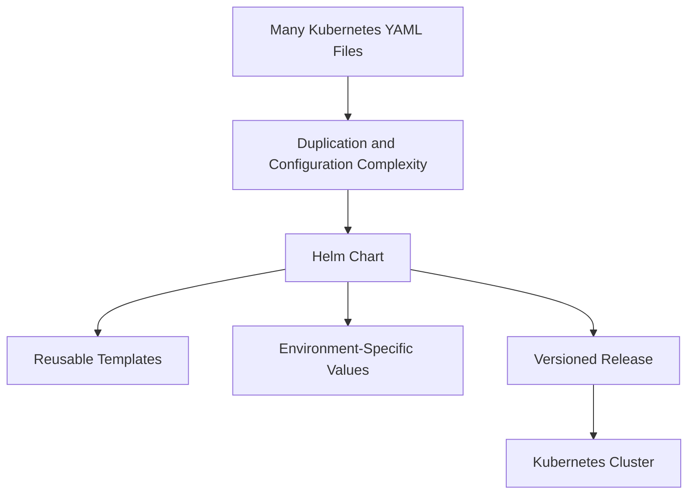

---

## 3. Helm Architecture

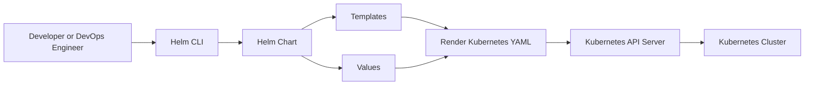

Helm uses:

1. A Chart
2. Templates
3. Values
4. The Helm CLI
5. The Kubernetes API server
6. A Helm release

---

## 4. Helm Chart vs Kubernetes Manifest

| Kubernetes Manifest | Helm Chart |
|---|---|
| Static YAML definition | Parameterized package of YAML templates |
| Usually environment-specific | Reusable across environments |
| Manual version changes | Values can control versions |
| No built-in release history | Tracks releases and revisions |
| Rollback must be designed separately | Helm provides rollback commands |
| Dependencies managed manually | Chart dependencies can be declared |
| Repetition is common | Templates reduce duplication |

### Static Kubernetes YAML

```yaml
apiVersion: apps/v1
kind: Deployment
metadata:
  name: web
spec:
  replicas: 3
  template:
    spec:
      containers:
        - name: web
          image: example/web:1.0.0
```

### Helm Template

```yaml
apiVersion: apps/v1
kind: Deployment
metadata:
  name: {{ include "web.fullname" . }}
spec:
  replicas: {{ .Values.replicaCount }}
  template:
    spec:
      containers:
        - name: web
          image: "{{ .Values.image.repository }}:{{ .Values.image.tag }}"
```

The Helm template allows the same chart to be reused with different values.

---

## 5. What Is a Helm Release?

A **release** is a running instance of a Helm Chart in a Kubernetes cluster.

The same Chart can be installed multiple times with different release names.

For example:

```bash
helm install frontend-dev ./frontend-chart
helm install frontend-test ./frontend-chart
helm install frontend-prod ./frontend-chart
```

This creates three separate releases:

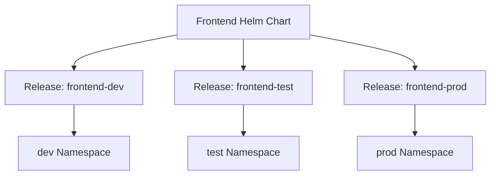

Each release can have:

- A unique name
- A namespace
- Different values
- Separate revision history
- Independent upgrades
- Independent rollbacks

> **Interview distinction:**  
> A **Chart** is the package. A **Release** is an installed instance of that package.

---

## 6. Helm Chart Directory Structure

A typical Helm Chart has the following structure:

```text
myapp/
├── Chart.yaml
├── values.yaml
├── charts/
├── templates/
│   ├── _helpers.tpl
│   ├── deployment.yaml
│   ├── service.yaml
│   ├── ingress.yaml
│   ├── configmap.yaml
│   ├── secret.yaml
│   ├── serviceaccount.yaml
│   ├── tests/
│   │   └── test-connection.yaml
│   └── NOTES.txt
└── .helmignore
```

---

## 7. Important Chart Files

## 7.1 `Chart.yaml`

`Chart.yaml` contains metadata about the Chart.

Example:

```yaml
apiVersion: v2
name: webapp
description: A Helm chart for a web application
type: application
version: 1.0.0
appVersion: "2.4.1"
```

Important fields include:

| Field | Purpose |
|---|---|
| `apiVersion` | Chart API version |
| `name` | Chart name |
| `description` | Chart description |
| `type` | Application or library |
| `version` | Version of the Chart package |
| `appVersion` | Version of the application being deployed |
| `dependencies` | Other Charts required by this Chart |

### Chart Version vs Application Version

These are different:

- `version`: version of the Helm Chart
- `appVersion`: version of the application

Example:

```yaml
version: 1.3.0
appVersion: "5.2.1"
```

This means:

- The Chart package is version `1.3.0`
- The application deployed by the Chart is version `5.2.1`

---

## 7.2 `values.yaml`

`values.yaml` contains default configuration values.

Example:

```yaml
replicaCount: 2

image:
  repository: nginx
  tag: "1.27"
  pullPolicy: IfNotPresent

service:
  type: ClusterIP
  port: 80

resources:
  requests:
    cpu: 100m
    memory: 128Mi
  limits:
    cpu: 500m
    memory: 256Mi
```

Templates access these values through `.Values`.

Example:

```yaml
replicas: {{ .Values.replicaCount }}
```

Values can be overridden using:

- A custom values file
- The `--set` option
- Parent Chart values
- Environment-specific configuration

---

## 7.3 `templates/`

The `templates/` directory contains Kubernetes manifest templates.

Common templates include:

```text
templates/deployment.yaml
templates/service.yaml
templates/ingress.yaml
templates/configmap.yaml
templates/secret.yaml
templates/serviceaccount.yaml
templates/hpa.yaml
```

Helm renders the files in this directory into Kubernetes YAML before submitting them to the Kubernetes API server.

---

## 7.4 `charts/`

The `charts/` directory stores dependent Charts.

Examples:

- PostgreSQL
- Redis
- RabbitMQ
- MySQL
- Common internal platform Chart

Dependencies can also be declared in `Chart.yaml`.

---

## 7.5 `_helpers.tpl`

`_helpers.tpl` contains reusable named templates.

Example:

```gotemplate
{{- define "webapp.fullname" -}}
{{ .Release.Name }}-{{ .Chart.Name }}
{{- end }}
```

Use it in another template:

```yaml
metadata:
  name: {{ include "webapp.fullname" . }}
```

Helpers reduce repeated naming and labeling logic.

---

## 7.6 `NOTES.txt`

`NOTES.txt` displays helpful instructions after installation.

Example:

```text
The application has been deployed.

To access the service, run:

kubectl get svc {{ include "webapp.fullname" . }}
```

It can provide:

- Access instructions
- Validation commands
- Next steps
- Application URLs
- Operational notes

---

## 7.7 `.helmignore`

`.helmignore` excludes files from the Chart package.

It is similar in purpose to:

- `.gitignore`
- `.dockerignore`

Use it to exclude:

- Temporary files
- Local documentation
- Test output
- Build artifacts
- Unnecessary files

---

## 8. Helm Template Rendering Flow

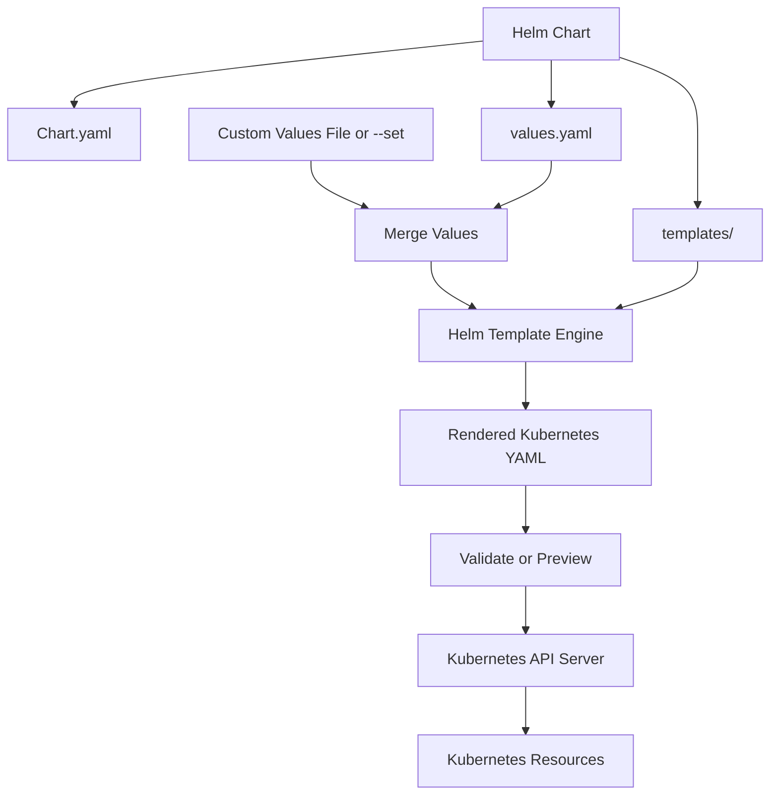

Helm combines:

1. Chart metadata
2. Default values
3. User-supplied values
4. Templates
5. Release information

It then renders Kubernetes manifests.

---

## 9. Helm Values Precedence

Helm values may come from several sources.

A typical precedence order is:

1. Chart's `values.yaml`
2. Parent Chart values
3. User-provided values file using `-f` or `--values`
4. Command-line values using `--set`

More specific values override less specific values.

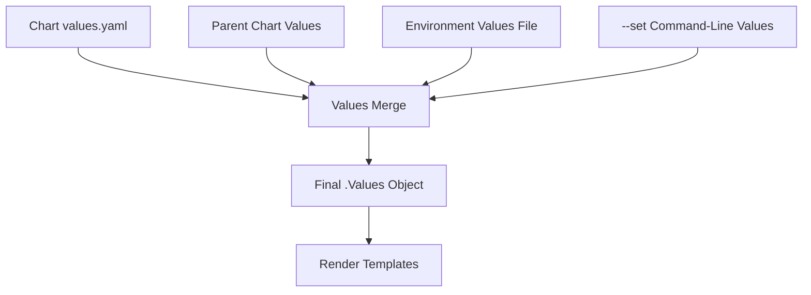

Example:

```bash
helm install webapp ./webapp \
  -f values-prod.yaml \
  --set image.tag=2.0.0
```

In this example:

- `values.yaml` provides defaults
- `values-prod.yaml` overrides production-specific settings
- `--set image.tag=2.0.0` has the highest specificity

---

## 10. Environment-Specific Values

A common structure is:

```text
webapp/
├── values.yaml
├── values-dev.yaml
├── values-test.yaml
├── values-staging.yaml
└── values-prod.yaml
```

### `values-dev.yaml`

```yaml
replicaCount: 1

image:
  tag: "dev"

resources:
  requests:
    cpu: 50m
    memory: 64Mi
```

### `values-prod.yaml`

```yaml
replicaCount: 5

image:
  tag: "2.0.0"

resources:
  requests:
    cpu: 500m
    memory: 512Mi
```

Deployment:

```bash
helm upgrade --install webapp ./webapp \
  --namespace production \
  --create-namespace \
  --values values-prod.yaml
```

---

## 11. Helm Installation Flow

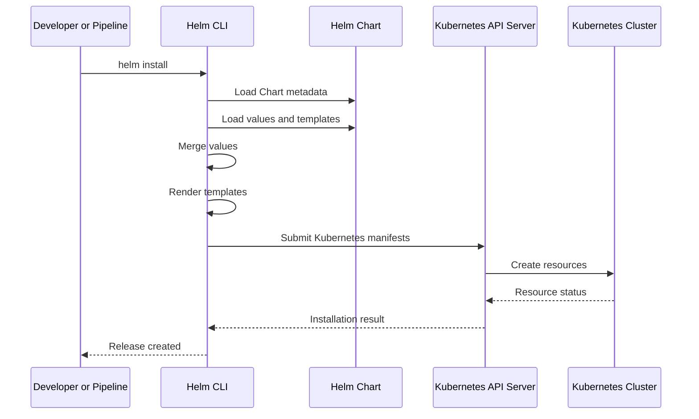

Example:

```bash
helm install webapp ./webapp \
  --namespace production \
  --create-namespace
```

---

## 12. Helm Upgrade Flow

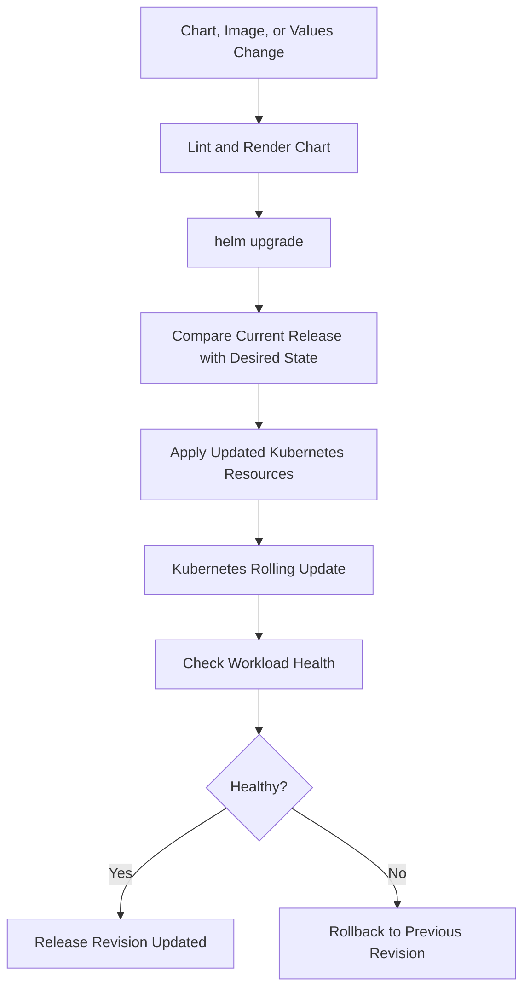

Example:

```bash
helm upgrade webapp ./webapp \
  --namespace production \
  --values values-prod.yaml \
  --set image.tag=2.1.0 \
  --wait \
  --timeout 10m
```

---

## 13. Helm Rollback Flow

Helm stores release revision history, allowing a release to be rolled back.

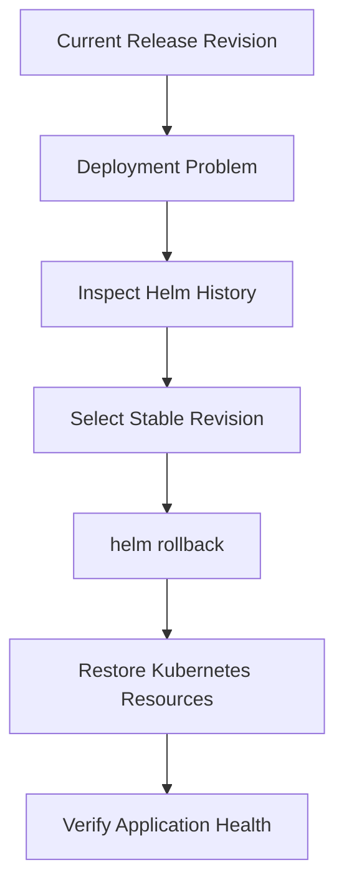

Commands:

```bash
helm history webapp --namespace production

helm rollback webapp 3 \
  --namespace production \
  --wait
```

A rollback changes the release back to an earlier revision.

> **Important:** A Helm rollback does not automatically undo external database changes. Database migrations must be designed separately and safely.

---

## 14. Helm Release Lifecycle

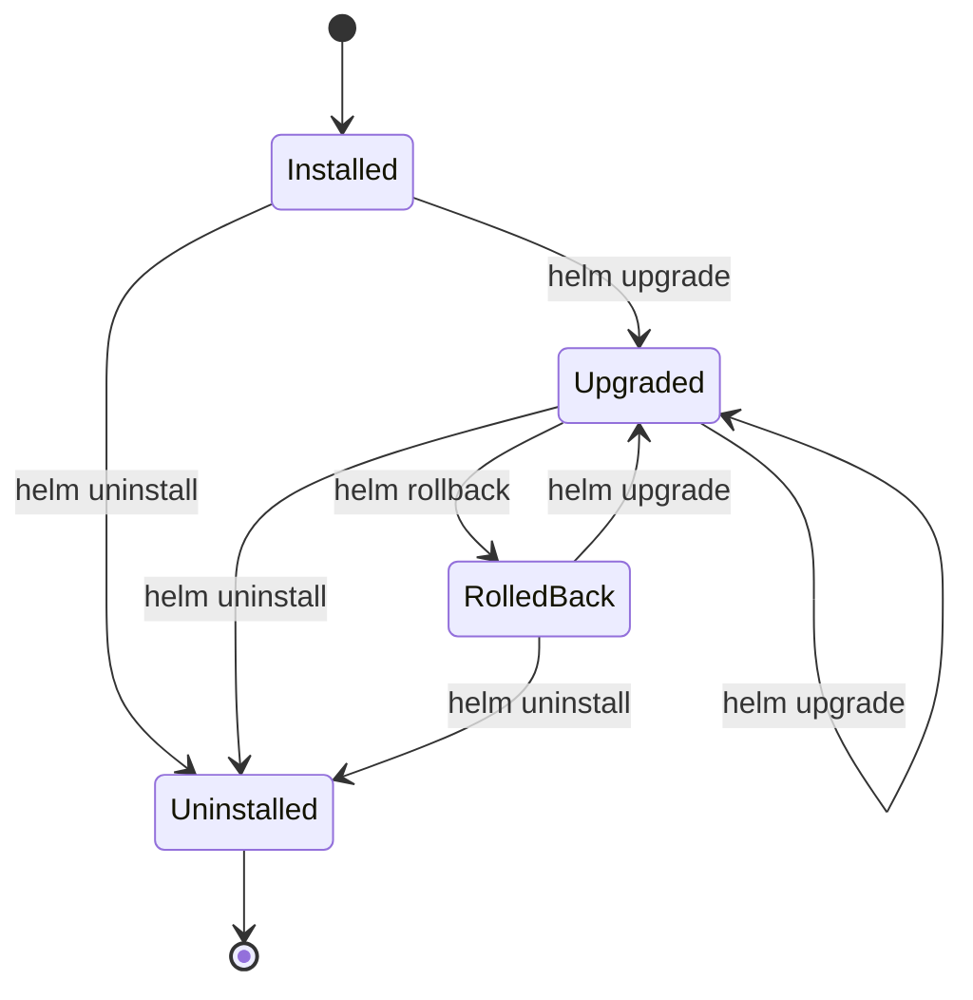

Common release states include:

- Deployed
- Failed
- Pending-install
- Pending-upgrade
- Pending-rollback
- Superseded
- Uninstalled

---

## 15. Important Helm Commands

### Create a Chart

```bash
helm create webapp
```

### Lint a Chart

```bash
helm lint ./webapp
```

### Render Templates Locally

```bash
helm template webapp ./webapp
```

### Render with Values

```bash
helm template webapp ./webapp \
  --values values-prod.yaml
```

### Install a Chart

```bash
helm install webapp ./webapp
```

### List Releases

```bash
helm list --all-namespaces
```

### Show Release Status

```bash
helm status webapp
```

### Show Release History

```bash
helm history webapp
```

### Upgrade a Release

```bash
helm upgrade webapp ./webapp
```

### Install or Upgrade

```bash
helm upgrade --install webapp ./webapp
```

### Roll Back

```bash
helm rollback webapp 2
```

### Uninstall

```bash
helm uninstall webapp
```

### Package a Chart

```bash
helm package ./webapp
```

---

## 16. `helm install` vs `helm upgrade --install`

### `helm install`

Fails if the release already exists.

```bash
helm install webapp ./webapp
```

### `helm upgrade --install`

Installs the release if it does not exist or upgrades it if it does.

```bash
helm upgrade --install webapp ./webapp
```

This command is commonly used in CI/CD pipelines because it is idempotent.

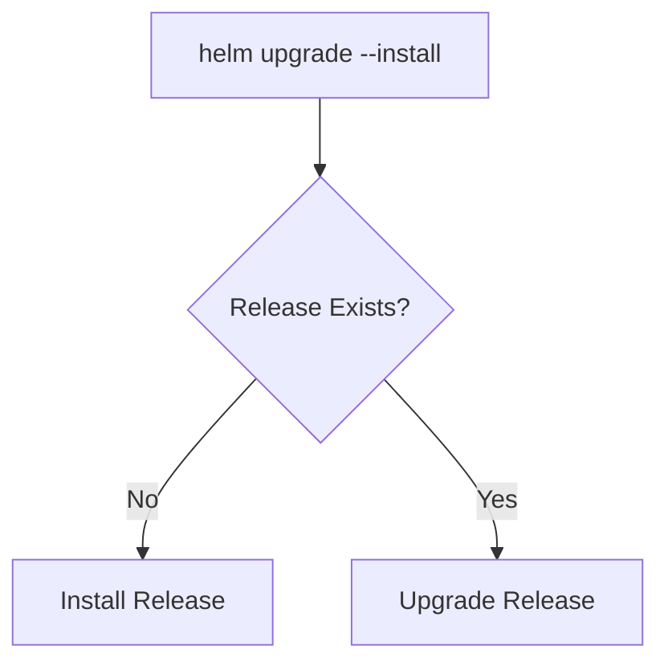

---

## 17. Helm Dependency Management

A Chart can depend on other Charts.

Example `Chart.yaml`:

```yaml
apiVersion: v2
name: ecommerce
version: 1.0.0

dependencies:
  - name: redis
    version: "20.x.x"
    repository: "https://example.com/charts"
  - name: postgresql
    version: "16.x.x"
    repository: "https://example.com/charts"
```

Update dependencies:

```bash
helm dependency update ./ecommerce
```

Build dependencies:

```bash
helm dependency build ./ecommerce
```

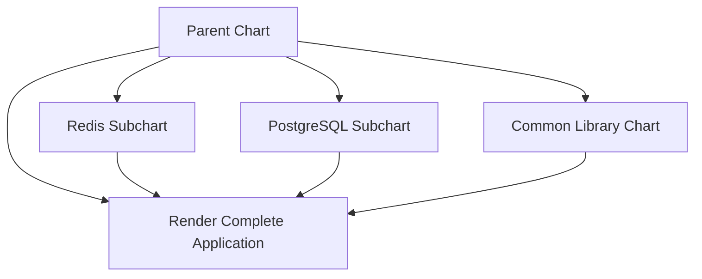

### Dependency Design Considerations

- Pin dependency versions
- Review dependency security
- Understand default values
- Avoid unnecessary dependencies
- Test upgrades independently
- Prefer managed external databases when appropriate

---

## 18. Helm Templates

Helm templates use Go template syntax.

Example:

```yaml
apiVersion: apps/v1
kind: Deployment
metadata:
  name: {{ include "webapp.fullname" . }}
  labels:
    app.kubernetes.io/name: {{ include "webapp.name" . }}
spec:
  replicas: {{ .Values.replicaCount }}
```

Common template objects include:

- `.Values`
- `.Release`
- `.Chart`
- `.Capabilities`
- `.Files`
- `.Template`

Example:

```yaml
metadata:
  name: {{ .Release.Name }}-{{ .Chart.Name }}
```

---

## 19. Helm Built-In Objects

### `.Values`

Contains values supplied by:

- `values.yaml`
- Custom values files
- `--set`
- Parent Charts

Example:

```gotemplate
{{ .Values.image.repository }}
```

### `.Release`

Contains release-related information.

Examples:

```gotemplate
{{ .Release.Name }}
{{ .Release.Namespace }}
{{ .Release.Revision }}
{{ .Release.IsInstall }}
{{ .Release.IsUpgrade }}
```

### `.Chart`

Contains Chart metadata.

Examples:

```gotemplate
{{ .Chart.Name }}
{{ .Chart.Version }}
{{ .Chart.AppVersion }}
```

### `.Capabilities`

Provides information about the Kubernetes cluster capabilities and API versions.

---

## 20. Helm Template Functions

Helm provides template functions for:

- String manipulation
- Default values
- YAML conversion
- Indentation
- Required values
- Conditionals
- Loops
- Encoding
- Lookups

Example:

```yaml
image: "{{ .Values.image.repository }}:{{ .Values.image.tag | default "latest" }}"
```

Example with indentation:

```yaml
resources:
{{- toYaml .Values.resources | nindent 12 }}
```

Example requiring a value:

```gotemplate
{{ required "image.repository is required" .Values.image.repository }}
```

---

## 21. Conditional Resources

Helm can create resources conditionally.

`values.yaml`:

```yaml
ingress:
  enabled: true
```

Template:

```gotemplate
{{- if .Values.ingress.enabled }}
apiVersion: networking.k8s.io/v1
kind: Ingress
metadata:
  name: {{ include "webapp.fullname" . }}-ingress
spec:
  ingressClassName: nginx
{{- end }}
```

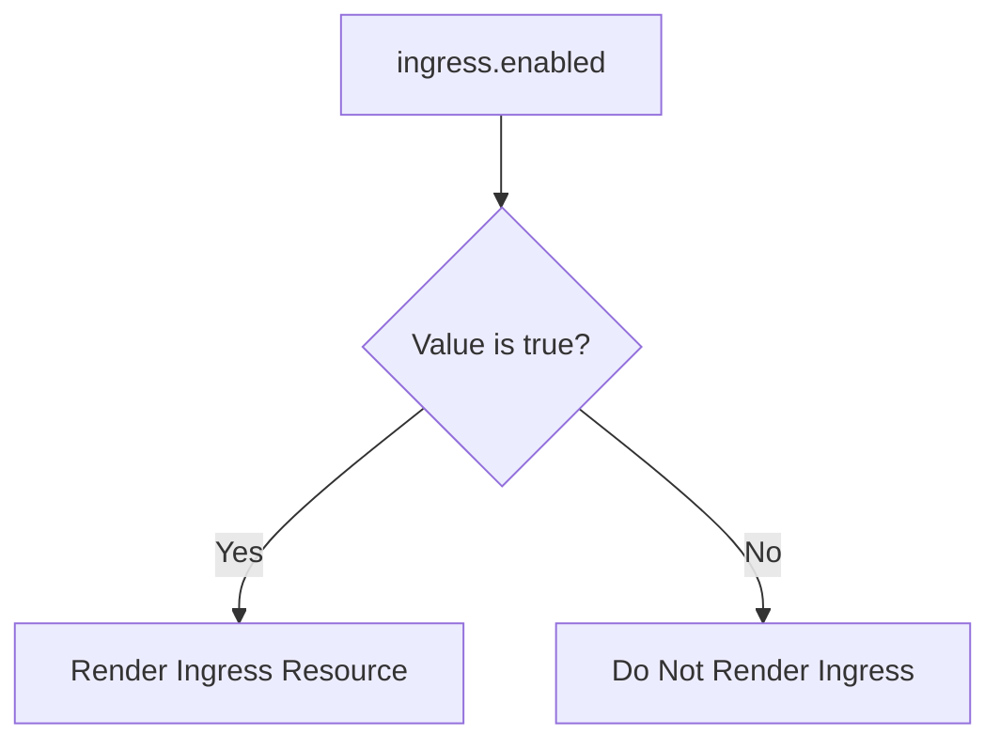

This allows one Chart to support multiple deployment modes.

---

## 22. Loops and Reusable Configuration

Helm can iterate over values.

Example:

```yaml
ports:
  - name: http
    port: 80
  - name: metrics
    port: 9090
```

Template:

```gotemplate
ports:
{{- range .Values.ports }}
  - name: {{ .name }}
    port: {{ .port }}
{{- end }}
```

This is useful for:

- Multiple ports
- Environment variables
- Volumes
- Ingress paths
- Network rules
- Service accounts

---

## 23. Helm Hooks

Helm hooks allow resources to run at specific points in the release lifecycle.

Examples include:

- Pre-install
- Post-install
- Pre-upgrade
- Post-upgrade
- Pre-rollback
- Post-rollback
- Pre-delete
- Post-delete
- Test

Example:

```yaml
metadata:
  annotations:
    "helm.sh/hook": pre-install,pre-upgrade
```

Possible uses:

- Database migration Jobs
- Validation checks
- Post-deployment notifications
- Cleanup tasks

### Hook Caution

Hooks can introduce complexity and failure modes. Use them carefully and make them:

- Idempotent
- Observable
- Time-bounded
- Safe to retry
- Compatible with rollback procedures

---

## 24. Helm Tests

Helm tests are Kubernetes resources that validate an installed release.

Example:

```yaml
apiVersion: v1
kind: Pod
metadata:
  name: "{{ include "webapp.fullname" . }}-test"
  annotations:
    "helm.sh/hook": test
spec:
  restartPolicy: Never
  containers:
    - name: test
      image: busybox:1.36
      command:
        - wget
        - "{{ include "webapp.fullname" . }}:80"
```

Run tests:

```bash
helm test webapp
```

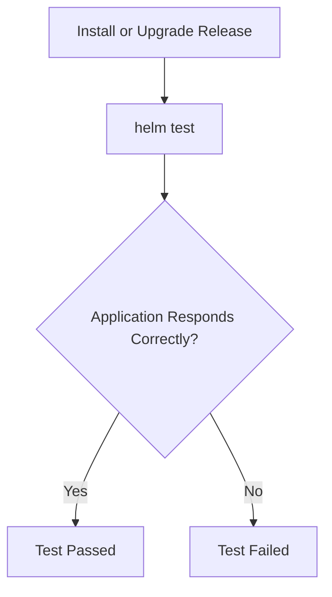

---

## 25. Helm Validation and Debugging

### Lint

```bash
helm lint ./webapp
```

Checks Chart structure and common issues.

### Render Locally

```bash
helm template webapp ./webapp
```

Shows the Kubernetes YAML Helm would generate.

### Debug Rendering

```bash
helm template webapp ./webapp \
  --debug \
  --values values-prod.yaml
```

### Dry Run

```bash
helm upgrade --install webapp ./webapp \
  --dry-run \
  --debug
```

### Validate Against Kubernetes

```bash
kubectl apply --dry-run=server -f rendered.yaml
```

Recommended validation flow:

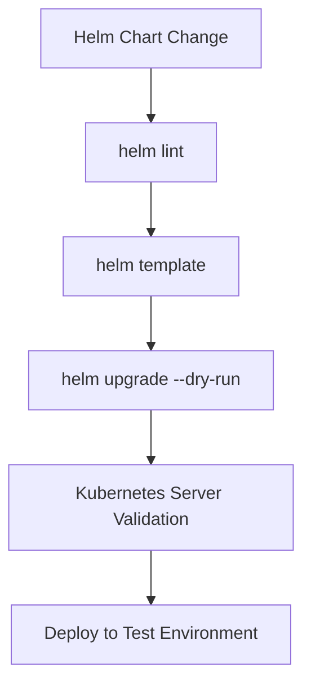

---

## 26. Helm and CI/CD

Helm is commonly used in deployment pipelines.

```mermaid
flowchart LR
    Source["Source Repository"] --> Build["Build and Test Application"]
    Build --> Image["Build Container Image"]
    Image --> Registry["Push Image to Registry"]
    Registry --> Chart["Update Helm Values or Chart"]
    Chart --> Lint["Lint and Render"]
    Lint --> Deploy["helm upgrade --install"]
    Deploy --> Test["Run Helm and Application Tests"]
    Test --> Monitor["Monitor Release"]
```

A CI/CD pipeline should:

1. Build the application
2. Build and scan the image
3. Push the image to a registry
4. Update the image tag
5. Lint the Chart
6. Render templates
7. Validate manifests
8. Deploy to a lower environment
9. Run tests
10. Promote to production
11. Monitor the release
12. Roll back if necessary

---

## 27. Helm in Azure and AKS

A common Azure deployment flow is:

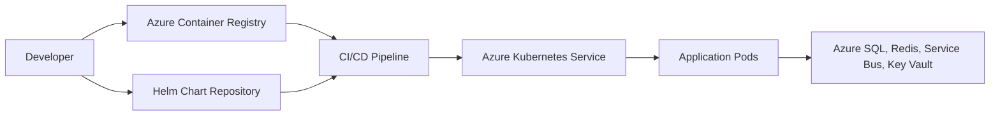

Helm can deploy applications to AKS while Azure provides:

- Azure Container Registry for images
- Azure Kubernetes Service for orchestration
- Azure Key Vault for secrets
- Azure Monitor for observability
- Managed identity or workload identity
- Azure Database services
- Azure networking and ingress

---

## 28. Helm and Secrets

Do not place plain-text production secrets directly in a Chart repository.

Risky example:

```yaml
password: my-production-password
```

Better approaches include:

- Azure Key Vault
- External Secrets Operator
- Workload identity
- Sealed Secrets
- Secret management integrated with the CI/CD platform
- Encrypted values files
- Short-lived credentials

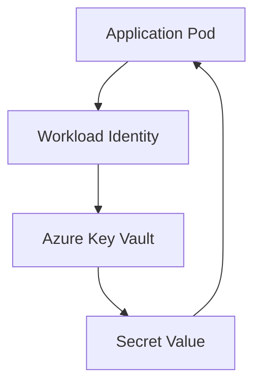

### Important Rules

- Do not commit secrets to Git
- Do not expose secrets in logs
- Do not use `--set` for sensitive values in shared pipeline logs
- Rotate credentials
- Restrict access through RBAC
- Separate secret ownership from application configuration

---

## 29. Helm and Configuration Management

Separate configuration into categories:

### Chart Defaults

Safe, reusable defaults in `values.yaml`.

### Environment Configuration

Environment-specific values files such as:

```text
values-dev.yaml
values-test.yaml
values-prod.yaml
```

### Secrets

Managed through a secure secret-management system.

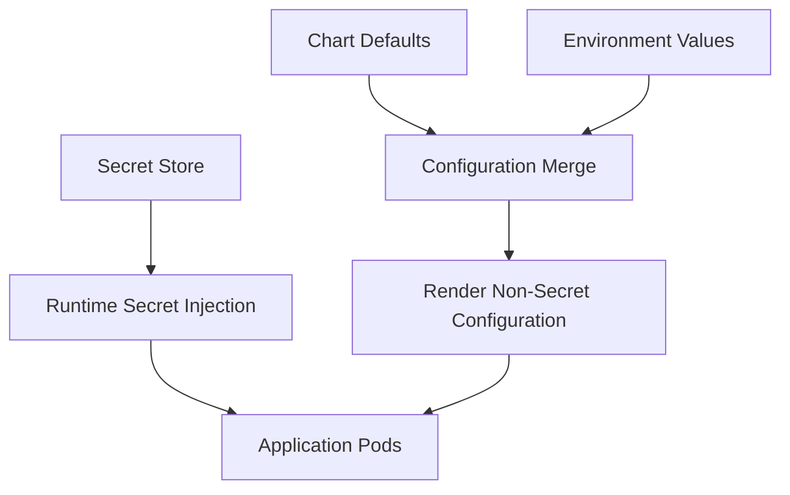

---

## 30. Helm Upgrade Strategies

Helm controls Kubernetes resources, but the actual rollout strategy is commonly defined in Kubernetes resources such as Deployments.

### Rolling Update

Gradually replaces old Pods.

### Blue-Green

Uses separate versions and switches traffic.

### Canary

Routes a small percentage of traffic to the new version before full rollout.

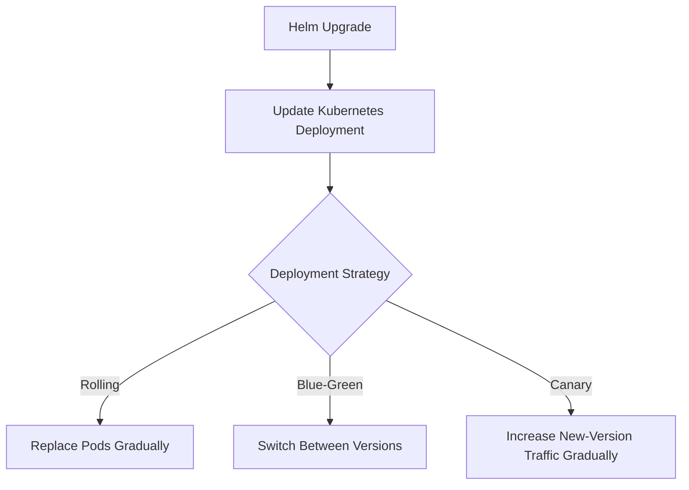

---

## 31. Helm Rollback Limitations

Helm rollback is powerful, but it is not a complete disaster-recovery system.

Rollback may not automatically undo:

- Database schema changes
- External infrastructure changes
- Data migrations
- Irreversible business operations
- External API side effects
- Manually changed resources
- Changes outside the Chart

Therefore:

- Use backward-compatible database migrations
- Separate schema expansion and cleanup
- Make migrations observable
- Test rollback procedures
- Maintain application-level recovery plans

---

## 32. Helm Chart Versioning

Use semantic versioning where appropriate.

Example:

```yaml
version: 2.1.0
appVersion: "4.8.0"
```

A version change may indicate:

- New feature
- Bug fix
- Breaking Chart behavior
- New application version
- Changed Kubernetes resources
- Changed dependencies

Keep Chart and application versioning conceptually separate.

---

## 33. Helm Repository and Registry

Charts can be distributed through:

- Helm repositories
- OCI-compatible registries
- Internal artifact repositories
- Cloud container registries
- Chart museums or artifact platforms

A typical distribution flow is:

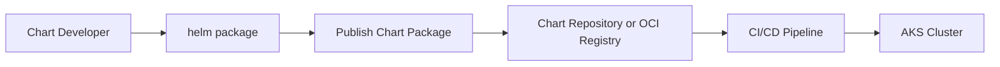

Use access control and artifact scanning for production Chart repositories.

---

## 34. Helm Dependency Design

Use dependencies carefully.

### Good Dependency Practices

- Pin versions
- Review Chart source
- Scan images
- Test dependency upgrades
- Override only supported values
- Avoid unnecessary bundled databases
- Prefer managed Azure data services for production where appropriate

### Dependency Risk

A parent Chart may deploy a subchart with:

- Default passwords
- Insecure settings
- Excessive resources
- Unwanted public exposure
- Unsupported Kubernetes API versions

Always review rendered output.

---

## 35. Common Helm Interview Mistakes

1. Saying Helm is a replacement for Kubernetes
2. Confusing a Chart with a Release
3. Forgetting the role of `values.yaml`
4. Storing plain-text secrets in values files
5. Assuming Helm automatically rolls back database migrations
6. Ignoring template rendering and validation
7. Using `--set` for complex configuration without review
8. Creating very large, tightly coupled Charts
9. Not pinning dependency versions
10. Failing to test `helm upgrade`
11. Treating Helm rollback as a complete disaster-recovery strategy
12. Not monitoring the application after Helm deployment
13. Ignoring controller-specific or Kubernetes-version compatibility
14. Using hooks for complicated, non-idempotent operations

---

## 36. Interview Questions and Strong Answers

### Q1: What is Helm?

**Answer:** Helm is a package manager for Kubernetes. It uses Charts to package templates and configuration for installing, upgrading, and managing applications in Kubernetes.

### Q2: What is a Helm Chart?

**Answer:** A Helm Chart is a collection of files that describes a Kubernetes application. It includes metadata, default values, templates, dependencies, and optional tests or hooks.

### Q3: What is a Helm Release?

**Answer:** A Release is an installed instance of a Chart in a Kubernetes cluster. The same Chart can be installed multiple times using different release names and values.

### Q4: What is the purpose of `values.yaml`?

**Answer:** `values.yaml` contains default configuration values used by Chart templates. These defaults can be overridden with custom values files or `--set`.

### Q5: What is the difference between `version` and `appVersion`?

**Answer:** `version` is the version of the Helm Chart package. `appVersion` identifies the application version being deployed.

### Q6: What is the purpose of the `templates` directory?

**Answer:** It contains parameterized Kubernetes manifest templates. Helm renders these templates using merged values and submits the resulting YAML to Kubernetes.

### Q7: How do you deploy a Helm Chart?

**Answer:**

```bash
helm install my-release ./my-chart
```

For repeatable CI/CD deployments:

```bash
helm upgrade --install my-release ./my-chart
```

### Q8: How do you override values?

**Answer:** Use a values file or `--set`.

```bash
helm upgrade --install webapp ./webapp \
  --values values-prod.yaml \
  --set image.tag=2.0.0
```

### Q9: How do you roll back a release?

**Answer:**

```bash
helm history webapp
helm rollback webapp 2
```

### Q10: Does Helm create Kubernetes resources?

**Answer:** Helm renders templates into Kubernetes manifests and submits them to the Kubernetes API server. Kubernetes then creates and manages the resources.

### Q11: Does Helm replace Kubernetes Deployments?

**Answer:** No. Helm packages and manages Kubernetes resources. Deployments, Services, StatefulSets, and other Kubernetes objects still perform their normal Kubernetes functions.

### Q12: How do you validate a Helm Chart?

**Answer:** Use `helm lint`, `helm template`, dry-run upgrades, server-side Kubernetes validation, and deployment tests.

### Q13: How do you handle secrets in Helm?

**Answer:** Do not store plain-text secrets in Git. Use a secure secret manager such as Azure Key Vault, external secret integration, encrypted configuration, or workload identity.

### Q14: What happens during `helm upgrade`?

**Answer:** Helm merges the supplied values, renders the Chart templates, compares the desired output with the current release, and submits updated Kubernetes resources. Kubernetes then performs the configured rollout.

### Q15: What is a Helm hook?

**Answer:** A Helm hook is a Kubernetes resource annotated to run at a specific point in the Helm lifecycle, such as before install, after upgrade, or during testing.

### Q16: Are Helm rollbacks always safe?

**Answer:** No. Helm can restore Kubernetes resource definitions, but external database migrations and irreversible data changes require separate rollback or compatibility strategies.

---

## 37. 60-Second Interview Pitch

> Helm is the package manager for Kubernetes. A Helm Chart packages Kubernetes resource templates, default values, metadata, and dependencies into a reusable deployment unit. The templates are rendered using values from `values.yaml`, environment-specific files, and command-line overrides. When a Chart is installed, Helm creates a Release, which is a named instance of that Chart in a Kubernetes namespace. Helm supports repeatable installs, upgrades, version history, and rollbacks. In a production pipeline, I use `helm lint`, `helm template`, dry-run validation, image scanning, secure secret management, and `helm upgrade --install`. I also design database migrations separately because Helm rollback does not automatically undo external data changes.

---

## 38. Final Revision Checklist

- [ ] Helm is a Kubernetes package manager
- [ ] A Chart is a reusable Kubernetes application package
- [ ] A Release is an installed Chart instance
- [ ] `Chart.yaml` stores Chart metadata
- [ ] `values.yaml` stores default configuration
- [ ] `templates/` contains parameterized Kubernetes manifests
- [ ] `charts/` contains dependencies
- [ ] `_helpers.tpl` stores reusable named templates
- [ ] `NOTES.txt` provides post-install instructions
- [ ] Values can be overridden with files or `--set`
- [ ] More specific values override defaults
- [ ] `helm install` creates a release
- [ ] `helm upgrade` changes a release
- [ ] `helm rollback` restores an earlier revision
- [ ] `helm upgrade --install` supports idempotent deployments
- [ ] `helm lint` validates Chart structure
- [ ] `helm template` previews rendered YAML
- [ ] Helm hooks run at lifecycle points
- [ ] Helm tests validate installed releases
- [ ] Secrets should not be stored in plain text
- [ ] Dependencies should be version-pinned and reviewed
- [ ] Helm does not replace Kubernetes
- [ ] Helm rollback does not automatically undo database changes
- [ ] Helm can be integrated with AKS and CI/CD pipelines

---

## One-Line Conclusion

> Helm Charts are reusable, parameterized Kubernetes application packages that simplify deployment, configuration, versioning, upgrades, dependency management, and rollback across environments.