# What Is ACR and Why Is It Used?
## Azure Container Registry Interview Preparation Guide

---

## 1. Direct Interview Answer

**ACR stands for Azure Container Registry.**

It is a private, managed container registry in Azure used to:

- Store container images
- Store image versions and tags
- Store Helm Charts and OCI artifacts
- Securely distribute images to AKS and other Azure services
- Integrate container storage with CI/CD pipelines
- Support image automation, replication, and access control

A typical deployment flow is:

```text
Developer commits code
        ↓
CI/CD builds and tests the application
        ↓
Container image is created
        ↓
Image is pushed to ACR
        ↓
AKS pulls the image from ACR
        ↓
Kubernetes deploys the application
```

> **One-line interview answer:**  
> **Azure Container Registry is a private Azure service for securely storing, managing, scanning, and distributing container images and related artifacts to platforms such as AKS.**

---

## 2. Why Do We Need a Container Registry?

A container image contains:

- Application code
- Runtime dependencies
- Operating-system libraries
- Configuration defaults
- Startup commands

After building an image, it needs to be stored somewhere from which deployment platforms can pull it.

Without a registry, teams might:

- Copy images manually between servers
- Store images on developer machines
- Use publicly accessible registries unnecessarily
- Lose version history
- Make deployments difficult to reproduce
- Lack access-control and audit capabilities

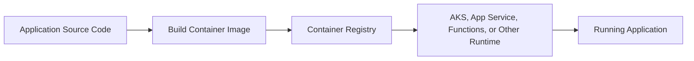

A registry acts as the central source of truth for deployable container artifacts.

---

## 3. ACR High-Level Architecture

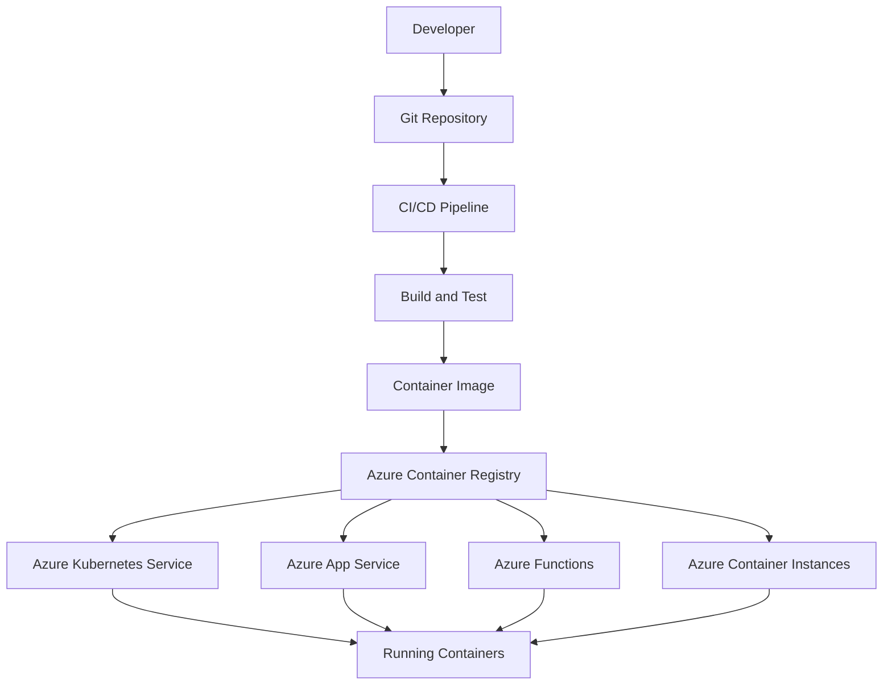

ACR can be used as a private image source for Azure services and Kubernetes environments.

---

## 4. ACR Core Concepts

## 4.1 Registry

A registry is the Azure resource that stores repositories and artifacts.

Example login server:

```text
myregistry.azurecr.io
```

---

## 4.2 Repository

A repository logically groups related images.

Examples:

```text
myregistry.azurecr.io/orders-api
myregistry.azurecr.io/frontend
myregistry.azurecr.io/payment-worker
```

---

## 4.3 Image

An image is a packaged application artifact.

Example:

```text
myregistry.azurecr.io/orders-api:1.4.0
```

---

## 4.4 Tag

A tag identifies a particular image version.

Examples:

```text
:1.4.0
:v2
:release-2026-09-30
:sha-abc123
```

For production deployments, immutable tags or image digests are safer than relying only on mutable tags such as `latest`.

---

## 4.5 Digest

A digest is a content-based identifier for an image.

Example:

```text
myregistry.azurecr.io/orders-api@sha256:<digest>
```

A digest ensures that the deployment references the exact image content that was tested.

---

## 4.6 Artifacts

ACR can store more than Docker images, including:

- OCI container images
- Helm Charts
- OCI artifacts
- Related container content

---

## 5. ACR and AKS End-to-End Flow

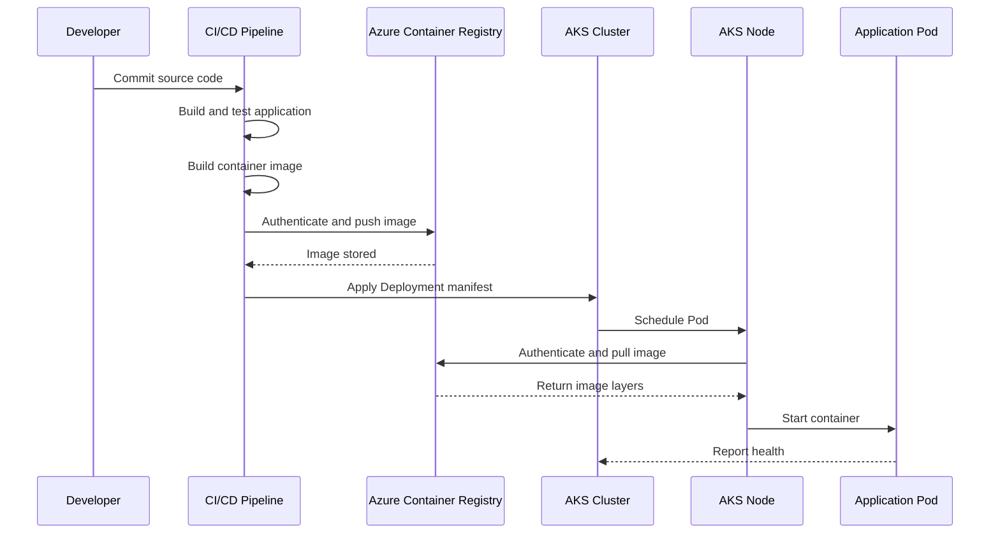

---

## 6. Why Use ACR with AKS?

ACR is commonly paired with AKS because it provides:

### Private Image Storage

Images are stored in an Azure-managed private registry instead of being exposed publicly.

### Azure Integration

ACR integrates with:

- AKS
- Azure DevOps
- GitHub Actions
- Azure Container Instances
- App Service
- Microsoft Entra ID
- Azure RBAC
- Azure Monitor

### Secure Authentication

AKS can use its managed identity or kubelet identity to pull images from ACR, avoiding hardcoded registry passwords in Kubernetes manifests.

### Version Management

Images can be tagged with:

- Build number
- Git commit
- Release number
- Environment
- Semantic version

### Network and Regional Features

ACR supports features such as:

- Private Link
- Network restrictions
- Geo-replication
- Regional distribution
- Image retention and cleanup strategies

---

## 7. ACR Authentication Flow

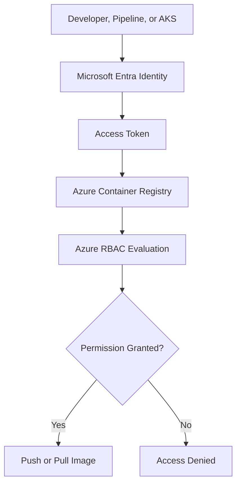

Authentication confirms **who** is requesting access.

Authorization determines **what** that identity is allowed to do.

---

## 8. Common ACR Authentication Methods

## 8.1 Microsoft Entra User Identity

Used for interactive developer access.

Example:

```bash
az login
az acr login --name myregistry
```

This is useful when a developer needs to push or pull images manually.

---

## 8.2 Managed Identity

Used for Azure services such as AKS.

A managed identity avoids storing credentials in code or pipeline configuration.

Typical flow:

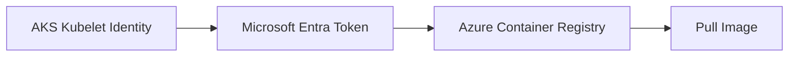

---

## 8.3 Service Principal

Used for unattended access, such as:

- CI/CD pipelines
- External Kubernetes clusters
- Automated deployment scripts
- Cross-tenant scenarios

Service principals should receive only the permissions they need.

---

## 8.4 Admin Account

ACR can provide an administrator account, but this should generally not be the first choice for production workloads.

Risks include:

- Shared credentials
- Broad access
- Credential rotation overhead
- Secret leakage
- Difficult audit attribution

Prefer Microsoft Entra ID, managed identity, or scoped service principals.

---

## 9. ACR Roles

Use least-privilege access.

Typical access patterns include:

| Scenario | Typical Permission |
|---|---|
| AKS pulls images | Pull or repository-reader permission |
| CI/CD pushes images | Push permission |
| Developer pulls images | Pull permission |
| Image administration | Registry administration permission |
| Repository-specific access | Repository-scoped role where supported |

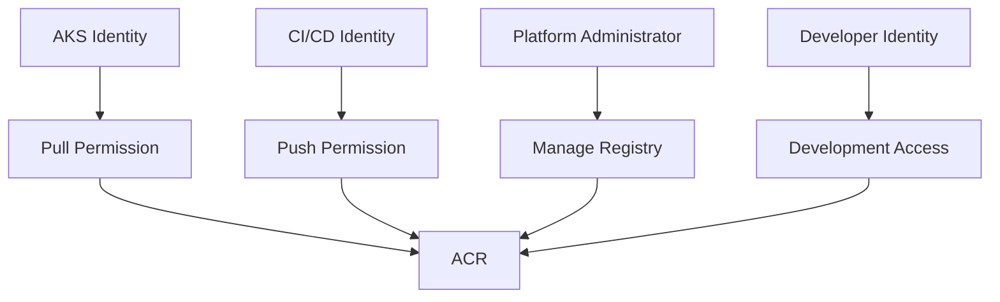

> **Interview point:**  
> The AKS runtime usually needs pull access, while the CI/CD identity needs push access. These should be separate identities where practical.

---

## 10. Building and Pushing an Image to ACR

### Build an Image

```bash
docker build -t orders-api:1.0.0 .
```

### Log in to ACR

```bash
az acr login --name myregistry
```

### Tag the Image

```bash
docker tag orders-api:1.0.0 \
  myregistry.azurecr.io/orders-api:1.0.0
```

### Push the Image

```bash
docker push \
  myregistry.azurecr.io/orders-api:1.0.0
```

### List Repositories

```bash
az acr repository list \
  --name myregistry \
  --output table
```

### List Tags

```bash
az acr repository show-tags \
  --name myregistry \
  --repository orders-api \
  --output table
```

---

## 11. ACR Image Lifecycle

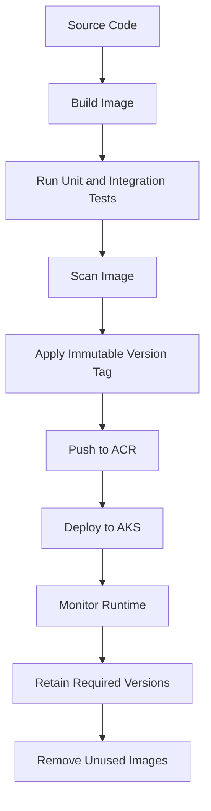

A mature image lifecycle includes:

- Build
- Test
- Scan
- Sign where required
- Push
- Deploy
- Monitor
- Retain
- Clean up

---

## 12. ACR and CI/CD Pipeline

```mermaid
flowchart LR
    Commit["Git Commit"] --> CI["CI Pipeline"]
    CI --> UnitTests["Unit Tests"]
    UnitTests --> Build["Build Image"]
    Build --> Scan["Security Scan"]
    Scan --> Push["Push to ACR"]
    Push --> DeployDev["Deploy to Development"]
    DeployDev --> Test["Integration Tests"]
    Test --> Approval["Promotion Approval"]
    Approval --> DeployProd["Deploy to Production"]
    DeployProd --> Monitor["Monitor Release"]
```

A typical pipeline should:

1. Check out source code
2. Run unit tests
3. Build a container image
4. Scan the image
5. Tag it using a commit or release identifier
6. Push it to ACR
7. Deploy it to a test environment
8. Run integration tests
9. Promote the same immutable image
10. Deploy to production
11. Monitor the deployment

> **Important:** Build once and promote the same image across environments. Avoid rebuilding a different image for production.

---

## 13. ACR Tasks

ACR Tasks can build and maintain images in Azure.

They can support:

- On-demand image builds
- Builds triggered by source-code changes
- Builds triggered by base-image updates
- Scheduled image tasks
- Multi-step container workflows
- Image maintenance operations

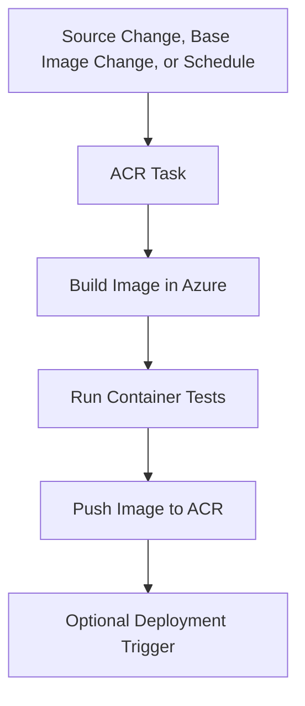

This can reduce the need for a separate build agent for some container build scenarios.

---

## 14. Image Tagging Strategy

Recommended tags include:

```text
orders-api:1.4.0
orders-api:build-1842
orders-api:git-a1b2c3d
orders-api:release-2026-09-30
```

Avoid using only:

```text
orders-api:latest
```

### Why Avoid Only `latest`?

- It is mutable
- Rollbacks become ambiguous
- The running image may differ from the tested image
- Auditing becomes more difficult
- Kubernetes may not pull a new image if the tag does not change

A strong production pattern is:

```text
repository:git-commit-sha
```

or:

```text
repository@sha256:digest
```

---

## 15. ACR Image Pull from AKS

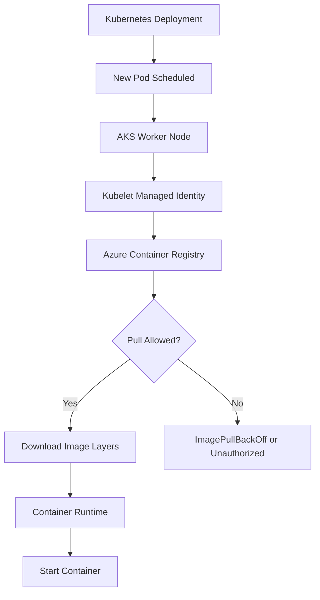

The image is generally pulled by the Node's container runtime, using the configured AKS identity or another configured authentication method.

---

## 16. Attaching ACR to AKS

A common same-tenant Azure setup grants the AKS identity permission to pull from ACR.

Conceptual Azure CLI:

```bash
az aks update \
  --resource-group myResourceGroup \
  --name myAKSCluster \
  --attach-acr myregistry
```

This configures the relationship so the AKS identity can pull images from the registry.

For cross-tenant or non-AKS Kubernetes scenarios, other authentication mechanisms such as service principals or image pull secrets may be required.

---

## 17. Kubernetes Deployment Using an ACR Image

```yaml
apiVersion: apps/v1
kind: Deployment
metadata:
  name: orders-api
  namespace: production
spec:
  replicas: 3
  selector:
    matchLabels:
      app: orders-api
  template:
    metadata:
      labels:
        app: orders-api
    spec:
      containers:
        - name: orders-api
          image: myregistry.azurecr.io/orders-api:git-a1b2c3d
          ports:
            - containerPort: 8080
          readinessProbe:
            httpGet:
              path: /health/ready
              port: 8080
          livenessProbe:
            httpGet:
              path: /health/live
              port: 8080
```

The Pod references the fully qualified image name:

```text
<registry-name>.azurecr.io/<repository>:<tag>
```

---

## 18. ACR Network Security

For production environments, protect registry access using:

- Private endpoints
- Virtual network integration
- Firewall rules
- Restricted public network access
- Managed identity
- RBAC
- Diagnostic logging
- Network monitoring

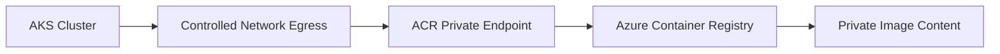

A private networking design should also address:

- Private DNS resolution
- AKS subnet routing
- Firewall rules
- Required registry endpoints
- CI/CD connectivity
- Developer access paths

---

## 19. ACR Geo-Replication

Geo-replication creates registry replicas in selected Azure regions.

Benefits include:

- Lower image-pull latency
- Better regional availability
- Local image access for multi-region deployments
- Centralized registry management
- Improved resilience for regional deployments

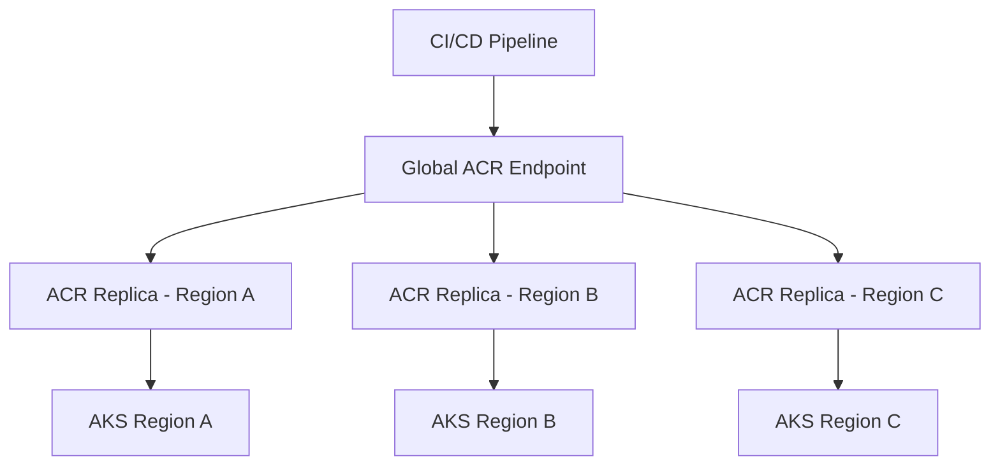

Geo-replication is useful when deploying the same application to multiple Azure regions.

> **Important:** Registry replication can be eventually consistent. Deployment pipelines should account for propagation timing when promoting a newly pushed image to another replica.

---

## 20. ACR Security and Governance

Important controls include:

- Microsoft Entra authentication
- Azure RBAC
- Repository-scoped permissions
- Managed identities
- Private networking
- Image scanning
- Content trust or signing where required
- Tag policies
- Retention policies
- Diagnostic logs
- Defender-related container security capabilities
- Separation of push and pull identities

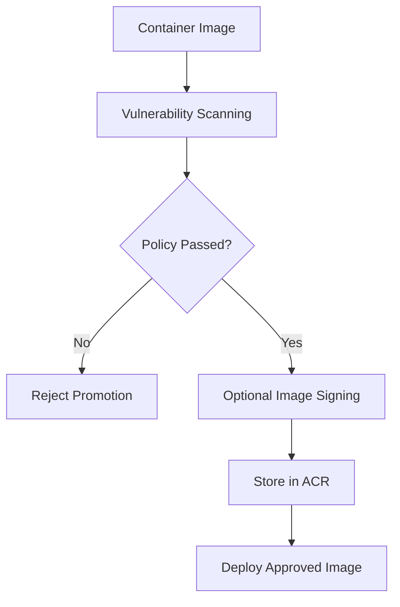

---

## 21. Image Scanning

Image scanning identifies vulnerabilities in:

- Base operating-system packages
- Application dependencies
- Runtime libraries
- Known security advisories
- Misconfigured image content

Recommended pipeline behavior:

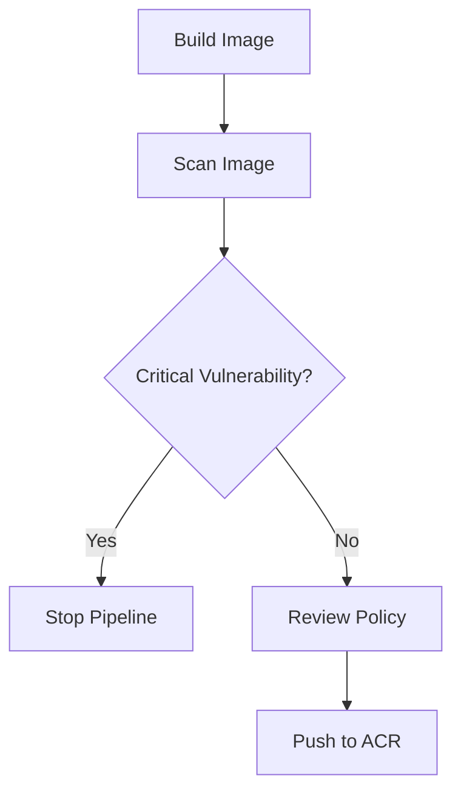

Scanning is not a replacement for:

- Secure coding
- Dependency management
- Runtime security
- Least-privilege configuration
- Network controls
- Patch management

---

## 22. ACR and Helm Charts

ACR can also store Helm Charts as OCI artifacts.


Example conceptual commands:

```bash
helm package ./orders-api-chart

helm push orders-api-chart-1.0.0.tgz \
  oci://myregistry.azurecr.io/helm
```

This allows application images and deployment packages to be managed within a related Azure registry platform.

---

## 23. ACR Cleanup and Retention

Over time, registries can accumulate:

- Old image tags
- Failed build images
- Unreferenced layers
- Temporary test images
- Deprecated releases

Use a retention strategy:

- Keep production versions
- Keep recent rollback versions
- Delete obsolete development tags
- Remove untagged manifests
- Schedule cleanup jobs
- Protect tags currently in use

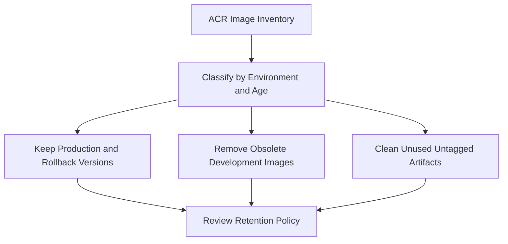

---

## 24. Common ACR Errors

### `ImagePullBackOff`

Possible causes:

- Image does not exist
- Incorrect repository name
- Incorrect tag
- AKS identity lacks pull access
- Network or DNS issue
- Registry is unavailable

### `Unauthorized`

Possible causes:

- Missing RBAC assignment
- Incorrect service principal
- Expired credential
- Wrong tenant
- Incorrect image pull secret

### `Manifest Unknown`

Possible causes:

- Tag does not exist
- Wrong image path
- Image pushed to another repository
- Case mismatch in repository name

### `DNS or Timeout Failure`

Possible causes:

- Private endpoint DNS problem
- Firewall rule
- Restricted egress
- Incorrect VNet configuration
- Registry endpoint unavailable

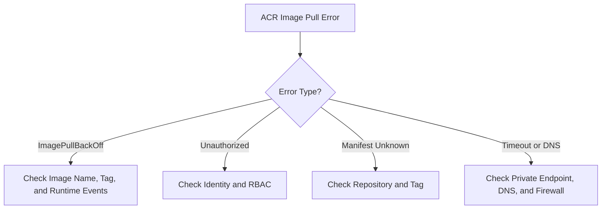

---

## 25. Troubleshooting Commands

### Check Pod Status

```bash
kubectl get pods -n production
```

### Describe the Pod

```bash
kubectl describe pod <pod-name> -n production
```

### Check Events

```bash
kubectl get events \
  --namespace production \
  --sort-by=.lastTimestamp
```

### Check Image Configuration

```bash
kubectl get deployment orders-api \
  -n production \
  -o jsonpath='{.spec.template.spec.containers[*].image}'
```

### Check AKS Identity and ACR Attachment

```bash
az aks show \
  --resource-group myResourceGroup \
  --name myAKSCluster
```

### Check ACR Repositories

```bash
az acr repository list \
  --name myregistry \
  --output table
```

### Check Tags

```bash
az acr repository show-tags \
  --name myregistry \
  --repository orders-api \
  --output table
```

---

## 26. ACR vs Docker Hub

| Feature | ACR | Docker Hub |
|---|---|---|
| Azure-native integration | Strong | External |
| Private registry | Yes | Available depending on plan |
| Azure RBAC | Yes | Uses Docker Hub access model |
| Managed identity integration | Yes | Usually requires credentials or tokens |
| Private networking | Supports Azure networking features | Different networking model |
| AKS integration | Direct Azure integration | Requires registry credentials/configuration |
| Geo-replication | Available in appropriate tier | Depends on Docker Hub features |
| Best use case | Azure enterprise workloads | Public and cross-cloud image distribution |

> **Interview answer:**  
> I prefer ACR for Azure-hosted workloads because it integrates with AKS, Microsoft Entra ID, managed identities, Azure RBAC, private networking, and Azure governance.

---

## 27. ACR vs Azure Container Registry Tasks

These are related but different:

| Feature | ACR | ACR Tasks |
|---|---|---|
| Main purpose | Store and distribute artifacts | Build and automate image workflows |
| Stores images | Yes | Uses ACR for output |
| Builds images | Not necessarily | Yes |
| Triggered builds | No by itself | Yes |
| Vulnerability workflow | Integrates with security tools | Can be included in pipeline |
| Deployment role | Image source | Build and maintenance automation |

---

## 28. Production ACR Architecture

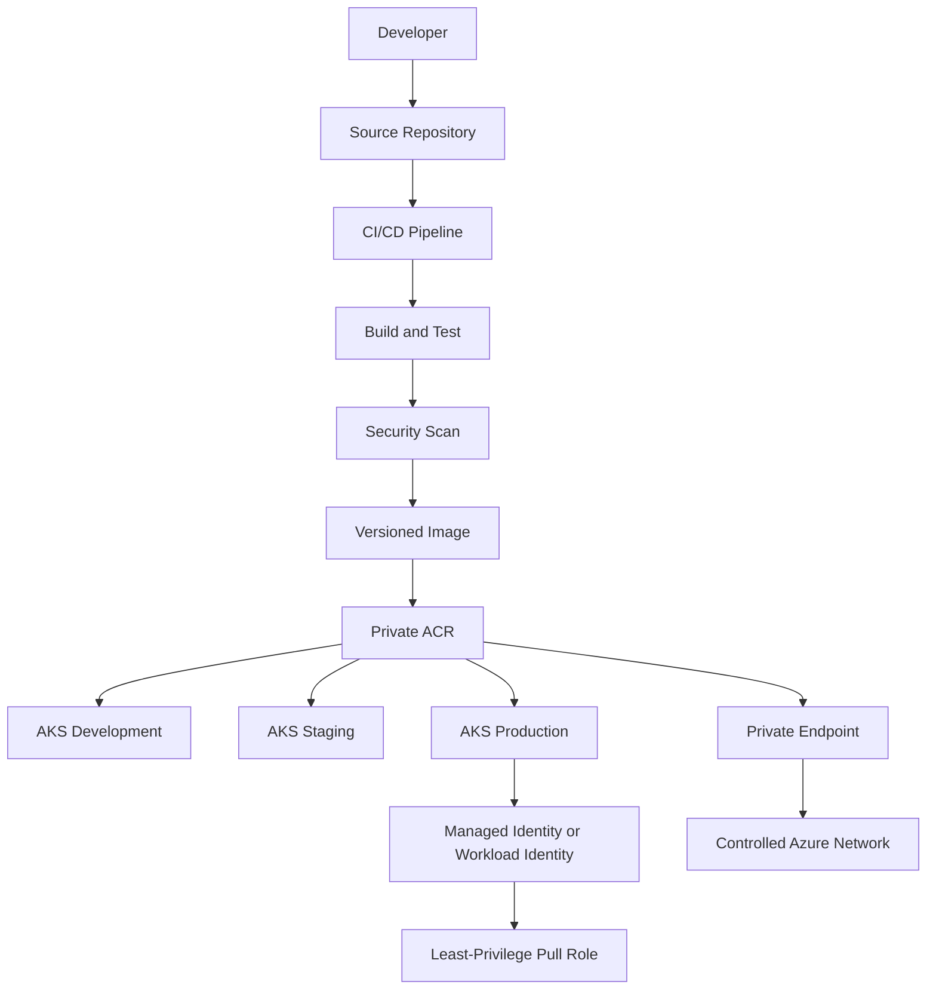

---

## 29. Recommended ACR Design

For a production Azure platform:

1. Use a private ACR
2. Use Microsoft Entra ID and managed identities
3. Separate CI/CD push permissions from runtime pull permissions
4. Use immutable image tags or digests
5. Scan images before promotion
6. Store images near deployment regions
7. Use geo-replication for multi-region systems
8. Restrict registry network access where required
9. Enable diagnostic logging
10. Apply retention and cleanup policies
11. Promote the same image across environments
12. Monitor image pull failures and registry health

---

## 30. Interview Scenario

### Scenario

A team deploys a Node.js API to AKS.

Requirements:

- Private container images
- Automated CI/CD
- Separate dev, test, and production environments
- No passwords in Kubernetes manifests
- Image vulnerability scanning
- Multi-region production

### Recommended Design

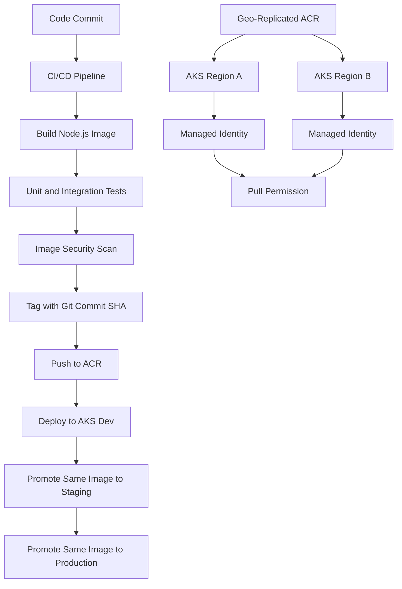

### Why This Design?

- ACR provides private image storage
- CI/CD pushes images using a dedicated identity
- AKS pulls images using managed identity
- Image tags identify exact builds
- The same tested image is promoted
- Geo-replication improves multi-region distribution
- RBAC avoids broad shared credentials

---

## 31. Common Interview Mistakes

1. Saying ACR is only a Docker image store
2. Confusing a registry, repository, image, and tag
3. Using `latest` as the only production version identifier
4. Storing ACR passwords in Kubernetes manifests
5. Giving AKS push permissions when it only needs pull access
6. Ignoring image vulnerability scanning
7. Forgetting private endpoint DNS
8. Rebuilding images independently for each environment
9. Assuming geo-replication is instantly consistent
10. Ignoring registry cleanup and storage costs
11. Using the ACR admin account everywhere
12. Forgetting the difference between image build and image storage
13. Not monitoring `ImagePullBackOff`
14. Ignoring cross-tenant authentication requirements

---

## 32. Interview Questions and Strong Answers

### Q1: What is ACR?

**Answer:** ACR stands for Azure Container Registry. It is a private managed Azure service for storing, managing, and distributing container images and OCI artifacts.

### Q2: Why is ACR used with AKS?

**Answer:** ACR provides a secure private image source for AKS. CI/CD pipelines push images to ACR, and AKS pulls them during Pod deployment using managed identity or another configured authentication mechanism.

### Q3: What is the difference between an image and a repository?

**Answer:** A repository is a logical collection of related images. An image is a specific version of an application package within that repository.

### Q4: How does AKS authenticate to ACR?

**Answer:** In a common same-tenant setup, AKS uses its managed identity or kubelet identity with an appropriate ACR pull role. Other scenarios may use service principals or image pull secrets.

### Q5: Should AKS have push access to ACR?

**Answer:** Usually no. AKS normally needs only pull access. The CI/CD identity should push images, while the runtime identity should pull them.

### Q6: Why should you avoid the `latest` tag?

**Answer:** `latest` is mutable and makes deployments and rollbacks ambiguous. Immutable build tags or image digests provide reproducibility.

### Q7: How do you secure ACR?

**Answer:** Use Microsoft Entra authentication, managed identity, least-privilege RBAC, private endpoints, network restrictions, image scanning, logging, and controlled retention policies.

### Q8: What is ACR Tasks?

**Answer:** ACR Tasks are Azure Container Registry features for cloud-based image builds and automated tasks triggered by source changes, base-image updates, schedules, or manual execution.

### Q9: How do you use ACR in a multi-region architecture?

**Answer:** Enable geo-replication so image content is available closer to regional AKS clusters. Account for replication timing and use appropriate regional or global endpoints.

### Q10: What causes `ImagePullBackOff` when using ACR?

**Answer:** Common causes include an incorrect image name or tag, missing pull permission, registry network problems, DNS issues, expired credentials, or an unavailable image.

### Q11: Can ACR store Helm Charts?

**Answer:** Yes. ACR can store Helm Charts and other OCI artifacts, allowing application images and deployment packages to be managed through a related registry platform.

### Q12: How do you promote an image across environments?

**Answer:** Build and scan the image once, push it with an immutable identifier, and promote that same image to development, staging, and production rather than rebuilding it for each environment.

---

## 33. 60-Second Interview Pitch

> ACR, or Azure Container Registry, is Azure's private managed registry for storing and distributing container images and OCI artifacts. In a typical AKS deployment, the CI/CD pipeline builds and scans an image, tags it with a commit or release identifier, and pushes it to ACR. The AKS cluster then uses its managed identity or kubelet identity with least-privilege pull access to download the image and start the Pod. I avoid hardcoded registry credentials and mutable `latest` tags, secure the registry with Entra ID, RBAC, private networking, and diagnostic logging, and use geo-replication for multi-region deployments. This provides a secure, auditable, and reproducible path from source code to running containers.

---

## 34. Final Revision Checklist

- [ ] ACR means Azure Container Registry
- [ ] ACR stores container images and OCI artifacts
- [ ] ACR can store Helm Charts
- [ ] ACR provides private image storage
- [ ] Repositories group related images
- [ ] Tags identify image versions
- [ ] Digests identify exact image content
- [ ] CI/CD usually pushes images
- [ ] AKS usually pulls images
- [ ] AKS should normally receive pull-only permissions
- [ ] Managed identity is preferred for Azure-integrated access
- [ ] Service principals support unattended scenarios
- [ ] Avoid relying only on `latest`
- [ ] Use immutable tags or digests
- [ ] Scan images before deployment
- [ ] Use private endpoints when required
- [ ] Configure private DNS correctly
- [ ] Geo-replication helps multi-region deployments
- [ ] Replication may be eventually consistent
- [ ] ACR Tasks automate image builds and maintenance
- [ ] Retention policies prevent registry growth
- [ ] Monitor `ImagePullBackOff` and registry failures
- [ ] Promote the same tested image across environments

---

## One-Line Conclusion

> ACR is Azure's private container registry used to securely store, version, scan, and distribute container images and Helm artifacts to AKS and other deployment platforms.