# What Is AKS?
## Azure Kubernetes Service Interview Preparation Guide

---

## 1. Direct Interview Answer

**AKS, or Azure Kubernetes Service, is Microsoft's managed Kubernetes service for deploying, scaling, and operating containerized applications on Azure.**

Kubernetes manages containerized workloads using concepts such as:

- Pods
- Deployments
- Services
- Ingress
- Namespaces
- ConfigMaps
- Secrets
- Persistent volumes
- Node pools

With AKS, Azure manages the Kubernetes control plane, while the platform or application team manages workload configuration, applications, node pools, networking, scaling, security policies, and operations according to the selected cluster mode. ([learn.microsoft.com](https://learn.microsoft.com/en-us/azure/aks/core-aks-concepts?utm_source=openai))

> **One-line interview answer:**  
> **AKS is a managed Kubernetes platform on Azure that simplifies the deployment, scaling, networking, and operation of containerized applications.**

---

## 2. What Problem Does AKS Solve?

Running Kubernetes manually requires teams to manage:

- Kubernetes control-plane components
- Cluster upgrades
- High availability
- Node lifecycle
- Networking
- Scheduling
- Scaling
- Security
- Monitoring
- Application deployment

AKS reduces much of this operational burden by providing a managed Kubernetes control plane and integrating Kubernetes with Azure services.

AKS is useful when an organization needs:

- Container orchestration
- Microservices deployment
- Horizontal scaling
- Rolling deployments
- Self-healing workloads
- Service discovery
- Advanced networking
- Multi-team workload isolation
- Kubernetes portability and ecosystem support

---

## 3. What Is Kubernetes?

Kubernetes is an open-source platform used to automate the deployment, scaling, and management of containerized applications.

Kubernetes continuously compares:

- **Desired state:** What you declared in manifests
- **Actual state:** What is currently running

If the actual state differs from the desired state, Kubernetes attempts to correct it.

For example:

- If a pod crashes, Kubernetes can recreate it.
- If a deployment requires five replicas but only four are running, Kubernetes creates another pod.
- If a node fails, Kubernetes can reschedule workloads onto healthy nodes, assuming sufficient capacity exists.

---

## 4. AKS High-Level Architecture

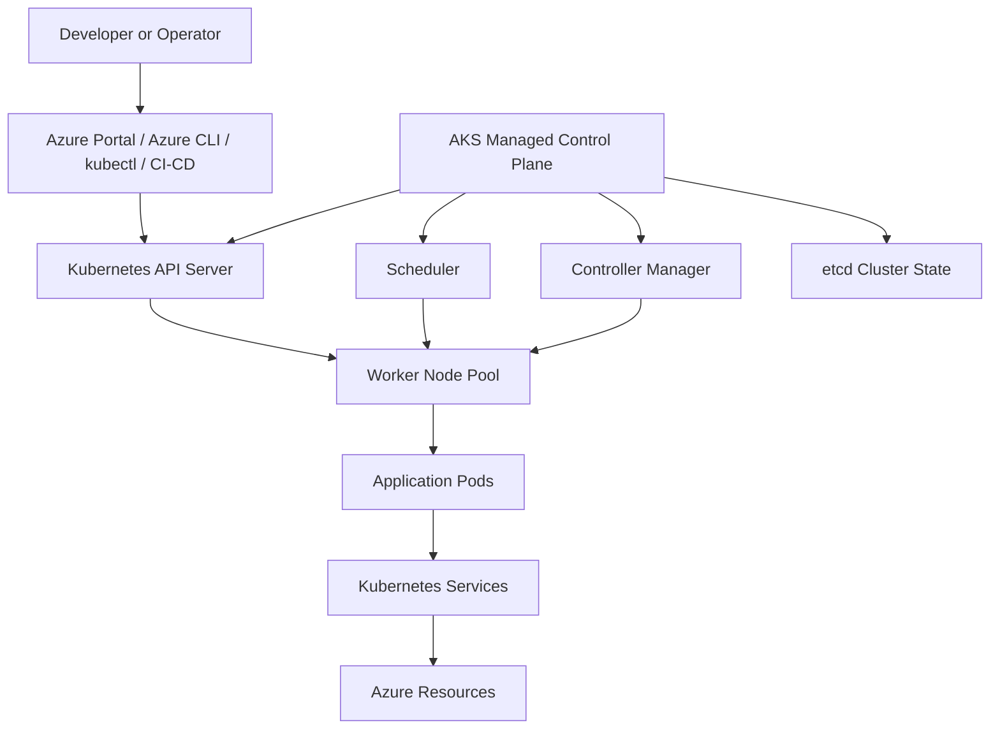

An AKS cluster has two major conceptual parts:

1. **Control plane**
2. **Worker nodes**

Azure operates the managed control-plane components. Worker nodes are Azure virtual machines that run Kubernetes node components and application workloads. ([learn.microsoft.com](https://learn.microsoft.com/en-us/azure/aks/core-aks-concepts?utm_source=openai))

---

## 5. AKS Control Plane

The control plane manages the Kubernetes cluster.

### 5.1 Kubernetes API Server

The API server is the main interface to the cluster.

Tools such as these communicate with the API server:

- `kubectl`
- Azure CLI
- Azure Portal
- CI/CD pipelines
- Kubernetes operators
- Infrastructure automation tools

Example:

```bash
kubectl get pods
```

The command is sent to the Kubernetes API server, which returns the current state of the requested resources.

---

### 5.2 Scheduler

The scheduler decides which worker node should run a new pod.

It considers:

- CPU and memory availability
- Node selectors
- Taints and tolerations
- Affinity rules
- Availability requirements
- Resource requests and limits
- Data locality
- Policy constraints

---

### 5.3 Controller Manager

Controllers continuously observe cluster state and attempt to make the actual state match the desired state.

Examples:

- Deployment controller
- ReplicaSet controller
- Node controller
- Job controller
- Endpoint controller

---

### 5.4 etcd

`etcd` stores Kubernetes cluster state and configuration.

It can contain information about:

- Deployments
- Pods
- Services
- Secrets
- ConfigMaps
- Nodes
- Policies
- Namespaces

The control plane depends on this state to manage the cluster.

> Interview point:  
> **The control plane is responsible for orchestration and desired-state management; worker nodes execute application workloads.**

---

## 6. Worker Nodes

Worker nodes are Azure virtual machines that run:

- Kubernetes node components
- Container runtime
- Application pods
- Networking components
- Storage integrations

Important node components include:

### Kubelet

The kubelet runs on each node and ensures that containers specified by Kubernetes are running correctly.

### Container Runtime

The container runtime downloads images and starts or stops containers.

### Network Component

The networking component enables communication between:

- Pods
- Services
- Nodes
- External clients
- Azure services

AKS nodes use components such as `kube-proxy` or Cilium depending on the selected networking configuration. ([learn.microsoft.com](https://learn.microsoft.com/en-us/azure/aks/core-aks-concepts?utm_source=openai))

---

## 7. AKS Cluster Modes

AKS currently provides two main cluster modes:

1. **AKS Automatic**
2. **AKS Standard**

### 7.1 AKS Automatic

AKS Automatic provides a more managed and opinionated production experience.

It is designed to reduce operational overhead through:

- Production-oriented defaults
- Managed scaling behavior
- Security guardrails
- Managed node operations
- Preconfigured operational settings
- Reduced day-two cluster management

Microsoft recommends evaluating AKS Automatic as the default choice for many new production workloads unless specialized customization is required. ([learn.microsoft.com](https://learn.microsoft.com/en-us/azure/aks/get-started-aks?utm_source=openai))

### 7.2 AKS Standard

AKS Standard provides deeper control over cluster configuration and operations.

Choose it when you require:

- Advanced networking customization
- Custom node-pool design
- Windows node pools
- Specialized identity requirements
- Custom upgrade behavior
- Detailed platform-level control
- Long-term support options or specialized lifecycle requirements

> Interview answer:  
> **Choose AKS Automatic when reducing operational effort is the priority. Choose AKS Standard when the platform team needs deeper control and customization.**

---

## 8. AKS Application Deployment Flow

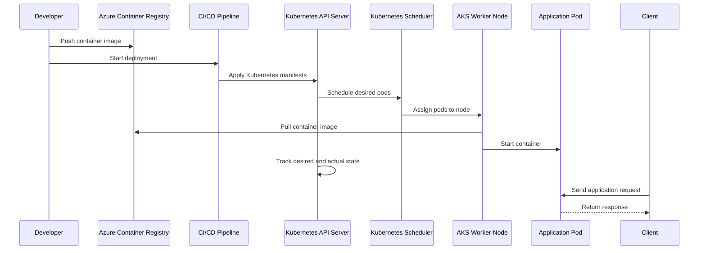

---

## 9. Typical AKS Deployment Process

### Step 1: Build the Application

The application is packaged into a container image.

Example:

```dockerfile
FROM nginx:alpine
COPY ./website /usr/share/nginx/html
```

### Step 2: Build and Push the Image

The image is pushed to a container registry such as Azure Container Registry.

```bash
docker build -t myapp:v1 .
docker push myregistry.azurecr.io/myapp:v1
```

### Step 3: Define Kubernetes Resources

A deployment manifest declares the desired application state.

```yaml
apiVersion: apps/v1
kind: Deployment
metadata:
  name: myapp
spec:
  replicas: 3
  selector:
    matchLabels:
      app: myapp
  template:
    metadata:
      labels:
        app: myapp
    spec:
      containers:
        - name: myapp
          image: myregistry.azurecr.io/myapp:v1
          ports:
            - containerPort: 8080
```

### Step 4: Apply the Manifest

```bash
kubectl apply -f deployment.yaml
```

### Step 5: Kubernetes Schedules Pods

The scheduler selects suitable nodes based on:

- Resource requirements
- Availability
- Node labels
- Taints and tolerations
- Scheduling policies

### Step 6: Kubelet Starts the Containers

The node pulls the image and starts the application pod.

### Step 7: Service Exposes the Application

A Kubernetes Service provides stable network access to the pods.

---

## 10. AKS Request Flow

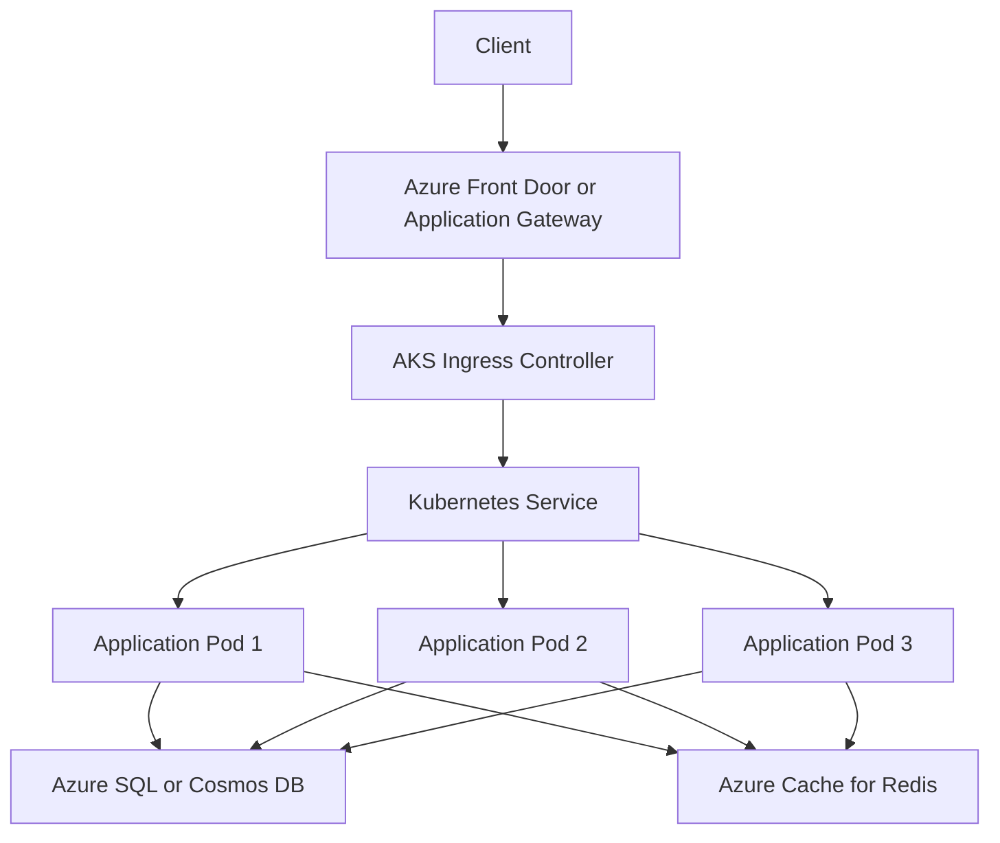

A typical request path is:

1. Client sends request
2. Azure Front Door or Application Gateway receives it
3. Ingress routes the request into AKS
4. Kubernetes Service selects a healthy pod
5. Application pod processes the request
6. Pod calls required dependencies
7. Response is returned to the client

---

## 11. Core Kubernetes Objects in AKS

### 11.1 Pod

A pod is the smallest deployable unit in Kubernetes.

A pod usually contains one application container, although it may contain multiple tightly coupled containers.

### 11.2 Deployment

A Deployment manages the desired number and version of application replicas.

It supports:

- Replica management
- Rolling updates
- Rollbacks
- Versioned application releases

### 11.3 ReplicaSet

A ReplicaSet ensures that the required number of pod replicas are running.

### 11.4 Service

A Service provides a stable network endpoint for a changing set of pods.

Common service types:

- `ClusterIP`
- `NodePort`
- `LoadBalancer`
- Headless Service

### 11.5 Ingress

Ingress provides HTTP and HTTPS routing into the cluster.

It can route based on:

- Hostname
- URL path
- TLS configuration
- Application route

### 11.6 Namespace

Namespaces logically separate workloads within a cluster.

They can be used for:

- Teams
- Environments
- Business domains
- Access control
- Resource quotas

### 11.7 ConfigMap

A ConfigMap stores non-sensitive configuration.

### 11.8 Secret

A Kubernetes Secret stores sensitive values such as credentials or tokens. For production workloads, many organizations integrate AKS with Azure Key Vault rather than relying only on Kubernetes Secrets.

### 11.9 PersistentVolume

A PersistentVolume provides persistent storage for workloads that need data to survive pod recreation.

---

## 12. AKS Node Pools

A node pool is a group of nodes with the same configuration.

You can create different node pools for:

- System components
- General workloads
- Memory-intensive workloads
- CPU-intensive workloads
- GPU workloads
- Windows containers
- Spot workloads
- Restricted or regulated workloads

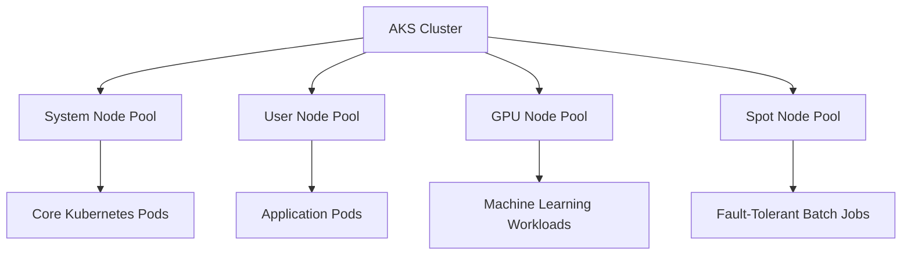

Node pools help isolate workloads and optimize cost and performance.

---

## 13. Scaling in AKS

AKS can scale at different layers.

### 13.1 Pod Scaling

The Horizontal Pod Autoscaler increases or decreases pod replicas based on metrics such as:

- CPU
- Memory
- Requests
- Custom metrics
- Queue depth

### 13.2 Node Scaling

The cluster autoscaler adds or removes nodes based on pending pods and available capacity.

### 13.3 Workload-Based Scaling

Event-driven workloads may use tools such as KEDA to scale pods based on:

- Queue length
- Service Bus messages
- Event Hub lag
- Storage Queue messages
- External metrics

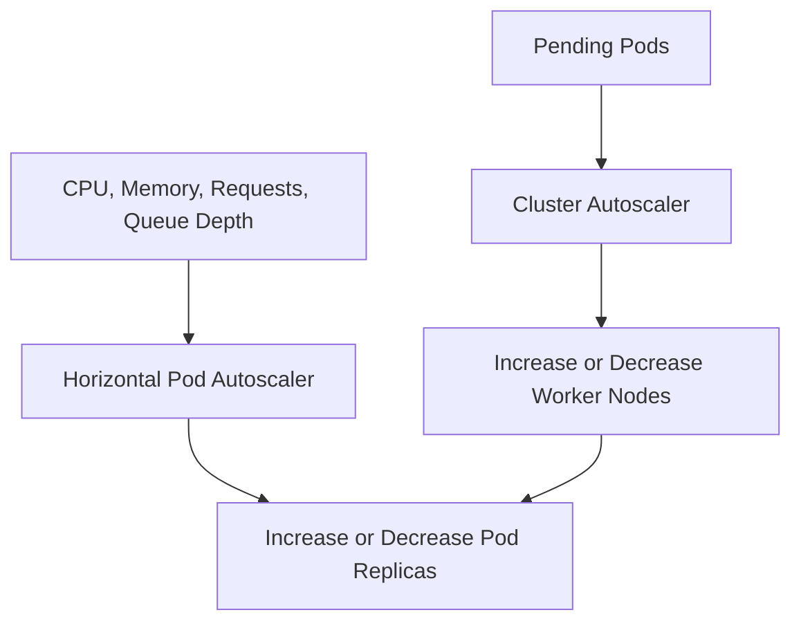

---

## 14. Self-Healing in AKS

Kubernetes supports self-healing behavior.

Examples:

- Restart failed containers
- Recreate failed pods
- Reschedule pods from failed nodes
- Remove unhealthy endpoints from Services
- Maintain the declared replica count

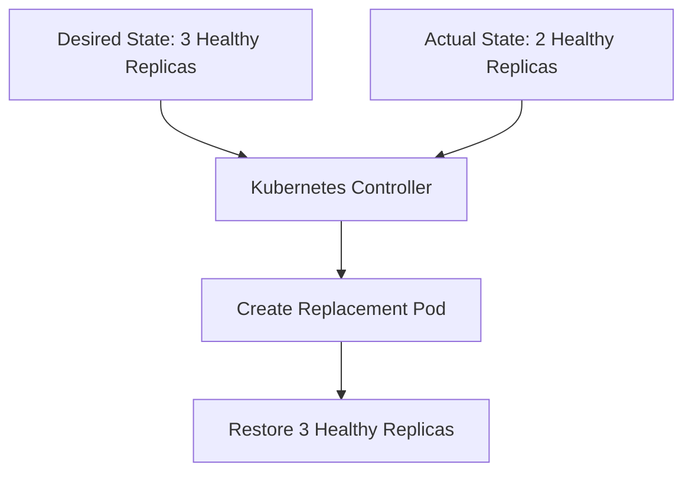

Self-healing does not eliminate the need for proper application health checks, observability, and capacity planning.

---

## 15. Health Probes

Use health probes to help Kubernetes determine whether a workload is functioning correctly.

### Liveness Probe

Determines whether the container should be restarted.

### Readiness Probe

Determines whether the pod should receive traffic.

### Startup Probe

Protects slow-starting applications during startup.

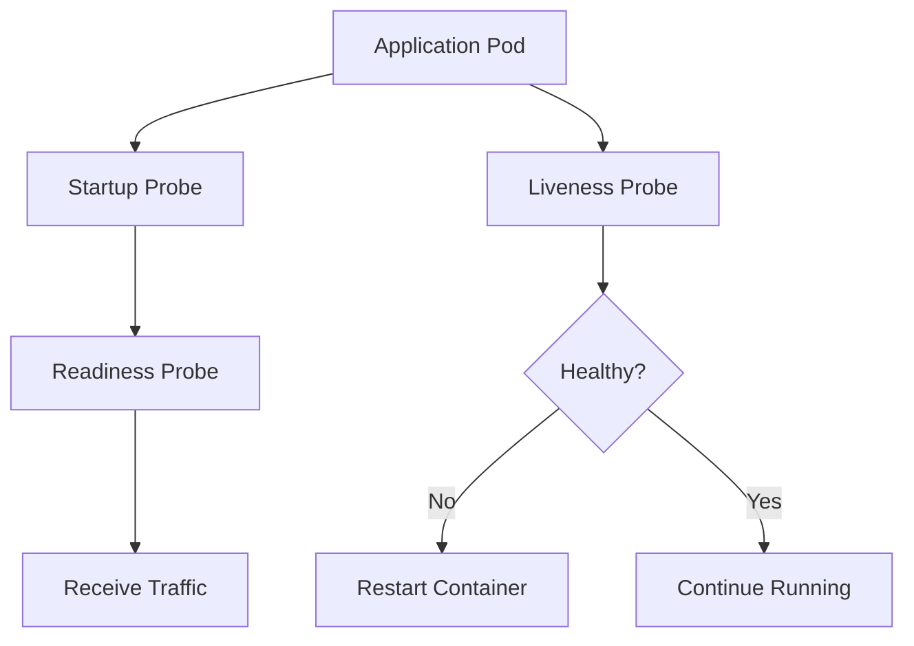

> Interview point:  
> **A running container is not necessarily ready to serve traffic. Readiness probes prevent traffic from reaching unready pods.**

---

## 16. AKS Networking

AKS networking enables communication between:

- Pods
- Services
- Nodes
- Azure virtual networks
- On-premises networks
- External clients

Common networking design decisions include:

- Azure CNI versus other networking options
- Pod IP address planning
- Network policies
- Private clusters
- Ingress architecture
- Egress control
- DNS
- Private endpoints
- Application Gateway integration

For production environments, network design should be planned before deploying workloads because changing address ranges later can be difficult.

---

## 17. AKS Security Model

Secure AKS using multiple layers.

### Identity

- Microsoft Entra ID integration
- Managed identities
- Workload identity
- Role-Based Access Control
- Least-privilege permissions

### Network Security

- Private clusters where appropriate
- Network Security Groups
- Network policies
- Azure Firewall
- Restricted egress
- Private endpoints
- WAF at the edge

### Image Security

- Store images in Azure Container Registry
- Scan images for vulnerabilities
- Use trusted base images
- Sign and verify images where required
- Avoid running containers as root

### Secret Management

- Use Azure Key Vault
- Use managed identity or workload identity
- Avoid secrets in source code
- Rotate secrets and certificates
- Avoid exposing secrets in logs

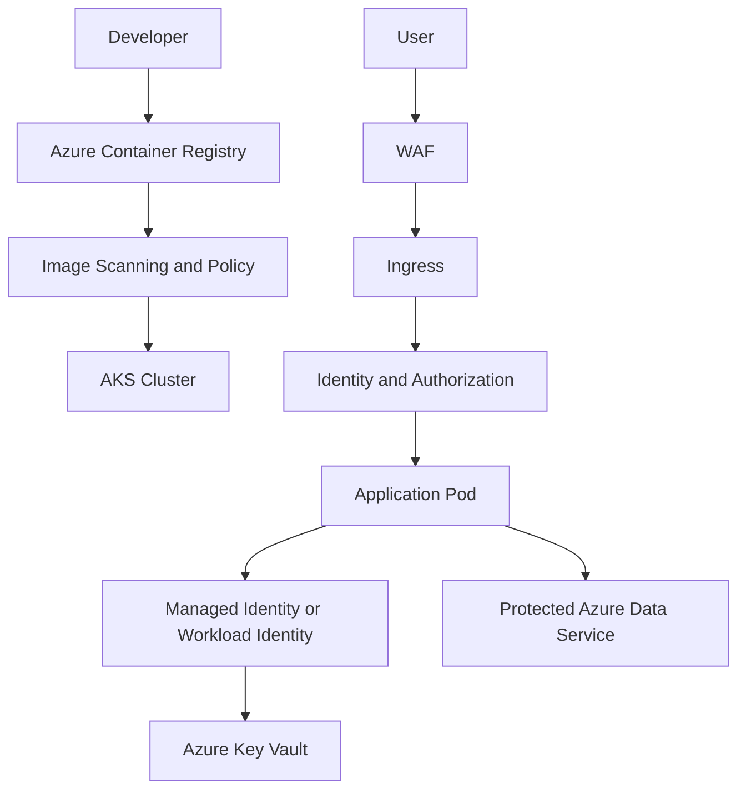

---

## 18. AKS Storage

AKS supports several storage patterns.

### Ephemeral Storage

Used for temporary data tied to the pod lifecycle.

### Persistent Volumes

Used when data must survive pod restarts or rescheduling.

### Azure Disk

Usually used for block storage attached to a node.

### Azure Files

Used for shared file access across multiple pods.

### Blob Storage

Used for large objects such as:

- Images
- Documents
- Videos
- Backups
- Data lake files

> Interview point:  
> **Do not assume pod-local storage is durable. Use persistent Azure storage for data that must survive pod recreation.**

---

## 19. AKS Deployment Strategies

### Rolling Deployment

Gradually replaces old pods with new pods.

Advantages:

- No planned downtime
- Lower infrastructure overhead
- Native Kubernetes support

### Blue-Green Deployment

Runs two versions and switches traffic between them.

Advantages:

- Fast rollback
- Strong version isolation

### Canary Deployment

Sends a small percentage of traffic to the new version before increasing traffic gradually.

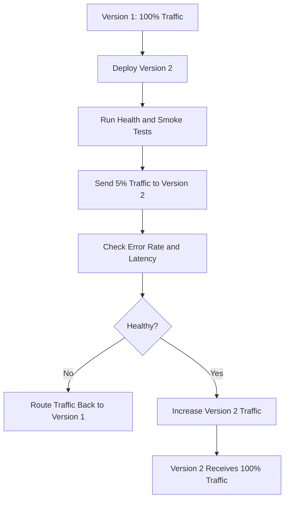

---

## 20. AKS Observability

Monitor both the cluster and the workloads.

### Cluster Metrics

- Node CPU
- Node memory
- Disk pressure
- Pod count
- Pending pods
- Node health
- Autoscaler activity

### Application Metrics

- Request count
- Error rate
- Latency
- Throughput
- Dependency failures
- Queue depth

### Logs

- Container logs
- Kubernetes events
- Ingress logs
- Audit logs
- Platform diagnostics

### Traces

- Distributed request traces
- Service-to-service calls
- Database dependencies
- External API calls

Azure Monitor and Application Insights can be integrated into AKS observability designs. The AKS baseline architecture also emphasizes monitoring, logging, identity, policy, networking, and operational management as part of a production platform. ([learn.microsoft.com](https://learn.microsoft.com/en-us/azure/architecture/reference-architectures/containers/aks/baseline-aks?utm_source=openai))

---

## 21. AKS Upgrade and Operations

AKS operations include:

- Kubernetes version upgrades
- Node image upgrades
- Security patching
- Node pool maintenance
- Scaling
- Backup and recovery
- Policy enforcement
- Certificate rotation
- Monitoring
- Cost management

A production upgrade strategy should include:

1. Test the upgrade in a non-production cluster
2. Review deprecated APIs
3. Validate application compatibility
4. Upgrade node pools safely
5. Monitor workloads
6. Maintain rollback or recovery procedures

---

## 22. AKS Availability and Resilience

Improve availability by using:

- Multiple application replicas
- Multiple availability zones
- Pod anti-affinity
- Pod topology spread constraints
- Pod disruption budgets
- Readiness probes
- Cluster autoscaler
- Multiple node pools
- Health-based routing
- Multi-region clusters when required

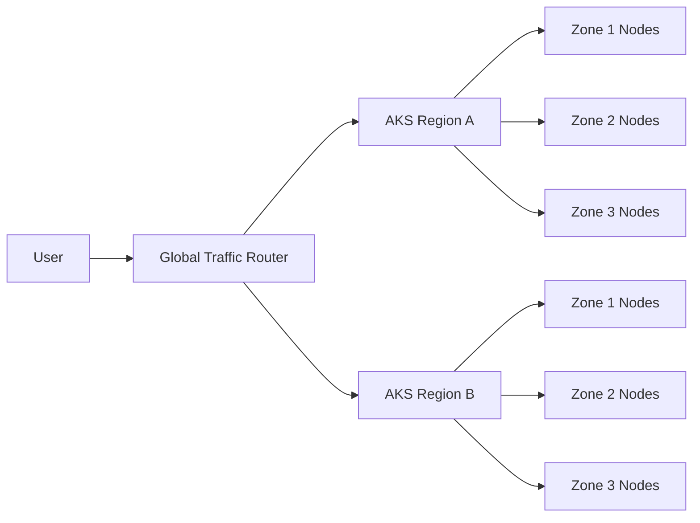

Important:

> A highly available AKS cluster does not automatically make the database, queue, cache, or external dependencies highly available. The entire architecture must be designed for resilience.

---

## 23. When Should You Choose AKS?

Choose AKS when you need:

- Kubernetes orchestration
- Complex microservices
- Multiple independently deployable services
- Custom networking
- Sidecars or service mesh
- Advanced scheduling
- Custom ingress and traffic control
- Multiple node pools
- Portable container workloads
- GPU or specialized compute
- Kubernetes ecosystem integrations

---

## 24. When Should You Not Choose AKS?

Avoid AKS when:

- The application is a simple web application
- A single API can run comfortably on App Service
- The workload is primarily event-driven and short-lived
- The team lacks Kubernetes operational expertise
- There is no requirement for container orchestration
- The operational cost is greater than the business benefit

Possible alternatives:

- Azure App Service
- Azure Container Apps
- Azure Functions
- Azure Container Instances
- Virtual Machines

> Interview phrase:  
> **AKS is powerful, but it should not be selected by default. Choose it when Kubernetes capabilities justify the added operational complexity.**

---

## 25. AKS vs App Service vs Functions

| Feature | AKS | App Service | Azure Functions |
|---|---|---|---|
| Primary purpose | Container orchestration | Managed web/API hosting | Event-driven serverless compute |
| Control | High | Moderate | Lower |
| Operational complexity | High | Low | Low to moderate |
| Best for | Complex microservices | Standard web apps and APIs | Short-lived event processing |
| Scaling | Pods and nodes | App instances | Trigger-based scaling |
| Kubernetes required | Yes | No | No |
| Infrastructure management | Shared responsibility | Mostly managed | Mostly managed |
| Best team profile | Platform and DevOps teams | Application teams | Application and integration teams |

---

## 26. AKS Cost Considerations

AKS costs can come from:

- Worker nodes
- Node pools
- Storage
- Load balancers
- Public IPs
- Networking
- Container registry
- Monitoring and log ingestion
- Security tooling
- Supporting Azure services

Cost optimization techniques include:

- Right-size node pools
- Use cluster autoscaler
- Use appropriate pod resource requests and limits
- Use spot nodes for fault-tolerant workloads
- Separate system and user node pools
- Remove unused environments
- Reduce excessive log ingestion
- Use appropriate VM sizes
- Schedule non-production workloads
- Monitor cost per workload

> Interview point:  
> **AKS can be cost-effective at scale, but only when node utilization and platform operations are managed carefully.**

---

## 27. AKS Production Architecture Example

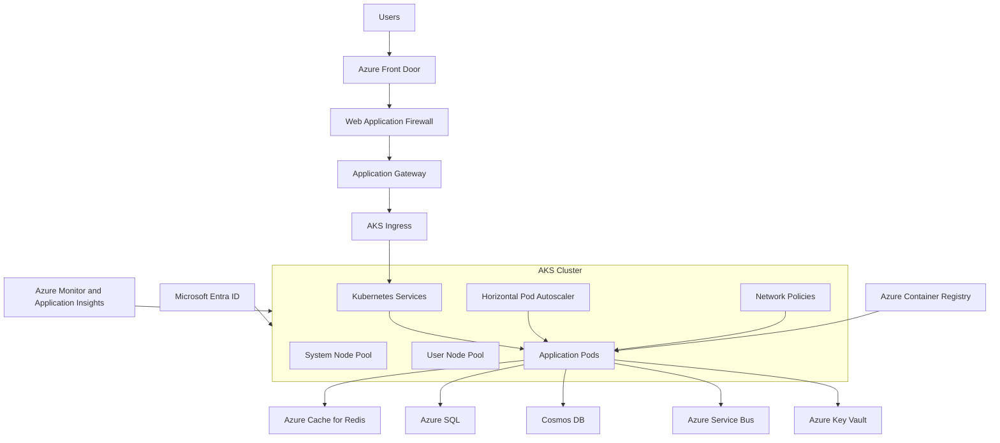

---

## 28. AKS Interview Scenario

### Scenario

A company has 20 microservices that need:

- Independent deployments
- Horizontal scaling
- Service-to-service communication
- Custom networking
- Multiple worker-node types
- Rolling deployments
- Container-based development standards

### Recommended Solution

Use AKS because:

1. Each microservice can run as a separate Deployment
2. Services provide stable internal communication
3. Horizontal Pod Autoscaler can scale individual workloads
4. Node pools can separate workload types
5. Ingress can expose selected APIs
6. Kubernetes supports rolling and canary deployments
7. Network policies can restrict communication
8. Azure services can provide identity, storage, observability, and security

---

## 29. Common AKS Interview Mistakes

1. Saying Azure manages everything in AKS
2. Ignoring worker-node and workload responsibilities
3. Treating Kubernetes as only a container runtime
4. Forgetting node pools
5. Not explaining pods versus containers
6. Ignoring networking and ingress
7. Storing state only inside pods
8. Using Kubernetes Secrets without considering secure secret management
9. Choosing AKS for every application
10. Ignoring upgrade and monitoring responsibilities
11. Forgetting database high availability
12. Ignoring cluster and node costs

---

## 30. Interview Questions and Strong Answers

### Q1: What is AKS?

**Answer:** AKS is Microsoft's managed Kubernetes service on Azure. It provides a managed Kubernetes control plane and allows teams to deploy, scale, and operate containerized applications using Kubernetes.

### Q2: What does Azure manage in AKS?

**Answer:** Azure manages the AKS control plane and core managed components. The platform team remains responsible for workload configuration, node pools, networking, scaling, security policies, deployments, monitoring, and application operations according to the selected AKS mode.

### Q3: What is the difference between a pod and a container?

**Answer:** A container is a process package containing application code and dependencies. A pod is Kubernetes' smallest deployable unit and usually contains one application container, although it can contain multiple closely related containers.

### Q4: What is a node in AKS?

**Answer:** A node is an Azure virtual machine that runs Kubernetes node components and hosts application pods.

### Q5: What is a node pool?

**Answer:** A node pool is a group of nodes with the same configuration. Separate node pools can be used for system services, general applications, GPU workloads, Windows containers, or cost-optimized workloads.

### Q6: How does AKS scale applications?

**Answer:** AKS can scale pods using the Horizontal Pod Autoscaler and scale worker nodes using the cluster autoscaler. Event-driven workloads can also scale using external metrics and tools such as KEDA.

### Q7: How do you expose an application running in AKS?

**Answer:** Use a Kubernetes Service for internal or external access and an Ingress controller for HTTP or HTTPS routing. Azure Front Door, Application Gateway, or API Management can provide additional global routing, WAF, authentication, and API governance.

### Q8: How do you secure AKS?

**Answer:** Use Microsoft Entra ID, RBAC, managed identities or workload identity, network policies, private networking, WAF, image scanning, Key Vault, least privilege, and centralized monitoring.

### Q9: How do you achieve zero-downtime deployments in AKS?

**Answer:** Use multiple replicas, readiness probes, rolling or canary deployments, Pod Disruption Budgets, graceful shutdown, backward-compatible database changes, and automated rollback.

### Q10: When would you choose AKS instead of App Service?

**Answer:** I would choose AKS when the workload needs Kubernetes-level control, complex microservice orchestration, custom networking, multiple node pools, service mesh, specialized scheduling, or platform portability. For a standard web application or API, App Service may be simpler.

### Q11: Is AKS serverless?

**Answer:** No. AKS is a managed Kubernetes service, but application workloads generally run on Azure compute nodes. Azure manages the control plane, while node and workload responsibilities depend on the cluster mode and configuration.

### Q12: What is AKS Automatic?

**Answer:** AKS Automatic is a more managed AKS experience with production-oriented defaults and reduced operational overhead. AKS Standard provides more direct control for teams with specialized configuration and lifecycle requirements.

---

## 31. 60-Second Interview Pitch

> AKS, or Azure Kubernetes Service, is Microsoft's managed Kubernetes platform for deploying and operating containerized applications. An AKS cluster has a managed control plane and worker nodes that run application pods. Developers define the desired state using Kubernetes manifests, and the control plane schedules pods, maintains replicas, manages services, and supports self-healing. AKS provides scaling through pod and node autoscaling, networking through Services and Ingress, and security through Entra ID, RBAC, managed identities, network policies, and Key Vault integration. I choose AKS when I need advanced container orchestration and platform control; for simpler web APIs, App Service or Functions may be a better choice.

---

## 32. Final Revision Checklist

- [ ] AKS means Azure Kubernetes Service
- [ ] AKS is a managed Kubernetes service
- [ ] Control plane manages orchestration
- [ ] Worker nodes run application workloads
- [ ] Pods are the smallest deployable units
- [ ] Deployments manage replicas and releases
- [ ] Services provide stable network access
- [ ] Ingress routes HTTP and HTTPS traffic
- [ ] Node pools group similarly configured nodes
- [ ] HPA scales pods
- [ ] Cluster autoscaler scales nodes
- [ ] Readiness probes control traffic eligibility
- [ ] Liveness probes detect unhealthy containers
- [ ] Entra ID and RBAC secure access
- [ ] Managed identity or workload identity protects service access
- [ ] Key Vault protects secrets and certificates
- [ ] Azure Monitor and Application Insights provide observability
- [ ] AKS Automatic reduces operational overhead
- [ ] AKS Standard provides deeper platform control
- [ ] AKS should be selected only when its capabilities justify its complexity

---

## One-Line Conclusion

> AKS is Azure's managed Kubernetes service for running scalable, resilient, secure, and highly configurable containerized applications using Kubernetes orchestration.