# What Is Ingress in Kubernetes?
## Detailed Interview Preparation Guide with Flow Charts

---

## 1. Direct Interview Answer

**Ingress is a Kubernetes API object that manages external HTTP and HTTPS access to services inside a Kubernetes cluster.**

It allows you to define routing rules based on:

- Hostnames
- URL paths
- HTTP and HTTPS protocols
- TLS configuration
- Backend Kubernetes Services

For example:

- `example.com/` → frontend service
- `example.com/api` → API service
- `admin.example.com` → admin service

> **One-line interview answer:**  
> **Ingress provides HTTP/HTTPS routing from outside the Kubernetes cluster to internal Kubernetes Services using host, path, TLS, and load-balancing rules.**

---

## 2. Why Is Ingress Needed?

Pods have temporary IP addresses, and Kubernetes Services provide internal or external access to Pods. However, exposing every Service separately can become expensive and difficult to manage.

Without Ingress, an architecture might look like this:

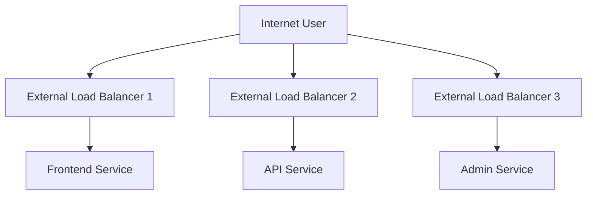

With Ingress, multiple HTTP applications can share one entry point:

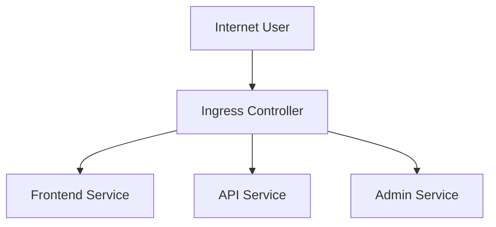

Ingress helps centralize:

- HTTP routing
- TLS termination
- Host-based routing
- Path-based routing
- Load balancing
- External application access

---

## 3. Ingress High-Level Architecture

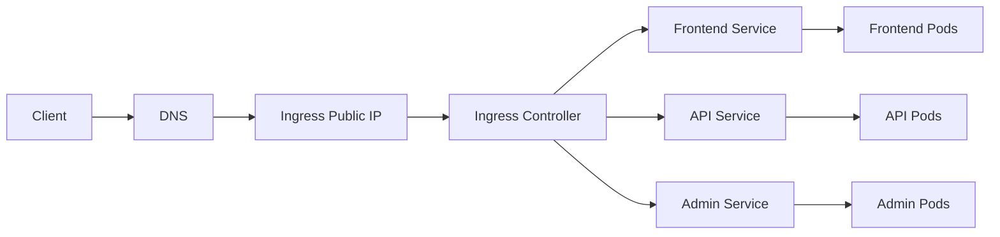

The main components are:

1. Client
2. DNS
3. Ingress resource
4. Ingress controller
5. Kubernetes Services
6. Application Pods

---

## 4. Ingress Resource vs Ingress Controller

This is one of the most important interview distinctions.

## 4.1 Ingress Resource

An Ingress resource is a Kubernetes configuration object that defines routing rules.

It describes:

- Which hostname should be matched
- Which URL path should be matched
- Which Service should receive traffic
- Which TLS certificate should be used
- Which Ingress class should process the configuration

Example:

```yaml
apiVersion: networking.k8s.io/v1
kind: Ingress
metadata:
  name: application-ingress
spec:
  ingressClassName: nginx
  rules:
    - host: example.com
      http:
        paths:
          - path: /
            pathType: Prefix
            backend:
              service:
                name: frontend-service
                port:
                  number: 80
```

## 4.2 Ingress Controller

The Ingress controller is the actual implementation that watches Ingress resources and configures a proxy, load balancer, or gateway.

Examples include:

- NGINX Ingress Controller
- Application Gateway Ingress Controller
- Azure Application Routing
- Traefik
- HAProxy
- Kong
- Cloud-provider-specific controllers

> **Interview answer:**  
> **The Ingress resource contains the desired routing configuration; the Ingress controller implements that configuration.**

---

## 5. Important Requirement: An Ingress Controller Is Required

Creating an Ingress resource alone does not expose an application.

The cluster must have an Ingress controller that watches and processes the resource.

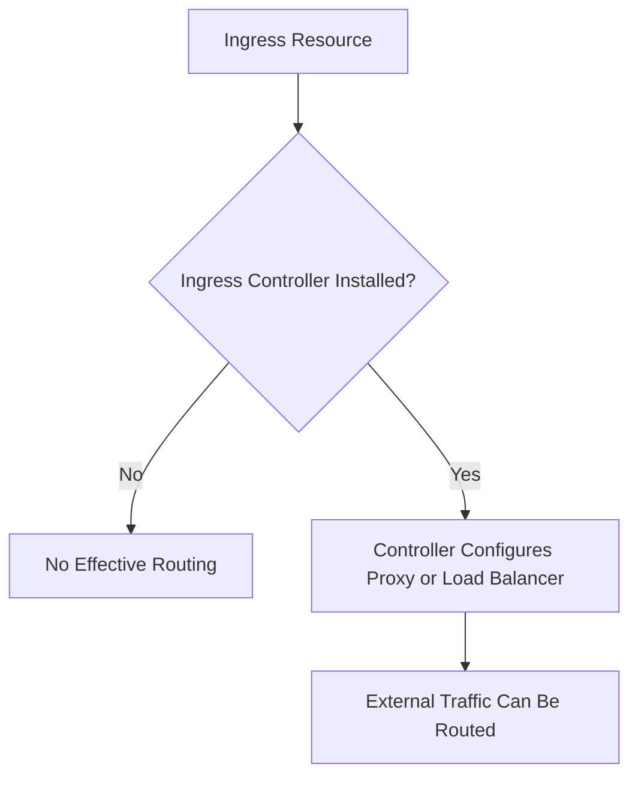

This is a common interview question.

> **Important:**  
> An Ingress manifest is only a set of rules. The Ingress controller performs the actual routing.

---

## 6. End-to-End Ingress Request Flow

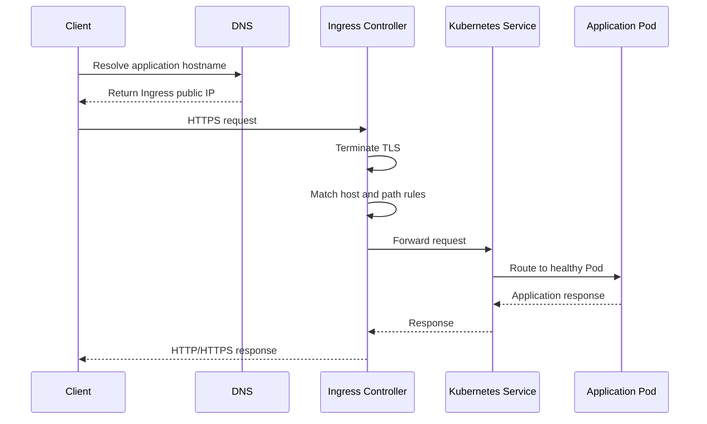

---

## 7. Host-Based Routing

Host-based routing sends traffic to different Services based on the hostname.

Example:

- `www.example.com` → frontend
- `api.example.com` → API
- `admin.example.com` → admin portal

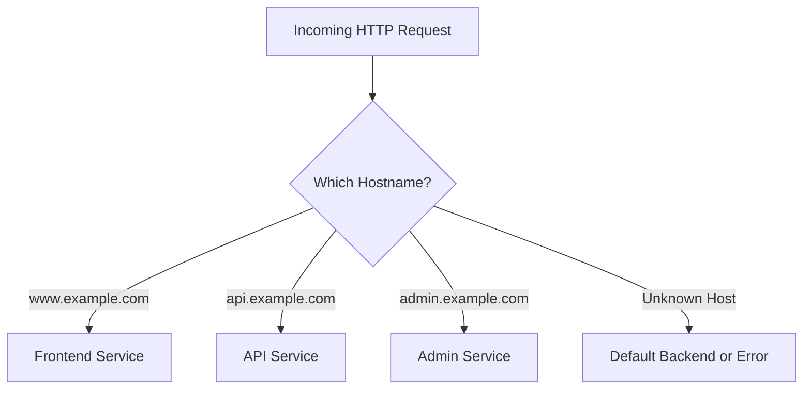

Example:

```yaml
apiVersion: networking.k8s.io/v1
kind: Ingress
metadata:
  name: host-based-ingress
spec:
  ingressClassName: nginx
  rules:
    - host: www.example.com
      http:
        paths:
          - path: /
            pathType: Prefix
            backend:
              service:
                name: frontend-service
                port:
                  number: 80

    - host: api.example.com
      http:
        paths:
          - path: /
            pathType: Prefix
            backend:
              service:
                name: api-service
                port:
                  number: 80
```

---

## 8. Path-Based Routing

Path-based routing sends traffic to different Services based on the URL path.

Example:

- `/` → frontend service
- `/api` → API service
- `/admin` → admin service

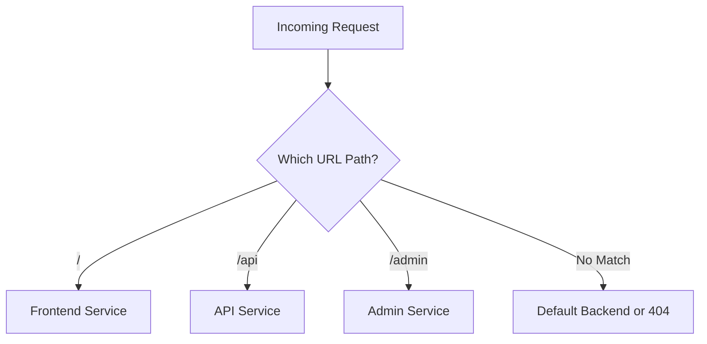

Example:

```yaml
apiVersion: networking.k8s.io/v1
kind: Ingress
metadata:
  name: path-based-ingress
spec:
  ingressClassName: nginx
  rules:
    - host: example.com
      http:
        paths:
          - path: /
            pathType: Prefix
            backend:
              service:
                name: frontend-service
                port:
                  number: 80

          - path: /api
            pathType: Prefix
            backend:
              service:
                name: api-service
                port:
                  number: 80

          - path: /admin
            pathType: Prefix
            backend:
              service:
                name: admin-service
                port:
                  number: 80
```

---

## 9. Path Types

Kubernetes Ingress supports path matching types such as:

### `Prefix`

Matches URL paths based on path prefixes.

Example:

```text
/api
/api/users
/api/orders
```

### `Exact`

Matches only the exact path.

Example:

```text
/login
```

Example:

```yaml
paths:
  - path: /login
    pathType: Exact
    backend:
      service:
        name: auth-service
        port:
          number: 80
```

> **Interview point:**  
> Use `Prefix` when routing a group of paths and `Exact` when matching one specific URL.

---

## 10. TLS Termination

Ingress can terminate TLS for HTTPS traffic.

The general flow is:

1. Client connects using HTTPS
2. Ingress controller presents the TLS certificate
3. Ingress decrypts the request
4. Ingress routes the request to the backend Service
5. Backend traffic may continue over HTTP or HTTPS depending on security requirements

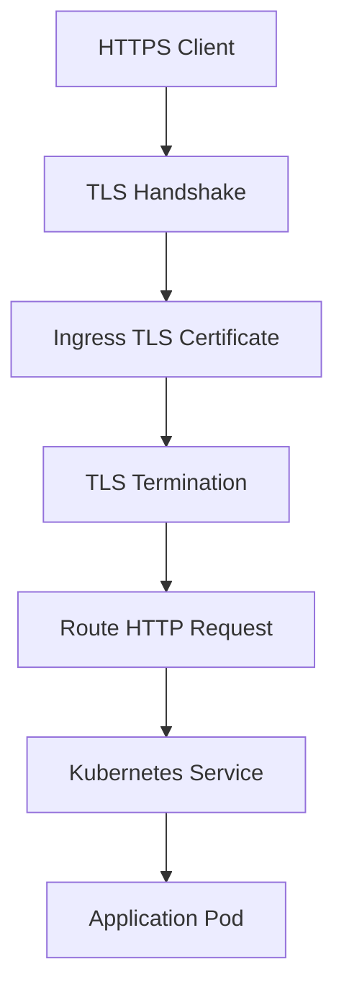

Example TLS configuration:

```yaml
apiVersion: networking.k8s.io/v1
kind: Ingress
metadata:
  name: secure-ingress
spec:
  ingressClassName: nginx
  tls:
    - hosts:
        - example.com
      secretName: example-tls

  rules:
    - host: example.com
      http:
        paths:
          - path: /
            pathType: Prefix
            backend:
              service:
                name: frontend-service
                port:
                  number: 80
```

The `example-tls` Secret contains the TLS certificate and private key.

---

## 11. TLS Passthrough vs TLS Termination

### TLS Termination

Ingress decrypts HTTPS traffic.

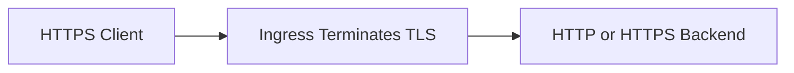

Advantages:

- Centralized certificate management
- Easier routing
- Reduced TLS work for backend services
- Centralized security policies

### TLS Passthrough

Ingress forwards encrypted traffic to the backend, and the backend terminates TLS.

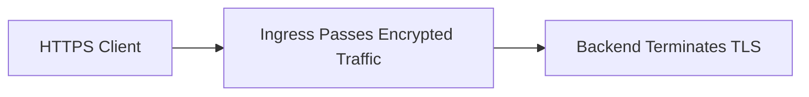

Use passthrough when the backend must control TLS termination or when end-to-end encryption is required by the design.

---

## 12. IngressClass

An `IngressClass` identifies which controller should implement an Ingress resource.

Example:

```yaml
apiVersion: networking.k8s.io/v1
kind: IngressClass
metadata:
  name: nginx
spec:
  controller: k8s.io/ingress-nginx
```

The Ingress resource references the class:

```yaml
spec:
  ingressClassName: nginx
```

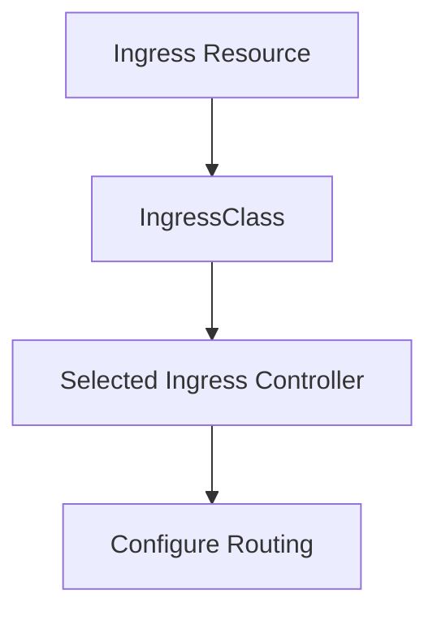

A cluster may have multiple Ingress controllers, such as:

- Internal controller
- External controller
- NGINX controller
- Cloud-provider controller

The `ingressClassName` field makes the intended controller explicit.

---

## 13. Default Backend

A default backend handles requests that do not match any defined host or path rule.

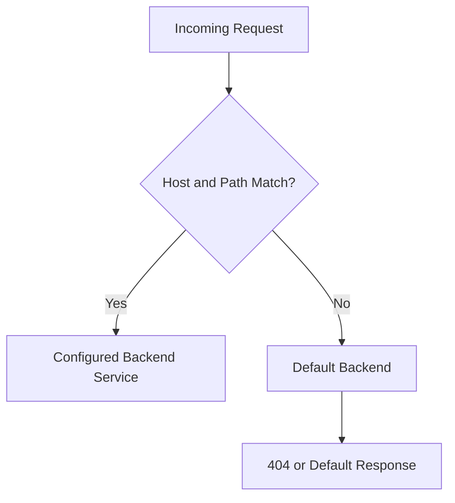

A default backend may be used for:

- 404 responses
- Generic error pages
- Unknown hosts
- Unmatched paths

---

## 14. Ingress and Kubernetes Service

Ingress does not usually route directly to Pods.

The typical flow is:

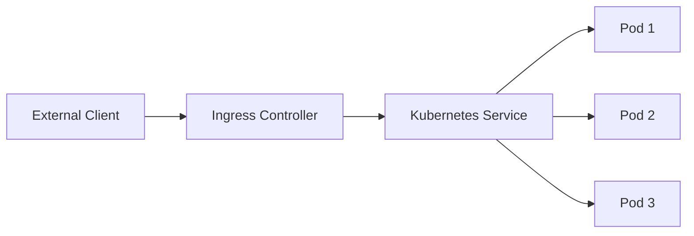

The Service provides:

- Stable virtual IP
- Stable DNS name
- Pod selection using labels
- Load balancing among matching Pods

Ingress provides:

- External HTTP/HTTPS entry point
- Host and path routing
- TLS handling
- Proxy and load-balancer behavior

> **Interview answer:**  
> **Ingress routes to Services, and Services route to Pods.**

---

## 15. Ingress vs Service Type LoadBalancer

| Feature | Ingress | Service Type `LoadBalancer` |
|---|---|---|
| Main purpose | HTTP/HTTPS routing | Expose one Service externally |
| Host-based routing | Yes | Usually no |
| Path-based routing | Yes | Usually no |
| TLS termination | Commonly supported | Depends on implementation |
| Multiple Services behind one endpoint | Yes | Usually one external load balancer per Service |
| Protocol support | Primarily HTTP/HTTPS | Can support broader transport protocols |
| Cost efficiency | Can consolidate HTTP routes | May create separate load balancers |
| Requires controller | Yes | Cloud provider integration usually provisions it |

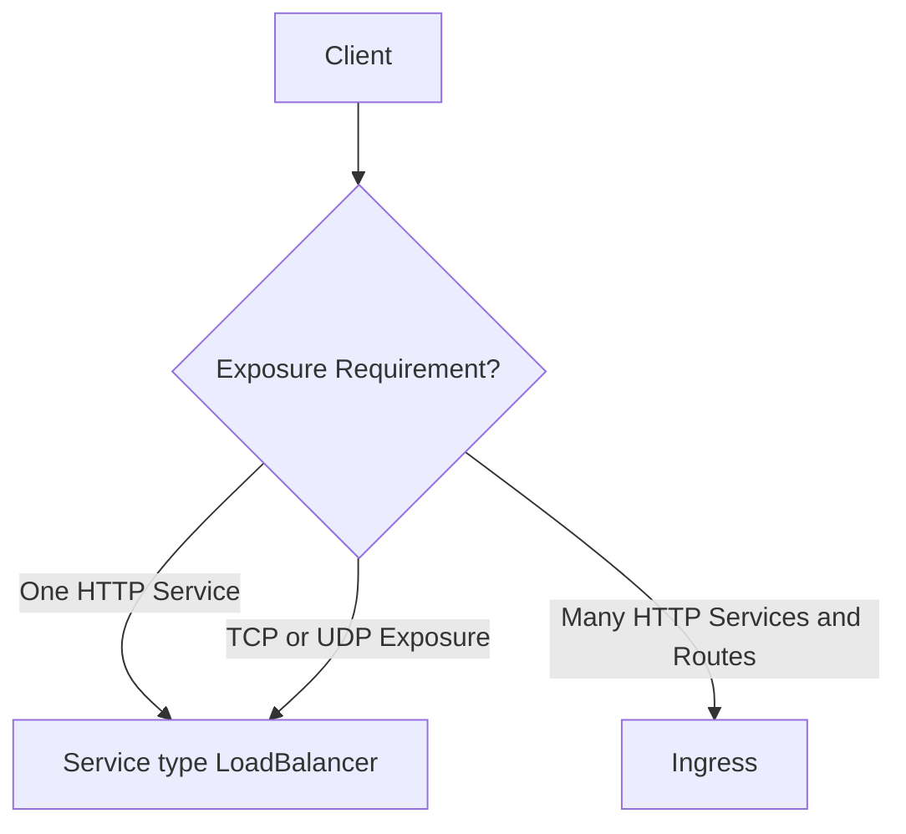

> **Interview point:**  
> Use `LoadBalancer` for direct external exposure of a Service. Use Ingress when you need centralized HTTP/HTTPS routing across multiple Services.

---

## 16. Ingress vs NodePort

### NodePort

Exposes a Service on a port of each Node.

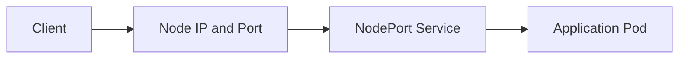

### Ingress

Provides a protocol-aware HTTP/HTTPS entry point with hostname and path routing.

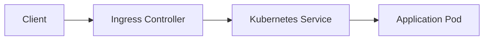

NodePort is usually lower-level and less convenient for production HTTP routing.

---

## 17. Ingress Controller Responsibilities

An Ingress controller may provide:

- Load balancing
- Host routing
- Path routing
- TLS termination
- Certificate integration
- Health checks
- Backend selection
- HTTP redirects
- Request rewriting
- Authentication integration
- Rate limiting
- Access logging
- Web Application Firewall integration
- Traffic observability

The exact capabilities depend on the selected controller.

> **Important:**  
> Ingress behavior can vary between controllers. Always review the documentation for the controller being used.

---

## 18. Azure AKS Ingress Architecture

A typical AKS architecture may use:

- Azure Front Door for global routing
- Azure Web Application Firewall
- Application Gateway
- AKS Ingress Controller
- Kubernetes Services
- Application Pods

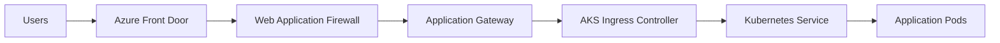

Alternative architectures may use:

- Azure Application Gateway for Containers
- NGINX Ingress Controller
- Azure Application Routing add-on
- API Management in front of AKS
- Internal-only Ingress for private applications

The selection depends on requirements such as:

- Public versus private access
- WAF requirements
- Global routing
- API governance
- TLS model
- Network topology
- Operational ownership

---

## 19. AKS Internal vs External Ingress

### External Ingress

Used for public internet-facing applications.

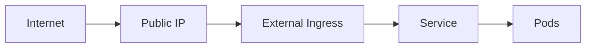

### Internal Ingress

Used for private applications accessible only from:

- Virtual networks
- Peered networks
- On-premises networks
- Private connectivity
- Internal enterprise clients

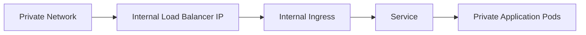

---

## 20. Ingress Request Routing Flow

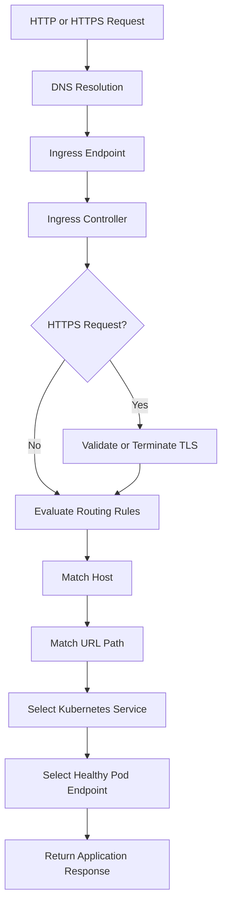

---

## 21. Ingress Health Checks

Ingress controllers and cloud load balancers may use health checks to avoid sending traffic to unhealthy backends.

```mermaid
flowchart TD
    Ingress["Ingress Controller"] --> Service["Kubernetes Service"]
    Service --> Readiness["Readiness Status"]
    Readiness --> Healthy{"Pod Ready?"}

    Healthy -- "Yes" --> Route["Include Pod as Backend"]
    Healthy -- "No" --> Exclude["Remove Pod from Traffic"]
```

A correct readiness probe is important because:

- Running does not always mean ready
- A Pod may still be starting
- Dependencies may be unavailable
- The application may be overloaded
- Traffic should avoid unhealthy endpoints

---

## 22. Ingress and Zero-Downtime Deployment

Ingress can support controlled releases when combined with:

- Multiple application versions
- Separate Services
- Canary rules
- Weighted routing features
- Blue-green switching
- Readiness probes
- Automated rollback

```mermaid
flowchart TD
    Ingress["Ingress Controller"] --> Version1["Service v1"]
    Ingress --> Version2["Service v2"]

    Traffic["Traffic Policy"] --> Small["Small Percentage to v2"]
    Small --> Version2
    Traffic --> Main["Most Traffic to v1"]
    Main --> Version1

    Metrics["Error Rate and Latency"] --> Decision{"v2 Healthy?"}
    Decision -- "Yes" --> Increase["Increase v2 Traffic"]
    Decision -- "No" --> Rollback["Route Traffic Back to v1"]
```

Ingress alone does not guarantee zero downtime. The application, database, deployment process, health checks, and backend capacity must also support safe releases.

---

## 23. Ingress Security

Secure an Ingress using:

- TLS certificates
- HTTPS redirection
- Web Application Firewall
- Authentication and authorization
- Rate limiting
- Request-size limits
- Network restrictions
- IP allowlists
- DDoS protection
- Secure headers
- Access logging
- Private ingress for internal services

```mermaid
flowchart TD
    Client["Client"] --> WAF["Web Application Firewall"]
    WAF --> TLS["TLS Validation"]
    TLS --> Auth["Authentication"]
    Auth --> Rate["Rate Limiting"]
    Rate --> Rules["Ingress Routing Rules"]
    Rules --> Service["Backend Service"]
    Service --> Pods["Application Pods"]
```

---

## 24. Ingress Observability

Monitor:

### Traffic Metrics

- Request count
- Requests per second
- Throughput
- Active connections

### Reliability Metrics

- HTTP 4xx responses
- HTTP 5xx responses
- Backend failures
- TLS failures
- Route mismatches

### Performance Metrics

- Response time
- p95 and p99 latency
- Backend connection time
- TLS handshake time

### Security Metrics

- WAF blocks
- Rate-limit events
- Authentication failures
- Suspicious requests
- Rejected IP addresses

```mermaid
flowchart LR
    Client["Client Traffic"] --> Ingress["Ingress Controller"]
    Ingress --> Metrics["Ingress Metrics"]
    Ingress --> Logs["Access and Error Logs"]
    Ingress --> Traces["Distributed Traces"]

    Metrics --> Monitor["Monitoring Platform"]
    Logs --> LogAnalytics["Centralized Log Analytics"]
    Traces --> APM["Application Performance Monitoring"]
```

---

## 25. Ingress Configuration Example

Complete example with Service, Deployment, and Ingress:

```yaml
apiVersion: apps/v1
kind: Deployment
metadata:
  name: web-deployment
spec:
  replicas: 3
  selector:
    matchLabels:
      app: web
  template:
    metadata:
      labels:
        app: web
    spec:
      containers:
        - name: web
          image: nginx:1.27
          ports:
            - containerPort: 80
          readinessProbe:
            httpGet:
              path: /
              port: 80
            initialDelaySeconds: 5
            periodSeconds: 10
---
apiVersion: v1
kind: Service
metadata:
  name: web-service
spec:
  selector:
    app: web
  ports:
    - port: 80
      targetPort: 80
---
apiVersion: networking.k8s.io/v1
kind: Ingress
metadata:
  name: web-ingress
spec:
  ingressClassName: nginx
  rules:
    - host: example.com
      http:
        paths:
          - path: /
            pathType: Prefix
            backend:
              service:
                name: web-service
                port:
                  number: 80
```

---

## 26. Ingress Deployment Flow

```mermaid
flowchart TD
    Manifest["Apply Deployment, Service, and Ingress YAML"] --> API["Kubernetes API Server"]
    API --> Deployment["Deployment Creates Pods"]
    API --> Service["Service Selects Pods"]
    API --> Ingress["Ingress Resource Created"]

    Ingress --> Controller["Ingress Controller Watches Resource"]
    Controller --> Configure["Configure Proxy or Load Balancer"]
    Configure --> External["Expose HTTP/HTTPS Route"]
```

---

## 27. Common Ingress Problems

### Ingress Has No Address

Possible causes:

- Ingress controller is not installed
- Controller is not healthy
- Service or LoadBalancer provisioning is incomplete
- Incorrect IngressClass
- Cloud permissions are missing

### 404 Not Found

Possible causes:

- Hostname does not match
- Path does not match
- Incorrect `pathType`
- Backend Service name is wrong
- Default backend is not configured

### 502 or 503 Errors

Possible causes:

- Service has no ready endpoints
- Pods are failing readiness probes
- Target port is wrong
- Application is not listening on the expected port
- Backend is unavailable

### TLS Errors

Possible causes:

- Secret name is wrong
- Certificate does not contain the requested hostname
- Certificate is expired
- Secret is in the wrong namespace
- TLS configuration is incorrect

```mermaid
flowchart TD
    Issue["Ingress Issue"] --> Type{"Observed Problem?"}

    Type -- "No Address" --> Controller["Check Ingress Controller and Class"]
    Type -- "404" --> Rules["Check Host and Path Rules"]
    Type -- "502/503" --> Endpoints["Check Service Endpoints and Readiness"]
    Type -- "TLS Error" --> Certificate["Check Certificate and TLS Secret"]
```

---

## 28. Useful Troubleshooting Commands

```bash
kubectl get ingress
kubectl describe ingress <ingress-name>
kubectl get ingressclass
kubectl get svc
kubectl get endpoints
kubectl get endpointslices
kubectl get pods
kubectl describe pod <pod-name>
kubectl logs -n <controller-namespace> <controller-pod>
kubectl get events --sort-by=.lastTimestamp
```

Recommended troubleshooting sequence:

```mermaid
flowchart TD
    Start["Ingress Request Fails"] --> Ingress["Check Ingress Resource"]
    Ingress --> Class["Check IngressClass"]
    Class --> Controller["Check Controller Pods and Logs"]
    Controller --> Service["Check Backend Service"]
    Service --> Endpoints["Check Ready Endpoints"]
    Endpoints --> Pods["Check Pod Health and Ports"]
    Pods --> TLS["Check TLS Secret if HTTPS"]
    TLS --> DNS["Check DNS and Public IP"]
```

---

## 29. Ingress vs Gateway API

Ingress is a stable Kubernetes API, but the Ingress API is frozen and is no longer receiving new feature development. Kubernetes recommends evaluating Gateway API for new capabilities.

| Feature | Ingress | Gateway API |
|---|---|---|
| Status | Stable | Modern Kubernetes networking API |
| Routing | HTTP/HTTPS routing | Richer traffic-routing model |
| Configuration | Often controller annotations | More structured resources |
| Extensibility | Limited by frozen API | Designed for extensibility |
| New feature direction | Maintenance mode | Recommended direction |
| Existing workloads | Continue to be supported | Migration or new design option |

> **Interview answer:**  
> **I understand and support existing Ingress-based systems, but for new designs I evaluate Gateway API because the Kubernetes Ingress API is frozen and Gateway provides a richer extensible model.**

---

## 30. When Would You Use Ingress?

Use Ingress when:

- The application uses HTTP or HTTPS
- Multiple Services need one external entry point
- Host-based routing is required
- Path-based routing is required
- TLS termination is needed
- Centralized HTTP routing is useful
- The organization already standardizes on an Ingress controller
- The platform has existing Ingress tooling

---

## 31. When Would You Not Use Ingress?

Ingress may not be the best choice when:

- You need TCP or UDP exposure
- You need a simple external endpoint for one Service
- You need advanced Gateway API capabilities
- You require a dedicated API gateway for authentication and governance
- The service should remain private
- The workload is not HTTP-based

Alternatives may include:

- Service type `LoadBalancer`
- Azure Application Gateway
- Azure API Management
- Azure Front Door
- Gateway API
- Internal load balancer
- Service mesh ingress gateway

---

## 32. Interview Scenario

### Scenario

You have three applications in an AKS cluster:

- Frontend application
- Order API
- Admin portal

Requirements:

- One public IP
- HTTPS
- Host/path routing
- Separate backend Services
- Automatic routing to healthy Pods

### Design

```mermaid
flowchart TD
    User["User"] --> DNS["DNS"]
    DNS --> IP["One Public Ingress IP"]
    IP --> Ingress["Ingress Controller"]

    Ingress --> Frontend["example.com/"]
    Ingress --> API["example.com/api"]
    Ingress --> Admin["admin.example.com"]

    Frontend --> FrontendService["Frontend Service"]
    API --> APIService["Order API Service"]
    Admin --> AdminService["Admin Service"]

    FrontendService --> FrontendPods["Frontend Pods"]
    APIService --> APIPods["Order API Pods"]
    AdminService --> AdminPods["Admin Pods"]
```

Use:

- Host and path rules
- TLS configuration
- Readiness probes
- Separate Services
- Monitoring and access logs
- WAF or API gateway if required

---

## 33. Common Interview Mistakes

1. Saying Ingress is a physical load balancer
2. Confusing Ingress with an Ingress controller
3. Forgetting that an Ingress controller is required
4. Routing directly to Pod IPs instead of Services
5. Ignoring TLS and certificate management
6. Assuming Ingress supports every protocol
7. Using annotations without checking controller-specific behavior
8. Forgetting the `ingressClassName`
9. Ignoring readiness probes
10. Exposing private services unnecessarily
11. Assuming Ingress alone provides authentication
12. Ignoring the Gateway API direction for new designs

---

## 34. Interview Questions and Strong Answers

### Q1: What is Ingress?

**Answer:** Ingress is a Kubernetes API object that defines external HTTP and HTTPS routing rules to internal Kubernetes Services.

### Q2: What is an Ingress controller?

**Answer:** An Ingress controller is the implementation that watches Ingress resources and configures a proxy, load balancer, or cloud networking service to enforce the routing rules.

### Q3: Is an Ingress controller required?

**Answer:** Yes. Creating an Ingress resource without an Ingress controller has no practical routing effect.

### Q4: What is the difference between Ingress and Service?

**Answer:** A Service provides stable networking and load balancing for Pods. Ingress provides external HTTP/HTTPS routing to Services based on hosts and paths.

### Q5: How does Ingress route traffic?

**Answer:** The controller evaluates the request hostname and URL path, selects the matching backend Service, and forwards the request to a healthy Pod endpoint.

### Q6: What is host-based routing?

**Answer:** Host-based routing sends requests to different Services based on the hostname, such as `api.example.com` or `admin.example.com`.

### Q7: What is path-based routing?

**Answer:** Path-based routing sends requests to different Services based on the URL path, such as `/api`, `/admin`, or `/payments`.

### Q8: Can Ingress expose TCP or UDP services?

**Answer:** Standard Kubernetes Ingress is designed primarily for HTTP and HTTPS. TCP and UDP services generally use a Service of type `LoadBalancer`, NodePort, or another suitable gateway solution.

### Q9: How do you configure HTTPS?

**Answer:** Configure a TLS section in the Ingress resource and reference a Secret containing the certificate and private key. The controller then terminates or forwards TLS according to its configuration.

### Q10: What happens if a Pod is unhealthy?

**Answer:** If the readiness probe fails, the Pod is removed from the Service endpoints, so the Ingress controller should stop sending traffic to it.

### Q11: How do you troubleshoot a 404 from Ingress?

**Answer:** Check the hostname, path, path type, IngressClass, Service name, Service port, and default backend configuration.

### Q12: How do you troubleshoot a 502 or 503?

**Answer:** Check whether the Service has ready endpoints, whether the target port is correct, whether the application is listening, and whether readiness probes are passing.

### Q13: What is the difference between Ingress and an API gateway?

**Answer:** Ingress primarily handles Kubernetes HTTP/HTTPS routing. An API gateway usually provides broader API-management capabilities such as authentication, authorization, rate limiting, quotas, transformations, product management, and analytics.

### Q14: Is Ingress still recommended for new Kubernetes features?

**Answer:** The Ingress API remains stable, but its API is frozen. For new advanced networking capabilities, evaluate Gateway API while continuing to support existing Ingress deployments.

---

## 35. 60-Second Interview Pitch

> Ingress is a Kubernetes API object that exposes HTTP and HTTPS routes from outside the cluster to internal Kubernetes Services. It supports host-based routing, path-based routing, TLS termination, and load balancing. The Ingress resource defines the desired routing rules, while an Ingress controller implements them using a proxy or cloud load balancer. The normal traffic flow is client to DNS, then to the Ingress controller, then to a Kubernetes Service, and finally to healthy application Pods. I use readiness probes so unhealthy Pods are removed from traffic, secure HTTPS with managed certificates, and monitor status codes, latency, backend health, and controller logs. For new advanced routing capabilities, I also evaluate Gateway API because the Ingress API is now frozen.

---

## 36. Final Revision Checklist

- [ ] Ingress manages external HTTP and HTTPS routes
- [ ] Ingress routes traffic to Kubernetes Services
- [ ] Services route traffic to Pods
- [ ] An Ingress controller is required
- [ ] Host-based routing is supported
- [ ] Path-based routing is supported
- [ ] TLS termination is commonly supported
- [ ] `ingressClassName` selects the controller
- [ ] Readiness probes protect backend routing
- [ ] Default backends handle unmatched requests
- [ ] Ingress is primarily for HTTP and HTTPS
- [ ] TCP and UDP may require LoadBalancer or another solution
- [ ] Ingress is different from an API gateway
- [ ] Ingress is different from a Service
- [ ] Controller behavior can vary by implementation
- [ ] Ingress health and logs must be monitored
- [ ] DNS must point to the Ingress endpoint
- [ ] TLS Secrets must be correctly configured
- [ ] Ingress API is stable but frozen
- [ ] Gateway API should be evaluated for new advanced designs

---

## One-Line Conclusion

> Ingress is Kubernetes' HTTP/HTTPS entry and routing layer that maps external host and path requests to internal Services, which then forward traffic to healthy application Pods.