# What Is a Node Pool in Kubernetes and AKS?

## Detailed Interview Preparation Guide with Flow Charts

---

## 1. Direct Interview Answer

A **node pool** is a group of Kubernetes worker nodes with the same or similar configuration.

In Azure Kubernetes Service, a node pool is a group of Azure virtual machines configured with characteristics such as:

- VM size
- Operating system
- Kubernetes version
- Availability zones
- Labels
- Taints
- Maximum Pods per node
- Autoscaling settings
- Workload purpose

Node pools allow different workloads to run on different types of infrastructure.

For example:

- A **system node pool** can run critical Kubernetes components.
- A **general-purpose user node pool** can run standard application workloads.
- A **GPU node pool** can run machine-learning workloads.
- A **Windows node pool** can run Windows containers.
- A **Spot node pool** can run fault-tolerant and interruptible workloads.

> **One-line interview answer:**  
> **A node pool is a group of similarly configured Kubernetes worker nodes used to organize, isolate, scale, and optimize different workloads within a cluster.**

---

## 2. Why Are Node Pools Needed?

A Kubernetes cluster may run many different types of workloads.

Different workloads may require different:

- CPU capacity
- Memory capacity
- Operating systems
- Hardware
- Security controls
- Scaling behavior
- Availability-zone placement
- Cost models
- Scheduling rules

Using one node type for every workload can result in:

- Poor resource utilization
- Higher cost
- Scheduling conflicts
- Security risks
- Noisy-neighbor problems
- Difficult scaling
- Reduced availability

Node pools solve this problem by grouping nodes according to workload requirements.

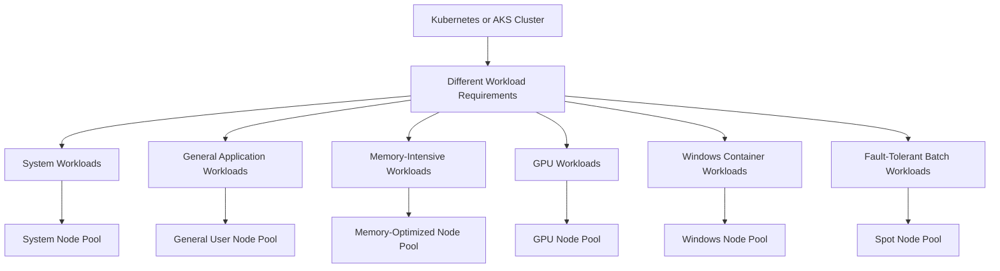

---

## 3. Node vs Node Pool

| Concept | Meaning |
|---|---|
| Node | One worker machine in a Kubernetes cluster |
| Node pool | A group of similarly configured worker nodes |
| Cluster | The complete Kubernetes environment |
| Pod | The smallest deployable workload unit |
| Deployment | A Kubernetes resource that manages Pod replicas |

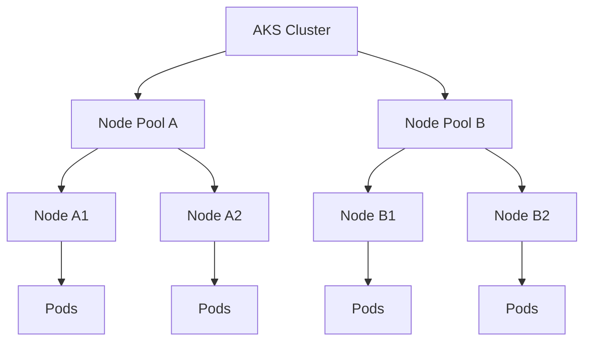

> **Interview distinction:**  
> A **Node** is one worker machine. A **node pool** is a collection of similar worker machines.

---

## 4. AKS Node Pool Architecture

In AKS, node pools contain the Azure virtual machines that run Kubernetes workloads.

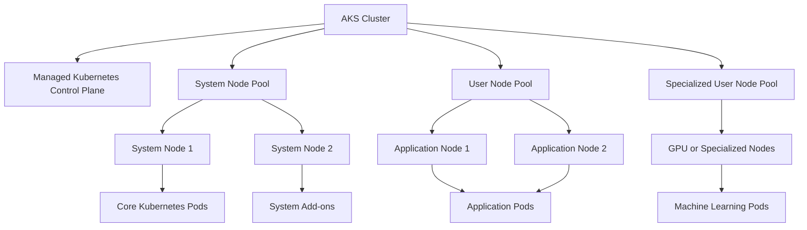

AKS uses node pools to organize nodes that share a configuration. The underlying nodes are commonly managed through Azure Virtual Machine Scale Sets. ([learn.microsoft.com](https://learn.microsoft.com/en-us/azure/aks/core-aks-concepts?utm_source=openai))

---

## 5. System Node Pools

A **system node pool** is intended primarily for critical Kubernetes system Pods.

Examples include:

- CoreDNS
- Metrics server
- Network components
- Cluster add-ons
- Other critical system services

System node pools are normally Linux-based and have specific requirements and restrictions.

For production environments, the system pool should have enough nodes and capacity to tolerate failures and maintenance operations.

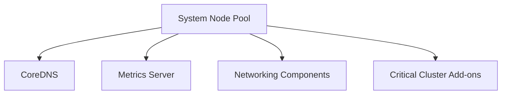

### Why Separate System Workloads?

Separating system workloads from application workloads helps prevent an application from consuming resources needed by critical cluster services.

For stronger isolation, a system node pool can be tainted so normal application Pods are not scheduled there.

Example taint:

```text
CriticalAddonsOnly=true:NoSchedule
```

> **Interview answer:**  
> A system node pool protects critical Kubernetes components from application workloads and helps improve cluster stability.

---

## 6. User Node Pools

A **user node pool** is primarily used for application workloads.

User pools can be configured for:

- General web applications
- APIs
- Background workers
- Batch processing
- Stateful services
- GPU workloads
- Windows containers
- High-memory applications
- Cost-optimized workloads

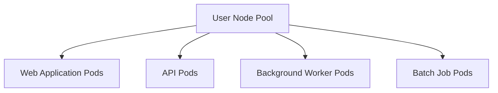

User node pools help isolate application workloads from system components.

---

## 7. System Pool vs User Pool

| Feature | System Node Pool | User Node Pool |
|---|---|---|
| Primary purpose | Run critical Kubernetes system Pods | Run application Pods |
| Typical workload | CoreDNS, metrics, network add-ons | APIs, web apps, workers, jobs |
| Application scheduling | Should generally be avoided | Primary purpose |
| OS support | Commonly Linux | Linux or Windows, depending on configuration |
| Isolation | Protects cluster services | Isolates application workloads |
| Scaling | Must preserve system capacity | Scales according to application demand |
| Production role | Required foundational pool | Added according to workload needs |

Microsoft recommends using user node pools to separate application Pods from critical system Pods. ([learn.microsoft.com](https://learn.microsoft.com/en-us/azure/aks/use-system-pools?utm_source=openai))

---

## 8. Node Pool Scheduling Flow

When a Pod is created, Kubernetes evaluates node-pool and node-level rules.

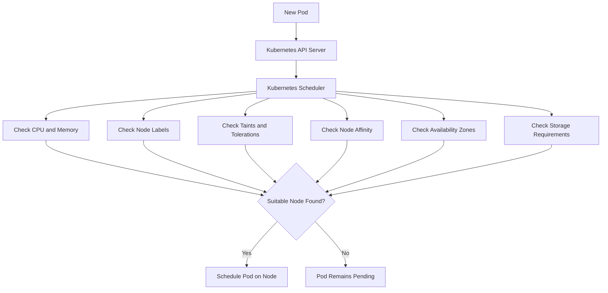

The scheduler does not select a node pool directly in most cases. Instead, it evaluates individual nodes. Node labels, taints, affinities, and resource requirements influence which pool can host the Pod.

---

## 9. Labels and Node Selectors

Labels identify characteristics of nodes.

Example labels:

```text
workload=frontend
workload=backend
hardware=gpu
os=windows
tier=memory-optimized
```

A Pod can use a `nodeSelector` to request a node with a matching label.

```yaml
apiVersion: v1
kind: Pod
metadata:
  name: frontend-pod
spec:
  nodeSelector:
    workload: frontend
  containers:
    - name: frontend
      image: example/frontend:1.0
```

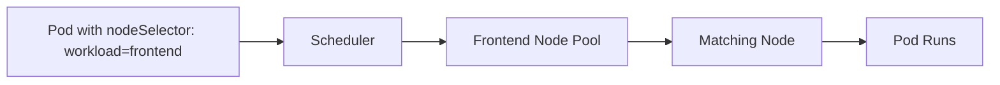

### Important Limitation

A node selector is simple and effective, but it may not be enough for complex scheduling requirements. Node affinity provides more expressive scheduling rules.

---

## 10. Taints and Tolerations

Taints prevent Pods from being scheduled on certain nodes unless the Pods have matching tolerations.

### Taint

A taint is applied to a Node or node pool.

Example:

```text
workload=gpu:NoSchedule
```

### Toleration

A Pod declares that it can tolerate the taint.

```yaml
tolerations:
  - key: workload
    operator: Equal
    value: gpu
    effect: NoSchedule
```

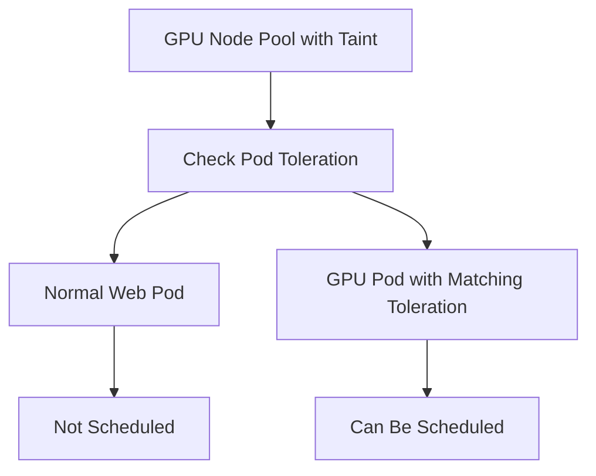

### Why Use Taints?

Use taints to:

- Protect system node pools
- Reserve GPU nodes
- Isolate regulated workloads
- Reserve nodes for batch jobs
- Prevent incompatible workloads from sharing nodes

---

## 11. Node Affinity

Node affinity expresses more advanced placement requirements.

Example requirements:

- Run on Linux nodes
- Run in a particular zone
- Prefer memory-optimized nodes
- Require a specific hardware label
- Prefer one pool but allow another

```yaml
affinity:
  nodeAffinity:
    requiredDuringSchedulingIgnoredDuringExecution:
      nodeSelectorTerms:
        - matchExpressions:
            - key: workload
              operator: In
              values:
                - memory-optimized
```

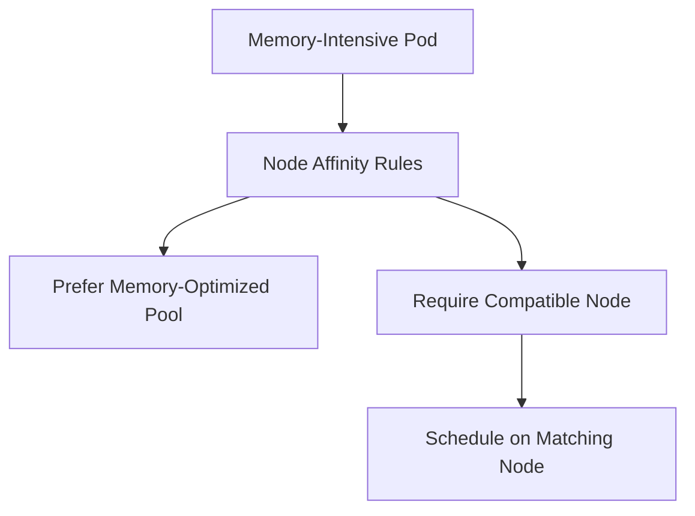

---

## 12. Common Node Pool Types

## 12.1 General-Purpose Pool

Used for:

- Web applications
- REST APIs
- Standard microservices
- Background workers

Typical characteristics:

- Balanced CPU and memory
- Standard VM sizes
- Normal autoscaling

---

## 12.2 Memory-Optimized Pool

Used for:

- In-memory processing
- Large caches
- Analytics
- JVM applications
- Memory-intensive services

---

## 12.3 Compute-Optimized Pool

Used for:

- CPU-heavy processing
- Compilation
- High-throughput services
- Scientific workloads

---

## 12.4 GPU Pool

Used for:

- Machine learning
- Image recognition
- Video processing
- Parallel computation

GPU pools should normally be tainted so only GPU-capable workloads are scheduled there.

---

## 12.5 Windows Pool

Used for:

- Windows containers
- .NET Framework workloads
- Applications requiring Windows-specific APIs

An AKS cluster normally uses Linux for its system pool, and Windows workloads require an additional Windows user pool. ([learn.microsoft.com](https://learn.microsoft.com/en-us/azure/aks/use-system-pools?utm_source=openai))

---

## 12.6 Spot Pool

Used for:

- Batch processing
- Fault-tolerant workloads
- Development environments
- Stateless workers
- Interruptible workloads

Spot capacity can be reclaimed, so critical workloads should not depend on it exclusively.

---

## 13. Node Pool Scaling

Node pools can scale manually or automatically.

### Scale-Out Flow

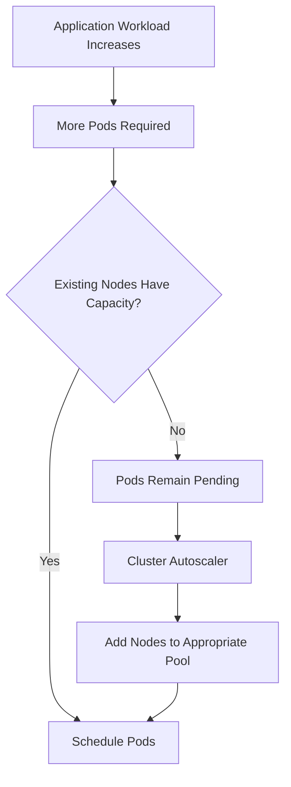

### Scale-In Flow

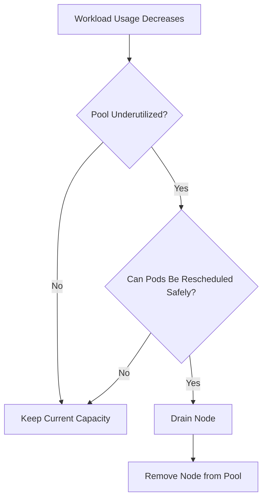

---

## 14. Autoscaling Configuration

A user node pool may be configured with:

- Minimum node count
- Maximum node count
- Initial node count
- Autoscaling enabled or disabled
- VM size
- Maximum Pods per node

Conceptual configuration:

```yaml
nodePool:
  name: apppool
  mode: User
  vmSize: Standard_D4s_v5
  enableAutoScaling: true
  minCount: 2
  maxCount: 10
  maxPods: 30
```

The exact configuration depends on the Azure deployment method, such as Azure CLI, Bicep, Terraform, or ARM templates.

---

## 15. Node Pool and Pod Autoscaling

Node-pool autoscaling and Pod autoscaling solve different problems.

### Horizontal Pod Autoscaler

Changes the number of application Pod replicas.

### Cluster Autoscaler

Changes the number of worker Nodes.

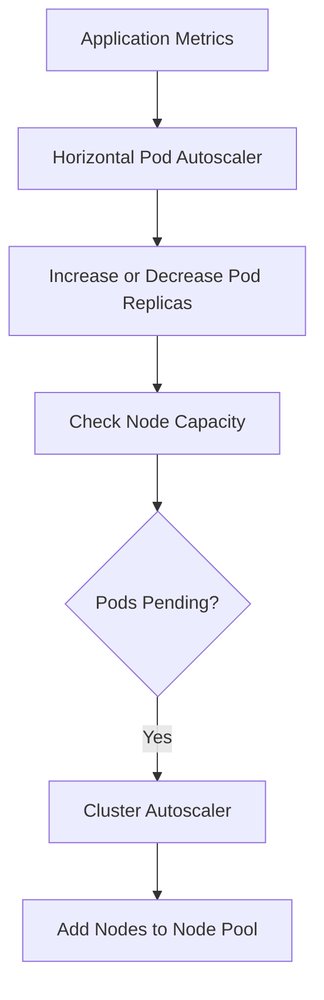

> **Interview answer:**  
> HPA scales the workload. Cluster autoscaler scales the infrastructure that hosts the workload.

---

## 16. Node Pool and Availability Zones

A node pool can be distributed across availability zones, depending on the Azure region and supported configuration.

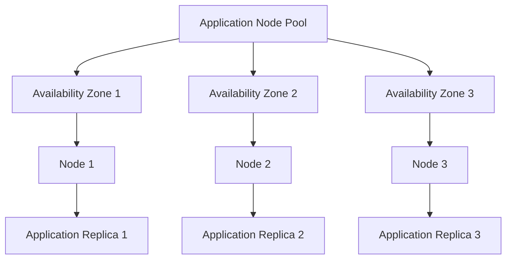

Benefits include:

- Improved fault isolation
- Better resilience to zone-level failures
- Safer maintenance
- Better workload distribution

Availability zones must be combined with Pod distribution rules. Simply creating nodes in multiple zones does not guarantee that replicas are evenly distributed.

---

## 17. Pod Distribution Across Node Pools

To achieve high availability:

- Use multiple replicas
- Spread replicas across Nodes
- Spread replicas across zones
- Use pod anti-affinity
- Use topology spread constraints
- Configure Pod Disruption Budgets

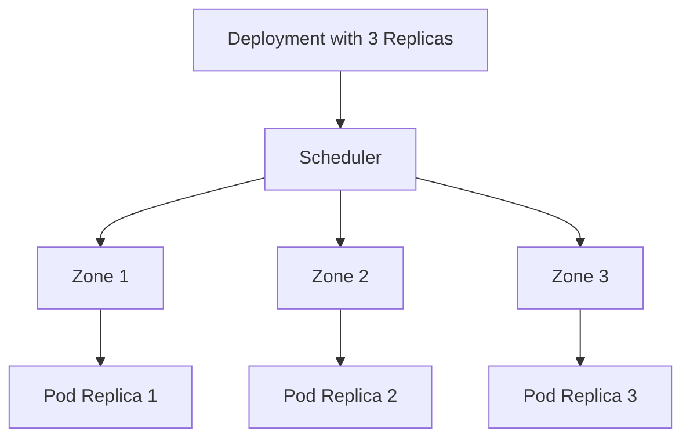

---

## 18. Dedicated Node Pools

A dedicated node pool reserves capacity for a particular workload category.

Examples:

- Payment services
- Regulated workloads
- Machine-learning workloads
- Infrastructure tools
- Performance-sensitive services
- Windows applications

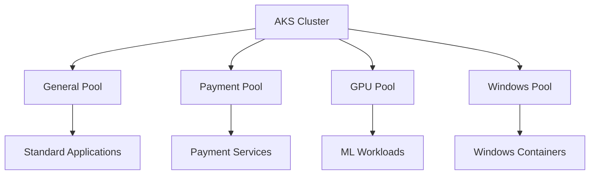

Dedicated pools provide stronger operational separation but may increase cost because capacity cannot always be shared efficiently.

---

## 19. Node Pool and Security Isolation

Node pools can support workload isolation through:

- Taints and tolerations
- Labels and selectors
- Network policies
- Separate identities
- Separate namespaces
- Dedicated VM sizes
- Separate availability zones
- Azure Policy controls

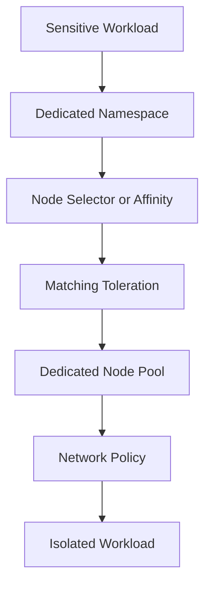

Node pools alone are not a complete security boundary. Use them with identity, network, Pod security, image security, and data protection controls.

---

## 20. Node Pool and Operating Systems

A cluster can use different operating systems in different node pools.

Examples:

- Linux system pool
- Linux application pool
- Windows application pool

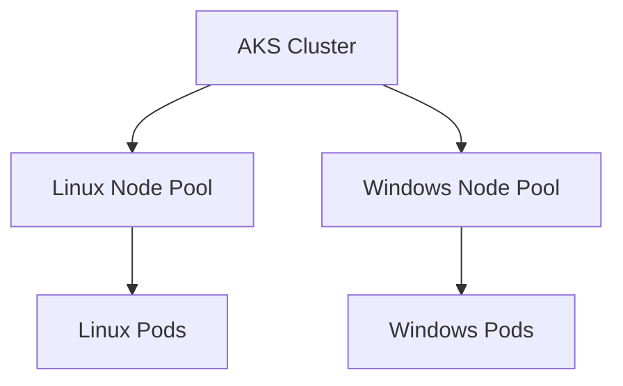

The Pod must be compatible with the operating system of the Node on which it runs.

Use labels, selectors, taints, and tolerations to prevent incompatible workloads from being scheduled incorrectly.

---

## 21. Node Pool Upgrades

Node pools require lifecycle management.

Upgrade activities may include:

- Kubernetes version upgrades
- Node image upgrades
- Operating system patching
- VM size changes
- Security updates
- Configuration changes

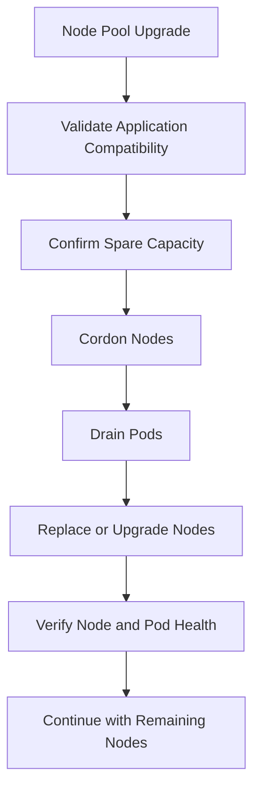

### Upgrade Best Practices

- Test in non-production first
- Review deprecated Kubernetes APIs
- Maintain multiple replicas
- Configure Pod Disruption Budgets
- Ensure spare capacity
- Monitor application health
- Use controlled rollout
- Have rollback or recovery procedures

---

## 22. Node Pool Maintenance

Maintenance may require:

- Cordon
- Drain
- Node replacement
- Image upgrade
- VM size change
- Scaling
- Label updates
- Taint updates

Example commands:

```bash
kubectl cordon <node-name>
kubectl drain <node-name> --ignore-daemonsets
kubectl uncordon <node-name>
```

For AKS node-pool management, Azure CLI commands commonly include:

```bash
az aks nodepool list \
  --resource-group <resource-group> \
  --cluster-name <cluster-name>

az aks nodepool show \
  --resource-group <resource-group> \
  --cluster-name <cluster-name> \
  --name <node-pool-name>
```

---

## 23. Adding a Node Pool

A new node pool is useful when a new workload has different requirements.

Example scenario:

- Existing pool runs Linux web APIs
- New workload requires Windows containers
- Add a Windows user node pool
- Apply labels and tolerations
- Schedule Windows Pods onto that pool

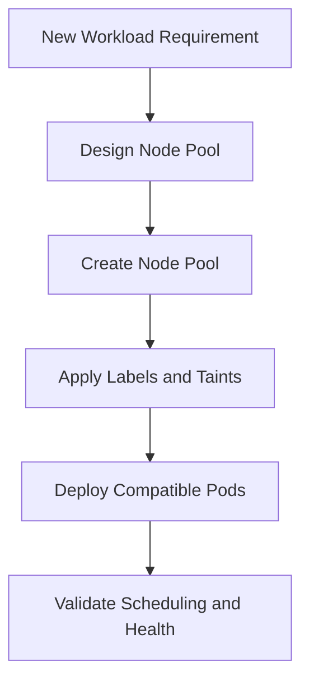

Conceptual Azure CLI example:

```bash
az aks nodepool add \
  --resource-group <resource-group> \
  --cluster-name <cluster-name> \
  --name apppool \
  --node-count 2 \
  --node-vm-size Standard_D4s_v5 \
  --mode User \
  --enable-cluster-autoscaler \
  --min-count 2 \
  --max-count 6
```

The exact command options may vary by AKS version, operating system, and deployment requirements.

---

## 24. Removing a Node Pool

Before removing a node pool:

1. Identify workloads running there
2. Confirm they can run elsewhere
3. Add or scale replacement capacity
4. Apply scheduling changes if needed
5. Drain the pool safely
6. Verify workload health
7. Delete the pool

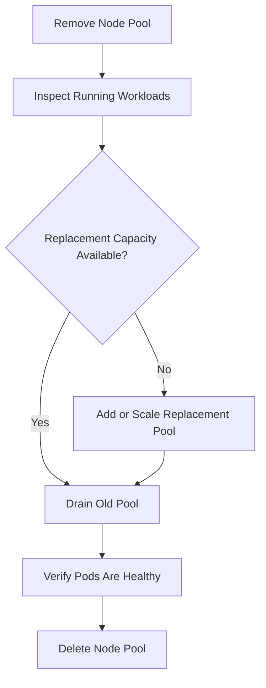

Never delete a node pool without understanding its workloads, storage, and scheduling dependencies.

---

## 25. Node Pool Cost Optimization

Node pools can improve cost efficiency by matching infrastructure to workload needs.

Strategies include:

- Use smaller VMs for lightweight workloads
- Use memory-optimized VMs for memory-heavy services
- Use GPU nodes only where required
- Use Spot nodes for fault-tolerant workloads
- Enable autoscaling
- Scale non-production pools down after hours
- Avoid excessive dedicated pools
- Review idle capacity
- Set appropriate Pod resource requests and limits
- Use separate pools only when the isolation benefit justifies the cost

```mermaid
flowchart TD
    Workload["Workload"] --> Profile["Profile CPU, Memory, and Traffic"]
    Profile --> Match["Match Workload to Node Size"]
    Match --> Autoscale["Configure Pool Autoscaling"]
    Autoscale --> Review["Review Utilization and Cost"]
    Review --> Optimize["Resize, Consolidate, or Reconfigure"]
```

---

## 26. Node Pool Design Example

### Requirements

An organization runs:

- Standard web APIs
- Background workers
- Machine-learning jobs
- Windows services
- Critical Kubernetes add-ons

### Recommended Design

```mermaid
flowchart TB
    AKS["AKS Cluster"] --> SystemPool["System Pool"]
    AKS --> AppPool["General Application Pool"]
    AKS --> WorkerPool["Worker Pool"]
    AKS --> GPUPool["GPU Pool"]
    AKS --> WindowsPool["Windows Pool"]

    SystemPool --> System["CoreDNS and System Add-ons"]
    AppPool --> APIs["Web and API Pods"]
    WorkerPool --> Workers["Background Workers"]
    GPUPool --> ML["Machine Learning Jobs"]
    WindowsPool --> Windows["Windows Containers"]
```

### Scheduling Rules

- System Pool: reserved for system components
- App Pool: receives standard API workloads
- Worker Pool: receives background processing
- GPU Pool: tainted and reserved for GPU workloads
- Windows Pool: selected by Windows-compatible Pods

---

## 27. Node Pool Failure Scenario

### Scenario

A user node pool loses one Node.

```mermaid
flowchart TD
    Failure["Node Failure"] --> Detect["AKS Detects Node Health Problem"]
    Detect --> NotReady["Node Becomes NotReady"]
    NotReady --> Controller["Deployment Detects Missing Replicas"]
    Controller --> Replacement["Create Replacement Pods"]
    Replacement --> Scheduler["Schedule on Healthy Nodes"]
    Scheduler --> Ready["Readiness Probes Pass"]
    Ready --> Traffic["Service Routes Traffic"]
```

Recovery depends on:

- Available capacity in the remaining Nodes
- Replica count
- Pod scheduling rules
- Persistent storage
- Pod Disruption Budgets
- Application readiness
- Autoscaler configuration

---

## 28. Node Pool vs Availability Set

These are different concepts.

| Concept | Purpose |
|---|---|
| Node pool | Group of Kubernetes worker Nodes with similar configuration |
| Availability zone | Physically separate Azure location within a region |
| Availability set | Logical grouping for VM fault and update domains |
| VM Scale Set | Azure compute scaling mechanism used by many AKS node pools |

Node pools organize Kubernetes workload infrastructure. Availability zones and VM Scale Sets provide underlying Azure infrastructure capabilities.

---

## 29. Node Pool vs Namespace

| Feature | Node Pool | Namespace |
|---|---|---|
| Isolation level | Infrastructure placement | Logical Kubernetes organization |
| Controls | VM size, OS, hardware, scaling | Access, quotas, resource organization |
| Applies to | Nodes and Pods | Kubernetes resources |
| Example | GPU node pool | `payments` namespace |
| Main purpose | Run workloads on suitable infrastructure | Organize and govern workloads |

Use both when necessary:

```mermaid
flowchart LR
    Namespace["Payments Namespace"] --> Policy["RBAC and Resource Quotas"]
    Policy --> Scheduling["Node Affinity and Tolerations"]
    Scheduling --> Pool["Dedicated Payment Node Pool"]
```

---

## 30. Node Pool vs Pod

| Feature | Node Pool | Pod |
|---|---|---|
| Represents | Group of worker machines | Application workload instance |
| Contains | Nodes | One or more containers |
| Scaling | Adds or removes Nodes | Adds or removes replicas |
| Managed by | AKS and cluster operations | Kubernetes controllers |
| Main purpose | Provide infrastructure capacity | Run application code |
| Example | `gpu-pool` | `ml-inference-pod` |

> **Interview phrase:**  
> **Pods consume capacity from node pools. Node pools provide the infrastructure on which Pods run.**

---

## 31. Common Node Pool Mistakes

1. Running application workloads only on the system pool
2. Creating too many small pools with idle capacity
3. Forgetting to configure autoscaling
4. Using GPU nodes for ordinary workloads
5. Missing taints and tolerations for specialized pools
6. Scheduling Windows Pods onto Linux pools
7. Placing all replicas in one pool or zone
8. Ignoring Pod resource requests
9. Deleting a pool without checking workloads
10. Failing to test node-pool upgrades
11. Assuming node pools alone provide security isolation
12. Forgetting storage and availability-zone constraints

---

## 32. Interview Questions and Strong Answers

### Q1: What is a node pool?

**Answer:** A node pool is a group of similarly configured Kubernetes worker nodes. In AKS, it is commonly a group of Azure virtual machines with the same VM size, operating system, labels, taints, and scaling configuration.

### Q2: Why do we need multiple node pools?

**Answer:** Multiple node pools allow us to match infrastructure to workload requirements, isolate system and application workloads, support different operating systems, use specialized hardware, and optimize cost.

### Q3: What is the difference between a system node pool and a user node pool?

**Answer:** A system node pool primarily runs critical Kubernetes system Pods such as CoreDNS and networking components. A user node pool primarily runs application Pods.

### Q4: Can application Pods run on a system node pool?

**Answer:** They may be technically schedulable depending on configuration, but it is generally better to isolate application Pods on user node pools. A taint can be used to prevent normal application scheduling on the system pool.

### Q5: How do you schedule a Pod to a specific node pool?

**Answer:** Apply labels to the nodes or pool and use `nodeSelector`, node affinity, taints, and tolerations in the Pod specification.

### Q6: How does a node pool scale?

**Answer:** A node pool can scale manually or through the cluster autoscaler. The autoscaler adds Nodes when Pods cannot be scheduled and removes underutilized Nodes when Pods can be safely rescheduled.

### Q7: What is the difference between HPA and cluster autoscaler?

**Answer:** HPA changes the number of application Pod replicas. Cluster autoscaler changes the number of worker Nodes available to run those Pods.

### Q8: Can one AKS cluster contain Linux and Windows node pools?

**Answer:** Yes. A Linux system pool is used for core system components, and Windows workloads can run on an additional Windows user pool.

### Q9: How do you use GPU node pools?

**Answer:** Create a node pool with GPU-capable VM sizes, apply labels and taints, and configure GPU workloads with matching node selectors and tolerations.

### Q10: How do node pools improve availability?

**Answer:** They allow workloads to be distributed across multiple Nodes, zones, and infrastructure types. Combined with replicas, topology rules, and disruption budgets, they reduce the impact of Node or zone failures.

### Q11: How do node pools improve cost management?

**Answer:** They let us match workload requirements to appropriate VM sizes, use Spot capacity for interruptible workloads, scale pools independently, and avoid running all workloads on expensive hardware.

### Q12: What happens when a node pool is upgraded?

**Answer:** Nodes are normally upgraded or replaced in a controlled process. Workloads are cordoned and drained, replacement Nodes are added, Pods are rescheduled, and health is verified during the rollout.

### Q13: Can a node pool be deleted safely?

**Answer:** Only after confirming that workloads, storage, scheduling rules, and replacement capacity are available elsewhere. The pool should be drained and workload health verified before deletion.

### Q14: Are node pools a security boundary?

**Answer:** Node pools can support isolation, but they are not a complete security boundary. They should be combined with identity, network policies, Pod security, image security, RBAC, and data protection controls.

---

## 33. 60-Second Interview Pitch

> A node pool is a group of similarly configured worker nodes in Kubernetes. In AKS, each pool commonly contains Azure virtual machines with the same VM size, operating system, labels, taints, availability-zone configuration, and autoscaling settings. I use a system node pool for critical Kubernetes components and user node pools for application workloads. Additional pools can support GPU workloads, Windows containers, memory-intensive services, or Spot-based batch processing. Pods are scheduled to suitable pools using resource requests, labels, node selectors, affinity, taints, and tolerations. Node pools also allow independent scaling, better workload isolation, improved availability, and cost optimization. I always plan pool capacity, upgrades, disruption handling, storage, and multi-zone placement together.

---

## 34. Final Revision Checklist

- [ ] A node pool is a group of similar worker Nodes
- [ ] Node pools provide infrastructure capacity for Pods
- [ ] System pools run critical Kubernetes components
- [ ] User pools run application workloads
- [ ] Labels influence workload placement
- [ ] Taints prevent incompatible scheduling
- [ ] Tolerations allow approved workloads onto tainted Nodes
- [ ] Node affinity supports advanced placement
- [ ] HPA scales Pods
- [ ] Cluster autoscaler scales Nodes
- [ ] Node pools can use different VM sizes
- [ ] Node pools can support Linux and Windows workloads
- [ ] GPU workloads should use GPU-capable pools
- [ ] Spot pools are suitable for fault-tolerant workloads
- [ ] Multiple zones improve resilience
- [ ] Resource requests improve scheduling
- [ ] Autoscaling improves elasticity
- [ ] Dedicated pools can improve isolation
- [ ] Too many pools can increase cost
- [ ] Pool upgrades require controlled draining
- [ ] Pool deletion requires workload and storage analysis
- [ ] Node pools are not a complete security boundary
- [ ] AKS node pools commonly use Azure VM Scale Sets
- [ ] Production designs should protect system workloads from application workloads

---

## One-Line Conclusion

> A node pool is a group of similarly configured Kubernetes worker nodes that provides organized, scalable, isolated, and workload-specific infrastructure for running Pods.