# What Is a Node in Kubernetes?
## Detailed Interview Preparation Guide with Flow Charts

---

## 1. Direct Interview Answer

A **Node** is a worker machine in a Kubernetes cluster that runs application workloads.

A Node can be:

- A virtual machine
- A physical server
- A cloud-based compute instance

In Azure Kubernetes Service, a Node is generally an Azure virtual machine that runs Kubernetes components and hosts application Pods.

A Node provides:

- CPU
- Memory
- Storage
- Network connectivity
- Container runtime
- Kubernetes node agents

> **One-line interview answer:**  
> **A Node is a worker machine in Kubernetes that runs Pods and provides the compute, storage, and networking resources required by containerized applications.**

---

## 2. Kubernetes Cluster Architecture

A Kubernetes cluster usually contains:

1. **Control plane**
2. **Worker Nodes**

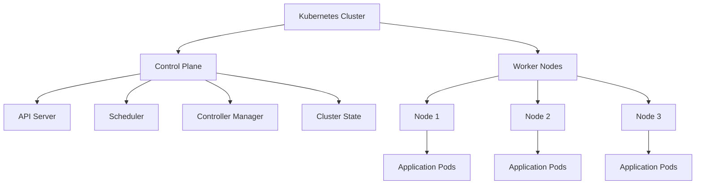

### Control Plane

The control plane:

- Receives requests
- Stores cluster state
- Schedules Pods
- Monitors cluster health
- Maintains the desired state

### Worker Node

A worker Node:

- Runs Pods
- Provides compute resources
- Runs the container runtime
- Communicates with the control plane
- Reports health and status

> Interview phrase:  
> **The control plane decides what should run; Nodes execute the workloads.**

---

## 3. What Runs on a Node?

A Node normally contains:

1. `kubelet`
2. Container runtime
3. Kubernetes networking component
4. Operating system
5. Application Pods

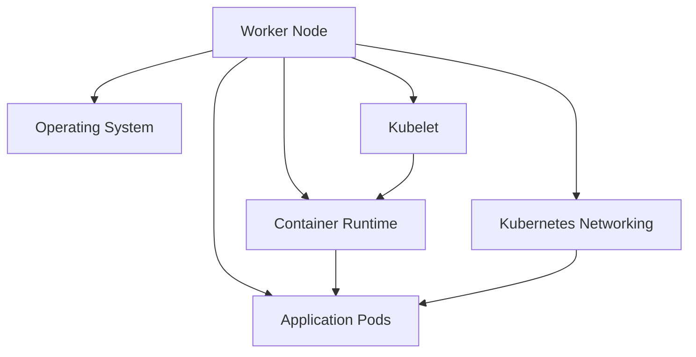

---

## 4. Node Components

## 4.1 Kubelet

The **kubelet** is the primary Kubernetes agent running on every Node.

Its responsibilities include:

- Registering the Node with the cluster
- Watching for assigned Pods
- Starting and stopping containers
- Reporting Pod status
- Reporting Node health
- Executing health probes
- Mounting volumes
- Communicating with the container runtime

The kubelet does not usually schedule Pods. Scheduling is handled by the control-plane scheduler.

---

## 4.2 Container Runtime

The container runtime is responsible for running containers.

It handles:

- Pulling container images
- Starting containers
- Stopping containers
- Restarting containers
- Managing container processes
- Reporting container status

Examples of container runtimes include:

- containerd
- CRI-O

Kubernetes communicates with the runtime through the Container Runtime Interface.

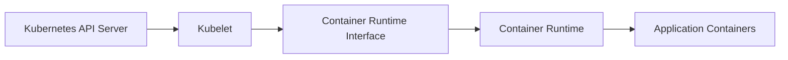

---

## 4.3 Kubernetes Networking

Node networking enables communication between:

- Pods on the same Node
- Pods on different Nodes
- Services
- External clients
- Azure resources
- Control-plane components

Networking components may provide:

- Pod IP allocation
- Service routing
- Network policy enforcement
- DNS resolution
- Ingress and egress connectivity

---

## 4.4 Operating System

The Node operating system provides:

- Process management
- File systems
- Networking
- Security controls
- Device management
- Resource isolation

The OS may be:

- Linux
- Windows Server, where supported by the workload and cluster design

---

## 5. Node Registration Flow

When a Node joins a Kubernetes cluster, it registers with the control plane.

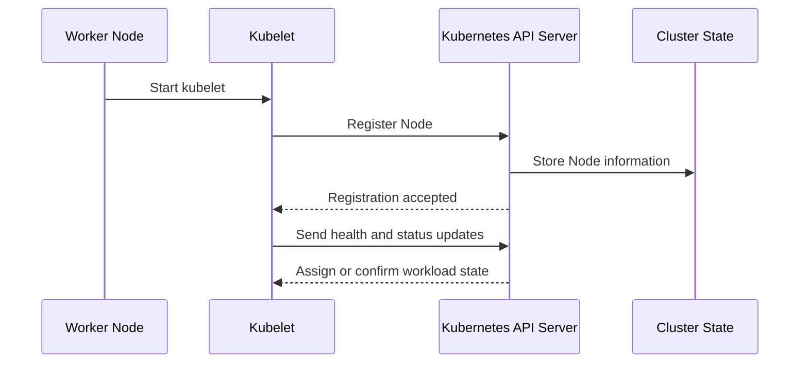

The control plane tracks information such as:

- Node name
- Node labels
- Node capacity
- Node allocatable resources
- Node conditions
- Operating system
- Architecture
- Kubernetes version
- Kubelet version
- Taints
- Addresses

---

## 6. Node Scheduling Flow

When a Deployment or Pod is created, the scheduler selects a suitable Node.

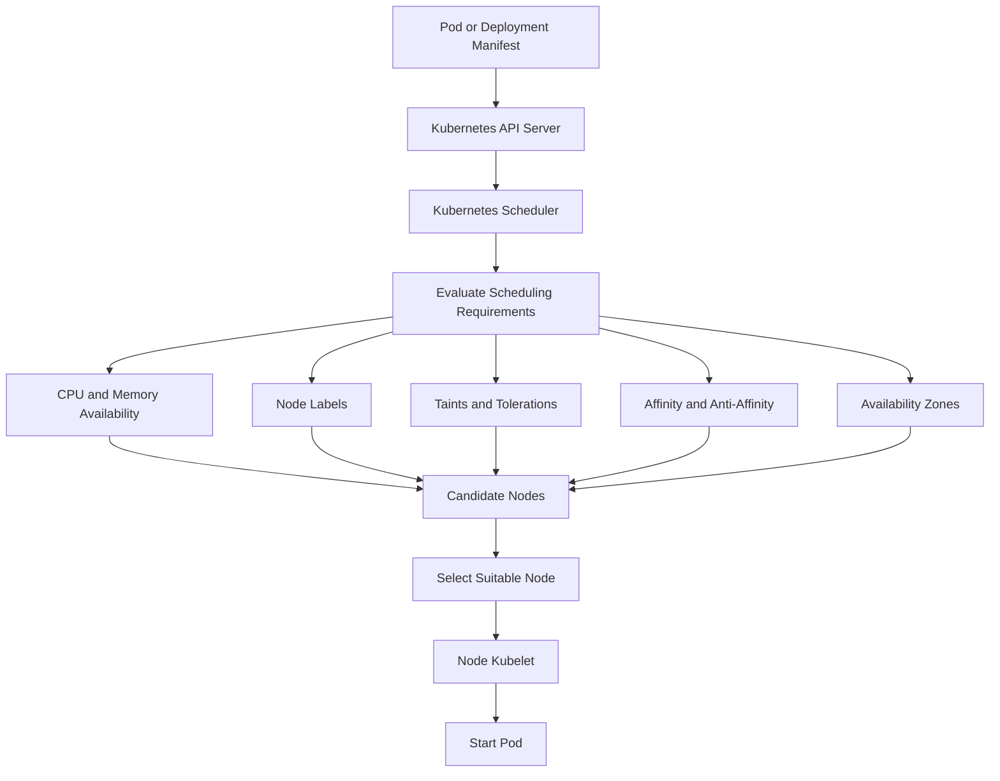

The scheduler may evaluate:

- CPU requests
- Memory requests
- Node selectors
- Node affinity
- Pod affinity
- Pod anti-affinity
- Taints and tolerations
- Persistent volume requirements
- Availability-zone constraints
- Topology spread rules

---

## 7. Node Resources

Each Node has capacity that can be used by Pods.

Important resource concepts:

- **Capacity:** Total resources available on the Node
- **Allocatable:** Resources available for Pods after reserving resources for the operating system and Kubernetes components
- **Requests:** Resources a Pod asks the scheduler to reserve
- **Limits:** Maximum resources a container can use

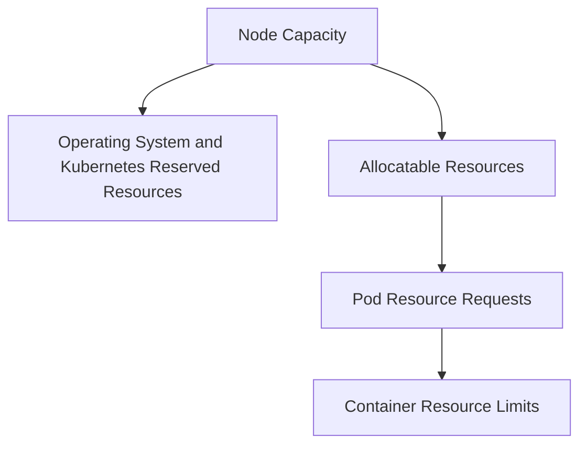

Example:

```yaml
apiVersion: v1
kind: Pod
metadata:
  name: resource-example
spec:
  containers:
    - name: app
      image: nginx:1.27
      resources:
        requests:
          cpu: "250m"
          memory: "128Mi"
        limits:
          cpu: "500m"
          memory: "256Mi"
```

### Why Resource Requests Matter

Resource requests help Kubernetes:

- Select a suitable Node
- Prevent overcommitment
- Improve scheduling decisions
- Support autoscaling
- Improve capacity planning

---

## 8. Node Conditions

Kubernetes reports Node conditions to describe its health.

Common conditions include:

| Condition | Meaning |
|---|---|
| `Ready` | Node is healthy and able to run Pods |
| `MemoryPressure` | Node has insufficient memory |
| `DiskPressure` | Node has insufficient disk space |
| `PIDPressure` | Node has too many processes |
| `NetworkUnavailable` | Node networking is not configured correctly |

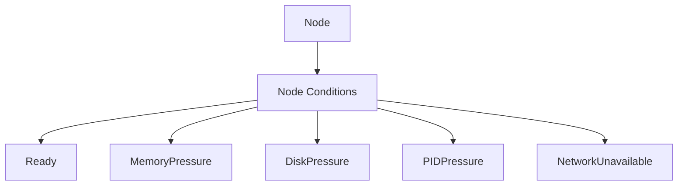

A Node may be marked unavailable when it cannot safely run workloads.

---

## 9. Node Ready State

A Node is usually considered ready when:

- The kubelet is running
- The container runtime is available
- Networking is functioning
- The Node can communicate with the control plane
- Required system components are healthy

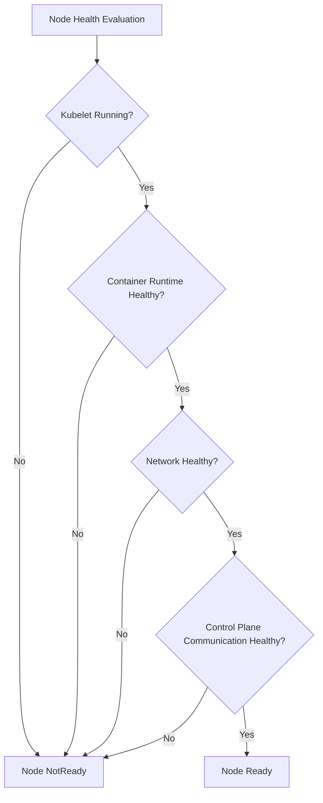

When a Node becomes `NotReady`, Kubernetes may stop scheduling new Pods on it and may eventually move existing workloads elsewhere.

---

## 10. Node Labels

Labels are key-value pairs attached to Nodes.

They help control Pod placement.

Example:

```bash
kubectl label nodes node-1 workload=compute
kubectl label nodes node-2 workload=memory
```

A Pod can select Nodes using a label:

```yaml
apiVersion: v1
kind: Pod
metadata:
  name: compute-pod
spec:
  nodeSelector:
    workload: compute
  containers:
    - name: app
      image: example/app:1.0
```

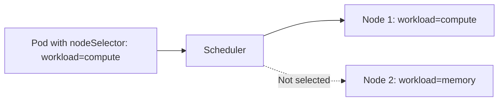

Use labels when a workload has specific infrastructure requirements.

---

## 11. Taints and Tolerations

### Taint

A taint prevents Pods from being scheduled on a Node unless they tolerate the taint.

### Toleration

A toleration allows a Pod to be scheduled on a tainted Node.

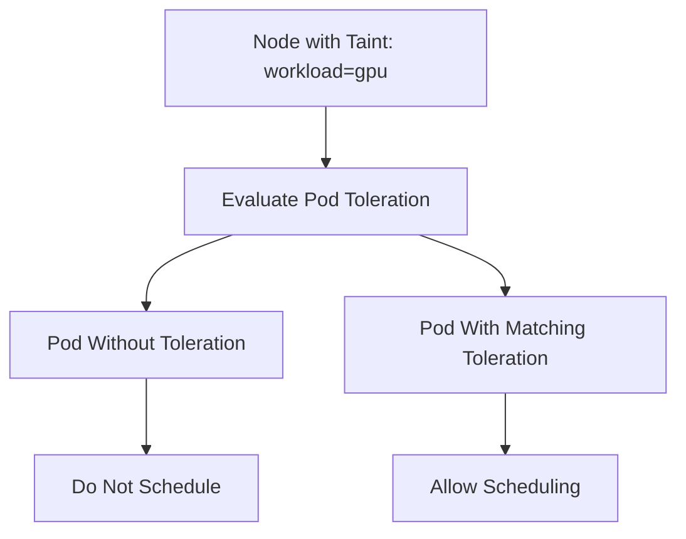

Example Node taint:

```bash
kubectl taint nodes node-1 workload=gpu:NoSchedule
```

Example Pod toleration:

```yaml
tolerations:
  - key: "workload"
    operator: "Equal"
    value: "gpu"
    effect: "NoSchedule"
```

Common use cases:

- GPU workloads
- Dedicated workloads
- System workloads
- Regulated workloads
- Special hardware
- Workloads that require isolation

---

## 12. Node Affinity and Anti-Affinity

### Node Affinity

Requests that a Pod run on Nodes with specific characteristics.

### Pod Anti-Affinity

Requests that Pods should be separated from one another.

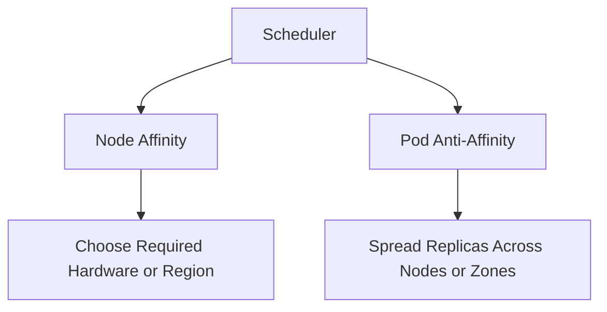

Example use case:

- Place application Pods on Nodes labeled `workload=frontend`
- Keep replicas from running on the same Node
- Spread replicas across availability zones

---

## 13. Pods and Nodes Relationship

A Node can run multiple Pods.

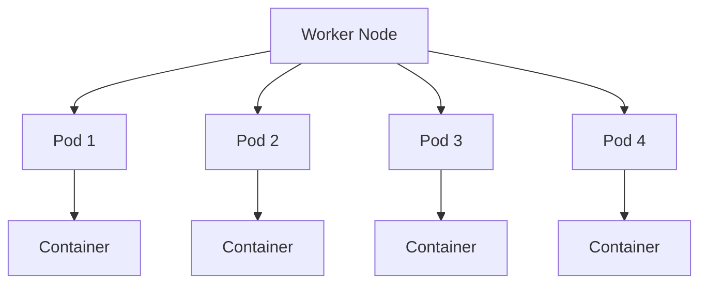

The number of Pods a Node can run depends on:

- CPU
- Memory
- Pod density limits
- Network IP availability
- Storage capacity
- Kubernetes system overhead
- Resource requests
- Scheduling constraints

---

## 14. Node Pool

A **Node pool** is a group of Nodes with the same configuration.

Node pools can differ by:

- VM size
- Operating system
- CPU and memory
- GPU capability
- Availability zone
- Kubernetes labels
- Taints
- Scaling configuration
- Workload type

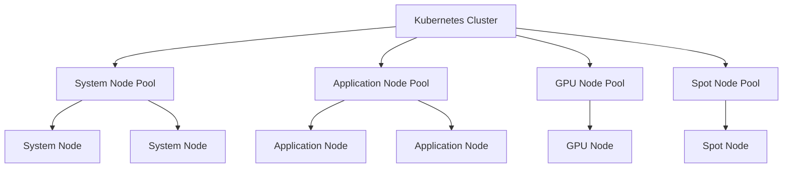

### System Node Pool

Runs critical cluster components.

### User Node Pool

Runs application workloads.

### GPU Node Pool

Runs workloads that require GPU hardware.

### Spot Node Pool

Runs fault-tolerant workloads at lower cost, with the understanding that capacity can be reclaimed.

---

## 15. Nodes in AKS

In Azure Kubernetes Service:

- A Node is usually an Azure virtual machine
- Nodes are grouped into node pools
- Pods run on Nodes
- Node pools can use different VM sizes
- Node pools can span availability zones
- Cluster autoscaler can add or remove Nodes
- Azure manages the underlying infrastructure according to the selected AKS configuration

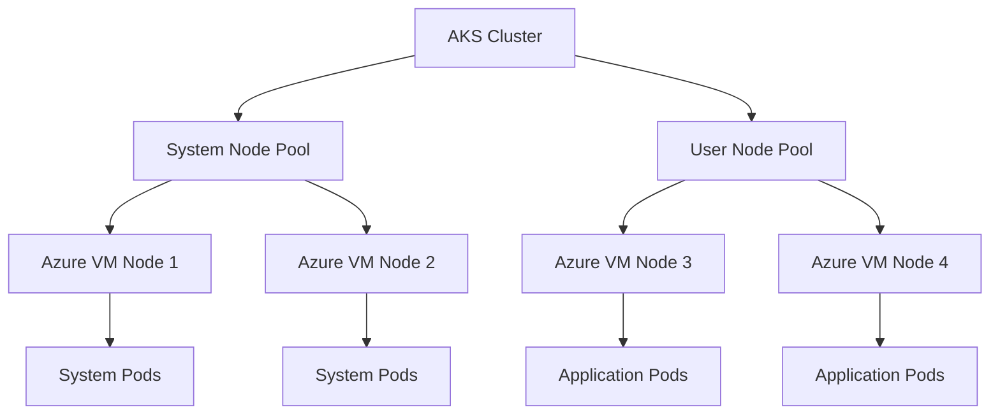

> Interview point:  
> **In AKS, the control plane is managed by Azure, but worker Nodes and the workloads running on them remain part of the platform design and operations model.**

---

## 16. Node Scaling

Node scaling can happen manually or automatically.

### Manual Scaling

An operator changes the number of Nodes in a node pool.

### Cluster Autoscaler

The cluster autoscaler adds Nodes when Pods cannot be scheduled due to insufficient capacity and removes underutilized Nodes when safe.

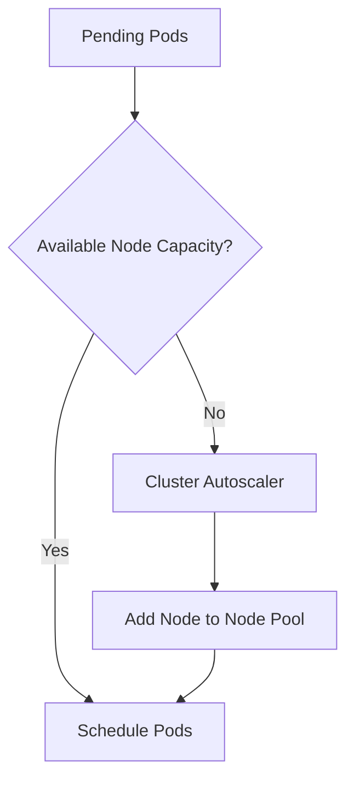

### Scale-In Flow

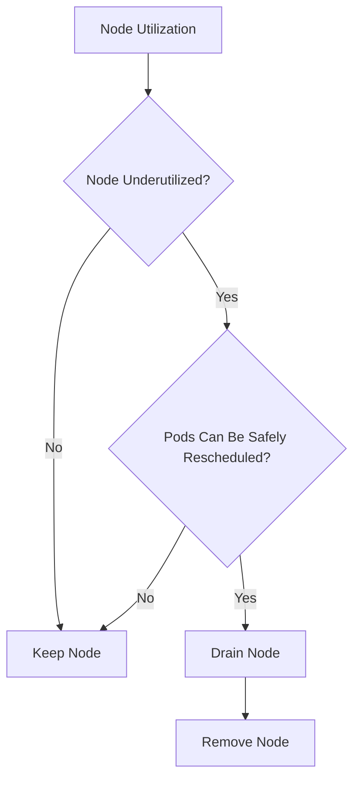

---

## 17. Node Failure and Pod Recovery

When a Node fails:

1. The control plane detects that the Node is unhealthy
2. The Node may be marked `NotReady`
3. New Pods are not scheduled there
4. Managed workloads may be recreated
5. The scheduler places replacement Pods on healthy Nodes
6. Services route traffic to available Pods

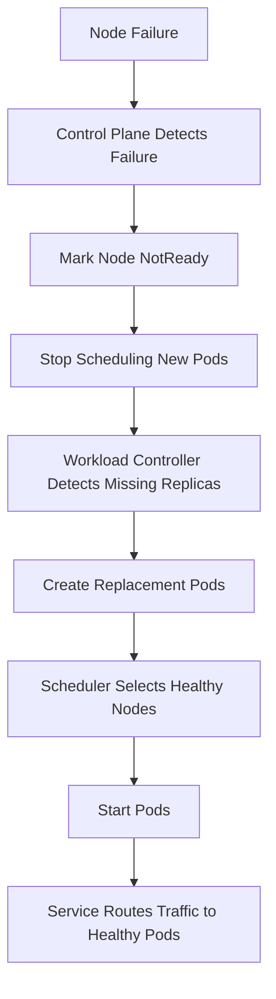

The recovery behavior depends on:

- Workload controller
- Pod disruption settings
- Storage design
- Readiness probes
- Available cluster capacity
- Application state management

---

## 18. Node Drain

Draining a Node prepares it for maintenance or removal.

During a drain:

1. New Pods are prevented from being scheduled
2. Existing Pods are evicted where possible
3. Controllers create replacement Pods
4. Replacement Pods run on other Nodes
5. The Node can be maintained or removed

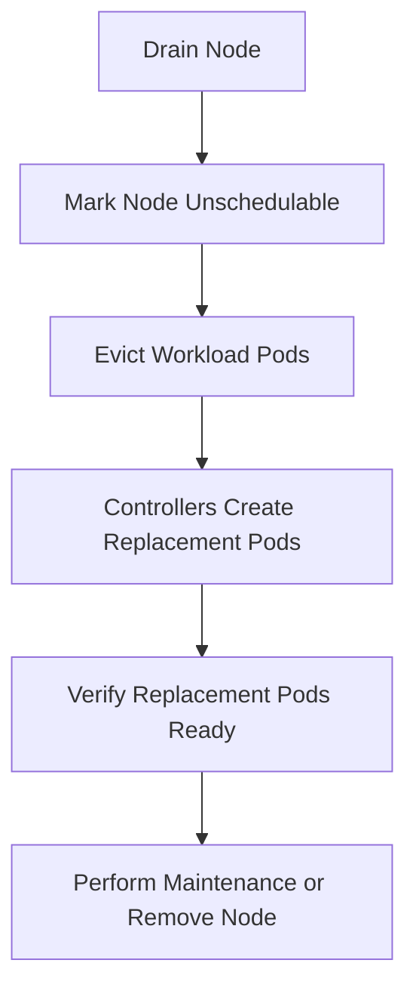

Useful commands:

```bash
kubectl cordon <node-name>
kubectl drain <node-name> --ignore-daemonsets
kubectl uncordon <node-name>
```

### Cordon vs Drain

- **Cordon:** Prevents new Pods from being scheduled on the Node
- **Drain:** Cordon plus eviction of existing workload Pods

---

## 19. DaemonSet and Nodes

A **DaemonSet** ensures that a Pod runs on every eligible Node.

Common uses:

- Log collection
- Monitoring agents
- Network agents
- Security agents
- Storage drivers

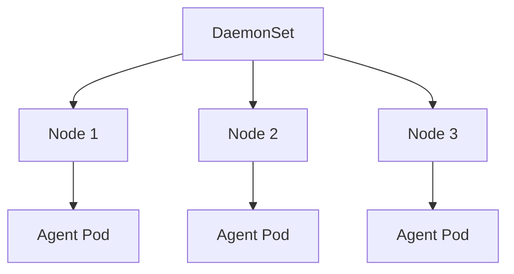

When a new Node joins, the DaemonSet controller can create the required Pod on it.

---

## 20. Node and Stateful Workloads

Stateful workloads require additional design because Nodes can fail or be replaced.

Consider:

- Persistent Volumes
- StatefulSets
- Storage topology
- Data replication
- Backup and restore
- Pod rescheduling
- Availability zones
- Database failover

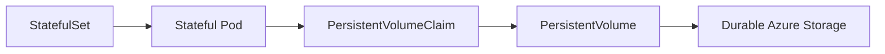

Do not assume that moving a Pod to another Node automatically moves its data safely. Storage must support the required topology and failover behavior.

---

## 21. Node Availability Design

To improve availability:

- Use multiple Nodes
- Use multiple availability zones
- Spread replicas across Nodes
- Use Pod anti-affinity
- Use topology spread constraints
- Configure Pod Disruption Budgets
- Use readiness probes
- Maintain sufficient spare capacity
- Use multiple node pools where appropriate
- Test Node failure and drain scenarios

```mermaid
flowchart TB
    Service["Kubernetes Service"] --> Zone1["Availability Zone 1"]
    Service --> Zone2["Availability Zone 2"]
    Service --> Zone3["Availability Zone 3"]

    Zone1 --> Node1["Node 1"]
    Zone2 --> Node2["Node 2"]
    Zone3 --> Node3["Node 3"]

    Node1 --> Pod1["Replica 1"]
    Node2 --> Pod2["Replica 2"]
    Node3 --> Pod3["Replica 3"]
```

---

## 22. Node Security

Secure Nodes using:

- Minimal operating system images
- Regular patching
- Restricted administrative access
- Network security controls
- Managed identities
- Disk encryption
- Secure boot where supported
- Trusted images
- Runtime security monitoring
- Least-privilege permissions
- Centralized audit logs

Node security must be combined with:

- Pod security
- Network policies
- Image security
- Identity controls
- Secret management

```mermaid
flowchart TD
    Node["Worker Node"] --> OS["Hardened Operating System"]
    Node --> Access["Restricted Administrative Access"]
    Node --> Patch["Security Patching"]
    Node --> Runtime["Container Runtime Security"]
    Node --> Network["Network Controls"]
    Node --> Monitor["Security Monitoring"]
```

---

## 23. Node Observability

Monitor Node health and capacity.

### Important Metrics

- CPU utilization
- Memory utilization
- Disk usage
- Disk pressure
- Network throughput
- Pod count
- Container restarts
- Kubelet health
- Runtime health
- Allocatable resources
- Scheduling failures
- Node readiness
- Eviction events

```mermaid
flowchart LR
    Node["Worker Node"] --> Kubelet["Kubelet Metrics"]
    Node --> Runtime["Runtime Metrics"]
    Node --> OS["OS Metrics"]
    Node --> Network["Network Metrics"]
    Node --> Events["Kubernetes Events"]

    Kubelet --> Monitor["Azure Monitor"]
    Runtime --> Monitor
    OS --> Monitor
    Network --> Monitor
    Events --> Monitor
```

---

## 24. Useful Node Commands

```bash
kubectl get nodes
kubectl get nodes -o wide
kubectl describe node <node-name>
kubectl top nodes
kubectl get pods -o wide
kubectl get events --sort-by=.lastTimestamp
```

### Example Output Concepts

```text
NAME       STATUS   ROLES    AGE   VERSION
node-1     Ready    <none>   10d   v1.xx.x
node-2     Ready    <none>   10d   v1.xx.x
```

Useful commands:

- `kubectl get nodes`: List Nodes
- `kubectl describe node`: View capacity, conditions, labels, and taints
- `kubectl top nodes`: View resource usage
- `kubectl get pods -o wide`: See which Nodes host Pods

---

## 25. Common Node Problems

### `NotReady`

Possible causes:

- Kubelet stopped
- Container runtime failure
- Network problem
- Disk pressure
- Memory pressure
- Control-plane communication failure
- Operating system problem

### `DiskPressure`

Possible causes:

- Container image accumulation
- Excessive logs
- Temporary files
- Insufficient disk capacity

### `MemoryPressure`

Possible causes:

- Too many workloads
- Incorrect resource requests
- Memory leaks
- Oversized workloads
- Insufficient Node memory

### `NetworkUnavailable`

Possible causes:

- CNI configuration issue
- Network plugin failure
- Routing problem
- Incorrect subnet configuration

### Scheduling Failure

Possible causes:

- Insufficient CPU or memory
- Taints without tolerations
- Node selector mismatch
- Affinity rules
- Volume topology constraints

```mermaid
flowchart TD
    Issue["Node or Pod Scheduling Issue"] --> Status["Check Node Status"]
    Status --> Conditions["Check Node Conditions"]
    Conditions --> Resources["Check CPU, Memory, and Disk"]
    Resources --> Taints["Check Taints and Labels"]
    Taints --> Events["Check Kubernetes Events"]
    Events --> Logs["Check Kubelet and Runtime Logs"]
```

---

## 26. Node vs Pod

| Feature | Node | Pod |
|---|---|---|
| Represents | Worker machine | Application execution unit |
| Contains | Pods and Kubernetes agents | One or more containers |
| Provides | CPU, memory, storage, networking | Shared network, storage, lifecycle |
| Lifecycle | Infrastructure and cluster lifecycle | Workload lifecycle |
| IP address | Node IP | Pod IP |
| Managed by | Cloud/platform operations and Kubernetes | Kubernetes controllers |
| Failure impact | Multiple Pods may be affected | Usually one workload instance is affected |
| Scaling | Add or remove worker machines | Increase or decrease replicas |

```mermaid
flowchart LR
    Node["Node"] --> Pod1["Pod 1"]
    Node --> Pod2["Pod 2"]
    Pod1 --> Container1["Container"]
    Pod2 --> Container2["Container"]
```

> Interview point:  
> **A Node is the machine; a Pod is the workload running on that machine.**

---

## 27. Node vs Cluster

| Term | Meaning |
|---|---|
| Cluster | Complete Kubernetes environment |
| Control plane | Manages cluster state and scheduling |
| Node | Worker machine inside the cluster |
| Pod | Workload unit running on a Node |
| Container | Application process running inside a Pod |

```mermaid
flowchart TB
    Cluster["Kubernetes Cluster"] --> Control["Control Plane"]
    Cluster --> Node1["Node 1"]
    Cluster --> Node2["Node 2"]

    Node1 --> Pod1["Pod"]
    Node2 --> Pod2["Pod"]

    Pod1 --> Container1["Container"]
    Pod2 --> Container2["Container"]
```

---

## 28. Node vs Virtual Machine

A Node can be a virtual machine, but the terms are not always identical.

### Virtual Machine

A general-purpose compute resource that runs an operating system.

### Kubernetes Node

A machine registered with Kubernetes and configured to run Pods.

A Kubernetes Node includes:

- Operating system
- Kubelet
- Container runtime
- Networking components
- Kubernetes registration and health status

```mermaid
flowchart LR
    AzureVM["Azure Virtual Machine"] --> Configure["Install Kubernetes Node Components"]
    Configure --> Node["Registered Kubernetes Node"]
    Node --> Pods["Run Pods"]
```

In AKS, an Azure VM becomes a Kubernetes Node when it joins the AKS cluster and runs the required Kubernetes components.

---

## 29. Node Lifecycle

A Node may go through these general states:

```mermaid
stateDiagram-v2
    [*] --> Provisioning
    Provisioning --> Joining: Node joins cluster
    Joining --> Ready: Node healthy
    Ready --> Scheduling: Receives Pods
    Scheduling --> Ready: Workloads running
    Ready --> NotReady: Failure or health issue
    NotReady --> Ready: Recovery
    Ready --> Draining: Planned maintenance
    Draining --> Removed: Node deleted
    Removed --> [*]
```

Typical Node lifecycle operations include:

- Provision
- Register
- Schedule workloads
- Cordon
- Drain
- Upgrade
- Replace
- Remove

---

## 30. Node Upgrade Flow

Node upgrades should be planned to avoid workload disruption.

```mermaid
flowchart TD
    Start["Node Pool Upgrade"] --> Add["Create or Prepare Replacement Capacity"]
    Add --> Cordon["Cordon Node"]
    Cordon --> Drain["Drain Workloads"]
    Drain --> Reschedule["Reschedule Pods"]
    Reschedule --> Verify["Verify Pod Health"]
    Verify --> Upgrade["Upgrade or Replace Node"]
    Upgrade --> Uncordon["Make Node Schedulable"]
    Uncordon --> Complete["Continue with Next Node"]
```

Use:

- Pod Disruption Budgets
- Multiple replicas
- Readiness probes
- Graceful shutdown
- Sufficient spare capacity
- Controlled rollout

---

## 31. Node Capacity Planning

Capacity planning should consider:

- Total CPU requirements
- Total memory requirements
- Pod density
- System overhead
- Storage requirements
- Network IP availability
- Peak traffic
- Failure scenarios
- Upgrade headroom
- Autoscaling limits

Example calculation concept:

```text
Required capacity =
  Normal workload capacity
  + Peak workload headroom
  + Upgrade headroom
  + Failure tolerance
```

> Interview phrase:  
> **A cluster should have enough capacity to reschedule critical workloads when a Node is lost or drained.**

---

## 32. Node and High Availability

A highly available cluster should not depend on a single Node.

Use:

- Multiple Nodes
- Multiple replicas
- Multiple availability zones
- Replica distribution
- Node pools with sufficient capacity
- Pod disruption budgets
- Health probes
- Automated replacement
- Externalized application state

```mermaid
flowchart TD
    Application["Application"] --> Replicas["Multiple Pod Replicas"]
    Replicas --> Nodes["Multiple Worker Nodes"]
    Nodes --> Zones["Multiple Availability Zones"]
    Zones --> Recovery["Node Failure Recovery"]
```

A Node failure may still cause disruption if:

- All replicas are on that Node
- No spare capacity exists
- Data is local to the Node
- Readiness probes are incorrect
- The workload is stateful and storage is not designed for failover

---

## 33. Interview Questions and Strong Answers

### Q1: What is a Node in Kubernetes?

**Answer:** A Node is a worker machine that runs application Pods. It provides compute, memory, storage, and network resources and runs components such as kubelet and the container runtime.

### Q2: What is the difference between a Node and a Pod?

**Answer:** A Node is the worker machine, while a Pod is the smallest Kubernetes workload unit running on that machine.

### Q3: What runs on every Node?

**Answer:** The kubelet, a container runtime, networking components, the operating system, and one or more Pods.

### Q4: What does the kubelet do?

**Answer:** The kubelet registers the Node, starts and stops containers, executes health checks, mounts volumes, and reports Node and Pod status to the control plane.

### Q5: How does Kubernetes choose a Node for a Pod?

**Answer:** The scheduler evaluates resource requests, labels, taints, tolerations, affinity, topology, storage, and other constraints before assigning the Pod to a suitable Node.

### Q6: What happens when a Node fails?

**Answer:** Kubernetes marks the Node unhealthy, stops scheduling new Pods there, and workload controllers create replacement Pods on healthy Nodes when possible.

### Q7: What is a Node pool?

**Answer:** A Node pool is a group of similarly configured Nodes. Different pools can be used for system services, applications, GPU workloads, Windows containers, or cost-optimized workloads.

### Q8: What is the difference between cordon and drain?

**Answer:** Cordon prevents new Pods from being scheduled on a Node. Drain also evicts existing workload Pods so they can be recreated on other Nodes.

### Q9: What are taints and tolerations?

**Answer:** A taint prevents Pods from being scheduled on a Node unless the Pod has a matching toleration.

### Q10: How do you make Nodes highly available?

**Answer:** Use multiple Nodes across availability zones, distribute Pod replicas, configure disruption budgets, maintain spare capacity, and use autoscaling and health monitoring.

### Q11: How does a Node scale in AKS?

**Answer:** The cluster autoscaler can add or remove Nodes based on pending Pods and available capacity. Operators can also manually scale node pools.

### Q12: What is the role of resource requests?

**Answer:** Resource requests tell the scheduler how much CPU and memory a Pod needs and help it select an appropriate Node.

### Q13: Can a Node run multiple Pods?

**Answer:** Yes. A Node can run multiple Pods, limited by available resources, Pod density, networking, storage, and scheduling constraints.

### Q14: Is a Node the same as an Azure virtual machine?

**Answer:** In AKS, a Node is usually backed by an Azure virtual machine, but a Node also includes Kubernetes-specific components and registration with the cluster.

### Q15: What is a DaemonSet?

**Answer:** A DaemonSet ensures that a copy of a Pod runs on every eligible Node, commonly for logging, monitoring, networking, or security agents.

---

## 34. 60-Second Interview Pitch

> A Node is a worker machine in Kubernetes that runs application Pods. It provides CPU, memory, storage, and networking and runs the kubelet, container runtime, and Kubernetes networking components. The control plane scheduler assigns Pods to suitable Nodes based on resource requests, labels, taints, affinity, storage, and topology rules. Nodes report their health through conditions such as Ready, MemoryPressure, and DiskPressure. In production, I use node pools to separate workload types, multiple Nodes across availability zones for resilience, autoscaling for capacity, and cordon and drain procedures for safe maintenance. In AKS, Nodes are typically Azure virtual machines, while Azure manages the Kubernetes control plane.

---

## 35. Final Revision Checklist

- [ ] A Node is a Kubernetes worker machine
- [ ] Nodes run application Pods
- [ ] A Node provides CPU, memory, storage, and networking
- [ ] Kubelet runs on every Node
- [ ] A container runtime runs containers
- [ ] The scheduler assigns Pods to Nodes
- [ ] Nodes report health to the control plane
- [ ] Node conditions include Ready and pressure states
- [ ] Node labels influence Pod placement
- [ ] Taints repel Pods without matching tolerations
- [ ] Node affinity controls placement
- [ ] Pod anti-affinity distributes replicas
- [ ] Node pools group similarly configured Nodes
- [ ] Cluster autoscaler adds and removes Nodes
- [ ] Cordon prevents new scheduling
- [ ] Drain evicts existing workload Pods
- [ ] DaemonSets run agents on eligible Nodes
- [ ] Multiple Nodes improve availability
- [ ] Availability zones reduce failure impact
- [ ] Resource requests influence scheduling
- [ ] AKS Nodes are typically Azure virtual machines
- [ ] Node security includes OS, runtime, network, and access controls
- [ ] Critical workloads need enough capacity for Node failure recovery

---

## One-Line Conclusion

> A Node is the Kubernetes worker machine that provides the compute, storage, networking, and container runtime resources required to run application Pods.