# What Is a Pod in Kubernetes?
## Detailed Interview Preparation Guide with Flow Charts

---

## 1. Direct Interview Answer

A **Pod** is the smallest deployable and manageable unit in Kubernetes.

A Pod represents one running instance of an application and contains one or more closely related containers that share:

- The same network namespace
- The same IP address
- The same localhost interface
- Shared storage volumes
- A common lifecycle
- A specification that defines how the containers should run

The most common design is **one container per Pod**. Multiple containers are placed in the same Pod only when they are tightly coupled and must run together.

> **One-line interview answer:**  
> **A Pod is Kubernetes’ smallest deployable unit, grouping one or more closely related containers that share networking, storage, and lifecycle.**

---

## 2. Why Does Kubernetes Use Pods?

Kubernetes does not manage containers directly as its primary deployment unit. Instead, it manages Pods.

A Pod provides Kubernetes with a consistent unit for:

- Scheduling
- Networking
- Storage mounting
- Health checking
- Lifecycle management
- Resource allocation
- Security configuration
- Scaling and replacement

Instead of scheduling an individual container onto a node, Kubernetes schedules a Pod.

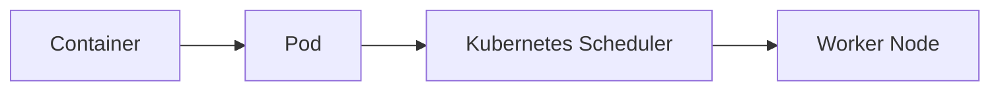

---

## 3. Pod High-Level Architecture

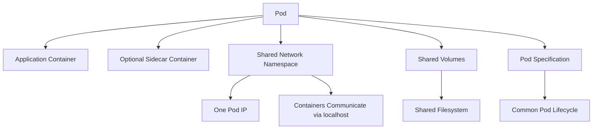

A Pod may contain:

- A main application container
- One or more sidecar containers
- Init containers
- Ephemeral containers for debugging

---

## 4. Pod and Container Relationship

A **container** packages an application and its dependencies.

A **Pod** provides the execution environment in which one or more containers run.

| Container | Pod |
|---|---|
| Packages and runs application code | Kubernetes deployment and scheduling unit |
| Has its own process | Can contain one or more containers |
| Usually isolated from other containers | Containers can share network and storage |
| Managed inside a Pod | Managed by Kubernetes |
| Can be restarted by the container runtime | Can be recreated by Kubernetes controllers |

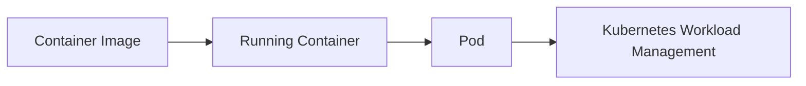

---

## 5. One Container per Pod

The **one-container-per-Pod** model is the most common pattern.

Example:

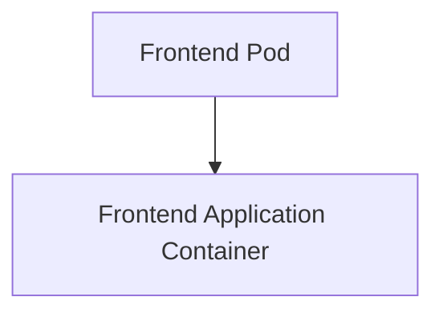

Use this model when:

- The application is independently deployable
- The application has its own lifecycle
- The application scales independently
- No tightly coupled helper process is required

Example:

```yaml
apiVersion: v1
kind: Pod
metadata:
  name: web-pod
spec:
  containers:
    - name: web
      image: nginx:1.27
      ports:
        - containerPort: 80
```

In production, Pods are normally created through higher-level resources such as Deployments rather than creating individual Pods manually.

---

## 6. Multi-Container Pod

A Pod can contain multiple containers when the containers are tightly coupled.

Example:

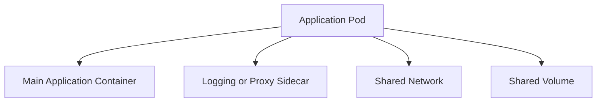

Examples of multi-container Pod patterns:

- Application container plus logging sidecar
- Application container plus proxy sidecar
- Application container plus monitoring agent
- Main container plus configuration reload helper
- Main container plus service-mesh proxy

### Important Design Rule

Do not place unrelated applications in the same Pod just because they are part of the same system.

Place containers in the same Pod only when they:

- Must be scheduled together
- Must scale together
- Share a lifecycle
- Need to communicate through localhost
- Need shared local storage
- Are tightly coupled operationally

---

## 7. How Containers Inside a Pod Communicate

Containers inside the same Pod share the Pod's network namespace.

This means:

- They share one Pod IP address
- They can communicate using `localhost`
- They share the same network ports
- They must avoid binding to the same port

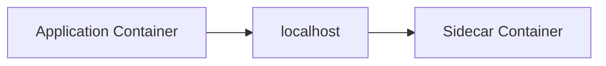

For example, if a proxy sidecar listens on port `15000`, the application container can communicate with it through:

```text
http://localhost:15000
```

### Interview Point

> Containers in the same Pod communicate through localhost, while containers in different Pods usually communicate through Kubernetes Services.

---

## 8. Pod Networking

Each Pod normally receives its own IP address from the cluster network.

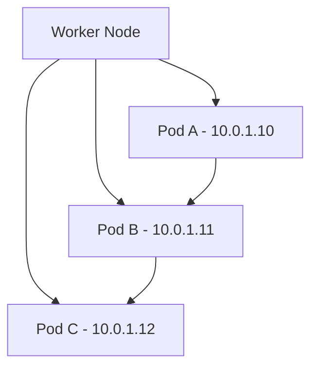

A Pod IP is not usually a permanent address.

Pods may be replaced because of:

- Application failure
- Node failure
- Deployment update
- Scaling operation
- Eviction
- Configuration change
- Cluster maintenance

Therefore, applications should not rely on Pod IP addresses directly.

---

## 9. Why Do We Need Kubernetes Services?

Because Pod IP addresses can change, Kubernetes Services provide a stable network endpoint.

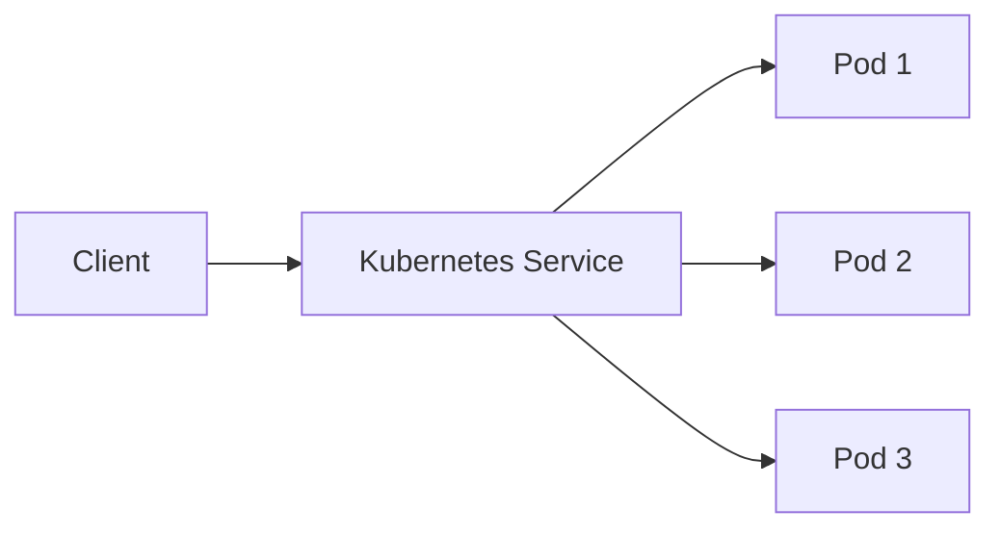

A Service provides:

- A stable virtual IP
- A stable DNS name
- Load balancing across matching Pods
- Service discovery
- A consistent communication endpoint

Example:

```yaml
apiVersion: v1
kind: Service
metadata:
  name: web-service
spec:
  selector:
    app: web
  ports:
    - port: 80
      targetPort: 8080
```

A client can use:

```text
http://web-service
```

instead of communicating directly with a changing Pod IP.

---

## 10. Pod Scheduling Flow

When a Pod is created, Kubernetes schedules it onto a suitable worker node.

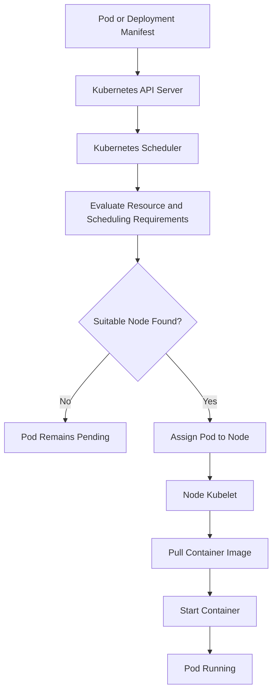

The scheduler may consider:

- CPU and memory requests
- Node labels
- Node selectors
- Taints and tolerations
- Affinity rules
- Anti-affinity rules
- Availability zones
- Persistent volume requirements
- Resource availability

---

## 11. Pod Lifecycle

A Pod moves through several lifecycle phases.

Common phases include:

- `Pending`
- `Running`
- `Succeeded`
- `Failed`
- `Unknown`

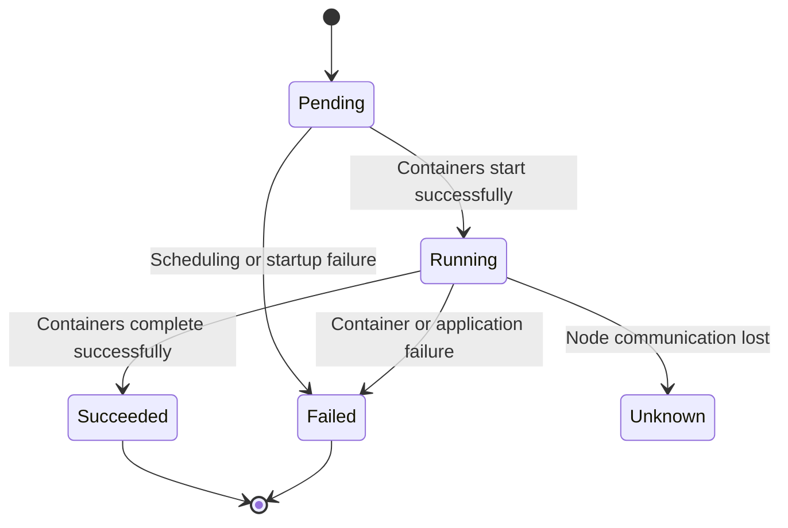

### Pending

The Pod has been accepted by Kubernetes but is not yet running.

Possible reasons:

- No suitable node
- Image still downloading
- Insufficient CPU or memory
- Storage not available
- Scheduling constraints cannot be satisfied

### Running

The Pod has been scheduled and at least one container is running or starting.

### Succeeded

All containers completed successfully.

This is common for:

- Jobs
- Batch processing
- Migration tasks

### Failed

One or more containers terminated unsuccessfully.

### Unknown

Kubernetes cannot determine the Pod's current state, often because it cannot communicate with the node.

---

## 12. Pod Lifecycle Events

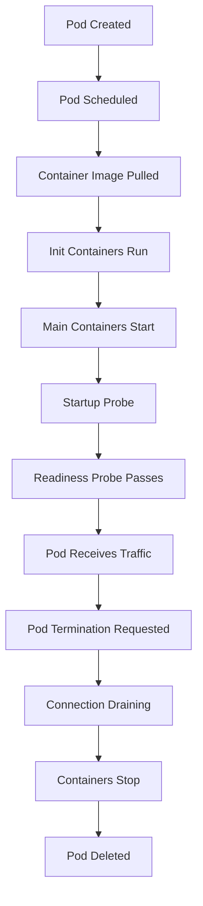

---

## 13. Init Containers

An **init container** runs before the main application containers start.

Use init containers for:

- Initialization tasks
- Configuration preparation
- Dependency checks
- Database migration preparation
- File generation
- Waiting for a required service

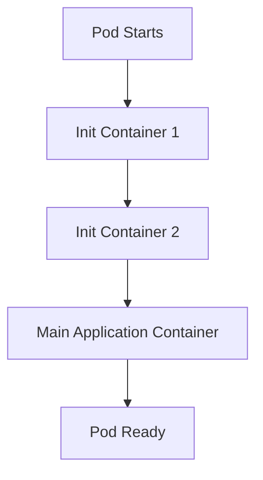

Init containers must complete successfully before the main containers start.

Example:

```yaml
apiVersion: v1
kind: Pod
metadata:
  name: init-example
spec:
  initContainers:
    - name: init-config
      image: busybox:1.36
      command: ["sh", "-c", "echo Preparing configuration"]

  containers:
    - name: app
      image: nginx:1.27
```

---

## 14. Sidecar Containers

A **sidecar container** supports the main application container within the same Pod.

Examples:

- Proxy
- Log collector
- Metrics exporter
- Security agent
- Configuration synchronizer

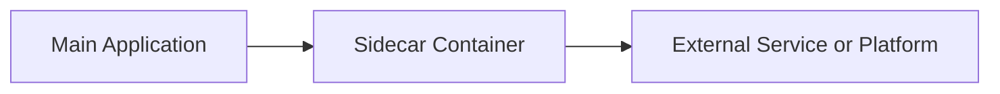

The sidecar pattern is useful when the supporting function:

- Must run beside the application
- Needs localhost communication
- Has the same lifecycle
- Should be deployed with the application

### Caution

Sidecars increase resource usage and operational complexity. Use them only when their benefits justify the additional container.

---

## 15. Ephemeral Containers

Ephemeral containers can be added temporarily to a running Pod for troubleshooting.

They are useful when:

- The production image has no debugging tools
- The main container is difficult to inspect
- You need temporary network diagnostics
- You need to inspect processes or files

They are not normally used for permanent application workloads.

---

## 16. Pod Health Probes

Kubernetes supports different health probes.

### 16.1 Startup Probe

Determines whether an application has finished starting.

Useful for slow-starting applications.

### 16.2 Readiness Probe

Determines whether the Pod is ready to receive traffic.

If readiness fails, Kubernetes can remove the Pod from Service endpoints while allowing the container to continue running.

### 16.3 Liveness Probe

Determines whether the application is still alive.

If liveness fails repeatedly, Kubernetes can restart the container.

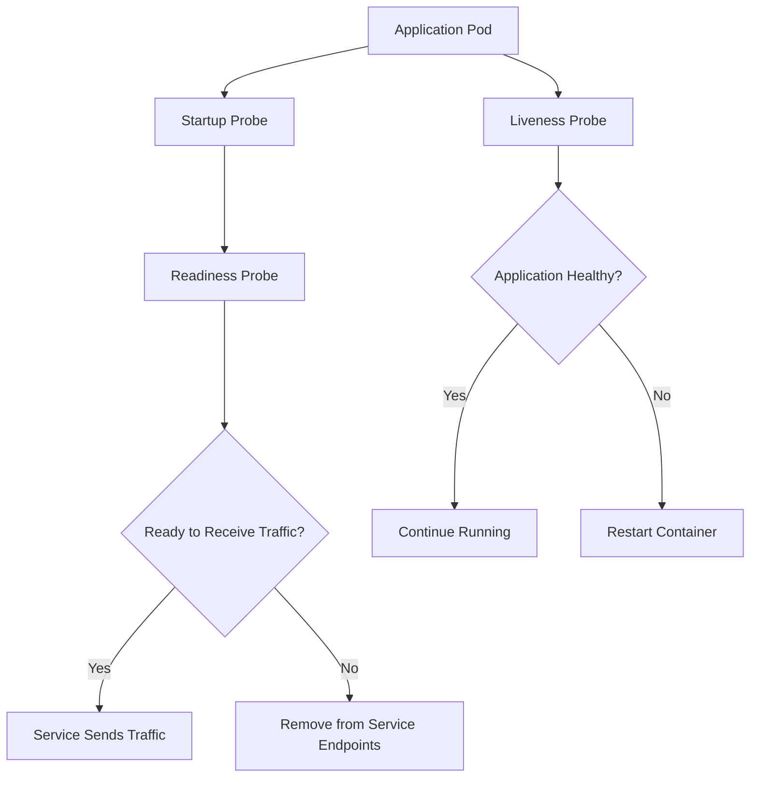

### Interview Point

> Readiness controls traffic. Liveness controls restart behavior. Startup protects slow-starting applications.

---

## 17. Pod Resources

Define resource requests and limits for containers.

### Resource Request

The amount of CPU or memory the scheduler uses when selecting a node.

### Resource Limit

The maximum CPU or memory the container is allowed to use.

```yaml
apiVersion: v1
kind: Pod
metadata:
  name: resource-example
spec:
  containers:
    - name: app
      image: nginx:1.27
      resources:
        requests:
          cpu: "250m"
          memory: "128Mi"
        limits:
          cpu: "500m"
          memory: "256Mi"
```

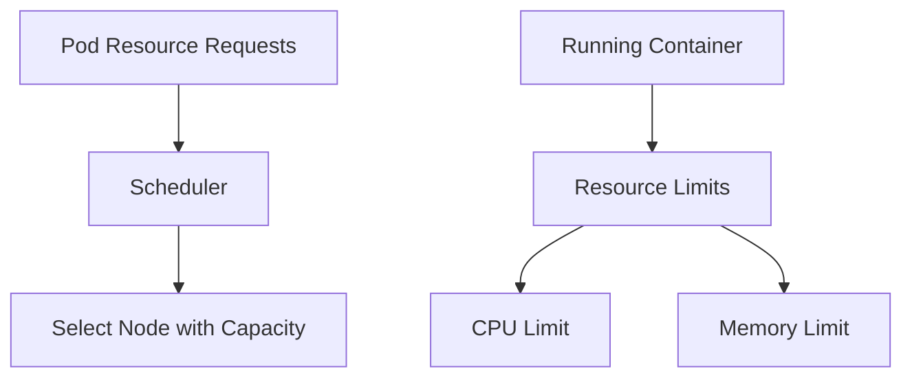

### Why Requests and Limits Matter

They help Kubernetes:

- Schedule Pods correctly
- Prevent resource starvation
- Improve node utilization
- Enable autoscaling
- Protect workloads from noisy neighbors
- Support reliable capacity planning

---

## 18. Pod Storage

Containers may use temporary storage, but container filesystems are generally not a substitute for durable storage.

Pods can mount volumes for:

- Shared temporary files
- Configuration
- Secrets
- Persistent application data
- Communication between containers

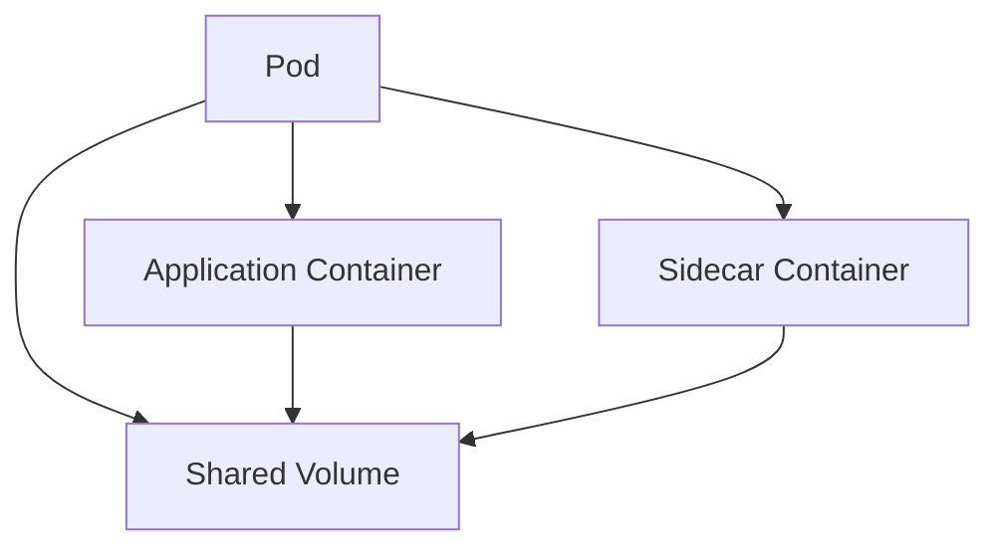

For durable data, use persistent storage such as:

- Persistent Volumes
- Azure Disks
- Azure Files
- Azure Blob Storage
- Azure-managed databases

> Interview point:  
> **A Pod can be deleted and recreated, so critical data should not depend only on the Pod's local filesystem.**

---

## 19. Pod Security

Pod security should be designed using defense in depth.

Important controls include:

- Run as a non-root user
- Use read-only root filesystems where possible
- Drop unnecessary Linux capabilities
- Define security contexts
- Restrict privilege escalation
- Use trusted container images
- Scan images for vulnerabilities
- Apply network policies
- Use workload identity for Azure access
- Avoid hardcoding secrets
- Integrate with Azure Key Vault where appropriate

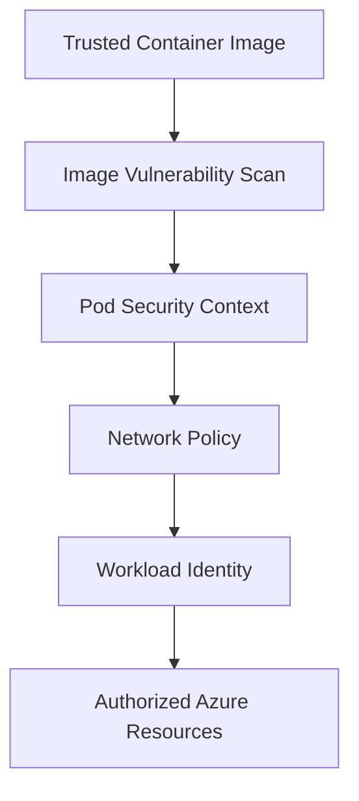

---

## 20. Pod Security Context Example

```yaml
apiVersion: v1
kind: Pod
metadata:
  name: secure-pod
spec:
  securityContext:
    runAsNonRoot: true
    seccompProfile:
      type: RuntimeDefault

  containers:
    - name: app
      image: example/app:1.0
      securityContext:
        allowPrivilegeEscalation: false
        readOnlyRootFilesystem: true
        capabilities:
          drop:
            - ALL
```

The exact security configuration depends on the application and platform requirements.

---

## 21. Pod Scaling

Pods themselves are usually not manually scaled one by one.

Higher-level Kubernetes resources manage Pod replicas.

Common controllers include:

- Deployment
- ReplicaSet
- StatefulSet
- DaemonSet
- Job
- CronJob

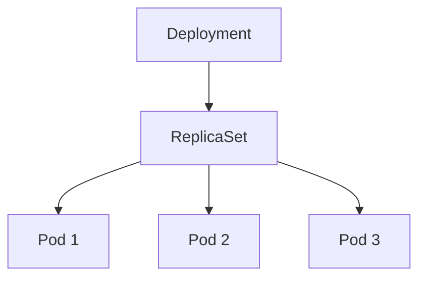

### Horizontal Pod Autoscaler

The Horizontal Pod Autoscaler can increase or decrease the number of replicas based on metrics.

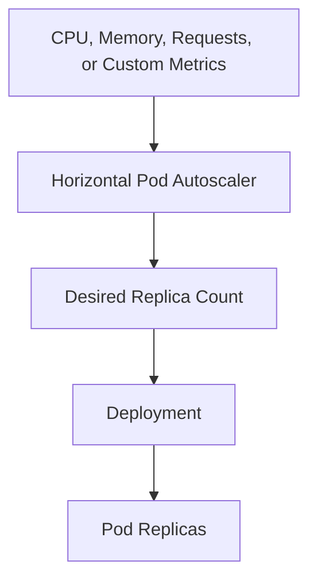

---

## 22. Pod Replacement and Self-Healing

Pods are considered disposable and replaceable.

If a Pod fails:

1. The controller detects fewer replicas than required
2. A replacement Pod is created
3. The scheduler assigns it to a suitable node
4. The container image is pulled
5. The new Pod starts
6. Readiness checks determine whether it receives traffic

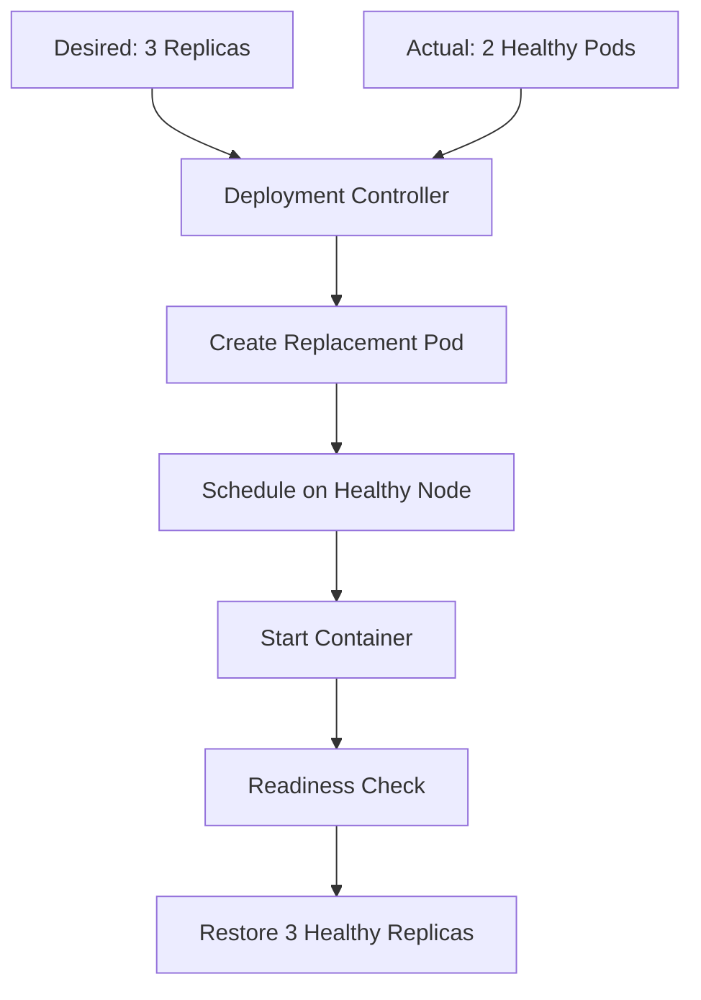

---

## 23. Pod Failure vs Container Restart

These are not always the same.

### Container Restart

A container process stops and Kubernetes restarts it within the same Pod.

### Pod Replacement

The Pod itself is terminated and a new Pod is created.

Possible causes of Pod replacement:

- Node failure
- Deployment update
- Eviction
- Scaling operation
- Configuration change
- Controller action

```mermaid
flowchart TD
    Failure["Application Failure"] --> Type{"What Failed?"}
    Type -- "Container Process" --> Restart["Restart Container"]
    Type -- "Pod or Node" --> Replace["Create Replacement Pod"]
```

---

## 24. Deployment to Pod Flow

In production, create Pods through a Deployment.

```mermaid
flowchart LR
    Developer["Developer"] --> Manifest["Deployment Manifest"]
    Manifest --> API["Kubernetes API Server"]
    API --> Deployment["Deployment Controller"]
    Deployment --> ReplicaSet["ReplicaSet"]
    ReplicaSet --> Pods["Pod Replicas"]
    Pods --> Service["Kubernetes Service"]
```

Example:

```yaml
apiVersion: apps/v1
kind: Deployment
metadata:
  name: web-deployment
spec:
  replicas: 3
  selector:
    matchLabels:
      app: web
  template:
    metadata:
      labels:
        app: web
    spec:
      containers:
        - name: web
          image: nginx:1.27
          ports:
            - containerPort: 80
```

The Deployment manages the lifecycle of the Pods.

---

## 25. Why Should You Avoid Managing Individual Pods?

Individual Pods are useful for learning and troubleshooting, but they are usually not sufficient for production.

A manually created Pod does not automatically provide:

- Replica management
- Rolling updates
- Automatic replacement after deletion
- Version history
- Rollback
- Declarative release management
- Horizontal scaling

Use a Deployment, StatefulSet, Job, or another appropriate controller instead.

> Interview answer:  
> **Pods are disposable workload units. Controllers provide the desired-state management needed for production reliability.**

---

## 26. Pod vs Deployment vs Service

| Kubernetes Object | Main Purpose |
|---|---|
| Pod | Runs one or more containers |
| Deployment | Manages stateless Pod replicas and releases |
| ReplicaSet | Maintains the requested number of Pod replicas |
| Service | Provides stable network access to Pods |
| StatefulSet | Manages stateful Pods with stable identity |
| DaemonSet | Runs a Pod on selected nodes |
| Job | Runs a task to completion |
| CronJob | Runs Jobs on a schedule |
| Ingress | Routes external HTTP/HTTPS traffic |

```mermaid
flowchart TB
    Deployment["Deployment"] --> Pods["Pod Replicas"]
    Service["Service"] --> Pods
    Ingress["Ingress"] --> Service
    Job["Job"] --> BatchPod["Batch Pod"]
    CronJob["CronJob"] --> Job
```

---

## 27. Pod Networking Example

```mermaid
flowchart TB
    Client["Client"] --> Ingress["Ingress"]
    Ingress --> Service["Kubernetes Service"]

    Service --> Pod1["Pod 1 - 10.0.0.10"]
    Service --> Pod2["Pod 2 - 10.0.0.11"]
    Service --> Pod3["Pod 3 - 10.0.0.12"]

    Pod1 --> Database["Database"]
    Pod2 --> Database
    Pod3 --> Database
```

When a Pod is recreated, the Service continues to route traffic to healthy Pods selected by labels.

---

## 28. Pod Availability Design

For highly available workloads:

- Run multiple replicas
- Spread Pods across nodes
- Use multiple availability zones where appropriate
- Configure readiness probes
- Configure Pod Disruption Budgets
- Use topology spread constraints
- Avoid placing all replicas on one node
- Use a Service for stable routing
- Configure graceful shutdown
- Ensure dependent services are also highly available

```mermaid
flowchart TB
    Service["Kubernetes Service"] --> Zone1["Availability Zone 1"]
    Service --> Zone2["Availability Zone 2"]
    Service --> Zone3["Availability Zone 3"]

    Zone1 --> Pod1["Pod Replica 1"]
    Zone2 --> Pod2["Pod Replica 2"]
    Zone3 --> Pod3["Pod Replica 3"]
```

---

## 29. Pod Disruption Budget

A Pod Disruption Budget helps maintain a minimum number of available replicas during voluntary disruptions such as:

- Node maintenance
- Cluster upgrades
- Node draining
- Planned infrastructure operations

Example:

```yaml
apiVersion: policy/v1
kind: PodDisruptionBudget
metadata:
  name: web-pdb
spec:
  minAvailable: 2
  selector:
    matchLabels:
      app: web
```

A Pod Disruption Budget does not protect against every failure, especially unexpected hardware or application failures. It helps control planned disruptions.

---

## 30. Pods in Azure Kubernetes Service

In AKS:

- Worker nodes are Azure virtual machines
- Pods run on those worker nodes
- Kubernetes schedules Pods to suitable nodes
- Azure networking connects Pods to cluster and Azure resources
- Services expose Pods internally or externally
- Azure services provide storage, identity, monitoring, and security integrations

```mermaid
flowchart TB
    AKS["AKS Cluster"] --> NodePool["Node Pool"]
    NodePool --> Node1["Azure VM Node 1"]
    NodePool --> Node2["Azure VM Node 2"]

    Node1 --> Pod1["Application Pod"]
    Node1 --> Pod2["Application Pod"]
    Node2 --> Pod3["Application Pod"]

    Pod1 --> AzureSQL["Azure SQL"]
    Pod2 --> Redis["Azure Cache for Redis"]
    Pod3 --> KeyVault["Azure Key Vault"]
```

---

## 31. Pod Observability

Monitor Pods using:

### Metrics

- CPU usage
- Memory usage
- Restart count
- Network traffic
- Container throttling
- Pod startup time
- Pending duration

### Logs

- Container logs
- Kubernetes events
- Probe failures
- Image pull errors
- Scheduling errors
- Termination reasons

### Traces

- Request flow across services
- Pod-to-Pod calls
- Database dependencies
- External service calls

```mermaid
flowchart LR
    Pod["Application Pod"] --> Metrics["Metrics"]
    Pod --> Logs["Logs"]
    Pod --> Traces["Distributed Traces"]

    Metrics --> Monitor["Azure Monitor"]
    Logs --> LogAnalytics["Log Analytics"]
    Traces --> Insights["Application Insights"]
```

---

## 32. Common Pod Problems

### `Pending`

Possible causes:

- Insufficient node resources
- Unsatisfied node selector
- Taint or toleration mismatch
- Storage provisioning delay
- Scheduling constraints

### `ImagePullBackOff`

Possible causes:

- Incorrect image name
- Image tag does not exist
- Registry authentication failure
- Network access problem
- Private registry configuration issue

### `CrashLoopBackOff`

Possible causes:

- Application startup failure
- Missing configuration
- Invalid secret
- Incorrect command
- Dependency failure
- Liveness probe failure

### `NotReady`

Possible causes:

- Readiness probe failure
- Application not listening on expected port
- Dependency unavailable
- Incorrect health-check path
- Application initialization incomplete

```mermaid
flowchart TD
    Problem["Pod Problem"] --> State{"Pod State"}
    State -- "Pending" --> Schedule["Check Scheduling and Resources"]
    State -- "ImagePullBackOff" --> Registry["Check Image and Registry Access"]
    State -- "CrashLoopBackOff" --> Logs["Check Container Logs and Configuration"]
    State -- "NotReady" --> Probe["Check Readiness Probe and Dependencies"]
```

---

## 33. Useful Troubleshooting Commands

```bash
kubectl get pods
kubectl get pod <pod-name> -o wide
kubectl describe pod <pod-name>
kubectl logs <pod-name>
kubectl logs <pod-name> --previous
kubectl get events --sort-by=.lastTimestamp
kubectl exec -it <pod-name> -- sh
```

For a multi-container Pod:

```bash
kubectl logs <pod-name> -c <container-name>
```

Troubleshooting sequence:

```mermaid
flowchart TD
    Start["Pod Is Not Working"] --> Status["kubectl get pod"]
    Status --> Describe["kubectl describe pod"]
    Describe --> Logs["kubectl logs"]
    Logs --> Events["Check Kubernetes Events"]
    Events --> Config["Check Config, Secrets, Image, and Probes"]
    Config --> Fix["Apply Fix and Observe Recovery"]
```

---

## 34. Common Interview Questions and Answers

### Q1: What is a Pod?

**Answer:** A Pod is Kubernetes’ smallest deployable unit. It contains one or more closely related containers that share networking, storage, and lifecycle.

### Q2: Is a Pod the same as a container?

**Answer:** No. A container runs the application process, while a Pod is the Kubernetes execution and management unit that can contain one or more containers.

### Q3: How many containers should a Pod have?

**Answer:** Usually one main application container. Multiple containers should be used only when they are tightly coupled and need to share the same network, storage, and lifecycle.

### Q4: Can containers in the same Pod communicate with each other?

**Answer:** Yes. They share the same network namespace and can communicate through `localhost`.

### Q5: Do containers in the same Pod have separate IP addresses?

**Answer:** No. Containers in the same Pod share the Pod's network namespace and Pod IP address.

### Q6: Are Pod IP addresses permanent?

**Answer:** No. Pods are disposable, and their IP addresses can change when Pods are recreated. Use a Kubernetes Service for stable communication.

### Q7: What happens when a Pod fails?

**Answer:** If the Pod is managed by a controller such as a Deployment, Kubernetes creates a replacement Pod to restore the desired replica count.

### Q8: What is the difference between readiness and liveness probes?

**Answer:** Readiness determines whether the Pod should receive traffic. Liveness determines whether the container should be restarted.

### Q9: What is an init container?

**Answer:** An init container runs before the main application container and performs initialization tasks. It must complete successfully before the application containers start.

### Q10: What is a sidecar container?

**Answer:** A sidecar is a supporting container that runs in the same Pod as the main application, often for logging, proxying, monitoring, or configuration support.

### Q11: Why use a Deployment instead of creating a Pod directly?

**Answer:** A Deployment manages replicas, rolling updates, replacement, version history, and rollback. A standalone Pod does not provide these production management capabilities.

### Q12: How do Pods scale?

**Answer:** Pods are scaled by changing the replica count through controllers such as Deployments or by using autoscalers such as the Horizontal Pod Autoscaler.

### Q13: How do you make Pods highly available?

**Answer:** Run multiple replicas, distribute them across nodes or zones, use readiness probes, configure disruption budgets, and expose them through a Kubernetes Service.

### Q14: Where should persistent data be stored?

**Answer:** Persistent data should be stored in durable storage such as Persistent Volumes, Azure Disks, Azure Files, Blob Storage, or a managed database—not only inside the Pod filesystem.

### Q15: What is a Pod in AKS?

**Answer:** In AKS, a Pod is the Kubernetes workload unit that runs on Azure worker nodes. AKS provides the managed Kubernetes platform, while Pods run the application containers.

---

## 35. 60-Second Interview Pitch

> A Pod is the smallest deployable unit in Kubernetes. It represents one instance of an application and usually contains one container, although tightly coupled containers such as a main application and sidecar can share a Pod. Containers in the same Pod share a network namespace, Pod IP, localhost interface, storage volumes, and lifecycle. Pods are disposable, so their IP addresses should not be used as permanent endpoints; Kubernetes Services provide stable discovery and load balancing. In production, I manage Pods through Deployments or other controllers, use readiness and liveness probes, define resource requests and limits, distribute replicas across nodes or zones, and store persistent data outside the Pod filesystem.

---

## 36. Final Revision Checklist

- [ ] A Pod is Kubernetes’ smallest deployable unit
- [ ] A Pod can contain one or more containers
- [ ] One-container-per-Pod is the most common model
- [ ] Containers in a Pod share the network namespace
- [ ] Containers in a Pod share the Pod IP address
- [ ] Containers can communicate through localhost
- [ ] Pods can share mounted volumes
- [ ] Pods have a common lifecycle
- [ ] Pod IP addresses are not permanent
- [ ] Kubernetes Services provide stable access
- [ ] Deployments manage stateless Pod replicas
- [ ] Init containers run before application containers
- [ ] Sidecars support the main application
- [ ] Readiness controls traffic
- [ ] Liveness controls restarts
- [ ] Startup probes protect slow-starting applications
- [ ] Resource requests influence scheduling
- [ ] Resource limits constrain container usage
- [ ] Pods should be treated as disposable
- [ ] Persistent data should use durable storage
- [ ] Multiple replicas and topology distribution improve availability
- [ ] Pod security should follow least privilege
- [ ] Azure AKS runs Pods on Azure worker nodes

---

## One-Line Conclusion

> A Pod is Kubernetes’ smallest deployable unit, grouping one or more tightly related containers that share networking, storage, and lifecycle while being scheduled and managed together.