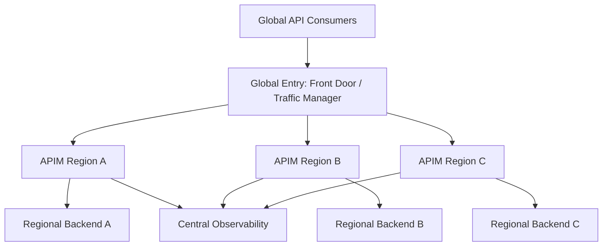
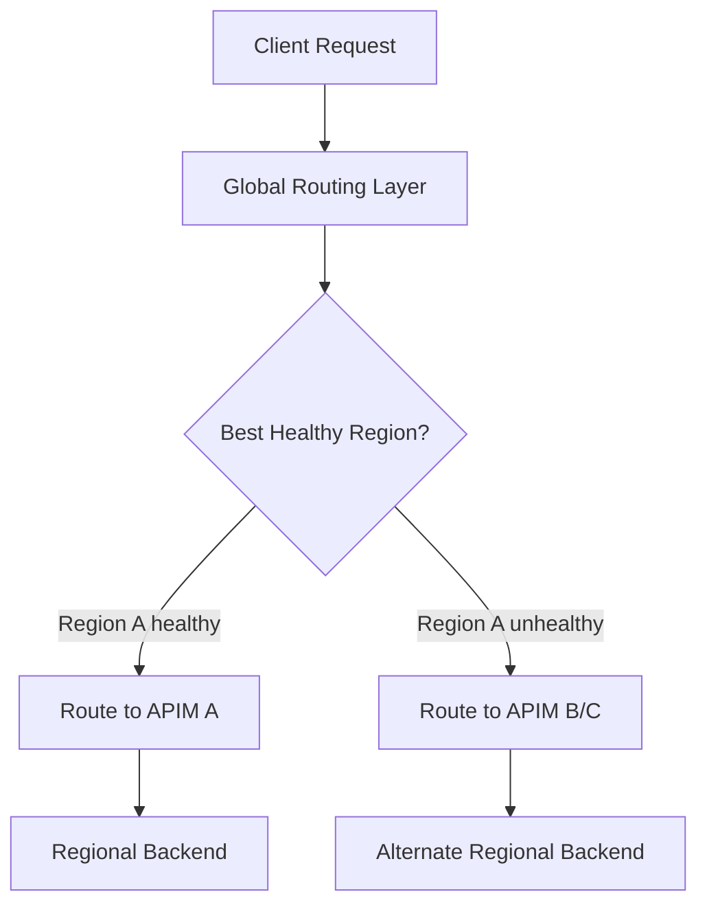
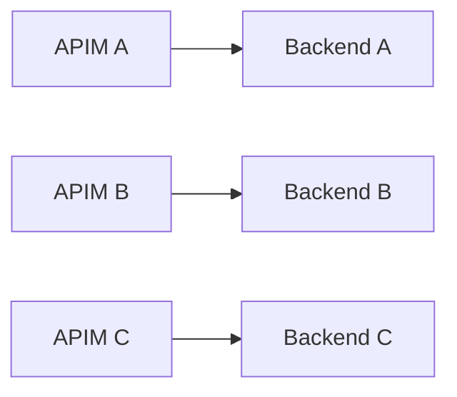
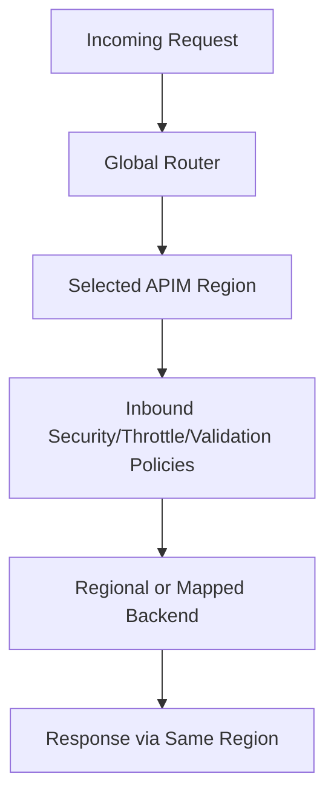
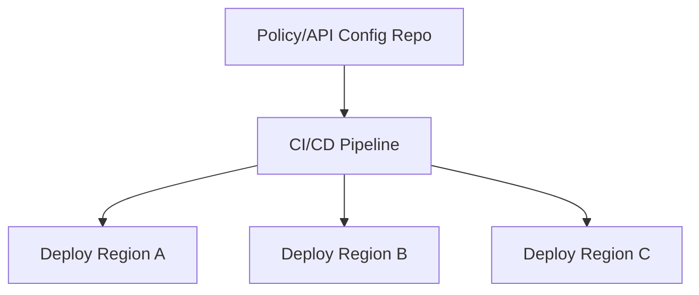
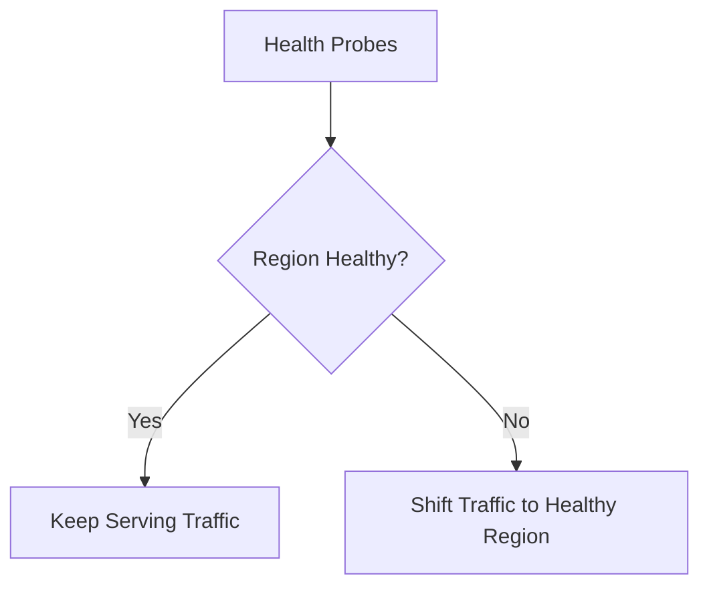
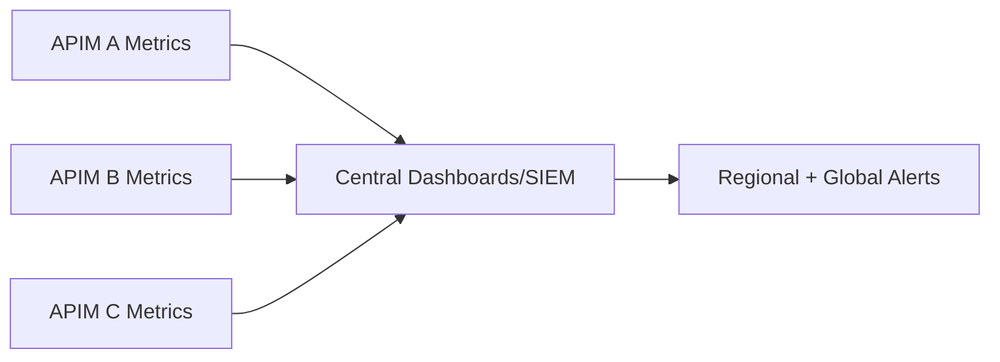

# Azure API Management (APIM) in Multi-Region Deployment
## Detailed Interview Preparation Guide with Flow Charts

---

## 1) Direct Interview Answer

A multi-region APIM deployment means running API gateway presence across multiple Azure regions to improve:

1. **High availability (HA)**
2. **Disaster recovery (DR)**
3. **Lower latency for global users**
4. **Regional resilience and failover**

Traffic is routed to the best healthy regional endpoint using global traffic distribution (for example, Front Door/Traffic Manager patterns), while backend and APIM policy/governance stay consistent.

> One-liner: *Multi-region APIM improves uptime, resilience, and global performance by distributing API gateway capacity across regions with health-based routing and failover.*

---

## 2) Why Multi-Region APIM Is Used

Single-region risks:
- Regional outage impacts all API consumers
- Higher latency for distant geographies
- Maintenance events have larger blast radius

Multi-region benefits:
- Active-active or active-passive resilience
- Better user experience globally
- Controlled failover during incidents
- Capacity distribution across geographies

---

## 3) High-Level Multi-Region Architecture

---

## 4) Deployment Models

## 4.1 Active-Active
All regions serve traffic simultaneously.

Pros:
- Best latency distribution
- Better capacity utilization
- Fast failover behavior

Cons:
- More operational complexity
- Data consistency considerations for stateful backends

## 4.2 Active-Passive
Primary region serves; secondary is standby.

Pros:
- Simpler operations
- Lower cross-region complexity

Cons:
- Potentially slower failover
- Standby capacity may be underutilized

---

## 5) Traffic Routing Flow (Health-Based)

Routing can be based on:
- Latency
- Priority/failover order
- Geographic proximity
- Endpoint health probes

---

## 6) APIM Multi-Region Control Plane vs Data Plane (Interview Depth)

Think in two planes:

1. **Control plane**
   - API definitions
   - Policies
   - Products/subscriptions
   - Configuration lifecycle

2. **Data plane**
   - Runtime API traffic processing in each region

Goal:
- Central governance consistency
- Regional runtime resilience

---

## 7) Multi-Region APIM + Backend Patterns

## Pattern A: Regional Backends
Each APIM region calls backend in same region (preferred for latency and fault isolation).

## Pattern B: Shared Primary Backend
All APIM regions call one primary backend (simpler, but weaker regional isolation).

## Pattern C: Hybrid
Read traffic local, write traffic centralized (depends on business/data constraints).

---

## 8) Request Processing in Multi-Region

---

## 9) Data Residency and Compliance Considerations

For regulated workloads:
- Route users to specific geographies
- Keep data processing in approved regions
- Apply region-specific policy variants where legally required
- Control cross-region replication scope

Interview phrase:
> Multi-region design must align with data sovereignty and residency requirements, not only performance goals.

---

## 10) Session and State Considerations

APIM gateway is typically stateless for request handling, but your APIs may not be.

If backend workflows are stateful:
- Avoid naive cross-region failover assumptions
- Plan session affinity/sticky behavior only when needed
- Prefer stateless token-based API design
- Externalize state to replicated data tier with clear consistency model

---

## 11) Consistent Policy Governance Across Regions

Maintain parity of:
- Security policies (JWT, mTLS, IP rules)
- Rate limits/quotas
- Request validation
- Error response contracts
- Version/revision behavior

Use policy-as-code with CI/CD promotion to avoid drift.

---

## 12) Health Probes and Failover Strategy

Global routing layer should continuously evaluate:
- APIM endpoint health
- Backend dependency health (if included in probe design)
- Latency thresholds
- Error rate thresholds

---

## 13) Failover Runbook (Interview-Strong)

1. Detect incident (alerts/probes)
2. Confirm affected scope (APIM or backend or network)
3. Shift routing weights/priority to healthy region(s)
4. Validate auth/policy/backend behavior in failover region
5. Communicate status
6. Recover failed region
7. Gradually re-balance traffic
8. Post-incident review

---

## 14) Security in Multi-Region APIM

Must remain consistent:
- Strong auth in every region
- Secret/certificate management and rotation process
- Regional network isolation and private backend access
- WAF/edge protections at global entry layer
- Centralized SIEM visibility across regions

---

## 15) Observability in Multi-Region

Track per region:
- Request volume
- P95/P99 latency
- 4xx/5xx rates
- Throttling (429)
- Backend dependency latency
- Failover events
- Capacity saturation

---

## 16) Capacity Planning Across Regions

Plan for:
- N+1 or failover headroom (if one region fails)
- Peak regional distribution
- Burst traffic behavior during failover
- Autoscale or pre-provision strategy

Interview phrase:
> Each surviving region must absorb redirected traffic during failover without breaching latency/error SLOs.

---

## 17) Common Multi-Region Topologies

## Topology 1: Two-Region Active-Active
- Region A + Region B both live
- Global latency-based routing
- Mutual failover

## Topology 2: Three-Region Global
- Americas, Europe, APAC
- Geo-latency routing + compliance boundaries
- Regional backend alignment

## Topology 3: Active-Passive DR
- Primary handles all traffic
- Secondary warmed for failover

---

## 18) Common Mistakes (Interview Gold)

1. Multi-region APIM but single-region backend bottleneck  
2. No failover load testing  
3. Config/policy drift across regions  
4. Ignoring DNS TTL/failover propagation behavior  
5. Under-provisioning secondary regions  
6. No data consistency strategy for stateful APIs  
7. Incomplete runbooks and on-call readiness  

---

## 19) Interview Q&A (Strong Answers)

### Q1: Why deploy APIM in multiple regions?
**Answer:** To increase availability, reduce latency for global users, and provide resilient failover during regional incidents.

### Q2: Active-active or active-passive—which is better?
**Answer:** Active-active for global performance and resilience; active-passive for simpler operations. Choice depends on complexity tolerance and business RTO/RPO targets.

### Q3: What routes traffic to the right APIM region?
**Answer:** A global routing layer (such as Front Door/Traffic Manager patterns) using health and latency rules.

### Q4: Is multi-region APIM enough for full resilience?
**Answer:** No. Backends, data stores, and network/security dependencies must also be regionally resilient.

### Q5: How do you avoid policy inconsistencies across regions?
**Answer:** Use policy-as-code and CI/CD pipelines to deploy the same validated configuration to all regions.

### Q6: What should be tested regularly?
**Answer:** Regional failover, traffic shift capacity, auth/policy correctness in secondary regions, and rollback procedures.

---

## 20) 60-Second Interview Pitch

> In multi-region APIM, I place a global routing layer in front of regionally deployed APIM gateways. Traffic is directed to the nearest healthy region to reduce latency and improve uptime. Each APIM region enforces the same security and governance policies, and typically routes to a regional backend for fault isolation. I treat this as an end-to-end resilience design—APIM, backend services, data layer, and networking must all support failover. I use policy-as-code with CI/CD to prevent drift, monitor region-wise SLOs, and run regular failover drills so secondary regions can absorb load during incidents.

---

## 21) Final Checklist

- [ ] Global routing layer configured (latency/health/failover)  
- [ ] APIM deployed in required regions  
- [ ] Backend regional resilience strategy defined  
- [ ] Policy/config consistency via CI/CD  
- [ ] Regional security controls and secret rotation aligned  
- [ ] Per-region observability and alerting enabled  
- [ ] Failover capacity validated (N+1/headroom)  
- [ ] DR/failover runbooks tested regularly  

---

## One-Line Conclusion

> Multi-region APIM delivers global low-latency access and regional fault tolerance when combined with health-based routing, consistent policy governance, and resilient multi-region backends.