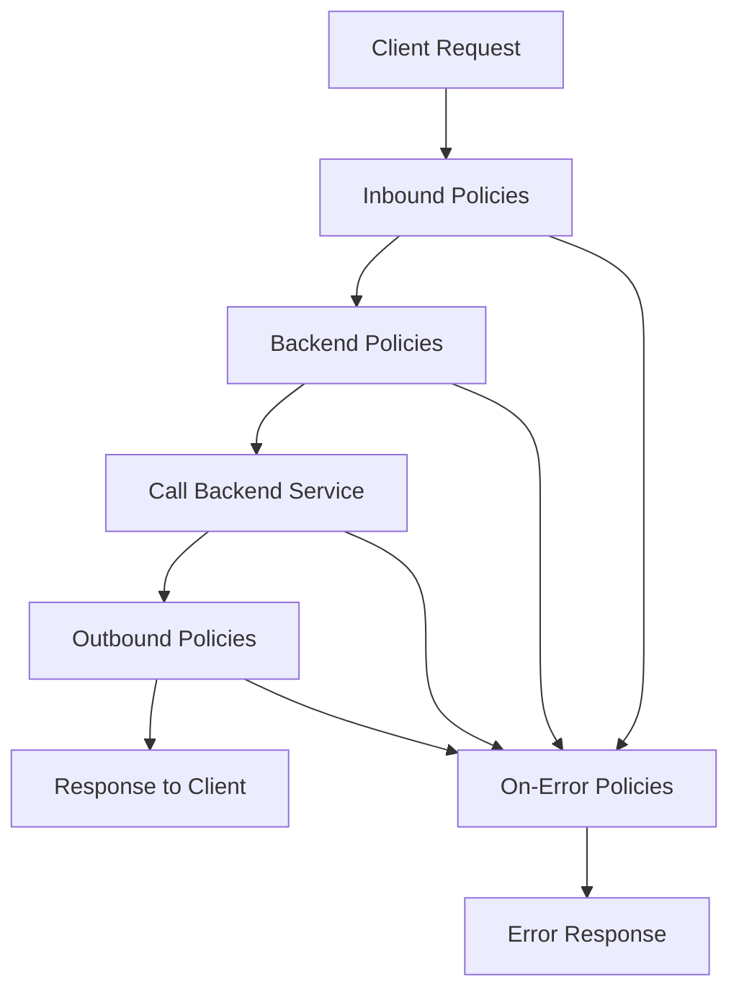
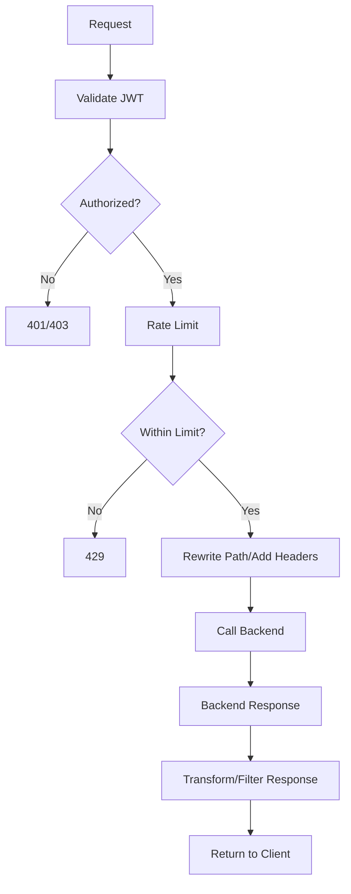
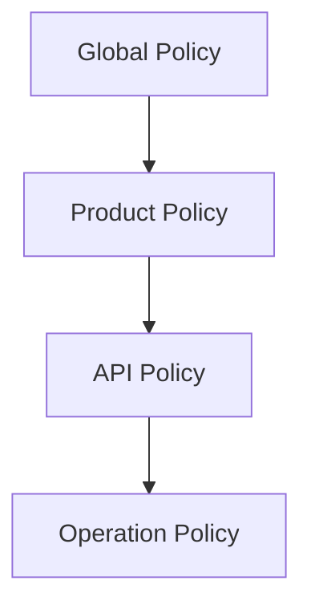
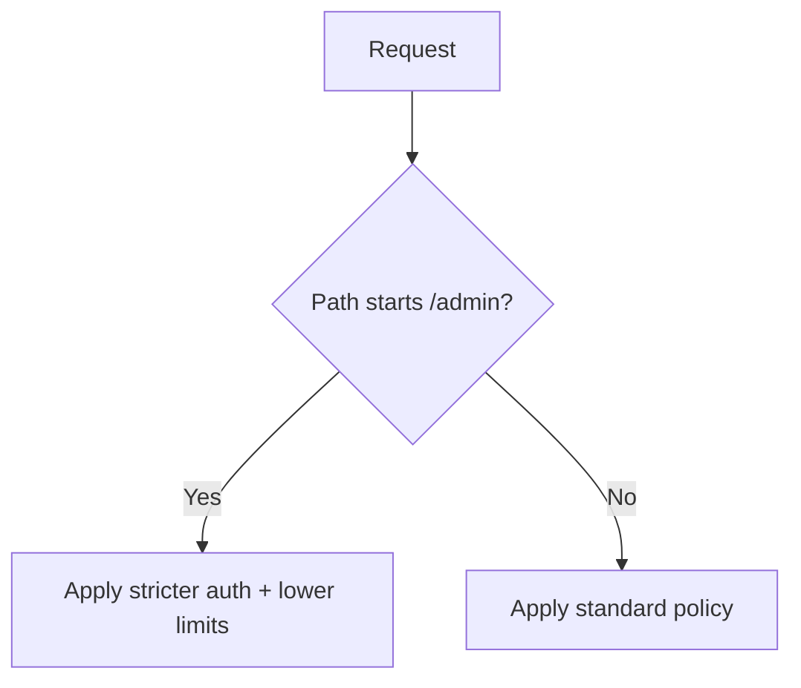
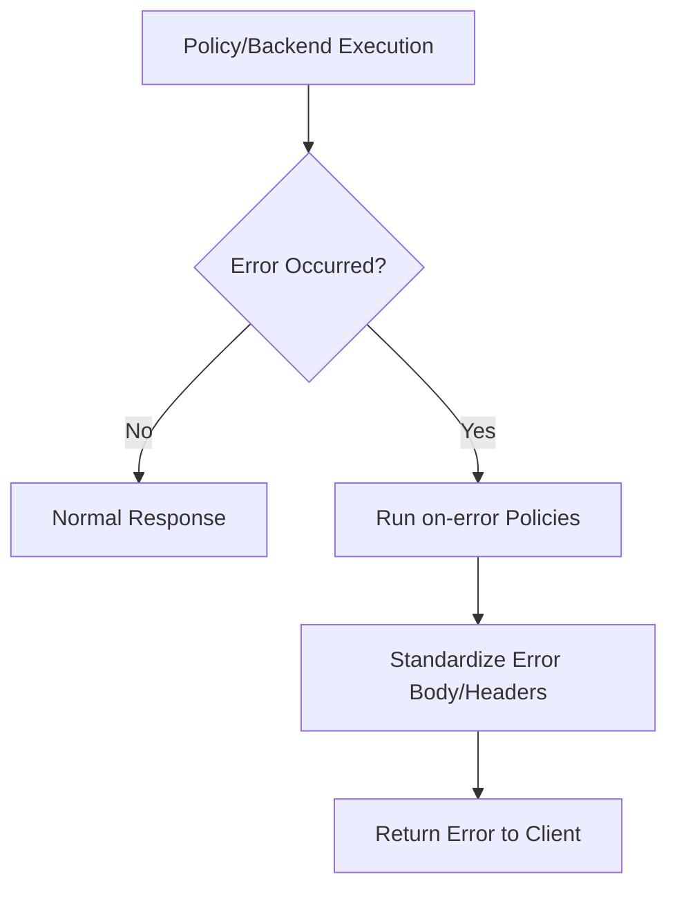

# How Do Azure APIM Policies Work?
## Detailed Interview Preparation Guide with Flow Charts

---

## 1) Direct Interview Answer

**APIM policies** are XML-based rule statements executed by the API gateway at runtime to control request/response behavior **without changing backend code**.

They run in a policy pipeline sections:

1. **inbound** (before backend call)
2. **backend** (while forwarding)
3. **outbound** (before response to client)
4. **on-error** (if pipeline/backend fails)

> One-liner: *APIM policies are gateway-executed rules that enforce security, transformation, traffic control, and governance across APIs.*

---

## 2) Why Policies Exist

Without policies, each backend service must implement repeated cross-cutting logic:
- Auth validation
- Throttling
- Header checks
- Request/response transformation
- Caching
- Error standardization

Policies centralize this logic in APIM.

---

## 3) Policy Pipeline Flow (Core)



---

## 4) The Four Policy Sections Explained

## 4.1 Inbound
Runs first on incoming request.  
Typical actions:
- Validate JWT
- Check headers/query params
- Rate limit/quota
- Rewrite URL
- Set/remove headers
- Validate payload/schemas
- Cache lookup logic

## 4.2 Backend
Controls backend forwarding behavior.  
Typical actions:
- Select backend service
- Set backend base URL
- Retry/failover patterns (design-dependent)

## 4.3 Outbound
Runs on response from backend before returning to client.  
Typical actions:
- Transform response body
- Remove internal headers
- Mask sensitive data
- Add correlation headers
- Cache-store logic

## 4.4 On-Error
Triggered when errors happen in pipeline/backend.  
Typical actions:
- Return standardized error format
- Add diagnostics metadata
- Conditional fallback responses

---

## 5) End-to-End Example Flow



---

## 6) Policy Scope Hierarchy (Very Important)

Policies can be applied at multiple scopes:
- Global
- Workspace/Product (depending on APIM model/features)
- API
- Operation

Lower scopes can extend/override behavior (with careful design).



Interview point:
> Design baseline controls globally, then specialize closer to API/operation as needed.

---

## 7) Policy Inheritance Concept

APIM commonly uses `<base />` to inherit policies from higher scope.

- Include `<base />` to keep parent behavior
- Omit carefully if you intend full replacement
- Misuse can accidentally bypass org security controls

---

## 8) Typical Policy Categories

## Security Policies
- `validate-jwt`
- IP filtering
- Client certificate checks
- Header/token enforcement

## Traffic Management Policies
- Rate limit
- Quota
- Concurrency and control patterns

## Transformation Policies
- Rewrite URI
- Set/remove headers
- Convert payload formats (pattern-dependent)

## Reliability Policies
- Retry
- Timeout behavior patterns
- Backend failover approaches

## Observability/Control Policies
- Correlation IDs
- Logging hooks
- Standardized error responses

---

## 9) Conditional Logic in Policies

Policies can execute conditionally (if/else style) based on:
- Path
- Method
- Headers
- Claims
- Query params
- Products/subscriptions



---

## 10) Example Policy Skeleton (Conceptual)

```xml
<policies>
  <inbound>
    <base />
    <!-- auth, validation, throttling, transformation -->
  </inbound>
  <backend>
    <base />
    <!-- backend routing controls -->
  </backend>
  <outbound>
    <base />
    <!-- response transformations -->
  </outbound>
  <on-error>
    <base />
    <!-- standardized error handling -->
  </on-error>
</policies>
```

This structure is fundamental for interview explanations.

---

## 11) Real-World Policy Execution Scenario

Scenario:
- Partner calls `/v1/orders`
- APIM validates token and scope
- Applies partner-specific rate limits
- Rewrites backend path to internal microservice route
- Adds correlation ID
- Removes backend server header in response
- Returns standardized JSON error if failure occurs

---

## 12) Policy Order Matters

Within each section, order of policy statements affects behavior.

Example:
- Validate JWT before forwarding
- Apply rate limit before expensive transformations
- Sanitize response before returning

Bad order can:
- Increase latency
- Leak data
- Weaken security

---

## 13) Error Flow with On-Error Section



---

## 14) Policy Fragments and Reuse (Governance)

Organizations often create reusable policy fragments for:
- JWT validation standard
- Common headers
- Correlation IDs
- Throttle templates
- Error envelope format

Benefits:
- Consistency
- Faster onboarding
- Reduced policy drift

---

## 15) APIM Policies in CI/CD

Best practice:
- Treat policies as code artifacts
- Version control XML policy definitions
- Promote across dev/test/prod with parameterization
- Use pull request review for policy changes
- Run policy validation checks pre-deploy

---

## 16) Performance Considerations

Every policy adds processing overhead.

Guidelines:
- Keep policies purposeful
- Fail fast (auth/deny early)
- Avoid unnecessary heavy transforms
- Reuse tested fragments
- Observe latency impact per policy chain

---

## 17) Security Best Practices for Policies

1. Enforce authn/authz in inbound  
2. Validate exact token issuer/audience  
3. Apply least privilege by API/operation  
4. Add rate limits on public-facing APIs  
5. Strip sensitive backend headers outbound  
6. Standardize secure error responses  
7. Keep backend protected (zero trust mindset)  

---

## 18) Common Mistakes (Interview Gold)

1. Putting complex business logic into policies  
2. Forgetting `<base />` and unintentionally removing parent security  
3. Inconsistent policies across environments  
4. No monitoring for policy-triggered failures  
5. Overusing operation-level customizations causing maintenance burden  
6. Leaking internal backend error details  

---

## 19) APIM Policy Debug Mindset

When troubleshooting:
1. Check scope (global/product/API/operation)  
2. Check inheritance (`<base />`)  
3. Check policy order  
4. Verify condition expressions  
5. Inspect gateway logs/trace  
6. Reproduce with minimal request and compare expected path  

---

## 20) Interview Q&A (Strong Answers)

### Q1: How do APIM policies work at runtime?
**Answer:** APIM executes policy XML in pipeline stages (inbound, backend, outbound, on-error) to evaluate and modify request/response behavior before/after backend calls.

### Q2: Where should security policies be placed?
**Answer:** Primarily in inbound so unauthorized traffic is blocked early.

### Q3: What is the purpose of `<base />`?
**Answer:** It inherits parent-scope policies; removing it can bypass inherited controls if not intentional.

### Q4: Can policies transform payloads?
**Answer:** Yes, policies can modify headers, URLs, and bodies based on supported policy capabilities and expressions.

### Q5: What is on-error used for?
**Answer:** Centralized error handling—standardized responses, diagnostics context, and controlled failure behavior.

### Q6: Are policies a replacement for backend logic?
**Answer:** No. Policies handle cross-cutting gateway concerns; core business/domain logic remains in backend services.

---

## 21) 60-Second Interview Pitch

> APIM policies are XML-defined gateway rules executed across inbound, backend, outbound, and on-error stages. They let us enforce cross-cutting concerns—like JWT validation, rate limiting, request validation, transformations, routing, and standardized error handling—without modifying backend code. Policies can be applied hierarchically at global, product, API, and operation scopes, with inheritance via `<base />`. In practice, I place security and traffic controls early in inbound, keep policy sets reusable via fragments, and manage them through CI/CD with monitoring to ensure consistent governance, performance, and reliability.

---

## 22) Final Checklist

- [ ] Can explain all 4 policy sections  
- [ ] Understand scope hierarchy and inheritance  
- [ ] Know why policy order matters  
- [ ] Can describe common security/traffic/transformation policies  
- [ ] Understand on-error standardization patterns  
- [ ] Can explain policy governance via fragments + CI/CD  
- [ ] Can distinguish policy concerns from backend business logic  

---

## One-Line Conclusion

> APIM policies are hierarchical, runtime gateway rules that control API security, traffic, transformation, routing, and error handling across inbound/backend/outbound/on-error pipelines.