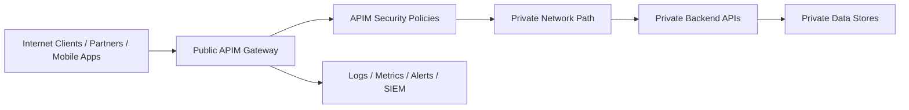
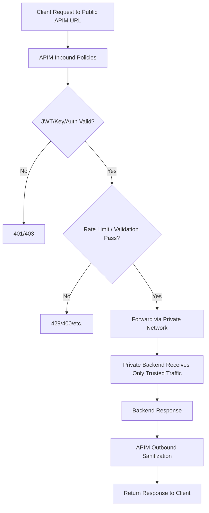
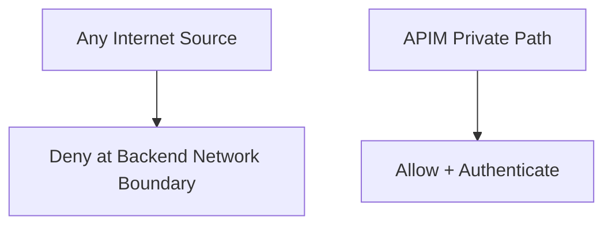
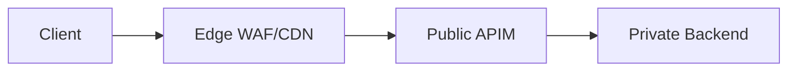
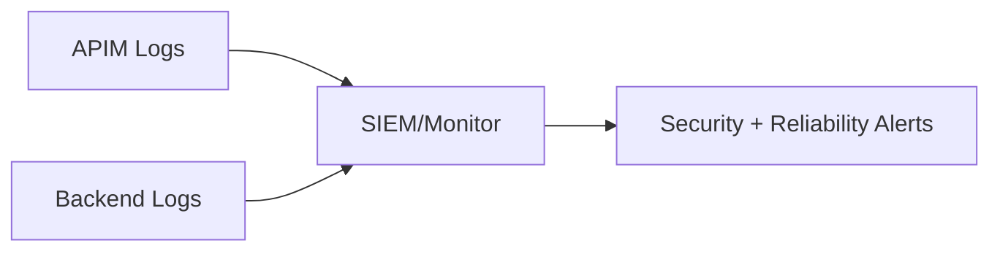

# How Do You Expose APIs Publicly While Keeping Backend Private?
## Detailed Interview Preparation Guide with Flow Charts (Azure APIM Pattern)

---

## 1) Direct Interview Answer

Expose APIs publicly by placing **Azure API Management (APIM)** as the **public gateway**, while backend services remain on **private endpoints/internal networks** and only accept traffic from trusted private paths (for example, APIM via VNet/private connectivity).

Core pattern:

1. Public clients call APIM endpoint
2. APIM enforces auth, throttling, validation, threat controls
3. APIM forwards requests to private backend over private network path
4. Backend denies direct public internet access

> One-liner: *Public API surface at APIM, private backend behind network isolation and zero-trust controls.*

---

## 2) Why This Pattern Is Used

If backend is public:
- Larger attack surface
- Harder centralized governance
- Inconsistent security controls
- More DDoS/abuse risk directly on services

If APIM is public and backend private:
- Single controlled ingress point
- Centralized policy enforcement
- Better observability and governance
- Stronger network isolation

---

## 3) High-Level Architecture Flow



---

## 4) Reference Network Topology (Conceptual)

```mermaid
flowchart TD
    Internet[Public Internet] --> Edge[Public APIM Endpoint]
    Edge --> WAF[Optional WAF/Front Door Layer]
    WAF --> APIMRuntime[APIM Runtime]
    APIMRuntime --> VNet[VNet Integration / Private Routing]
    VNet --> PrivateAPI[Backend API (Private Endpoint / Internal LB / App Service Private Access)]
    PrivateAPI --> DB[(Private Database)]
```

---

## 5) End-to-End Request Flow



---

## 6) Core Design Principle: “Public Edge, Private Core”

- **Public edge**: APIM endpoint reachable by clients
- **Private core**: backend services not internet-routable
- **Controlled bridge**: APIM-to-backend via private connectivity
- **Policy gate**: only validated traffic allowed through

---

## 7) Step-by-Step Implementation Blueprint

## Step 1: Put APIM as Front Door
- Publish API products/routes on APIM
- Expose only APIM hostname publicly

## Step 2: Privatize Backend
- Disable public access on backend service when possible
- Use private endpoint/internal ingress/internal load balancer patterns
- Restrict inbound to trusted network paths

## Step 3: Private Connectivity from APIM to Backend
- Integrate APIM with private networking path to backend
- Route backend calls privately (no public hop)

## Step 4: Enforce Gateway Security Policies
- JWT validation/OAuth
- Subscription/product controls
- Rate limiting/quotas
- Request validation/sanitization

## Step 5: Restrict Backend to APIM-Origin Traffic
- NSG/firewall/access restrictions
- Private DNS/routing controls
- Optional mutual TLS/service identity checks

## Step 6: Observe and Audit
- APIM logs + backend logs correlation
- Alerts on unauthorized attempts and anomalies

---

## 8) Security Control Layers

```mermaid
flowchart TD
    L1[Layer 1: Identity (OAuth2/JWT)] --> L2[Layer 2: APIM Policy Controls]
    L2 --> L3[Layer 3: Network Isolation (Private Endpoints/VNet)]
    L3 --> L4[Layer 4: Backend Access Restrictions]
    L4 --> L5[Layer 5: Monitoring + Incident Response]
```

---

## 9) APIM Policy Controls to Apply

At APIM:
- Validate JWT (issuer, audience, expiry, claims)
- Enforce scopes/roles
- Apply rate limits and quotas
- Restrict methods/content types
- Add/remove security headers
- Standardize errors
- Correlation IDs for traceability

These controls reduce malicious or malformed traffic before backend.

---

## 10) Backend Lockdown Strategy

Backend should:
- Not expose public endpoint (or deny public traffic)
- Accept traffic only from approved private sources
- Enforce service-to-service authentication
- Validate critical authorization server-side (defense in depth)
- Keep secrets in managed secret store (e.g., Key Vault pattern)



---

## 11) DNS and Routing Considerations (Interview Depth)

Use private name resolution for backend from APIM path:
- Internal/private DNS zone patterns
- Ensure backend private FQDN resolves internally
- Avoid accidental public resolution fallback

Interview phrase:
> Correct private DNS/routing is as important as firewall rules in private backend exposure patterns.

---

## 12) Zero Trust Reminder

Even though APIM sits at edge:
- Backend must still verify trust context
- Never assume “came from APIM” equals fully authorized
- Validate identity/claims for sensitive operations
- Apply least privilege data access

---

## 13) Optional Edge Hardening Pattern

For higher security/performance:
- Place WAF/CDN/Front Door in front of APIM
- Apply bot protection and geo/rate rules
- Keep APIM as API policy enforcement layer
- Keep backend private regardless



---

## 14) Monitoring and Incident Response

Monitor:
- 401/403 spikes
- 429 throttling trends
- Backend 5xx and latency
- Unusual source geos/IP patterns
- Private link/network health
- Unauthorized backend access attempts



---

## 15) Common Real-World Scenario

Example: Public partner order API

- Partners call `api.company.com` (APIM)
- APIM validates partner JWT + subscription/product access
- APIM routes to private order service
- Order service only accessible privately
- Database remains private
- All requests are audited centrally

---

## 16) Common Mistakes (Interview Gold)

1. Backend still publicly reachable “just in case”  
2. No backend restriction to APIM/private source  
3. Trusting APIM only, with no backend auth checks  
4. Missing private DNS setup leading to routing leaks  
5. No rate limiting on public APIs  
6. No centralized logging/correlation IDs  
7. Using broad firewall exceptions  

---

## 17) Trade-Offs to Mention

Benefits:
- Strong security posture
- Centralized governance
- Easier audit/compliance
- Cleaner API productization

Trade-offs:
- Added architectural complexity
- Networking/DNS setup effort
- Need strong platform operations discipline

---

## 18) Interview Q&A (Strong Answers)

### Q1: How do you expose APIs publicly but keep backend private?
**Answer:** Expose only APIM publicly, connect APIM to backend through private networking, and disable/deny backend public access.

### Q2: Is APIM alone enough to secure backend?
**Answer:** No. Backend must remain private and enforce defense-in-depth auth/authorization and network restrictions.

### Q3: What network controls are most important?
**Answer:** Private endpoints/internal ingress, strict NSG/firewall rules, and correct private DNS/routing.

### Q4: Why add rate limiting if backend is private?
**Answer:** Because public clients hit APIM; rate limiting protects gateway/backend capacity and mitigates abuse.

### Q5: What should be monitored?
**Answer:** Auth failures, throttling, backend errors/latency, suspicious traffic patterns, and unauthorized access attempts.

---

## 19) 60-Second Interview Pitch

> I use a public-edge/private-backend pattern: Azure API Management is the only public entry point, while backend APIs run on private endpoints/internal networks with public access disabled. APIM enforces JWT authentication, authorization, request validation, and rate limiting before forwarding traffic through private connectivity to backend services. Backend services accept only trusted private traffic and still apply defense-in-depth authorization. I also configure private DNS/routing correctly and centralize APIM/backend telemetry for security and reliability monitoring. This gives secure public API exposure with minimal backend attack surface.

---

## 20) Final Checklist

- [ ] APIM is the only public API entry point  
- [ ] Backend public access disabled/restricted  
- [ ] APIM-to-backend private connectivity configured  
- [ ] Backend inbound rules allow only trusted private sources  
- [ ] JWT/authz/rate-limit policies enforced at APIM  
- [ ] Backend defense-in-depth auth maintained  
- [ ] Private DNS/routing validated  
- [ ] End-to-end monitoring and alerting enabled  

---

## One-Line Conclusion

> Expose APIs publicly through APIM, keep backends private via network isolation and private routing, and enforce layered security at both gateway and backend.