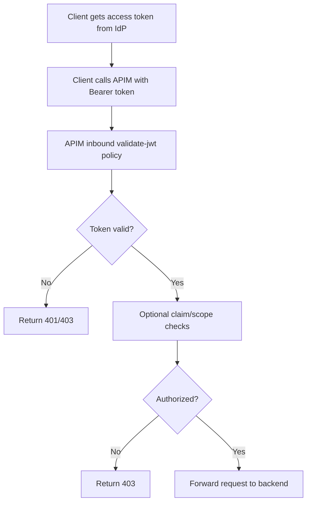
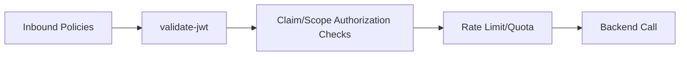
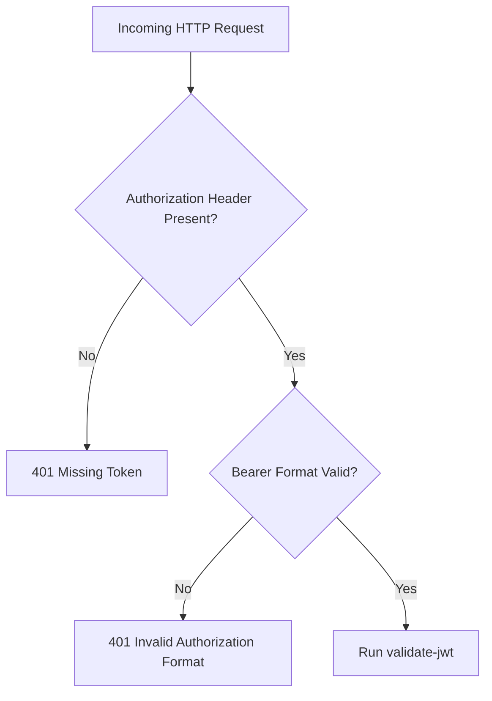
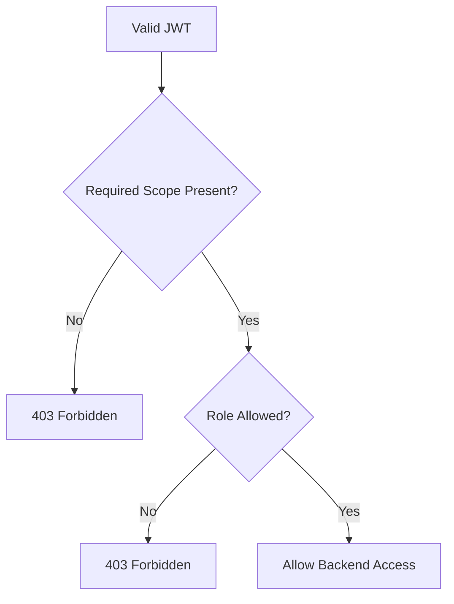
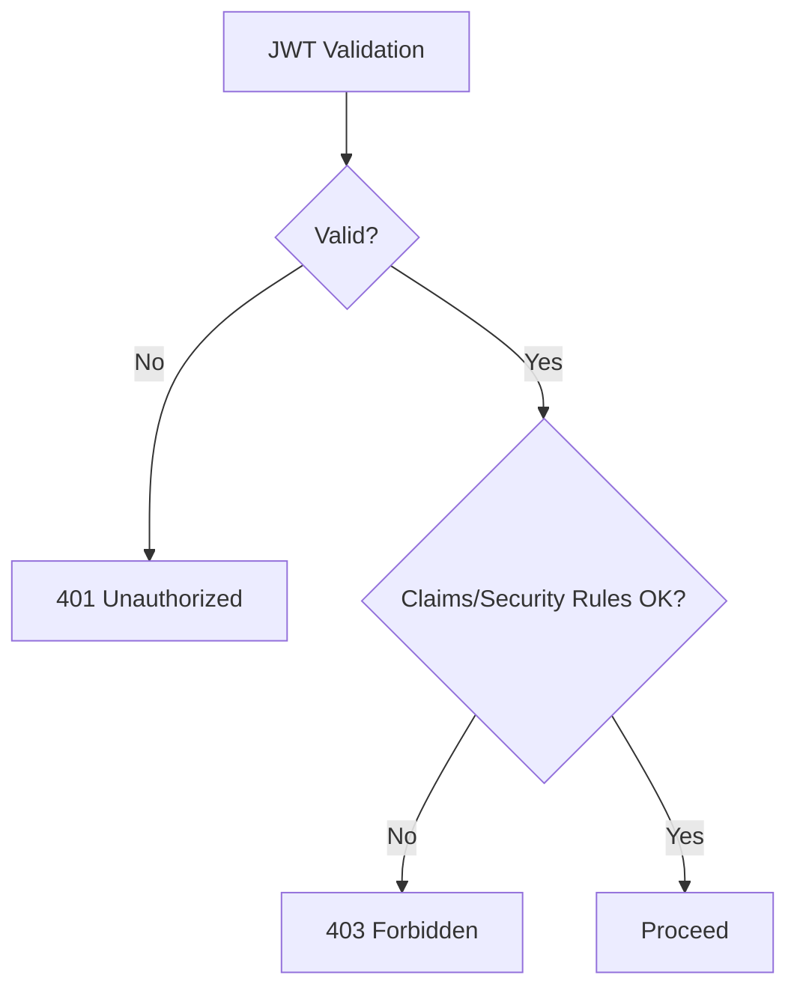
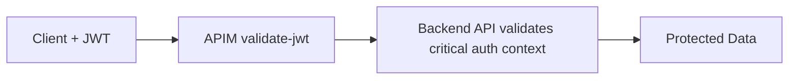
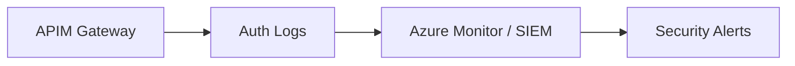

# How Do You Implement JWT Validation in Azure API Management (APIM)?
## Detailed Interview Preparation Guide with Flow Charts

---

## 1) Direct Interview Answer

In APIM, JWT validation is implemented using the **`validate-jwt` policy** in the inbound policy pipeline.  
You configure APIM to verify:

1. Token presence (usually `Authorization: Bearer <token>`)
2. Signature (via OpenID configuration or issuer signing keys)
3. Issuer (`iss`)
4. Audience (`aud`)
5. Expiration (`exp`) and not-before (`nbf`)
6. Optional required claims/scopes/roles

If validation fails, APIM blocks the request (typically 401/403) before the backend is called.

> One-liner: *Use APIM `validate-jwt` inbound policy to enforce token signature, issuer, audience, lifetime, and claims before forwarding requests.*

---

## 2) JWT Validation End-to-End Flow



---

## 3) Why Validate JWT in APIM?

- Centralizes authentication enforcement
- Prevents unauthorized traffic from reaching backend
- Standardizes security across APIs
- Reduces duplicate auth code in each microservice
- Supports zero-trust edge controls

Important:
> APIM validation is strong edge protection, but backend authorization can still be required for defense in depth.

---

## 4) Core JWT Checks You Should Enforce

## 4.1 Signature Validation
Ensures token integrity and trusted issuer signing keys.

## 4.2 Issuer Validation (`iss`)
Accept only tokens from approved identity provider(s).

## 4.3 Audience Validation (`aud`)
Ensure token was intended for your API/application.

## 4.4 Lifetime Validation (`exp`, `nbf`)
Reject expired or not-yet-valid tokens.

## 4.5 Claim Validation (Optional but common)
Require specific claims (e.g., tenant, appid, roles, scopes).

---

## 5) APIM Policy Pipeline Placement

JWT validation should occur early in **inbound** policies.



---

## 6) Typical Implementation Steps

1. Register/expose API in identity provider (e.g., Entra ID)
2. Define valid audience/app ID URI
3. Configure APIM `validate-jwt` in inbound policy
4. Reference OpenID configuration endpoint or signing keys
5. Add required issuer/audience values
6. Add claim checks (scope/role/tenant as needed)
7. Return clear unauthorized responses
8. Test with valid/invalid/expired/wrong-audience tokens
9. Add monitoring for auth failures

---

## 7) Conceptual APIM Policy Example (Interview-Friendly)

> Note: Values below are placeholders to explain structure.

```xml
<policies>
  <inbound>
    <base />

    <!-- 1) Validate bearer JWT -->
    <validate-jwt header-name="Authorization"
                  failed-validation-httpcode="401"
                  failed-validation-error-message="Unauthorized">
      <openid-config url="https://login.example.com/{tenant}/v2.0/.well-known/openid-configuration" />
      <audiences>
        <audience>api://your-api-audience</audience>
      </audiences>
      <issuers>
        <issuer>https://login.example.com/{tenant}/v2.0</issuer>
      </issuers>
      <required-claims>
        <claim name="scp" match="any">
          <value>api.read</value>
          <value>api.write</value>
        </claim>
      </required-claims>
    </validate-jwt>

    <!-- 2) Optional extra checks / transformations -->
  </inbound>

  <backend>
    <base />
  </backend>

  <outbound>
    <base />
  </outbound>

  <on-error>
    <base />
  </on-error>
</policies>
```

What this does:
- Reads token from Authorization header
- Fetches signing metadata from OIDC endpoint
- Validates issuer + audience + lifetime + signature
- Ensures required scope claim exists

---

## 8) Token Extraction Flow



---

## 9) Authorization After Authentication

JWT validation proves identity/token integrity.
Authorization decides permissions.



---

## 10) Multi-API Scope Design Pattern

For multiple APIs, validate audience and claims per API/product:

- Orders API: `orders.read`, `orders.write`
- Billing API: `billing.read`, `billing.charge`
- Admin API: role `ApiAdmin`

This avoids over-privileged tokens.

---

## 11) Common Claim Strategies

Depending on IdP and architecture, commonly validated claims include:
- `scp` (delegated scopes)
- `roles` (application roles)
- `tid` (tenant)
- `azp`/`appid` (calling app identity)
- `sub` (subject/user/service identity)

Design principle:
> Validate only claims necessary for least-privilege authorization.

---

## 12) Failure Handling Strategy

Return clear but non-sensitive errors:
- 401 for invalid/missing token
- 403 for authenticated-but-not-authorized



Avoid leaking internal validation internals in client-visible errors.

---

## 13) Performance Considerations

JWT validation is security-critical, but consider performance:
- Place validation early to fail fast
- Minimize unnecessary heavy policy logic pre-auth
- Monitor auth latency/error rates
- Ensure gateway scaling for peak token validation load

---

## 14) Security Hardening Best Practices

1. Enforce HTTPS only
2. Validate exact issuer(s), not broad wildcard assumptions
3. Validate exact audience(s)
4. Require expiration/not-before checks
5. Use short-lived access tokens where feasible
6. Combine with rate limiting and IP/network controls
7. Rotate keys via IdP standards (OIDC metadata usage)
8. Monitor repeated auth failures/anomalies
9. Apply backend zero-trust checks for sensitive operations

---

## 15) APIM JWT Validation + Backend Zero-Trust Pattern



For highly sensitive APIs, backend may re-check critical claims/permissions.

---

## 16) Environment Strategy (Dev/Test/Prod)

Use environment-specific:
- Issuers
- Audiences
- Tenant/app registrations
- Named values/secrets management patterns

Keep policy templates consistent, with parameterized values.

---

## 17) Observability and Alerting

Track:
- 401 rate
- 403 rate
- Invalid issuer/audience attempts
- Expired token frequency
- Per-client auth failure trends
- Geo/IP anomaly trends



---

## 18) Testing Matrix (Interview-Strong)

Test at least these scenarios:

1. Valid token, valid scope -> 200  
2. Missing token -> 401  
3. Expired token -> 401  
4. Wrong issuer -> 401  
5. Wrong audience -> 401  
6. Valid token but missing scope/role -> 403  
7. Malformed bearer header -> 401  
8. Token signed by unknown key -> 401  

---

## 19) Common Mistakes

1. Validating only signature but not audience/issuer  
2. Using broad audiences that allow token confusion  
3. Missing scope/role authorization checks  
4. Returning verbose auth error details to clients  
5. Treating subscription key as replacement for JWT auth  
6. No monitoring for brute-force/abuse patterns  
7. Assuming APIM alone eliminates backend auth responsibilities  

---

## 20) Interview Q&A (Strong Answers)

### Q1: How do you implement JWT validation in APIM?
**Answer:** I add `validate-jwt` in inbound policy, configure OpenID metadata/signing keys, enforce issuer/audience/lifetime checks, and apply required claim/scope validation before backend routing.

### Q2: Where should JWT validation happen in APIM policy flow?
**Answer:** Early in inbound policies, before backend routing and most other processing.

### Q3: What’s the difference between 401 and 403 here?
**Answer:** 401 is unauthenticated (missing/invalid token). 403 is authenticated but not authorized (missing required scope/role/claim).

### Q4: Is JWT validation enough by itself?
**Answer:** It’s necessary but not always sufficient; add rate limits, network restrictions, monitoring, and backend defense-in-depth for sensitive APIs.

### Q5: How do you avoid token misuse across APIs?
**Answer:** Strict audience validation per API plus fine-grained scope/role checks.

---

## 21) 60-Second Interview Pitch

> In APIM, I implement JWT validation using the inbound `validate-jwt` policy. I validate bearer token signature through the OpenID configuration/signing keys, enforce trusted issuer and intended audience, and ensure token lifetime is valid. After authentication, I enforce authorization using required scopes/roles/claims, then only forward authorized traffic to backends. I return 401 for invalid tokens and 403 for insufficient permissions, avoid leaking sensitive error details, and monitor auth failures in SIEM. For critical systems, I combine APIM validation with backend zero-trust checks, traffic controls, and network isolation.

---

## 22) Final Checklist

- [ ] `validate-jwt` policy in inbound pipeline  
- [ ] Signature validation configured (OIDC metadata or keys)  
- [ ] Exact issuer validation enabled  
- [ ] Exact audience validation enabled  
- [ ] Token lifetime checks enforced  
- [ ] Scope/role/claim authorization checks added  
- [ ] 401/403 behavior standardized  
- [ ] Auth failure monitoring + alerts configured  
- [ ] Backend defense-in-depth considered  

---

## One-Line Conclusion

> Implement JWT validation in APIM by enforcing signature, issuer, audience, lifetime, and claim checks in inbound `validate-jwt` policy before any backend access.