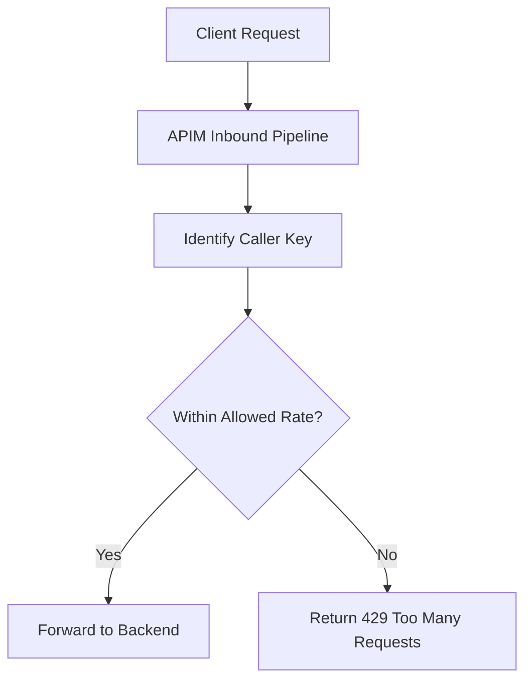
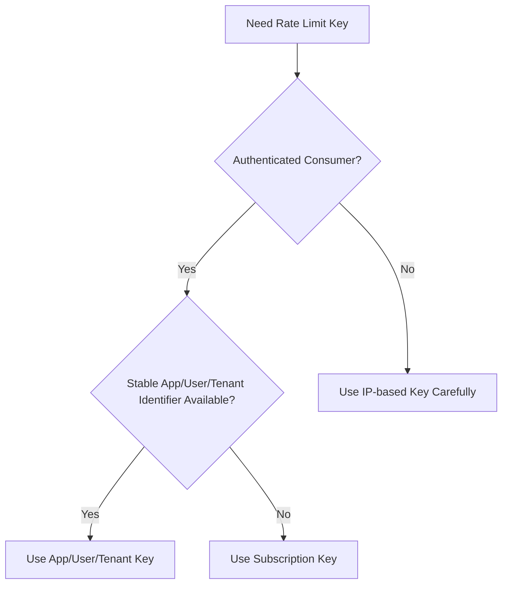
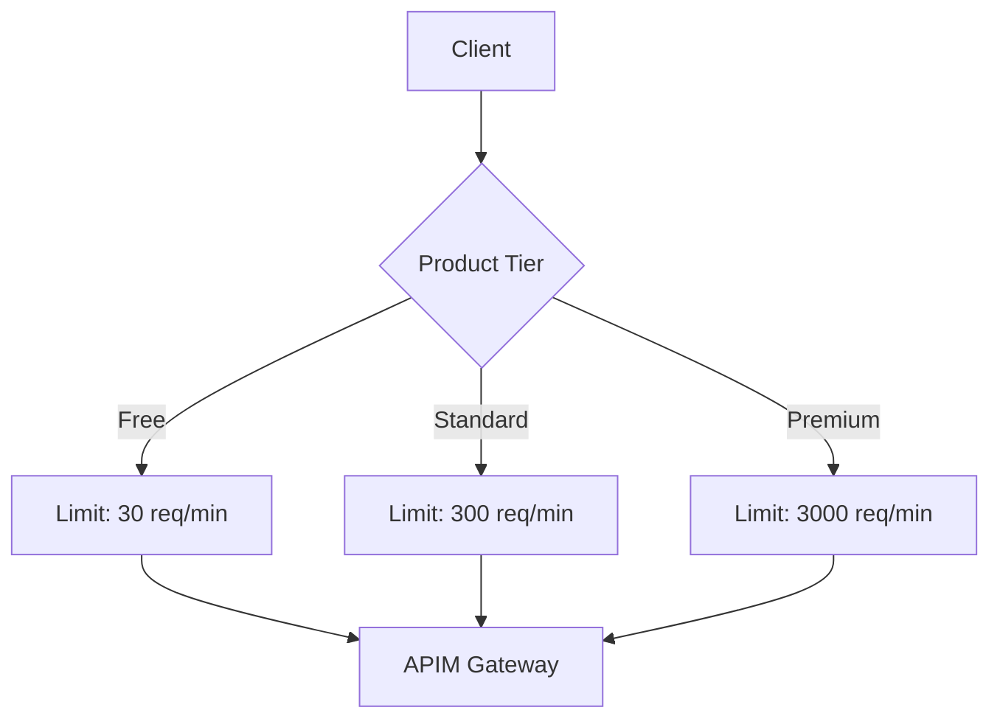
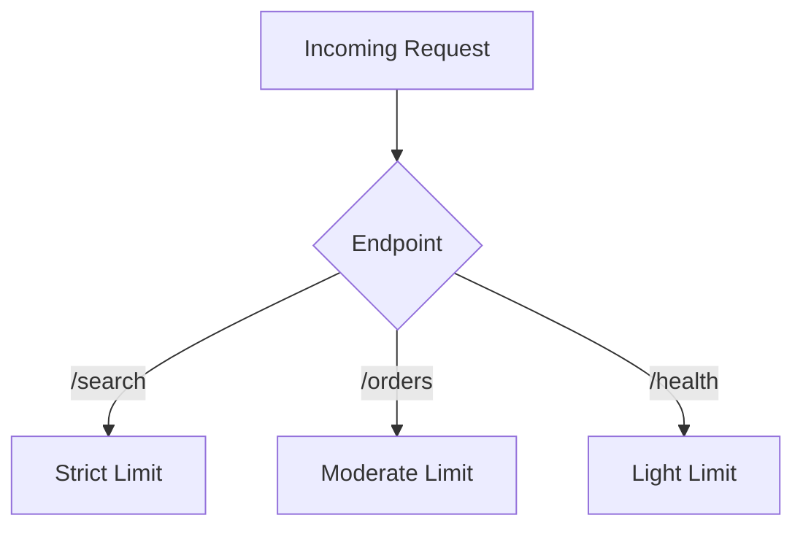
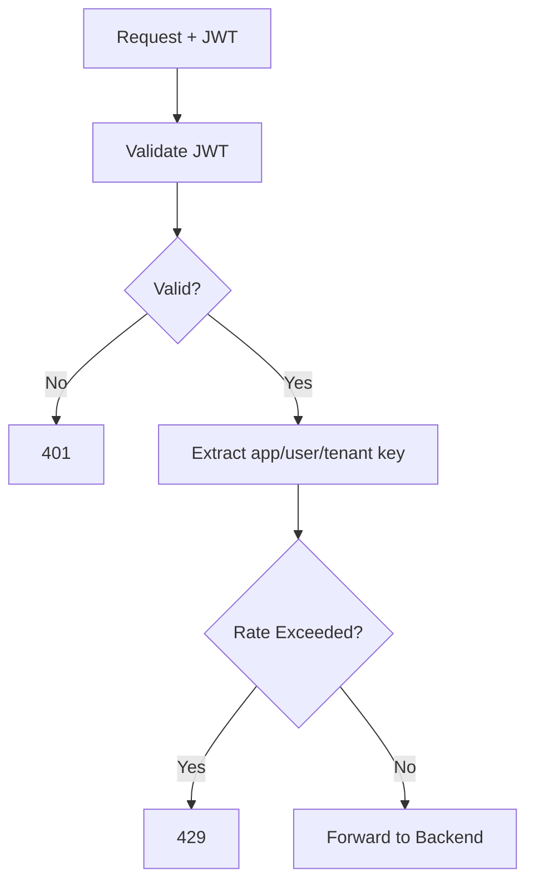
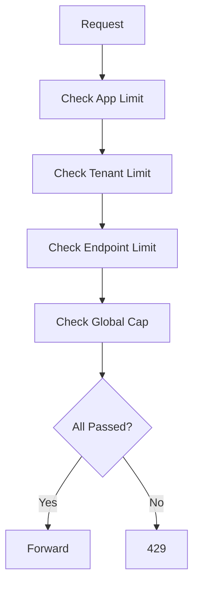
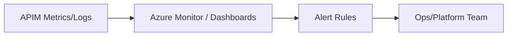
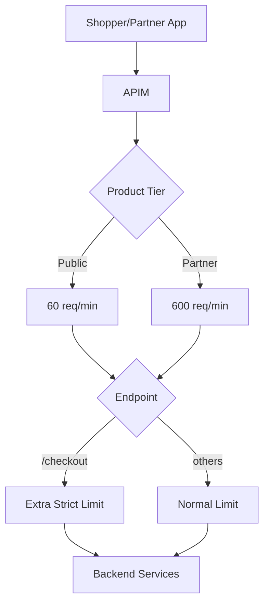

# How Do You Implement Rate Limiting in Azure API Management (APIM)?
## Detailed Interview Preparation Guide with Flow Charts

---

## 1) Direct Interview Answer

In APIM, rate limiting is implemented through **policies** (for example, rate-limit and quota policies) applied at scopes like **global, product, API, or operation** to control how many requests a caller can make in a time window.

Typical implementation steps:

1. Identify throttling key (subscription, client app, user, IP, tenant, etc.)
2. Define limits (e.g., 100 calls/minute)
3. Apply APIM rate-limit policy in inbound pipeline
4. Optionally combine with quotas (daily/weekly/monthly caps)
5. Return HTTP **429 Too Many Requests** when exceeded
6. Monitor, tune, and tier limits by consumer type

> One-liner: *Use APIM rate-limit policies in inbound processing to enforce per-key request ceilings and protect backend APIs from overload/abuse.*

---

## 2) Why Rate Limiting Matters

Without rate limiting:
- A single noisy consumer can overwhelm backend services
- Burst traffic can cause latency spikes and outages
- Fair usage across consumers becomes difficult
- API costs can increase unexpectedly

With rate limiting:
- Backends are protected
- Consumers get predictable behavior
- Platform reliability improves
- Abuse impact is reduced

---

## 3) High-Level Rate Limiting Flow



---

## 4) Core Concepts You Should Explain in Interviews

## 4.1 Rate Limit
Maximum number of requests allowed in a short rolling/fixed window (e.g., per 60 seconds).

## 4.2 Quota
Longer-period cap (e.g., per day/week/month), often for plan enforcement.

## 4.3 Throttling Key
The identity bucket used for counting requests:
- Subscription key
- Client app ID
- User ID / claim
- IP address
- Tenant ID
- Custom key from header/token

## 4.4 Scope
Where policy is applied:
- Global (all APIs)
- Product
- API
- Operation (endpoint-level)

---

## 5) APIM Policy Placement

Rate limiting is typically applied in **inbound** policies before backend call.


Recommended order:
1. Authenticate/identify caller
2. Apply rate policy based on caller key
3. Route to backend if allowed

---

## 6) Typical Implementation Blueprint

1. Classify consumers (internal, partner, public, premium, etc.)
2. Define per-tier limits (e.g., Bronze/Silver/Gold)
3. Choose throttling key source
4. Apply policy at right APIM scope
5. Standardize 429 response contract
6. Add retry guidance headers if applicable
7. Monitor 429 trends and backend health
8. Tune limits iteratively from real traffic data

---

## 7) Conceptual Policy Example (Interview-Friendly)

> Note: Placeholder example for structure understanding.

```xml
<policies>
  <inbound>
    <base />

    <!-- Example identity extraction could happen here -->

    <!-- Rate limit: max calls in a period -->
    <rate-limit-by-key calls="100"
                       renewal-period="60"
                       counter-key="@(context.Subscription?.Key ?? context.Request.IpAddress)" />

    <!-- Optional quota for longer period -->
    <quota-by-key calls="10000"
                  renewal-period="86400"
                  counter-key="@(context.Subscription?.Key ?? context.Request.IpAddress)" />

  </inbound>

  <backend>
    <base />
  </backend>

  <outbound>
    <base />
  </outbound>

  <on-error>
    <base />
  </on-error>
</policies>
```

What this achieves:
- 100 calls per 60 seconds per key
- 10,000 calls per day per key
- Excess calls get throttled (typically 429)

---

## 8) Throttling Key Selection Flow Chart



Interview note:
> Prefer stable identity keys over raw IP when possible, especially behind NAT/proxies.

---

## 9) Tiered Rate Limiting Pattern (Product-Based)



Useful for partner monetization and fair allocation.

---

## 10) Per-Endpoint (Operation-Level) Protection

Not all endpoints need same limits.

Examples:
- `/search` may need stricter limits (expensive query)
- `/health` may have lightweight limits
- `/checkout` may need tighter anti-abuse thresholds



---

## 11) Combining JWT + Rate Limit

Rate limits become more meaningful when tied to authenticated identity.



---

## 12) Handling 429 Responses Gracefully

When limit is exceeded:
- Return `429 Too Many Requests`
- Include client guidance (retry timing pattern)
- Keep response consistent across APIs

Client best practice:
- Exponential backoff + jitter
- Respect retry hints
- Avoid immediate retry storms

---

## 13) Rate Limiting vs Quota (Interview Distinction)

| Control | Purpose | Time Horizon |
|---|---|---|
| Rate Limit | Protect from short-term spikes | Seconds/minutes |
| Quota | Enforce plan or budget over time | Hours/days/months |

Best practice:
> Use both together for robust traffic governance.

---

## 14) Advanced Pattern: Multi-Dimensional Limits

Some systems enforce:
- Per app limit
- Per tenant limit
- Per endpoint limit
- Global safety cap



---

## 15) Observability for Rate Limiting

Track:
- Count of 429 responses
- Top throttled consumers
- Endpoint throttle distribution
- Backend latency before/after throttling
- Success/error ratio by tier
- Burst patterns by time of day



---

## 16) Tuning Strategy

Start conservative, then tune with data.

1. Baseline normal traffic
2. Define SLO/SLA and backend capacity
3. Set initial thresholds
4. Monitor 429 impact + backend health
5. Adjust per product/endpoint
6. Re-test under load

---

## 17) Common Mistakes (Interview Gold)

1. One flat limit for all consumers/endpoints  
2. Using only IP limits in enterprise NAT scenarios  
3. No distinction between rate limit and quota  
4. Missing monitoring for throttling side effects  
5. Over-throttling critical internal services  
6. Returning unclear throttle errors  
7. No client retry guidance (causes retry storms)  

---

## 18) Security + Rate Limiting Together

Rate limiting is also a security control:
- Reduces brute-force/API abuse blast radius
- Slows credential stuffing attempts
- Limits bot scraping intensity
- Helps absorb traffic anomalies

But it should complement:
- AuthN/AuthZ
- WAF/network controls
- Threat monitoring

---

## 19) Real-World Example (E-commerce API)

Goal:
- Protect order API during flash sales

Approach:
- Public product: 60 req/min per app
- Partner product: 600 req/min per app
- `/checkout`: strict per-user cap
- Global emergency cap for platform stability



---

## 20) Interview Q&A (Strong Answers)

### Q1: How do you implement rate limiting in APIM?
**Answer:** Apply inbound rate-limit policy (often by key), optionally combine with quota policy, and return 429 when thresholds are exceeded.

### Q2: What key should be used for rate limiting?
**Answer:** Prefer stable identity keys (subscription/app/user/tenant). Use IP carefully as fallback.

### Q3: Difference between rate limit and quota?
**Answer:** Rate limit controls short-term request velocity; quota controls total usage over longer periods.

### Q4: Where should rate limiting policy be applied?
**Answer:** Usually inbound, after caller identity is established and before backend call.

### Q5: How do you avoid throttling legitimate premium clients?
**Answer:** Use tiered limits per product/consumer class and tune using traffic analytics.

### Q6: What should clients do on 429?
**Answer:** Retry with exponential backoff and jitter, respecting retry guidance.

---

## 21) 60-Second Interview Pitch

> In APIM, I implement rate limiting with inbound policies such as rate-limit-by-key and combine that with quota-by-key for longer-term usage control. First, I authenticate and identify the caller, then apply limits using a stable key like subscription, app, user, or tenant ID. If limits are exceeded, APIM returns 429, protecting backend services from spikes and abuse. I typically define different limits by product tier and endpoint criticality, monitor 429 trends and backend latency, and tune thresholds iteratively. This gives fair usage, better reliability, and stronger API security posture.

---

## 22) Final Checklist

- [ ] Throttling key strategy defined  
- [ ] Rate limits configured (short window)  
- [ ] Quotas configured (long window)  
- [ ] Policies applied at correct scope (global/product/API/operation)  
- [ ] 429 response behavior standardized  
- [ ] Monitoring for 429 and backend health enabled  
- [ ] Tier-based and endpoint-based tuning completed  
- [ ] Client retry guidance documented  

---

## One-Line Conclusion

> Implement APIM rate limiting by enforcing per-identity request limits (and quotas) in inbound policies to protect backends, ensure fair usage, and improve API reliability.