# How Do You Secure APIs Using Azure API Management (APIM)?
## Detailed Interview Preparation Guide with Flow Charts

---

## 1) Direct Interview Answer

To secure APIs using APIM, apply **defense-in-depth** at the gateway and backend layers:

1. Authenticate callers (OAuth2/OIDC, JWT, client cert where needed)
2. Authorize by scopes/claims/products/subscriptions
3. Enforce traffic protections (rate limit, quota, spike control)
4. Validate inputs and sanitize outbound data
5. Restrict network access (private endpoints/VNet/IP filtering)
6. Protect secrets and certificates (Key Vault + managed identity)
7. Enable logging, monitoring, and threat detection
8. Keep backend zero-trust (don’t trust gateway-only)

> One-liner: *Secure APIs in APIM by combining strong identity, fine-grained authorization, traffic controls, network isolation, and continuous monitoring.*

---

## 2) Security Architecture (High Level)

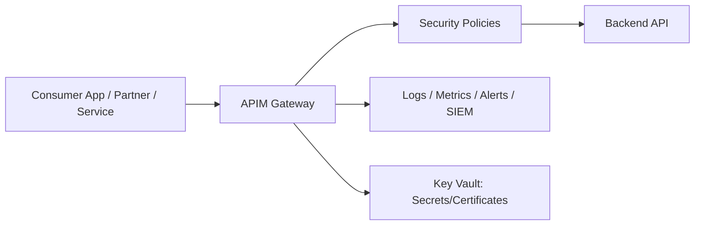

---

## 3) End-to-End Secure Request Flow

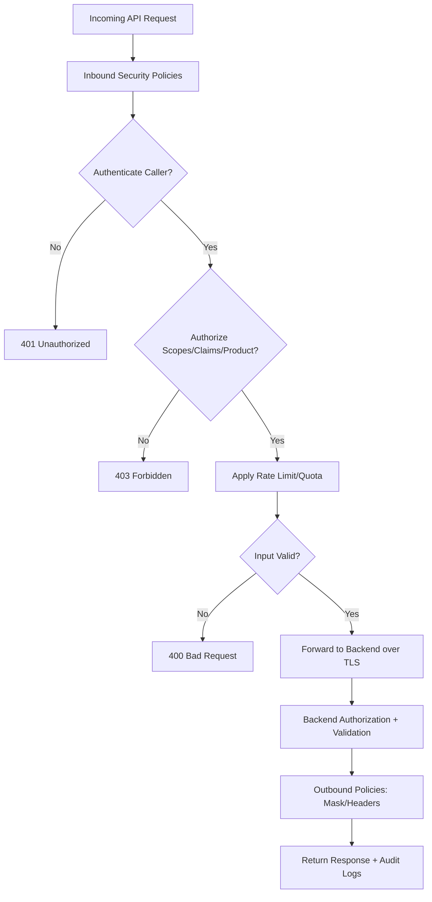

---

## 4) Security Principle: Defense in Depth

Never rely on one control.

Layer controls across:
- Identity layer
- Policy layer
- Network layer
- Backend service layer
- Monitoring/incident layer

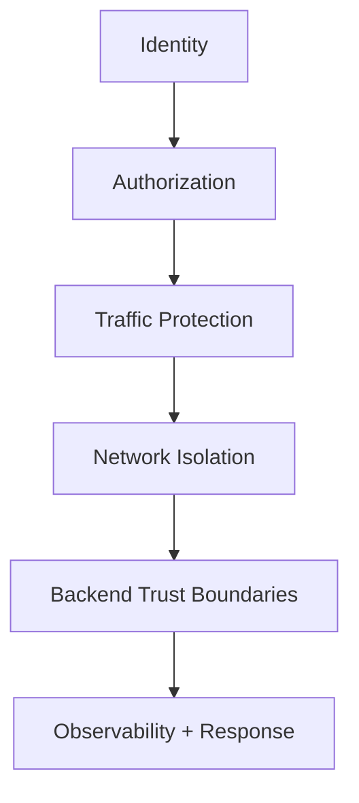

---

## 5) Authentication in APIM

## 5.1 OAuth2 / OpenID Connect + JWT
Most common modern approach.

- Client gets token from identity provider
- Sends bearer token to APIM
- APIM validates token issuer, audience, expiry, signature
- Optionally validates required claims/scopes

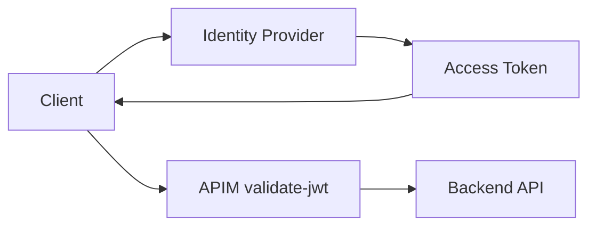

---

## 5.2 Subscription Keys (Product Access Control)
Useful for product-level onboarding and consumer tracking.
- Not a replacement for strong user/service auth by itself
- Often combined with OAuth/JWT

---

## 5.3 Client Certificate (mTLS patterns)
For B2B or high-trust machine-to-machine scenarios:
- Validate client certificate at gateway and/or backend
- Use certificate rotation governance

---

## 6) Authorization in APIM

After authentication, enforce **what the caller can do**.

Common authorization checks:
- Required scopes (e.g., `orders.read`, `orders.write`)
- Role/claim checks
- Product/subscription mapping
- Path/method restrictions by consumer type

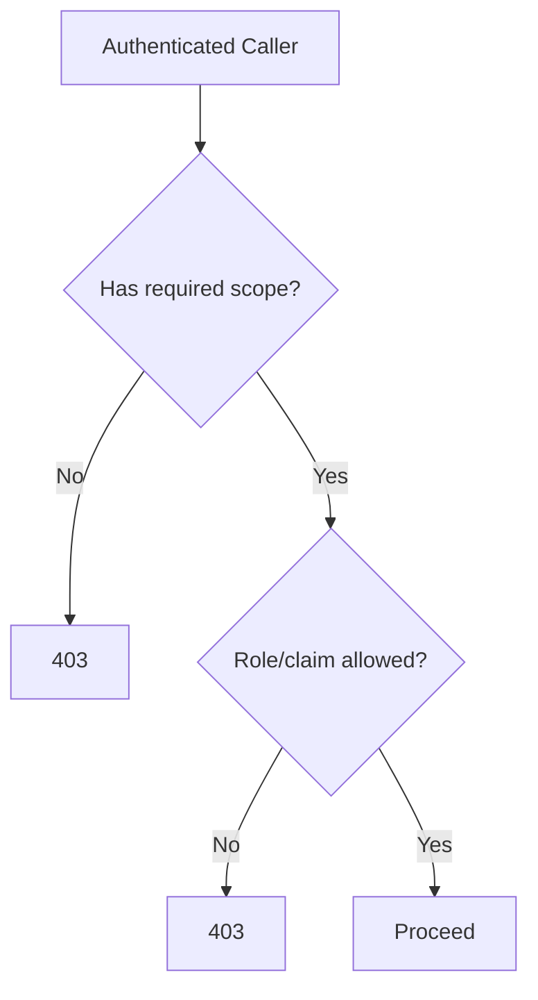

---

## 7) Traffic Protection Controls

Protect backends from abuse and accidental overload:
- Rate limits (calls per time window)
- Quotas (total calls per day/week/month)
- Spike arrest/throttling
- Concurrency controls (where applicable by architecture)

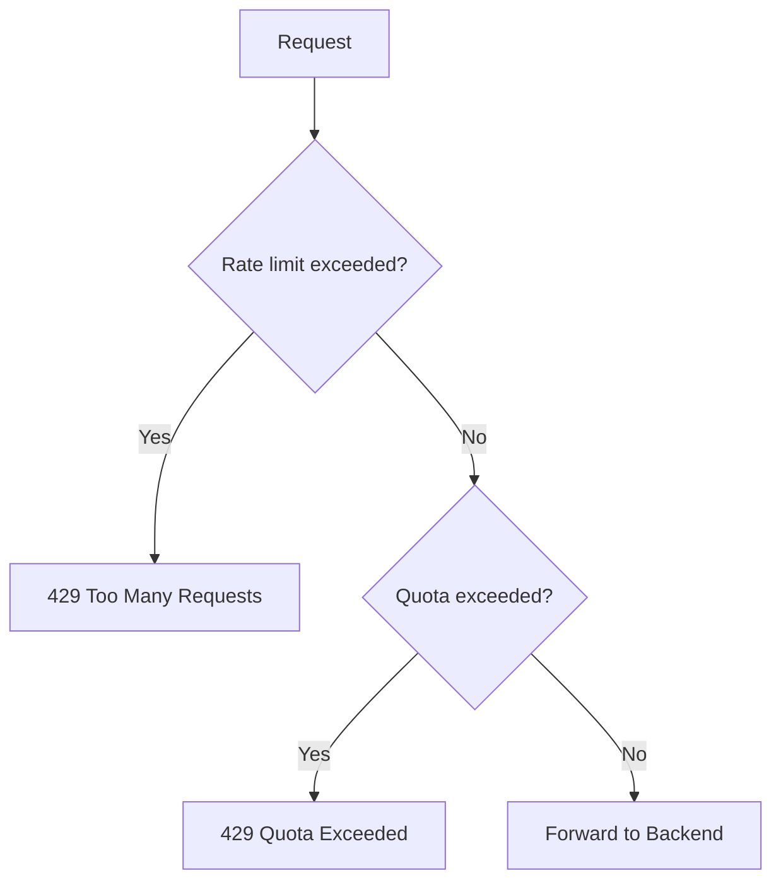

---

## 8) Input Validation and Threat Mitigation

Security isn’t only auth. Validate request shape:
- Content-Type and size restrictions
- Required headers/params
- Basic schema expectations
- Block malformed requests early
- Enforce allowed HTTP methods

Also:
- Remove/normalize sensitive headers
- Add correlation IDs for traceability

---

## 9) Response Hardening

Use outbound policies to:
- Remove internal headers
- Mask sensitive fields
- Standardize error payloads
- Prevent backend detail leakage (stack traces/internal IDs)

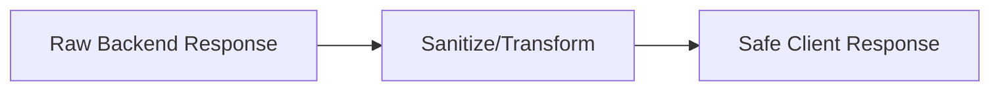

---

## 10) Network Security with APIM

Use network controls to reduce attack surface:
- Private networking patterns (internal mode/VNet integration where applicable)
- IP allow/deny lists
- Private endpoints for backend dependencies
- Restrict direct backend public exposure

Goal:
- Clients call APIM endpoint
- Backend not broadly internet-exposed (as architecture allows)

---

## 11) Secret and Certificate Management

Best practices:
- Store secrets/certs in Azure Key Vault
- Use managed identity for APIM-to-Key Vault access
- Rotate keys/certs regularly
- Avoid hardcoded secrets in policy/code

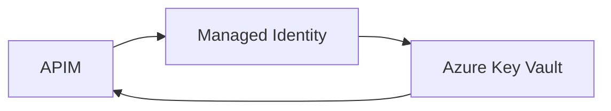

---

## 12) Backend Security (Zero Trust Reminder)

APIM is a strong gate, but backend must still enforce security:
- Validate tokens/claims where required
- Restrict backend to APIM/network boundary
- Use backend auth (mTLS, managed identity, service auth)
- Apply least privilege in data access

Interview phrase:
> APIM improves edge security, but backend APIs must remain independently secure.

---

## 13) Secure B2B API Pattern

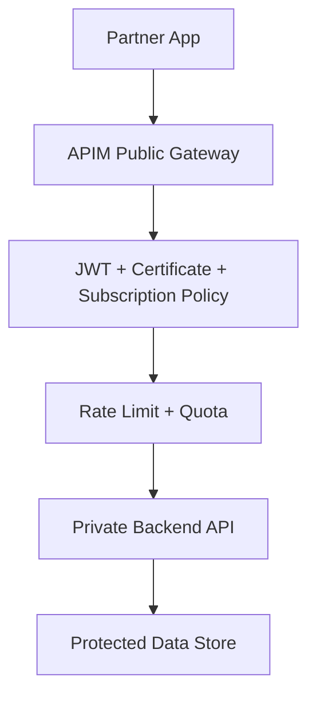

---

## 14) Internal API Security Pattern

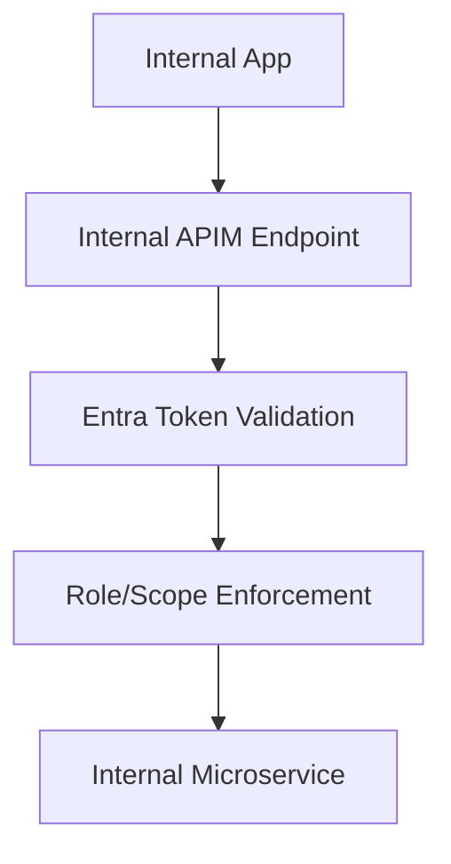

---

## 15) Logging, Monitoring, and Detection

Track and alert on:
- Auth failures (401/403 spikes)
- Throttling spikes (429)
- Geographic anomaly patterns
- Token validation errors
- Latency and 5xx increases
- Suspicious payload patterns

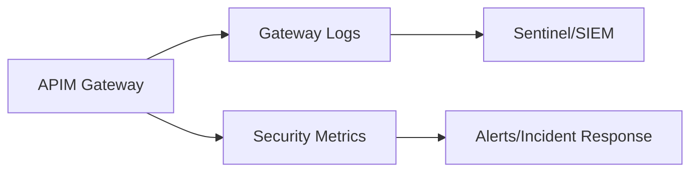

---

## 16) Incident Response Playbook (Interview Depth)

If abuse/attack suspected:
1. Tighten rate limits/quotas quickly
2. Block offending IPs or keys
3. Revoke compromised credentials
4. Rotate secrets/certificates
5. Enable enhanced logging
6. Apply emergency policy patch
7. Post-incident review and policy hardening

---

## 17) Policy Layering Strategy

Apply policies at proper scopes:
- Global (organization baseline)
- Product (consumer segment controls)
- API (domain controls)
- Operation (sensitive endpoint controls)

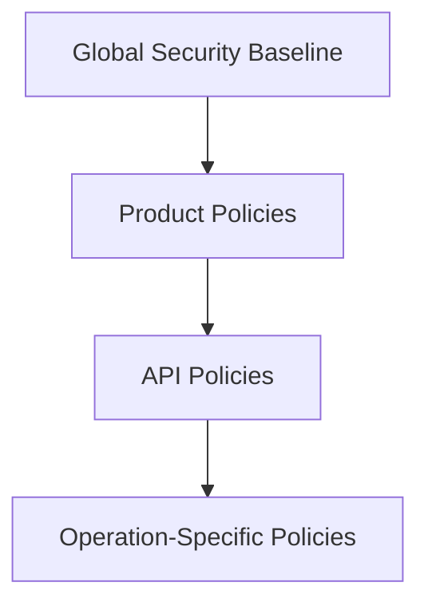

This avoids policy drift and improves maintainability.

---

## 18) Common Security Anti-Patterns

1. Using subscription keys as the only auth mechanism for sensitive APIs  
2. No JWT audience/issuer/scope validation  
3. Overly broad backend network exposure  
4. Hardcoded secrets/certs in configs  
5. Missing rate limits on public endpoints  
6. Leaking backend error details to clients  
7. No 401/403/429 alerting  
8. Assuming APIM replaces backend authorization  

---

## 19) Practical Security Checklist (Production)

- [ ] OAuth2/OIDC configured for external/internal clients  
- [ ] JWT validation policy enforced (issuer, audience, expiry, signature)  
- [ ] Scope/claim authorization checks implemented  
- [ ] Rate limit + quota configured by consumer class  
- [ ] Request size/method/content-type restrictions set  
- [ ] Sensitive response fields/headers sanitized  
- [ ] Backend isolated from direct public access where possible  
- [ ] Secrets/certs in Key Vault with rotation policy  
- [ ] APIM + backend logs integrated with SIEM  
- [ ] Alerts for auth failures, throttling spikes, and anomaly patterns  

---

## 20) Interview Q&A (Strong Answers)

### Q1: How do you secure APIs with APIM?
**Answer:** I enforce layered security: OAuth/JWT authentication, scope/claim authorization, rate limiting/quotas, network restrictions, secret management with Key Vault, and continuous monitoring.

### Q2: Is subscription key enough for API security?
**Answer:** Usually no for sensitive APIs. It’s useful for product access and tracking but should be combined with strong identity-based auth (OAuth/JWT).

### Q3: Where should token validation happen?
**Answer:** At APIM gateway at minimum; backend may also validate depending on trust boundary and zero-trust requirements.

### Q4: How do you prevent API abuse?
**Answer:** Rate limits, quotas, IP filtering, anomaly monitoring, and rapid revocation/rotation playbooks.

### Q5: How do you protect secrets?
**Answer:** Store in Key Vault, access via managed identity, and rotate regularly.

### Q6: Does APIM remove need for backend security?
**Answer:** No. Backend must still enforce authorization and secure network/data access.

---

## 21) 60-Second Interview Pitch

> To secure APIs with APIM, I implement defense in depth. I authenticate using OAuth2/OIDC and validate JWTs at the gateway, then authorize using scopes/claims and product-level access controls. I protect backend capacity using rate limits and quotas, validate request structure to block malformed traffic, and sanitize outbound responses to avoid data leakage. I isolate networks so backends aren’t broadly exposed, and manage secrets/certificates in Key Vault via managed identity. Finally, I integrate APIM logs and metrics with SIEM and alerting for 401/403/429 spikes and suspicious traffic patterns. APIM is the policy enforcement edge, but backend security remains mandatory.

---

## 22) One-Line Conclusion

> Secure APIs in APIM by combining strong identity validation, fine-grained authorization, abuse protection, network isolation, secure secret management, and continuous security monitoring.