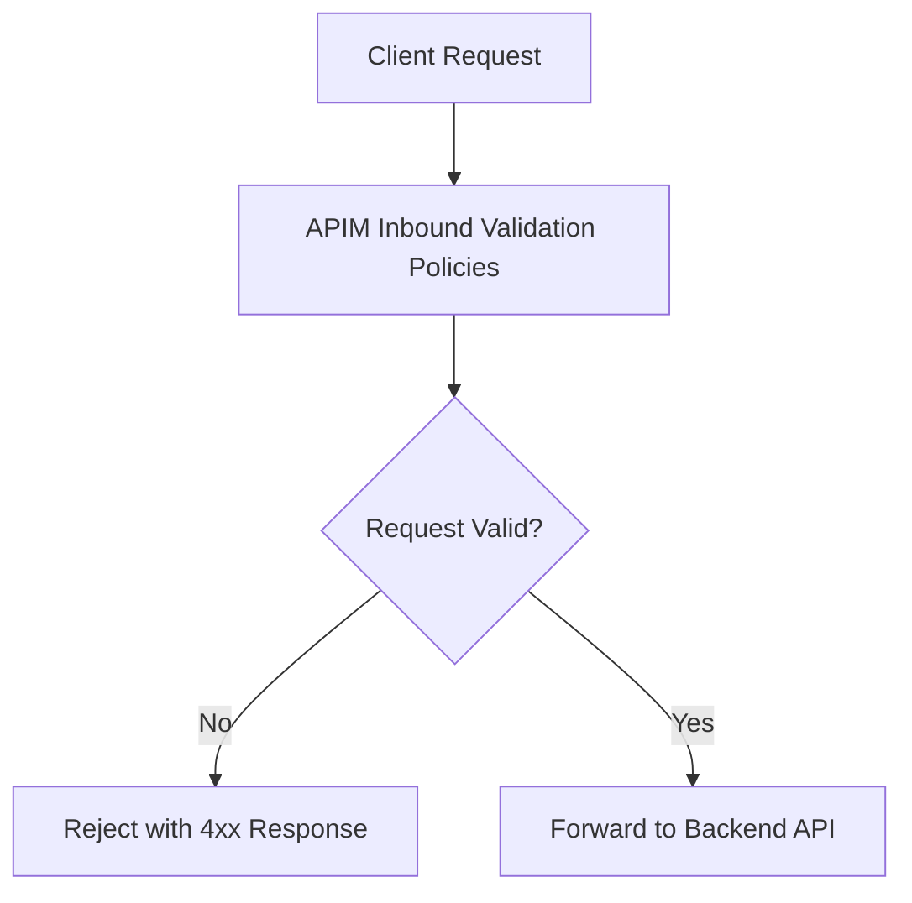
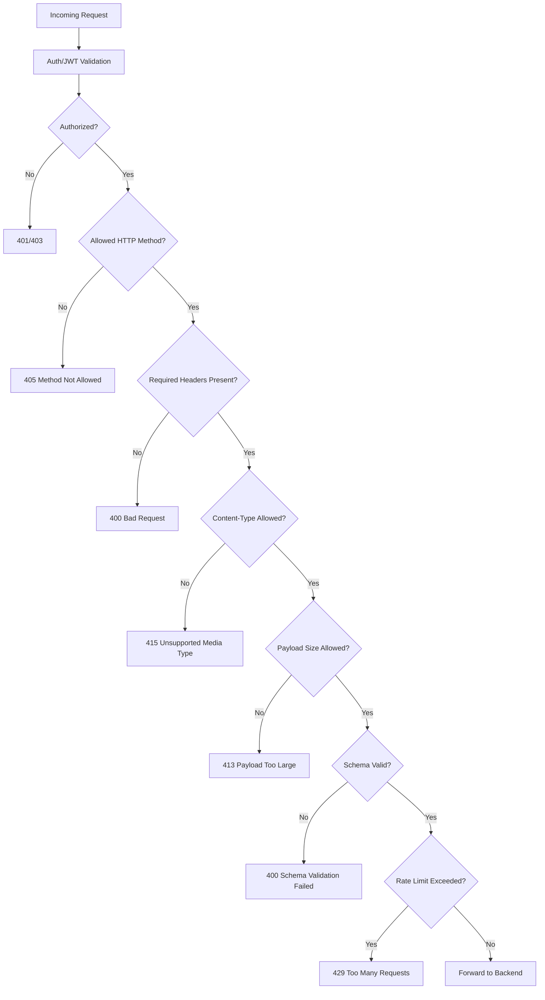
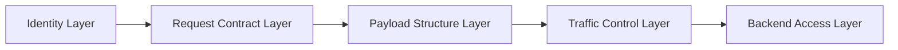
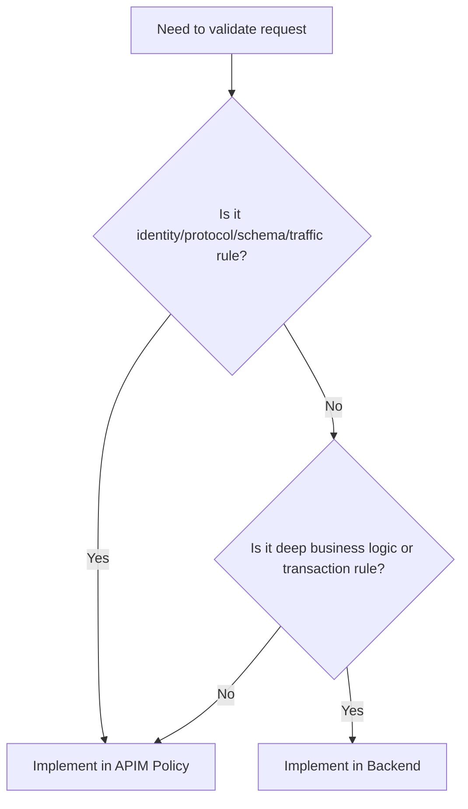
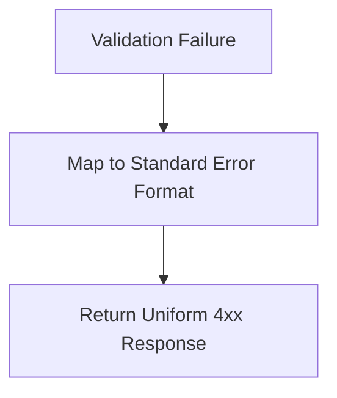
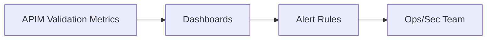

# How Do You Validate API Requests Without Writing Code?
## Detailed Interview Preparation Guide with Flow Charts (APIM-Focused)

---

## 1) Direct Interview Answer

You can validate requests **without writing backend code** by using **Azure API Management (APIM) policies** at the gateway layer.

This lets you enforce:

1. Authentication and authorization checks  
2. Required headers/query parameters  
3. HTTP method restrictions  
4. Content-Type and size constraints  
5. JSON/XML schema validation (policy-based)  
6. Rate limits and quotas  
7. IP filtering and basic threat controls  

If a request is invalid, APIM rejects it (e.g., 400/401/403/405/413/415/429) before it reaches backend APIs.

> One-liner: *Use APIM policy-based validation in the inbound pipeline to block invalid requests before backend execution—no backend code changes required.*

---

## 2) Why “No-Code Validation” Matters

Without gateway validation:
- Every microservice duplicates validation logic
- Inconsistent enforcement across teams
- Higher backend load from bad traffic
- Slower delivery and governance drift

With APIM validation:
- Centralized, reusable rules
- Faster rollout of validation policies
- Consistent security/compliance posture
- Lower backend noise and cost

---

## 3) High-Level Validation Flow

---

## 4) What You Can Validate in APIM (Without Backend Code)

## 4.1 Identity & Access Validation
- JWT token presence and validity
- Issuer/audience/expiry checks
- Required scopes/claims
- Subscription key presence/validity (if used)

## 4.2 Protocol/Contract Validation
- Allowed HTTP methods
- Required headers
- Query parameter existence/format patterns
- Content-Type restrictions (`application/json`, etc.)
- Payload size limit checks

## 4.3 Schema/Structure Validation
- Validate request body against JSON schema
- Validate XML where applicable
- Enforce required fields and data types

## 4.4 Traffic/Abuse Validation
- Rate limiting
- Quotas
- IP filtering / allow-deny controls

---

## 5) End-to-End Request Validation Pipeline

---

## 6) Typical No-Code APIM Validation Building Blocks

In practice, teams combine policy types such as:
- `validate-jwt` (identity validation)
- Header/query checks using policy expressions
- Content-type checks
- Body/schema validation policies
- `rate-limit` / `quota` policies
- `check-header`, `ip-filter`, and related guardrail policies
- `return-response` for custom validation failures

---

## 7) Example Validation Strategy by Layer

### Layer 1: Identity
- Validate token/key before any expensive checks

### Layer 2: Contract
- Enforce method, path, required headers, query params

### Layer 3: Payload
- Validate structure and schema

### Layer 4: Traffic
- Apply rate/quotas to protect backend

### Layer 5: Access
- Forward only clean, authorized requests

---

## 8) Practical Validation Scenarios (Interview-Ready)

## Scenario A: Missing Header
Rule: `x-correlation-id` is mandatory  
Outcome: reject with 400 if absent

## Scenario B: Wrong Content-Type
Rule: only `application/json` allowed  
Outcome: reject with 415

## Scenario C: Invalid JWT
Rule: token must match issuer/audience and be unexpired  
Outcome: reject with 401

## Scenario D: Missing Required JSON Field
Rule: body must contain `customerId` and `orderItems`  
Outcome: reject with 400 (schema invalid)

## Scenario E: Burst Abuse
Rule: max 100 requests/min per client key  
Outcome: reject excess with 429

---

## 9) No-Code Validation vs Backend Validation

| Validation Type | APIM (No-Code Layer) | Backend |
|---|---|---|
| Auth token structure/issuer/audience | Excellent | Also possible |
| Required headers/query/method | Excellent | Possible |
| Content-type/size guardrails | Excellent | Possible |
| Basic schema validation | Good | Strong |
| Deep business rule validation | Limited | Best place |
| Domain invariants / transactional rules | Not ideal | Best place |

Interview phrase:
> Use APIM for gateway-level syntactic and security validation; keep domain/business validation in backend services.

---

## 10) APIM Validation Decision Flow

---

## 11) Error Response Standardization (No-Code)

APIM can enforce consistent error envelope for validation failures:
- Standard error code
- Human-readable message
- Correlation ID
- Timestamp

Benefit:
- Better client developer experience
- Faster troubleshooting
- Consistent API contract behavior

---

## 12) Security Benefits of No-Code Validation

- Blocks malicious/invalid traffic early
- Reduces backend attack surface
- Enforces enterprise standards globally
- Supports zero-trust API edge posture
- Simplifies audit/compliance evidence

---

## 13) Performance Benefits

Early rejection at gateway means:
- Less backend CPU/memory usage
- Lower downstream DB/API load
- Better overall latency for valid traffic
- More predictable scaling behavior

---

## 14) Governance Benefits

With APIM policies, platform teams can:
- Reuse validation policy fragments/templates
- Roll out org-wide controls quickly
- Keep environments consistent (dev/test/prod)
- Manage changes via CI/CD and policy-as-code

---

## 15) Common “No-Code Validation” Anti-Patterns

1. Putting complex business logic in APIM policies  
2. Skipping backend validation entirely  
3. Inconsistent policy scopes across APIs  
4. Returning verbose internal error details  
5. No monitoring of validation failures  
6. Not versioning validation rules with API lifecycle  

---

## 16) Monitoring What Matters

Track:
- 400/401/403/405/413/415/429 rates
- Top failing validation reasons
- Top offending clients/IPs
- False-positive validation rejects
- Latency impact of policy chain

---

## 17) Interview Q&A (Strong Answers)

### Q1: How can you validate requests without writing backend code?
**Answer:** Use APIM inbound policies for auth validation, header/query checks, content-type/method restrictions, schema validation, and traffic controls.

### Q2: Can APIM replace all backend validation?
**Answer:** No. APIM handles gateway/security/contract checks well; deep business rules must remain in backend services.

### Q3: What status codes are common for APIM validation failures?
**Answer:** 400, 401, 403, 405, 413, 415, and 429 depending on the failed rule.

### Q4: Why is this approach useful in microservices?
**Answer:** It centralizes common validations, reduces duplicate code, and keeps policy enforcement consistent across many services.

### Q5: How do you avoid policy sprawl?
**Answer:** Use policy templates/fragments, clear scope strategy (global/product/API/operation), and CI/CD governance.

---

## 18) 60-Second Interview Pitch

> I validate requests without backend code by enforcing APIM inbound policies at the API gateway. First, I validate identity (JWT/subscription key), then contract checks like method, headers, query params, content-type, payload size, and schema. I also apply rate limits and quotas to prevent abuse. Invalid requests are rejected with standardized 4xx responses before reaching backend services, which reduces load and improves security consistency. I still keep domain-specific business validation in backend code, using APIM as the centralized edge validation and governance layer.

---

## 19) Final Checklist

- [ ] JWT/auth validation configured  
- [ ] Required headers/query params enforced  
- [ ] Method/content-type/size checks enforced  
- [ ] Schema validation applied where needed  
- [ ] Rate limit + quota policies enabled  
- [ ] Standardized 4xx error responses configured  
- [ ] Validation metrics/alerts configured  
- [ ] Backend business-rule validation retained  

---

## One-Line Conclusion

> Validate requests without writing backend code by enforcing APIM policy-based identity, contract, payload, and traffic rules in the inbound gateway pipeline.