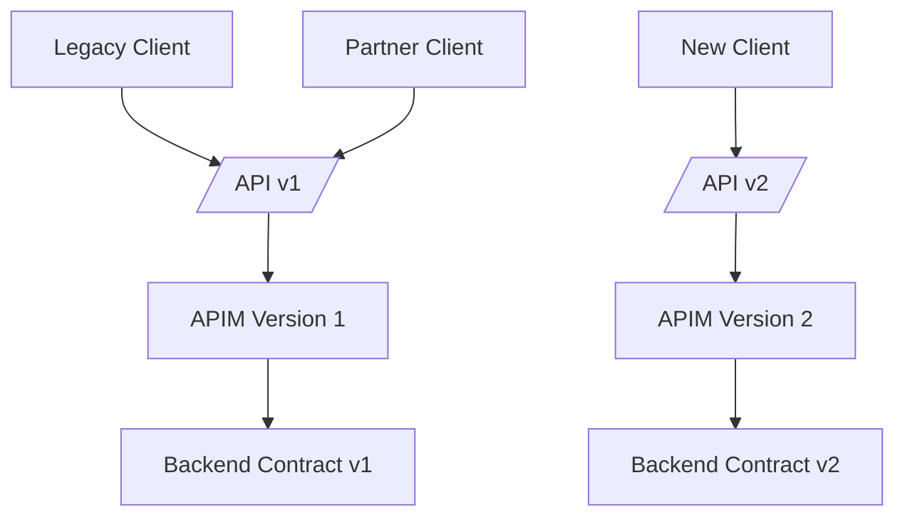
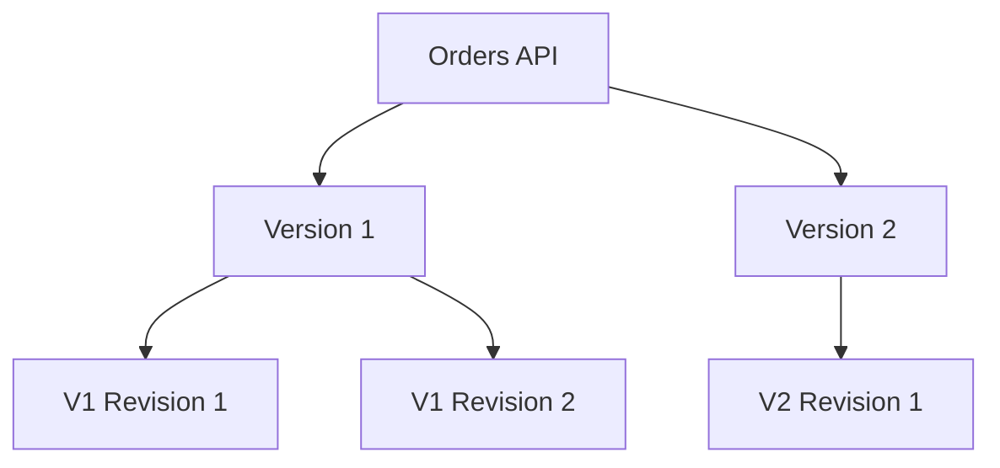
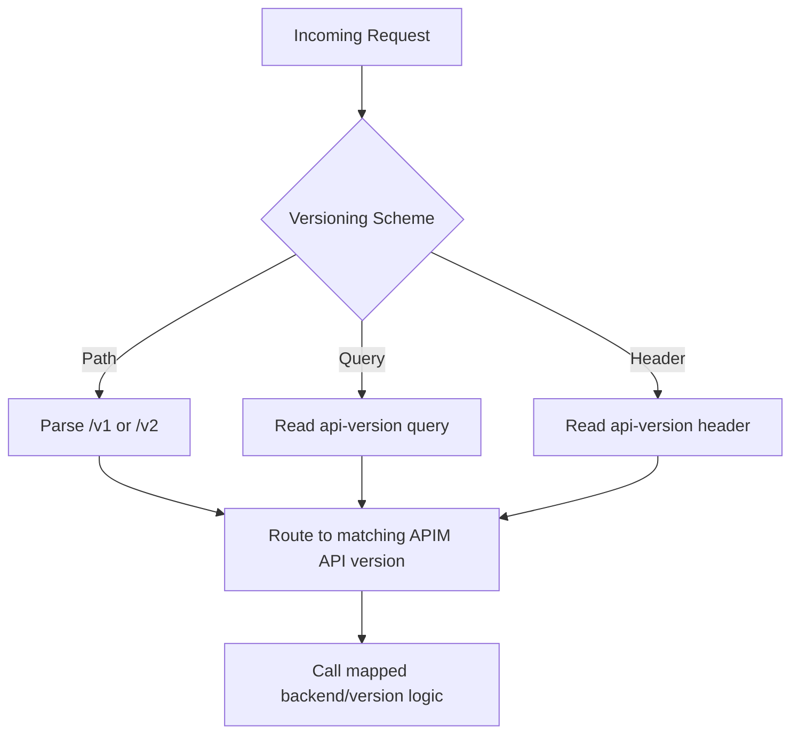
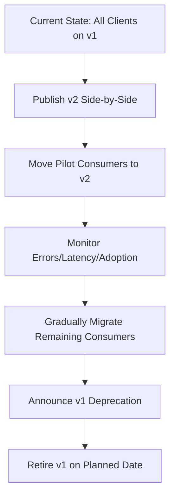
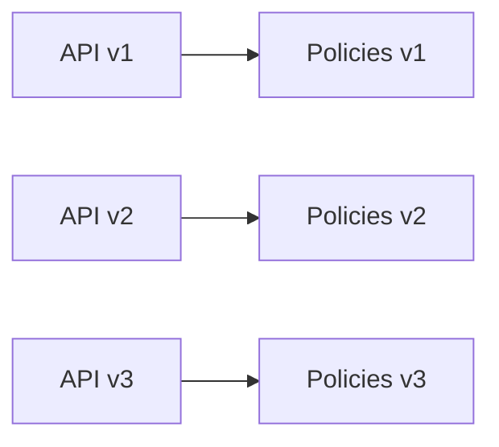
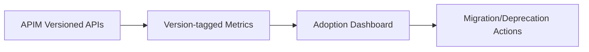

# How Do You Version APIs in Azure API Management (APIM)?
## Detailed Interview Preparation Guide with Flow Charts

---

## 1) Direct Interview Answer

In APIM, API versioning is implemented by creating multiple versions of an API under a **version set**, then exposing each version using a strategy such as:

1. **URL path versioning** (e.g., `/v1/orders`, `/v2/orders`)
2. **Query-string versioning** (e.g., `?api-version=1.0`)
3. **Header versioning** (e.g., `api-version: 1.0`)

APIM lets you run versions side-by-side, apply version-specific policies, and migrate consumers safely without breaking existing clients.

> One-liner: *Use APIM version sets to publish multiple API versions concurrently and evolve contracts safely.*

---

## 2) Why Version APIs?

Without versioning:
- Breaking changes disrupt existing clients
- Coordinated “big-bang” upgrades are risky
- Partner/mobile integrations fail unpredictably

With versioning:
- Backward compatibility is preserved
- New features can ship faster
- Consumers migrate on their own timelines
- Deprecation can be controlled and observable

---

## 3) APIM Versioning Big Picture

Multiple versions coexist until migration is complete.

---

## 4) APIM Versioning Concepts (Must Know)

## 4.1 Version Set
Logical container grouping versions of the same API.

## 4.2 API Version
A distinct contract/runtime surface (v1, v2, etc.).

## 4.3 Versioning Scheme
How clients specify requested version:
- Path
- Query
- Header

## 4.4 Revision vs Version (Critical Interview Distinction)
- **Version**: contract evolution (often breaking or major functional change)
- **Revision**: non-breaking update within same version (fixes, minor internal updates)

---

## 5) Version vs Revision Flow

Interview phrase:
> Use revisions for safe, non-breaking iteration; use versions for contract evolution and breaking changes.

---

## 6) Versioning Strategies in APIM

## 6.1 Path Versioning (Most Common)
Examples:
- `/v1/orders`
- `/v2/orders`

Pros:
- Very explicit
- Easy routing and caching
- Client-visible and easy to document

Cons:
- URL changes between versions

---

## 6.2 Query Versioning
Example:
- `/orders?api-version=1.0`

Pros:
- Stable base path

Cons:
- Can be less explicit in some tooling and caching setups

---

## 6.3 Header Versioning
Example:
- `api-version: 1.0`

Pros:
- Cleaner URL

Cons:
- Less visible in browser/manual testing
- Some clients/proxies handle headers inconsistently if not managed carefully

---

## 7) Version Routing Flow Chart

---

## 8) Step-by-Step: Implement Versioning in APIM

1. Define versioning strategy (path/query/header)
2. Create a version set
3. Add v1 API to version set
4. Add v2 API to same version set
5. Configure operations/policies per version
6. Publish both versions
7. Track consumer usage by version
8. Communicate deprecation timeline
9. Retire old version after migration completion

---

## 9) Real Migration Example (v1 -> v2)

---

## 10) Deprecation and Sunset Governance

Best practice lifecycle:
1. Announce deprecation early
2. Provide migration guide
3. Set sunset date
4. Add warnings/headers/portal notices
5. Track lagging consumers
6. Escalate communication
7. Disable old version post-deadline

---

## 11) Policy Differences Across Versions

You can apply different policies per version, for example:
- v1: legacy auth compatibility + lower limits
- v2: stricter JWT scopes + improved response format
- v3: enhanced security and performance defaults

---

## 12) Backend Mapping Patterns for Versions

Pattern A: Separate backend per version
- v1 -> backend-v1
- v2 -> backend-v2

Pattern B: Same backend with adapter logic
- APIM transforms v1/v2 requests to common internal model

Pattern C: Hybrid phased modernization
- v1 legacy backend, v2 modern backend

---

## 13) Contract Compatibility Guidelines

Treat these as **breaking** (usually new version):
- Removing fields
- Renaming fields
- Changing types
- Changing semantics of existing values
- Tightening required constraints unexpectedly

Usually **non-breaking**:
- Adding optional fields
- Adding new optional endpoints
- Performance improvements without contract change

---

## 14) Consumer Communication Strategy

For version transitions:
- Developer portal documentation per version
- Changelog with examples
- SDK/client updates (if applicable)
- Migration FAQ
- Timeline with milestones
- Contact path for affected partners

---

## 15) Observability for Versioning

Track by version:
- Request volume
- Error rates
- Latency
- Top consumers still on older versions
- Adoption curve over time

---

## 16) Security Considerations in Versioning

- Avoid long-lived insecure legacy versions
- Apply baseline security across all versions
- Prefer stronger defaults in new versions
- Plan forced retirement for vulnerable versions
- Keep auth policy drift under control

---

## 17) Common Versioning Anti-Patterns

1. No explicit versioning from day one  
2. Using revisions for breaking changes  
3. Running old versions forever with no sunset  
4. Poor migration communication  
5. Same limits/policies for incompatible client generations  
6. Not measuring adoption by version  

---

## 18) Interview Q&A (Strong Answers)

### Q1: How do you version APIs in APIM?
**Answer:** I create a version set, add multiple API versions (v1, v2), choose a versioning scheme (path/query/header), and run versions side-by-side for safe client migration.

### Q2: Version vs revision in APIM?
**Answer:** Version is for contract evolution (often breaking changes). Revision is for non-breaking updates within the same version.

### Q3: Which versioning strategy is best?
**Answer:** Path versioning is most explicit and common, but the best choice depends on client ecosystem, governance, and caching/tooling constraints.

### Q4: How do you migrate from v1 to v2 safely?
**Answer:** Publish v2 in parallel, pilot with select consumers, monitor, gradually migrate, announce deprecation, and retire v1 with a clear timeline.

### Q5: Can policies differ per version?
**Answer:** Yes, APIM allows version-specific policies for security, throttling, transformations, and routing.

### Q6: How do you know when to retire old versions?
**Answer:** Use version-level telemetry to confirm adoption thresholds and coordinate retirement after formal deprecation communication.

---

## 19) 60-Second Interview Pitch

> In APIM, I version APIs using a version set and expose versions via path, query, or header strategy—most often path for clarity. I run v1 and v2 side-by-side so existing clients remain stable while new clients adopt improved contracts. I use revisions for non-breaking updates inside a version and reserve new versions for breaking changes. During migration, I monitor version-specific usage, errors, and latency, communicate deprecation timelines through the developer portal, and retire old versions only after adoption goals are met. This gives controlled API evolution with minimal client disruption.

---

## 20) Final Checklist

- [ ] Versioning strategy selected (path/query/header)  
- [ ] Version set created and documented  
- [ ] v1 and v2 published side-by-side  
- [ ] Clear distinction between revision vs version  
- [ ] Version-specific policies configured  
- [ ] Migration guide and deprecation timeline published  
- [ ] Version adoption metrics monitored  
- [ ] Retirement criteria defined for old versions  

---

## One-Line Conclusion

> Version APIs in APIM by using version sets and explicit versioning schemes to evolve contracts safely, run parallel versions, and deprecate older versions in a controlled way.