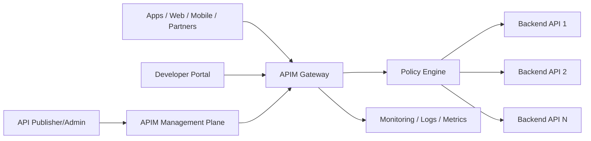
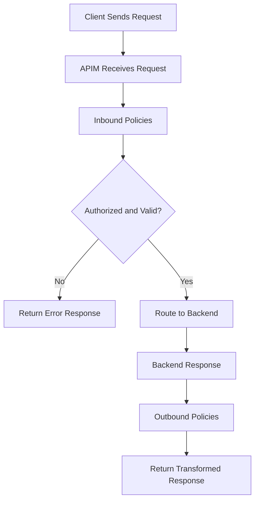
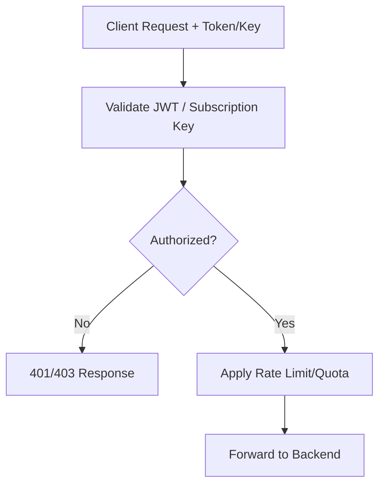
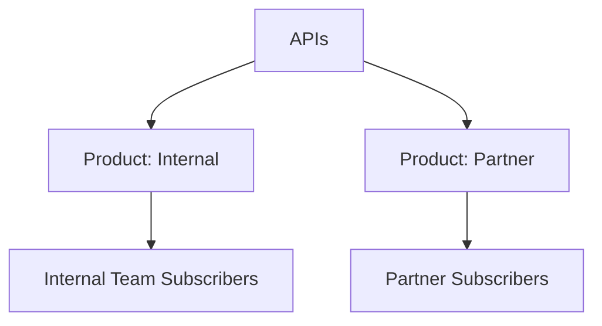
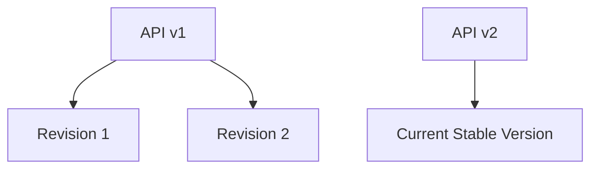
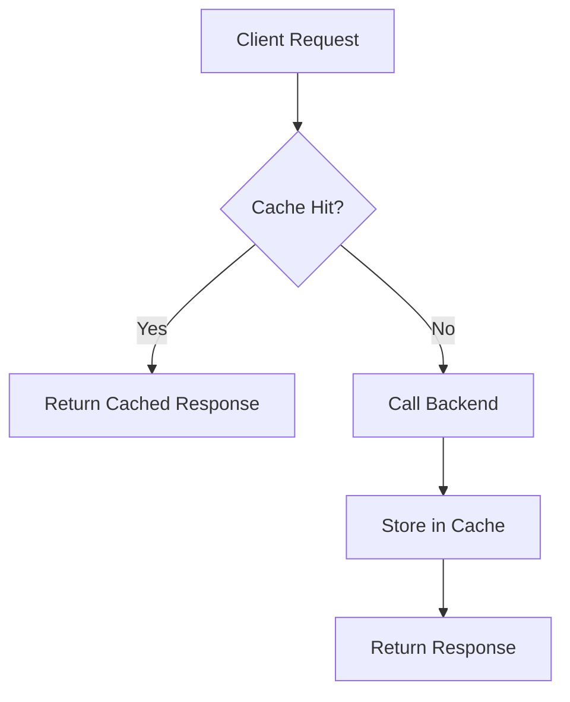
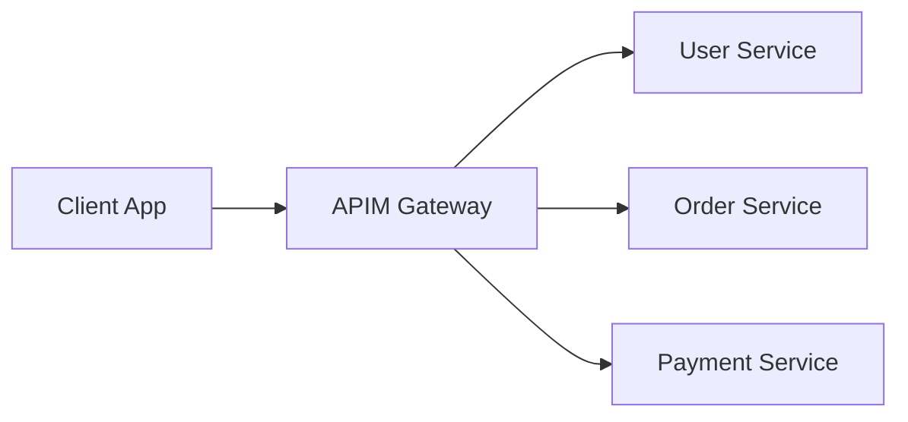
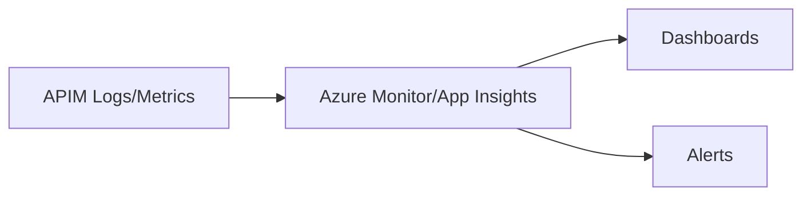

# What Is Azure API Management (APIM)?
## Detailed Interview Preparation Guide with Flow Charts

---

## 1) Direct Interview Answer

**Azure API Management (APIM)** is a managed API gateway platform that helps you **publish, secure, transform, monitor, and govern APIs** for internal teams, partners, and external developers.

> One-liner: *APIM is Azure’s full lifecycle API gateway and management layer between API consumers and backend services.*

---

## 2) Why APIM Is Needed

Without an API gateway/management layer:
- Each client handles auth, throttling, retries, versioning differences, and endpoint discovery
- Backend APIs are directly exposed
- Security and governance are inconsistent
- Monitoring and analytics are fragmented

APIM solves this by acting as a **central control plane + runtime gateway**.

---

## 3) APIM High-Level Architecture

---

## 4) Core APIM Components

## 4.1 API Gateway
Runtime entry point for API calls:
- AuthN/AuthZ checks
- Rate limiting
- Request/response transformation
- Routing
- Caching
- Observability hooks

## 4.2 Management Plane
Used by API publishers/admins to:
- Import/create APIs
- Apply policies
- Configure products/subscriptions
- Manage versions/revisions

## 4.3 Developer Portal
Self-service experience for API consumers:
- API documentation
- Try-it console
- Subscription key onboarding
- Usage guidance

## 4.4 Policy Engine
Declarative XML-based policy pipeline to enforce cross-cutting concerns.

---

## 5) Request Processing Flow Through APIM

---

## 6) APIM Capabilities (Interview Must-Know)

1. **Security**
   - OAuth2 / OpenID Connect integration
   - JWT validation
   - Subscription keys
   - mTLS support patterns
   - IP filtering and header checks

2. **Traffic Management**
   - Rate limiting
   - Quotas
   - Spike arrest / throttling
   - Backend failover patterns

3. **Transformation**
   - Header/body rewrite
   - URL rewrite
   - Protocol mediation (selected patterns)

4. **Governance**
   - Versioning/revisions
   - Products and subscriptions
   - API lifecycle management

5. **Observability**
   - Request metrics
   - Logs/traces
   - Failure analytics
   - Integration with Azure monitoring stack

6. **Developer Enablement**
   - Developer portal
   - API docs
   - Self-service subscriptions

---

## 7) APIM Policy Pipeline (Flow Chart)

Typical policy actions:
- Validate token
- Check quotas
- Transform request
- Add correlation IDs
- Cache response
- Mask sensitive fields

---

## 8) Common APIM Security Flow

---

## 9) APIM vs “Just Calling Backend Directly”

| Area | Direct Backend Exposure | APIM Front Door |
|---|---|---|
| Security consistency | Varies by API | Centralized |
| Throttling | Per-service custom | Gateway policy |
| Version governance | Hard to standardize | Managed lifecycle |
| Analytics | Fragmented | Centralized |
| Partner onboarding | Manual | Product/subscription model |
| Transformation | Custom code everywhere | Reusable policies |

---

## 10) APIM Products and Subscriptions

**Products** bundle one or more APIs and define access terms.  
Consumers subscribe to products and obtain keys (as configured).

Useful for commercial/internal governance models.

---

## 11) APIM Versioning and Revisions

- **Versioning**: manage breaking changes across API versions (v1, v2)
- **Revisions**: non-breaking edits/testing before making current

Interview point:
> APIM helps evolve APIs safely without breaking existing consumers.

---

## 12) Caching in APIM

APIM can cache responses to reduce backend load and latency for suitable endpoints.

Use carefully for:
- Read-heavy, non-sensitive, cache-safe responses
- TTL aligned with data freshness needs

---

## 13) APIM in Microservices

APIM sits in front of multiple microservices to provide a unified API facade.

Benefits:
- Stable public contract
- Hide internal service topology
- Central policy enforcement

---

## 14) Typical Enterprise Use Cases

1. Expose internal APIs to external partners securely  
2. Publish standardized internal platform APIs  
3. Apply organization-wide auth/throttling policies  
4. Modernize legacy APIs behind a managed gateway  
5. Create developer ecosystem with portal and onboarding  

---

## 15) APIM and Zero Trust/API Security

APIM supports Zero Trust-aligned practices by enabling:
- Identity-based access
- Token validation
- Request filtering
- Fine-grained policy enforcement
- Centralized auditing/monitoring

---

## 16) Monitoring and Observability with APIM

Track:
- Request count and latency
- 4xx/5xx error rates
- Throttled calls
- Backend response times
- Subscription/product usage
- Geographic/client usage patterns

---

## 17) APIM Deployment Considerations

Key design decisions:
- Internal vs external exposure mode
- Network integration strategy
- Multi-region needs
- Environment separation (dev/test/prod)
- CI/CD for APIs and policies
- Secrets and certificate lifecycle management

---

## 18) Common APIM Anti-Patterns

1. Treating APIM as a full business logic engine  
2. Duplicating complex logic in policies and backend inconsistently  
3. No versioning strategy  
4. Overly permissive security defaults  
5. Missing rate-limit/abuse protections  
6. No observability/alerting  
7. Manual API lifecycle changes without CI/CD  

---

## 19) APIM vs Other Azure Messaging/Event Services

| Service | Purpose |
|---|---|
| APIM | API gateway and API governance |
| Event Grid | Event notification routing |
| Service Bus | Enterprise messaging/work queues |
| Event Hubs | High-throughput event streaming ingestion |

Interview clarity:
> APIM manages synchronous API traffic and governance; Event Grid/Service Bus/Event Hubs handle asynchronous messaging/event patterns.

---

## 20) Interview Q&A (Strong Answers)

### Q1: What is Azure APIM?
**Answer:** A managed API gateway and management platform for securing, publishing, transforming, monitoring, and governing APIs.

### Q2: Why use APIM in microservices?
**Answer:** It provides a unified entry point and centralizes cross-cutting concerns like authentication, throttling, transformation, and analytics.

### Q3: What are APIM policies?
**Answer:** Declarative rules executed in inbound/backend/outbound/on-error pipelines to enforce security, traffic control, transformations, and operational behavior.

### Q4: Difference between version and revision?
**Answer:** Version handles consumer-facing API evolution (often breaking changes), while revision is for incremental non-breaking changes before promoting.

### Q5: Can APIM help with partner onboarding?
**Answer:** Yes, via products, subscriptions, and developer portal documentation/self-service onboarding.

### Q6: Is APIM a replacement for Service Bus/Event Hubs?
**Answer:** No. APIM is for API gateway management; Service Bus/Event Hubs are asynchronous messaging/streaming services.

---

## 21) 60-Second Interview Pitch

> Azure API Management is a managed API gateway platform that sits between clients and backend services to enforce security, governance, and operational policies consistently. It supports authentication and authorization controls, rate limiting, request/response transformation, analytics, versioning, and developer onboarding through products and a portal. In microservice architectures, APIM provides a stable unified API facade while hiding backend complexity. I use APIM to standardize API lifecycle management and protect backend services, while relying on messaging services like Service Bus or Event Hubs for asynchronous workloads.

---

## 22) Final Checklist

- [ ] Can define APIM in one line  
- [ ] Understand gateway + management + developer portal roles  
- [ ] Explain policy pipeline (inbound/backend/outbound/on-error)  
- [ ] Explain security controls (JWT/OAuth/subscription keys)  
- [ ] Explain throttling/quotas and caching  
- [ ] Explain products/subscriptions onboarding model  
- [ ] Explain version vs revision  
- [ ] Distinguish APIM from Event Grid/Service Bus/Event Hubs  

---

## One-Line Conclusion

> Azure APIM is a managed API gateway and governance platform that secures, publishes, controls, and monitors APIs at scale across internal and external consumers.