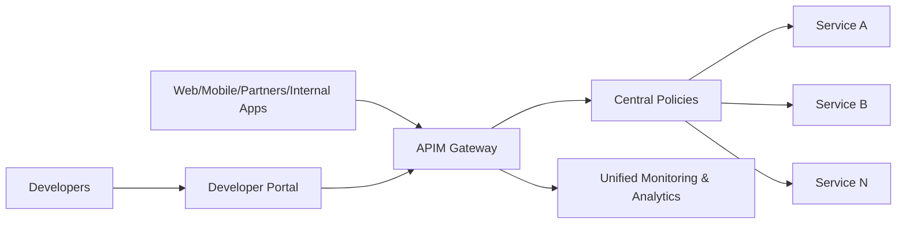
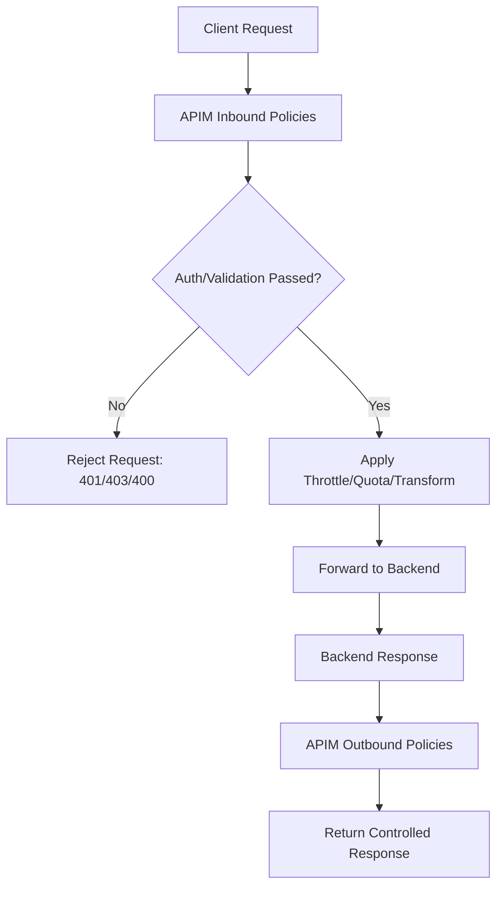
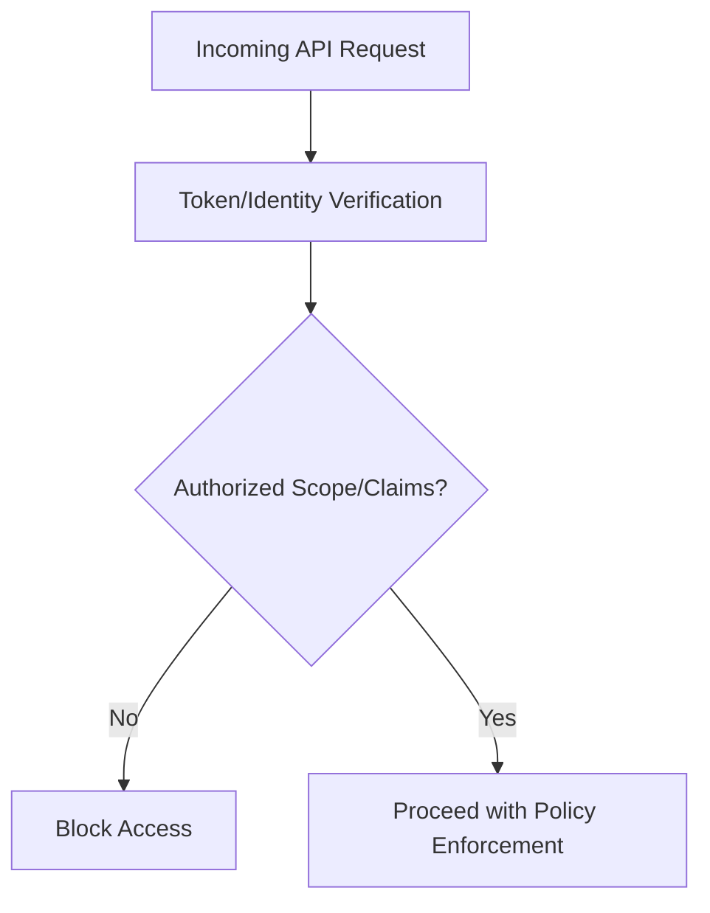
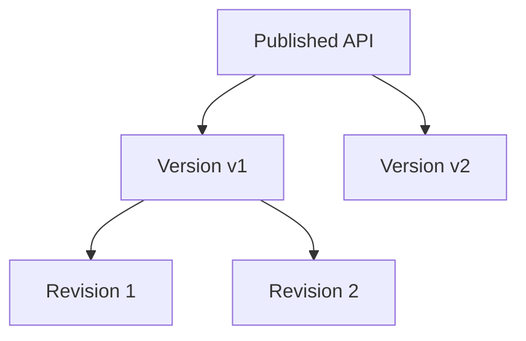
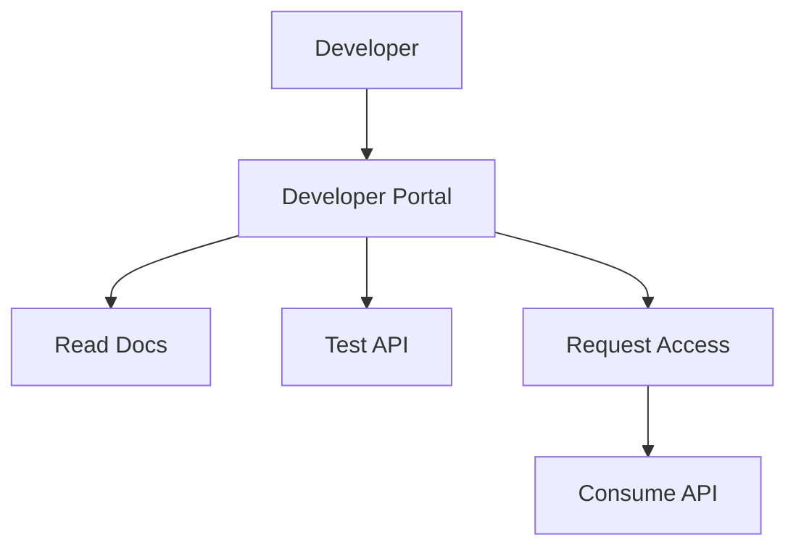
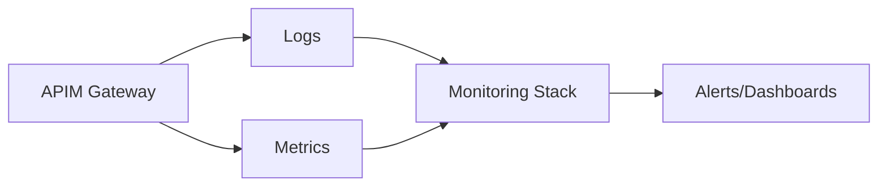
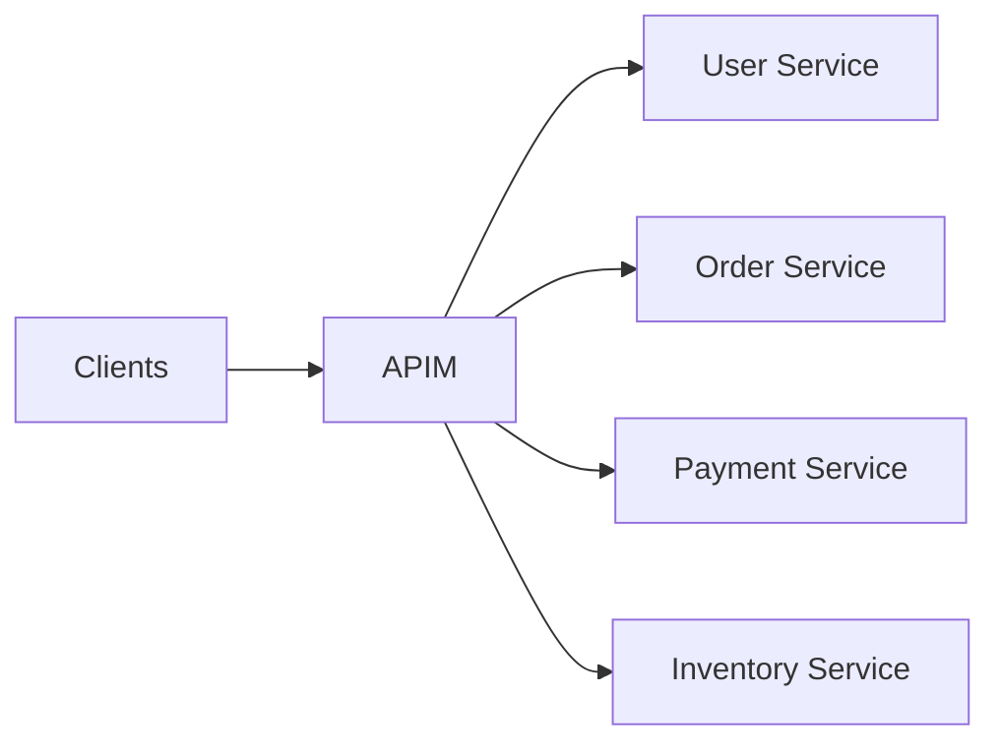
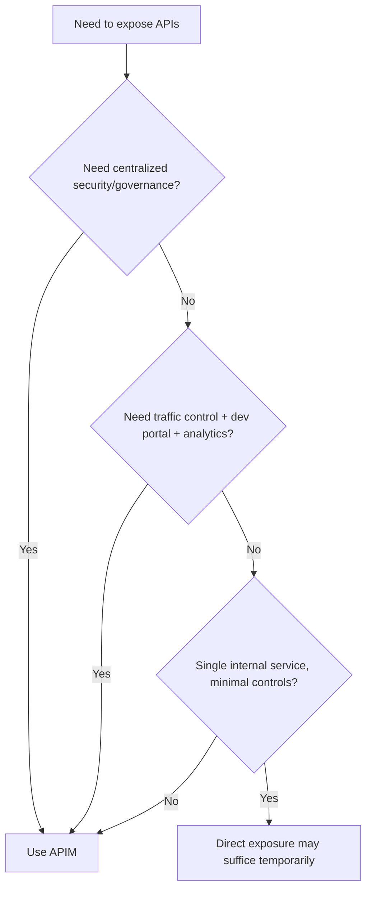

# Why Use Azure API Management (APIM)?
## Detailed Interview Preparation Guide with Flow Charts

---

## 1) Direct Interview Answer

Use **Azure API Management (APIM)** to create a secure, governed, scalable API facade between clients and backend services.

APIM is used to:

1. Centralize API security
2. Enforce throttling/quotas and protect backends
3. Standardize API governance and lifecycle (versioning/revisions)
4. Transform and mediate requests/responses
5. Improve developer onboarding via portal/products/subscriptions
6. Gain unified observability and analytics across APIs

> One-liner: *Use APIM when you need centralized API security, governance, traffic control, and developer experience at scale.*

---

## 2) The Core Problem APIM Solves

Without APIM, each API team often re-implements:
- Authentication/authorization checks
- Rate limiting
- Request validation
- Monitoring and logging
- Documentation and onboarding
- Version/deprecation management

This causes:
- Inconsistent security posture
- Duplicate effort
- Harder compliance audits
- Slower API delivery

APIM provides these capabilities in one managed gateway platform.

---

## 3) High-Level Value Flow

---

## 4) Why APIM? (Top Interview Points)

## 4.1 Centralized Security
APIM enforces consistent security controls across APIs:
- JWT/OAuth validation
- Subscription keys (when used)
- IP filtering
- Header/token checks
- mTLS-related patterns

## 4.2 Backend Protection
APIM protects APIs from abuse:
- Rate limiting
- Quotas
- Spike control
- Request size/shape checks
- Caching for read-heavy routes

## 4.3 API Governance
APIM helps standardize:
- API design exposure
- Version lifecycle
- Policy reuse
- Access control per product/team/partner

## 4.4 Developer Enablement
APIM improves consumption through:
- Developer portal
- Discoverable docs
- Try-it experiences
- Subscription onboarding model

## 4.5 Operational Visibility
You get centralized metrics/tracing/logging for:
- Latency
- Error rates
- Consumer usage
- Throttling behavior
- Backend dependency performance

---

## 5) APIM Request Lifecycle (Flow Chart)

---

## 6) Security-First Reason to Use APIM

In enterprises, security inconsistency is a top risk.
APIM helps enforce “security by default” at the API edge.

Interview phrase:
> APIM ensures every API call passes through uniform security and governance controls before reaching backend systems.

---

## 7) Traffic Control Reason to Use APIM

APIs can fail under sudden traffic spikes or abusive usage.
APIM adds traffic shaping and protection.

Benefits:
- Prevent backend overload
- Improve platform stability
- Isolate noisy consumers

---

## 8) Transformation/Mediation Reason to Use APIM

APIM can adapt client contracts to backend contracts without changing backend code immediately.

Examples:
- Rename headers
- Rewrite paths
- Normalize payload fields
- Add correlation IDs
- Hide internal backend details

---

## 9) Governance and API Lifecycle Reason

APIM helps manage:
- Versions (v1, v2, etc.)
- Revisions (safe incremental updates)
- Controlled rollout/deprecation
- Product-based access bundles

Interview phrase:
> APIM reduces breaking-change risk by making API versioning and lifecycle governance explicit and manageable.

---

## 10) Developer Experience Reason

For internal/external API consumers, APIM provides:
- Documentation portal
- Interactive testing
- Access subscription workflow
- Product catalog

This accelerates onboarding and reduces support burden on API teams.

---

## 11) Observability Reason

APIM gives centralized visibility across all managed APIs:
- Call volume
- P95/P99 latency
- Failure rates
- Top consumers
- Throttle counts

---

## 12) Why APIM in Microservices Architectures

Microservices increase API sprawl.
APIM provides a stable front door and policy consistency.

Benefits:
- Decouples clients from internal topology
- Unified access/security model
- Easier cross-service governance

---

## 13) Typical Real-World Scenarios Where APIM Is Valuable

1. Exposing internal APIs to partner ecosystems safely  
2. Standardizing security policies across many teams  
3. Protecting legacy services while modernizing clients  
4. Creating internal API platform for enterprise reuse  
5. Enforcing regulatory controls/auditability on API access  

---

## 14) APIM vs “Direct API Exposure” (Interview Table)

| Concern | Direct Exposure | With APIM |
|---|---|---|
| Security consistency | Team-by-team, inconsistent | Centralized and repeatable |
| Rate limiting | Custom per service | Policy-driven at gateway |
| Onboarding | Manual docs and keys | Developer portal/products |
| Monitoring | Fragmented | Unified |
| Version governance | Hard to coordinate | Structured lifecycle |
| Backend isolation | Weak | Stronger abstraction layer |

---

## 15) APIM and Platform Engineering

APIM supports platform teams by:
- Creating reusable policy templates
- Enforcing enterprise standards
- Providing shared API onboarding workflows
- Reducing repetitive implementation in service teams

This improves delivery velocity and governance quality simultaneously.

---

## 16) Common Anti-Patterns (Important for Interview)

1. Using APIM as a heavy business-logic engine  
2. Ignoring backend auth because APIM exists (defense-in-depth still required)  
3. No versioning/deprecation policy  
4. Applying inconsistent policies across environments  
5. No CI/CD for API and policy artifacts  
6. Missing SLOs/alerts for gateway errors and latency  

---

## 17) Decision Flow: Should You Use APIM?

---

## 18) Interview Q&A (Strong Answers)

### Q1: Why use APIM instead of exposing APIs directly?
**Answer:** APIM centralizes security, throttling, governance, monitoring, and developer onboarding, reducing duplicated effort and risk.

### Q2: Is APIM only for external APIs?
**Answer:** No. It is equally useful for internal platform APIs across enterprise teams.

### Q3: Can APIM protect backend services from traffic spikes?
**Answer:** Yes, through rate limits, quotas, and policy-based traffic controls.

### Q4: How does APIM improve developer productivity?
**Answer:** Through discoverable APIs, documentation, test console, and standardized access workflows.

### Q5: Does APIM replace backend security?
**Answer:** No. Use defense-in-depth—APIM plus backend service-level security controls.

### Q6: APIM vs Service Bus/Event Hubs?
**Answer:** APIM is API gateway/governance for synchronous API traffic; Service Bus/Event Hubs are asynchronous messaging/streaming services.

---

## 19) 60-Second Interview Pitch

> I use Azure API Management when I need a centralized API gateway to secure, govern, and scale API access across teams and consumers. APIM enforces consistent authentication, authorization, throttling, and policy controls before traffic reaches backend services. It also improves API lifecycle management with versions and revisions, and speeds onboarding through the developer portal, products, and subscriptions. Operationally, APIM gives unified analytics and observability for usage, latency, and failures. In short, it reduces risk, avoids duplicated cross-cutting code, and creates a maintainable API platform.

---

## 20) Final Checklist

- [ ] Need centralized API security policy enforcement  
- [ ] Need rate limiting/quotas to protect backends  
- [ ] Need consistent API governance/versioning  
- [ ] Need developer onboarding portal/docs  
- [ ] Need unified API analytics/monitoring  
- [ ] Need abstraction layer over microservice sprawl  

If most answers are **yes**, use APIM.

---

## One-Line Conclusion

> Use APIM to centralize and standardize API security, governance, traffic control, developer onboarding, and observability across your API ecosystem.