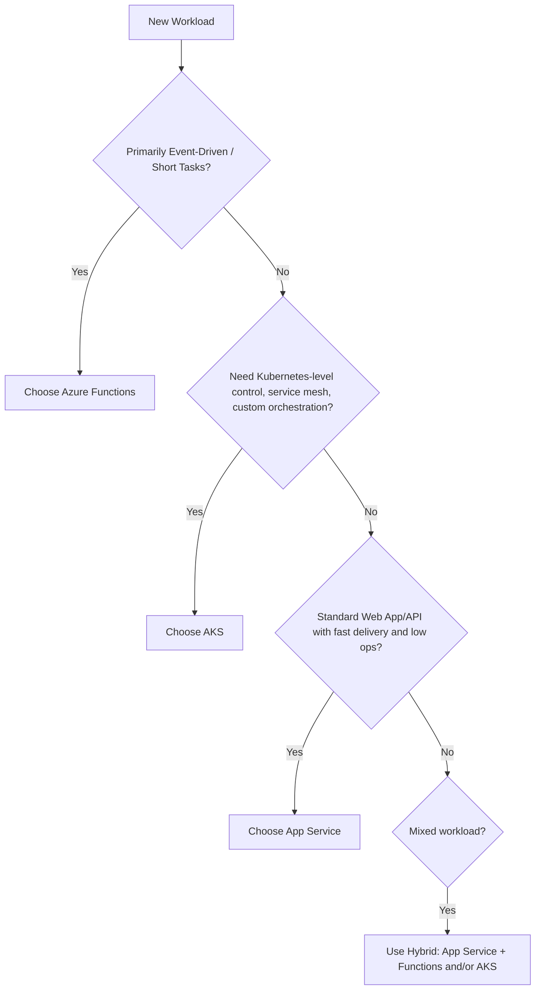
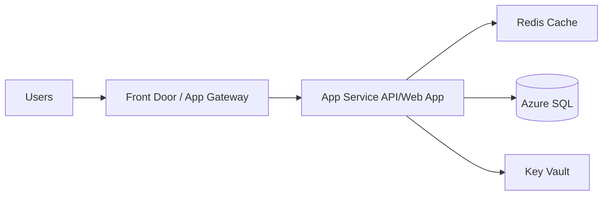
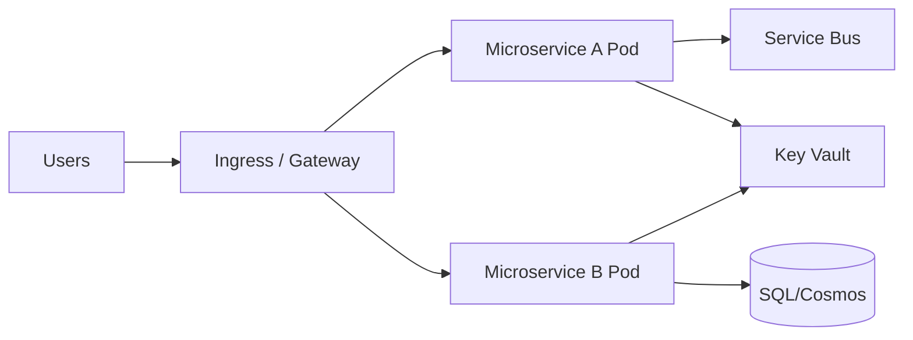
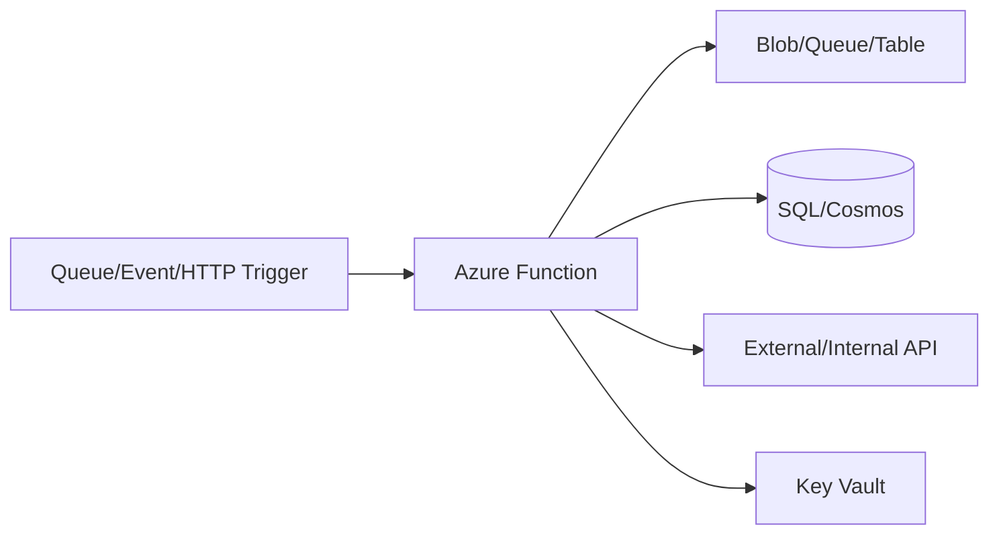
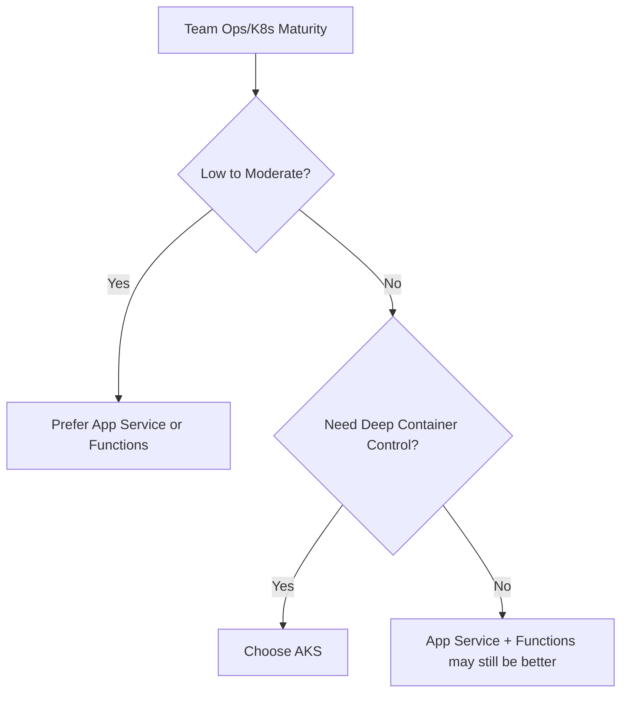
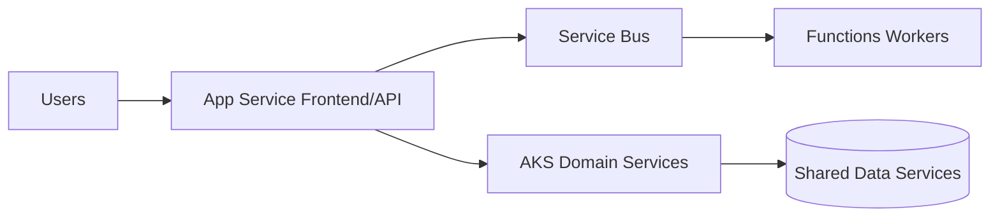

# App Service vs AKS vs Azure Functions
## When Would You Choose Each?
### Detailed Interview Preparation Guide with Flow Charts

---

## 1) Direct Interview Answer

Choose based on **control vs simplicity**, **workload shape**, and **operational maturity**:

- **Azure App Service**: best for quickly hosting web apps/APIs with minimal infrastructure management.
- **Azure Kubernetes Service (AKS)**: best when you need maximum container orchestration control, complex microservices, and advanced platform requirements.
- **Azure Functions**: best for event-driven, short-lived, bursty, or serverless workloads where you pay per execution and scale automatically.

> One-liner: *App Service for managed web hosting simplicity, AKS for full container platform control, Functions for event-driven serverless execution.*

---

## 2) Fast Comparison Table

| Decision Area | App Service | AKS | Azure Functions |
|---|---|---|---|
| Primary model | PaaS web/API hosting | Kubernetes container orchestration | Serverless event-driven compute |
| Ops complexity | Low | High | Low to medium |
| Control level | Moderate | Very high | Low to moderate |
| Best for | Web apps, REST APIs, line-of-business apps | Microservices platform, custom networking/runtime needs | Event handlers, background jobs, integrations |
| Scaling style | Plan-based autoscale | Pod/node autoscale with k8s controls | Event-based automatic scaling |
| Startup latency concerns | Usually low | Depends on design | Can have cold starts (plan dependent) |
| Cost model | Reserved compute plan | Cluster + node costs | Consumption / premium / dedicated options |
| Deployment complexity | Simple CI/CD | Advanced CI/CD + platform engineering | Simple to moderate CI/CD |
| Runtime freedom | Good | Maximum (any containerized workload) | Function runtime constraints |
| Team skill requirement | App dev team | App dev + DevOps/SRE/K8s expertise | App dev with serverless patterns |

---

## 3) Selection Flow Chart (Interview-Friendly)

---

## 4) Mental Model for Interviews

Use this priority lens:

1. **Can serverless event model solve it?** -> Functions  
2. **If always-on web/API needed with low ops?** -> App Service  
3. **If platform-level control is mandatory?** -> AKS  

This framing shows architectural maturity and cost-awareness.

---

## 5) Azure App Service — When to Choose

Choose App Service when you need:

- Fast time-to-market for web apps and APIs
- Managed hosting with built-in scaling, SSL, deployment slots
- Minimal platform ops overhead
- Stable always-on HTTP services
- Standard enterprise app hosting patterns

### Typical Use Cases

- Internal enterprise web portals
- REST APIs for mobile/web backends
- B2B line-of-business applications
- Apps needing staging/production slot swaps

### Strengths

- Simple deployment and scaling
- Native integration with identity, certificates, monitoring
- Lower operational burden than AKS
- Good balance of control and simplicity

### Limitations

- Less orchestration control than AKS
- Not ideal for highly complex multi-container service platforms
- Specialized platform patterns may be constrained

---

## 6) AKS — When to Choose

Choose AKS when you need:

- Full Kubernetes orchestration capabilities
- Complex microservices with many independently deployable components
- Advanced traffic management and service-to-service networking
- Custom sidecars, service mesh, operators, CRDs
- Portability across Kubernetes ecosystems
- Fine-grained control over runtime, scheduling, scaling behavior

### Typical Use Cases

- Large-scale microservices platforms
- Multi-team platform engineering environments
- Complex regulated workloads requiring custom controls
- Workloads requiring deep container orchestration features

### Strengths

- Maximum flexibility and control
- Rich cloud-native ecosystem
- Supports advanced deployment strategies
- Strong for large-scale platform standardization

### Limitations

- High operational complexity
- Requires Kubernetes expertise
- Higher platform engineering cost
- Misconfiguration risk if team maturity is low

---

## 7) Azure Functions — When to Choose

Choose Functions when you need:

- Event-driven processing
- Short-lived bursty workloads
- Automatic scale to zero/scale out
- Pay-per-execution economics (for suitable workloads)
- Quick integration workflows and background automation

### Typical Use Cases

- Queue/event/message processing
- Scheduled jobs (timers)
- Webhook handlers
- File/image processing pipelines
- Lightweight API endpoints
- Integration glue between services

### Strengths

- Minimal infrastructure management
- Very fast to build and deploy event handlers
- Cost efficient for intermittent workloads
- Strong trigger/binding ecosystem

### Limitations

- Execution model constraints and timeout considerations
- Cold start considerations in some hosting plans
- Less suitable for very complex always-on monolith-style apps
- Architectural discipline needed for state and retries

---

## 8) Comparative Architecture Patterns

## 8.1 App Service Pattern

Best when you want managed web hosting simplicity.

---

## 8.2 AKS Pattern

Best for complex distributed microservice ecosystems.

---

## 8.3 Functions Pattern

Best for event-driven, elastic execution units.

---

## 9) Cost Decision Thinking

- **Functions**: often cost-effective for sporadic and bursty workloads
- **App Service**: cost-effective for steady web/API traffic with predictable baseline
- **AKS**: economical at scale *if* you fully utilize cluster resources and can absorb ops overhead

Interview phrase:
> Cheapest service is not just compute price—it includes operational complexity cost.

---

## 10) Scalability Characteristics

| Scalability Dimension | App Service | AKS | Functions |
|---|---|---|---|
| Horizontal scaling | Yes | Yes (pods/nodes) | Yes (event-driven) |
| Scale-to-zero | Not typical in standard web hosting mode | Not typical for core services | Yes (plan dependent) |
| Burst handling | Good with autoscale | Excellent with proper cluster autoscale | Excellent for event triggers |
| Fine-grained scaling control | Medium | High | Medium (platform-managed behavior) |

---

## 11) Operational Maturity Requirement

If team lacks Kubernetes maturity, AKS can slow delivery and reliability.

---

## 12) Workload-Shape Driven Choice

## Choose Functions if:
- Trigger-based or asynchronous
- Short processing units
- Highly variable traffic
- Event integration heavy

## Choose App Service if:
- Always-on web app/API
- Simple-to-moderate architecture
- Fast delivery is priority
- Managed platform is preferred

## Choose AKS if:
- Many microservices
- Need advanced deployment/network policy/service mesh patterns
- Need platform-level flexibility and control
- Team can manage Kubernetes lifecycle well

---

## 13) Hybrid Strategy (Often Best in Real Systems)

Many enterprise architectures combine all three:

- App Service for core web/API frontends
- Functions for async jobs/events
- AKS for specialized high-control microservices platform areas

Hybrid is often more practical than forcing one compute model everywhere.

---

## 14) Security Considerations Across All Three

Regardless of service:
- Use Entra ID for auth
- Managed identity for service-to-service auth
- Key Vault for secrets/certs/keys
- Private endpoints/network controls
- Centralized logging and threat monitoring
- Least-privilege RBAC

---

## 15) Migration and Evolution Path

Common maturity journey:
1. Start with App Service for speed
2. Add Functions for event-driven workloads
3. Move specific complex domains to AKS when justified

This avoids premature platform complexity.

---

## 16) Common Interview Mistakes (Golden Section)

1. Saying AKS is always “best” because it’s powerful  
2. Ignoring team skills/ops burden in architecture choice  
3. Using Functions for long-running unsuitable workloads without design controls  
4. Putting all workloads into one model without workload-shape analysis  
5. Ignoring hybrid architecture benefits  
6. Comparing only compute cost and ignoring reliability/operations cost  

---

## 17) Interview Q&A (Strong Answers)

### Q1: App Service vs AKS for a standard enterprise API?
**Answer:** Usually App Service, unless there’s a clear requirement for Kubernetes-level control/features.

### Q2: When is AKS justified?
**Answer:** When you need advanced orchestration, complex microservices operations, custom networking/runtime behavior, or Kubernetes ecosystem capabilities.

### Q3: When would Functions be a bad fit?
**Answer:** For certain long-running, tightly stateful, or complex always-on workloads better suited to App Service/AKS patterns.

### Q4: Can Functions host APIs?
**Answer:** Yes, especially lightweight or event-integrated APIs, but choice depends on latency/profile/control needs.

### Q5: Is AKS more scalable than App Service?
**Answer:** AKS offers finer-grained scaling control and orchestration flexibility, but App Service also scales well for many web/API workloads with less operational overhead.

### Q6: What’s your default choice for new projects?
**Answer:** Start with the simplest service that meets requirements (often App Service or Functions), then move to AKS only when advanced needs justify complexity.

---

## 18) 60-Second Interview Pitch

> I choose between App Service, AKS, and Functions based on workload shape, control requirements, and team operational maturity. For standard always-on web apps and APIs where speed and simplicity matter, I choose App Service. For event-driven, bursty, short-lived processing, I choose Azure Functions because of serverless scaling and efficiency. I choose AKS only when I need advanced Kubernetes capabilities like complex microservice orchestration, custom networking, or platform-level control. In many enterprises, the best architecture is hybrid—App Service for core APIs, Functions for async/event workloads, and AKS for specialized domains requiring deep control.

---

## 19) Final Decision Checklist

- [ ] Is workload primarily event-driven and bursty? -> Functions  
- [ ] Is it a standard always-on web/API with low ops preference? -> App Service  
- [ ] Do you need Kubernetes-level orchestration/control? -> AKS  
- [ ] Does team have AKS operational maturity?  
- [ ] Are compliance/network/runtime constraints pushing toward AKS?  
- [ ] Would hybrid architecture reduce complexity and cost?  

---

## 20) One-Line Conclusion

> Choose **App Service** for managed web/API simplicity, **Functions** for serverless event-driven workloads, and **AKS** for advanced container orchestration and platform-level control.