# Design a Scalable Azure Architecture for a High-Traffic Application

## Detailed Interview Preparation Guide with Flow Charts

---

## 1. Direct Interview Answer

To design a scalable Azure architecture for a high-traffic application, use a layered and fault-tolerant architecture with:

1. A global traffic entry point
2. Web Application Firewall protection
3. API gateway governance
4. Stateless and autoscaling compute
5. Distributed caching
6. Asynchronous processing
7. A scalable data layer
8. Multi-region high availability
9. Centralized monitoring
10. Secure identity and secret management

A typical Azure architecture uses:

- **Azure Front Door** for global routing and edge acceleration
- **Azure Web Application Firewall** for application-layer protection
- **Azure API Management** for API governance
- **Azure App Service, AKS, or Container Apps** for scalable compute
- **Azure Cache for Redis** for low-latency caching
- **Azure Service Bus** for asynchronous processing
- **Azure SQL, Cosmos DB, and Blob Storage** for data storage
- **Microsoft Entra ID, Managed Identity, and Key Vault** for security
- **Azure Monitor and Application Insights** for observability

> One-line interview answer:  
> **Use global routing, stateless autoscaling services, caching, asynchronous messaging, a scalable data tier, multi-region resilience, and zero-trust security to support high traffic reliably.**

---

## 2. Design Goals

A high-traffic architecture should address the following goals:

| Goal | Design Approach |
|---|---|
| Scalability | Horizontal scaling and autoscaling |
| Availability | Multiple instances and multiple regions |
| Performance | CDN, caching, optimized queries |
| Reliability | Queues, retries, circuit breakers |
| Security | Entra ID, WAF, private networking |
| Resilience | Health probes and automated failover |
| Observability | Metrics, logs, traces, and alerts |
| Cost efficiency | Autoscaling and right-sizing |

---

## 3. Reference Azure Architecture

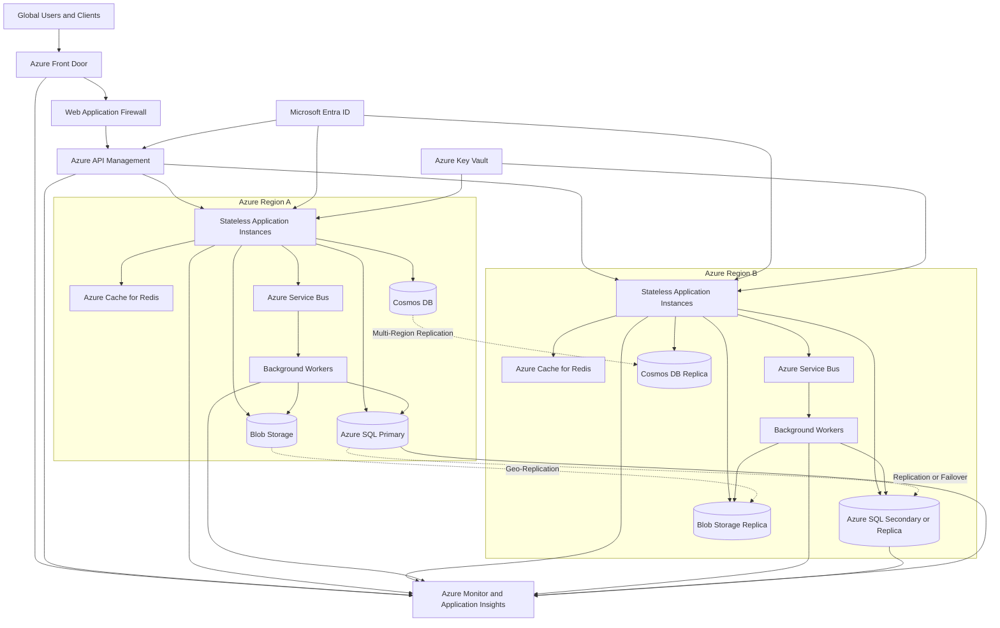

---

## 4. End-to-End Request Flow

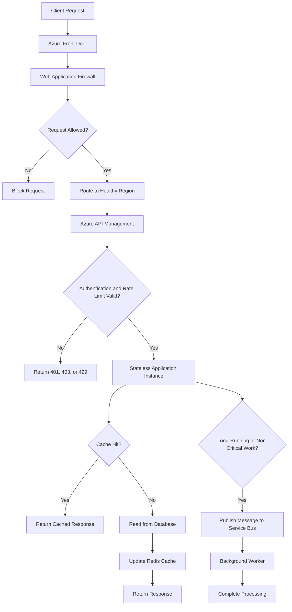

---

## 5. Global Edge Layer

### Azure Front Door

Azure Front Door provides a global entry point for the application.

It can provide:

- Global HTTP and HTTPS routing
- Latency-based routing
- Health-based failover
- SSL/TLS termination
- URL-based routing
- Session affinity when required
- CDN and edge caching capabilities
- Integration with Web Application Firewall

### Web Application Firewall

WAF protects the application from common web attacks, including:

- SQL injection
- Cross-site scripting
- Malicious requests
- Common OWASP threats
- Suspicious patterns
- Excessive requests

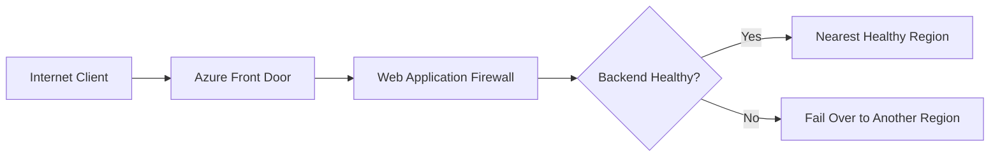

---

## 6. API Gateway Layer

Use **Azure API Management** between the edge layer and backend services.

APIM can provide:

- OAuth2 and JWT validation
- Subscription and API key management
- Rate limiting
- Quotas
- Request validation
- Header transformation
- API versioning
- API product management
- Request and response logging
- Backend routing

### Example APIM Request Flow

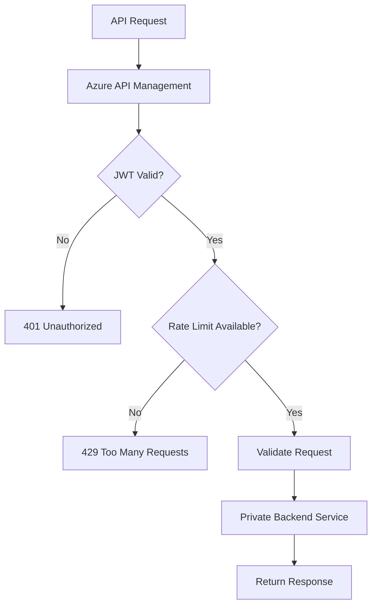

APIM should be the controlled API entry point. Backend services should not be directly exposed to the public internet.

---

## 7. Application Compute Layer

The application layer should be designed to scale horizontally.

Possible Azure compute options include:

- Azure App Service
- Azure Kubernetes Service
- Azure Container Apps
- Azure Functions
- Azure Virtual Machine Scale Sets

The choice depends on:

- Application architecture
- Containerization requirements
- Operational maturity
- Traffic pattern
- Runtime requirements
- Scaling behavior

### Stateless Application Design

Application instances should be stateless whenever possible.

Avoid storing the following only in local memory:

- User sessions
- Shopping carts
- Workflow state
- Distributed locks
- Critical application data

Use external services such as Redis, databases, or durable storage for shared state.

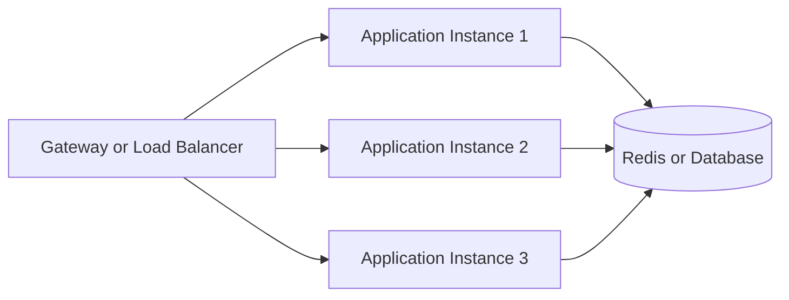

Because instances are stateless, any instance can process any request.

---

## 8. Autoscaling Strategy

Autoscaling increases or decreases the number of application instances based on demand.

Useful autoscaling metrics include:

- CPU utilization
- Memory utilization
- Requests per second
- Average response time
- Queue depth
- Queue message age
- Concurrent connections
- Custom business metrics

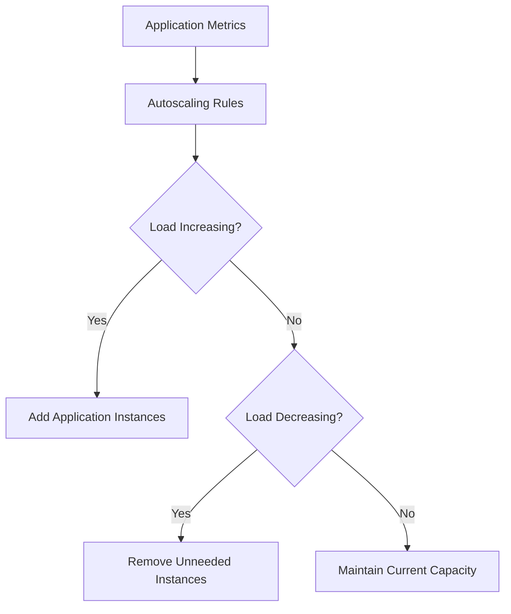

### Autoscaling Best Practices

- Define minimum instance count
- Define maximum instance count
- Configure cooldown periods
- Avoid scaling too aggressively
- Test scaling warm-up time
- Keep enough capacity for failover
- Monitor scaling events

---

## 9. Caching Strategy

Caching reduces database load and improves response time.

A layered caching strategy can include:

1. Front Door or CDN caching
2. APIM response caching
3. Redis application caching
4. Database query caching
5. Browser caching where appropriate

### Redis Cache Flow

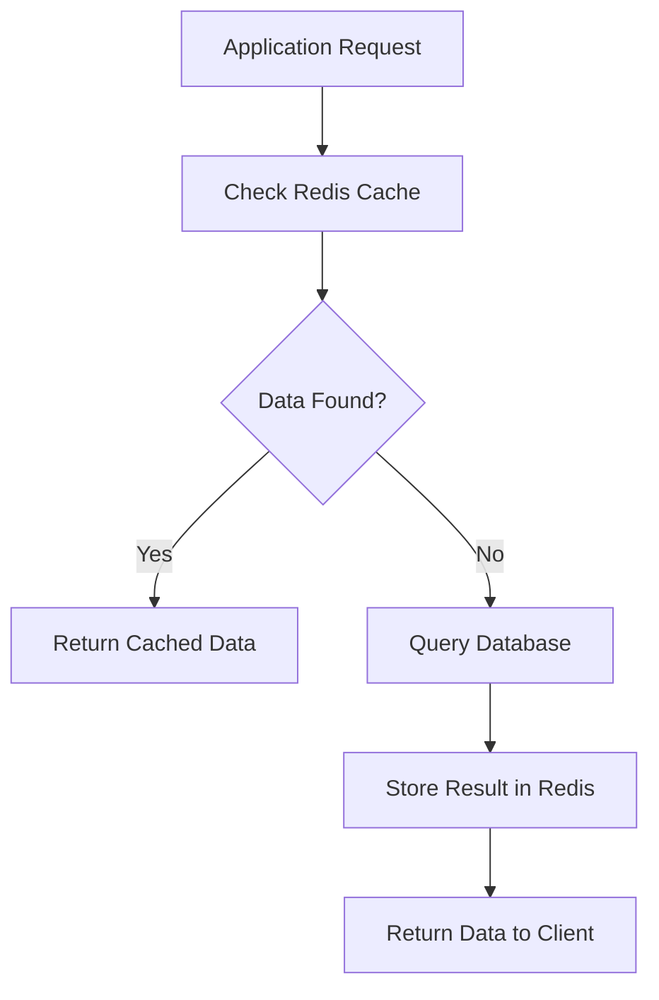

### Cache Considerations

Define:

- Cache expiration time
- Cache key structure
- Invalidation strategy
- Handling for stale data
- Protection against cache stampedes
- Strategy for hot keys
- Behavior when Redis is unavailable

---

## 10. Asynchronous Processing

High-traffic systems should not perform every task synchronously.

Move long-running or non-critical tasks to a queue.

Examples:

- Sending emails
- Generating reports
- Processing images
- Creating notifications
- Updating search indexes
- Calling slow external systems
- Performing batch operations

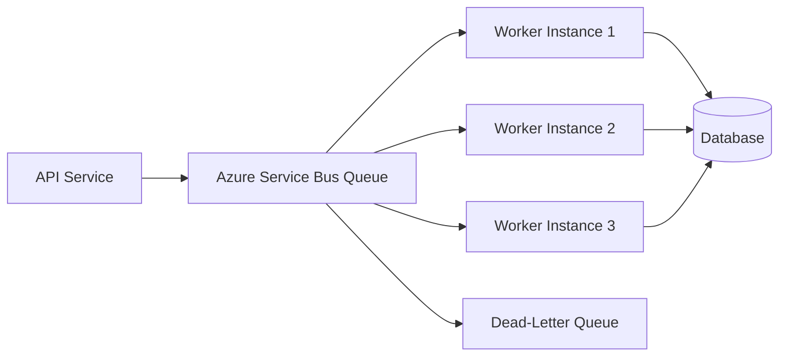

### Queue Benefits

- Absorbs sudden traffic spikes
- Decouples services
- Allows independent scaling
- Improves fault tolerance
- Supports retries
- Prevents slow dependencies from blocking requests

### Queue Best Practices

- Use idempotent consumers
- Configure retry policies
- Use dead-letter queues
- Track queue depth and age
- Prevent duplicate processing
- Set appropriate message lock duration
- Use correlation IDs

---

## 11. Data Layer Design

The data layer is often the main bottleneck in high-traffic systems.

Choose the data service based on the access pattern.

### Azure SQL

Use Azure SQL for:

- Relational data
- Strong transactions
- Complex joins
- Structured schemas
- Financial or transactional workloads

Scaling approaches:

- Index optimization
- Read replicas
- Partitioning
- Connection pooling
- Query tuning
- Elastic pools
- Hyperscale where appropriate

### Azure Cosmos DB

Use Cosmos DB for:

- Globally distributed applications
- High-throughput workloads
- Low-latency access
- Flexible document models
- Multi-region data distribution

Important design decisions:

- Partition key
- Consistency level
- Request unit capacity
- Multi-region writes
- Conflict resolution

### Azure Blob Storage

Use Blob Storage for:

- Images
- Videos
- Documents
- Backups
- Static assets
- Large files

Do not store large binary files directly in a relational database unless there is a strong reason.

---

## 12. Multi-Region Architecture

For global applications or strict availability requirements, deploy the application in multiple Azure regions.

### Active-Active Model

Both regions serve traffic simultaneously.

Advantages:

- Lower global latency
- Better resource utilization
- Faster failover
- More capacity

Challenges:

- Data consistency
- Conflict resolution
- More operational complexity
- Distributed troubleshooting

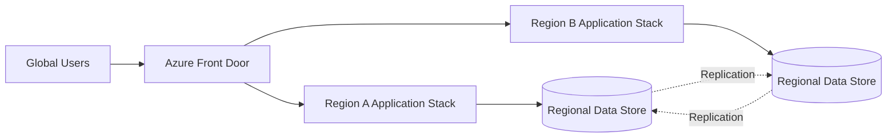

### Active-Passive Model

One region serves production traffic while the second region is used for disaster recovery.

Advantages:

- Simpler architecture
- Easier data consistency
- Lower operating cost

Challenges:

- Standby capacity may be underused
- Failover can take longer
- Failover testing is essential

---

## 13. Regional Failover Flow

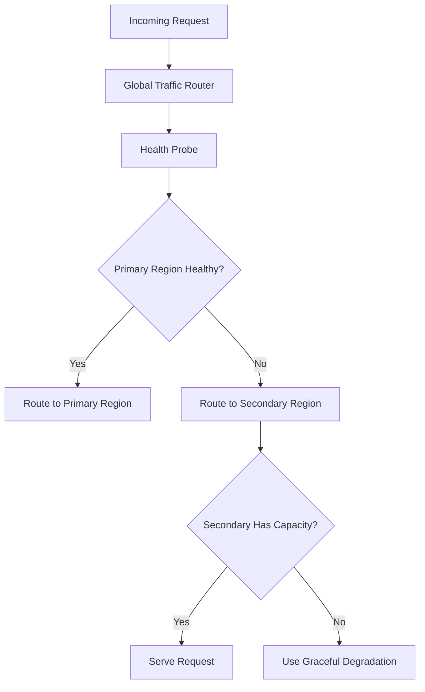

### Multi-Region Requirements

Multi-region deployment is incomplete if only the compute tier is replicated.

Also plan for:

- Database replication
- Cache behavior
- Storage replication
- Key Vault availability
- DNS and private DNS
- Identity dependencies
- Messaging replication
- Monitoring in every region
- Capacity during failover

---

## 14. Security Architecture

Use a defense-in-depth security model.

### Identity

- Microsoft Entra ID for authentication
- Managed Identity for service-to-service authentication
- OAuth2 and OIDC for user access
- App roles and scopes for authorization

### Network

- Private endpoints
- Virtual network integration
- Network Security Groups
- Azure Firewall
- Restricted inbound access
- Private DNS zones

### Secrets

- Store secrets in Azure Key Vault
- Avoid secrets in source code
- Use managed identities to retrieve secrets
- Rotate secrets and certificates
- Enable Key Vault logging

### Edge Security

- Web Application Firewall
- DDoS protection where required
- API rate limiting
- Bot protection
- Request validation

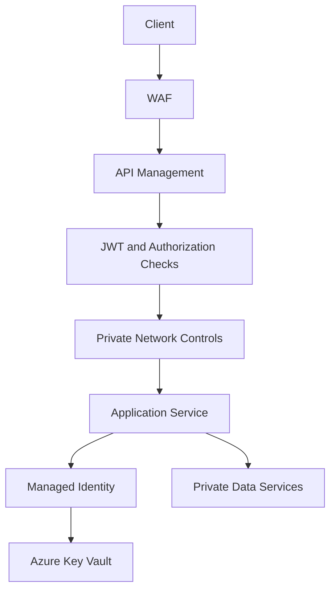

---

## 15. Reliability Patterns

High-traffic applications should use resilience patterns.

### Timeout

Set timeouts for all network calls to avoid indefinite waiting.

### Retry

Retry only transient errors.

Use:

- Exponential backoff
- Jitter
- Maximum retry count

### Circuit Breaker

Stop calling a failing dependency temporarily.

### Bulkhead

Isolate resources so one dependency does not consume all capacity.

### Graceful Degradation

Return a reduced but useful response when a non-critical dependency fails.

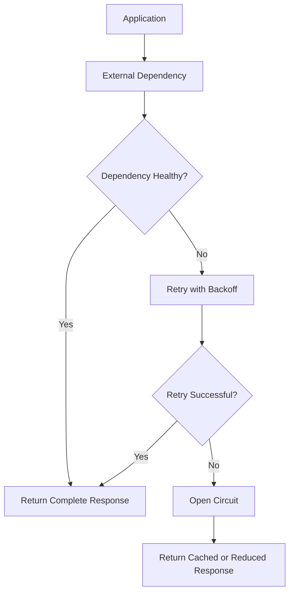

---

## 16. Observability

Use centralized observability across all layers.

### Monitor These Metrics

#### Edge Layer

- Request count
- WAF blocks
- HTTP status codes
- Global latency
- Backend health

#### API Layer

- Request rate
- 4xx and 5xx errors
- Throttled requests
- Policy failures
- Backend latency

#### Application Layer

- CPU and memory
- Thread pool usage
- Garbage collection
- Dependency latency
- Exception rate

#### Data Layer

- Database CPU
- Connections
- Query duration
- Deadlocks
- Storage usage
- RU consumption for Cosmos DB

#### Messaging Layer

- Queue depth
- Message age
- Failed messages
- Dead-letter count

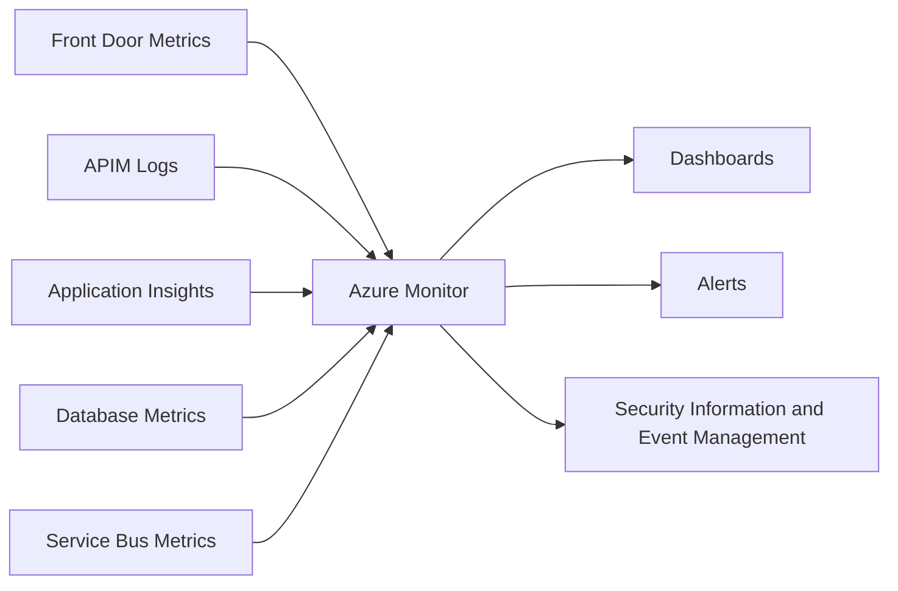

---

## 17. Deployment Strategy

Use Infrastructure as Code and automated CI/CD.

### Recommended Practices

- Use Bicep or Terraform
- Store configuration in source control
- Separate environment configuration from application code
- Use deployment slots where supported
- Use blue-green deployments
- Use canary releases
- Run automated tests
- Support rollback
- Use approval gates for production

```mermaid
flowchart LR
    Repository["Source Repository"] --> Pipeline["CI/CD Pipeline"]
    Pipeline --> Tests["Build and Test"]
    Tests --> Security["Security and Quality Scans"]
    Security --> Staging["Deploy to Staging"]
    Staging --> Validation["Smoke and Load Tests"]
    Validation --> Production["Progressive Production Release"]
    Production --> Monitor["Monitor Release"]
    Monitor --> Rollback["Rollback if SLOs Fail"]
```

---

## 18. Performance Testing

Before production, perform:

### Load Testing

Tests expected normal traffic.

### Stress Testing

Determines the maximum capacity of the system.

### Spike Testing

Tests sudden traffic increases.

### Soak Testing

Tests long-running stability.

### Failover Testing

Confirms the system can operate after regional or dependency failure.

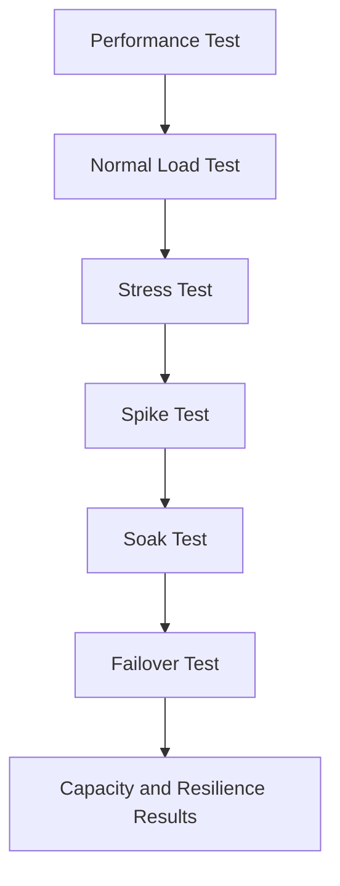

---

## 19. Capacity Planning

Capacity planning should consider:

- Average traffic
- Peak traffic
- Sudden bursts
- Seasonal events
- Growth projections
- Dependency limits
- Regional failover capacity
- Database throughput
- Queue processing rate

A good design should not run every resource at maximum capacity during normal traffic. It should maintain enough headroom for bursts and failure scenarios.

> Interview phrase:  
> **Capacity planning must include failover capacity, not just normal production capacity.**

---

## 20. Cost Optimization

Control cost without compromising critical requirements.

Strategies include:

- Autoscale stateless compute
- Use caching to reduce database usage
- Right-size databases
- Use reserved capacity for predictable workloads
- Use storage tiers
- Scale workers based on queue depth
- Shut down non-production environments when appropriate
- Monitor cost per request or transaction
- Avoid unnecessary cross-region traffic

---

## 21. Example Request Scenario

Suppose users submit an order.

### Synchronous Work

The API should synchronously:

1. Authenticate the user
2. Validate the request
3. Check inventory
4. Create the order
5. Return the order ID

### Asynchronous Work

The API can process asynchronously:

1. Send confirmation email
2. Publish analytics event
3. Generate invoice
4. Notify fulfillment system
5. Update search index

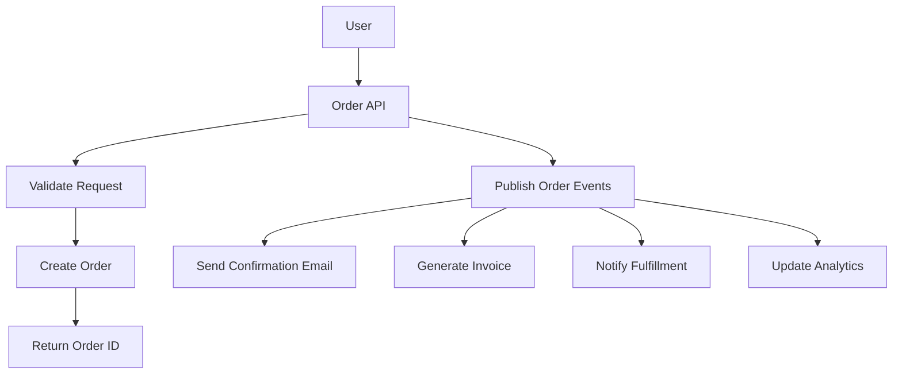

---

## 22. Common Bottlenecks

Typical bottlenecks include:

- Database connection limits
- Slow queries
- Poor partition keys
- Missing indexes
- Cache stampedes
- Synchronous calls to slow services
- Unbounded retries
- Insufficient queue consumers
- Network bandwidth
- External API rate limits
- Large payload sizes
- Inefficient serialization

Scaling application instances alone does not solve these problems.

---

## 23. Common Interview Mistakes

1. Designing only a single-region architecture
2. Scaling compute while ignoring the database
3. Keeping user sessions in local server memory
4. Performing every operation synchronously
5. Omitting caching
6. Ignoring queue backlogs
7. Failing to define RTO and RPO
8. Not explaining security
9. Not explaining monitoring
10. Not testing failover
11. Using retries without limits
12. Exposing private backend services publicly

---

## 24. Interview Questions and Strong Answers

### Q1: How do you scale the application tier?

**Answer:** Keep the application stateless and scale horizontally using multiple instances. Configure autoscaling based on CPU, memory, request rate, latency, or queue depth.

### Q2: How do you handle traffic spikes?

**Answer:** Use Front Door and WAF at the edge, autoscale the application tier, cache frequently accessed data, and place non-critical work on Service Bus queues.

### Q3: How do you prevent database overload?

**Answer:** Use Redis caching, optimize queries and indexes, use read replicas or partitioning where appropriate, pool connections, and move non-critical writes to asynchronous workers.

### Q4: Why use a message queue?

**Answer:** Queues absorb bursts, decouple services, enable independent scaling, and allow retry and dead-letter processing.

### Q5: How do you make the application highly available?

**Answer:** Deploy multiple instances across availability zones or regions, use health-based routing, replicate the data tier, and regularly test failover.

### Q6: How do you secure the architecture?

**Answer:** Use Entra ID, APIM JWT validation, WAF, private endpoints, Managed Identity, Key Vault, encryption, least privilege, and centralized monitoring.

### Q7: How do you prevent cascading failures?

**Answer:** Use timeouts, bounded retries with exponential backoff and jitter, circuit breakers, bulkheads, queues, and graceful degradation.

### Q8: How do you manage deployments?

**Answer:** Use Infrastructure as Code, automated CI/CD, canary or blue-green deployments, health validation, and automated rollback.

### Q9: How do you monitor the system?

**Answer:** Track latency, traffic, errors, saturation, queue depth, cache hit rate, database performance, dependency health, and security events.

### Q10: Is multi-region deployment always required?

**Answer:** Not always. It depends on business availability, latency, compliance, RTO, and RPO requirements. However, a high-criticality global application usually benefits from multi-region deployment.

---

## 25. 60-Second Interview Pitch

> I would design the application using a layered and horizontally scalable Azure architecture. Azure Front Door and WAF provide global routing, edge caching, and protection. API Management handles authentication, authorization, throttling, and API governance. The application tier runs stateless instances on App Service, AKS, or Container Apps and scales horizontally based on demand. Redis reduces database load, while Service Bus decouples long-running work and absorbs traffic spikes. Azure SQL or Cosmos DB is selected based on the data access pattern, with partitioning and replication for scale and resilience. For security, I use Entra ID, Managed Identity, Key Vault, private endpoints, and least-privilege access. Finally, I add multi-region failover, centralized monitoring, automated deployments, load testing, and tested disaster recovery procedures.

---

## 26. Final Architecture Checklist

- [ ] Azure Front Door or equivalent global entry layer
- [ ] Web Application Firewall enabled
- [ ] API Management configured
- [ ] JWT authentication and authorization implemented
- [ ] Stateless application services
- [ ] Horizontal autoscaling configured
- [ ] Redis caching strategy defined
- [ ] Service Bus asynchronous processing configured
- [ ] Database partitioning, indexing, and replication planned
- [ ] Backend services kept private
- [ ] Managed Identity used for service authentication
- [ ] Secrets stored in Key Vault
- [ ] Multi-region strategy aligned with RTO and RPO
- [ ] Health probes and failover routing configured
- [ ] Centralized logs, metrics, and distributed tracing
- [ ] CI/CD with safe deployment and rollback
- [ ] Load, stress, spike, soak, and failover tests completed

---

## One-Line Conclusion

> A scalable Azure architecture combines global edge routing, WAF protection, API governance, stateless autoscaling compute, distributed caching, asynchronous messaging, resilient data services, multi-region failover, zero-trust security, and comprehensive observability.