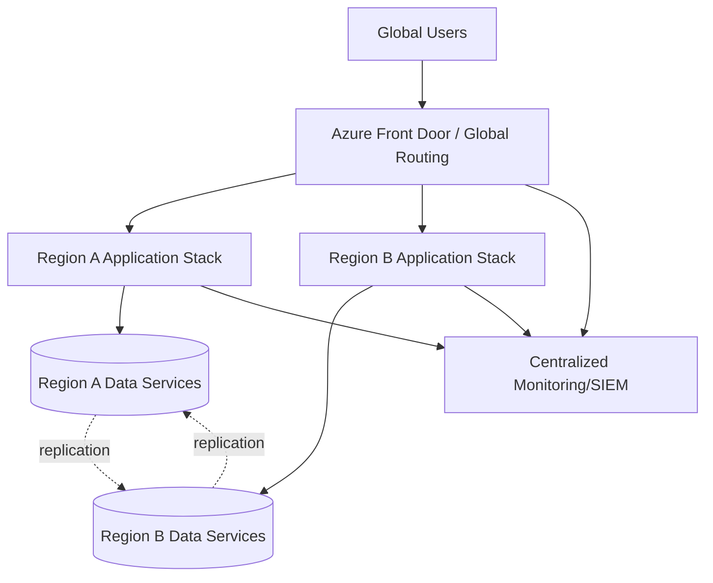
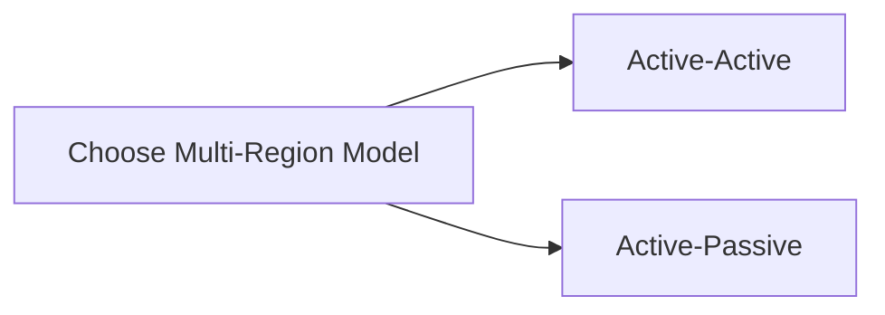
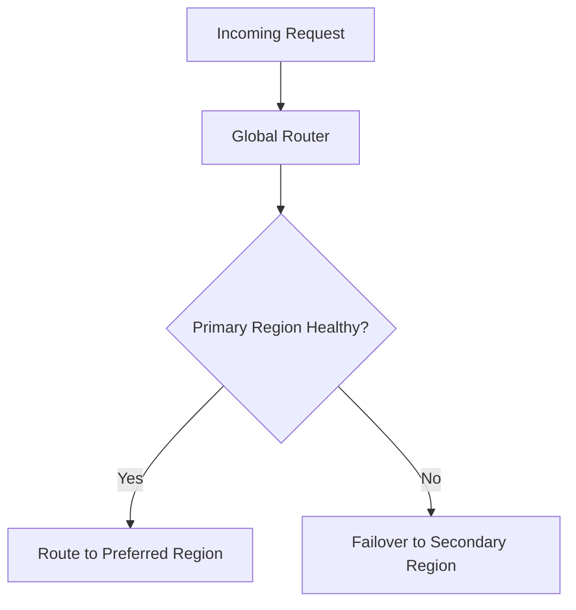
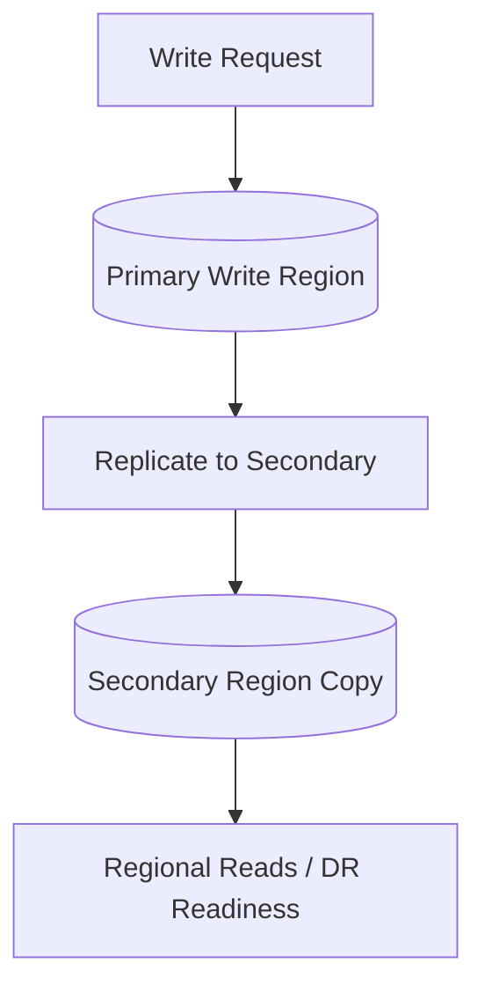
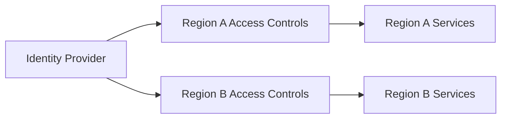
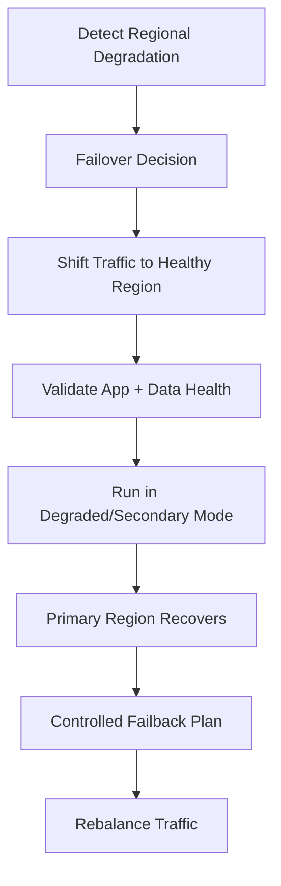

# How Do You Design a Multi-Region Azure Solution?
## Detailed Interview Preparation Guide with Flow Charts

---

## 1) Direct Interview Answer

Design a multi-region Azure solution by combining:

1. Global traffic routing
2. Regional independence (failure isolation)
3. Data replication and consistency strategy
4. Active-active or active-passive failover model
5. Region-aware security and identity controls
6. Observability and automated failover operations
7. Tested disaster recovery with defined RTO/RPO

> One-liner: *A strong multi-region Azure design routes users globally, isolates regional failures, replicates data safely, and enables controlled failover with measurable recovery objectives.*

---

## 2) When Multi-Region Is Needed

Use multi-region architecture when you need:

- High availability beyond single-region outages
- Low-latency global user experience
- Disaster recovery with strict RTO/RPO
- Regulatory or data residency requirements
- Business continuity for mission-critical systems

---

## 3) Core Design Decisions

Before architecture, define:

- **Availability target** (SLA/SLO)
- **RTO** (max recovery time)
- **RPO** (max acceptable data loss)
- **Consistency requirements** (strong vs eventual)
- **Traffic pattern** (global, regional, bursty, seasonal)
- **Failover mode** (automatic vs manual oversight)
- **Budget and operational complexity tolerance**

---

## 4) High-Level Multi-Region Azure Architecture

---

## 5) Active-Active vs Active-Passive

## Active-Active
Both regions serve traffic simultaneously.

Pros:
- Better global latency
- Faster failover
- Better resource utilization

Cons:
- More complex data consistency/conflict handling
- More complex operations

## Active-Passive
Primary region serves traffic; secondary on standby.

Pros:
- Simpler operations
- Easier consistency model

Cons:
- Standby capacity underutilized
- Failover may be slower

---

## 6) Global Traffic Management Layer

Use a global entry service to:
- Route by latency/performance
- Detect unhealthy regions
- Fail over automatically
- Support weighted routing for gradual failback

Key controls:
- Health probes
- Endpoint priorities/weights
- Session affinity needs (if any)
- WAF and DDoS protections at edge

---

## 7) Regional Stack Independence

Each region should have its own:
- Compute instances
- Cache layer
- Messaging layer
- Regional data access path
- Secrets access strategy
- Monitoring signal emission

Goal:
- One region can fail without cascading outage to another region.

---

## 8) Data Layer Strategy (Most Important Interview Topic)

Multi-region success depends on data design.

Choose per workload:

- **Relational transactional data**: controlled replication/failover groups
- **Globally distributed NoSQL**: multi-region replication, partitioning strategy
- **Object storage**: geo-redundancy and access pattern design
- **Caches**: regional caches with warm-up and invalidation approach

Key decisions:
- Read/write topology
- Conflict resolution model
- Replication lag tolerance
- Failover promotion process

---

## 9) Consistency and Conflict Handling

In active-active designs:
- Conflicts can occur with multi-writer patterns
- Define deterministic conflict resolution
- Partition data ownership when possible to reduce conflict risk
- Use idempotent event handling and version metadata

Interview phrase:
> Multi-region is easy for stateless compute, hard for state consistency.

---

## 10) Messaging and Eventing Across Regions

For asynchronous reliability:
- Use region-local queues/topics for local processing
- Replicate critical events as needed
- Design idempotent consumers for duplicate/replayed messages
- Plan DLQ handling in each region

---

## 11) Security Architecture in Multi-Region

- Central identity with regional enforcement points
- Least-privilege RBAC per region/resource
- Secrets/certs managed securely with regional resilience
- Private networking and controlled egress
- Consistent security policy baseline across regions
- Region-level audit logging

---

## 12) Deployment and Configuration Strategy

Use:
- Infrastructure as Code for both regions
- Same baseline templates with region parameters
- Progressive deployment (canary/blue-green by region)
- Config and feature flag management per region
- Drift detection and compliance checks

---

## 13) Multi-Region Failover and Failback Runbook

Failback should be controlled, not abrupt.

---

## 14) Observability and Operations

Track by region:
- Availability %
- Latency (p95/p99)
- Error rates
- Saturation/utilization
- Replication lag
- Queue lag
- Failover events and recovery times

Need:
- Region comparison dashboards
- Synthetic tests from multiple geographies
- Alerting with clear ownership/escalation

---

## 15) Testing Strategy (Often Missed)

Must test regularly:

1. Regional failover drills  
2. Data recovery and integrity validation  
3. DNS/traffic switch behavior  
4. Partial dependency failure scenarios  
5. Region rejoin/failback behavior  
6. Capacity under single-region full load  

If it isn’t tested, it isn’t reliable.

---

## 16) Cost Considerations

Multi-region increases cost. Optimize by:

- Choosing right model (active-passive vs active-active)
- Rightsizing standby capacity
- Prioritizing critical workloads for full redundancy
- Using autoscale with failover headroom
- Monitoring inter-region transfer costs

---

## 17) Common Mistakes (Interview Gold)

1. Multi-region compute but single-region database  
2. No clear RTO/RPO definitions  
3. Assuming failover works without drills  
4. Ignoring replication lag and data conflicts  
5. Hardcoding region-specific dependencies  
6. Shared global bottlenecks causing cross-region failure  
7. No failback strategy  
8. Under-capacity in secondary region during failover  

---

## 18) Practical Multi-Region Checklist

- [ ] Clear RTO/RPO/SLO targets defined  
- [ ] Global routing and health probes configured  
- [ ] Regional stacks independently deployable  
- [ ] Data replication/failover model documented and tested  
- [ ] Security controls consistent across regions  
- [ ] Region-aware observability and alerts active  
- [ ] Automated failover procedures validated  
- [ ] Failback runbooks tested  
- [ ] Capacity planning for single-region survival completed  

---

## 19) Interview Q&A (Strong Answers)

### Q1: Active-active or active-passive—how do you decide?
**Answer:** Based on latency, availability goals, consistency complexity tolerance, and budget. Active-active for low latency/high resiliency; active-passive for simpler DR.

### Q2: What is the biggest challenge in multi-region systems?
**Answer:** Data consistency, replication lag, and conflict resolution—not just compute failover.

### Q3: Is global load balancing enough?
**Answer:** No. You also need data failover strategy, regional independence, and tested operational runbooks.

### Q4: How do you validate readiness?
**Answer:** Regular game-day failover tests, recovery metric tracking, and post-test remediation loops.

### Q5: How do you secure multi-region architecture?
**Answer:** Central identity, regional least-privilege controls, secure secret handling, network restrictions, and unified audit monitoring.

### Q6: Why is failback planning important?
**Answer:** Returning to primary can cause instability/data issues if not controlled; failback must be staged and validated.

---

## 20) 60-Second Interview Pitch

> I design multi-region Azure solutions by first defining business RTO/RPO and consistency requirements. I place a global routing layer in front of independent regional application stacks so traffic can fail over automatically when health probes detect issues. The critical design focus is the data layer: replication topology, read/write strategy, and conflict handling must match business consistency needs. I secure each region with consistent identity, network, and secret-management controls. I implement IaC-based deployments, region-aware observability, and automated runbooks for failover and controlled failback. Finally, I run regular disaster recovery drills to verify the architecture meets real recovery objectives under failure conditions.

---

## 21) One-Line Conclusion

> A robust multi-region Azure solution combines global traffic routing, independent regional stacks, resilient data replication, and continuously tested failover/failback operations aligned to RTO/RPO goals.