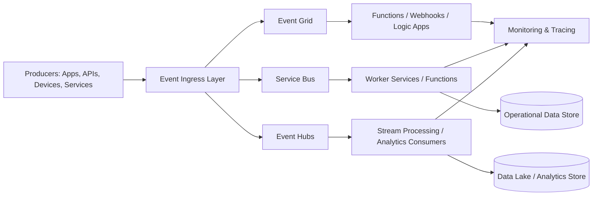
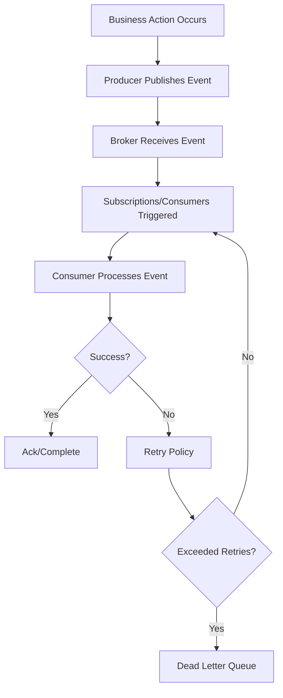
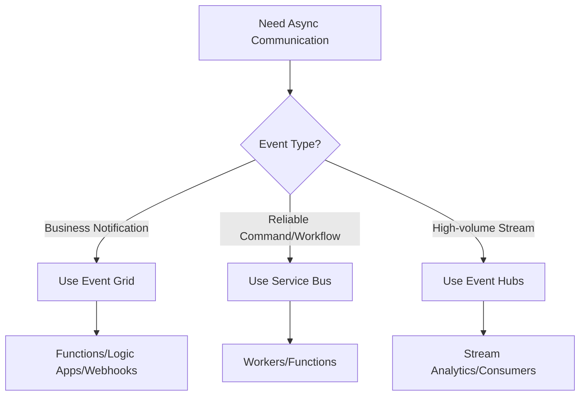
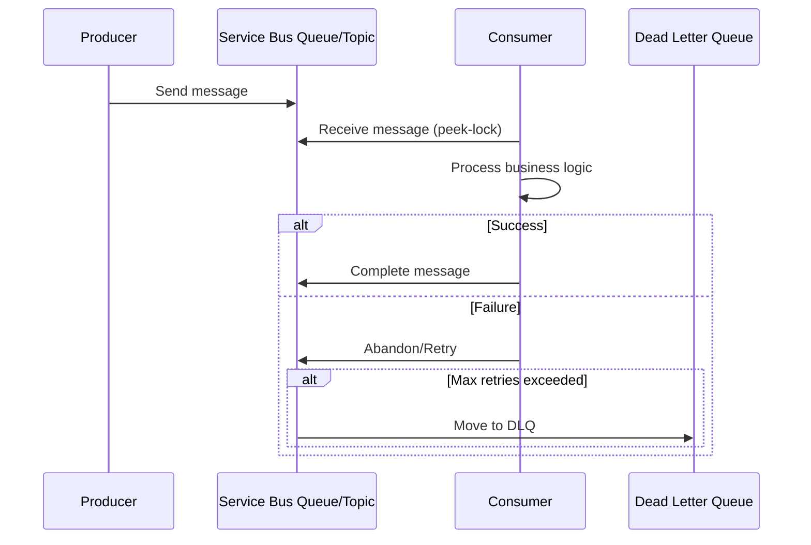
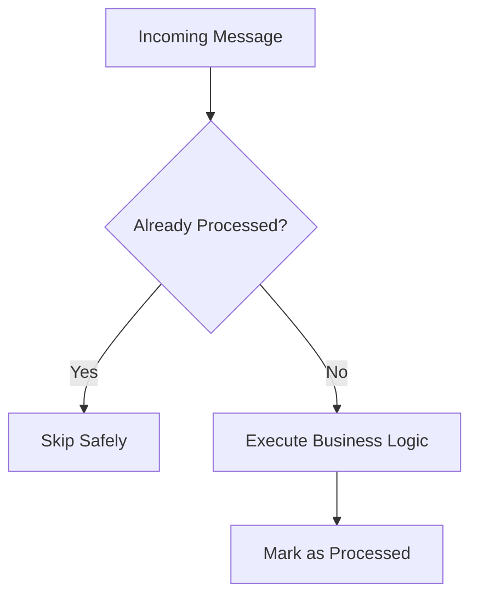
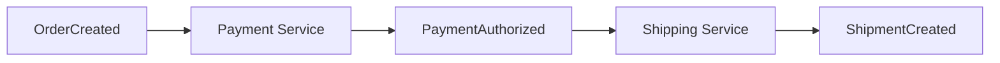
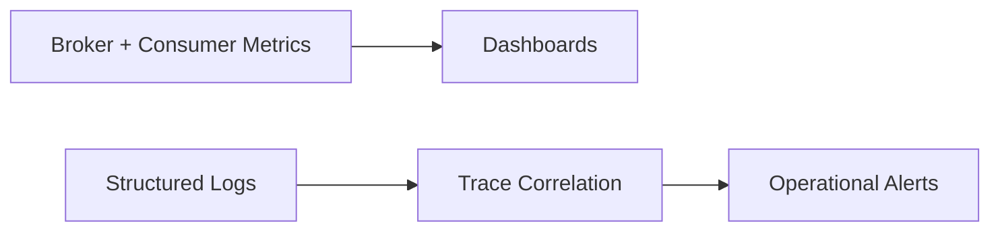

# How Do You Design an Event-Driven Architecture in Azure?
## Detailed Interview Preparation Guide with Flow Charts

---

## 1) Direct Interview Answer

Design event-driven architecture in Azure by building loosely coupled producers and consumers connected through managed messaging/event services, with strong reliability, scalability, security, and observability controls.

Core blueprint:

1. Identify domain events and event contracts
2. Choose the right Azure messaging services per use case
3. Decouple producers and consumers via topics/queues/events
4. Ensure reliability (retries, DLQ, idempotency, ordering strategy)
5. Scale consumers independently
6. Secure transport and access using identity-based controls
7. Implement end-to-end tracing and operational governance

> One-liner: *In Azure, event-driven design means asynchronous, decoupled communication using Event Grid/Event Hubs/Service Bus with resilient consumer processing and strong operational controls.*

---

## 2) Why Event-Driven Architecture (EDA)?

EDA is ideal when you need:

- Loose coupling between services
- High scalability under burst traffic
- Real-time or near-real-time reactions
- Independent service evolution/deployment
- Better resilience through asynchronous buffering

---

## 3) Core Azure Services and When to Use

| Service | Best For | Key Characteristic |
|---|---|---|
| **Azure Event Grid** | Reactive event routing | Pub/sub event notifications, serverless integrations |
| **Azure Service Bus (Queue/Topic)** | Enterprise messaging workflows | Reliable commands/messages, DLQ, sessions, transactions features |
| **Azure Event Hubs** | High-throughput streaming ingestion | Telemetry/log/clickstream/event streams at scale |
| **Azure Storage Queues** | Simple queue workloads | Cost-effective basic queueing |
| **Azure Functions** | Event-driven compute | Trigger-based serverless consumer/processor |

Interview phrase:
> Event Grid for event notifications, Service Bus for business messaging reliability, Event Hubs for large-scale streaming ingestion.

---

## 4) High-Level Azure EDA Reference Architecture

---

## 5) Event Flow (End-to-End)

---

## 6) Step-by-Step Design Approach

## Step 1: Define Domain Events
Examples:
- `OrderCreated`
- `PaymentAuthorized`
- `ShipmentDispatched`
- `UserRegistered`

Rules:
- Events describe facts that happened (past tense naming)
- Keep event payload minimal but meaningful
- Include metadata (timestamp, source, version, correlation ID)

## Step 2: Define Event Contract and Versioning
Include:
- Event ID
- Event type/name
- Schema version
- Correlation/trace ID
- Tenant/context metadata (if multi-tenant)

Adopt forward-compatible schema evolution.

## Step 3: Choose Messaging Pattern
- Event notification -> Event Grid
- Reliable work queue/commands -> Service Bus Queue/Topic
- Massive telemetry stream -> Event Hubs

## Step 4: Design Consumer Model
- Competing consumers for scale
- Consumer groups for independent stream processing
- Idempotent handlers
- Independent deployment lifecycle

## Step 5: Add Reliability Controls
- Retries with backoff
- Dead-letter handling
- Poison message strategy
- Exactly-once illusion via idempotency + dedup controls

## Step 6: Add Security and Governance
- Entra ID / managed identity auth
- RBAC on messaging resources
- Private networking controls
- Encryption and audit logs

## Step 7: Add Observability
- End-to-end trace correlation
- Queue depth / lag / throughput dashboards
- Alerting on DLQ growth and processing failures

---

## 7) Pattern Selection Flow Chart

---

## 8) Reliable Processing Pattern (Service Bus Example)

---

## 9) Idempotency and Duplicate Handling

At-least-once delivery means duplicates can occur.

Design consumers to be idempotent:
- Use event/message ID dedup store
- Use upsert patterns
- Check processed markers before side effects
- Make handlers retry-safe

---

## 10) Ordering Strategy

Not all event flows require strict ordering.

If needed:
- Partition by entity key (e.g., orderId)
- Use session/partition-aware consumers
- Limit parallelism for strict order paths
- Design around eventual consistency where possible

---

## 11) Eventual Consistency Design

EDA is typically eventually consistent.

Implications:
- Read models may lag writes briefly
- UI may need “processing” state
- Use compensating actions for failures
- Communicate consistency model clearly to business stakeholders

---

## 12) Saga/Choreography-Orchestration Patterns

## Choreography
- Services react to events independently
- No central coordinator
- Simple for smaller workflows, can become hard to track at scale

## Orchestration
- Central workflow engine/service coordinates steps
- Better visibility/control for complex long-running business processes

---

## 13) Error Handling and DLQ Operations

Define DLQ playbook:
- Categorize failure reason (schema/business/transient)
- Add replay tooling/process
- Alert on DLQ threshold breaches
- Avoid infinite retry loops
- Track mean time to recovery for failed events

---

## 14) Security Architecture for EDA

- Managed identity for producers/consumers
- RBAC per topic/queue/hub
- Private endpoints/VNet integration where required
- Encryption in transit and at rest
- Secretless auth wherever possible
- Audit access and publishing/consumption actions

---

## 15) Observability in Event-Driven Systems

Track:
- Publish rate
- Consumer throughput
- Processing latency
- Retry count
- DLQ size
- Consumer lag/checkpoint delay
- End-to-end business transaction time

---

## 16) Scalability and Performance Tuning

Levers:
- Increase consumer instances
- Tune batch size/prefetch/concurrency
- Partition appropriately
- Separate hot and cold event paths
- Use backpressure controls
- Scale independently by workload type

---

## 17) Data and Analytics Integration Pattern

Event-driven systems often feed analytics:

- Operational events -> Event Hubs
- Stream processing -> transformation/enrichment
- Landing in data lake/warehouse for BI and ML

This supports real-time dashboards and historical insights.

---

## 18) Common Interview Mistakes (Golden Section)

1. Treating queues and events as identical patterns  
2. No idempotency strategy (duplicate side effects)  
3. Ignoring DLQ design and replay process  
4. Over-centralized “god consumer” service  
5. No schema versioning plan  
6. Tight coupling through shared internal DB instead of events  
7. Missing trace correlation across async boundaries  
8. Assuming strict ordering everywhere (unnecessary bottleneck)  

---

## 19) Interview Q&A (Strong Answers)

### Q1: How do you pick Event Grid vs Service Bus vs Event Hubs?
**Answer:** Event Grid for reactive notifications, Service Bus for reliable enterprise message workflows, Event Hubs for high-throughput event streams.

### Q2: How do you ensure reliability?
**Answer:** At-least-once processing with retries, DLQ, idempotent consumers, and monitored replay procedures.

### Q3: How do you handle duplicates?
**Answer:** Use message IDs, dedup tracking, and idempotent business logic/upserts.

### Q4: Is EDA strongly consistent?
**Answer:** Usually eventually consistent; design read/write workflows and UX expectations accordingly.

### Q5: How do you secure event pipelines?
**Answer:** Managed identity, RBAC, private networking, encryption, and audit logging.

### Q6: How do you debug cross-service async flows?
**Answer:** Propagate correlation IDs and use centralized logs/traces with end-to-end telemetry dashboards.

---

## 20) 60-Second Interview Pitch

> I design event-driven architecture in Azure by first modeling domain events and contracts with versioning and correlation metadata. Then I choose messaging services by pattern: Event Grid for event notifications, Service Bus for reliable business messaging, and Event Hubs for high-throughput streaming. Producers and consumers are decoupled, and consumers are built idempotent with retries, dead-letter handling, and replay operations to ensure resilience. I secure communication using managed identities, RBAC, and private networking controls. Finally, I implement full observability—throughput, lag, retries, DLQ growth, and distributed tracing—so the system can scale safely and be operated reliably in production.

---

## 21) Final Design Checklist

- [ ] Domain events and ownership clearly defined  
- [ ] Event schema/versioning strategy documented  
- [ ] Correct Azure messaging service chosen per use case  
- [ ] Consumer idempotency and dedup strategy implemented  
- [ ] Retry + DLQ + replay operational workflow ready  
- [ ] Ordering/partition strategy intentionally designed  
- [ ] Security controls (identity, RBAC, network, encryption) enabled  
- [ ] End-to-end tracing and alerting in place  
- [ ] Throughput/load tests and failure drills completed  

---

## One-Line Conclusion

> In Azure, event-driven architecture is built by decoupling services through the right messaging backbone and hardening the system with idempotent processing, DLQ/retry reliability, secure identity-based access, and deep observability.