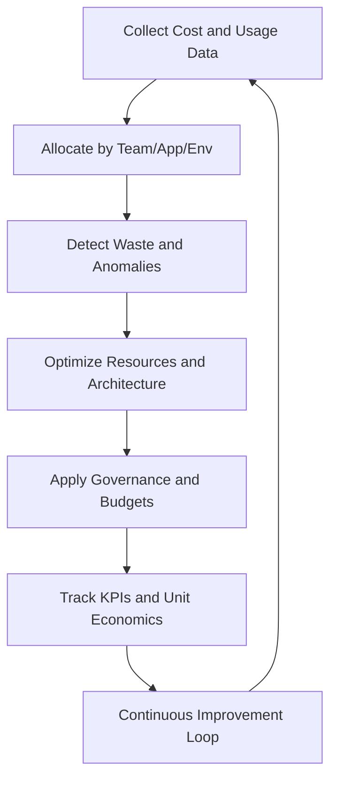
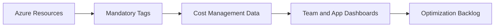
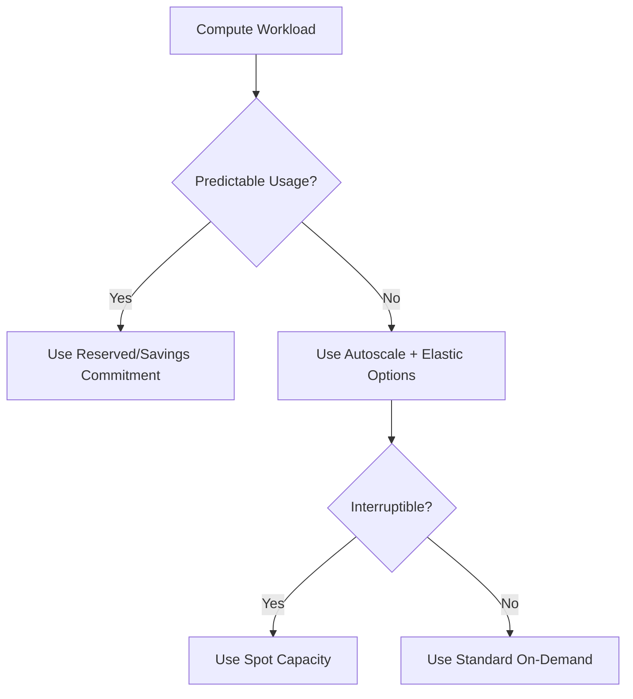
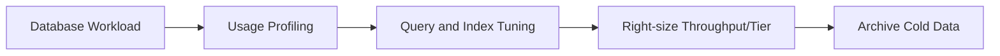
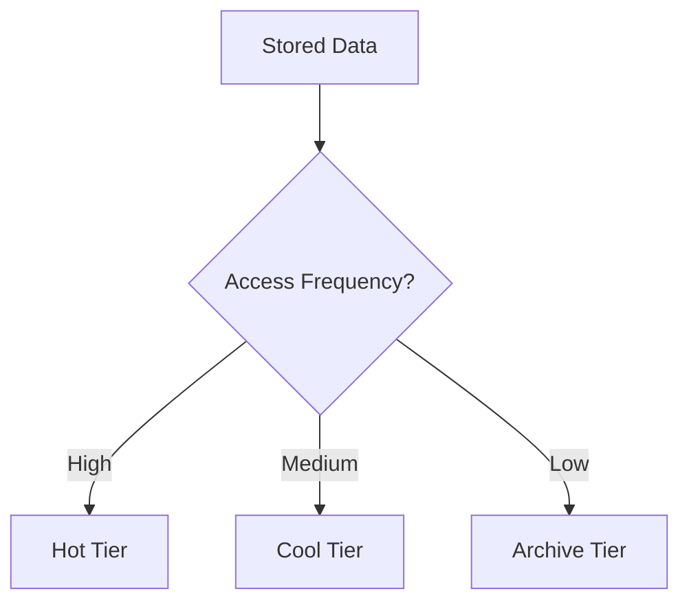
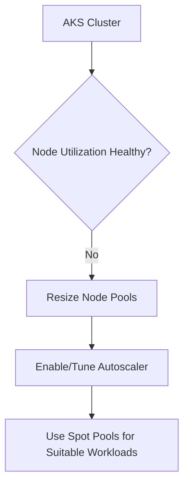
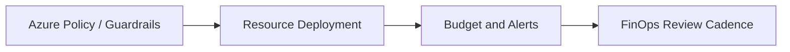
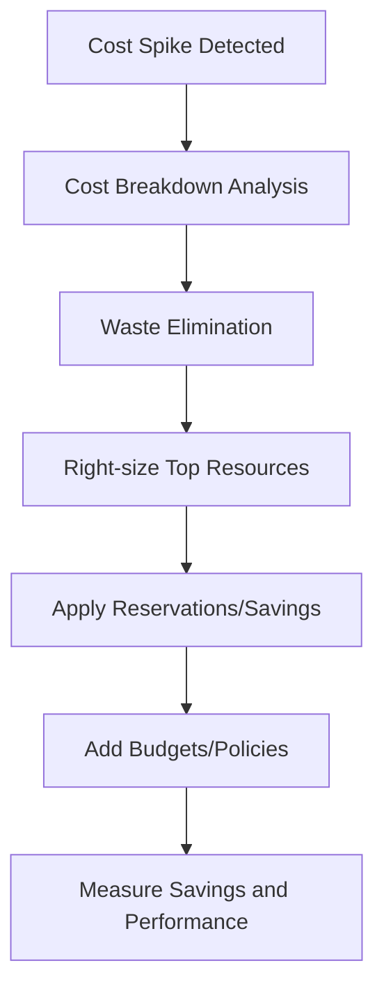

# How Do You Optimize Azure Costs?
## Detailed Interview Preparation Guide with Flow Charts

---

## 1) Direct Interview Answer

To optimize Azure costs, implement a continuous **FinOps lifecycle**:

1. Gain cost visibility (tagging, cost allocation, dashboards)
2. Eliminate waste (idle/orphaned resources, overprovisioning)
3. Right-size and auto-scale workloads
4. Use commitment discounts strategically
5. Optimize storage, network, and licensing choices
6. Enforce governance with budgets and policy guardrails
7. Continuously monitor unit economics and improve

> One-liner: *Azure cost optimization is a continuous process of visibility, right-sizing, automation, governance, and architectural efficiency—not a one-time cleanup.*

---

## 2) Cost Optimization Mindset (Interview Framing)

Strong answer = balance of:

- **Cost**
- **Performance**
- **Reliability**
- **Security**
- **Operational effort**

Avoid “cheapest at any cost” design. Optimize for **business value per dollar**.

---

## 3) FinOps Lifecycle Flow

---

## 4) Build Cost Visibility First

You cannot optimize what you cannot measure.

Core actions:
- Standardized tagging (app, owner, env, cost center, criticality)
- Subscription/resource group hierarchy aligned to org ownership
- Cost dashboards by team/workload
- Daily/weekly cost trend reviews
- Cost anomaly alerts

---

## 5) Quick-Win Savings (First 30 Days)

1. Delete unattached disks/NICs/public IPs/snapshots  
2. Stop or schedule non-prod environments off-hours  
3. Remove obsolete backups and stale environments  
4. Downsize over-provisioned VMs/DBs/App plans  
5. Turn on autoscaling where missing  
6. Reduce excessive log ingestion/retention where safe  

These often produce immediate savings.

---

## 6) Compute Cost Optimization

## 6.1 Right-Sizing
- Compare actual CPU/memory usage vs provisioned size
- Resize VMs/app plans/databases to fit realistic demand

## 6.2 Autoscaling
- Scale out/in based on load metrics
- Separate baseline vs burst capacity

## 6.3 Commitment Discounts
- Reserved capacity for predictable steady workloads
- Savings plans for flexible compute usage patterns
- Spot options for interruptible fault-tolerant workloads

## 6.4 Platform Choice
- Prefer managed PaaS/serverless where it reduces ops + waste
- Match workload to right compute model (VM vs App Service vs AKS vs Functions)

---

## 7) Database Cost Optimization

- Choose right engine/tier for workload pattern
- Right-size vCore/DTU/RU throughput
- Scale read replicas only when needed
- Tune queries/indexes to reduce compute waste
- Archive cold data to cheaper tiers
- Use serverless/auto-pause options where appropriate

---

## 8) Storage Cost Optimization

- Use lifecycle policies (hot -> cool -> archive)
- Delete obsolete snapshots/versions safely
- Compress and deduplicate where applicable
- Choose correct redundancy level by business need
- Avoid keeping expensive premium storage for cold data

---

## 9) Networking and Data Transfer Costs

Common hidden cost area:
- Cross-region traffic
- NAT/egress-heavy architectures
- Unoptimized CDN usage
- Chatty microservice patterns across zones/regions

Optimizations:
- Keep tightly coupled services co-located
- Use CDN for static/global content
- Reduce unnecessary egress paths
- Optimize payload size and call frequency

---

## 10) Kubernetes (AKS) Cost Optimization

- Right-size node pools
- Cluster autoscaler + HPA/VPA strategy
- Separate system/user node pools
- Use spot node pools for fault-tolerant workloads
- Remove idle namespaces/workloads
- Requests/limits tuning to improve bin-packing efficiency

---

## 11) Serverless and App Platform Cost Controls

For Functions/Logic Apps/App Service:
- Avoid unnecessary always-on premium settings if not needed
- Tune execution time and concurrency
- Minimize chatty orchestration steps
- Use consumption models for bursty/low baseline loads
- Use dedicated plans when sustained load makes them cheaper

---

## 12) Observability Cost Optimization

Monitoring can become expensive if unmanaged.

Control by:
- Sampling high-volume traces
- Filtering noisy logs
- Tiered retention policies
- Keeping security/compliance logs as required, trimming low-value debug verbosity
- Sending only necessary diagnostics at scale

Balance visibility with spend.

---

## 13) Governance and Guardrails

Implement organization-level controls:
- Budgets and threshold alerts
- Policy to enforce required tags
- Policy to restrict expensive SKUs/regions unless approved
- Quotas/approval workflows for large deployments
- Scheduled shutdown automation for non-prod

---

## 14) Cost Optimization by Environment Strategy

- Strict controls for Dev/Test
- Ephemeral environments with TTL auto-cleanup
- Production rightsized with SLO-aware headroom
- Separate subscriptions for clean cost accountability

---

## 15) Unit Economics (Advanced Interview Signal)

Track cost relative to business output:
- Cost per transaction
- Cost per active user
- Cost per API call
- Cost per GB processed
- Cost per tenant

This helps prioritize optimizations with highest business impact.

---

## 16) Example Optimization Workflow (Interview Scenario)

Scenario: Monthly Azure bill spikes 28%.

Approach:
1. Identify top cost drivers by service/resource tags
2. Detect anomalies and recent changes
3. Remove idle/orphan resources
4. Right-size top compute/database spenders
5. Apply reserved/savings commitments for stable workloads
6. Add autoscale and schedule non-prod shutdown
7. Revisit logging retention and ingestion filters
8. Track post-change savings and risk impact

---

## 17) Common Mistakes (Interview Gold)

1. Cost optimization as one-time project (not continuous)  
2. No tagging/accountability model  
3. Overcommitting reservations without usage confidence  
4. Aggressive downsizing that breaks performance/SLOs  
5. Ignoring data transfer and observability costs  
6. Keeping non-prod running 24x7 unnecessarily  
7. No collaboration between engineering and finance teams  

---

## 18) Practical Cost Optimization Checklist

- [ ] Mandatory tag policy enforced  
- [ ] Cost dashboards by app/team/environment  
- [ ] Budgets + anomaly alerts configured  
- [ ] Idle/orphan resource cleanup automation  
- [ ] Autoscaling configured for elastic workloads  
- [ ] Right-sizing reviews scheduled monthly  
- [ ] Reserved/Savings plan strategy for steady workloads  
- [ ] Storage lifecycle tiering enabled  
- [ ] Logging/monitoring ingestion tuned  
- [ ] Unit economics tracked and reviewed  

---

## 19) Interview Q&A (Strong Answers)

### Q1: What is your first step to reduce Azure costs?
**Answer:** Establish cost visibility and allocation with proper tagging and dashboards, then prioritize top spend drivers.

### Q2: How do you optimize without harming reliability?
**Answer:** Use SLO-aware right-sizing, staged changes, and performance monitoring before/after optimization.

### Q3: When would you use reservations or savings commitments?
**Answer:** For predictable baseline usage with high confidence in long-term consumption.

### Q4: Where do teams usually miss savings?
**Answer:** Idle non-prod resources, oversized databases, orphaned assets, and excessive logging/egress.

### Q5: How do you optimize AKS cost?
**Answer:** Tune autoscaling, right-size node pools, improve pod resource requests/limits, and use spot pools where appropriate.

### Q6: How do you prove optimization success?
**Answer:** Track savings trends plus unit economics and verify no regression in performance/reliability SLIs.

---

## 20) 60-Second Interview Pitch

> I optimize Azure costs using a FinOps approach: first establish visibility with mandatory tagging, cost allocation dashboards, and anomaly alerts. Then I eliminate waste like idle and orphan resources, right-size compute/database tiers, and enforce autoscaling. For predictable workloads, I apply reservations or savings commitments; for bursty workloads, I prefer elastic PaaS/serverless models. I also optimize storage lifecycle tiers, reduce unnecessary logging/egress costs, and add governance with budgets and policy guardrails. Finally, I track unit economics—such as cost per transaction—so optimization decisions improve business value without compromising reliability or security.

---

## 21) One-Line Conclusion

> Optimize Azure costs through continuous FinOps: visibility, waste elimination, right-sizing, smart commitments, governance guardrails, and unit-economics-driven engineering decisions.