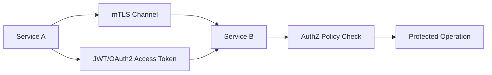
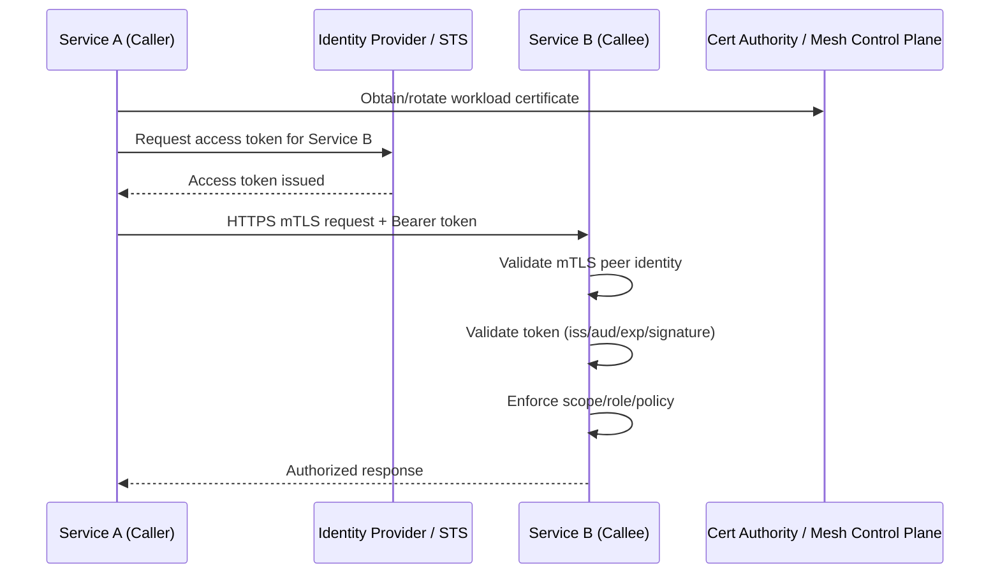
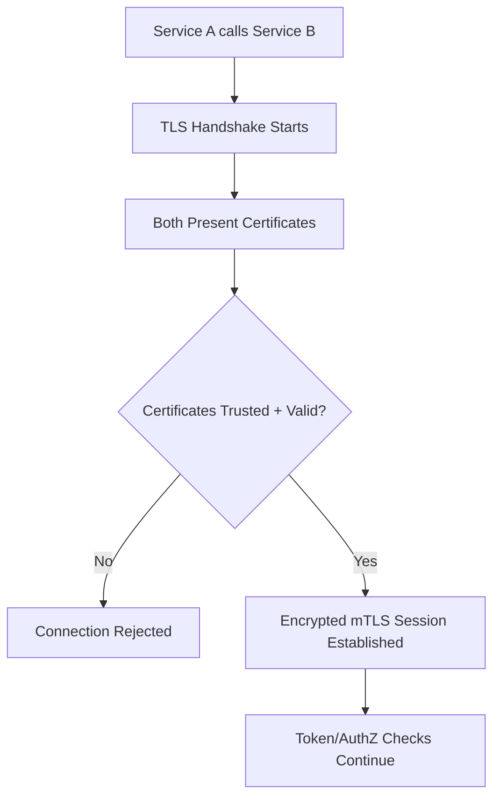
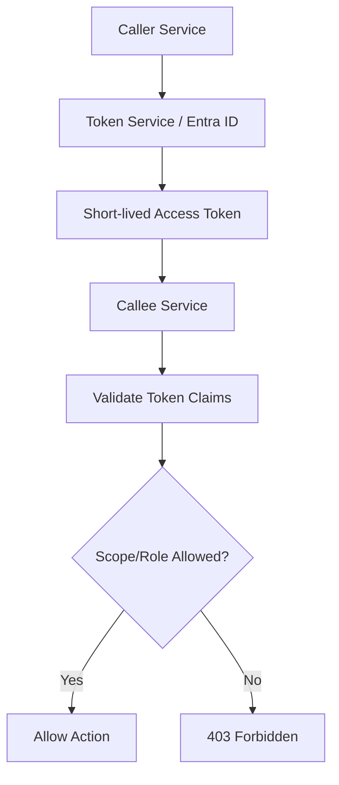
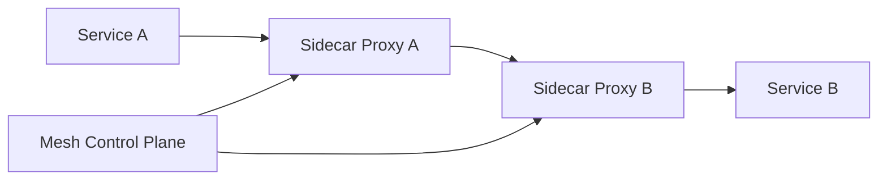
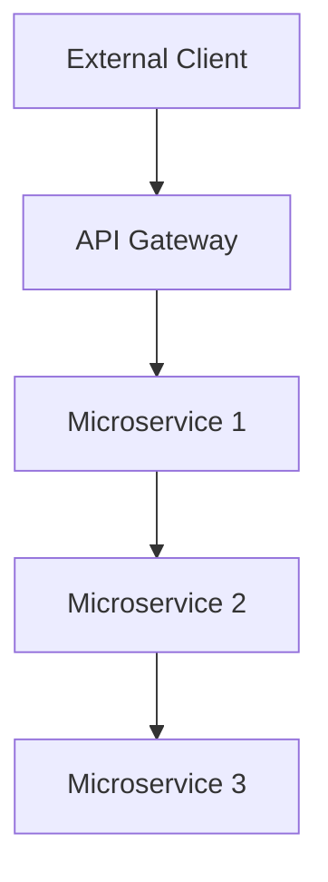
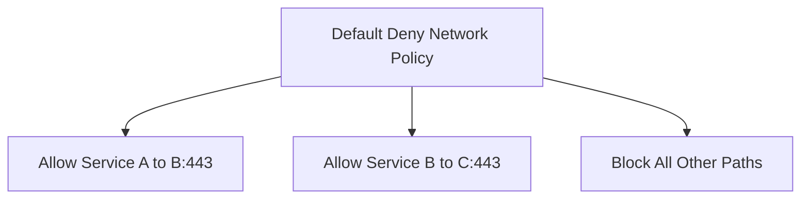

# How Do You Secure Communication Between Microservices?
## Detailed Interview Preparation Guide with Flow Charts

---

## 1) Direct Interview Answer

To secure microservice-to-microservice communication, implement **zero-trust service communication**:

1. Strong service identity for every microservice
2. Mutual TLS (mTLS) for encrypted, authenticated transport
3. Token-based authorization (JWT/OAuth2 scopes/roles)
4. Strict network segmentation and policy enforcement
5. Centralized secret/certificate/key management
6. API gateway/service mesh policy controls
7. Full telemetry, auditing, and anomaly detection

> One-liner: *Secure microservices by combining mTLS + identity-based authz + least-privilege network policies + continuous monitoring.*

---

## 2) Threat Model (What You’re Defending Against)

Common risks:
- Service impersonation/spoofing
- Man-in-the-middle interception
- Lateral movement after one service compromise
- Token theft/replay
- Over-permissive east-west network access
- Secret leakage from code/config/logs

Security objective:
- Every service call must be authenticated, encrypted, authorized, and auditable.

---

## 3) Zero-Trust Microservice Communication Model

No implicit trust based on network location.

---

## 4) End-to-End Secure Call Flow

---

## 5) Core Security Layers

## 5.1 Transport Security (Encryption + Peer Auth)
- Enforce TLS for all service calls
- Prefer mTLS to authenticate both client and server
- Disable weak ciphers/protocols
- Rotate certificates regularly

## 5.2 Identity and Authentication
- Each service gets unique identity (workload identity / managed identity / SPIFFE-style identity model)
- Avoid shared static credentials between services

## 5.3 Authorization
- Validate caller permissions per endpoint/action
- Use least privilege scopes/roles/policies
- Deny by default

## 5.4 Network Controls
- Micro-segmentation
- Deny-all baseline + explicit allow rules
- Restrict egress as well as ingress

---

## 6) mTLS Handshake Flow (Simplified)

mTLS gives:
- Confidentiality
- Integrity
- Service-to-service mutual authentication

---

## 7) Token-Based Authorization Between Services

Even with mTLS, still enforce application-level authorization:
- Access token with audience = target service
- Short token lifetime
- Scope/role checks per endpoint

mTLS proves *who connected*; token/policy proves *what is allowed*.

---

## 8) Service Mesh Security Pattern

A service mesh can standardize:
- mTLS enforcement
- Certificate rotation
- Traffic policies
- Authorization policies
- Observability and trace propagation

Benefits:
- Consistent policy across services
- Less custom security code in each app

---

## 9) API Gateway for North-South + Mesh for East-West

- API Gateway: external client-to-platform traffic
- Service Mesh/Network Policy: internal service-to-service traffic

Security policy should be coherent across both planes.

---

## 10) Certificate and Secret Management

Best practices:
- Store keys/certs/secrets in secure vault (e.g., Key Vault)
- Automated certificate issuance and rotation
- Short-lived certs/tokens
- No secrets in source code or container images
- Prevent secret exposure in logs and crash dumps

---

## 11) Network Segmentation and Policy

Implement:
- Namespace/subnet segmentation
- Allowlist service-to-service paths only
- Block lateral movement paths
- Separate control plane and data plane protections
- Restrict outbound internet where not required

---

## 12) Protecting Asynchronous Communication (Queues/Events)

For message-based microservices:
- TLS to broker
- Identity-based producer/consumer auth
- Per-queue/topic ACL/RBAC
- Message integrity controls (where required)
- Poison message handling (DLQ)
- Replay/idempotency controls

---

## 13) Replay, Abuse, and Lateral Movement Defenses

Controls:
- Short-lived tokens
- Nonce/jti patterns where relevant
- Rate limiting between services
- Circuit breakers and retry discipline
- Behavioral anomaly detection
- Rapid credential/cert revocation capability

---

## 14) Observability and Audit for Service Security

Log and trace:
- Caller service identity
- Target service identity
- Token claims context (safe subset)
- AuthN/AuthZ decision
- mTLS status
- Policy match/deny reason
- Correlation/trace IDs

Without observability, secure design cannot be verified in production.

---

## 15) Practical Policy Model (Interview Ready)

Per endpoint define:
- Allowed caller identities
- Required scopes/roles
- Required network origin/path
- Rate limits
- Audit level

Deny all unspecified traffic by default.

---

## 16) Common Mistakes (Interview Gold)

1. Trusting internal network by default (“inside is safe”)  
2. TLS without mTLS for sensitive east-west calls  
3. Shared long-lived service credentials  
4. Missing audience/scope checks on internal APIs  
5. Overly broad network rules (“any service to any service”)  
6. No certificate/token rotation strategy  
7. No centralized logging of auth decisions  
8. Retry storms causing cascading failures during auth failures  

---

## 17) Security Hardening Checklist

- [ ] Unique identity per service workload  
- [ ] mTLS enforced for east-west traffic  
- [ ] Short-lived JWT access tokens for service authz  
- [ ] Strict token validation (iss/aud/exp/signature)  
- [ ] Least-privilege scopes/roles per service endpoint  
- [ ] Default-deny network segmentation policies  
- [ ] Vault-based secret and cert lifecycle management  
- [ ] Centralized auth/audit logs + SIEM alerting  
- [ ] Automated cert/token rotation and revocation drills  
- [ ] Tested incident response for compromised service identity  

---

## 18) Interview Q&A (Strong Answers)

### Q1: Is TLS enough between microservices?
**Answer:** TLS encrypts traffic, but mTLS + identity-based authorization is needed for strong zero-trust security.

### Q2: Why both mTLS and JWT?
**Answer:** mTLS authenticates transport peers; JWT enforces application-level permissions and audience/scope rules.

### Q3: How do you stop lateral movement?
**Answer:** Default-deny network policies, strict service identity, least privilege authorization, and segmentation.

### Q4: How are secrets/certs managed securely?
**Answer:** Central vault, automated issuance/rotation, short lifetimes, and no secrets in code/images.

### Q5: What role does a service mesh play?
**Answer:** It standardizes mTLS, policy enforcement, cert rotation, and traffic observability across services.

### Q6: How do you secure async microservice communication?
**Answer:** Broker TLS, identity-based producer/consumer permissions, ACL/RBAC, DLQ handling, and idempotent consumers.

---

## 19) 60-Second Interview Pitch

> I secure microservice communication with a zero-trust model. Every service has a unique workload identity, and all east-west traffic is encrypted with mTLS for mutual authentication. On top of transport security, each request carries a short-lived access token that the target service validates for issuer, audience, expiry, and required scopes or roles. I enforce default-deny network segmentation so only explicit service paths are allowed, and I manage certificates and secrets centrally with automated rotation. For consistency at scale, I use gateway and/or service mesh policy enforcement plus end-to-end observability of authentication and authorization decisions. This approach minimizes impersonation, lateral movement, and credential abuse risks.

---

## 20) One-Line Conclusion

> Secure microservice communication by combining mTLS transport security, per-service identity, token-based least-privilege authorization, strict network segmentation, and continuous security observability.