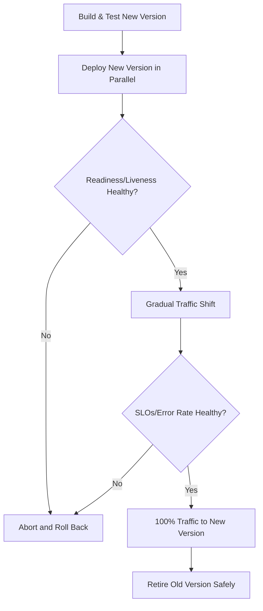
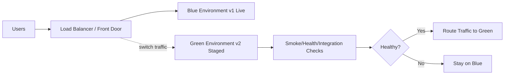
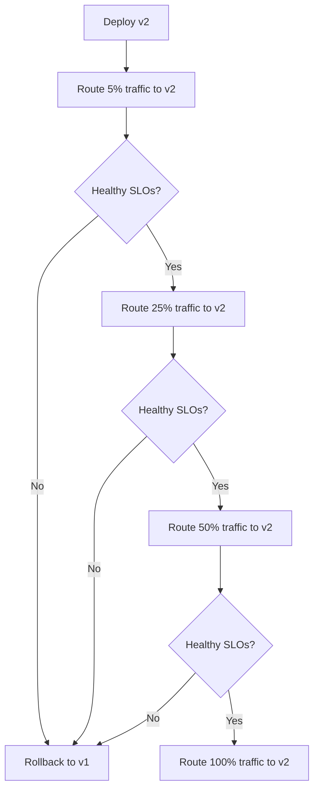
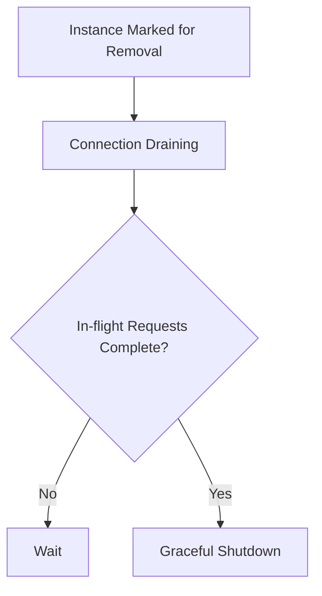
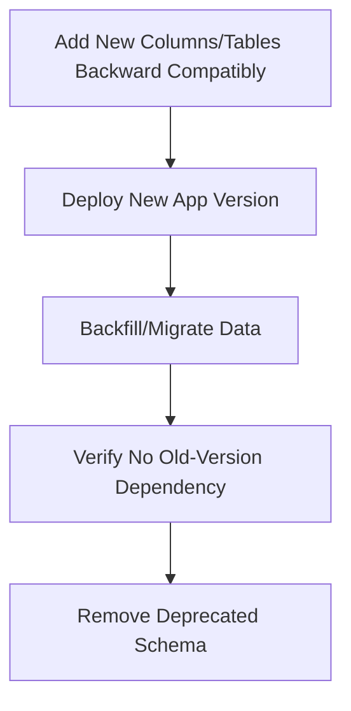
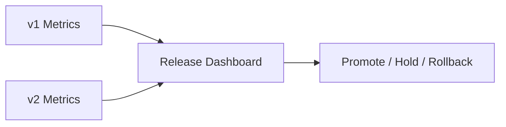
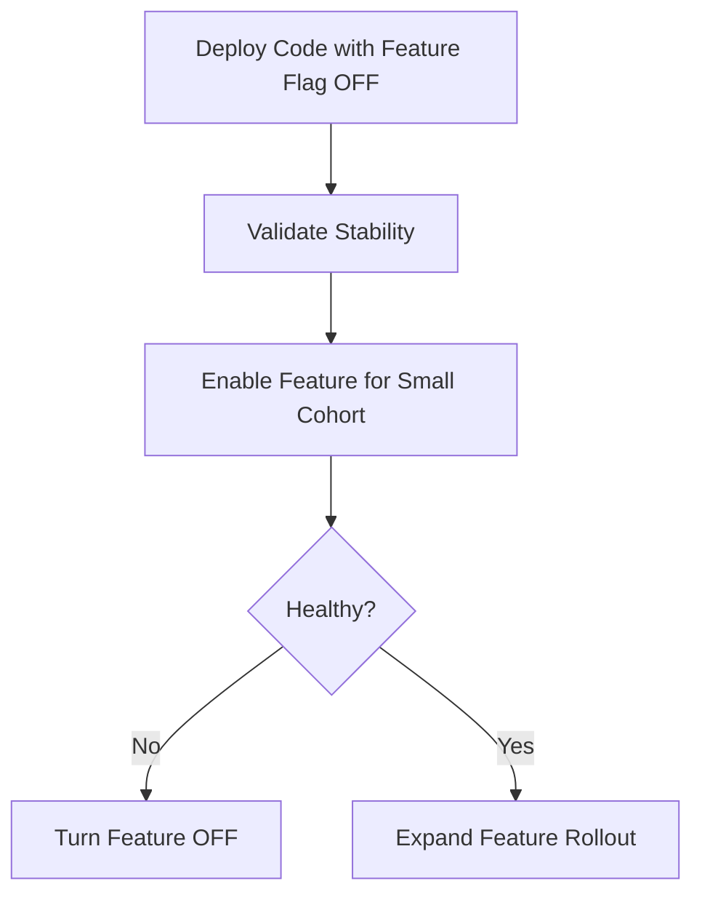

# How Would You Achieve Zero Downtime Deployment?
## Detailed Interview Preparation Guide with Flow Charts

---

## 1) Direct Interview Answer

To achieve zero downtime deployment, release new versions **without interrupting live traffic** by combining:

1. Stateless service design
2. Blue-green or canary deployment strategies
3. Health probes and readiness checks
4. Backward-compatible database changes
5. Controlled traffic shifting
6. Fast rollback automation
7. Strong observability and release gates

> One-liner: *Zero downtime deployment is achieved by running old and new versions in parallel, shifting traffic safely, and rolling back instantly if health degrades.*

---

## 2) Core Preconditions (Interviewers Love This)

Zero downtime is not just a pipeline feature. You need architectural readiness:

- Multiple instances behind a load balancer
- No single-instance dependency
- Stateless app nodes (or externally managed session state)
- Idempotent startup/shutdown behavior
- Health endpoints (liveness/readiness/startup)
- Backward-compatible API and DB evolution approach

---

## 3) High-Level Zero Downtime Flow

---

## 4) Deployment Strategies for Zero Downtime

## 4.1 Blue-Green Deployment
- Two environments: Blue (current), Green (new)
- Deploy new release to idle environment
- Validate Green
- Switch traffic from Blue to Green
- Roll back by switching traffic back if needed

Pros:
- Very fast rollback
- Clear separation of old/new

Cons:
- Higher temporary infra cost
- Needs robust data compatibility plan

---

## 4.2 Canary Deployment
- Release to small percentage first (e.g., 1%, 5%, 20%)
- Observe errors/latency/business KPIs
- Gradually increase traffic
- Roll back quickly if issues appear

Pros:
- Lower blast radius
- Strong production confidence before full rollout

Cons:
- More progressive control logic needed
- Requires strong observability discipline

---

## 4.3 Rolling Deployment (Careful Configuration)
- Replace instances in batches while others keep serving
- Must enforce max unavailable = 0 (or equivalent strategy) for strict no downtime goals

Pros:
- Efficient resource usage

Cons:
- Rollback can be slower than blue-green
- Riskier if health checks are weak

---

## 5) Blue-Green Flow Chart

---

## 6) Canary Flow Chart

---

## 7) Readiness, Liveness, and Startup Probes

These are critical for zero downtime:

- **Readiness probe:** Is instance ready to receive traffic?
- **Liveness probe:** Is instance alive and recoverable?
- **Startup probe:** Does slow-starting app need more warm-up time?

Traffic should only reach instances that pass readiness checks.

---

## 8) Connection Draining and Graceful Shutdown

During instance replacement:
- Stop sending new requests to instance
- Allow in-flight requests to complete
- Close gracefully
- Then terminate process/container

Without draining, users can see random failures during rollout.

---

## 9) Database Changes Without Downtime (Most Important Topic)

Zero downtime often fails at DB migration stage. Use **expand-contract** pattern:

1. Expand schema (additive, backward-compatible)
2. Deploy new app version that uses new schema safely
3. Migrate data gradually if needed
4. Contract (remove old fields) only after old version fully retired

Rules:
- Avoid breaking schema changes mid-rollout
- Never require synchronized instant code+DB cutover
- Make old and new app versions coexist safely

---

## 10) API Contract Compatibility

To prevent client breakage during zero downtime:
- Avoid breaking response changes without versioning
- Keep required fields stable
- Add new optional fields safely
- Support old clients during transition window

---

## 11) Session and State Considerations

For zero downtime:
- Keep app nodes stateless
- Externalize sessions to shared store
- Avoid in-memory-only user state
- Ensure distributed cache compatibility across versions

---

## 12) Release Gates and Automated Quality Checks

Before and during rollout, enforce gates:

- Unit/integration tests pass
- Security scans pass
- Smoke tests pass in target environment
- Synthetic transactions pass post-deploy
- Error rate/latency thresholds remain healthy
- Business KPI guardrails are stable

If a gate fails -> automatic rollback/stop progression.

---

## 13) Observability Required for Safe Cutover

Track real-time metrics by version:

- Request rate
- 4xx/5xx error rate
- p95/p99 latency
- CPU/memory saturation
- Dependency failure rate
- Queue lag
- Business conversion or critical transaction success

---

## 14) Rollback Strategy (Must Be Fast)

A true zero-downtime plan includes instant rollback:

- Blue-green: switch traffic back
- Canary: route 0% to new version
- Rolling: redeploy previous stable build quickly

Also rollback:
- Config toggles
- Feature flags
- Risky runtime switches

---

## 15) Feature Flags for Safer Releases

Feature flags decouple deployment from feature exposure.

Benefits:
- Deploy dark/inactive code safely
- Enable features gradually
- Disable problematic feature without full redeploy

---

## 16) Zero Downtime in Kubernetes Style Environments (Conceptual)

Key settings/patterns:
- Rolling updates with max unavailable constraints
- Readiness probes mandatory
- Pod disruption budgets
- PreStop hooks + termination grace period
- Autoscaling alignment with rollout pace

---

## 17) Common Causes of “Fake” Zero Downtime

1. Passing deployment but failing first real user traffic  
2. Missing readiness checks  
3. Breaking DB migration  
4. No connection draining  
5. Cache/session incompatibility between versions  
6. Long startup time not accounted for  
7. No rollback automation  
8. Monitoring not segmented by version  

---

## 18) Interview Q&A (Strong Answers)

### Q1: What deployment strategy is best for zero downtime?
**Answer:** Blue-green gives fastest rollback; canary gives lowest blast radius. Choose based on risk profile and platform capabilities.

### Q2: Is rolling deployment always zero downtime?
**Answer:** Only if configured correctly with enough healthy capacity, readiness checks, and graceful draining.

### Q3: What is the hardest part of zero downtime?
**Answer:** Database and contract compatibility across old and new versions.

### Q4: Why are readiness probes critical?
**Answer:** They prevent traffic from reaching instances that are running but not truly ready.

### Q5: How do you rollback safely?
**Answer:** Keep old version live during rollout, automate traffic reversal, and use release gates tied to SLOs.

### Q6: How do feature flags help?
**Answer:** They allow independent control of feature exposure, reducing deployment risk and enabling rapid mitigation.

---

## 19) 60-Second Interview Pitch

> I achieve zero downtime by deploying new and old versions in parallel and shifting traffic gradually using blue-green or canary strategy. Services are stateless and behind a load balancer with strict readiness and liveness probes, plus graceful connection draining during instance termination. I treat database changes with an expand-contract approach so both versions remain compatible during rollout. I use feature flags, automated release gates, and real-time SLO monitoring to detect issues quickly. If error rate or latency degrades, I execute immediate rollback through traffic reversal. This combination provides safe, continuous releases without user-facing downtime.

---

## 20) Final Zero Downtime Checklist

- [ ] Multiple healthy instances behind load balancer  
- [ ] Stateless app design (or externalized state)  
- [ ] Readiness/liveness/startup probes configured  
- [ ] Blue-green or canary strategy selected  
- [ ] Connection draining and graceful shutdown enabled  
- [ ] Backward-compatible DB migration strategy in place  
- [ ] API contract compatibility verified  
- [ ] Feature flags for risky changes  
- [ ] SLO-based release gates and alerts  
- [ ] Automated fast rollback tested  

---

## One-Line Conclusion

> Zero downtime deployment is achieved by parallel version operation, health-gated progressive traffic shifting, backward-compatible data evolution, and immediate rollback capability.