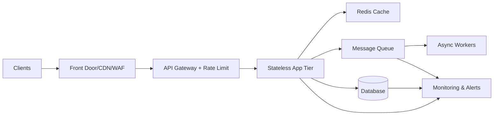
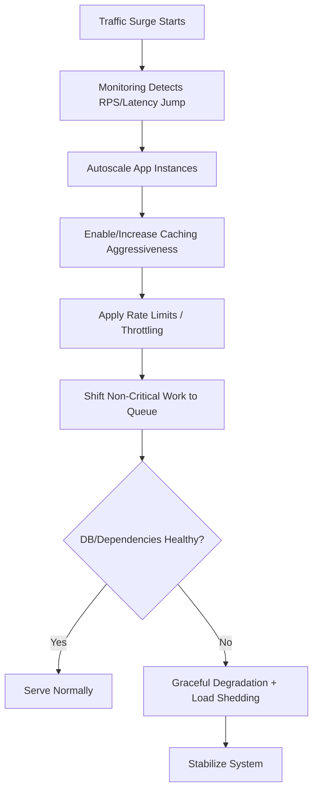
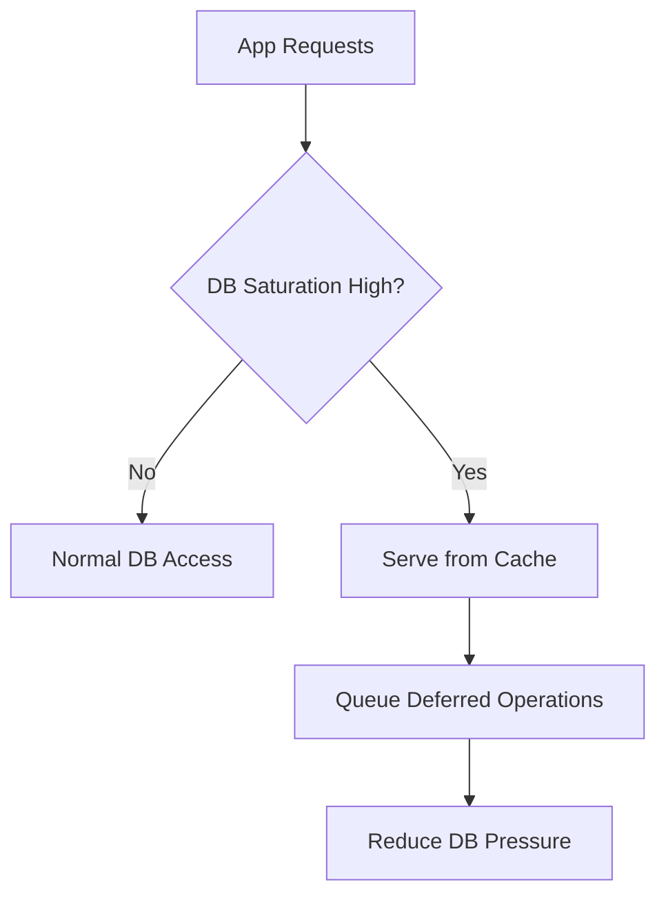
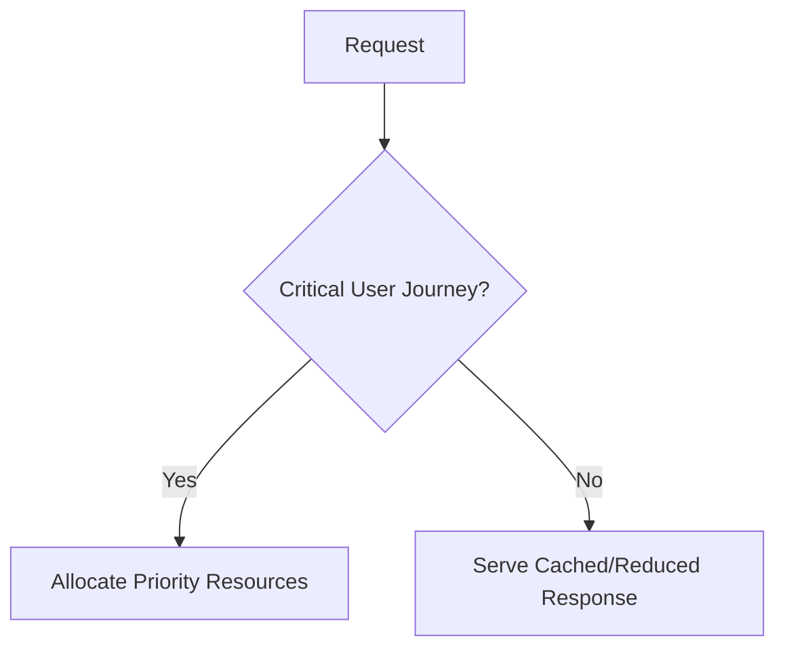
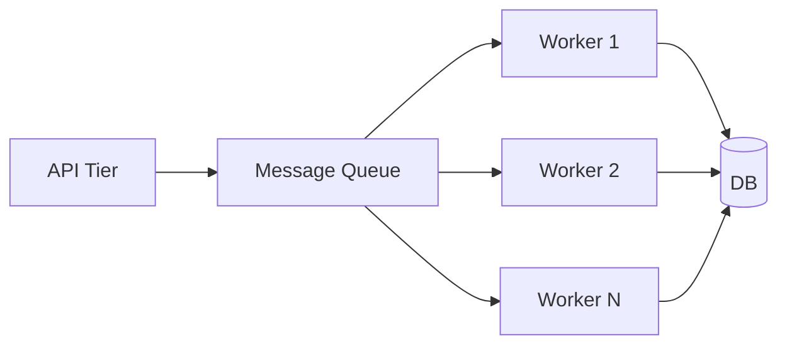
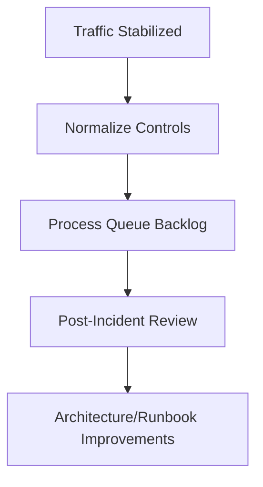

# How Would You Handle a Sudden Traffic Spike?
## Detailed Interview Preparation Guide with Flow Charts

---

## 1) Direct Interview Answer

To handle a sudden traffic spike, use a **prepare-detect-absorb-scale-protect-recover** strategy:

1. Prepare architecture for burst tolerance
2. Detect spike early with real-time monitoring
3. Absorb load at edge and cache layers
4. Scale stateless compute horizontally
5. Protect downstream dependencies (DB/external APIs)
6. Degrade gracefully when needed
7. Recover and perform post-incident optimization

> One-liner: *Handle traffic spikes by combining autoscaling, caching, queue-based decoupling, rate limiting, and graceful degradation with strong observability.*

---

## 2) What Interviewers Want to Hear

A strong answer includes:

- **Proactive readiness** (not only reactive scaling)
- **Load shedding/protection** controls
- **Data tier protection** (common bottleneck)
- **Operational playbook** with metrics and alerts
- **Post-spike analysis** for future hardening

---

## 3) High-Level Spike Handling Architecture

---

## 4) Spike Response Flow (Runtime)

---

## 5) Phase 1: Prepare Before Spike (Most Important)

## 5.1 Capacity Planning
- Define normal vs peak load
- Keep headroom
- Plan N+1 capacity for failures + spikes

## 5.2 Autoscaling Rules
Scale on:
- CPU/memory
- Request rate
- Queue depth
- Response latency
- Custom business metrics

## 5.3 Caching Strategy
- Edge/CDN cache for static and cacheable responses
- Redis for hot data
- API response caching where safe

## 5.4 Queue-Based Decoupling
Move non-immediate tasks (email, reports, analytics) to queues.

## 5.5 Protection Controls
- API rate limits
- Per-client quotas
- WAF/bot filtering
- Request size/time constraints

---

## 6) Phase 2: Detect Spike Early

Monitor leading indicators:
- Requests per second jump
- p95/p99 latency increase
- Error rate increase
- Queue depth growth
- DB CPU/connections nearing saturation
- Cache miss surge

Early detection prevents full outage and buys scaling time.

---

## 7) Phase 3: Absorb and Distribute Load

## 7.1 Edge Layer
- Use global traffic distribution
- Cache aggressively at edge
- Block malicious/bot traffic

## 7.2 API Gateway
- Enforce throttling and quotas
- Prioritize critical APIs
- Reject low-priority expensive endpoints if necessary

## 7.3 App Layer
- Scale out quickly with stateless instances
- Use warm pools/pre-provisioned capacity when possible

---

## 8) Phase 4: Protect Downstream Dependencies

The database is usually the first hard limit.

Protect it by:
- Increasing cache TTL temporarily
- Read/write optimization
- Limiting expensive queries/features
- Circuit breaker on failing dependencies
- Connection pool tuning
- Queueing writes or non-critical operations

---

## 9) Graceful Degradation Strategy

When full service is at risk, preserve core business paths.

Examples:
- Keep checkout/login/payment active
- Temporarily disable recommendations/personalization
- Return partial data for non-critical widgets
- Switch to cached snapshots for read-heavy pages

This improves perceived uptime and business continuity.

---

## 10) Load Shedding (Controlled Rejection)

If overloaded, fail intentionally and predictably:
- Return 429 for excess traffic
- Queue when possible
- Reject abusive clients first
- Apply priority tiers (premium/critical traffic)

Better to shed controlled load than crash everything.

---

## 11) Asynchronous Buffering During Spikes

Benefits:
- Smooth bursty workload
- Protect sync request latency
- Scale workers independently
- Preserve user experience for primary flows

---

## 12) Incident Playbook (Operational Response)

During spike:
1. Confirm real spike vs attack
2. Enable incident channel and command structure
3. Check edge, app, DB, queue dashboards
4. Raise autoscale limits if safe
5. Tighten rate limits if needed
6. Enable degradation toggles
7. Protect DB from saturation
8. Communicate status internally/external if needed

---

## 13) Post-Spike Recovery Actions

After stabilization:
- Gradually roll back emergency throttles
- Drain queue backlogs safely
- Validate data consistency
- Review SLO impact
- Run postmortem:
  - Root cause
  - Bottlenecks
  - What worked/failed
  - Capacity and rule adjustments

---

## 14) Key Metrics to Watch During Spike

- RPS / throughput
- p95/p99 latency
- 5xx and 429 rates
- CPU/memory per instance
- Autoscale event timing
- Cache hit ratio
- DB CPU, waits, active connections
- Queue depth and message age
- Dependency timeout/failure rate

---

## 15) Common Mistakes (Interview Gold)

1. Relying only on compute autoscale (ignoring DB limits)  
2. No rate limiting/throttling strategy  
3. No queue decoupling for non-critical operations  
4. No graceful degradation plan  
5. Slow autoscale due to cold starts/warm-up not planned  
6. No per-endpoint traffic prioritization  
7. Missing real-time dashboards and alerts  
8. No post-incident tuning process  

---

## 16) Interview Q&A (Strong Answers)

### Q1: What is the first action during a sudden spike?
**Answer:** Verify spike via observability, then trigger pre-defined scaling and protection playbook.

### Q2: Is autoscaling enough?
**Answer:** No. You also need caching, queue buffering, rate limiting, and downstream protection.

### Q3: How do you prevent DB meltdown?
**Answer:** Increase cache usage, throttle expensive requests, defer non-critical writes to queues, and apply circuit breakers/timeouts.

### Q4: What is graceful degradation?
**Answer:** Temporarily reducing non-critical functionality to preserve core user journeys and overall system stability.

### Q5: How do you handle abusive traffic during spikes?
**Answer:** Use WAF/bot controls, per-client quotas, and targeted throttling/load shedding.

### Q6: What should happen after the spike?
**Answer:** Controlled normalization, backlog drain, incident review, and architecture/runbook improvements.

---

## 17) 60-Second Interview Pitch

> I handle sudden traffic spikes with a layered strategy. First, I detect spikes early using real-time metrics like RPS, latency, error rate, queue depth, and DB saturation. Then I absorb traffic at the edge with CDN/WAF, enforce API throttling and quotas, and scale stateless app instances horizontally. I protect the data tier with aggressive caching, query/load controls, and by moving non-critical work to message queues processed by autoscaled workers. If pressure persists, I apply graceful degradation and controlled load shedding to protect critical user journeys. After stabilization, I normalize controls, clear backlogs, and run a post-incident review to improve capacity models and automation for the next event.

---

## 18) Final Checklist

- [ ] Autoscaling policies tuned and tested  
- [ ] Edge caching + WAF + bot controls active  
- [ ] API throttling/quotas per client/endpoint  
- [ ] Redis caching with hot-key strategy  
- [ ] Queue-based async decoupling for non-critical tasks  
- [ ] DB protection plan (limits, replicas, query controls)  
- [ ] Graceful degradation feature toggles ready  
- [ ] Incident dashboard + alerting configured  
- [ ] Runbooks documented and rehearsed  
- [ ] Post-spike review process established  

---

## One-Line Conclusion

> Handle sudden traffic spikes by combining fast detection, autoscaling, caching, throttling, async buffering, downstream protection, and graceful degradation to keep critical services available.