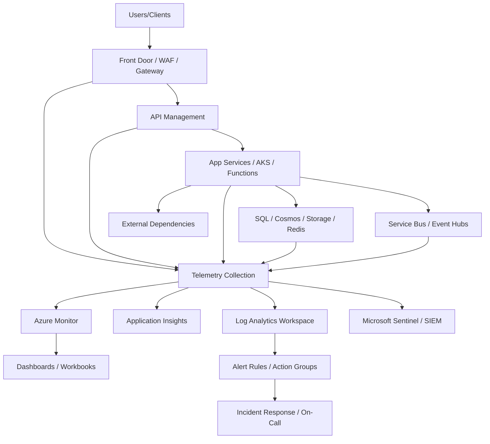
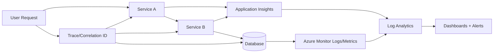
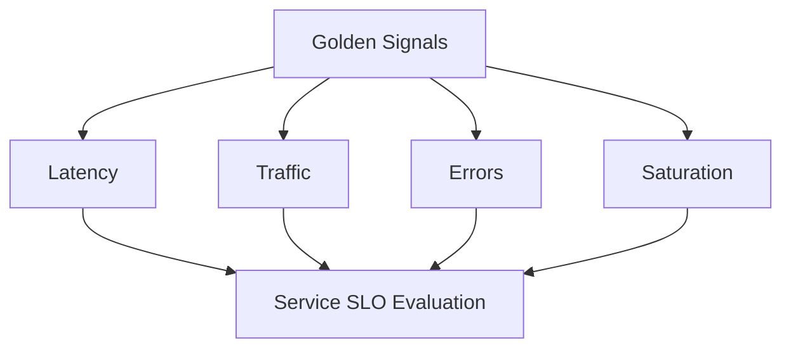
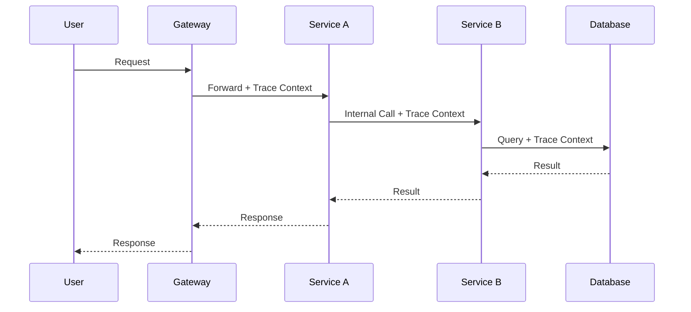
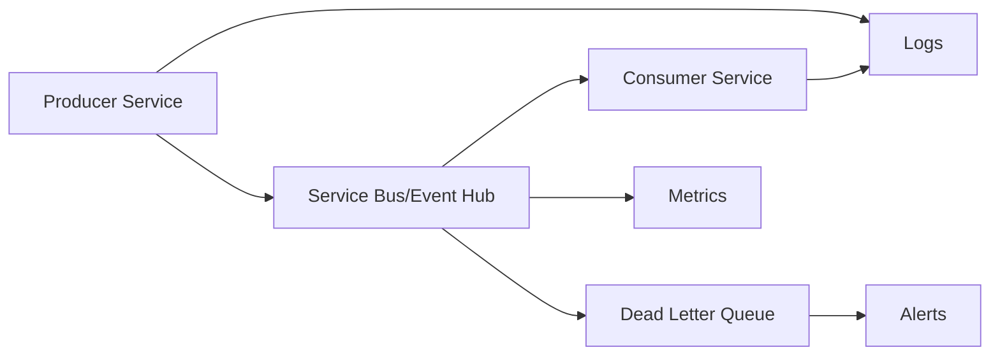
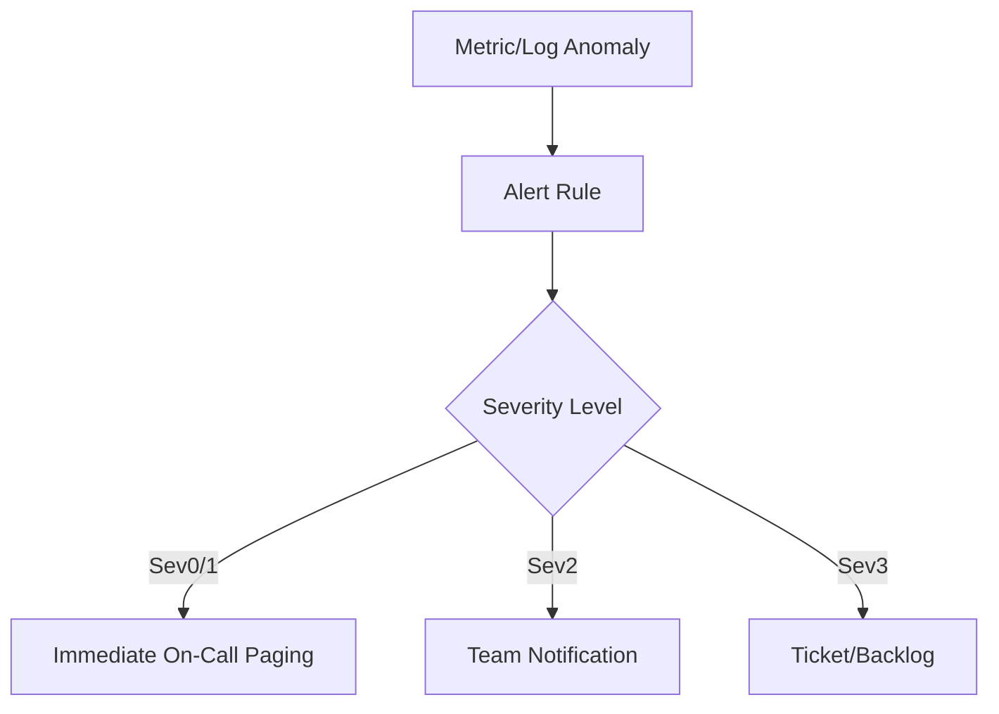

# How Would You Implement Observability in Azure?
## Detailed Interview Preparation Guide with Flow Charts

---

## 1) Direct Interview Answer

To implement observability in Azure, build a unified telemetry architecture for **metrics, logs, and traces** across all layers (edge, API, app, data, messaging, security), then use centralized monitoring, correlation IDs, dashboards, alerts, and automated incident workflows.

Core implementation:

1. Instrument applications and services
2. Collect platform/resource telemetry
3. Centralize data in Azure monitoring stack
4. Correlate telemetry end-to-end
5. Create actionable dashboards and SLOs
6. Configure alerting and on-call workflows
7. Continuously tune signal quality and cost

> One-liner: *Azure observability = end-to-end metrics, logs, and traces with correlation, alerting, and operational response automation.*

---

## 2) Observability vs Monitoring (Interview Differentiator)

- **Monitoring** tells you *what is failing*.
- **Observability** helps you understand *why it is failing* and *where* across distributed systems.

Observability requires:
- High-quality telemetry
- Correlation across components
- Fast root-cause workflows
- Operational feedback loops

---

## 3) Azure Observability Reference Architecture

---

## 4) Three Pillars Implementation

## 4.1 Metrics
Numeric time-series signals:
- CPU, memory, RPS, latency, errors, queue depth, DTU/RU usage

Use for:
- Alerting
- Capacity planning
- SLO tracking

## 4.2 Logs
Structured event records:
- Application logs
- Audit/security logs
- Platform diagnostic logs

Use for:
- Root cause analysis
- Forensics
- Compliance

## 4.3 Traces
Distributed request journey:
- End-to-end transaction path across microservices/dependencies

Use for:
- Bottleneck detection
- Dependency latency breakdown
- Causal debugging

---

## 5) End-to-End Telemetry Flow

---

## 6) Step-by-Step Azure Observability Implementation

## Step 1: Define Observability Objectives
- Critical user journeys
- SLOs/SLIs (availability, latency, error budgets)
- MTTD/MTTR goals
- Compliance/audit requirements

## Step 2: Instrument Application Code
- Add structured logging
- Add distributed tracing
- Capture dependency telemetry
- Track business events (orders, payments, sign-ins)

## Step 3: Enable Azure Resource Diagnostics
- APIM logs
- App Service/AKS diagnostics
- SQL/Cosmos diagnostics
- Service Bus/Event Hubs metrics/logs
- Key Vault and identity audit logs

## Step 4: Centralize in Log Analytics Workspace
- Standardize workspace strategy (per env or per domain)
- Apply retention and access controls
- Normalize schema conventions

## Step 5: Correlate Everything
- Propagate correlation IDs
- Use operation/request IDs
- Ensure logs include service/version/env metadata

## Step 6: Build Dashboards/Workbooks
- Executive SLA view
- Service health view
- Dependency view
- Security/anomaly view

## Step 7: Configure Alerting + Incident Automation
- Multi-signal alerts
- Dynamic thresholds where useful
- Action groups (email/Teams/Pager/ITSM/webhook)
- Runbooks/automation for first response

## Step 8: Review and Tune
- Remove noisy alerts
- Improve detection coverage
- Optimize ingestion cost

---

## 7) Golden Signals and SRE Metrics

Track per service:

1. **Latency** (p50/p95/p99)
2. **Traffic** (RPS, throughput)
3. **Errors** (4xx/5xx, exceptions)
4. **Saturation** (CPU, memory, thread pool, queue lag)

---

## 8) Logging Best Practices

Use structured, query-friendly logs (JSON-like fields), not unstructured text dumps.

Include:
- Timestamp
- Severity
- Service name
- Environment
- Correlation ID
- User/tenant/context IDs (non-sensitive)
- Operation name
- Error code/classification

Avoid:
- Secrets/PII leakage in logs
- Excessive debug logs in production
- Inconsistent log schemas across services

---

## 9) Distributed Tracing Implementation

Distributed tracing should show full request path:
- Entry gateway -> service A -> service B -> database -> external API

Every span should be linked for full causality.

---

## 10) Azure-Native Components to Use

- **Azure Monitor**: platform metrics, alerts, workbooks
- **Application Insights**: APM, request/dependency tracing, failures
- **Log Analytics Workspace**: centralized query and analytics
- **Diagnostic Settings**: route resource logs/metrics
- **Azure Alerts + Action Groups**: notifications and incident hooks
- **Microsoft Sentinel** (if security operations integration needed)

---

## 11) Observability for Asynchronous Systems

For queues/events:
- Queue depth
- Oldest message age
- Consumer lag
- Dead-letter count
- Processing success/failure rate
- End-to-end processing latency

---

## 12) Alerting Strategy (Actionable, Not Noisy)

Design principles:
- Alert on symptoms + impact, not every event
- Tie alerts to SLO breaches and critical dependency failures
- Use severity levels and routing policies
- Deduplicate and suppress alert storms
- Include runbook links in alert payload

---

## 13) Security and Compliance Observability

Capture and monitor:
- Authentication/authorization failures
- Privileged access changes
- Key Vault access anomalies
- WAF blocks and suspicious traffic
- Data access anomalies
- Policy non-compliance events

Security telemetry should integrate with SOC workflows.

---

## 14) Cost Governance for Observability

Observability can become expensive without controls.

Manage by:
- Log sampling and filtering
- Ingestion caps where appropriate
- Retention tiering
- Archival strategy
- Reducing duplicate telemetry
- Separating high-cardinality debug signals from standard telemetry

---

## 15) Operational Runbooks and Incident Workflow

For each critical alert:
- Known symptoms
- Triage query links
- Likely root causes
- Immediate mitigation actions
- Escalation path
- Recovery validation steps
- Post-incident review template

Observability is complete only when connected to response actions.

---

## 16) Maturity Model (Interview Bonus)

Level 1: Basic infra metrics and static alerts  
Level 2: Centralized logs and dashboards  
Level 3: Distributed tracing and correlation IDs  
Level 4: SLO-driven alerting and automated remediation  
Level 5: Predictive insights, chaos testing, continuous reliability engineering

---

## 17) Common Mistakes (Interview Gold)

1. Treating logs as observability (ignoring traces/metrics)  
2. No correlation IDs across services  
3. Alert fatigue from noisy thresholds  
4. Missing business KPI telemetry  
5. No visibility into async pipelines/queues  
6. Logging sensitive data  
7. No runbooks linked to alerts  
8. Not measuring MTTR improvements over time  

---

## 18) Interview Q&A (Strong Answers)

### Q1: What are the pillars of observability?
**Answer:** Metrics, logs, and traces correlated end-to-end.

### Q2: Why are correlation IDs important?
**Answer:** They connect events across distributed services, enabling fast root-cause analysis.

### Q3: What should alerts be based on?
**Answer:** User impact and SLOs, not just raw infrastructure events.

### Q4: How do you monitor queue-based systems?
**Answer:** Track queue depth, lag/age, dead-letter volume, and consumer success/failure rates.

### Q5: How do you reduce observability noise?
**Answer:** Structured logging, severity discipline, deduplication, dynamic thresholds, and tuned routing.

### Q6: Which Azure services are core for observability?
**Answer:** Azure Monitor, Application Insights, Log Analytics, Alerts/Action Groups, and optionally Sentinel.

---

## 19) 60-Second Interview Pitch

> I implement observability in Azure by instrumenting applications and enabling diagnostics across all platform services, then centralizing metrics, logs, and traces in Azure Monitor, Application Insights, and Log Analytics. I propagate correlation IDs end-to-end so every request can be traced across APIs, services, queues, and databases. I define SLOs and build dashboards for latency, traffic, errors, and saturation, plus business KPIs. Alerts are tuned for user impact and routed via action groups with runbooks for rapid triage. I continuously reduce noise, improve telemetry quality, and optimize retention/ingestion cost—so observability directly improves reliability and MTTR.

---

## 20) One-Line Conclusion

> Implement Azure observability by unifying metrics, logs, and traces with correlation-driven insights, SLO-based alerting, and operational runbooks for rapid incident response.