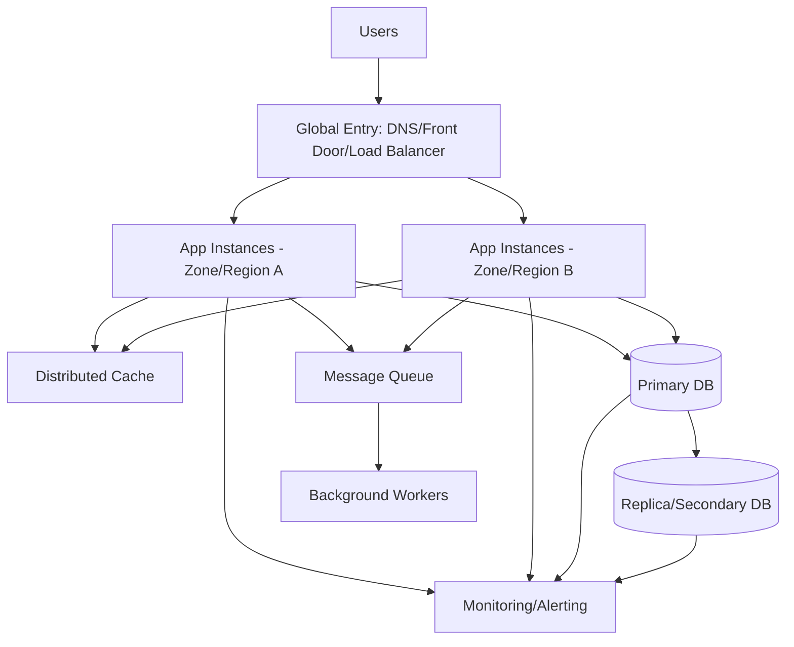
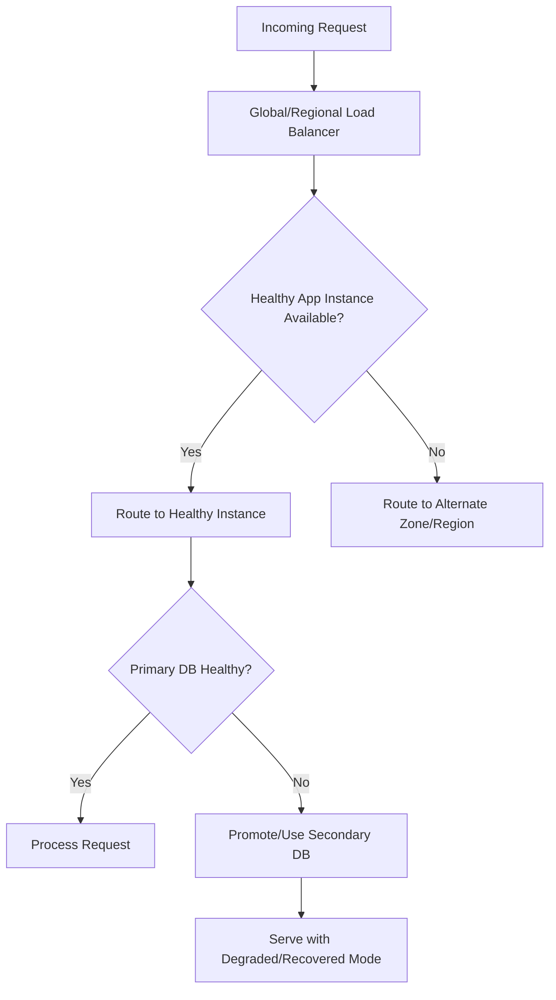
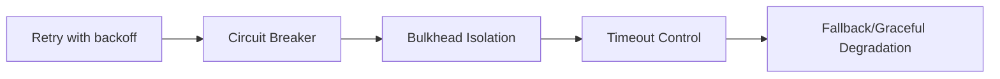
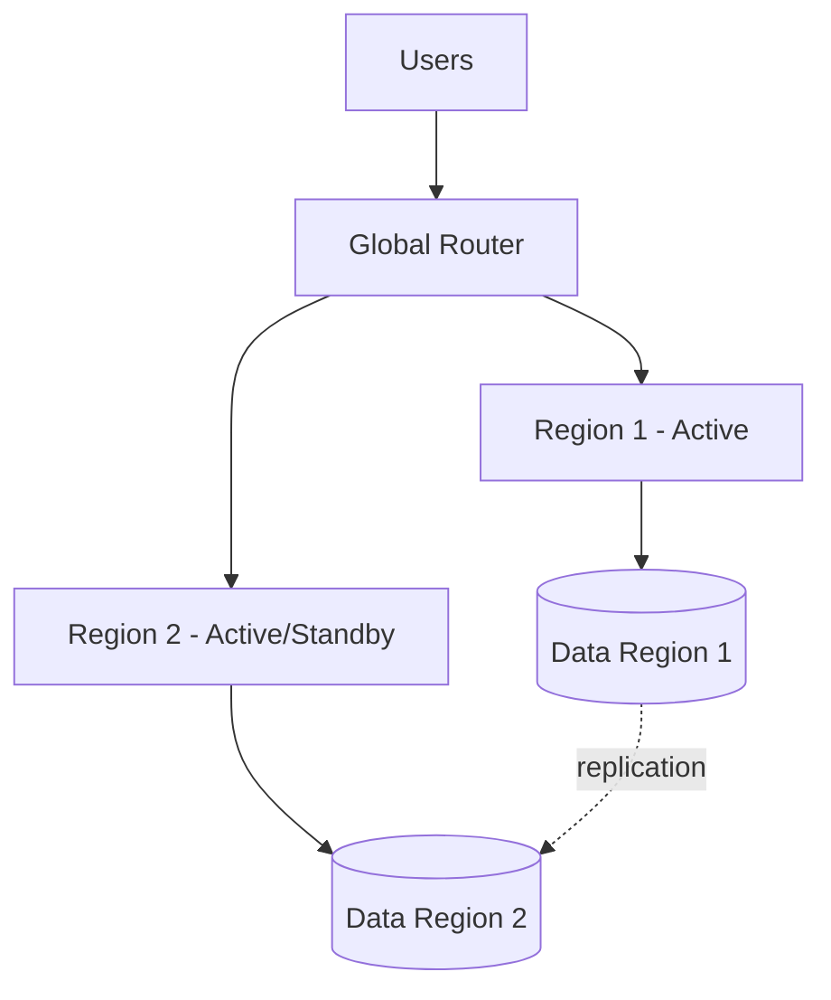
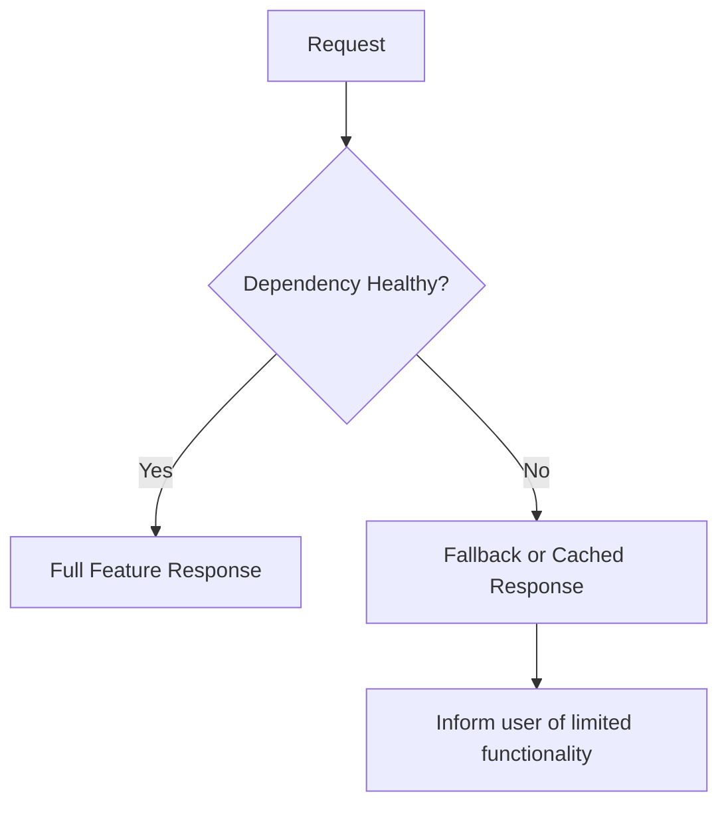
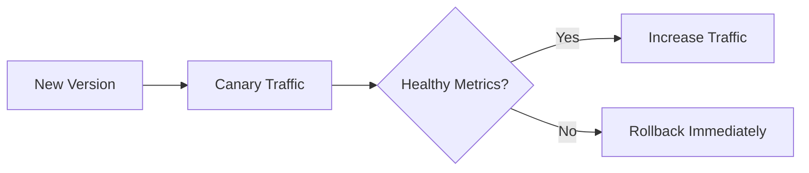

# How Would You Make an Application Highly Available?
## Detailed Interview Preparation Guide with Flow Charts

---

## 1) Direct Interview Answer

To make an application highly available, design for **no single point of failure** across every layer:

1. Redundant instances of each component  
2. Health checks and automatic failover  
3. Multi-zone and/or multi-region deployment  
4. Stateless application tier with autoscaling  
5. Resilient data strategy (replication + backups + failover)  
6. Asynchronous decoupling for fault isolation  
7. Strong observability and incident automation  
8. Tested disaster recovery runbooks

> One-liner: *High availability is achieved by combining redundancy, failover, fault isolation, and recovery automation across compute, network, and data layers.*

---

## 2) HA Fundamentals Interviewers Expect

- **Availability target (SLA/SLO):** e.g., 99.9, 99.95, 99.99+
- **RTO (Recovery Time Objective):** max acceptable downtime
- **RPO (Recovery Point Objective):** max acceptable data loss window
- **Fault domain isolation:** zone/region failures should not take down entire app
- **Graceful degradation:** app should still partially function during dependency failures

---

## 3) High-Level HA Architecture

---

## 4) End-to-End Availability Flow

---

## 5) Layer-by-Layer HA Design

## 5.1 Entry Layer (Traffic Distribution)
Use:
- Global routing service (latency/priority/health-based)
- Regional load balancers
- Health probes and automatic endpoint failover

Goal:
- If one app node/zone/region fails, traffic reroutes automatically.

## 5.2 Application Layer (Compute)
Use:
- Multiple stateless instances
- Autoscaling
- Multi-zone deployment
- Rolling/blue-green/canary deployments

Goal:
- Instance or node failure does not cause downtime.

## 5.3 Data Layer (Most Critical)
Use:
- Built-in replication features
- Automatic/manual failover strategy
- Backup + point-in-time restore
- Read replicas for scale and resilience

Goal:
- Prevent database from being single point of failure.

## 5.4 Integration Layer
Use:
- Durable queues/topics
- Retry and dead-letter handling
- Idempotent consumers

Goal:
- Temporary dependency outages don’t break end-user requests immediately.

---

## 6) Availability Patterns You Should Mention

- **Retry with exponential backoff** for transient faults  
- **Circuit breaker** to stop hammering failing services  
- **Bulkhead isolation** to contain blast radius  
- **Timeouts** on all remote calls  
- **Fallback responses** (cached/default/partial data)

---

## 7) Multi-Zone vs Multi-Region (Interview-Strong Distinction)

## Multi-Zone HA
- Protects against data center-level failures in one region
- Lower latency and simpler than multi-region

## Multi-Region HA/DR
- Protects against full regional outage
- Better global latency + stronger DR posture
- More complex data consistency and operations

---

## 8) Statelessness and Session Strategy

To scale and failover safely:
- Keep app instances stateless
- Store session/state in distributed store (cache/db), not local memory
- Avoid sticky sessions unless truly required

This allows any healthy instance to serve any user request.

---

## 9) Database Availability Strategy

Key points:
1. Use managed DB with HA capabilities
2. Enable replication/failover groups where applicable
3. Separate read and write workloads if needed
4. Test failover regularly
5. Monitor replication lag and failover readiness

Interview phrase:
> App HA is limited by data tier HA—database strategy is the foundation.

---

## 10) Graceful Degradation Design

When dependencies fail, app should still provide partial value.

Examples:
- Serve cached catalog if recommendation service is down
- Accept orders but delay confirmation email
- Temporarily disable non-critical features

---

## 11) Deployment Safety and HA

Bad deployments are a major outage source.

Use:
- Blue-green or canary release
- Automated health checks
- Progressive traffic shift
- Instant rollback on SLO breach

---

## 12) Monitoring, Alerting, and Incident Response

Track:
- Uptime and availability %
- Error rates (5xx)
- Latency (p95/p99)
- Saturation (CPU, memory, threads, connections)
- Queue depth and processing lag
- DB failover/replication metrics
- Health probe failures

Alerting should be actionable with runbooks.

---

## 13) DR Planning (RTO/RPO Driven)

Define:
- Business-critical services
- RTO and RPO per service
- Failover decision criteria
- Data recovery approach
- Communication protocol during incidents

Test with game days and failover drills.

---

## 14) Security and Availability Together

Security controls improve availability too:
- DDoS/WAF protections reduce downtime risk
- Rate limiting prevents resource exhaustion
- Identity controls reduce malicious misuse
- Secret rotation and secure access prevent compromise-driven outages

---

## 15) Common HA Anti-Patterns (Interview Gold)

1. Single instance or single zone deployment  
2. “HA app” with single database and no failover  
3. No health probes or broken probes  
4. Stateful app servers with in-memory sessions  
5. No timeout/retry strategy  
6. Retry storms without circuit breakers  
7. No failover drills  
8. No observability or unclear ownership during incidents  

---

## 16) Practical HA Checklist

- [ ] No single point of failure in any layer  
- [ ] Multiple app instances across zones  
- [ ] Health probes + auto failover configured  
- [ ] Data layer replication/failover implemented  
- [ ] Backups + restore tested  
- [ ] Queue-based decoupling for async workloads  
- [ ] Resilience patterns (retry/circuit/timeout/bulkhead) applied  
- [ ] Multi-region strategy aligned to business criticality  
- [ ] SLO-based monitoring and alerting active  
- [ ] Runbooks and incident drills validated  

---

## 17) Interview Q&A (Strong Answers)

### Q1: What is the first step to make an app highly available?
**Answer:** Eliminate single points of failure with redundant instances and health-based failover.

### Q2: Is autoscaling enough for HA?
**Answer:** No. Autoscaling helps capacity, but HA also requires redundancy, failover, resilient data, and recovery planning.

### Q3: Why is stateless design important?
**Answer:** It allows any instance to serve traffic, enabling seamless failover and horizontal scaling.

### Q4: What is the biggest HA risk in most systems?
**Answer:** The data layer becoming a single point of failure.

### Q5: Multi-zone or multi-region—which should I choose?
**Answer:** Multi-zone for regional datacenter resilience; multi-region for region outage protection and global requirements.

### Q6: How do you validate HA design?
**Answer:** Through failover drills, load tests, chaos/fault injection exercises, and measured RTO/RPO performance.

---

## 18) 60-Second Interview Pitch

> I make an application highly available by designing every layer for redundancy and failover. I start with health-based traffic routing and deploy stateless app instances across multiple zones, with autoscaling for demand spikes. I remove data-tier single points of failure using replication, failover strategy, and tested backups. I decouple non-critical processing through queues and implement resilience patterns like retries with backoff, circuit breakers, and timeouts to prevent cascading failures. I add strong observability with SLO-driven alerts and run regular failover drills to validate RTO/RPO targets. For business-critical workloads, I extend the design to multi-region for disaster resilience.

---

## 19) One-Line Conclusion

> Build high availability by combining redundancy, fault isolation, automatic failover, resilient data architecture, and continuously tested recovery operations.