# Access Tokens vs Refresh Tokens
## Detailed OAuth 2.0 / OpenID Connect Interview Preparation Guide

---

## 1) Direct Interview Answer

An **access token** is a short-lived credential used by a client application to access a protected API or resource.

A **refresh token** is a longer-lived credential used by the client to request a new access token when the current access token expires, without requiring the user to sign in again.

> One-liner: **Access tokens call APIs; refresh tokens obtain new access tokens.**

---

## 2) Why Are Two Token Types Used?

Using separate access and refresh tokens provides a balance between:

- Security
- User experience
- Token lifetime management
- Reduced repeated user authentication

The access token is intentionally short-lived. If it is stolen, the attacker has a limited window to use it.

The refresh token is kept more securely and used only with the authorization server to obtain new access tokens.

---

## 3) High-Level Token Flow

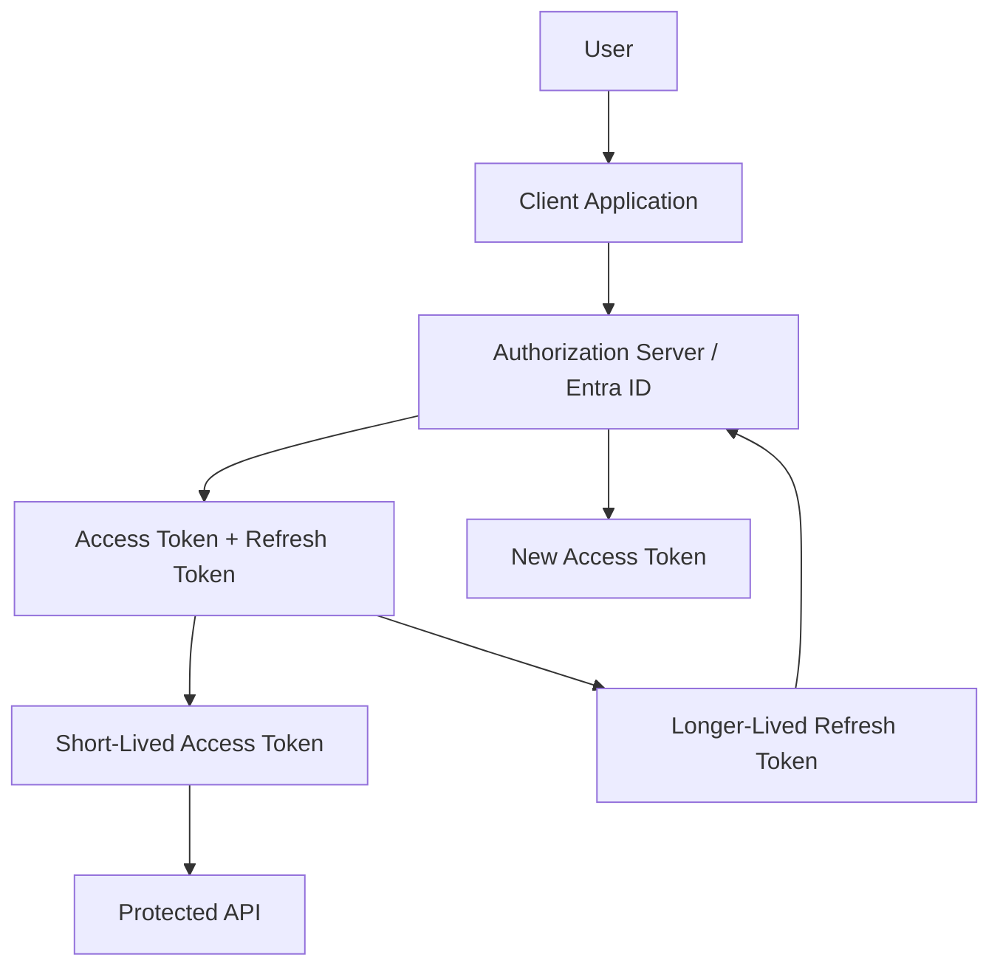

---

## 4) Access Token

An access token represents permission to access a protected resource.

It is sent by the client to an API, usually in the HTTP Authorization header:

```http
Authorization: Bearer <access-token>
```

### Common Uses

- Calling Web APIs
- Accessing Azure resources
- Calling downstream services
- Authorizing specific scopes or application roles

### Typical Properties

- Short-lived
- Audience-specific
- Scope- or role-based
- May be a JWT or an opaque token
- Should be sent only to the intended resource server

---

## 5) Refresh Token

A refresh token is used to obtain a new access token after the access token expires.

It is normally sent to the authorization server's token endpoint and not to the API.

### Common Uses

- Maintaining user sessions
- Avoiding repeated login prompts
- Renewing access tokens
- Supporting long-running applications

### Typical Properties

- Longer-lived than access tokens
- More sensitive than access tokens
- Intended for the authorization server
- Usually not sent to application APIs
- May be rotated or revoked by the authorization server

---

## 6) Complete Access and Refresh Token Flow

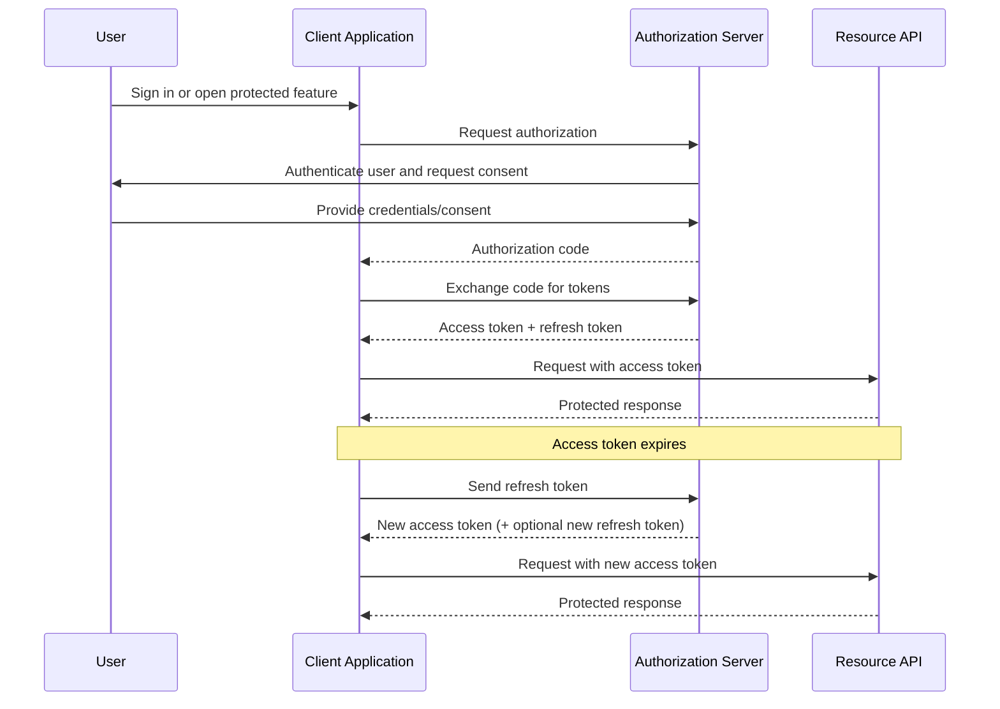

---

## 7) Access Token Request to an API

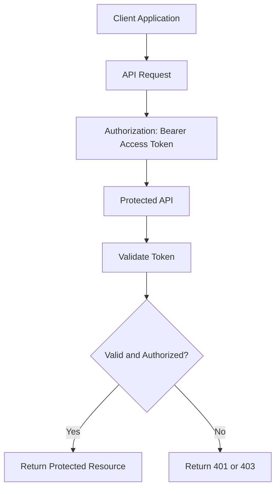

The API should validate:

- Signature
- Issuer
- Audience
- Expiration
- Not-before time
- Required scopes or roles

---

## 8) Refresh Flow After Access Token Expiration

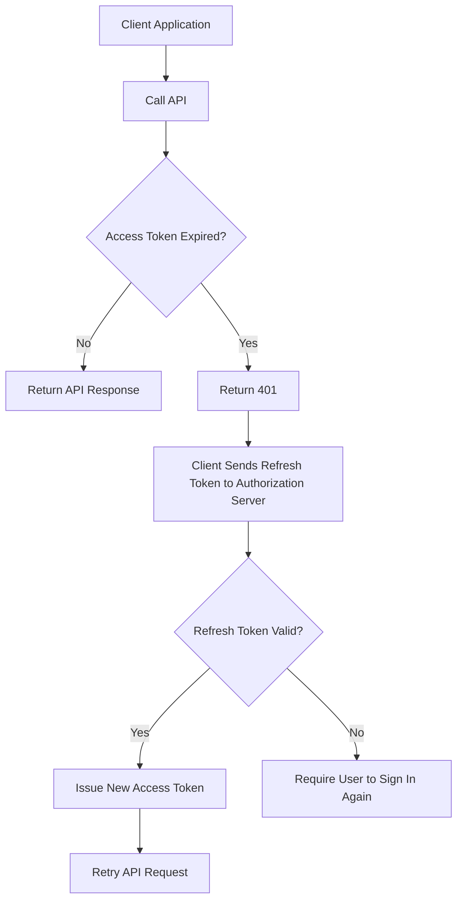

---

## 9) Important Differences

| Feature | Access Token | Refresh Token |
|---|---|---|
| Main purpose | Access protected APIs | Obtain a new access token |
| Sent to | Resource API | Authorization server |
| Lifetime | Short-lived | Longer-lived |
| Contains permissions | Usually scopes/roles | Usually represents renewal authorization |
| Audience | Specific API/resource | Authorization server |
| Exposure risk | High, but limited by short lifetime | Very high because it can create new access tokens |
| Should API receive it? | Yes, when calling the API | No |
| Usually a JWT? | Often, but not always | Often opaque, but implementation-dependent |
| Revocation importance | Important | Extremely important |
| Typical failure | 401 when expired | Re-login required if invalid/revoked |

---

## 10) Access Token Lifetime

Access tokens are generally short-lived to reduce the impact of theft.

If an attacker obtains an access token:

- The token may be used until it expires
- The API must still validate its signature and claims
- The token should be limited to the correct audience and permissions
- The API may apply additional authorization and rate-limit checks

Short lifetime does not eliminate risk, but it limits the exposure window.

---

## 11) Refresh Token Lifetime and Rotation

Refresh tokens usually have a longer lifetime, but their validity can depend on:

- Authorization server policy
- User sign-out
- Password changes
- Consent changes
- Conditional Access policies
- Administrative revocation
- Inactivity
- Refresh token rotation rules

With refresh token rotation, the authorization server issues a new refresh token whenever the old one is used.

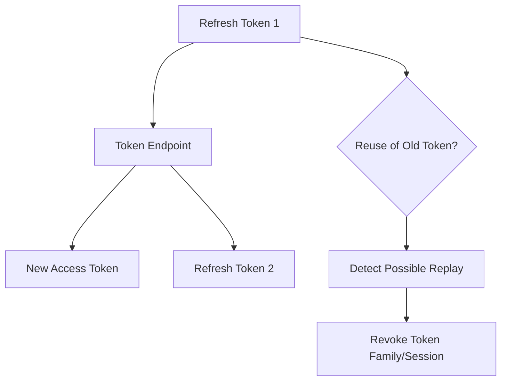

Rotation helps detect reuse of a stolen refresh token.

---

## 12) What Happens When a Refresh Token Is Invalid?

If the refresh token is expired, revoked, malformed, or rejected:

1. The authorization server rejects the token request
2. The client cannot obtain a new access token
3. The client clears the session if appropriate
4. The user must authenticate again

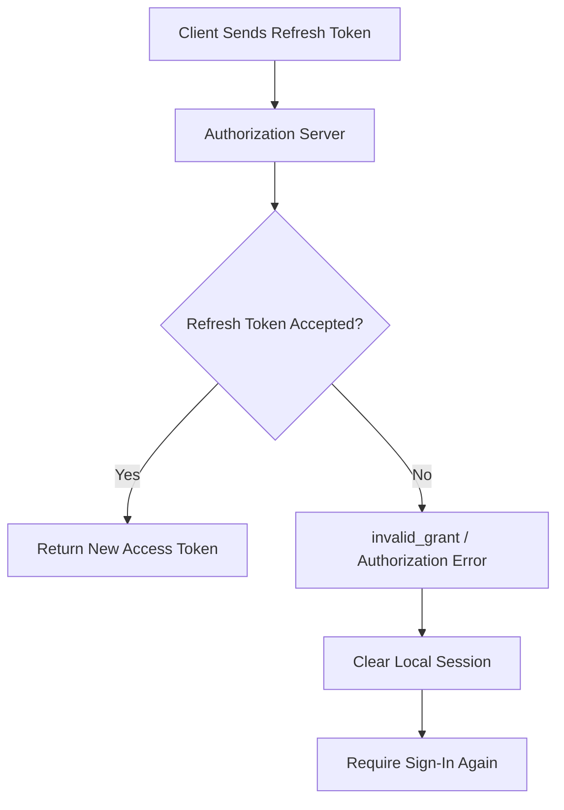

---

## 13) Access Token vs ID Token

Access tokens and ID tokens have different purposes.

| Token | Intended Consumer | Purpose |
|---|---|---|
| Access token | API/resource server | Authorize API access |
| ID token | Client application | Represent authenticated user identity |
| Refresh token | Authorization server | Obtain new access tokens |

### Important Interview Point

Do not use an ID token to call an API.

The API should receive and validate an **access token** whose audience is the API.

---

## 14) Where Should Tokens Be Stored?

The storage approach depends on the client type.

## 14.1 Server-Side Web Application

A server-side application can:

- Keep tokens on the server
- Store session identifiers in secure cookies
- Use encrypted server-side token storage
- Avoid exposing refresh tokens to the browser

## 14.2 Single-Page Application

A SPA must carefully protect tokens from:

- Cross-site scripting
- Malicious browser extensions
- Accidental logging
- Insecure browser storage

Avoid casually storing sensitive long-lived tokens in persistent browser storage.

## 14.3 Mobile Application

Use platform-provided secure storage, such as:

- iOS Keychain
- Android Keystore
- Secure credential storage provided by the platform

---

## 15) Secure Token Handling

### Access Token Best Practices

- Send only over HTTPS
- Use only with the intended API
- Keep lifetime short
- Request least-privilege scopes
- Do not write tokens to logs
- Do not place tokens in URLs
- Do not expose tokens unnecessarily to third parties

### Refresh Token Best Practices

- Store more securely than access tokens
- Never send to an API
- Use refresh token rotation where available
- Revoke after logout or compromise
- Protect against token theft and replay
- Avoid unnecessary persistent storage
- Monitor unusual refresh activity

---

## 16) Token Validation at the API

The API should not blindly trust a token simply because it was issued by an identity provider.

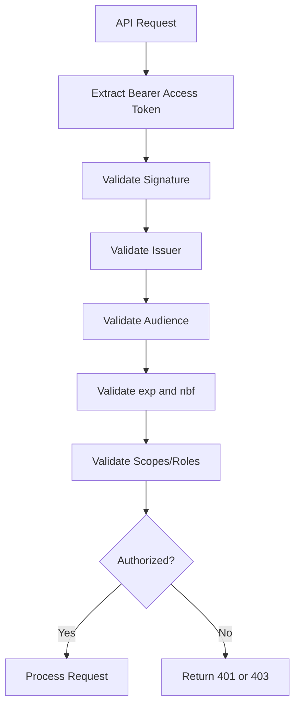

### Common Results

- **401 Unauthorized**: token is missing, invalid, expired, or untrusted
- **403 Forbidden**: token is valid but lacks the required scope or role

---

## 17) Token Renewal Flow in a Web Application

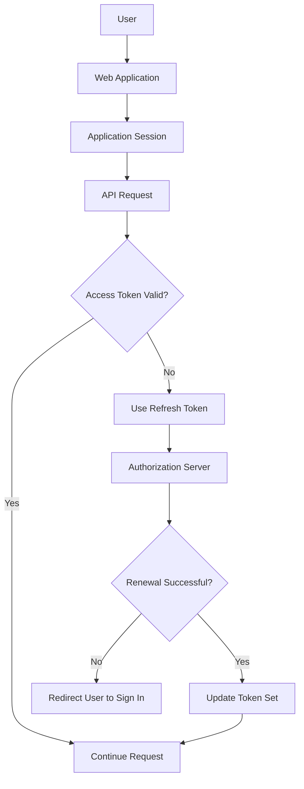

---

## 18) OAuth 2.0 Authorization Code Flow Example

The authorization server may return a token response similar to:

```json
{
  "token_type": "Bearer",
  "expires_in": 3600,
  "access_token": "eyJ...",
  "refresh_token": "def..."
}
```

The client uses the access token as follows:

```http
GET /orders
Host: api.example.com
Authorization: Bearer eyJ...
```

When the access token expires, the client sends the refresh token to the authorization server:

```http
POST /oauth2/token
Content-Type: application/x-www-form-urlencoded

grant_type=refresh_token&
refresh_token=def...&
client_id=client-id
```

The exact parameters depend on the identity provider and client type.

---

## 19) When Are Refresh Tokens Issued?

Refresh token issuance depends on:

- OAuth flow
- Client type
- Identity provider
- Requested scopes
- Offline access configuration
- Organization security policy
- Consent settings

A refresh token is not automatically guaranteed in every OAuth request.

For OIDC-style scenarios, applications may request appropriate offline access behavior according to the identity provider's requirements.

---

## 20) Machine-to-Machine Authentication

In client credentials flow, there is usually no end user.

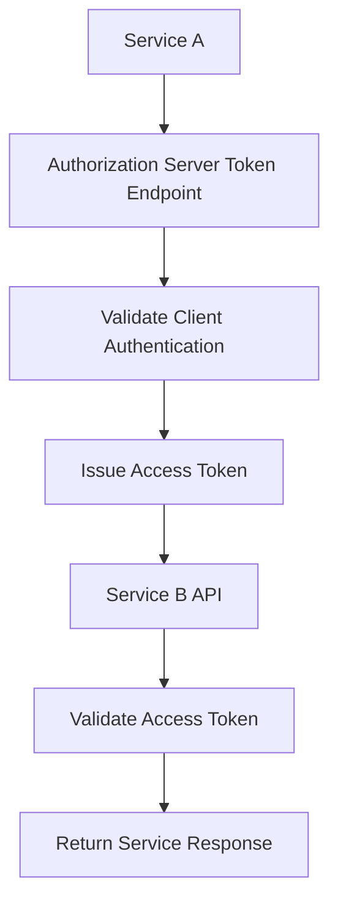

In many service-to-service scenarios:

- An access token is issued
- No refresh token is needed
- The service requests another access token when the current one expires

> Interview point: **Refresh tokens are primarily useful for user-delegated sessions; machine-to-machine clients can usually request new access tokens directly.**

---

## 21) Common Security Threats

## 21.1 Access Token Theft

Possible consequences:

- Attacker can call the API until token expiry
- Impact depends on token scope and audience

Mitigations:

- HTTPS
- Short token lifetime
- Secure storage
- Least-privilege scopes
- API monitoring

## 21.2 Refresh Token Theft

Possible consequences:

- Attacker may continuously obtain new access tokens
- User session may remain compromised for longer

Mitigations:

- Secure storage
- Rotation
- Replay detection
- Revocation
- Session monitoring
- Reauthentication for sensitive operations

## 21.3 Token Leakage Through Logs

Never log:

- Access tokens
- Refresh tokens
- Authorization headers
- Client secrets

Instead, log safe metadata such as:

- Correlation ID
- Client/application identifier
- Request timestamp
- Token validation result
- Anonymized subject identifier where appropriate

---

## 22) Common Interview Questions and Answers

### Q1: What is an access token?

**Answer:** An access token is a credential issued by an authorization server and presented to a protected API to authorize access to specific resources or operations.

### Q2: What is a refresh token?

**Answer:** A refresh token is a credential used by a client to request a new access token after the current access token expires, without requiring the user to sign in again.

### Q3: Which token is sent to the API?

**Answer:** The access token is sent to the API in the `Authorization: Bearer` header. A refresh token should not be sent to the API.

### Q4: Why are access tokens short-lived?

**Answer:** To reduce the damage if an access token is stolen. The attacker has a limited period in which the token can be used.

### Q5: Why are refresh tokens sensitive?

**Answer:** A refresh token can be exchanged for new access tokens, so theft can result in a longer-lived session compromise.

### Q6: Does every application receive a refresh token?

**Answer:** No. Issuance depends on the OAuth flow, client type, identity provider, scopes, and policy configuration.

### Q7: Does a client credentials flow normally use refresh tokens?

**Answer:** Usually not. A service can request a new access token directly when the current one expires.

### Q8: What happens when the access token expires?

**Answer:** The client uses a valid refresh token to request a new access token. If the refresh token is invalid or revoked, the user must authenticate again or the client must reauthorize.

### Q9: Can an ID token be used to call an API?

**Answer:** No. An ID token is intended for the client application to understand the authenticated identity. APIs should validate access tokens issued for the API.

### Q10: What is refresh token rotation?

**Answer:** Refresh token rotation replaces the refresh token after use. If an old refresh token is reused, the authorization server can detect possible replay and revoke the token family or session.

---

## 23) Interview Scenario: User Calls an API

### Scenario

A user signs into an application and opens an orders page.

### Flow

1. The client redirects the user to the identity provider
2. The user authenticates
3. The client receives an authorization code
4. The client exchanges the code for an access token and possibly a refresh token
5. The client calls the orders API with the access token
6. The API validates the token and required scope
7. The access token expires
8. The client uses the refresh token
9. The authorization server issues a new access token
10. The client retries the API request

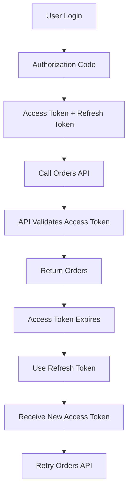

---

## 24) Recommended Security Architecture

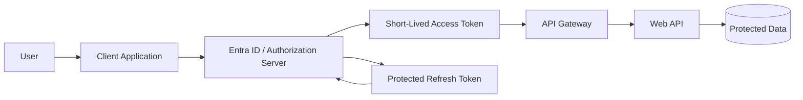

Recommended controls:

- Authorization Code Flow with PKCE
- Short-lived access tokens
- Secure refresh token storage
- Strict token validation
- Least-privilege scopes and roles
- Refresh token rotation where supported
- Monitoring and revocation procedures

---

## 25) 60-Second Interview Pitch

> An access token is a short-lived credential used to call a protected API. The API validates its signature, issuer, audience, expiration, and scopes or roles before granting access. A refresh token is a longer-lived credential used only with the authorization server to obtain a new access token after expiration, so the user does not need to sign in again. Access tokens should be short-lived and sent only to the intended API, while refresh tokens must be stored with stronger protection because they can create new access tokens. For modern applications, I use Authorization Code Flow with PKCE, secure token storage, least-privilege scopes, refresh token rotation, and monitoring for replay or theft.

---

## 26) Final Revision Checklist

- [ ] Access token calls the API  
- [ ] Refresh token requests a new access token  
- [ ] Access tokens should be short-lived  
- [ ] Refresh tokens require stronger protection  
- [ ] Refresh tokens are sent to the authorization server, not the API  
- [ ] APIs validate access tokens independently  
- [ ] ID tokens are not API authorization tokens  
- [ ] Use least-privilege scopes and roles  
- [ ] Use Authorization Code Flow with PKCE  
- [ ] Use refresh token rotation where supported  
- [ ] Never log tokens or authorization headers  
- [ ] Revoke or rotate tokens after suspected compromise  

---

## One-Line Conclusion

> Access tokens provide short-lived API access, while refresh tokens securely obtain replacement access tokens without requiring repeated user authentication.