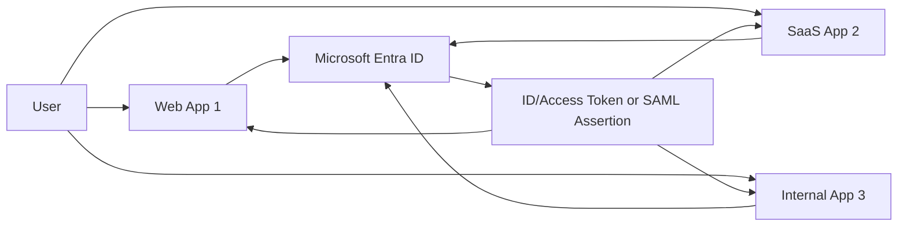
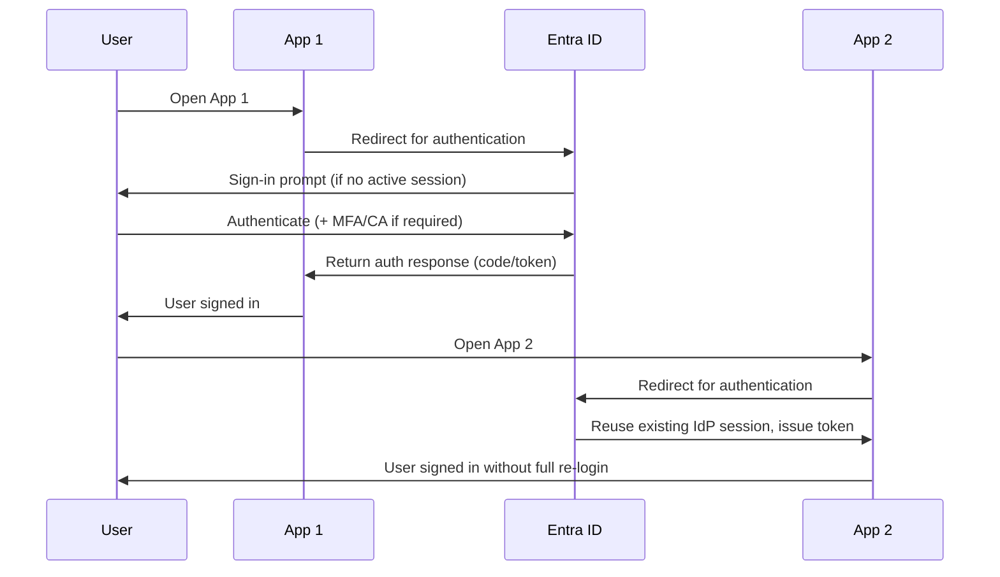
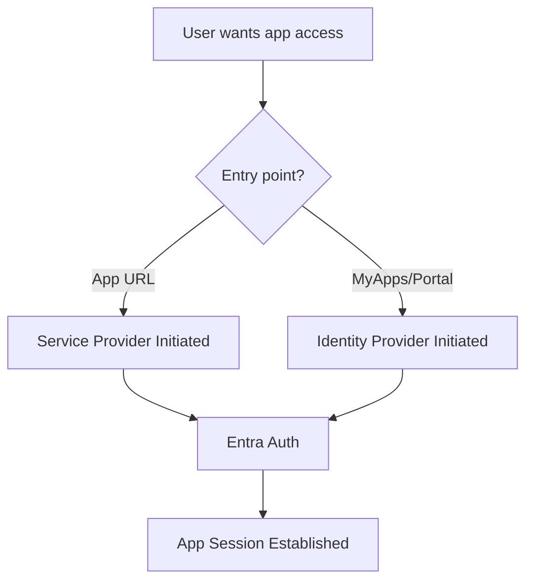
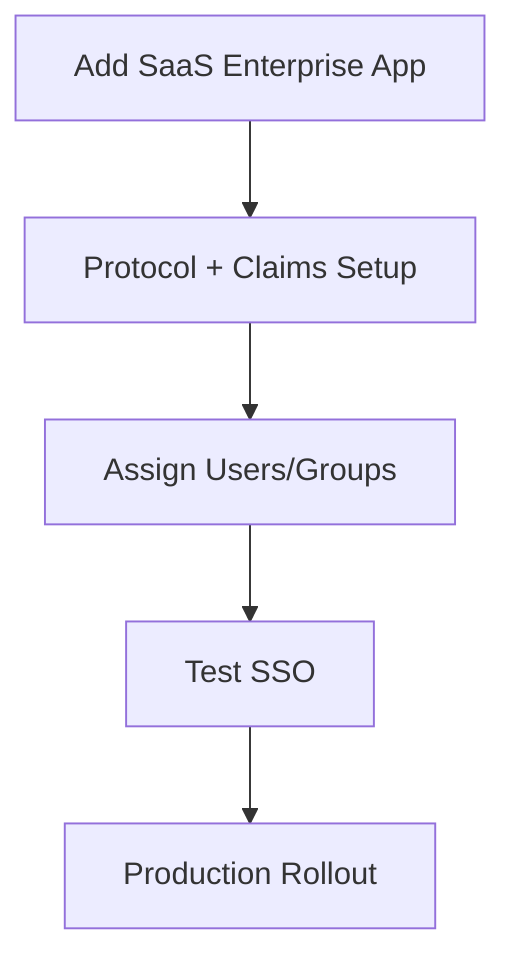
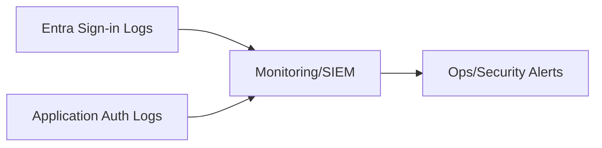

# How Do You Implement SSO in Azure?
## Detailed Interview Preparation Guide with Flow Charts

---

## 1) Direct Interview Answer

To implement SSO (Single Sign-On) in Azure, use **Microsoft Entra ID** as the central Identity Provider (IdP), integrate applications with standard protocols (OIDC/OAuth2/SAML), and enforce security policies (MFA, Conditional Access, token validation, least privilege).

High-level steps:

1. Register/integrate apps in Entra ID
2. Configure authentication protocol (OIDC/SAML)
3. Define app permissions, roles, and claims
4. Configure redirect URLs/trust metadata
5. Enable Conditional Access + MFA
6. Implement sign-in/sign-out flows and token validation
7. Monitor sign-in logs and secure session lifecycle

> One-liner: *Azure SSO is implemented by trusting Entra ID for centralized authentication so users sign in once and access multiple apps securely.*

---

## 2) What SSO Means in Practice

With SSO:
- User signs in once
- Identity session at IdP is reused
- Multiple enterprise apps can be accessed without repeated password prompts (subject to policy)

Without SSO:
- Separate credentials/sessions per app
- Poor user experience
- Higher password reset/load and security risk

---

## 3) High-Level Azure SSO Architecture

---

## 4) Core Protocol Choices

## 4.1 OpenID Connect (OIDC) / OAuth2
Best for modern web, SPA, mobile, and API ecosystems.

## 4.2 SAML 2.0
Common for many enterprise SaaS applications and legacy federation scenarios.

## 4.3 WS-Fed (legacy in some environments)
Used in specific older enterprise app patterns.

Interview phrase:
> Prefer OIDC/OAuth2 for modern app development; use SAML where SaaS/legacy integrations require it.

---

## 5) SSO Authentication Flow (OIDC Example)

---

## 6) Step-by-Step Implementation Blueprint

## Step 1: Establish Identity Authority
- Use Entra ID tenant as trusted IdP
- Confirm domain/user directory readiness

## Step 2: Integrate Applications
- For custom apps: App Registration in Entra ID
- For SaaS apps: Enterprise Application integration/gallery/manual setup

## Step 3: Configure Protocol Settings
- Redirect URIs / Reply URLs
- Identifier/entity ID (SAML/OIDC audience alignment)
- Certificates/metadata where required

## Step 4: Define Authorization Model
- App roles/groups/scopes
- Least-privilege access assignments
- User/group provisioning strategy

## Step 5: Enforce Security Controls
- Conditional Access policies
- MFA requirements
- Session controls and sign-in risk policies

## Step 6: Validate End-to-End Flows
- SP-initiated and IdP-initiated sign-in tests (as relevant)
- Sign-out behavior
- Token/assertion claim correctness

## Step 7: Monitor and Operate
- Sign-in logs
- Risk detections
- Access review and lifecycle governance

---

## 7) SP-Initiated vs IdP-Initiated SSO

- **SP-initiated**: user starts at app, gets redirected to Entra  
- **IdP-initiated**: user starts at Entra portal and launches app tile

---

## 8) Claims and Identity Data in SSO

Apps rely on claims for identity/authorization context:
- User identifier
- Name/email
- Group/role attributes
- Tenant context
- Custom claims (if configured)

Map claims carefully to app authorization logic.

---

## 9) Session and Token Lifecycle

SSO involves two layers:
1. **IdP session** (Entra login state)
2. **Application session** (local app cookie/session/token state)

If IdP session is active, new app sign-ins are seamless (policy permitting).

---

## 10) MFA + Conditional Access in SSO

SSO does **not** mean weaker security.  
Use Conditional Access to enforce:
- MFA for sensitive apps
- Device compliance requirements
- Location/risk-based controls
- Session restrictions

Interview phrase:
> SSO improves UX while Conditional Access preserves strong security posture.

---

## 11) SSO for SaaS Applications (Enterprise Apps)

Typical pattern:
- Add SaaS app in Enterprise Applications
- Configure SAML/OIDC trust
- Assign users/groups
- Configure claims/attributes
- Test sign-in
- Roll out in phases

---

## 12) SSO for Custom Web APIs + Apps

For modern internal architecture:
- Frontend app uses OIDC sign-in
- Gets access token for backend API
- API validates token and enforces scopes/roles
- Same Entra identity trust reused across app suite

---

## 13) Sign-Out in SSO (Often Missed in Interviews)

SSO logout design includes:
- Local app logout (clear app session/cookies)
- Optional global sign-out from Entra session
- Front-channel/back-channel logout behavior (app/protocol dependent)

Improper logout handling can leave residual sessions active.

---

## 14) Common SSO Deployment Models in Azure

1. Workforce SSO (employees to internal/SaaS apps)
2. B2B collaboration SSO (partner users via federation/invitation)
3. Multi-app enterprise portal SSO
4. Hybrid coexistence (legacy SAML + modern OIDC apps)

---

## 15) Monitoring and Troubleshooting

Monitor:
- Sign-in success/failure rates
- MFA and Conditional Access outcomes
- Token issuance failures
- Misconfigured redirect/reply URL errors
- Certificate expiry (SAML signing/encryption where applicable)

---

## 16) Common Mistakes (Interview Gold)

1. Confusing SSO with authorization design  
2. Misconfigured redirect URI / reply URL  
3. Missing token/audience validation in apps/APIs  
4. Over-permissive default app assignments  
5. Not planning logout/session invalidation behavior  
6. Ignoring certificate lifecycle in SAML integrations  
7. No phased rollout/testing for critical enterprise apps  

---

## 17) Security Best Practices Checklist

- [ ] Use OIDC/OAuth2 for modern apps; SAML where required  
- [ ] Enforce MFA and Conditional Access policies  
- [ ] Validate token/assertion issuer, audience, expiry, signature  
- [ ] Implement least-privilege app role/group assignments  
- [ ] Secure session cookie/token handling in apps  
- [ ] Monitor sign-in logs and risk events  
- [ ] Plan certificate rotation (for SAML setups)  
- [ ] Test sign-in/sign-out flows thoroughly  

---

## 18) Interview Q&A (Strong Answers)

### Q1: What is required to enable SSO in Azure?
**Answer:** A trusted Entra ID tenant, app integration (registration/enterprise app), protocol configuration (OIDC/SAML), and proper access/security policy setup.

### Q2: Is SSO only for Microsoft apps?
**Answer:** No. Entra SSO supports custom apps and many third-party SaaS apps via standards like OIDC and SAML.

### Q3: How does SSO improve security if users log in once?
**Answer:** Centralized identity controls, MFA, Conditional Access, and reduced password reuse/shadow credentials improve security overall.

### Q4: OIDC or SAML—how do you choose?
**Answer:** OIDC for modern app/API development; SAML for many enterprise SaaS/legacy integrations.

### Q5: What are common SSO issues?
**Answer:** Redirect/reply URL mismatches, claim mapping errors, certificate expiry, and missing token validation logic.

### Q6: Does SSO handle authorization automatically?
**Answer:** No. SSO authenticates identity; each app/API must still enforce authorization (roles/scopes/claims).

---

## 19) 60-Second Interview Pitch

> To implement SSO in Azure, I use Microsoft Entra ID as the centralized identity provider and integrate applications using OIDC/OAuth2 for modern apps or SAML for compatible SaaS/legacy apps. Users authenticate once with Entra, and that session is reused to issue tokens/assertions across multiple applications, reducing repeated logins. I configure app registrations/enterprise apps, redirect/reply URLs, claims, and user/group assignments, then enforce MFA and Conditional Access for strong security. Finally, I validate tokens in each app/API, implement proper sign-out behavior, and monitor sign-in telemetry for operational and security assurance.

---

## 20) One-Line Conclusion

> Implement Azure SSO by federating apps with Entra ID using OIDC/SAML, then enforce strong token validation, least-privilege authorization, and Conditional Access policies.