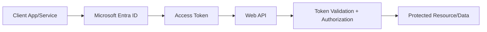
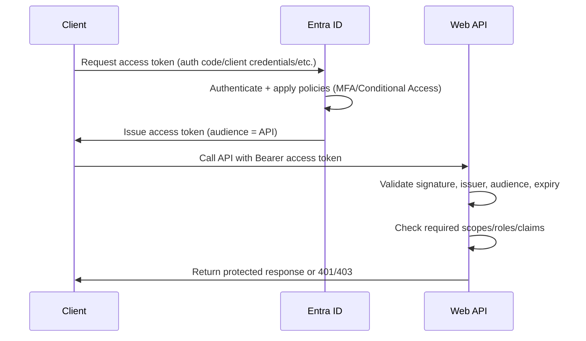
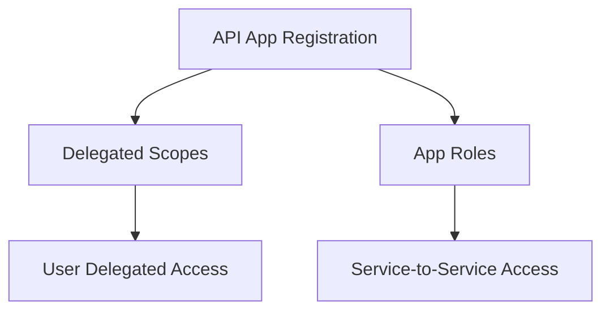
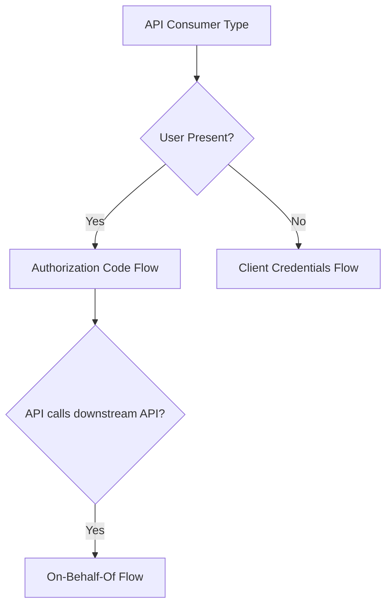
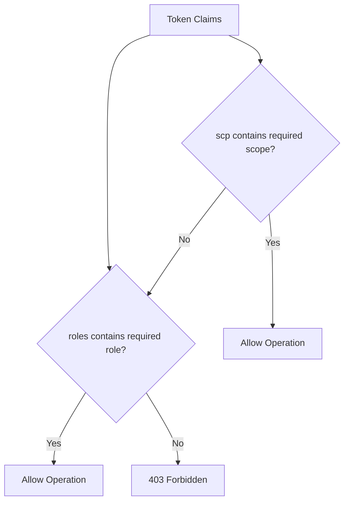
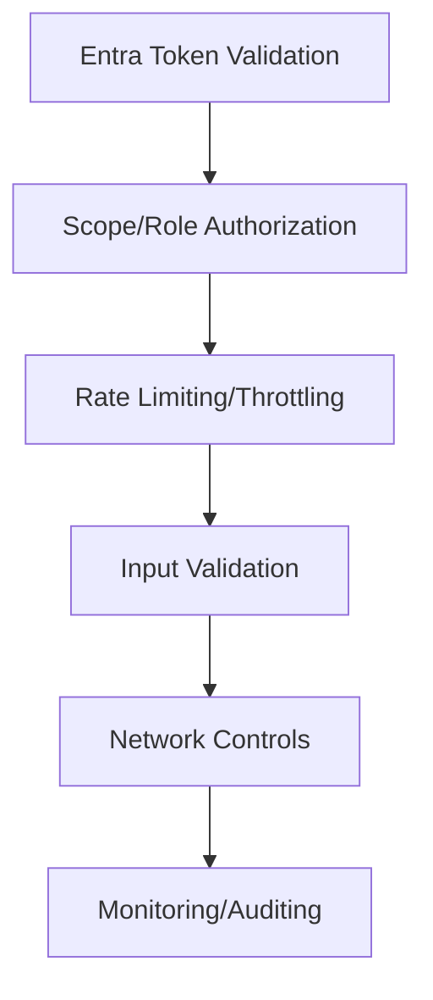
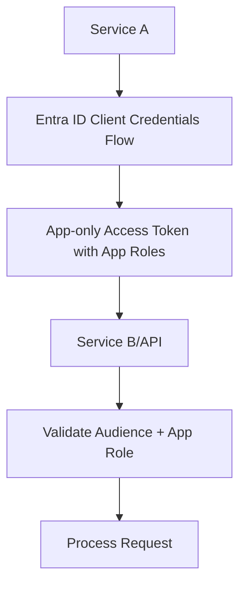
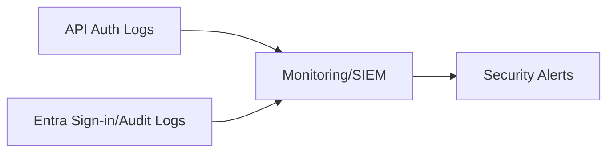

# How Do You Secure Web APIs Using Microsoft Entra ID?
## Detailed Interview Preparation Guide with Flow Charts

---

## 1) Direct Interview Answer

Secure Web APIs using **Microsoft Entra ID** by:

1. Registering the API in Entra ID (App Registration)
2. Defining scopes/app roles for fine-grained access
3. Requiring clients to obtain access tokens from Entra ID
4. Validating tokens in the API (issuer, audience, signature, expiry)
5. Enforcing authorization using scopes/roles/claims
6. Applying defense-in-depth (rate limiting, network controls, logging)

> One-liner: *Secure Web APIs with Entra ID by requiring valid, scoped access tokens and enforcing strict token/claim validation before granting access.*

---

## 2) Why Use Entra ID for API Security

- Centralized identity and access governance
- Standardized OAuth2/OIDC token-based security
- Supports MFA/Conditional Access at authentication layer
- Enables fine-grained authorization via scopes/roles
- Reduces custom auth code and security risk

---

## 3) High-Level Architecture



---

## 4) End-to-End Secure API Flow



---

## 5) API Registration Concepts (Must Know)

## 5.1 App Registration for the API
- Represents the Web API identity in Entra ID
- Defines Application ID URI (used as audience)

## 5.2 Exposed Scopes (Delegated Permissions)
- Used when a signed-in user delegates access
- Example: `Orders.Read`, `Orders.Write`

## 5.3 App Roles (Application Permissions)
- Used for service-to-service (no user) scenarios
- Example: `Orders.ReadAll` app role assigned to a service principal



---

## 6) Common Flows Used to Call Secured APIs

## 6.1 Authorization Code Flow (User Context)
- Web/mobile/SPA apps
- User signs in, app gets access token with delegated scopes

## 6.2 Client Credentials Flow (No User Context)
- Service-to-service calls
- App authenticates as itself using app roles/permissions

## 6.3 On-Behalf-Of Flow
- API calling another API using user's delegated identity context



---

## 7) Access Token Validation Steps (API Responsibility)

APIs must independently validate tokens—even though Entra issued them.

```mermaid
flowchart TD
    Token[Incoming Access Token] --> Sig{Signature Valid?}
    Sig -- No --> D1[401 Unauthorized]
    Sig -- Yes --> Iss{Issuer Trusted (tenant)?}
    Iss -- No --> D2[401 Unauthorized]
    Iss -- Yes --> Aud{Audience Matches API App ID URI?}
    Aud -- No --> D3[401 Unauthorized]
    Aud -- Yes --> Exp{Not Expired?}
    Exp -- No --> D4[401 Unauthorized]
    Exp -- Yes --> Perm{Required Scope/Role Present?}
    Perm -- No --> D5[403 Forbidden]
    Perm -- Yes --> Allow[Grant Access]
```

---

## 8) Authorization Enforcement Patterns

## 8.1 Scope-Based Authorization (Delegated)
Check `scp` claim for required scope value (e.g., `Orders.Read`).

## 8.2 Role-Based Authorization (Application Permissions)
Check `roles` claim for required app role (e.g., `Orders.ReadAll`).

## 8.3 Custom Claims-Based Authorization
Check tenant, group, or custom claims for fine-grained rules.



---

## 9) Middleware/Policy Enforcement in API

Most frameworks provide middleware to:
- Validate JWT automatically using Entra metadata (OpenID configuration)
- Enforce `[Authorize]`-style policies
- Map scopes/roles to controller/action-level checks

Interview phrase:
> Use framework-level JWT bearer authentication middleware configured with Entra tenant/issuer metadata for robust validation.

---

## 10) Defense-in-Depth Beyond Token Validation

1. Rate limiting/throttling for abuse protection  
2. Input validation and schema checks  
3. Network restrictions (private endpoints/firewalls where applicable)  
4. Logging/auditing of authorization decisions  
5. Least-privilege scopes/roles design  
6. Secure secret/certificate handling (if API also calls downstream services)  



---

## 11) Multi-Tenant Considerations

If API supports multiple tenants:
- Validate issuer per tenant appropriately
- Avoid overly permissive multi-tenant trust
- Consider tenant claim (`tid`) checks for isolation
- Apply strict consent/admin approval governance

---

## 12) Service-to-Service (No User) Secure Pattern



Use case:
- Background jobs, daemons, internal microservice calls.

---

## 13) On-Behalf-Of (Chained API) Pattern

```mermaid
flowchart TD
    User[User] --> ClientApp[Client App]
    ClientApp --> API1[API 1 (Access Token A)]
    API1 --> Entra[Entra ID OBO Token Exchange]
    Entra --> API1Token[New Token for API 2]
    API1 --> API2[Call API 2 with OBO Token]
    API2 --> Validate2[Validate Token + Scopes]
```

Preserves user context through a chain of APIs securely.

---

## 14) Observability and Monitoring

Track:
- 401/403 trends by client/app
- Sign-in and token issuance logs
- Conditional Access policy impact
- Anomalous access patterns
- API authorization failures by endpoint



---

## 15) Common Mistakes (Interview Gold)

1. Not validating audience (accepting tokens meant for another API)  
2. Confusing delegated scopes with app roles  
3. Overly broad scopes/roles granted to clients  
4. No rate limiting on public APIs  
5. Trusting any valid Entra token without checking required claims  
6. Missing tenant isolation checks in multi-tenant APIs  
7. Ignoring Conditional Access implications during troubleshooting  

---

## 16) Security Hardening Checklist

- [ ] API registered with clear Application ID URI (audience)  
- [ ] Scopes/app roles defined with least privilege  
- [ ] JWT bearer validation configured (issuer, audience, signature, expiry)  
- [ ] Authorization enforced via scopes/roles/claims  
- [ ] Rate limiting and input validation applied  
- [ ] Logging/auditing enabled for auth decisions  
- [ ] Multi-tenant isolation validated if applicable  
- [ ] Secrets/certificates managed securely for downstream calls  

---

## 17) Interview Q&A (Strong Answers)

### Q1: How do you secure a Web API with Entra ID?
**Answer:** Register the API in Entra ID, require access tokens with correct audience, validate tokens rigorously, and enforce authorization using scopes/roles.

### Q2: Difference between scopes and app roles?
**Answer:** Scopes represent delegated user permissions; app roles represent application-level permissions for service-to-service scenarios.

### Q3: Should the API trust any valid Entra-issued token?
**Answer:** No. It must validate audience and required scopes/roles specific to that API.

### Q4: How do you secure service-to-service calls with no user?
**Answer:** Use client credentials flow with app roles assigned to the calling service principal.

### Q5: How do you preserve user context across chained APIs?
**Answer:** Use the on-behalf-of flow to exchange tokens while maintaining delegated user identity.

### Q6: What else should be done besides token validation?
**Answer:** Apply rate limiting, input validation, logging/monitoring, and least-privilege access design.

---

## 18) 60-Second Interview Pitch

> I secure Web APIs with Entra ID by registering the API with a clear audience identifier and defining least-privilege scopes and app roles. Clients obtain access tokens via appropriate flows—authorization code for user-delegated access, client credentials for service-to-service calls, and on-behalf-of for chained API scenarios. The API independently validates token signature, issuer, audience, and expiry, then authorizes requests based on required scopes or app roles. Beyond token validation, I add rate limiting, input validation, and centralized logging/monitoring to strengthen overall API security posture.

---

## 19) One-Line Conclusion

> Secure Web APIs with Entra ID by enforcing strict access token validation and least-privilege scope/role-based authorization, combined with defense-in-depth controls like rate limiting and monitoring.