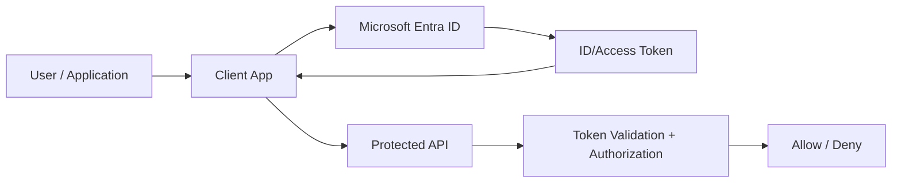
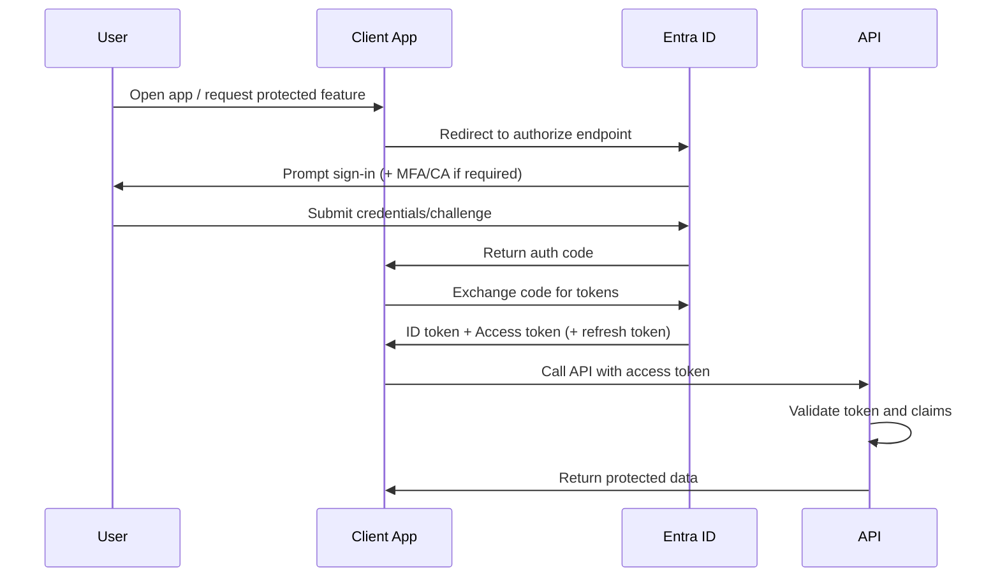
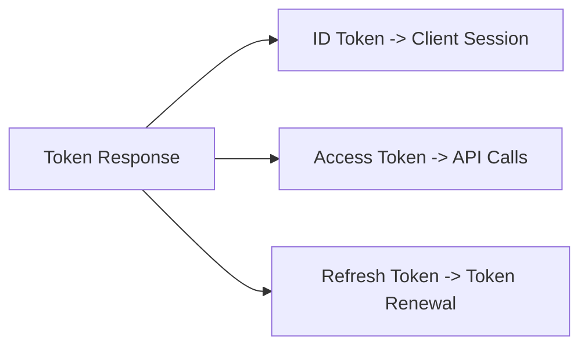
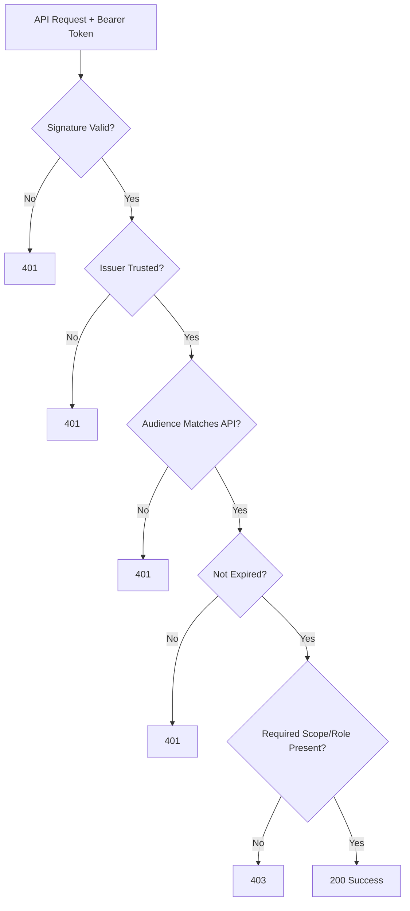
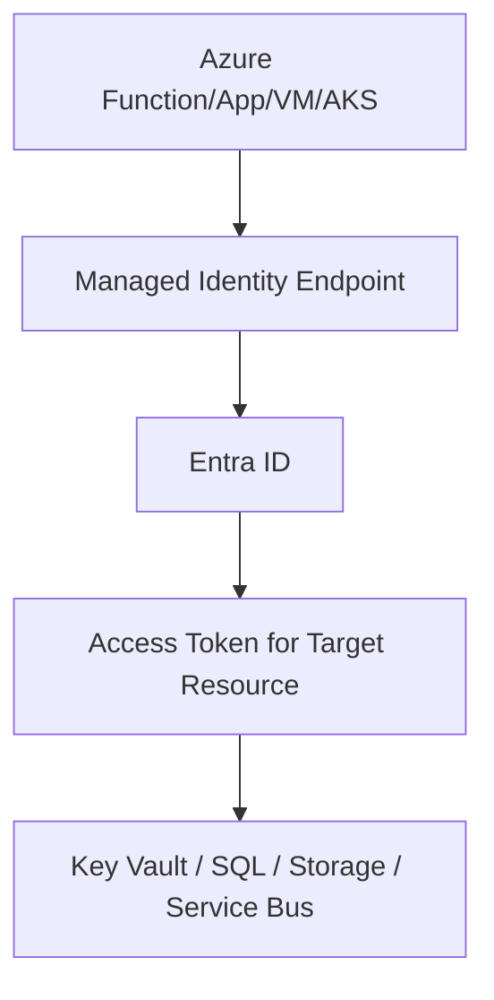
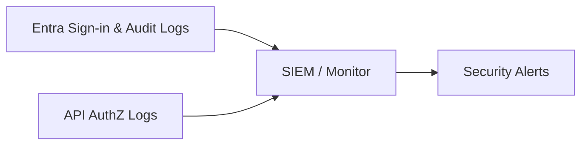

# How Does Azure Entra ID Authentication Work?
## Detailed Interview Preparation Guide with Flow Charts

---

## 1) Direct Interview Answer

**Azure Entra ID authentication** works by verifying identity through a trusted Identity Provider (IdP), issuing security tokens (ID token/access token), and allowing applications/APIs to validate those tokens before granting access.

At a high level:

1. User or app requests access
2. App redirects/authenticates with Entra ID
3. Entra ID validates credentials and policies (MFA/Conditional Access, etc.)
4. Entra ID issues token(s)
5. App/API validates token claims (issuer, audience, expiry, signature, scopes/roles)
6. Access granted based on authorization rules

> One-liner: *Entra ID authenticates identities and issues signed tokens that apps and APIs trust for secure access decisions.*

---

## 2) Core Components

- **Identity**: user, service principal, managed identity, workload identity
- **Application registration**: app definition in Entra ID
- **Service principal**: tenant-local instance of app identity
- **Token endpoint**: issues OAuth2/OIDC tokens
- **Policies**: MFA, Conditional Access, risk controls
- **Resource/API**: validates tokens and enforces authorization

---

## 3) High-Level Authentication Flow

---

## 4) User Sign-In Flow (OIDC + OAuth2)

---

## 5) What Entra ID Validates Before Issuing Tokens

Depending on policy and context, Entra ID can evaluate:
- Credentials correctness
- Multi-factor authentication requirements
- Conditional Access rules (device, location, risk, app sensitivity)
- User/account risk signals
- Tenant and app consent constraints

Only after successful evaluation does Entra issue tokens.

---

## 6) Token Types and Usage

## 6.1 ID Token
- For client app authentication/session establishment
- Contains identity claims about signed-in user

## 6.2 Access Token
- For calling APIs/resources
- Contains audience/scopes/roles and token metadata

## 6.3 Refresh Token
- Used to obtain new access tokens without re-authenticating every time (policy-dependent)

---

## 7) API Token Validation Flow

---

## 8) Authentication vs Authorization (Interview-Critical)

- **Authentication**: proves identity (“Who are you?”)
- **Authorization**: determines permissions (“What can you do?”)

Entra ID provides identity assertions (tokens), but each app/API must enforce authorization using:
- Scopes
- App roles
- Group/claim-based rules
- Resource-specific RBAC/ACL logic

---

## 9) App Registration and Service Principal (Practical View)

1. Register application in Entra ID
2. Configure redirect URIs and permissions/scopes
3. Create service principal in tenant context
4. Grant admin/user consent as required
5. Use client ID and authority endpoints in app config

This establishes trust between app and Entra.

---

## 10) Managed Identity Authentication Flow (Workload-to-Workload)

For Azure-hosted workloads, managed identity avoids stored credentials.

No client secret in code, reducing credential leakage risk.

---

## 11) Conditional Access Role in Authentication

Conditional Access can enforce:
- MFA for risky sign-ins
- Device compliance requirements
- Network/location restrictions
- Session controls based on sensitivity

Interview phrase:
> Entra authentication is policy-driven, not just password verification.

---

## 12) Multi-Tenant vs Single-Tenant Authentication

## Single-tenant app
- Intended for users in one organization tenant

## Multi-tenant app
- Can be used by users from multiple tenants (with consent/trust configuration)

Security consideration:
- Validate tenant/issuer expectations carefully in multi-tenant scenarios.

---

## 13) Common OAuth2/OIDC Flows with Entra ID

- Authorization Code + PKCE (modern default for user sign-in)
- Client Credentials (service-to-service, no user context)
- On-behalf-of (API-to-API user delegation)
- Device code flow (limited-input devices/tools)

---

## 14) Common Failure Causes

1. Invalid redirect URI  
2. Missing consent for required scopes  
3. Conditional Access blocking sign-in  
4. Wrong token audience used for API  
5. Expired token or clock skew issues  
6. Misconfigured issuer/tenant authority  
7. Using ID token where access token is required  

---

## 15) Security Best Practices

- Use Authorization Code Flow + PKCE for interactive apps
- Enforce HTTPS and secure redirect URI configuration
- Validate issuer/audience/signature/expiry on APIs
- Use least-privilege scopes and app roles
- Prefer managed identity for Azure workloads
- Monitor sign-in logs and risky sign-ins
- Apply Conditional Access and MFA appropriately

---

## 16) Observability and Audit

Track in monitoring/SIEM:
- Sign-in successes/failures
- MFA/Conditional Access results
- Token issuance anomalies
- Risk detections
- API 401/403 trends by app/user/client

---

## 17) Real-World End-to-End Example

Scenario:
- Employee signs into internal portal
- Entra enforces MFA + device compliance
- Portal receives tokens
- Portal calls payroll API with access token
- API validates token + role claim
- Access granted only to authorized role

---

## 18) Common Mistakes (Interview Gold)

1. Confusing authentication and authorization  
2. Not validating access token claims on API  
3. Overbroad app permissions/scopes  
4. Storing client secrets insecurely  
5. Ignoring Conditional Access impacts in troubleshooting  
6. No monitoring for auth anomalies  
7. Treating Entra token issuance as sufficient without API-side checks  

---

## 19) Interview Q&A (Strong Answers)

### Q1: How does Entra ID authenticate users?
**Answer:** It validates identity (credentials + policies like MFA/Conditional Access), then issues signed tokens consumed by apps/APIs.

### Q2: What token does an API accept?
**Answer:** Access token (not ID token) with correct audience, issuer, and required scopes/roles.

### Q3: Where is authorization enforced?
**Answer:** In the resource app/API, using token claims and local access rules.

### Q4: How do Azure workloads authenticate without secrets?
**Answer:** Using managed identity to obtain Entra-issued tokens.

### Q5: Why do we still need API validation if Entra already authenticated?
**Answer:** Because each API must independently verify token integrity and enforce least-privilege authorization decisions.

### Q6: What is the role of Conditional Access?
**Answer:** It applies context-aware access controls (MFA, device, risk, location) before token issuance.

---

## 20) 60-Second Interview Pitch

> Azure Entra ID authentication is token-based identity verification for users and workloads. A client app redirects users to Entra for sign-in, Entra applies policies like MFA and Conditional Access, and then issues signed tokens. The client uses access tokens to call APIs, and those APIs must validate signature, issuer, audience, expiry, and scopes/roles before authorizing access. For Azure-hosted services, managed identity provides passwordless authentication without storing secrets. This model centralizes identity security while allowing each resource to enforce fine-grained authorization.

---

## 21) One-Line Conclusion

> Azure Entra ID authentication works by validating identity under policy controls and issuing trusted tokens that applications and APIs validate to grant secure, least-privilege access.