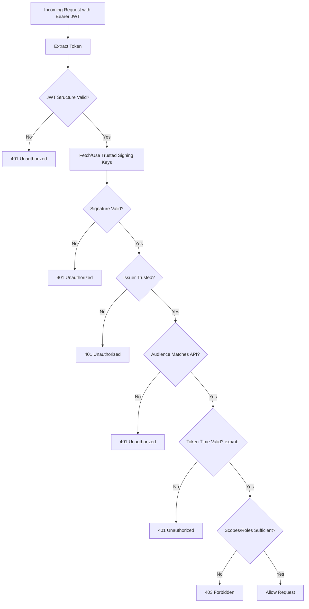
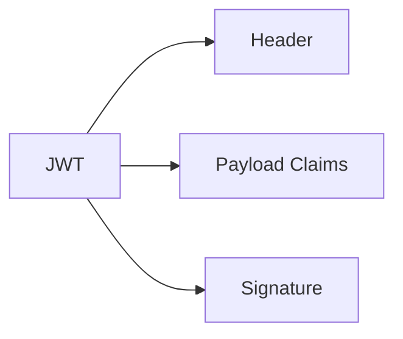
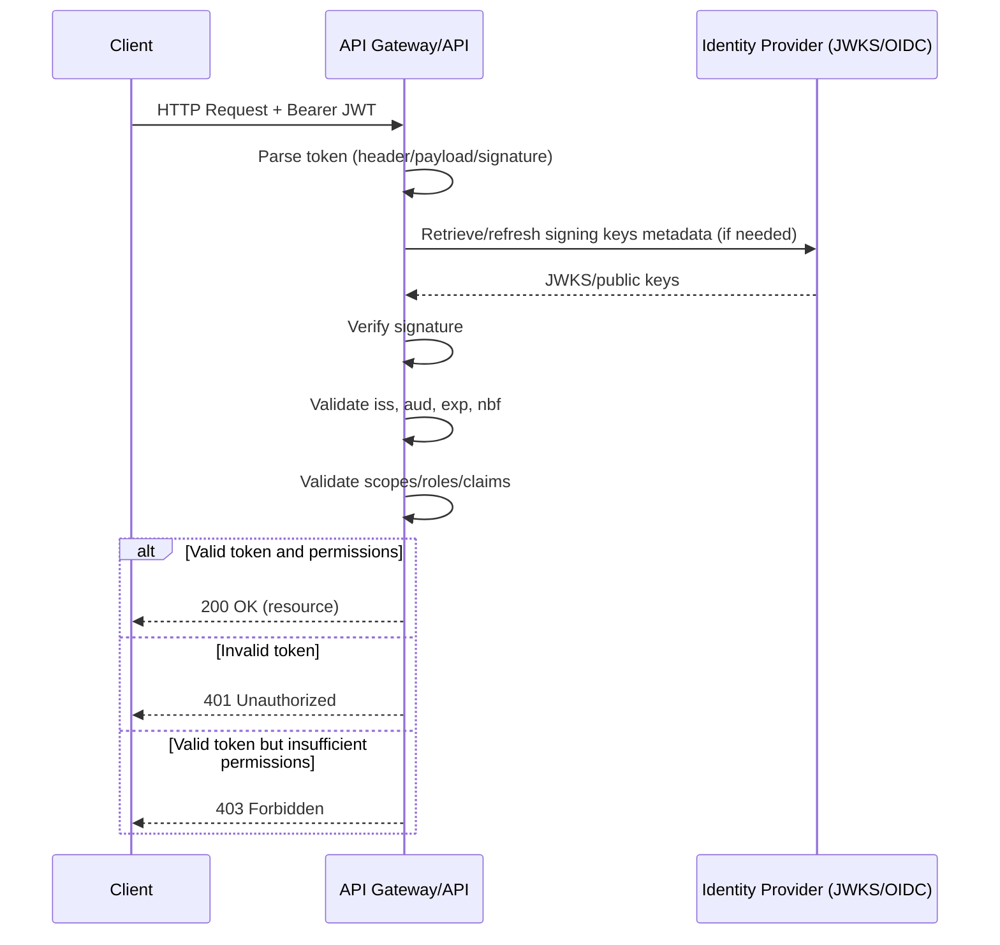
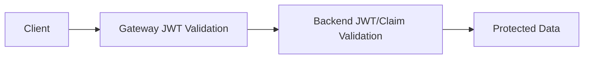
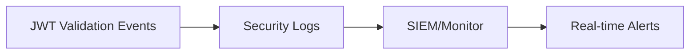

# JWT Validation Flow
## Detailed Interview Preparation Guide with Flow Charts

---

## 1) Direct Interview Answer

**JWT validation flow** is the process by which an API/gateway verifies that a JWT is authentic, unmodified, intended for the target API, and authorized for the requested operation.

Core validation checks:

1. Token format and structure (`header.payload.signature`)
2. Signature verification using trusted signing keys
3. Issuer (`iss`) validation
4. Audience (`aud`) validation
5. Lifetime checks (`exp`, `nbf`, optionally `iat`)
6. Authorization claim checks (scope/role/permissions)
7. Optional contextual checks (tenant, client app, nonce/jti as needed)

> One-liner: *JWT validation ensures token integrity, authenticity, validity period, intended audience, and required permissions before API access is granted.*

---

## 2) Why JWT Validation Matters

If JWT validation is weak:
- Attackers may use forged or tampered tokens
- Tokens issued for another API could be accepted
- Expired/replayed tokens may be abused
- Over-privileged access may be granted

Strong validation prevents unauthorized access and token misuse.

---

## 3) High-Level JWT Validation Flow

---

## 4) JWT Anatomy Refresher

A JWT has 3 base64url parts:

1. **Header**: algorithm (`alg`), key ID (`kid`)  
2. **Payload (claims)**: `iss`, `aud`, `exp`, `nbf`, `sub`, `scp`, `roles`, etc.  
3. **Signature**: cryptographic proof token wasn’t altered

---

## 5) Step-by-Step Validation Deep Dive

## Step 1: Extract Bearer Token
- Read from `Authorization: Bearer <token>`
- Reject missing/malformed header

## Step 2: Basic Structural Validation
- Ensure 3 segments exist
- Decode safely
- Confirm expected token type and algorithm policy

## Step 3: Signature Verification
- Use trusted public key/secret based on algorithm
- Resolve key via `kid` (if asymmetric key sets are used)
- Reject if signature mismatch

## Step 4: Issuer Validation (`iss`)
- Must match trusted identity provider issuer URL

## Step 5: Audience Validation (`aud`)
- Must match your API identifier
- Prevents token confusion (token meant for another API)

## Step 6: Time-Based Validation
- `exp` must be in future
- `nbf` must be in past/present
- Handle small clock skew safely

## Step 7: Authorization Claims Validation
- Enforce required scope (`scp`) and/or roles
- Optional checks: tenant (`tid`), client app (`azp`/`appid`), subject constraints

## Step 8: Build Security Context
- Map claims to principal/identity in API context
- Apply endpoint-level authorization policies

---

## 6) Detailed Sequence Diagram

---

## 7) 401 vs 403 (Interview-Critical)

- **401 Unauthorized**: token missing/invalid/expired/untrusted
- **403 Forbidden**: token valid, but insufficient permission (scope/role)

This distinction should be consistent across APIs.

---

## 8) Common Claims You Should Know

- `iss` -> token issuer  
- `aud` -> intended recipient API  
- `exp` -> expiration time  
- `nbf` -> not valid before  
- `iat` -> issued at  
- `sub` -> subject (user/service)  
- `scp` -> delegated scopes  
- `roles` -> app/user roles  
- `jti` -> token identifier (useful in replay strategies)  

---

## 9) Validation Placement Options

## 9.1 API Gateway Validation (e.g., APIM)
- Centralized enforcement
- Consistent policy across APIs
- Reduces duplicated auth code

## 9.2 API Service Validation
- Fine-grained per-service control
- Domain-specific authorization rules

## 9.3 Both (Recommended for high security)
- Gateway as first line
- Backend as defense-in-depth

---

## 10) Key Management in JWT Validation

- Trust only approved signing keys
- Use metadata/JWKS endpoints from trusted IdP
- Support key rotation without downtime
- Cache keys responsibly with refresh strategy
- Never trust `alg=none` or unexpected algorithms

---

## 11) Replay and Abuse Considerations

JWTs are bearer tokens, so theft can enable replay.

Mitigations:
- Short token lifetimes
- TLS everywhere
- Secure token storage client-side
- Optional token binding/nonce/jti strategies where applicable
- Monitor unusual token reuse patterns

---

## 12) Performance Considerations

- Cache IdP metadata/JWKS (with refresh)
- Avoid fetching signing keys per request
- Fail fast on malformed tokens
- Keep authorization checks efficient
- Monitor auth latency and failure rates

---

## 13) Observability and Audit

Track:
- Invalid signature counts
- Issuer/audience mismatch events
- Expired token failures
- 401 vs 403 trends
- Endpoint-level authorization denials
- Caller/client distribution of failures

---

## 14) Common JWT Validation Mistakes (Interview Gold)

1. Not validating audience  
2. Accepting tokens from untrusted issuers  
3. Skipping signature verification  
4. Ignoring token expiry/nbf  
5. Treating any valid token as fully authorized  
6. Returning overly detailed auth errors  
7. Hardcoding keys without rotation strategy  
8. Confusing ID token vs access token usage  

---

## 15) ID Token vs Access Token in API Validation

- APIs should generally validate **access tokens** for authorization
- ID tokens are for client authentication/session context
- Accepting ID tokens at API layer is a common security design error

---

## 16) Practical Validation Policy Matrix

| Check | Purpose | Fail Result |
|---|---|---|
| Signature | Integrity and authenticity | 401 |
| Issuer | Trusted token source | 401 |
| Audience | Token intended for this API | 401 |
| Expiry/NBF | Time validity | 401 |
| Scope/Role | Permission enforcement | 403 |

---

## 17) Interview Q&A (Strong Answers)

### Q1: What is the first thing to validate in a JWT?
**Answer:** Token presence/format and signature integrity using trusted keys.

### Q2: Why is audience validation important?
**Answer:** It prevents accepting tokens intended for other APIs (token confusion).

### Q3: When do you return 403 instead of 401?
**Answer:** Return 403 when token is valid but lacks required permissions (scope/role).

### Q4: Should APIs rely only on gateway JWT validation?
**Answer:** For strong security, use backend defense-in-depth checks too, especially for critical operations.

### Q5: How do you handle key rotation?
**Answer:** Use IdP metadata/JWKS with caching and periodic refresh to validate against current trusted keys.

### Q6: Can an expired token ever be accepted?
**Answer:** No, except minimal clock skew tolerance handling; otherwise reject with 401.

---

## 18) 60-Second Interview Pitch

> JWT validation flow starts when an API receives a bearer token and parses its structure. The API verifies signature integrity using trusted signing keys, validates issuer and audience to ensure the token came from a trusted IdP and is intended for that API, then checks lifetime claims like exp and nbf. After authentication validity is established, it enforces authorization using scopes or roles. Invalid tokens return 401, while valid-but-underprivileged tokens return 403. In production, key rotation handling, short token lifetimes, TLS, centralized monitoring, and optional gateway-plus-backend validation are essential for robust security.

---

## 19) Final Checklist

- [ ] Bearer token extraction and format checks  
- [ ] Signature verification with trusted keys  
- [ ] Issuer validation  
- [ ] Audience validation  
- [ ] Expiry/not-before validation  
- [ ] Scope/role authorization checks  
- [ ] Correct 401 vs 403 behavior  
- [ ] Key rotation and JWKS refresh strategy  
- [ ] Monitoring and alerting on validation failures  

---

## One-Line Conclusion

> JWT validation flow secures APIs by verifying token integrity, trust, validity window, and permissions before allowing access to protected resources.