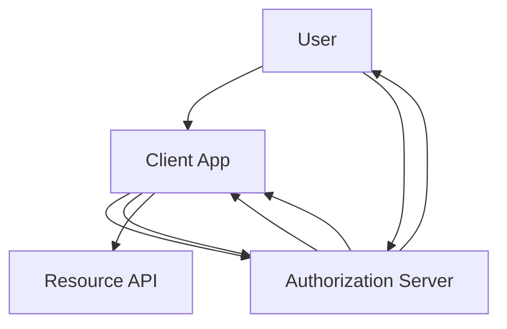
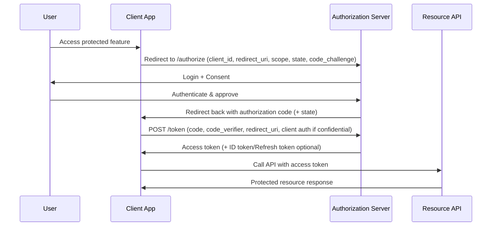
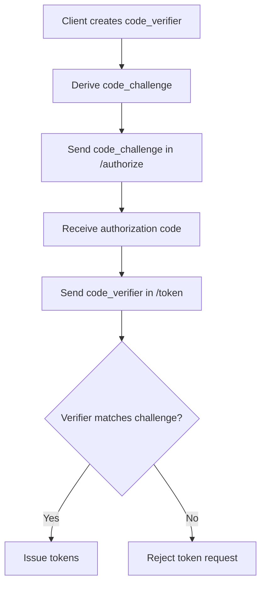
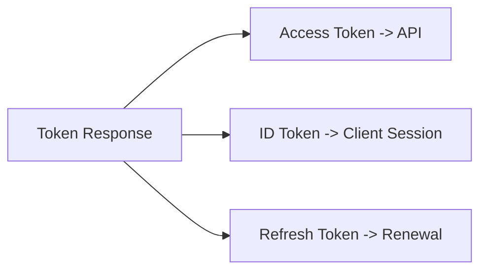
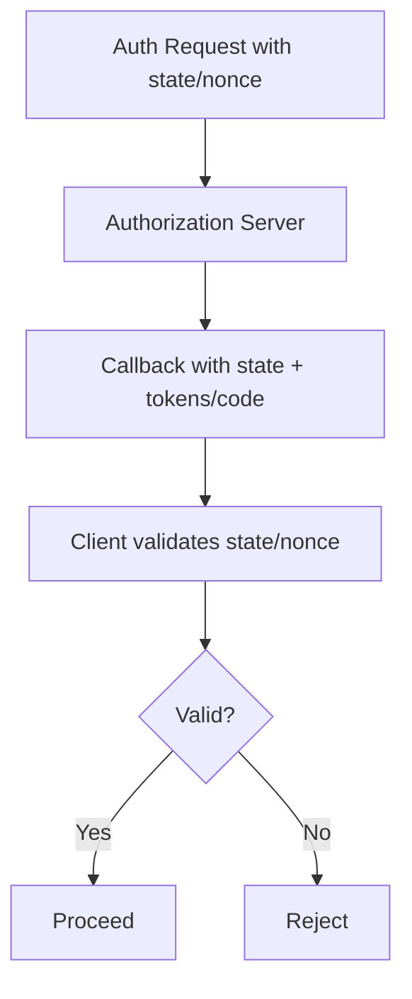
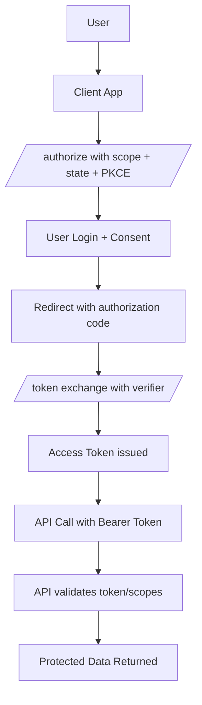

# OAuth 2.0 / OIDC Authorization Code Flow
## Detailed Interview Preparation Guide with Flow Charts

---

## 1) Direct Interview Answer

**Authorization Code Flow** is a secure OAuth 2.0 (and OIDC) flow where the client application redirects the user to the authorization server, receives a short-lived **authorization code**, and exchanges it server-side for tokens (access token, and optionally ID/refresh tokens).

It is the recommended flow for:
- Web applications (confidential clients)
- Modern SPAs/mobile apps when using **PKCE** (best practice)
- Scenarios needing high security and delegated access

> One-liner: *Authorization Code Flow keeps tokens off the front channel and uses a short-lived code + back-channel exchange for stronger security.*

---

## 2) Why Authorization Code Flow Is Preferred

Compared to less secure patterns, it improves security by:
- Returning a short-lived code through browser redirect instead of access token directly
- Exchanging code for tokens over secure back channel
- Supporting PKCE to mitigate code interception attacks
- Enabling stronger client authentication (for confidential clients)

---

## 3) Actors Involved

1. **Resource Owner** (User)
2. **Client** (Web app / SPA / Mobile app)
3. **Authorization Server / IdP**
4. **Resource Server** (API)

---

## 4) High-Level Flow Chart

---

## 5) Step-by-Step Authorization Code Flow

---

## 6) Core Parameters You Must Know (Interview Critical)

## Authorization Request (`/authorize`)
- `response_type=code`
- `client_id`
- `redirect_uri`
- `scope`
- `state` (CSRF protection)
- `code_challenge` + `code_challenge_method` (PKCE)

## Token Request (`/token`)
- `grant_type=authorization_code`
- `code`
- `redirect_uri`
- `code_verifier` (PKCE)
- Client authentication (for confidential clients)

---

## 7) What Is PKCE and Why It Matters

**PKCE (Proof Key for Code Exchange)** protects authorization code flow from interception/replay attacks.

Mechanism:
1. Client creates random `code_verifier`
2. Sends hashed/challenged form in auth request (`code_challenge`)
3. Sends original `code_verifier` in token request
4. Authorization server matches them before issuing token

Interview phrase:
> PKCE is mandatory best practice for public clients and broadly recommended for all authorization code flows.

---

## 8) Confidential vs Public Clients

## Confidential Client (e.g., server-side web app)
- Can securely hold client credentials
- Authenticates to token endpoint with client secret/cert
- Still should use PKCE (recommended)

## Public Client (SPA/native/mobile)
- Cannot safely store client secret
- Uses PKCE as primary proof mechanism
- No long-term embedded client secret reliance

---

## 9) Tokens Returned and Their Purpose

- **Access Token**: used to call APIs
- **ID Token** (OIDC): identity of authenticated user (for client)
- **Refresh Token** (if issued): get new access token without re-login

---

## 10) Security Controls in Authorization Code Flow

1. Use HTTPS everywhere  
2. Validate `state` to prevent CSRF  
3. Use PKCE (`S256` method preferred)  
4. Strict redirect URI registration and exact matching  
5. Validate token issuer/audience/expiry/signature  
6. Store tokens securely  
7. Use short-lived access tokens  
8. Rotate refresh tokens when supported  

---

## 11) Redirect URI Security

A major attack surface is redirect URI misuse.

Best practices:
- Pre-register exact redirect URIs
- Avoid wildcards
- Use HTTPS (except controlled localhost dev scenarios)
- Reject mismatched redirect URI at token exchange

---

## 12) State and Nonce (OIDC Context)

- `state`: mitigates CSRF, correlates request/response
- `nonce` (OIDC): helps prevent token replay/injection in auth responses

---

## 13) Common Failure Modes

1. Invalid redirect URI  
2. Missing/invalid PKCE verifier  
3. Expired/used authorization code  
4. State mismatch  
5. Invalid client authentication (confidential clients)  
6. Wrong audience/scope in token usage  
7. Clock skew causing token lifetime issues  

---

## 14) Authorization Code Flow vs Implicit Flow (Interview Angle)

Modern guidance strongly prefers Authorization Code + PKCE over implicit flow for browser-based apps due to better token handling and security properties.

---

## 15) Real-World Example (Enterprise Web App)

Scenario:
- Employee opens internal portal
- Portal redirects to enterprise IdP
- Employee signs in with MFA
- App gets authorization code
- Backend exchanges code for tokens
- App calls HR/Finance APIs with access token

Benefits:
- Centralized identity controls
- No password handling by app
- Granular API scopes and auditable access

---

## 16) End-to-End Flow with API Authorization

---

## 17) Best Practices Checklist

- [ ] Use Authorization Code Flow (not implicit for modern apps)  
- [ ] Enforce PKCE (`S256`)  
- [ ] Validate `state` (and `nonce` for OIDC)  
- [ ] Use exact redirect URI matching  
- [ ] Keep access tokens short-lived  
- [ ] Secure token storage and transport  
- [ ] Validate token claims on API side  
- [ ] Apply least-privilege scopes  
- [ ] Log and monitor auth/token failures  

---

## 18) Common Interview Q&A (Strong Answers)

### Q1: Why is authorization code flow more secure than implicit flow?
**Answer:** It returns a short-lived code via front channel and exchanges it for tokens via back channel; with PKCE it mitigates interception attacks.

### Q2: What is PKCE in one line?
**Answer:** A proof mechanism that binds authorization request and token request to the same client using verifier/challenge.

### Q3: What does `state` protect against?
**Answer:** CSRF and request/response correlation attacks.

### Q4: Can SPAs use authorization code flow?
**Answer:** Yes, with PKCE (modern recommended approach).

### Q5: Which token is used for API calls?
**Answer:** Access token.

### Q6: What is authorization code lifetime typically like?
**Answer:** Very short-lived and one-time use to reduce replay risk.

---

## 19) 60-Second Interview Pitch

> Authorization Code Flow is the recommended OAuth2/OIDC flow for securely obtaining tokens. The client redirects the user to the authorization server, the user authenticates and consents, and the app receives a short-lived authorization code. The app then exchanges that code at the token endpoint—using PKCE and client authentication where applicable—to obtain tokens. This design keeps tokens off insecure front channels, supports strong validation controls like state and nonce, and enables secure delegated API access with scoped access tokens.

---

## 20) One-Line Conclusion

> Authorization Code Flow (with PKCE) is the modern secure standard for user sign-in and delegated API access in OAuth2/OIDC applications.