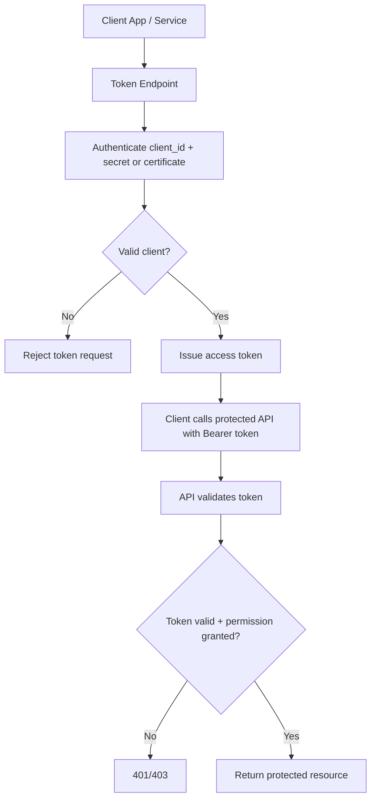
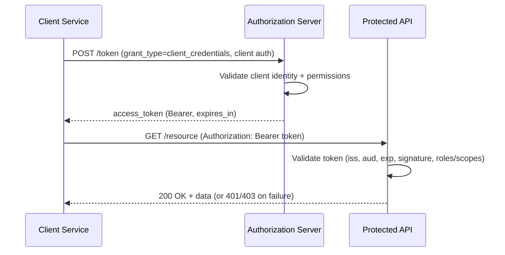
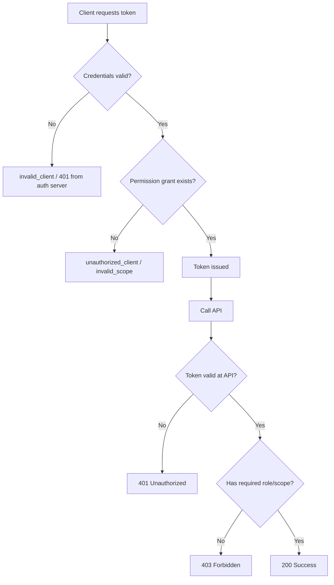

# OAuth 2.0 Client Credentials Flow  
_Interview Preparation Guide (with flow chart)_

## 1) Short Interview Answer (30–60 seconds)

**Client Credentials Flow** is an OAuth 2.0 grant type used for **machine-to-machine (M2M)** communication, where **no user is involved**.  
A confidential client (like a backend API, daemon, microservice, or batch job) authenticates with the authorization server using its own credentials (client secret or certificate) and gets an **access token** to call another API.  
Use it for service-to-service scenarios, not user sign-in scenarios.

---

## 2) When to Use It

Use Client Credentials Flow when:

- A background service needs to call an API
- One backend microservice calls another backend API
- Scheduled jobs/ETL workers call protected resources
- CI/CD automation calls management APIs securely

Do **not** use it when a user is present (then use Authorization Code flow, usually with PKCE).

---

## 3) Core Idea

- **Identity = application itself**, not a user
- Token represents app permissions (application roles/scopes configured for app context)
- No refresh token is typically needed in most implementations; app requests a new token when required

---

## 4) Actors in the Flow

- **Client Application** (confidential client)
- **Authorization Server** (e.g., Microsoft Entra ID, Auth0, Okta, etc.)
- **Resource Server / API** (the protected API)

---

## 5) High-Level Flow Chart



---

## 6) Protocol-Level Steps (Detailed)

1. Client sends POST to token endpoint with:
   - `grant_type=client_credentials`
   - `client_id`
   - client authentication (`client_secret` or client assertion/certificate)
   - `scope` (or resource/audience depending on provider)

2. Authorization server validates client credentials.

3. If valid and authorized, server returns:
   - `access_token`
   - `token_type` (Bearer)
   - `expires_in`

4. Client sends access token to API:
   - `Authorization: Bearer <token>`

5. API validates token:
   - signature
   - issuer (`iss`)
   - audience (`aud`)
   - expiry (`exp`)
   - required roles/scopes/claims

6. API returns data if authorized, else 401/403.

---

## 7) Sequence Diagram



---

## 8) Example Token Request (Generic OAuth 2.0)

```bash name=token-request.sh
curl -X POST "https://auth.example.com/oauth2/v2.0/token" \
  -H "Content-Type: application/x-www-form-urlencoded" \
  -d "grant_type=client_credentials" \
  -d "client_id=<CLIENT_ID>" \
  -d "client_secret=<CLIENT_SECRET>" \
  -d "scope=api://<RESOURCE-APP-ID>/.default"
```

> In some providers, you pass `audience` or `resource` instead of `scope`.

---

## 9) Example Token Response

```json name=token-response.json
{
  "token_type": "Bearer",
  "expires_in": 3600,
  "access_token": "eyJhbGciOiJSUzI1NiIs..."
}
```

---

## 10) .NET API Client Example (Acquire Token + Call API)

```csharp name=ClientCredentialsExample.cs
using System.Net.Http.Headers;
using System.Text.Json;

var http = new HttpClient();

// 1) Request token
var tokenEndpoint = "https://login.example.com/{tenant}/oauth2/v2.0/token";
var clientId = Environment.GetEnvironmentVariable("CLIENT_ID");
var clientSecret = Environment.GetEnvironmentVariable("CLIENT_SECRET");
var scope = "api://resource-app-id/.default";

var tokenReq = new HttpRequestMessage(HttpMethod.Post, tokenEndpoint)
{
    Content = new FormUrlEncodedContent(new Dictionary<string, string>
    {
        ["grant_type"] = "client_credentials",
        ["client_id"] = clientId!,
        ["client_secret"] = clientSecret!,
        ["scope"] = scope
    })
};

var tokenRes = await http.SendAsync(tokenReq);
tokenRes.EnsureSuccessStatusCode();

var tokenJson = await tokenRes.Content.ReadAsStringAsync();
var token = JsonDocument.Parse(tokenJson).RootElement.GetProperty("access_token").GetString();

// 2) Call protected API
http.DefaultRequestHeaders.Authorization = new AuthenticationHeaderValue("Bearer", token);
var apiRes = await http.GetAsync("https://api.example.com/orders");
apiRes.EnsureSuccessStatusCode();

Console.WriteLine(await apiRes.Content.ReadAsStringAsync());
```

---

## 11) Security Best Practices (Interview Must-Haves)

1. **Prefer certificates over shared client secrets** for stronger security.
2. **Use managed identity/workload identity** when available (no secret storage).
3. **Store secrets in vaults** (Key Vault, Secrets Manager), never in code.
4. **Use least privilege app permissions** (minimal roles/scopes).
5. **Validate tokens strictly** in APIs (`iss`, `aud`, signature, `exp`).
6. **Rotate credentials** regularly and automate rotation.
7. **Use short token lifetimes** and secure token caching.
8. **Enable audit logs** on token issuance and API access.
9. **Restrict network paths** (private networking, firewall rules).
10. **Protect against replay/leak** (TLS always, secure logging redaction).

---

## 12) Common Interview Confusions

## Q: Is there a user in Client Credentials Flow?
**A:** No. The app itself is the principal.

## Q: Can I use this for mobile/web user login?
**A:** No. Use Authorization Code + PKCE for user-interactive apps.

## Q: What permissions are in the token?
**A:** Application-level permissions (app roles/scopes granted to the client app).

## Q: Why do I get 401 vs 403?
- **401**: authentication/token issue (invalid/missing/expired token)
- **403**: token valid but insufficient permissions

---

## 13) Failure Path Flow Chart (Troubleshooting)



---

## 14) Client Authentication Methods (Strength Comparison)

| Method | Security Level | Notes |
|---|---|---|
| Client Secret | Medium | Easy, but secret leakage risk |
| Client Certificate | High | Better assurance, recommended over secrets |
| Private Key JWT | High | Strong for federated/advanced setups |
| Managed Identity / Workload Identity | Very High | Best in cloud-native environments |

---

## 15) Real-World Use Cases

- Microservice A calls Microservice B
- Worker service reads from protected data API nightly
- Internal platform service calls Microsoft Graph without user context
- Deployment automation invokes cloud management APIs

---

## 16) “Perfect Interview Answer” Template

> “Client Credentials Flow is OAuth 2.0’s machine-to-machine grant where no end user is involved. A confidential client authenticates to the token endpoint using a client secret or certificate, receives an access token, and calls a protected API. The API validates the token and enforces application permissions. In production, we use least privilege, strict token validation, secure secret storage or managed identity, and credential rotation.”

---

## 17) Quick Revision Checklist

- [ ] I can explain why no user context exists
- [ ] I know required token request parameters
- [ ] I can distinguish 401 vs 403
- [ ] I can explain app permissions vs delegated permissions
- [ ] I can justify certificate/managed identity over client secret
- [ ] I can describe token validation steps in API

---

## 18) Static Site Placement

Suggested file path:

`/docs/client-credential-flow-interview-guide.md`

Works with:
- Docusaurus
- MkDocs
- Jekyll
- Hugo
- Docsify