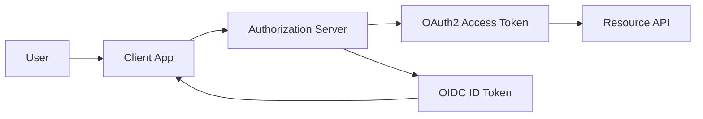
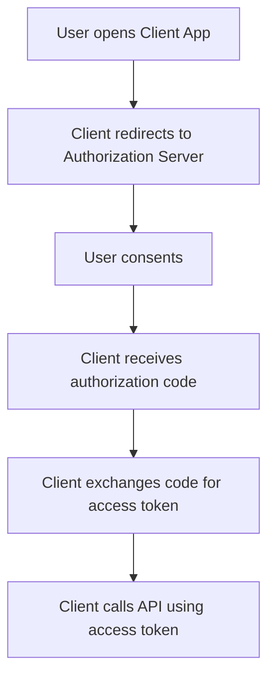
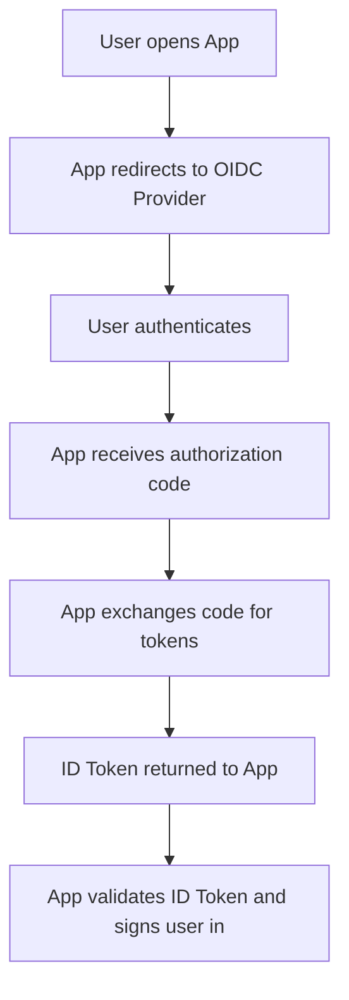
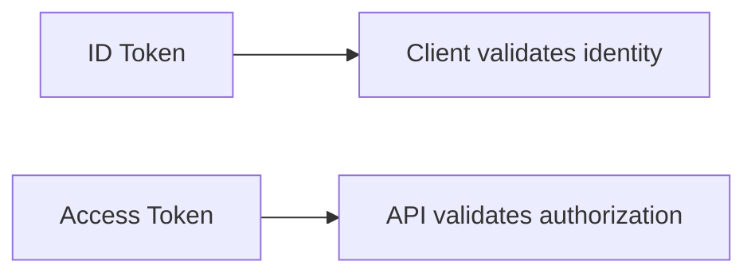
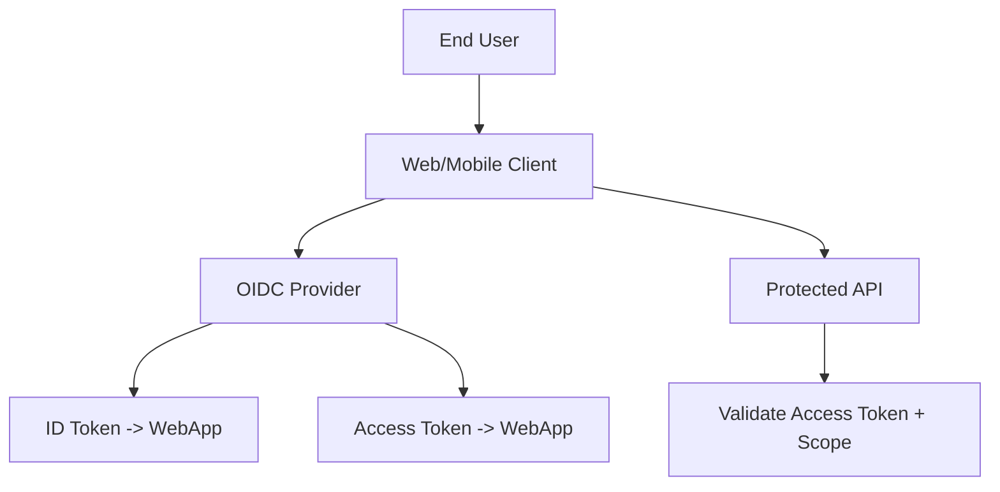
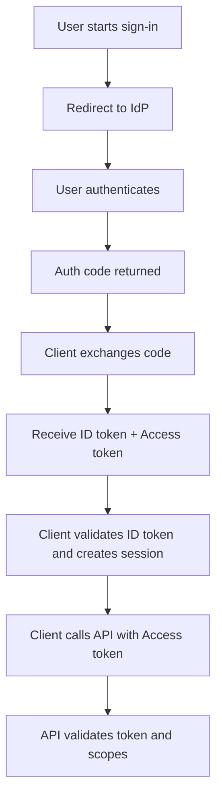

# OAuth 2.0 vs OpenID Connect (OIDC)
## Detailed Interview Preparation Guide with Flow Charts

---

## 1) Direct Interview Answer

- **OAuth 2.0** is an **authorization framework**: it gives a client app delegated access to a resource/API.
- **OpenID Connect (OIDC)** is an **authentication layer** built on OAuth 2.0: it tells you who the user is and provides identity information.

> One-liner: *OAuth2 answers “what can this app access?”; OIDC answers “who is the user?”.*

---

## 2) Why This Confusion Happens

Both use:
- Redirects
- Authorization server
- Tokens
- Similar endpoints

But intent differs:

- OAuth2 -> API access delegation
- OIDC -> user sign-in + identity claims (with ID token)

---

## 3) Conceptual Difference Diagram

- Access token -> for APIs  
- ID token -> for client to verify authenticated user identity

---

## 4) Primary Purpose Comparison

| Topic | OAuth 2.0 | OpenID Connect |
|---|---|---|
| Primary purpose | Authorization (delegated access) | Authentication (user identity) |
| Core token | Access token | ID token (+ access token often) |
| User identity standardization | Not defined by OAuth alone | Defined via OIDC claims |
| Typical use | Call APIs securely | Sign users into applications |

---

## 5) Roles and Actors

Common actors:
- Resource Owner (user)
- Client (app)
- Authorization Server / Identity Provider
- Resource Server (API)

OIDC adds standardized identity semantics on top of OAuth actor model.

---

## 6) OAuth2 Authorization Flow (High Level)

Outcome:
- Client can access API per scopes granted.

---

## 7) OIDC Authentication Flow (High Level)

Outcome:
- App knows authenticated user identity.

---

## 8) Token Types and Meaning

## 8.1 Access Token
- Used to call protected APIs
- Audience is typically the API/resource server
- Opaque or JWT depending on provider design

## 8.2 ID Token (OIDC)
- Contains identity claims about authenticated user
- Audience is the client application
- Used by client to establish user session

## 8.3 Refresh Token
- Used to obtain new access tokens without forcing re-login (policy dependent)

---

## 9) Claim Differences (Important for Interview)

OIDC ID token often includes:
- `sub` (user identifier)
- `iss` (issuer)
- `aud` (intended client)
- `exp`, `iat`
- Optional profile/email claims

OAuth2 access token claims/scopes are API-access centric, not a guaranteed user profile contract.

---

## 10) “Login with X” Uses OIDC, Not Plain OAuth2

If the app needs user sign-in:
- Use OIDC (authentication)
- Then use access token for APIs if needed

If app only needs backend-to-backend delegated API access:
- OAuth2 authorization may be enough (depending on flow)

---

## 11) Scope Semantics

OAuth2 scopes:
- API permission scopes (e.g., `orders.read`)

OIDC standard scopes:
- `openid` (required for OIDC)
- `profile`
- `email`
- etc.

If `openid` scope is absent, you are generally not doing OIDC authentication.

---

## 12) Validation Responsibilities

## For Access Tokens (OAuth2 context)
API validates:
- Signature/introspection
- Issuer
- Audience
- Expiry
- Required scopes

## For ID Tokens (OIDC context)
Client app validates:
- Signature
- Issuer
- Audience (must be client ID)
- Nonce (in relevant flows)
- Expiry/time claims

---

## 13) Security Pitfalls to Avoid

1. Using access token as proof of authentication in client UI logic  
2. Using ID token to call APIs  
3. Skipping audience/issuer validation  
4. Treating OAuth2 alone as complete login protocol  
5. Storing tokens insecurely in browser/mobile apps  

Interview phrase:
> ID token is for the client’s authentication context; access token is for API authorization context.

---

## 14) Real-World Architecture Pattern

---

## 15) When to Use What

Use OAuth2 when:
- You need delegated API access control
- Machine-to-machine API authorization scenarios
- Resource permission management is primary

Use OIDC when:
- You need user login/authentication
- You need standardized identity claims
- You need SSO session semantics on top of OAuth

Most modern user-facing apps use **OIDC + OAuth2 together**.

---

## 16) Interview-Friendly Analogy

- OAuth2 = **Valet key** to access specific car functions (authorization scope)
- OIDC = **Government ID check** verifying who the person is (authentication)

---

## 17) Common Interview Questions (with Strong Answers)

### Q1: Is OAuth2 an authentication protocol?
**Answer:** Not by itself. OAuth2 is for authorization/delegated access. OIDC adds standardized authentication.

### Q2: What extra thing does OIDC add to OAuth2?
**Answer:** ID token, standardized identity claims, user-info semantics, and authentication-focused protocol elements.

### Q3: Which token is used to call APIs?
**Answer:** Access token.

### Q4: Which token is used to identify the user in the client?
**Answer:** ID token (OIDC).

### Q5: Can I use ID token for API authorization?
**Answer:** No, APIs should validate access tokens for authorization decisions.

### Q6: Why do many systems use both?
**Answer:** OIDC handles user login, and OAuth2 handles API access permissions.

---

## 18) End-to-End Combined Flow (OIDC + OAuth2)

---

## 19) Common Mistakes (Interview Gold)

1. Saying “OAuth login” when actually meaning OIDC login  
2. Not requesting `openid` scope for authentication scenarios  
3. Not validating nonce in OIDC auth code/hybrid contexts  
4. Allowing wrong audience tokens  
5. Over-scoping API permissions  
6. Long-lived tokens without proper security controls  

---

## 20) 60-Second Interview Pitch

> OAuth2 and OpenID Connect are related but solve different problems. OAuth2 is an authorization framework for delegated API access using access tokens and scopes. OpenID Connect is an identity layer on top of OAuth2 that adds authentication, ID tokens, and standardized user claims. In modern applications, OIDC is used to sign users in, while OAuth2 access tokens are used to call protected APIs. The client validates ID tokens for user identity, and APIs validate access tokens for authorization. Keeping these responsibilities separate is essential for secure design.

---

## 21) Final Quick Revision Sheet

- OAuth2 = Authorization  
- OIDC = Authentication on top of OAuth2  
- Access Token -> API  
- ID Token -> Client app  
- `openid` scope -> signals OIDC  
- Most real apps use both together  

---

## One-Line Conclusion

> OAuth2 grants access to resources; OpenID Connect verifies user identity—together they provide secure login plus secure API access.