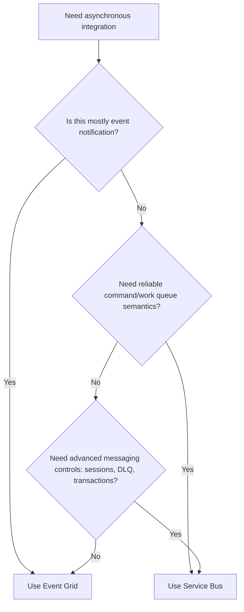
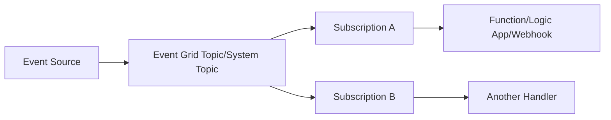
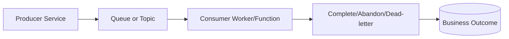
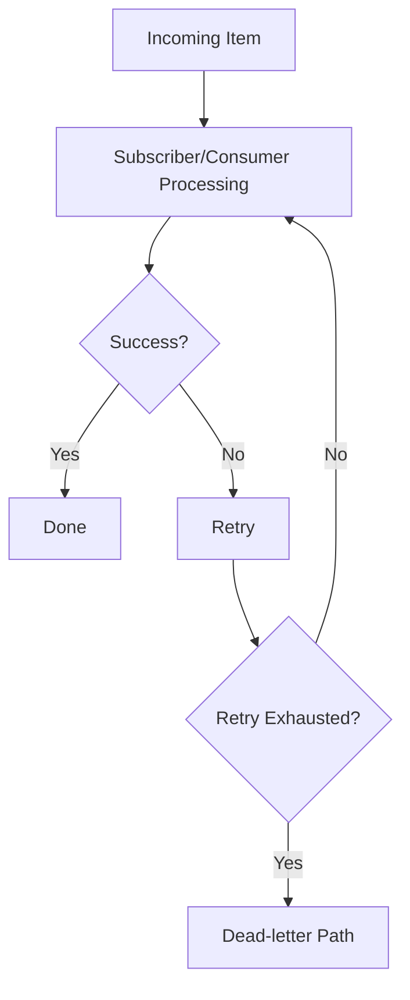
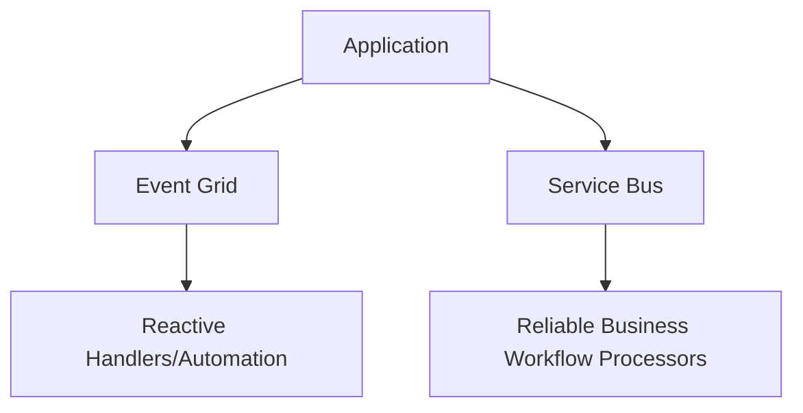

# Azure Event Grid vs Azure Service Bus
## Detailed Interview Preparation Guide with Flow Charts

---

## 1) Direct Interview Answer

Use **Azure Event Grid** for **event notification and reactive routing** (“something happened”).

Use **Azure Service Bus** for **reliable enterprise messaging workflows** (“please do this work reliably”).

> One-liner: *Event Grid is event routing; Service Bus is message brokering for business commands/workflows.*

---

## 2) Core Mindset Difference

- **Event Grid** = Notification-first pub/sub
  - Producer announces state change/event
  - Subscribers react if interested

- **Service Bus** = Workflow/message-processing-first
  - Producer sends commands/messages
  - Consumer processes with strong broker semantics (lock, retry, DLQ, sessions, etc.)

---

## 3) High-Level Decision Flow Chart

---

## 4) Quick Feature Comparison Table

| Area | Event Grid | Service Bus |
|---|---|---|
| Primary Purpose | Event routing/notification | Enterprise message broker |
| Typical Message Meaning | “Something happened” | “Do this work” |
| Pattern | Pub/Sub event fan-out | Queue + Topic/Subscription workflows |
| Delivery Semantics Focus | Event delivery to handlers | Message settlement lifecycle |
| Built-in Queue Semantics | Not queue-first | Strong queue semantics |
| Dead-letter Model | Dead-letter destination support for undelivered events | Native DLQ per queue/subscription |
| Ordering Controls | Not the primary strength | Sessions for ordered processing |
| Transactions | Not primary design goal | Supported in workflow scenarios |
| Long-running work control | Usually handled by subscriber logic | Broker + consumer patterns mature for workflow reliability |
| Best Use Cases | Reactive automation, cloud resource events, lightweight integration | Order/payment workflows, reliable background processing, enterprise integration |

---

## 5) Architecture Flow: Event Grid

Strength:
- Easy fan-out and filtering
- Reactive decoupling

---

## 6) Architecture Flow: Service Bus

Strength:
- Fine-grained processing control
- Reliable workflow semantics

---

## 7) Event Nature: Notification vs Command

## Event Grid style event:
- BlobCreated
- ResourceUpdated
- UserRegistered

Interpretation:
- “FYI, this happened.”

## Service Bus style message:
- ProcessPayment
- ReserveInventory
- GenerateInvoice

Interpretation:
- “Please execute this business action.”

Interview phrase:
> If the intent is command execution with strict processing semantics, Service Bus is usually better.

---

## 8) Subscription and Routing Differences

## Event Grid
- Subscription-based routing with filters
- Great for dynamic event fan-out
- Lightweight event distribution

## Service Bus Topic
- Topic/subscription model with enterprise messaging controls
- Per-subscription retries, DLQ, settlement behavior
- Often used where subscriber processing reliability controls are stricter

---

## 9) Reliability Handling Comparison

## Event Grid reliability pattern
- Event delivery retries
- Dead-letter destination for undeliverable events
- Subscriber should still be idempotent

## Service Bus reliability pattern
- Peek-lock settlement
- Explicit complete/abandon/dead-letter/defer
- Max delivery count and DLQ
- Consumer-driven retry semantics

(Both can do retries; control model differs.)

---

## 10) Ordering and Stateful Workflows

- **Event Grid**: ordering is not primary design target for strict per-entity workflows
- **Service Bus**: supports sessions for ordered per-key processing

If workflow state transition order is critical (e.g., order lifecycle), Service Bus is often preferred.

---

## 11) Throughput and Use-Case Bias

- Event Grid: cloud event fan-out, integration events, reactive automation
- Service Bus: business process reliability, queue workloads, command processing

Not “better/worse”—they optimize for different concerns.

---

## 12) Security Comparison

Both support enterprise security patterns:
- Identity-based authentication/authorization
- RBAC
- Network controls
- Private connectivity options (architecture dependent)

Service choice should be based on messaging semantics first, not only security checklists.

---

## 13) Monitoring Focus Differences

## Event Grid monitoring focus
- Event publish/delivery success
- Subscription delivery failures
- Dead-letter destination growth
- Endpoint response behavior

## Service Bus monitoring focus
- Queue/topic backlog
- Active/dead-letter counts
- Delivery count growth
- Consumer lag/processing latency
- Settlement failure patterns

---

## 14) Typical Scenarios

## Use Event Grid when:
1. Reacting to Azure resource/storage events
2. Broadcasting domain events to multiple lightweight handlers
3. Wiring serverless integrations quickly
4. Event notification is primary concern

## Use Service Bus when:
1. Reliable background job processing is required
2. Command/work queue semantics are needed
3. Ordered per-entity processing is required
4. DLQ/retry/settlement control is central
5. Enterprise workflow integration needs robust broker features

---

## 15) Hybrid Architecture (Common in Real Projects)

Use both together:

Example:
- Event Grid publishes `OrderCreated` notification to analytics/monitoring
- Service Bus handles `ProcessPayment` and `ReserveInventory` commands

---

## 16) Common Mistakes (Interview Gold)

1. Using Event Grid for strict command queue workflows needing advanced settlement  
2. Using Service Bus for all cloud notifications where Event Grid is simpler  
3. Ignoring idempotency in subscribers/consumers  
4. No dead-letter strategy  
5. Confusing event fan-out with work queue distribution  
6. Choosing tool by habit instead of message intent  

---

## 17) Interview Q&A (Strong Answers)

### Q1: Event Grid vs Service Bus in one sentence?
**Answer:** Event Grid routes events for reactive systems; Service Bus brokers reliable business messages and commands.

### Q2: Which is better for OrderCreated fan-out notifications?
**Answer:** Event Grid is often a strong fit for notification fan-out; Service Bus topic can also work if stricter broker controls are needed.

### Q3: Which is better for payment command processing?
**Answer:** Service Bus, because command processing typically needs strong settlement, retry, and DLQ controls.

### Q4: Which supports sessions for ordered processing?
**Answer:** Service Bus (session-enabled entities).

### Q5: Do I still need idempotency with both?
**Answer:** Yes. Retries/redelivery can happen in distributed systems, so handlers/consumers should be idempotent.

---

## 18) 60-Second Interview Pitch

> Azure Event Grid and Azure Service Bus solve different asynchronous integration problems. I choose Event Grid when I need event notification routing and reactive fan-out—especially for cloud-native and serverless event handling. I choose Service Bus when I need reliable enterprise messaging for commands and workflows, including queue semantics, message settlement, retries, dead-lettering, and ordered processing with sessions. In real systems, I often use both: Event Grid for notifications and Service Bus for critical business process execution.

---

## 19) Final Decision Checklist

- [ ] Is this an event notification (“something happened”)? → Event Grid  
- [ ] Is this a command/work item requiring robust processing controls? → Service Bus  
- [ ] Need queue semantics, sessions, explicit settlement, strong DLQ workflow? → Service Bus  
- [ ] Need lightweight event fan-out with subscription filtering? → Event Grid  
- [ ] Need both notification and workflow command processing? → Use both appropriately  

---

## One-Line Conclusion

> Choose Event Grid for reactive event routing and Service Bus for reliable command/workflow messaging with enterprise broker semantics.