# How Does Pub/Sub Work in Azure Event Grid?
## Detailed Interview Preparation Guide with Flow Charts

---

## 1) Direct Interview Answer

Azure Event Grid implements **publish-subscribe (pub/sub) messaging** by letting a **publisher** send events to a **topic**, and then Event Grid **fans out** matching events to one or more **event subscriptions**, each pointing to an independent **handler** (subscriber).

> One-liner: *One event published once, delivered independently to every matching subscription, each with its own filter, retry, and handler.*

---

## 2) Core Pub/Sub Building Blocks

1. **Event Source/Publisher** – generates the event
2. **Topic** (System Topic or Custom Topic) – channel where events are published
3. **Event Subscription** – routing rule connecting topic to a handler, with optional filters
4. **Event Handler (Subscriber)** – destination that processes the event (Function, Logic App, Webhook, Service Bus, Event Hub, Storage Queue, etc.)

---

## 3) Basic Pub/Sub Flow

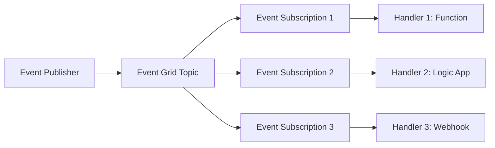

Each subscription receives its **own independent copy** of the matching event.

---

## 4) Step-by-Step Pub/Sub Lifecycle

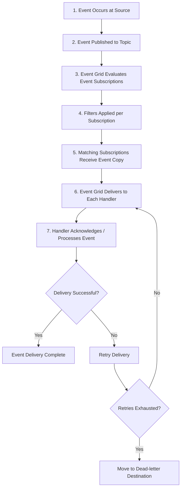

---

## 5) System Topics vs Custom Topics in Pub/Sub

## 5.1 System Topic
Built-in event source from Azure services.

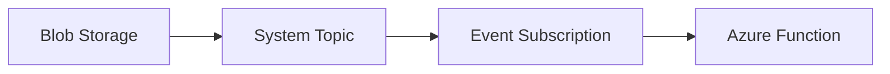

## 5.2 Custom Topic
Your application publishes domain events.

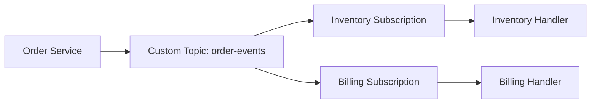

---

## 6) Fan-Out: One Event, Many Subscribers

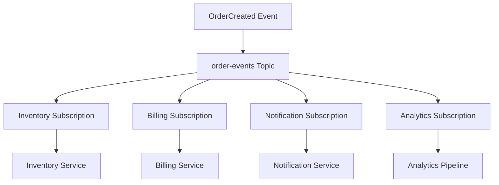

Key pub/sub property:
> Each subscriber is completely independent — one failing does not block the others.

---

## 7) Filtering: Selective Pub/Sub Routing

Event Grid subscriptions can filter using:
- Event type filter
- Subject begins-with/ends-with filter
- Advanced filters on event data properties

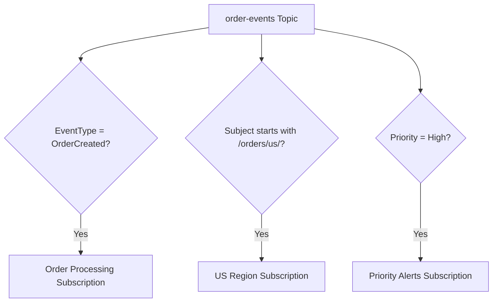

This means:
- Not every subscriber gets every event
- Routing is content-aware, not just blind broadcast

---

## 8) Push Delivery Model

Event Grid uses a **push-based** delivery model:
- Event Grid pushes events to the subscriber endpoint (Function trigger, webhook URL, etc.)
- Subscriber does not need to poll

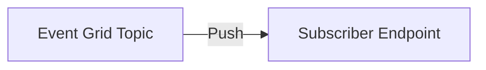

Contrast:
- Some other messaging patterns are pull-based (consumer requests messages)
- Event Grid’s webhook/function-style delivery is push-based

---

## 9) Delivery Retry and Dead-Lettering in Pub/Sub

Each subscription independently manages delivery retries.

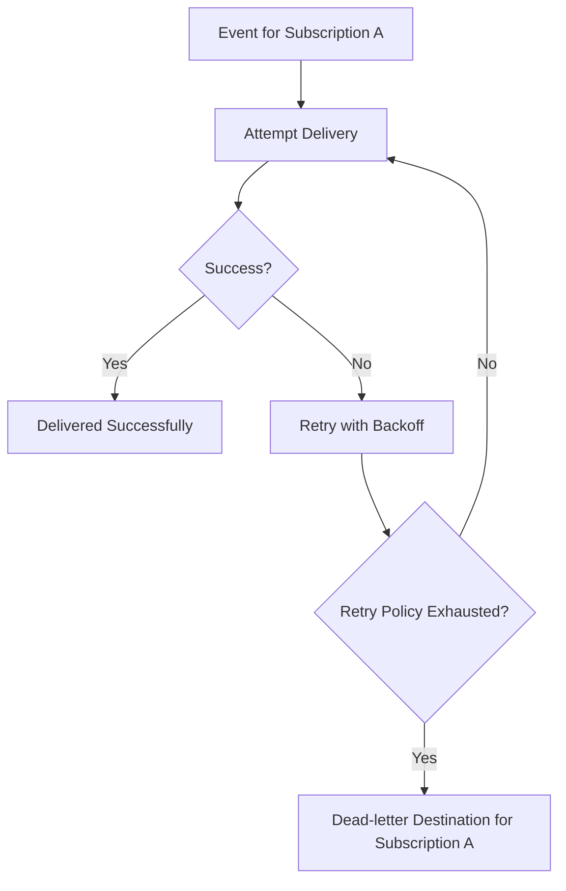

Important:
> Subscription B's retry/DLQ behavior is completely separate from Subscription A's.

---

## 10) Independent Failure Isolation (Core Pub/Sub Benefit)

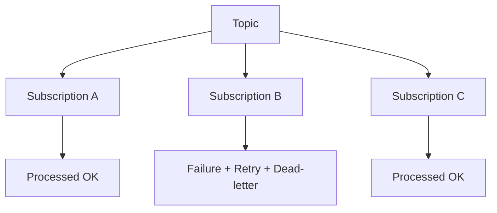

Interview phrase:
> Pub/sub isolation means one subscriber's downtime or bug does not prevent other subscribers from receiving and processing their copy of the event.

---

## 11) Adding New Subscribers Without Changing Publisher

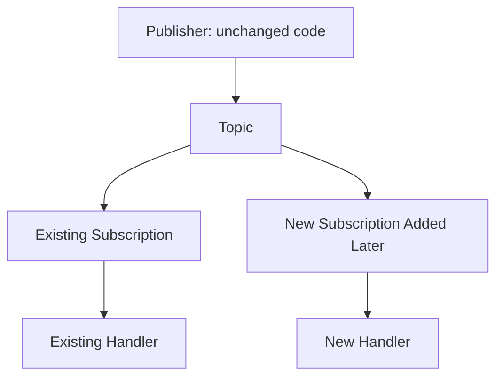

This is one of the biggest architectural benefits:
> New consumers can subscribe to existing event streams without any changes to the publisher.

---

## 12) Event Schema in Pub/Sub

Each event typically includes:
- `id`
- `eventType`
- `subject`
- `eventTime`
- `data` (payload)
- `dataVersion`
- `topic`

Subscribers use these fields for filtering and for parsing the event correctly.

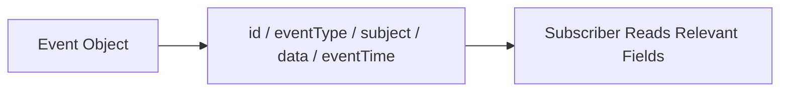

---

## 13) Idempotency in Pub/Sub Handlers (Must Mention)

Because retries can cause duplicate delivery attempts, handlers must be idempotent.

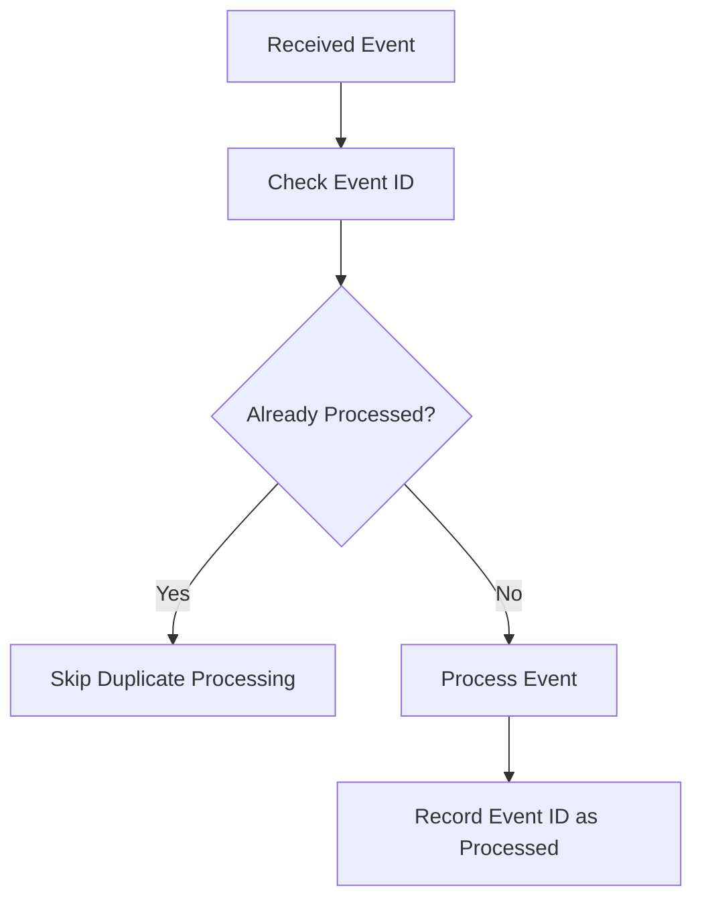

---

## 14) Multiple Handler Types in Pub/Sub

Event Grid subscriptions can route to different handler types simultaneously:

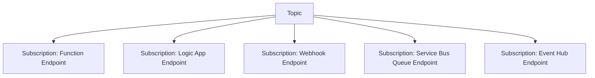

This flexibility allows mixing serverless compute, low-code automation, custom webhooks, and other messaging systems as subscribers.

---

## 15) Pub/Sub Scaling Model

Two scaling dimensions:

1. **More subscriptions** → more independent consumer domains
2. **Handler-level scaling** → each handler (e.g., Function App) scales independently based on its own load

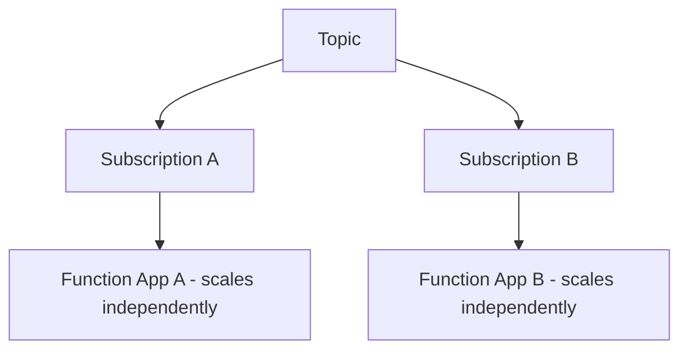

---

## 16) Monitoring Pub/Sub Health

Track per subscription:
- Delivery success rate
- Retry count
- Dead-letter growth
- Endpoint latency/failures
- Matched vs filtered-out event volume

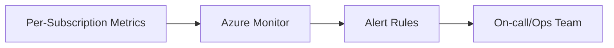

---

## 17) Common Anti-Patterns in Event Grid Pub/Sub

1. No filters, causing subscribers to receive irrelevant events
2. No idempotency in handlers despite retry-based delivery
3. Treating events as strict commands requiring guaranteed ordered processing
4. No dead-letter/monitoring strategy for failed deliveries
5. Overloading a single topic with unrelated event types without clear filtering strategy
6. Ignoring schema versioning for event payloads

---

## 18) Event Grid Pub/Sub vs Service Bus Topic Pub/Sub (Quick Contrast)

| Aspect | Event Grid Pub/Sub | Service Bus Topic Pub/Sub |
|---|---|---|
| Delivery model | Push to endpoint (Function/webhook/etc.) | Consumer pulls/receives from subscription |
| Primary intent | Event notification | Reliable message/work distribution |
| Settlement control | Handler response-based | Explicit complete/abandon/dead-letter by consumer |
| Best for | Reactive, serverless, cloud-native events | Enterprise workflow messaging with strong broker semantics |

---

## 19) Real-World Pub/Sub Example

Scenario: `OrderCreated` event published once, consumed independently by 4 systems.

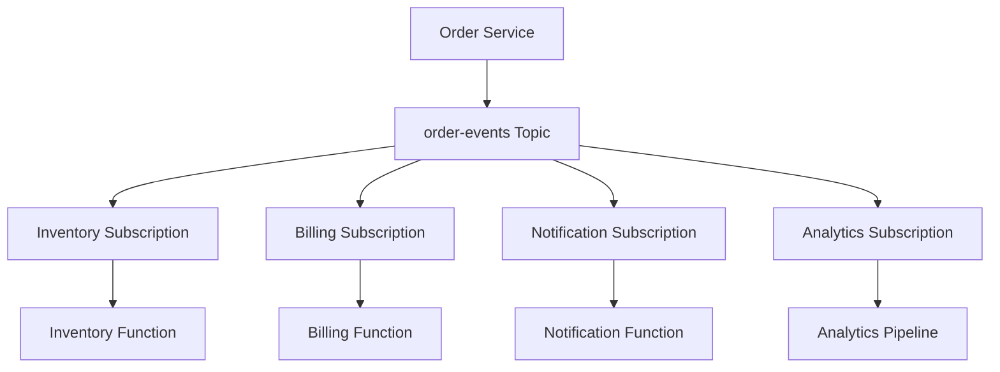

Each function/service:
- Receives its own event copy
- Processes independently
- Retries/dead-letters independently

---

## 20) Interview Q&A (Strong Answers)

### Q1: How does pub/sub work in Event Grid?
**Answer:** A publisher sends an event to a topic; Event Grid evaluates all event subscriptions on that topic, applies filters, and pushes matching event copies independently to each subscriber/handler.

### Q2: Is Event Grid delivery push or pull based?
**Answer:** Push-based — Event Grid actively delivers events to subscriber endpoints like Functions or webhooks.

### Q3: What happens if one subscriber fails?
**Answer:** That subscription retries and may dead-letter independently; other subscriptions continue processing their own event copies unaffected.

### Q4: How do you route only relevant events to a subscriber?
**Answer:** Using event subscription filters based on event type, subject, or advanced data-based filters.

### Q5: Can you add new subscribers without changing the publisher?
**Answer:** Yes — this is a core pub/sub benefit; new event subscriptions can be added independently of publisher code.

### Q6: Do Event Grid handlers need to be idempotent?
**Answer:** Yes, because retries can cause duplicate delivery attempts.

---

## 21) 60-Second Interview Pitch

> In Azure Event Grid, pub/sub works by having a publisher send an event once to a topic. Event Grid then evaluates all event subscriptions attached to that topic, applies any configured filters, and independently pushes matching event copies to each subscriber—whether that's a Function, Logic App, webhook, or another messaging service. Each subscription has its own delivery retry policy and dead-letter behavior, so one failing subscriber doesn't affect others. This model enables loosely coupled, scalable, reactive architectures where new subscribers can be added without touching the publisher, and I always design handlers to be idempotent since retries can cause duplicate deliveries.

---

## 22) Final Checklist

- [ ] Understand topic → subscription → handler flow
- [ ] Explain filtering (event type/subject/advanced filters)
- [ ] Explain push-based delivery model
- [ ] Explain independent retry/DLQ per subscription
- [ ] Explain failure isolation across subscribers
- [ ] Mention idempotency requirement
- [ ] Mention ability to add subscribers without publisher changes

---

## One-Line Conclusion

> Event Grid pub/sub works by publishing one event to a topic and independently pushing filtered copies to each matching subscription's handler, with isolated retry, dead-letter, and failure handling per subscriber.