# What Are Event Subscriptions in Azure Event Grid?
## Detailed Interview Preparation Guide with Flow Charts

---

## 1) Direct Interview Answer

**Event Subscriptions** are routing configurations in Azure Event Grid that define:
1. **Which events** to listen to (from a topic/source)
2. **Which events** to filter (event type, subject, advanced filters)
3. **Where** to deliver matching events (event handler endpoint)

> One-liner: *An Event Subscription is the rule that connects an event source/topic to a destination handler with optional filtering and delivery behavior.*

---

## 2) Why Event Subscriptions Matter

Without event subscriptions:
- Events exist, but nothing consumes them.

With event subscriptions:
- Events are routed automatically to interested handlers.
- Publisher and subscriber remain loosely coupled.
- Multiple handlers can independently consume the same event stream.

---

## 3) Core Flow of Event Subscriptions

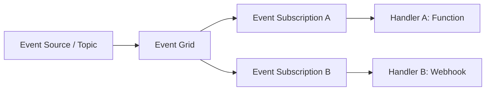

Each subscription is an independent delivery pipeline.

---

## 4) What an Event Subscription Contains

An event subscription usually defines:

1. **Scope/Source**
   - System topic, custom topic, domain topic, or specific Azure resource scope

2. **Event filtering rules**
   - Event types
   - Subject begins with / ends with
   - Advanced filters on event payload fields

3. **Destination endpoint**
   - Azure Function
   - Logic App
   - Webhook
   - Service Bus
   - Event Hubs
   - Storage Queue (depending on routing support)

4. **Delivery behavior**
   - Retry policy
   - Dead-letter destination (optional pattern)

5. **Optional expiration and governance settings**

---

## 5) Event Subscription Lifecycle Flow Chart

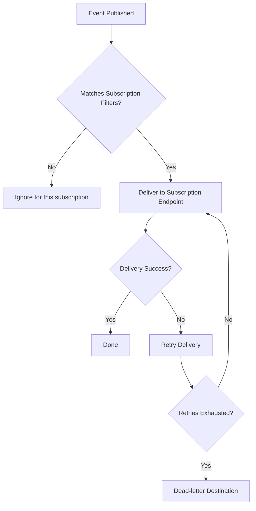

---

## 6) Types of Event Subscription Scopes

## 6.1 Resource-level Subscription
Subscribe to events from one specific Azure resource (e.g., one storage account).

## 6.2 Resource Group / Subscription-level
Subscribe broadly to many resources under a scope.

## 6.3 Topic-level Subscription
Subscribe to custom topic events published by applications.

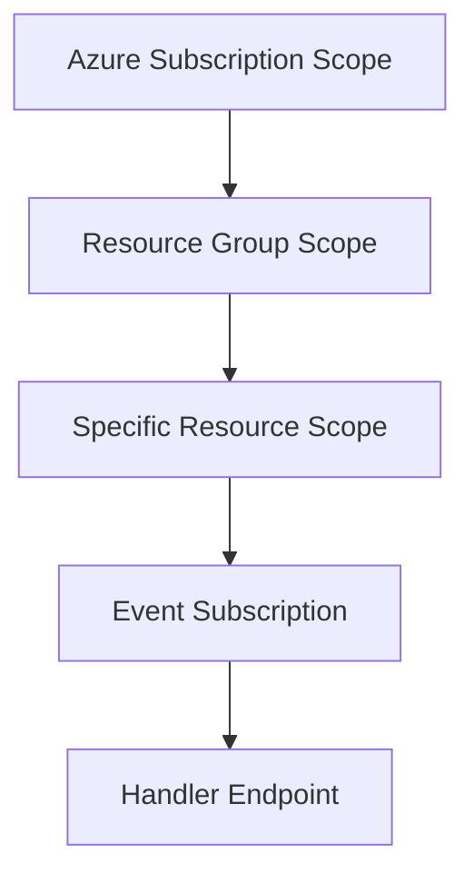

---

## 7) Filtering in Event Subscriptions

Filtering ensures only relevant events are delivered.

## Common filter types:
- Included event types
- Subject prefix/suffix
- Advanced property filters

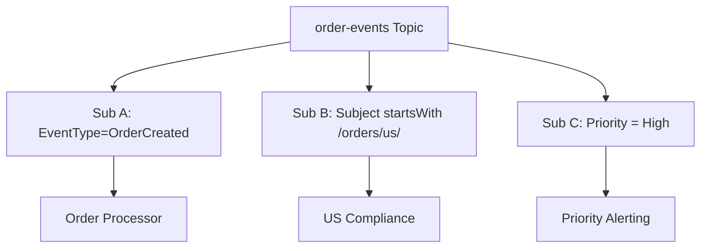

Interview point:
> Filters reduce noise, cost, and unnecessary downstream load.

---

## 8) One Topic, Multiple Event Subscriptions

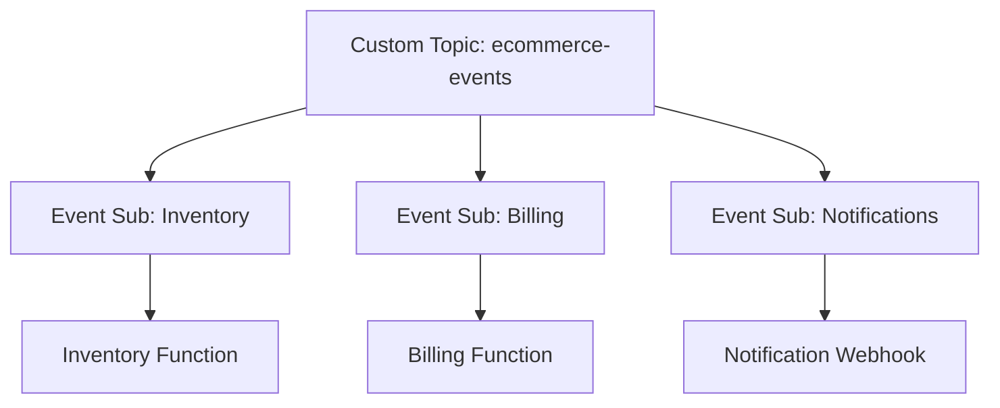

Benefits:
- Independent processing
- Independent scaling
- Independent retry/failure behavior
- No publisher changes needed when adding subscribers

---

## 9) System Topic Example (Azure Service Events)

Scenario: Blob created in Storage account triggers downstream processing.

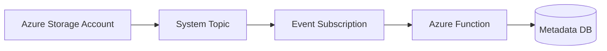

The event subscription is what links storage events to your function endpoint.

---

## 10) Custom Topic Example (Application Events)

Scenario: App publishes order events to custom topic.

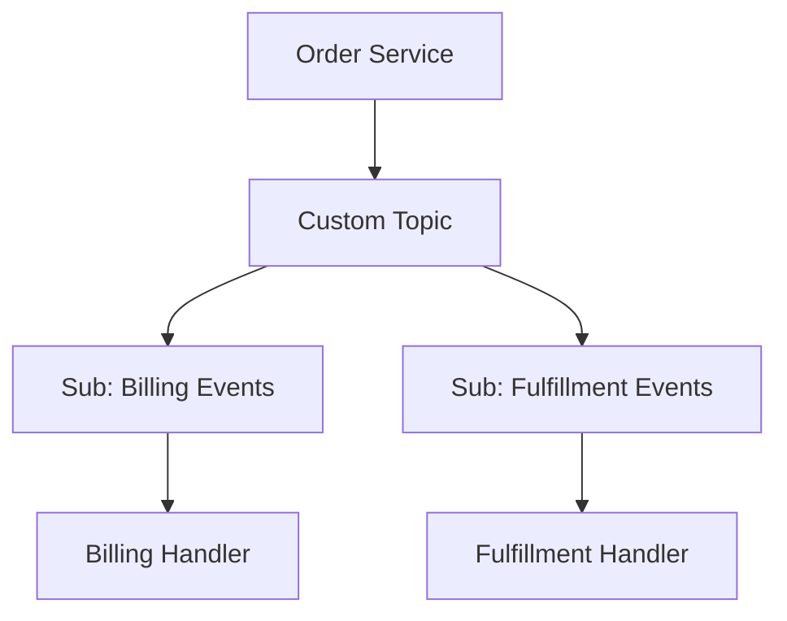

---

## 11) Delivery and Retry Behavior

Event subscriptions manage delivery attempts to destination endpoints.

If endpoint is temporarily unavailable:
- Event Grid retries delivery based on subscription behavior
- Optionally dead-letters undelivered events

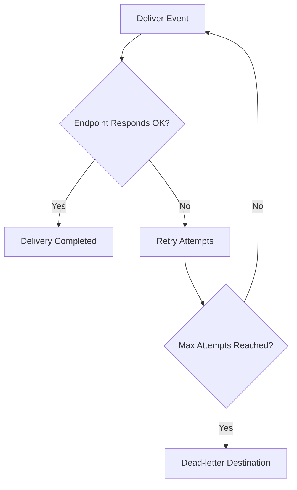

---

## 12) Dead-Letter Destination in Subscriptions

Dead-letter destination allows storing events that could not be delivered successfully after retries.

Use cases:
- Endpoint downtime
- Invalid endpoint auth/config
- Persistent handler errors

This improves recoverability and troubleshooting.

---

## 13) Security Considerations for Event Subscriptions

When creating/managing subscriptions:
- Use RBAC least privilege
- Secure destination endpoints
- Validate webhook ownership/handshake flows
- Protect downstream handlers with auth
- Use managed identity patterns where applicable

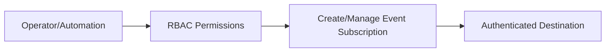

---

## 14) Monitoring Event Subscriptions

Track per subscription:
- Delivery success/failure count
- Retry volume
- Dead-letter growth
- Endpoint latency/errors

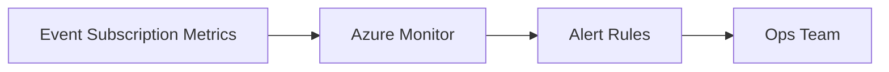

Interview point:
> Monitor each event subscription independently; topic-level visibility alone is not enough.

---

## 15) Event Subscription vs Topic (Common Confusion)

- **Topic** = event channel/source
- **Event Subscription** = routing rule from topic to destination

Simple mental model:
- Topic is the “radio station”
- Event subscription is the “radio tuned to a station with filters”

---

## 16) Event Subscription vs Queue Subscription (Service Bus)

Do not confuse:
- Event Grid Event Subscription (routing configuration)
- Service Bus Topic Subscription (message entity that stores messages)

In Event Grid:
- Subscription is primarily routing + delivery config.
In Service Bus:
- Subscription is a brokered message entity with queue-like behavior.

---

## 17) Real-World Pattern: Multi-Team Event Consumption

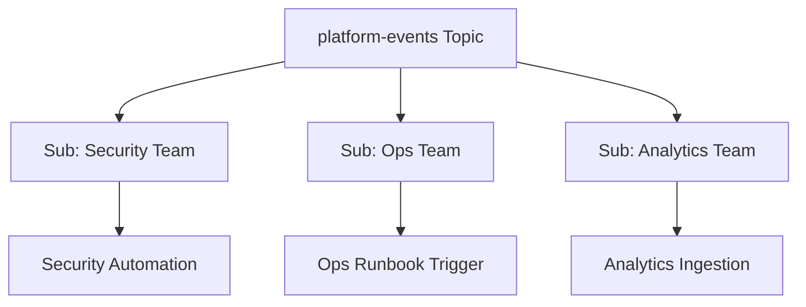

Each team can own and evolve its event subscription independently.

---

## 18) Common Mistakes (Interview Gold)

1. Creating broad subscriptions without filters (event noise overload)  
2. No dead-letter strategy for critical pipelines  
3. Ignoring endpoint auth/security configuration  
4. Assuming one failing subscriber blocks all subscribers  
5. No per-subscription monitoring/alerts  
6. Tight coupling of event schema changes without version strategy  

---

## 19) Interview Q&A (Strong Answers)

### Q1: What is an Event Subscription?
**Answer:** A routing rule in Event Grid that specifies which events from a source/topic should be delivered to which endpoint, with optional filters and delivery settings.

### Q2: Why do we need Event Subscriptions?
**Answer:** They connect event publishers to subscribers without hardcoding integrations and enable filtered, independent event delivery.

### Q3: Can one topic have multiple Event Subscriptions?
**Answer:** Yes, and each subscription independently receives matching events and handles retries/failures separately.

### Q4: What can be filtered in an Event Subscription?
**Answer:** Event types, subject prefix/suffix, and advanced event data fields.

### Q5: What happens if endpoint delivery fails?
**Answer:** Event Grid retries based on delivery policy, and events can be sent to dead-letter destination if retries are exhausted.

### Q6: Is Event Subscription same as Service Bus subscription?
**Answer:** No. Event Grid subscription is a routing configuration; Service Bus subscription is a brokered messaging entity.

---

## 20) 60-Second Interview Pitch

> In Azure Event Grid, an Event Subscription is the core routing configuration that connects an event source or topic to a destination handler. It defines what events to include via filters and where to deliver them, such as Functions, Logic Apps, webhooks, or messaging endpoints. Multiple event subscriptions can be attached to the same topic for fan-out, and each subscription has independent retry and failure behavior, with optional dead-letter handling. This enables loosely coupled, scalable event-driven architectures where new consumers can be added without changing publishers.

---

## 21) Final Checklist

- [ ] Understand source/topic vs subscription vs handler  
- [ ] Explain subscription filtering capabilities  
- [ ] Explain delivery/retry/dead-letter behavior  
- [ ] Explain independent fan-out via multiple subscriptions  
- [ ] Clarify difference from Service Bus subscriptions  
- [ ] Mention monitoring and security best practices  

---

## One-Line Conclusion

> Event Subscriptions are Event Grid’s configurable routing rules that filter and deliver events from a source/topic to one or more destination handlers reliably and independently.