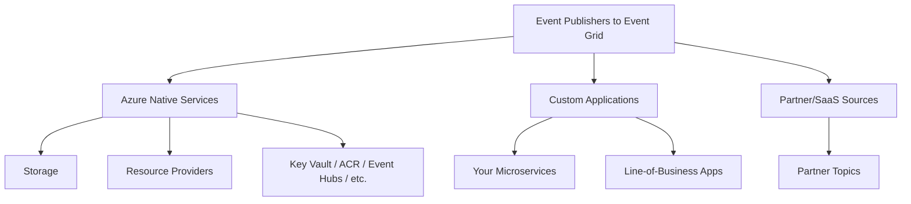
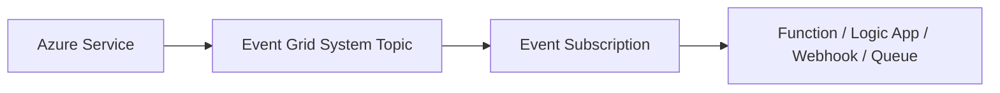
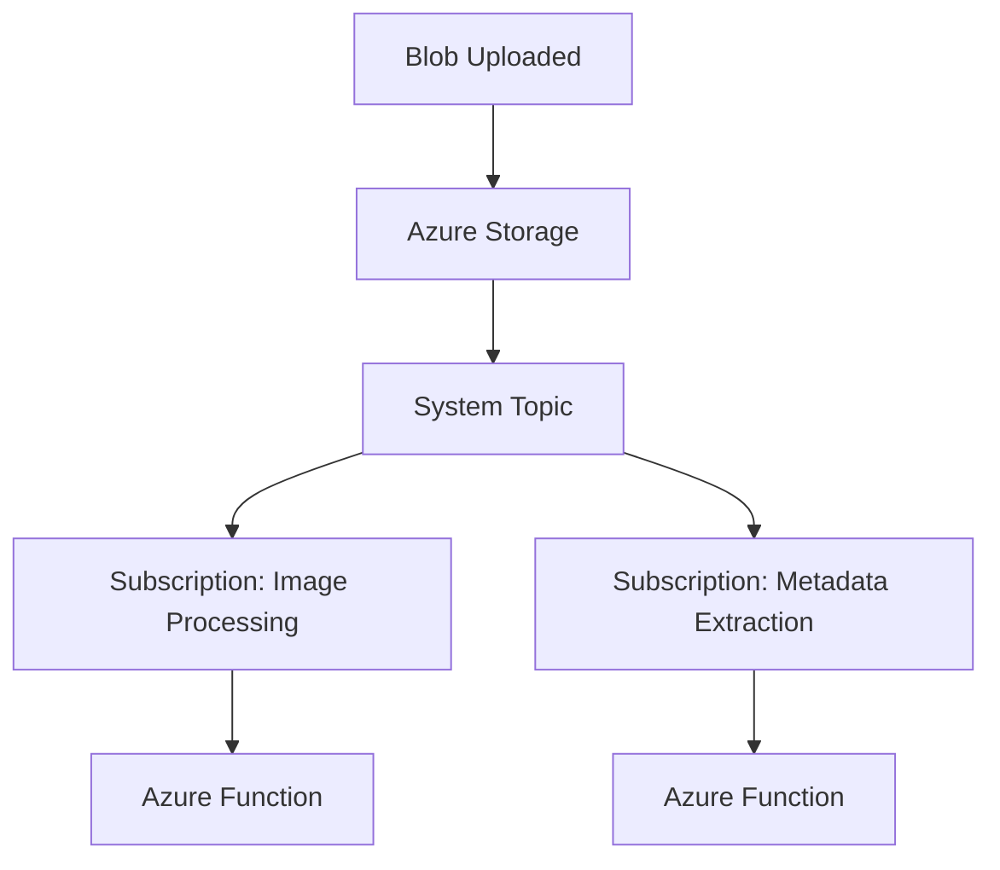
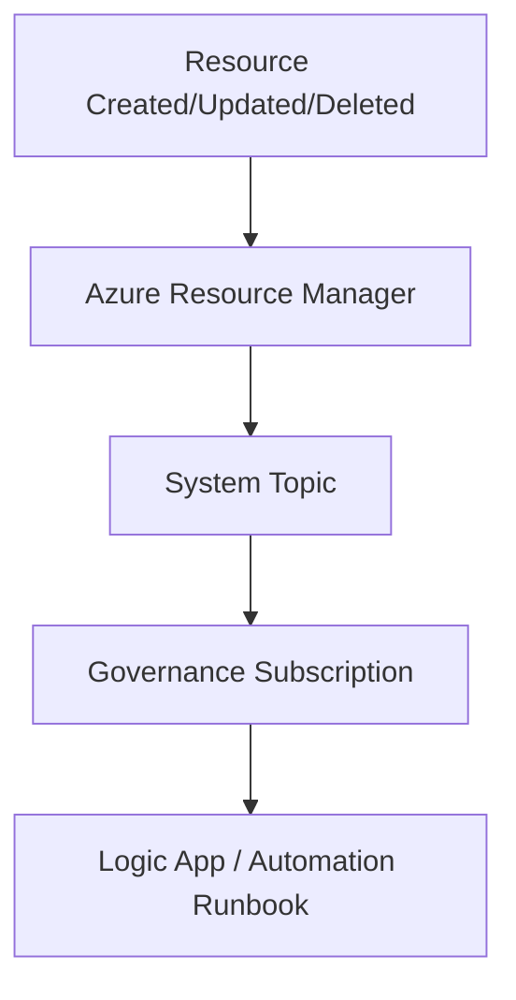
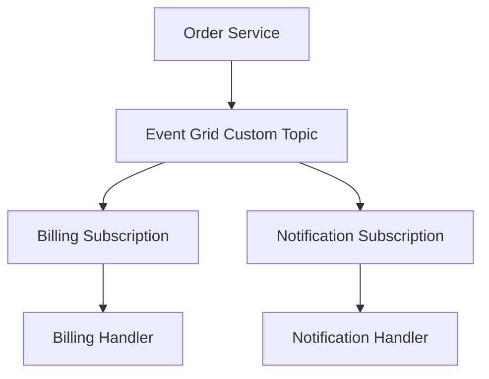
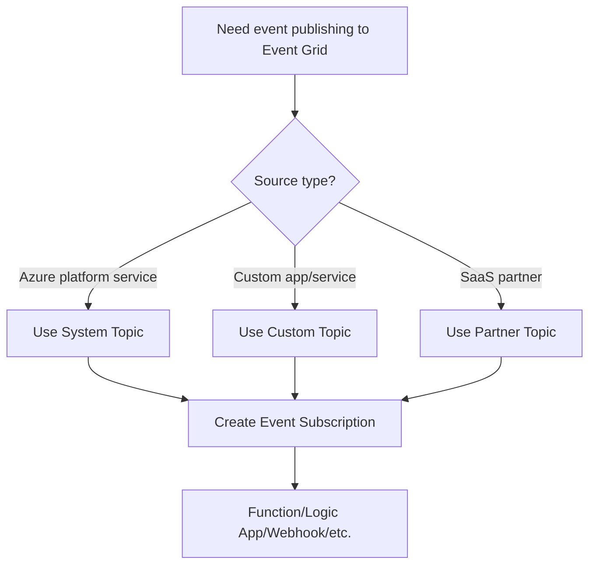
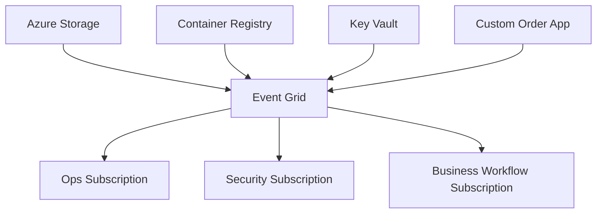
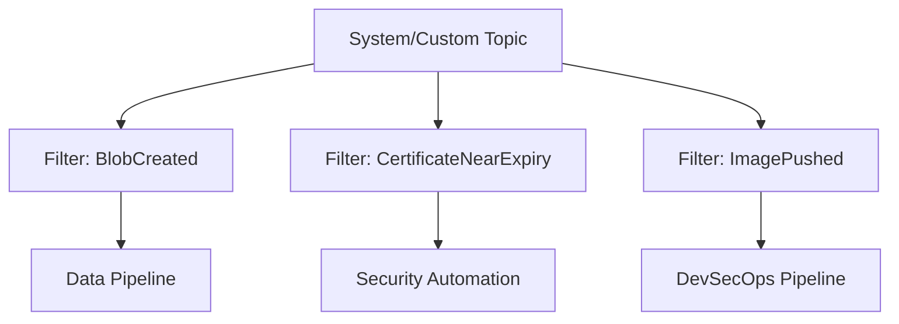

# What Azure Services Can Publish to Event Grid?
## Detailed Interview Preparation Guide with Flow Charts

> **Short answer:**  
> Azure Event Grid can receive events from:
> 1. **Many native Azure services** (through system topics),
> 2. **Your own applications** (through custom topics/namespaces),
> 3. **SaaS/partner event sources** (partner topics).

---

## 1) Direct Interview Answer

Azure services that can publish to Event Grid include commonly used services like:

- **Azure Storage** (Blob, Queue-related events in supported models)
- **Azure Resource Groups / Subscriptions** (resource lifecycle events)
- **Azure Event Hubs**
- **Azure Key Vault**
- **Azure Container Registry**
- **Azure App Configuration**
- **Azure Maps**
- **Azure Media Services**
- **Azure IoT Hub** (supported event integrations)
- **Azure Service Bus** (supported event scenarios)
- **Azure Machine Learning** (supported event scenarios)

And many more supported Event Grid sources via **system topics**.

In addition, **custom applications** can publish their own events to Event Grid custom topics/namespaces.

---

## 2) Big Picture: Three Publisher Categories

---

## 3) How Azure Services Publish to Event Grid

Most Azure services publish platform events through **system topics** managed by Event Grid.

---

## 4) Common Azure Services That Publish Events

Below are important services to remember for interviews (representative, not “only” list).

## 4.1 Azure Storage
Publishes events such as blob created/deleted (and related storage event families depending on configuration).

Use cases:
- File upload processing
- Thumbnail generation
- Data ingestion trigger

---

## 4.2 Azure Resource Manager (ARM) Resources
Resource groups/subscriptions and resource providers can emit management/lifecycle events.

Use cases:
- Governance automation
- Compliance workflows
- Audit-triggered actions

---

## 4.3 Azure Key Vault
Can emit events for certificate/secret/key lifecycle scenarios (supported event set).

Use cases:
- Certificate rotation workflows
- Security operations automations

---

## 4.4 Azure Container Registry (ACR)
Can publish image push/delete and related registry events.

Use cases:
- Trigger image scanning
- CI/CD deployment hooks

---

## 4.5 Azure Event Hubs
Supports Event Grid integration for specific hub-level events (for example capture file creation scenarios in supported configurations).

Use cases:
- Downstream workflow triggers from stream pipeline milestones

---

## 4.6 Azure App Configuration
Can publish configuration change events in supported patterns.

Use cases:
- Dynamic config refresh workflows
- Change approval pipelines

---

## 4.7 Azure Maps / Media / ML / IoT-related Integrations
Certain domain services publish lifecycle/domain events through Event Grid integration.

Use cases:
- Geospatial pipeline events
- Media encoding workflow events
- ML job lifecycle notifications
- IoT operation automations

---

# 5) Interview-Safe Statement About Service List

Because Azure continuously evolves service integrations, the best interview-safe phrasing is:

> “Event Grid supports many Azure services as first-party event sources via system topics, including Storage, ARM resource events, Key Vault, Container Registry, Event Hubs-related scenarios, and more. I verify the exact current list in Microsoft Learn for production design.”

---

## 6) Flow Chart: Storage as Publisher Example

---

## 7) Flow Chart: ARM Resource Events Example

---

## 8) Flow Chart: ACR Publisher Example

---

## 9) Custom Applications as Publishers (Very Important)

Azure Event Grid is not only for Azure platform events.  
Your own applications can publish domain events to **custom topics**.

Typical custom events:
- OrderCreated
- PaymentCompleted
- UserRegistered
- SubscriptionRenewed

---

## 10) Partner Sources (Partner Topics)

Some SaaS/partner ecosystems can publish events to Azure Event Grid via partner topic integrations.

---

## 11) How to Explain “What Can Publish” in Interviews

Strong structured answer:
1. Native Azure services via system topics  
2. Custom applications via custom topics  
3. Partner SaaS via partner topics  

Then give 4–6 concrete examples:
- Storage
- ARM/resource lifecycle
- Key Vault
- Container Registry
- App services/custom business apps
- Event Hubs-related event scenarios

---

## 12) Event Source Selection Flow Chart

---

## 13) Real-World Multi-Source Pattern

Benefits:
- Unified event backbone
- Consistent subscription/filter model
- Decoupled reactive architecture

---

## 14) Filtering Events from Azure Publishers

Even if many services publish events, subscribers should use filters:

- Event type filter
- Subject path filter
- Advanced data filters

This avoids sending irrelevant events to handlers and reduces processing cost.

---

## 15) Reliability and Operations

For each publisher-source integration:
- Configure retries
- Configure dead-letter destination where needed
- Monitor subscription delivery failures
- Ensure handlers are idempotent

---

## 16) Common Mistakes

1. Assuming only Storage can publish to Event Grid  
2. Not distinguishing system vs custom vs partner topics  
3. No filtering on high-volume event sources  
4. No dead-letter strategy for failed deliveries  
5. Ignoring schema/version handling in custom events  

---

## 17) Interview Q&A (Strong Answers)

### Q1: Which Azure services publish to Event Grid?
**Answer:** Many Azure services publish via system topics—commonly Storage, ARM/resource lifecycle events, Key Vault, Container Registry, and others. Custom apps can publish via custom topics, and SaaS partners via partner topics.

### Q2: Can my own application publish to Event Grid?
**Answer:** Yes, using custom topics/namespaces you can publish domain events directly.

### Q3: What is the difference between system topic and custom topic?
**Answer:** System topic is managed for Azure service events; custom topic is for your application-generated events.

### Q4: Do all subscribers receive all events?
**Answer:** Not necessarily. Event subscriptions can filter events by type, subject, and advanced criteria.

### Q5: How do you keep this reliable?
**Answer:** Use retries, dead-letter destinations, idempotent handlers, and monitor delivery failures per subscription.

---

## 18) 60-Second Interview Pitch

> Azure Event Grid accepts events from three publisher categories: Azure native services via system topics, custom applications via custom topics, and partner SaaS sources via partner topics. Common Azure publishers include Storage, resource lifecycle providers, Key Vault, and Container Registry, among others. Event subscriptions then filter and route those events to handlers like Functions, Logic Apps, or webhooks. In production, I apply filtering, retries, dead-letter handling, and idempotent consumers for reliability.

---

## 19) Final Checklist

- [ ] Mention system topics (Azure service publishers)  
- [ ] Mention custom topics (your app publishers)  
- [ ] Mention partner topics (SaaS publishers)  
- [ ] Give concrete examples (Storage, ARM events, Key Vault, ACR, etc.)  
- [ ] Mention filters and delivery reliability  
- [ ] Mention monitoring per subscription  

---

## One-Line Conclusion

> Azure Event Grid can receive events from many Azure services (via system topics), your own applications (custom topics), and partner SaaS sources (partner topics), then route them to subscribers with filtering and reliable delivery patterns.